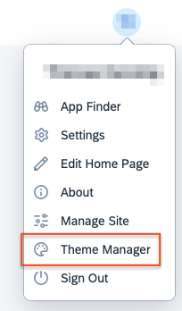
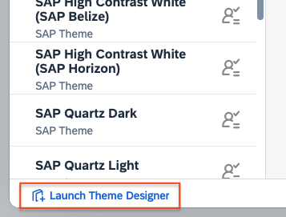
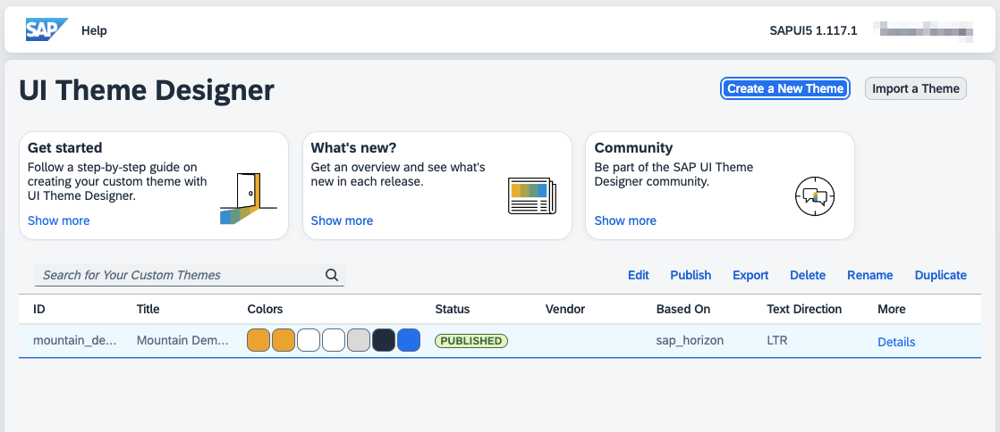
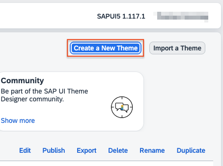
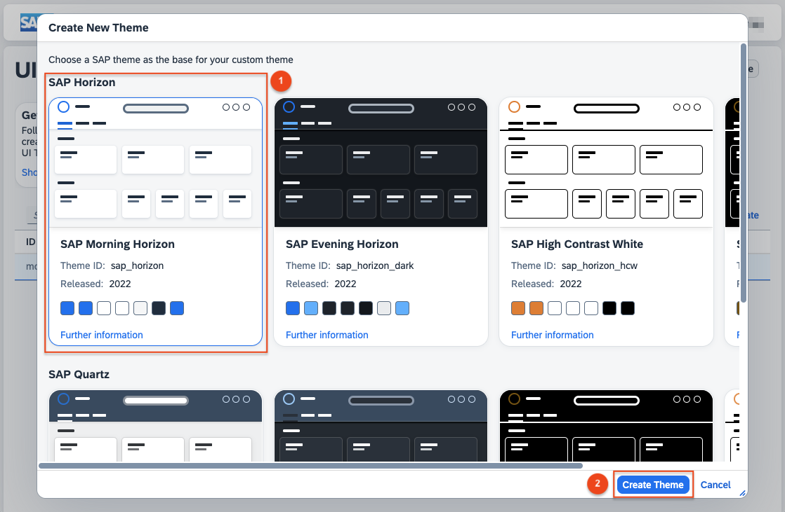
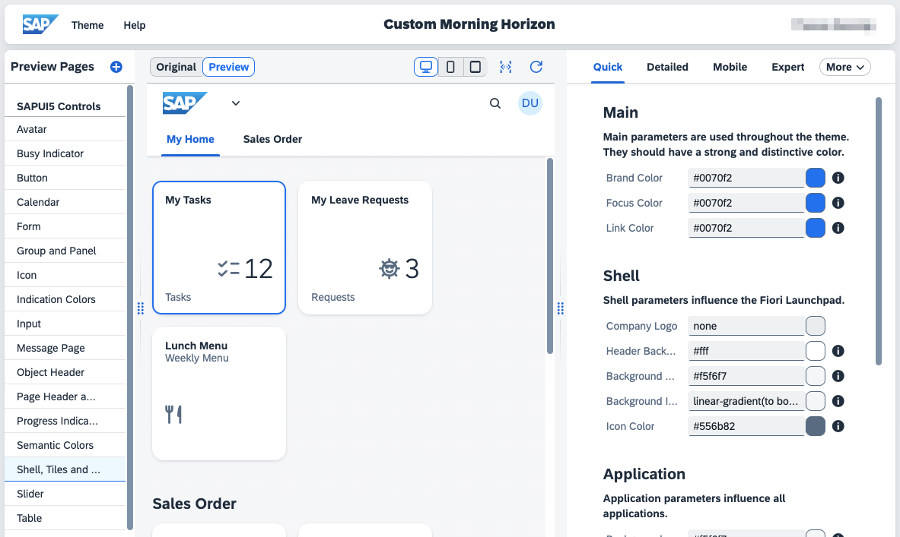

# Add a Cross Origin Preview for the UI Theme Designer
<!-- description --> Add a custom cross origin preview page for the UI theme designer to see the changes directly in your own application UIs.

## Prerequisites
  - [You have set up the SAP Launchpad Service](btp-app-work-zone-subscribe)
  - You have a user with the **Subaccount Administrator** role collection in the subaccount where you set up the SAP Launchpad Service.


## You will learn
  - How to add a custom preview page
  - How to prepare your preview page for theming

---

### Access the Theme Designer

The **UI theme designer** is a business service integrated in the launchpad service and can be accessed via your launchpad site.

1. Access any launchpad site.
2. Click on the user profile icon in the top-right corner to open the dropdown menu. Then click on **Theme Manager**.     

    <!-- border -->
    

3. Click on **Launch Theme Designer** in the bottom-left corner. In the **UI theme designer** you can see an overview of all available custom themes, as well as create new ones. 

    <!-- border -->
    

4. The **UI theme designer** is launched and you get an overview of your already existing custom themes. 

    <!-- border -->
    

### Create a New Theme

From the overview of the **UI theme designer** you can now create a new custom theme (or open an existing one).

Every custom theme is bases on an SAP theme (e.g. SAP Horizon or SAP Quartz)

1. Click on **Create a New Theme** in the top right. <br>

    <!-- border -->
    

2. You see a list of possible SAP themes as the base for your custom theme. Choose **SAP Horizon** and click on **Create Theme** 

    <!-- border -->
    

3. Now you see a screen which is divided into three main parts. On the left you see a list of available preview pages. In the middle the selected preview page is displayed. On the right you get a list of parameters you can change—mainly colors, but also images, fonts, and other values. 

    <!-- border -->
    

### Prepare your Preview Page

Before you can add your own application as a preview page it must undergo preparation to be fit for the theming process. Your application should utilize the SAP theming parameters and respond to the Post Message sent from the UI theme designer when any parameter is modified.

The theming parameters are accessible through the open-source [theming-base-content](https://www.npmjs.com/package/@sap-theming/theming-base-content), which presents them as [CSS Custom Properties](https://developer.mozilla.org/en-US/docs/Web/CSS/Using_CSS_custom_properties). For each theme there is a [`css_variables.css`](https://github.com/SAP/theming-base-content/blob/2a38d0156f3d53fde0301b777f8d856266e70d35/content/Base/baseLib/sap_horizon/css_variables.css) file containing all parameter definitions. For the purposes of this tutorial, we will leverage the _unpkg.com_ service and enable the direct referencing of npm packages via URL.

1. Considering a minimal HTML example, you just add the following element:
    ```HTML
    <link rel="stylesheet" href="https://unpkg.com/@sap-theming/theming-base-content/content/Base/baseLib/sap_horizon/css_variables.css">
    ```
    As you now loaded the `css_variables.css` in your HTML example you can directly start to use the CSS variables:
    <!-- <body style="background-color: var(--sapBackgroundColor)"></body> -->
    ```CSS
    body {
        background-color: var(--sapBackgroundColor);
    }
    ```


2. Whenever a theming parameter is altered in the **UI theme designer**, a Post Message will be generated containing the `css_variables.css`, including the updated parameters.

    The Post message contains an object with the following structure:
    ```JSON
    {
        "type": "theming-ui:theme-changed",
        "cssVariables": "<ALL CSS VARIABLES WITH CURRENT VALUE AS STRING>"
    }
    ```
3. You need to implement a script to react to the Post Message sent by the **UI theme designer** and to overwrite the style of the loaded base theme.

    In order for this to work you add an additional style tag with the id **`cssVariablesStyleTag`**:
    ```html
    <style id="cssVariablesStyleTag"></style>
    ```
4. The script part will for example look something like this:
    ```JavaScript
    const cssVariablesStyleTag = document.getElementById('cssVariablesStyleTag');
    addEventListener('message', ({data}) => {
        if (data.type === 'theming-ui:theme-changed') {
            cssVariablesStyleTag.textContent = data.cssVariables;
        }
    });
    ```
The script listens to incoming Post Messages and checks the data for the type **`theming-ui:theme-changed`**. Then it sets the text content of the style tag **`cssVariablesStyleTag`** to all the CSS variables coming from the Post Message. Below is a complete example on how an application can look like with the integration for the UI theme designer support.
```JavaScript
<!doctype html>
<html>
<head>
  <title>My Preview Page</title>
  <link rel="stylesheet" href="https://unpkg.com/@sap-theming/theming-base-content/content/Base/baseLib/sap_horizon/css_variables.css">
  <style id="cssVariablesStyleTag"></style>
  <style>body { background-color: var(--sapBackgroundColor); }</style>
</head>
<body>
  <script>
    const cssVariablesStyleTag = document.getElementById('cssVariablesStyleTag');
    addEventListener('message', ({data}) => {
        if (data.type === 'theming-ui:theme-changed') {
        cssVariablesStyleTag.textContent = data.cssVariables;
        }
    });
  </script>
</body>
</html>
```


### Add Your Preview Page in the UI Theme Designer

In the **UI theme designer** you can select between different builds in preview pages to see the changes you are planning to do. Additionally you can add your own preview page to directly have the look and feel of your own applications. 

1. In the left area click on the ⊕ besides the **Preview Pages**.
2. Enter the URL of the application you want to use as a preview page
3. Optionally you can enter a name for the preview page
4. Press **Add**.
5. A popup will inform you that your preview page is accessed cross origin. Click **OK**.
6. Now click on the left area under **Applications** on your new preview page.

Your preview page is now open and you can start customizing. Any modifications made will immediately be reflected on your preview page.

>**Note:** You have to host the application on your own! **The UI theme designer** only loads the content of your application. 
