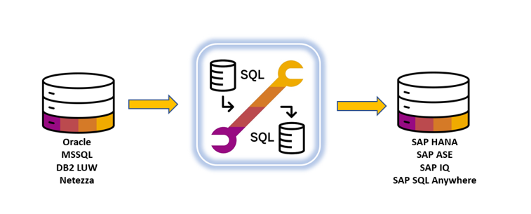

# Convert Oracle-to-SAP HANA with Advanced SQL Migration Tool
<!-- description --> Convert an Oracle schema used by a custom application to SAP HANA using SAP Advanced SQL Migration tool

## Prerequisites
 - Oracle DB instance (version >= 11), where a new user and SQL objects will be created with a script provided in the tutorial
 - Oracle JDBC driver (ojdbc7.jar)
 - SAP HANA or SAP HANA Cloud instance. Minimum versions are 2.0 rev31 and QRC3-2021 respectively
 - SAP Advanced SQL Migration tool installed and configured properly as indicated in the installation guide:  <https://dam.sap.com/mac/app/p/pdf/asset/preview/cLmo5vJ?ltr=a>
 - Java >= 1.8 installed in the host where the migration tool is executed

## You will learn
- Convert Oracle schema to SAP HANA

## Intro
The SAP Advanced SQL Migration tool is SAP's migration tool to migrate custom applications running on top of non-SAP databases into SAP databases.

  <!-- border -->

The tool can extract SQL data models (e.g., tables, views, indexes) and SQL objects containing SQL code (e.g., stored procedures, functions) via either accessing source database catalogs or using text files containing the object definitions (DDLS) and convert them to the chosen target SAP database.

---

### Create Oracle user and application data model


1. Download the script provided in the link below (`APPDEMO2.sql`) and copy it to a local folder (e.g. `c:\sql_scripts\APPDEMO2.sql`) in a host where you have the Oracle client installed and access to the Oracle instance:

    <https://d.dam.sap.com/a/cxJYuQ3>

2. Connect to the Oracle database with the `sqlplus` utility and run the script with `@` directive:

    `@ c:\sql_scripts\APPDEMO2.sql`

    


### Create project folder and project configuration


1. Create what will be the project folder, for example, `C:/tmp/Advanced_SQL_Mig_tutorial`.

    

2. Open a migration tool command line with `C:\cygwin\start_bash.bat`.

    > Check the installation guide if needed (see Prerequisites).

3. From the command line, execute the migration tool utility `sapdbmtk` with `config` option, specifying the full path to the project folder:

    `sapdbmtk config C:/tmp/Advanced_SQL_Mig_tutorial`

4. The `Source/Targe DBs` configuration window appears. Select `Oracle` as source DB and `SAP HANA` with the corresponding version as target.

    

5. Click **Save & Continue**.

    A popup window appears asking you to save the selected databases. Click  **OK** and the migration tool configuration window for this particular project appears.

    

6. Set the following options as indicated (if you want to get information for an option click the corresponding question mark):

    - ID # 110 > IP address for the host (or hostname) where the gateway will run
     (for simplicity the gateway can run on the same host as the migration tool is running)

    - ID # 111 > port where the gateway will listen (e.g., `12345`)

    - ID # 112 > set to `600`

    - ID # 113 > set to `no` if you want to keep gateway up when extract command finishes

    - ID # 120 > set to `in ('APPDEMO2')` (this will make the extract command get only objects under APPDEMO2 schema)

    - ID # 201 > set the default password you want to use for users to be created in SAP HANA

    - ID # 210 > set to `yes`

    - ID # 212 > increase the default value to `150`

    - ID # 220 > set to `INT`

    - ID # 221 > set to `300`

    - ID # 222 > set to `numeric (8,2)`

    - ID # 223 > set to `INT`

    - ID # 300 > set to `direct_select`

    - ID # 330, # 331, # 332 > set to `lowercase`

    - ID # 383 > set to `warning`

    - ID # 740 > tenant DB name in SAP HANA

    - ID # 751 > host where SAP HANA is running

    - ID # 752 > port where SAP HANA is running

    - ID # 753 > SAP HANA username, for simplicity use SYSTEM to avoid having missing permissions

    - ID # 754 > SAP HANA user password for user specified in previous parameter

    - ID # 757 > set to `no`

7. Click **Validate & Save**, and a popup window appears to confirm the changes.

    Click **OK** and then **Exit** to finish the configuration window.

The project folder is configured now, and a subfolder called `config` is created.


> Every migration tool command creates a log file located under subfolder called `reports` (the folder is created automatically if it doesn't exit).


### Extract data model and SQL objects


Data model and SQL objects extraction can be done either by connecting to the source database via the migration tool gateway or using text files with object definitions (DDLS). Section 1 is mandatory and you will go through the extraction via the migration tool gateway. Then section 2 is optional, do it if you want to see the extraction using a text file as well.

> **IMPORTANT:** It is recommended for you to try both methods, go through the gateway first in section 1 and then go through optional steps in section 2

### Extract using the migration tool gateway

The migration tool gateway is usually executed in a separate host, but for simplicity in this tutorial it will be executed in the same host where the migration tool is installed, notice that Java version 1.8 minimum is required to run the gateway.

You are going to configure and start the gateway now.

1. Open `config.properties` file under `c:\sapdbmtk\gateway` folder and modify lines 4 and 5 as described in the picture below.

    The `bindaddress` should be the `ipadress`/`hostname` for the host where the migration tool is installed, and the port should be the one you have specified in configuration setting with `ID #111` (12345 as specified in step number 2).

    

2. Oracle JDBC driver has to be installed in the host where the gateway runs -- in this case it is installed under `c:\sapdbmtk\Gateway\ora_jdbc` (`ojdbc7.jar`).

    

3. Create a `.bat` file called `START_SAPDBMTK_Gateway_oracle.bat` under `c:\sapdbmtk\gateway` to start the gateway, you can use a variable to set the full path to the JDBC driver, the content of the file should be this:

    ```
    set ORACLE_JDBC=C:\sapdbmtk\gateway\ora_jdbc\ojdbc7.jar
    start_sapdbmtk_gateway %ORACLE_JDBC%
    ```

    

4. Start the gateway executing the new `START_SAPDBMTK_Gateway_oracle.bat` file -- a new command line window will be opened. Check that the `ipadress`/`hostname` and port are the right ones.

    

    You are ready to run the migration tool `extract` command.

5. Once the gateway is up and running execute the migration tool utility `sapdbmtk` with `extract` option, the command line parameters you have to specify are:

    `sapdbmtk extract <project_folder> <ora_intance> <ora_host> <ora_port> <ora_user> <passwd>`

    For example:

    `c://sapdbmtk 32# sapdbmtk extract C:/tmp/Advanced_SQL_Mig_tutorial <ora_intance> XXX.XXX.XXX.XXX 1521 <oracle_user> <system_passwd>`

    NOTE: the Oracle user you specify for this command needs to have read permissions on the catalogs, it will not perform any modification in the source database, SELECT_CATALOG_ROLE is enough for this purpose.

    > **IMPORTANT:** windows firewall or antivirus software can prevent the migration tool connecting to the gateway, if you have connectivity issues try stopping/configuring firewall/antivirus

6. When you execute the `extract` option for the first time in a new project folder you will get 2 popup windows to confirm that compliance with 3rd party rights has been verified. When each of those 2 popup windows appears just read and click on **I confirm**, then rerun the command again (you will have to rerun the command twice the first time).

    

7. Execute the `extract` command, you will see something like this.

    

    The `extract` command is done when you get the prompt again.

    

    > The complete output for the extract is located under `<project_folder>\reports` in a file named <ORA_SERVER_name\>.SQL-Extraction.Oracle-HANA.YYYYMMMDD.hhmiss.log

    With the `extract` command the migration tools builds its own metadata about the data model and SQL objects found in the source database. A new subfolder called `extracted` is created under the project folder, in it you will find a file for every SQL object like a stored procedure/function/trigger. and another subfolder called `catalog` storing files with information about users, tables, columns and so forth.

    

### Extract using text file containing object definitions (OPTIONAL)

> Before proceeding with this optional step you have to delete subfolder called `extracted` under the project folder, it was generated when running `extract` option with the Gateway and will generate it again now

1. DDL file/s preparation.

    The script that is provided and used to create the Oracle user and data model in step 1 can be used for this purpose as well.

    Copy that script (`APPDEMO2.sql`) to the Windows host where the migration tool is running, for example, under folder `c:\sql_scripts\APPDEMO2.sql`.

2. Migration tool `extract_offline` command.

    Migration tool `extract_offline` command is used to perform the extract using a text file, this command has the following command line parameters:

    `sapdbmtk extract_offline <project_folder> '<full_path_to_text_file>'`

    Execute this command with the right parameters in your case:

    `sapdbmtk extract_offline C:/tmp/Advanced_SQL_Mig_tutorial 'c:/sql_scripts/APPDEMO2.sql'`

    The output when it starts will be something like this:

    

    Once the command is finished you will see the following:

    

    > Subfolder `extracted` is created under the project folder in the same way it was created for the `extract` command in section 1.


### Convert to SAP HANA


Once the source data model and SQL object are extracted, the next step is to run the conversion to the target database -- SAP HANA in this case. For that, you have to use the migration tool `convert` command with the following parameters:

`sapdbmtk convert <project_folder>`

For example:

`c://sapdbmtk 32# sapdbmtk convert C:/tmp/Advanced_SQL_Mig_tutorial`

When you run the `convert` command, you can see this output in the command line window.


And once it is completed, you will get the prompt with this output:


> The complete output for the extract is located under `<project_folder>\reports` in a file named `SQL-Conversion.Oracle-HANA.YYYYMMMDD.hhmiss.log`.

When `convert` is executed, 2 new subfolders are created in the project folder: `converted_orig` and `scripts`.

- In `converted_orig` you can find a `.sqlscript` file with the converted code for each procedure/function/trigger and a `.convertlog` file per object as well with conversion details.

- In `scripts` you can find all the ready-to-run shell scripts and SQL scripts generated by the migration tool to be directly executed against the target database. Notice that a copy of `converted_orig` folder is created under `scripts` with name `converted`.


### Run converted scripts


After running the `convert` command two shell scripts called `run_ddl_scripts.sh` and `run_sql_scripts.sh.` have been created under `<project_folder>\scripts`, they are ready to be executed against SAP HANA. The former will create the data model (tables/views/indexes/synonyms …etc.) and the latter will create SQL objects like stored procedures, functions, views,...etc.

Below you see how they look like, this screen shot belongs to `run_ddl_scripts.sh` but `run_sql_scripts.sh` is similar. Notice that the connection parameters specified in configuration settings `#740, #750, #751, #752, #753 and #754` (this was done in step number 2) are used in these 2 shell scripts.


1. Execute `run_ddl_scripts.sh`, which will give you something like this:

    

    When it is complete, you will get the prompt and an output similar to this:

    

    **Note:** If you are using SAP HANA Cloud you will get some warnings when executing this script.

2. Execute `run_sql_scripts.sh`, which will give you something like this:

    

    When it is complete, you will get the prompt and an output similar to this:

    

    **Note:** You will get some warnings as well if you are using SAP HANA Cloud in the same way you got them when running `run_ddl_scripts.sh`.

    After running these two shell scripts, the data model and SQL objects have been created into SAP HANA, you can check it with SAP HANA Studio.

    


### Check Oracle and SAP HANA behavior


Run some SQL stuff in Oracle to force a couple of errors and see how Oracle behaves, then run exactly the same in SAP HANA to confirm it is working similarly and showing the same behavior after the conversion.

1. Oracle

    Open the provided text file with the Oracle data model (`APPDEMO2.sql`) and check the SQL code for a stored procedure called `appdemo2.insert_author`.

    Notice that it is checking different things before performing the real insert into `appdemo2.authors` table and raising errors when apply -- for example, it checks that `state` value is no longer than 2 characters and `phone` has an specific format with no letters (it is being validated using an Oracle function).

    

    Connect to your Oracle instance with the `sqlplus` utility and run the following procedure call:

    ```SQL
    call appdemo2.insert_author (
    'Javier',
    'Martin',
    '+34 a666 666',
    'C/ Torrelaguna Nº 77',
    'Madrid',
    'MAD',
    'Spain',
    '28043',
    null
    )
    /
    ```

    It fails with the following error:

    

    Modify the stored procedure call by removing last letter (`D`) from `state` field:

    ```SQL
    call appdemo2.insert_author (
    'Javier',
    'Martin',
    '+34 a666 666',
    'C/ Torrelaguna Nº 77',
    'Madrid',
    'MA',
    'Spain',
    '28043',
    null
    )
    /
    ```

    Run the new stored procedure call, and a second error appears:

    

    Modify the stored procedure call again by removing character `a` from `phone` field:

    ```SQL
    call appdemo2.insert_author (
    'Javier',
    'Martin',
    '+34 666 666',
    'C/ Torrelaguna Nº 77',
    'Madrid',
    'MA',
    'Spain',
    '28043',
    null
    )
    /
    ```

    Run the stored procedure call again. Now it works well and the author is created.

    


2. SAP HANA

    Now you are going to repeat the same procedure calls against SAP HANA and see that behavior is similar to Oracle.

    Connect to your SAP HANA instance with `hdbsql` using the following parameters:

    `hdbsql -u SYSTEM -p XXXXXX -n <ipdress>:<port> -d <SID> -j -A -m -fn -a -cgo -strictseparatorline`

    Run the following stored procedure call:

    ```SQL
    call appdemo2.insert_author (
    'Javier',
    'Martin',
    '+34 a666 666',
    'C/ Torrelaguna Nº 77',
    'Madrid',
    'MAD',
    'Spain',
    '28043',
    null
    )
    go
    ```

    Notice that the same error you had in Oracle is appearing in SAP HANA as well.

    

    Modify the stored procedure call by removing `D` from `state` field:

    ```SQL
    call appdemo2.insert_author (
    'Javier',
    'Martin',
    '+34 a666 666',
    'C/ Torrelaguna Nº 77',
    'Madrid',
    'MA',
    'Spain',
    '28043',
    null
    )
    go
    ```

    Run the stored procedure call again and the second error pointing to an invalid phone appears.

    

    Modify the stored procedure call by removing character `a` from the phone number:

    ```SQL
    call appdemo2.insert_author (
    'Javier',
    'Martin',
    '+34 666 666',
    'C/ Torrelaguna Nº 77',
    'Madrid',
    'MA',
    'Spain',
    '28043',
    null
    )
    go
    ```

    Run the stored procedure again, you see now that it work properly and the new author is created

    

