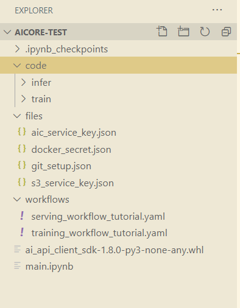

## Details
### You will learn
  - How to configure and deploy workflows with SAP AI API Client SDK.

---


[ACCORDION-BEGIN [Step 1: ](Import python packages for SAP AI API Client SDK)]

Ensure you have the following directory structure to complete this step **(contents of each file given in previous tutorials)**

!

Also ensure your model training is completed without error, because the weights of the model are derived from training tutorial.

Execute the following python code on your Jupyter notebook cell

```PYTHON
import sys, os
import json
import requests
import base64
import time
import yaml
from IPython.display import clear_output
from pprint import pprint

from ai_api_client_sdk.ai_api_v2_client import AIAPIV2Client
from ai_api_client_sdk.models.artifact import Artifact
from ai_api_client_sdk.models.status import Status
from ai_api_client_sdk.models.target_status import TargetStatus
from ai_api_client_sdk.models.parameter_binding import ParameterBinding
from ai_api_client_sdk.models.input_artifact_binding import InputArtifactBinding
```


[DONE]
[ACCORDION-END]


[ACCORDION-BEGIN [Step 2: ](Extract information from workflow and training output)]

Extract necessary information from the serving workflow and the output from the training!

Execute the following python code on your Jupyter notebook cell


```PYTHON
serving_workflow_file = 'workflows/serving_workflow_tutorial.yaml'
with open(serving_workflow_file) as swf:
    serving_workflow = yaml.safe_load(swf)

scenario_id = serving_workflow['metadata']['labels']['scenarios.ai.sap.com/id']
input_artifact_name = serving_workflow['spec']['inputs']['artifacts'][0]['name']
executable_name = serving_workflow['metadata']['name']

training_output = 'training_output.json'
with open(training_output) as to:
    serving_input = json.load(to)
```

Example output    
*No Output*


[DONE]
[ACCORDION-END]


[ACCORDION-BEGIN [Step 3: ](Create SAP AI API Client SDK instance)]

Execute the following python code on your Jupyter notebook cell


```PYTHON
resource_group = "tutorial"

aic_service_key = 'files/aic_service_key.json'
with open(aic_service_key) as ask:
    aic_s_k = json.load(ask)

ai_api_v2_client = AIAPIV2Client(
    base_url=aic_s_k["serviceurls"]["AI_API_URL"] + "/v2/lm",
    auth_url=aic_s_k["url"] + "/oauth/token",
    client_id=aic_s_k['clientid'],
    client_secret=aic_s_k['clientsecret'],
    resource_group=resource_group)
```

Example output

*No Output*

[DONE]
[ACCORDION-END]


[ACCORDION-BEGIN [Step 4: ](Create serving configuration)]


Similar to the training configuration *(previous tutorial)*, create a serving configuration, to bind the model with workflows. This time the input artifact is the trained model.

Execute the following python code on your Jupyter notebook cell

```PYTHON
artifact_binding = {
    "key": input_artifact_name,
    "artifact_id": serving_input["id"]
}

serve_configuration = {
    "name": "dev-tutorial-serving-configuration",
    "scenario_id": scenario_id,
    "executable_id": executable_name,
    "parameter_bindings": [],
    "input_artifact_bindings": [ InputArtifactBinding(**artifact_binding) ]
}

serve_config_resp = ai_api_v2_client.configuration.create(**serve_configuration)

assert serve_config_resp.message == 'Configuration created'

pprint(vars(serve_config_resp))
print("configuration for serving the model created")
```

Example output

```
{'id': '616f05fe-f5eb-4a65-969a-9d4f6131bc85',
 'message': 'Configuration created'}
configuration for serving the model created
```


[DONE]
[ACCORDION-END]


[ACCORDION-BEGIN [Step 5: ](Start serving deployment)]

Start the configuration for serving from previous step, this will be called **deployment**, its similar to the training execution.

Execute the following python code on your Jupyter notebook cell

```PYTHON
deployment_resp = ai_api_v2_client.deployment.create(serve_config_resp.id)
pprint(vars(deployment_resp))
```

Example output

```
{'deployment_url': '',
 'id': 'd4bdc7b8df3f71d7',
 'message': 'Deployment scheduled.',
 'status': <Status.UNKNOWN: 'UNKNOWN'>}
```      

[DONE]
[ACCORDION-END]


[ACCORDION-BEGIN [Step 6: ](Observe deployment status)]

Since it again takes some time for the your trained model to be deployed and ready for inference, the following code periodically check the status.

> **Note**: Do not worry about temporary errors in the status details. The deployment may take a few minutes.

Execute the following python code on your Jupyter notebook cell


```PYTHON
# Poll deployment status
status = None
while status != Status.RUNNING and status != Status.DEAD:
    time.sleep(5)
    clear_output(wait=True)
    deployment = ai_api_v2_client.deployment.get(deployment_resp.id)
    status = deployment.status
    print('...... deployment status ......', flush=True)
    print(deployment.status)
    pprint(deployment.status_details)

    if deployment.status == Status.RUNNING:
        print(f"Deployment with {deployment_resp.id} complete!")

# Allow some time for deployment URL to get ready
time.sleep(10)
```

Example output

```
...... deployment status ......
Status.RUNNING
None
Deployment with d4bdc7b8df3f71d7 complete!
```

[DONE]
[ACCORDION-END]


[ACCORDION-BEGIN [Step 7: ](Using deployed ML model)]

Ensure that the deployment is complete before using it.

Use the deployed model to infer customer reviews, with following code.

### Example 1

Execute the following python code on your Jupyter notebook cell

*(change the highlighted code)*

```PYTHON[4]
# Preparing the input for inference
# prediciton: compliment
test_input = {
    "text": "I loved this food, it was very good"
}

endpoint = f"{deployment.deployment_url}/v1/models/textmodel:predict"
headers = {"Authorization": ai_api_v2_client.rest_client.get_token(),
           'ai-resource-group': resource_group,
           "Content-Type": "application/json"}
response = requests.post(endpoint, headers=headers, json=test_input)

print('Inference result:', response.json())
pprint(vars(response))
```

Example Output
```
Inference result: {'predictions': 'compliment'}
{'_content': b'{"predictions":"compliment"}\n',
 '_content_consumed': True,
 '_next': None,
 'connection': <requests.adapters.HTTPAdapter object at 0x0000019EDEE09820>,
 'cookies': <RequestsCookieJar[]>,
 'elapsed': datetime.timedelta(microseconds=901387),
 'encoding': 'utf-8',
 'headers': {'content-length': '29', 'content-type': 'application/json', 'date': 'Tue, 21 Sep 2021 10:57:48 GMT', 'server': 'istio-envoy', 'x-envoy-upstream-service-time': '395'},
 'history': [],
 'raw': <urllib3.response.HTTPResponse object at 0x0000019EDEE1DEB0>,
 'reason': 'OK',
 'request': <PreparedRequest [POST]>,
 'status_code': 200,
 'url': 'https://d4bdc7b8df3f71d7-rg-c2defcce-db44ed99.serving.prod.us-east-1.aws.ml.hana.ondemand.com/v1/models/textmodel:predict'}
```

### Example 2

Execute the following python code on your Jupyter notebook cell

```PYTHON
# Preparing the input for inference
# prediction: complaint
test_input = {
    "text": "I hated this food, it was very bad"
}
endpoint = f"{deployment.deployment_url}/v1/models/textmodel:predict"
headers = {"Authorization": ai_api_v2_client.rest_client.get_token(),
           'ai-resource-group': resource_group,
           "Content-Type": "application/json"}
response = requests.post(endpoint, headers=headers, json=test_input)

print('Inference result:', response.json())
pprint(vars(response))
```

Example Output

```
Inference result: {'predictions': 'complaint'}
{'_content': b'{"predictions":"complaint"}\n',
 '_content_consumed': True,
 '_next': None,
 'connection': <requests.adapters.HTTPAdapter object at 0x0000019EDEE1DBB0>,
 'cookies': <RequestsCookieJar[]>,
 'elapsed': datetime.timedelta(microseconds=513121),
 'encoding': 'utf-8',
 'headers': {'content-length': '28', 'content-type': 'application/json', 'date': 'Tue, 21 Sep 2021 10:58:03 GMT', 'server': 'istio-envoy', 'x-envoy-upstream-service-time': '7'},
 'history': [],
 'raw': <urllib3.response.HTTPResponse object at 0x0000019EDEE6AA60>,
 'reason': 'OK',
 'request': <PreparedRequest [POST]>,
 'status_code': 200,
 'url': 'https://d4bdc7b8df3f71d7-rg-c2defcce-db44ed99.serving.prod.us-east-1.aws.ml.hana.ondemand.com/v1/models/textmodel:predict'}
```

[DONE]
[ACCORDION-END]


[ACCORDION-BEGIN [Step 8: ](Stop deployed model)]

The Inference service runs 24/7. In order to reduce costs, you may stop the deployment.


```PYTHON
delete_resp = ai_api_v2_client.deployment.modify(deployment_resp.id,
                                                 target_status=TargetStatus.STOPPED)
status = None
while status != Status.STOPPED:
    time.sleep(5)
    clear_output(wait=True)
    deployment = ai_api_v2_client.deployment.get(deployment_resp.id)
    status = deployment.status
    print('...... killing deployment ......', flush=True)
    print(f"Deployment status: {deployment.status}")
```

Example Output

```
...... killing deployment ......
Deployment status: Status.STOPPED
```

[VALIDATE_6]
[ACCORDION-END]

---
