## Details
### You will learn
- How to create GitHub repository and upload files to it
- How to create Docker repository
- How to connect GitHub and Docker using AI API client SDK
---


[ACCORDION-BEGIN [Step 1: ](Create GitHub repository)]

A GitHub repository is a folder pertaining to your project.

1. Sign-up for GitHub, visit [github.com](https://github.com/).

2. Click **New**, in your GitHub page.

	!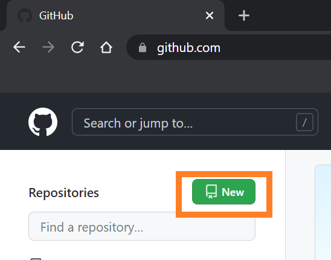  

3. Set the repository name as `aicore-test`

	!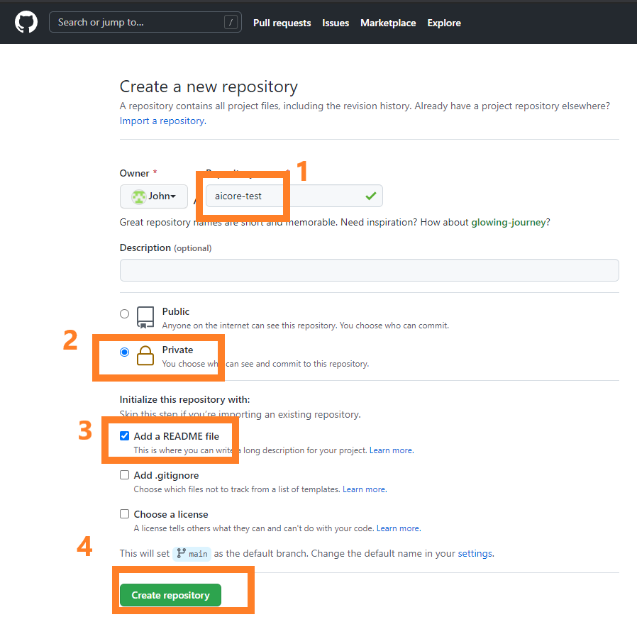

Once finished your GitHub page will look like this.

!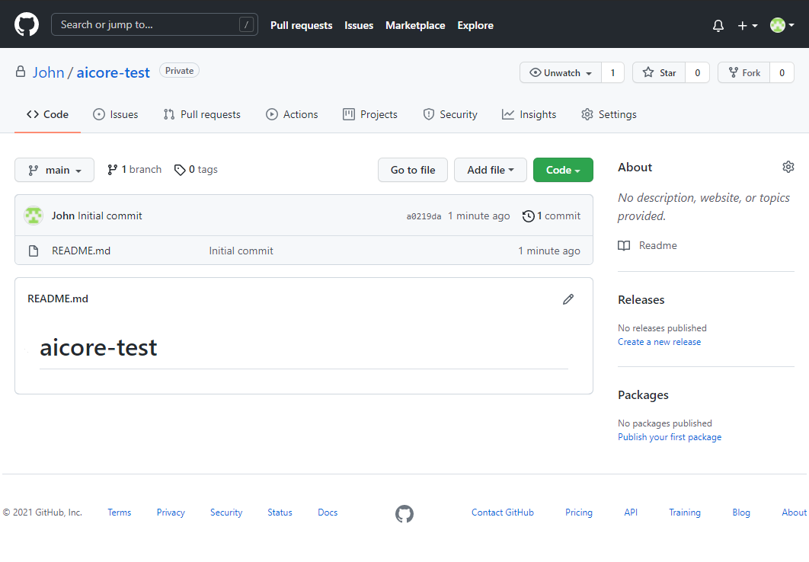  

[DONE]
[ACCORDION-END]


[ACCORDION-BEGIN [Step 2: ](Clone GitHub using GitHub Desktop)]

Cloning is the process of managing your GitHub repositories on you local computer

GitHub Desktop helps you clone, create, edit and sync files of your GitHub repository from you local computer.

1. Install GitHub Desktop. [Download here](https://desktop.github.com/)  

2. Open GitHub Desktop, from welcome screen sign in to your GitHub Account *(Alternative Sign-in on GitHub Desktop: **File** > **Options** > **Account** )*.

3. Click **File > Clone a repository**

	!

4. click on the  **URL** tab. Type the repository name you created, `<your github username>/aicore-test`.

	!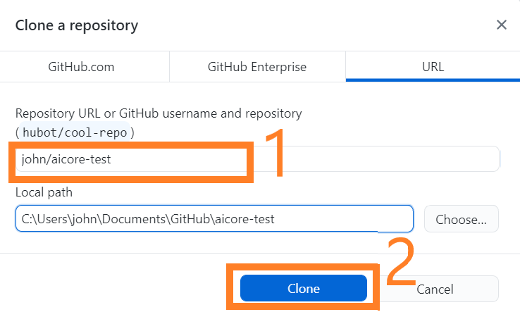

> **CAUTION**: In this tutorial, the sample images shown are two folders with same name `aicore-test`. Heres how you will differentiate them:
>
> **Screenshots showing File Explorer**, GitHub synced folder *(C:/john/Documents/GitHub/aicore-test)* which will connect to SAP AI Core and upload workflows *(explained later)*.
>
> **Screenshots showing IDE**, Local Un-synced *(C:/aicore-test)*, where your Jupyter notebook is running and private keys *(files)* are located. **Never upload/sync your private keys with GitHub.**


[DONE]
[ACCORDION-END]


[ACCORDION-BEGIN [Step 3: ](Upload files to GitHub using GitHub Desktop)]

1. Locate where you cloned your GitHub repository.

2. Create a folder name `workflows`, inside `aicore-test`.

	!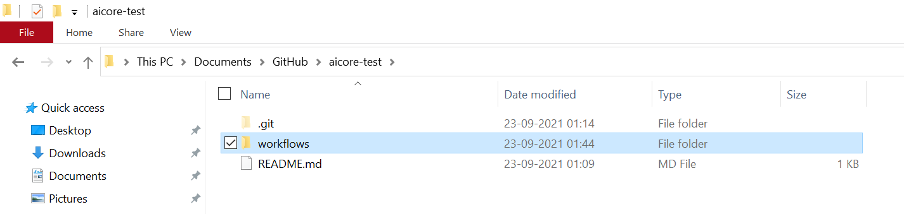

3. Create **an empty file** named `training_workflow_tutorial.yaml` inside the `workflows` folder.

	!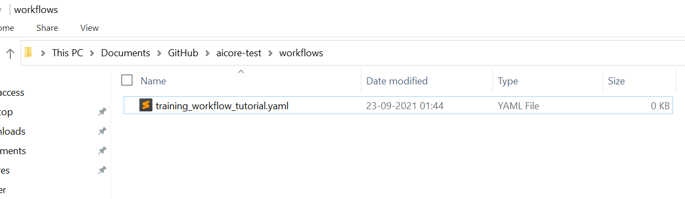

4. Open GitHub-Desktop, Click on **Commit to main** button.

	!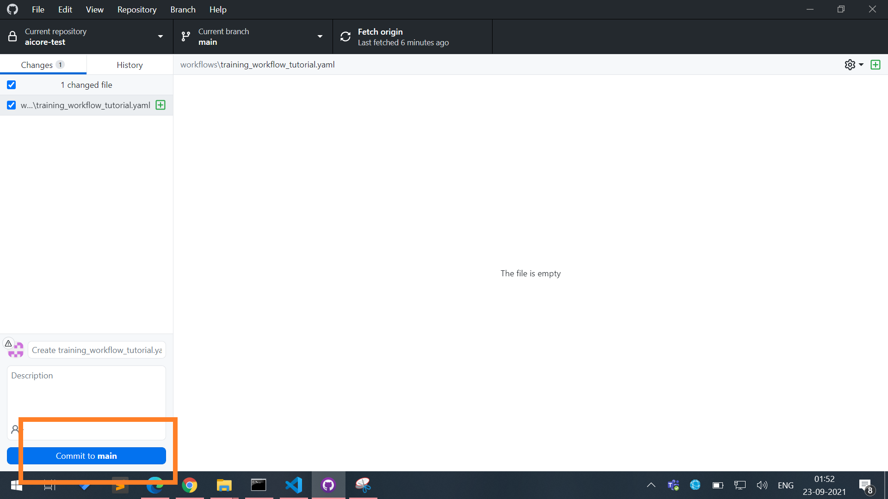

6. Click **Push Origin** button. This will sync your local changes with online GitHub.

	!

GitHub Desktop will only show un-synced changes.

!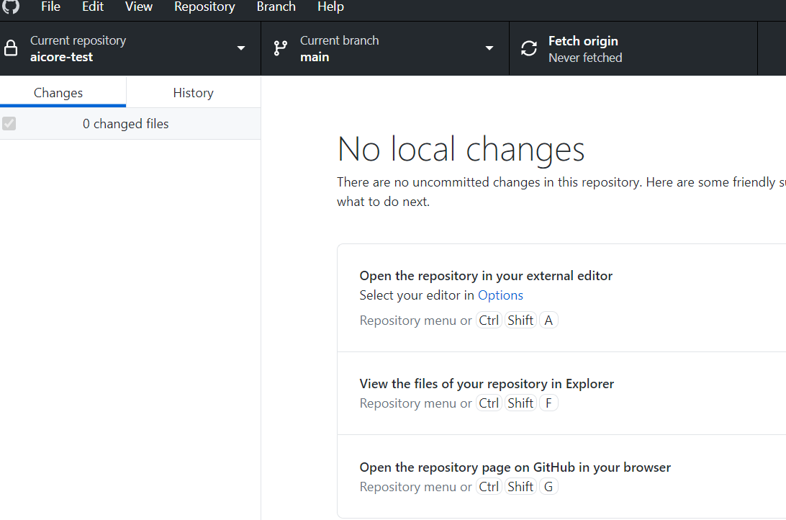

[DONE]
[ACCORDION-END]

[ACCORDION-BEGIN [Step 4: ](Connect GitHub repository to SAP AI Core)]

Generate GitHub Personal Access Token (PAT), [see how to](https://docs.github.com/en/authentication/keeping-your-account-and-data-secure/creating-a-personal-access-token).

Create file `git_setup.json` with the following contents. Replace content with your GitHub credentials.

> **IMPORTANT** DO NOT use your GitHub account's password in below code pieces, instead use GitHub Personal Access Token.

```JSON[4, 5, 6, 10]
{
		"repo": {
				"name": "aicore-test",
				"url": "https://github.com/<WRITE_YOUR_GITHUB_USERNAME>/aicore-test",
				"username": "WRITE_YOUR_GITHUB_USERNAME",
				"password": "WRITE_YOUR_GITHUB_PAT"
		},
		"app": {
				"applicationName": "aicore-test-app",
				"repositoryUrl": "https://github.com/<WRITE_YOUR_GITHUB_USERNAME>/aicore-test",
				"revision": "HEAD",
				"path": "workflows"
		}
}
```

Store it inside the files folder: `files/git_setup.json`.  

!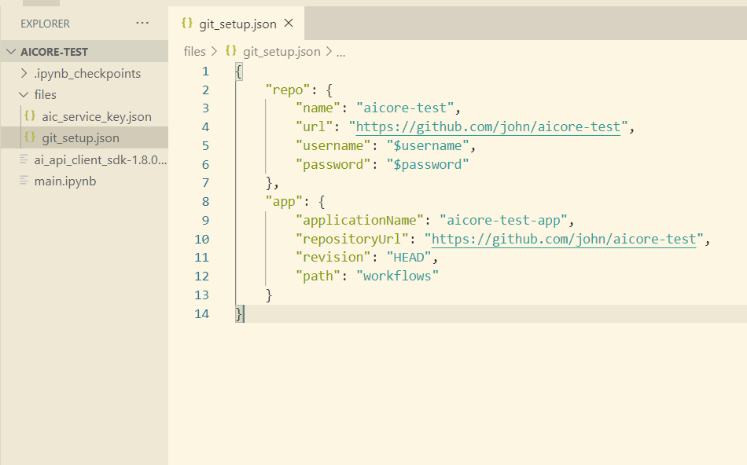

Execute the following python code on your Jupyter notebook cell.

```PYTHON
# Read git_setup.json
git_setup_file_path = "files/git_setup.json"
#
# NO CHANGES REQUIRED BELOW
#
# Loads your git_setup.json
with open(git_setup_file_path) as gs:
		setup_json = json.load(gs)
#
# Connects your repo
repo_json = setup_json["repo"]
response = ai_api_client.rest_client.post(
		path="/admin/repositories",
		body={
				"name": repo_json["name"],
				"url": repo_json["url"],
				"username": repo_json["username"],
				"password": repo_json["password"]
		}
)
print(response)
#
# Registers the directory as app,
app_json = setup_json["app"]
response = ai_api_client.rest_client.post(
		path="/admin/applications",
		body={
				"applicationName": app_json["applicationName"],
				"repositoryUrl": app_json["repositoryUrl"],
				"revision": app_json["revision"],
				"path": app_json["path"]
		}
)
```

Example Output

```PYTHON
{
	 'count': 1
	 'resources':[{
	 		'name': 'aicore-test',
			'status': 'COMPLETED',
			'url': 'https://github.com/john/aicore-test'
		}]
}

[
  {
    'application_name': 'aicore-test-app',
  	'path': 'workflows'
  	'repository_url': 'https://github.com/john/aicore-test',
  	'revision': 'HEAD'
  },
]
```

[DONE]
[ACCORDION-END]

[ACCORDION-BEGIN [Step 5: ](List connected GitHub repositories)]

Execute the following python code on your Jupyter notebook cell

```PYTHON
ai_api_client.rest_client.get(
		path="/admin/repositories"
)
```

Example Output
```PYTHON
{
	 'count': 1,
	 'resources': [
			{
					 'name': 'aicore-test',
					 'status': 'COMPLETED',
					 'url': 'https://github.com/john/aicore-test'
			 }
	 ]
}
```

[DONE]
[ACCORDION-END]


[ACCORDION-BEGIN [Step 6: ](List connected applications)]

Applications refers to directory inside connected GitHub repository. SAP AI Core will scan these directories for any workflows *(explained later)* you upload, it won't scan any sub-directories contained within. For any directories you intent SAP AI Core to scan, add as an application *(see parts for same in previous step)*.

Execute the following python code on your Jupyter notebook cell

```PYTHON
ai_api_client.rest_client.get(
    path="/admin/applications"
)
```

Example Output

```
{
    'count': 1,
    'resources': [{
        'application_name': 'aicore-test-app',
        'path': 'workflows',
        'repository_url': 'https://github.com/john/aicore-test',
        'revision': 'HEAD'
    }]
}
```

[VALIDATE_1]
[ACCORDION-END]

[ACCORDION-BEGIN [Step 7: ](Create Docker repository)]

1. Sign up on [docker.com](https://www.docker.com).

2. Click **Create Repository** on Docker website.  

	!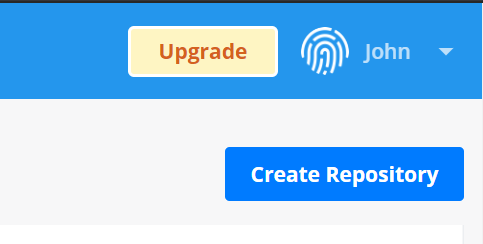

3. Name the repository `text-clf-train`

	!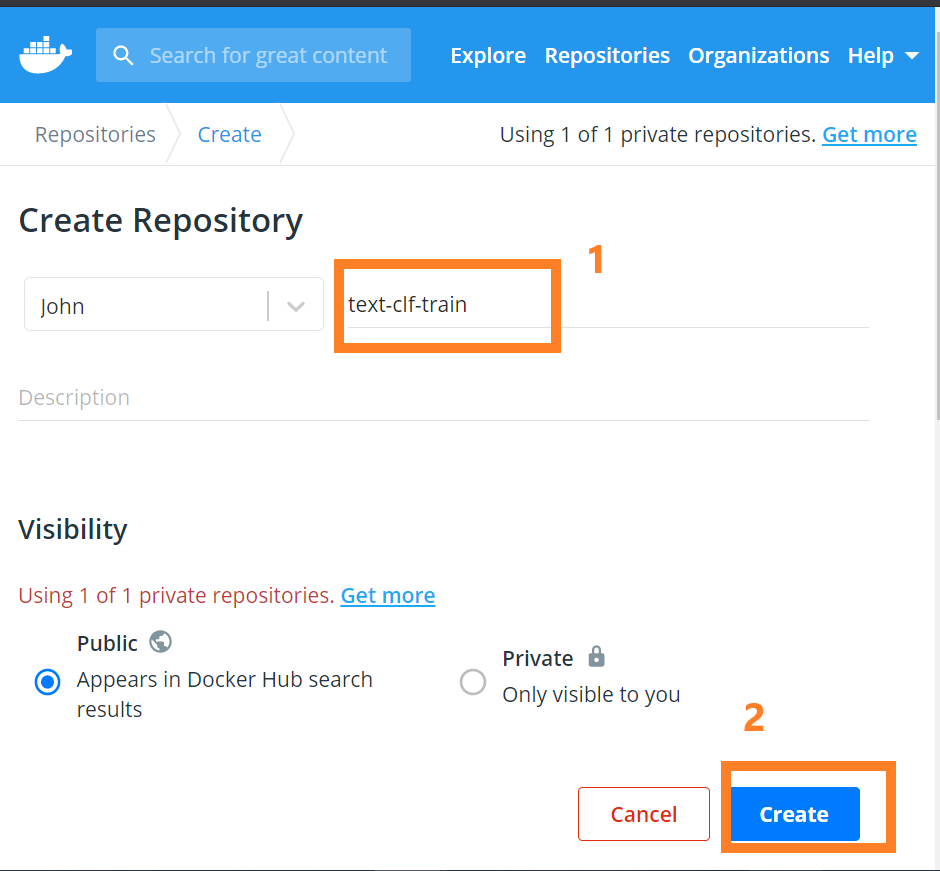

Create another repository similarly, named `text-clf-serve`.

!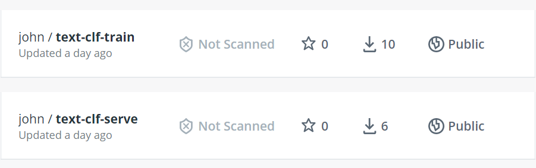


[DONE]
[ACCORDION-END]

[ACCORDION-BEGIN [Step 8: ](Install Docker Desktop)]

Docker Desktop helps you manage build and upload Docker images to your Docker account.

Download and Install Docker Desktop. [Download here](https://www.docker.com/products/docker-desktop)

After Installation. You will see Docker Desktop icon on your desktop tray.

!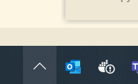

Verify successful Docker installation with your terminal *(command prompt)*. Execute the following on terminal.

```BASH
docker --version
```

!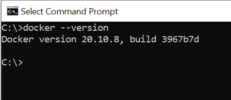

[DONE]
[ACCORDION-END]

[ACCORDION-BEGIN [Step 9: ](Connect Docker to SAP AI Core with docker registry secret)]

Docker Registry Secret is SAP AI Core entity that manages credentials to connect to your Docker repository.

Create a file `docker_secret.json`, with following contents. Put your Docker credentials *(highlighted parts)*.

> **RECOMMENDATION** Use your docker access token instead of password in below code pieces. You can generate one from your profile settings in your docker account.

```JSON[4]
{
  "name": "docker-registry-secret",
  "data": {
    ".dockerconfigjson": "{\"auths\": {\"docker.io\": {\"username\": \"$username\", \"password\": \"$password\"}}}"
  }
}
```

Store `docker_secret.json` inside the `files` folder: `files/docker_secret.json`.

!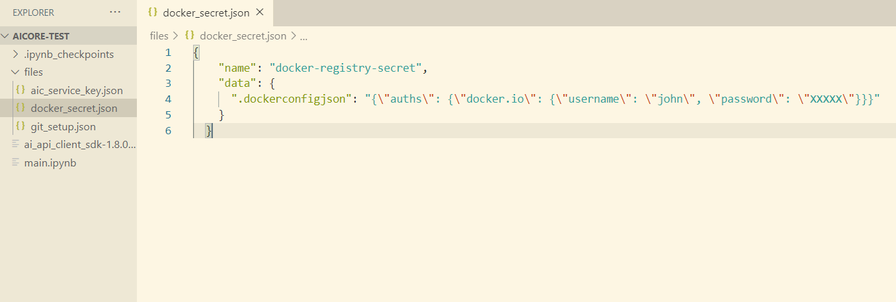

Execute the following python code on your Jupyter notebook cell.

```PYTHON
docker_secret_file_path = 'files/docker_secret.json'
#
# NO CHANGES REQUIRED BELOW
#
# Loads the json file
with open(docker_secret_file_path) as dsf:
    docker_secret = json.load(dsf)

response = ai_api_client.rest_client.post(
    path="/admin/dockerRegistrySecrets",
    body={
        "name": docker_secret["name"],
        "data": docker_secret["data"]
    }
)
print(response)
```

Example Output

```PYTHON
{'message': 'secret has been been created'}
```

[DONE]
[ACCORDION-END]


[ACCORDION-BEGIN [Step 10: ](List docker registry secret)]

Execute the following python code on your Jupyter notebook cell

```PYTHON
ai_api_client.rest_client.get(
    path=f"/admin/dockerRegistrySecrets"
)
```

Example Output

```PYTHON
{
    'count': 1,
    'resources': [{
        'name': 'docker-registry-secret'
    }]
}
```

[DONE]
[ACCORDION-END]

---
