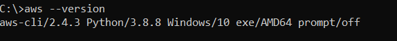
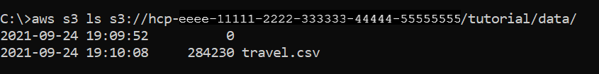
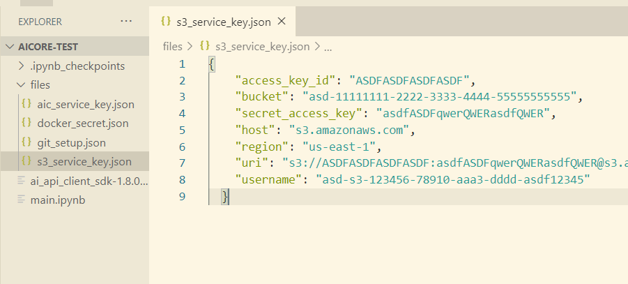

## Details
### You will learn
- How to create Resource group using AI API Client SDK
- How to upload data to AWS S3 bucket
- How to connect AWS S3 to SAP AI Core with Object Store Secret

---

[ACCORDION-BEGIN [Step 1: ](Create resource group)]

Resource Groups represent a virtual collection of related resources within the scope of one SAP AI Core tenant.


Create resource group with name `tutorial`, execute the following python code on your Jupyter notebook cell

```PYTHON[4]
ai_api_client.rest_client.post(
    path="/admin/resourceGroups",
    body={
        "resourceGroupId": "tutorial" # Name of your resource group
    }
)
```

Example Output

```PYTHON
{
    'resource_group_id': 'tutorial',
     'tenant_id': '123fasdf-aaaa-bbbb-cccc-1234asdf',
     'zone_id': ''
}

```

> **IMPORTANT:** The `create resource group` request results in `Response: 202`, which means the backend server will take time(~30 sec) to create the group. List the resource group *(see below)* to see the status of creation

[DONE]
[ACCORDION-END]


[ACCORDION-BEGIN [Step 2: ](List existing resource groups)]

Execute the following python code on your Jupyter notebook cell

```PYTHON
ai_api_client.rest_client.get(
    path=f"/admin/resourceGroups"
)
```

Example Output

```PYTHON
{'count': 1,
 'resources': [{
    'resource_group_id': 'tutorial',
    'status': 'PROVISIONED',
    'status_message': 'All onboarding steps are completed.',
    'tenant_id': '123fasdf-aaaa-bbbb-cccc-1234asdf',
    'zone_id': ''
  ]}
}
```

[VALIDATE_1]
[ACCORDION-END]

[ACCORDION-BEGIN [Step 3: ](Manage AWS S3 Object Store)]

Use AWS S3 Object Store as a cloud storage for your datasets and models. You can get AWS S3 Bucket from either of two ways:

- Through SAP BTP Cockpit.

- Through AWS. Refer [AWS User Guide to S3](https://docs.aws.amazon.com/AmazonS3/latest/userguide/create-bucket-overview.html)

Follow the below steps for creating a path prefix through AWS CLI:

1. Install AWS CLI for your platform (Mac/ Linux/ Windows). [Instructions here](https://docs.aws.amazon.com/cli/latest/userguide/getting-started-install.html).

2. Check for `version` after installation completes, execute the following on terminal *(command prompt)*

    ```BASH
    aws --version
    ```

    !

3. Execute the following on the terminal *(command prompt)*

    ```BASH
    aws configure
    ```

4. Enter your the AWS S3 Object Store details. You can leave the `Default output format` entry as blank *(press enter)*.

    !

[DONE]
[ACCORDION-END]


[ACCORDION-BEGIN [Step 4: ](Upload dataset to AWS S3 Object Store)]

| File Name | Link |
| --- | --- |
| `travel.csv` | [Download Here](https://raw.githubusercontent.com/SAPDocuments/Tutorials/master/tutorials/ai-core-aiapi-postman-resource/travel.csv)

 1. Replace `your-bucket-id` and execute the following on the terminal *(command prompt)* to create a path prefix(directory) and upload you datafile at the same time.

    ```BASH[1]
    aws s3 cp /local/path/to/travel.csv s3://your-bucket-id/tutorial/data/
    ```

2. Check your file. Replace `your-bucket-id` and execute the following on the terminal.

    ```BASH[1]
    aws s3 ls s3://your-bucket-id/tutorial/data/
    ```

    !

[DONE]
[ACCORDION-END]

[ACCORDION-BEGIN [Step 5: ](Register AWS S3 Object Store to SAP AI Core resource group)]

Object Store Secret links your S3 Object Store with your resource group, hence ensure you have the resource group created before proceeding.

Get service key file for your AWS S3 bucket. The file will have contents similar to the snippet below.

> In case you are use SAP BTP to create AWS S3 object store, generate you service key for same from`BTP cockpit > BTP subaccount > Instances and Subscriptions > Instances > Credentials `.

```JSON
{
  "access_key_id": "ASDFASDFASDFASDF",
  "bucket": "asd-11111111-2222-3333-4444-55555555555",
  "secret_access_key": "asdfASDFqwerQWERasdfQWER",
  "host": "s3.amazonaws.com",
  "region": "us-east-1",
  "uri": "s3://ASDFASDFASDFASDF:asdfASDFqwerQWERasdfQWER@s3.amazonaws.com/asd-11111111-2222-3333-4444-55555555555",
  "username": "asd-s3-123456-78910-aaa3-dddd-asdf12345"
}
```

Save the file locally as. `s3_service_key.json` inside the `files` folder: `files/s3_service_key.json`

!

Execute the following python code on your Jupyter notebook cell

```PYTHON
# Loads your service key
s3_service_key_path = 'files/s3_service_key.json'

# Loads the service key file
with open(s3_service_key_path) as s3sk:
    s3_service_key = json.load(s3sk)


default_secret = {
    "name": "default", # Name of the connection
    "type": "S3",
    "endpoint": s3_service_key["host"],
    "bucket": s3_service_key["bucket"],
    "pathPrefix": "tutorial",
    "region": s3_service_key["region"],
    "data": {
        "AWS_ACCESS_KEY_ID": s3_service_key["access_key_id"],
        "AWS_SECRET_ACCESS_KEY": s3_service_key["secret_access_key"]
    }
}

# Call the api
ai_api_client.rest_client.post(
    path="/admin/objectStoreSecrets",
    body = default_secret, # defined above
    resource_group = "tutorial"
)

```

Example Output

```PYTHON
{'message': 'secret has been created'}
```

This will connect your object store. The connection will be named `default`.

[DONE]
[ACCORDION-END]

---
