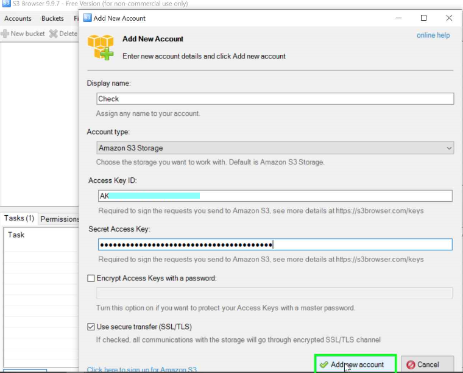
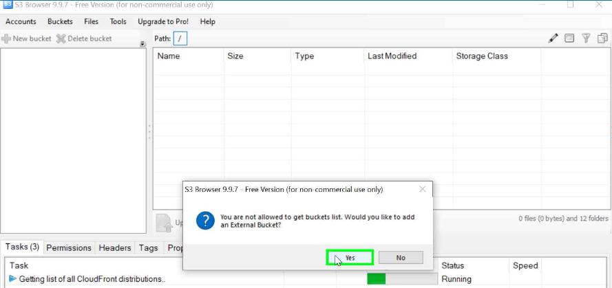
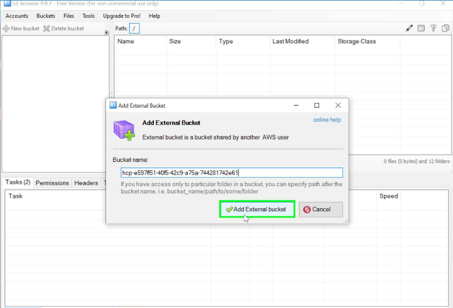
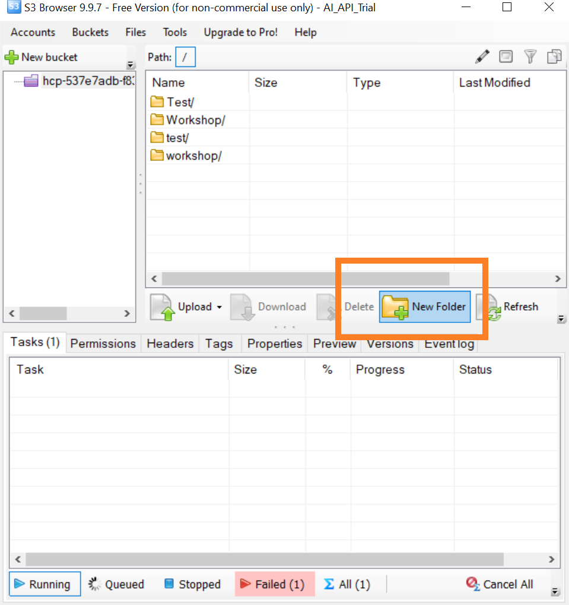
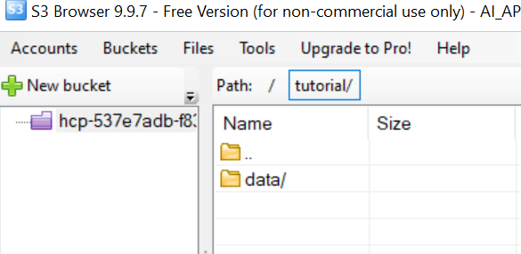
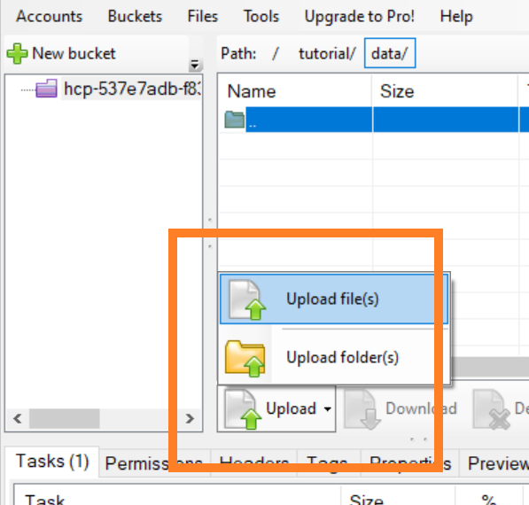
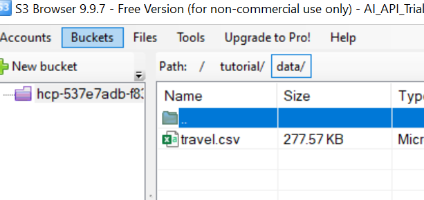

## Details
### You will learn
- How to create resource group using SAP AI API Client SDK
- How to upload data to AWS S3 bucket
- How to connect AWS S3 to SAP AI Core

---

[ACCORDION-BEGIN [Step 1: ](Create a resource group)]

Resource groups represent a virtual collection of related resources within the scope of one SAP AI Core tenant.

> **Warning** ensure you have properly set up `files/aic_service_key.json` and `ai_api_client`,

Execute the following python code on your Jupyter notebook cell

```PYTHON
ai_api_client.rest_client.post(
    path="/admin/resourceGroups",
    body={
        "resourceGroupId": "tutorial" # Name of your resource group
    }
)
```

Example Output

```PYTHON
{
    'resource_group_id': 'tutorial',
     'tenant_id': '123fasdf-aaaa-bbbb-cccc-1234asdf',
     'zone_id': ''
}

```

A resource group named `tutorial` will be created.

> **IMPORTANT:** The `create resource group` request results in `Response: 202`, which means the backend server will take time(~30 sec) to create the group. List the resource group(*see below*) to see the status of creation

[DONE]
[ACCORDION-END]


[ACCORDION-BEGIN [Step 2: ](List Resource Groups)]

Execute the following python code on your Jupyter notebook cell

```PYTHON
ai_api_client.rest_client.get(
    path=f"/admin/resourceGroups"
)
```

Example Output

```PYTHON
{'count': 1,
 'resources': [{
    'resource_group_id': 'tutorial',
    'status': 'PROVISIONED',
    'status_message': 'All onboarding steps are completed.',
    'tenant_id': '123fasdf-aaaa-bbbb-cccc-1234asdf',
    'zone_id': ''
  ]}
}
```

[VALIDATE_1]
[ACCORDION-END]

[ACCORDION-BEGIN [Step 3: ](Create a S3 Object store using S3 Browser)]

AWS S3 Object Store is used to store data.

Create a S3 Bucket. Two options
1. Through BTP Cockpit.
2. Through AWS. Refer [AWS User Guide to S3](https://docs.aws.amazon.com/AmazonS3/latest/userguide/create-bucket-overview.html)


Install S3 Browser to manage S3 from your computer. [Download here](https://s3browser.com/)

Open S3 Browser and Enter your Credentials.  

!

If you don't have bucket create one and skip this step or else follow these.  

!  

!  


[DONE]
[ACCORDION-END]


[ACCORDION-BEGIN [Step 4: ](Upload training data to the S3 Object store)]

Create a folder named `tutorial` in the S3.

!

Create another folder name `data` inside the `tutorial`.

!.

Upload your datafile `travel.csv` inside `tutorial/data/`. This will be used for training the model.

Download Files

| File Name | Link |
| --- | --- |
| `travel.csv` | [Download Here](https://raw.githubusercontent.com/SAPDocuments/Tutorials/master/tutorials/ai-core-aiapi-clientsdk-resources/travel.csv)

!

Final look of S3 bucket.  

!


[DONE]
[ACCORDION-END]

[ACCORDION-BEGIN [Step 5: ](Register S3 Object Store to SAP AI Core Resource Group)]


Object stores are connected to the resource groups, hence ensure you have the resource group created before proceeding.

Get service key file for your S3 bucket. Save it locally as. `s3_service_key.json`. The file will have contents similar to.

> In case you are using the SAP object store you get the content from `BTP cockpit > BTP subaccount > Instances and Subscriptions > Instances > Credentials `.

```JSON
{
  "access_key_id": "ASDFASDFASDFASDF",
  "bucket": "asd-11111111-2222-3333-4444-55555555555",
  "secret_access_key": "asdfASDFqwerQWERasdfQWER",
  "host": "s3.amazonaws.com",
  "region": "us-east-1",
  "uri": "s3://ASDFASDFASDFASDF:asdfASDFqwerQWERasdfQWER@s3.amazonaws.com/asd-11111111-2222-3333-4444-55555555555",
  "username": "asd-s3-123456-78910-aaa3-dddd-asdf12345"
}
```

Store it inside the files folder: `files/s3_service_key.json`.

!

Execute the following python code on your Jupyter notebook cell

```PYTHON
# Loads your service key
s3_service_key_path = 'files/s3_service_key.json'

# Loads the service key file
with open(s3_service_key_path) as s3sk:
    s3_service_key = json.load(s3sk)


default_secret = {
    "name": "default", # Name of the connection
    "type": "S3",
    "endpoint": s3_service_key["host"],
    "bucket": s3_service_key["bucket"],
    "pathPrefix": "tutorial",
    "region": s3_service_key["region"],
    "data": {
        "AWS_ACCESS_KEY_ID": s3_service_key["access_key_id"],
        "AWS_SECRET_ACCESS_KEY": s3_service_key["secret_access_key"]
    }
}

# Call the api
ai_api_client.rest_client.post(
    path="/admin/objectStoreSecrets",
    body = default_secret, # defined above
    resource_group = "tutorial"
)

```

Example Output

```PYTHON
{'message': 'secret has been created'}
```

This will connect our object store. The connection will be named `default` ( *see python code above*).

[DONE]
[ACCORDION-END]

---
