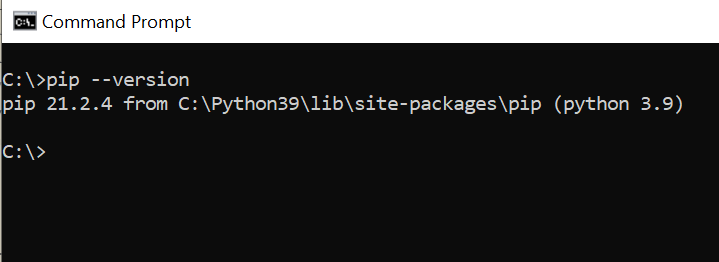
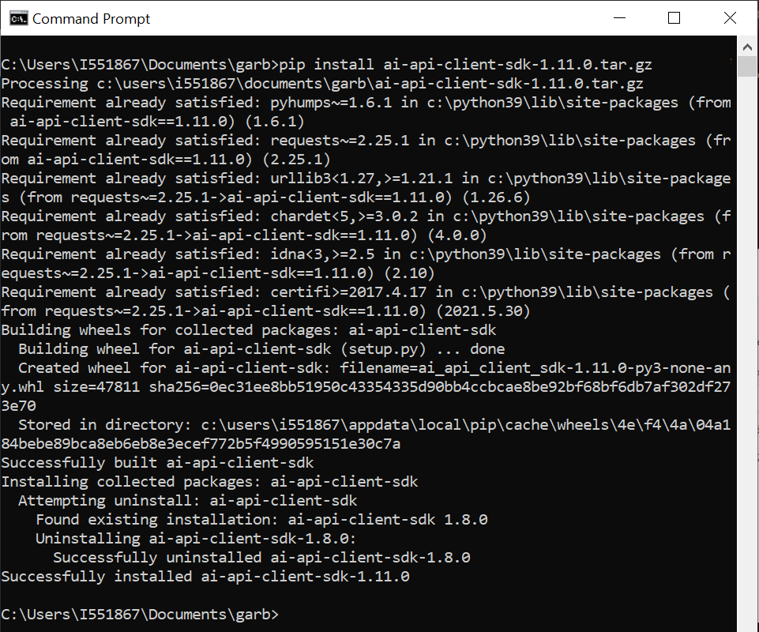
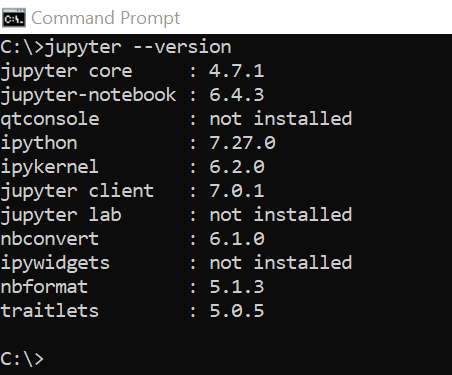
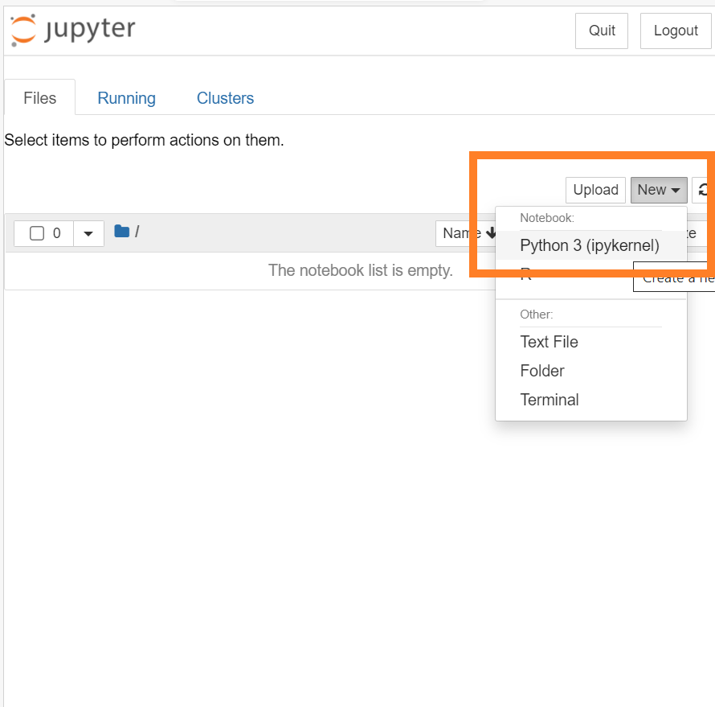
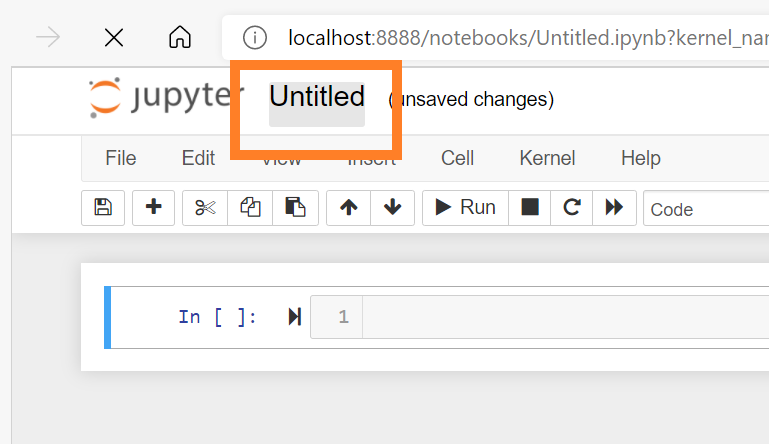
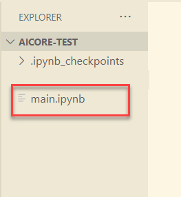
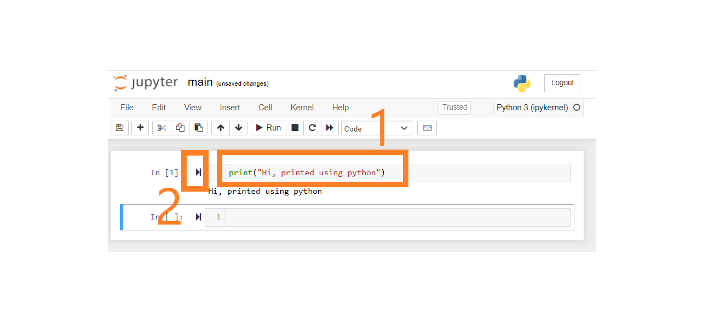
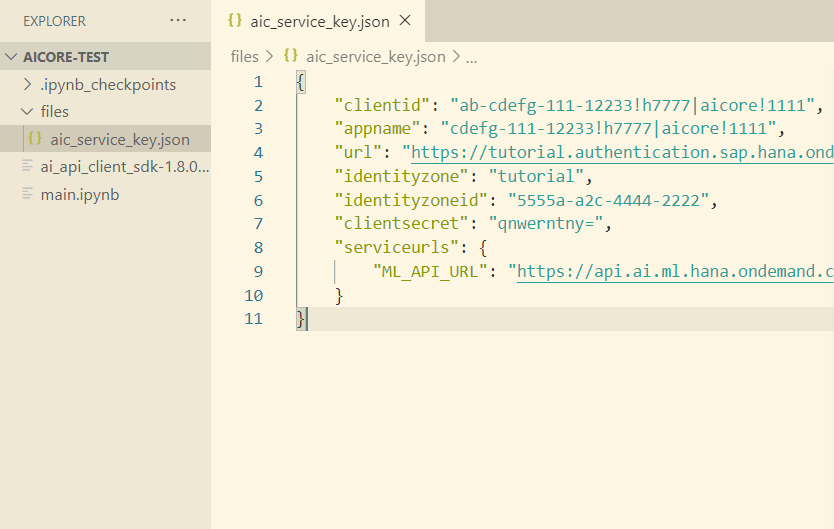
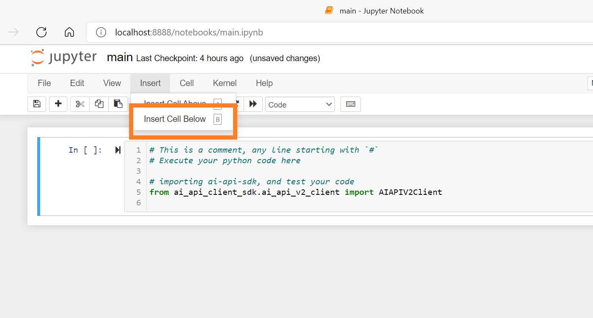
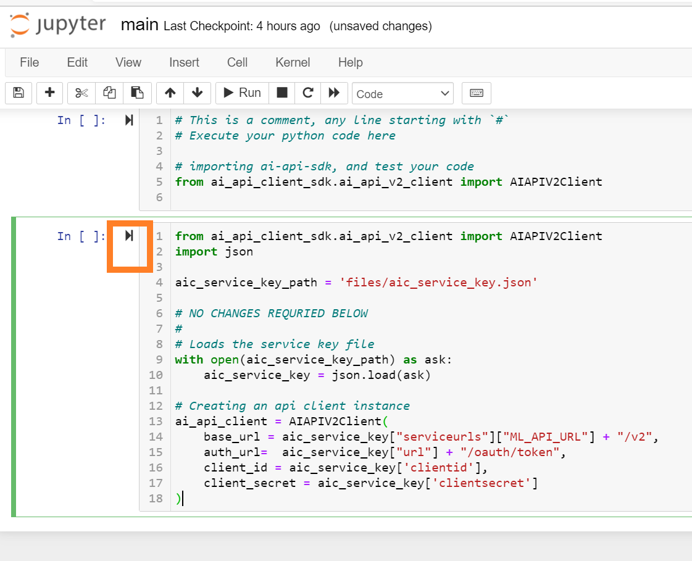

## Details
### You will learn
  - How to install packages for python
  - How to execute python code in Jupyter
  - How to connect to SAP AI API Client SDK using python via Jupyter

---

[ACCORDION-BEGIN [Step 1: ](Installing Python)]

Install python. [Download here](https://www.python.org/downloads/)

`pip` is the python package installer, it will get installed along.

Check for `pip` after installation completes Heres How:
Execute the following on terminal *(command prompt)*

```BASH
pip --version
```

!

[DONE]
[ACCORDION-END]

[ACCORDION-BEGIN [Step 2: ](Installing SAP AI API Client SDK)]

`SAP-AI-API-Client-SDK`  is python package which will enable us to talk to SAP AI API.
Follow the steps to install the same

1. Download `.whl` for `SAP-AI-API-Client-SDK` [Download Here](https://developers.sap.com/trials-downloads.html?search=AI+Core)

2. Install .`.whl` using pip. Execute the following on terminal. ( *Change the path*)

    ```BASH
    pip install <path to downloaded whl>/ai-api-client-sdk-<version>.whl
    ```
    !

Similarly Install `PyYaml`, *No `.whl` download required for `PyYaml`*. Execute the following on terminal.

```BASH
pip install PyYaml
```

[DONE]
[ACCORDION-END]


[ACCORDION-BEGIN [Step 3: ](Installing Jupyter)]

Use pip to install Jupyter.
Execute the following on terminal.

```BASH
pip install notebook
```

Check if Jupyter is correctly installed. Execute the following on terminal.

```BASH
jupyter --version
```

!


Jupyter is used to execute python code pieces in form of cells. In the next steps we will learn this.


[DONE]
[ACCORDION-END]

[ACCORDION-BEGIN [Step 4: ](Start Jupyter)]

On the terminal, navigate to folder which you will be using throughout the tutorial. Here my folder is `C:/aicore-test`

Execute the following on terminal.

```BASH
jupyter notebook
```

!

This will automatically open a page in your default browser.


[DONE]
[ACCORDION-END]

[ACCORDION-BEGIN [Step 5: ](Create a Jupyter notebook)]

Create a new notebook using the page opened on your browser. Click **New > Python 3 `(ipykernel)`**

!

Rename your notebook by Double-Click on `Untitled`, Change the name to `main`  

!

After renaming you can see your folder will have `main.ipynb`  

!

Type your python codes inside the Jupyter notebook.

!  

- (1) Represents cell where your will write code. Throughout the tutorial if you encounter python code pieces, then click on **Insert > Insert Cell Below** and paste codes in those new cells.

- (2) Click on he Arrow button will execute the cell(*python piece of code*).

[DONE]
[ACCORDION-END]

[ACCORDION-BEGIN [Step 6: ](Get SAP AI API Service Key and use with Python)]


Follow the [provisioning steps](https://help.sap.com/viewer/product/AI_CORE/CLOUD/en-US) to get an SAP AI API service instance key.

> If you already have an SAP AI API service instance you can get the service key from your BTP cockpit:
**BTP cockpit > BTP subaccount > Instances and Subscriptions > Instances > Credentials**

The content of the AI-Core service file should look something like this:

```JSON
{
    "clientid": "ab-cdefg-111-12233!h7777|aicore!1111",
    "appname": "cdefg-111-12233!h7777|aicore!1111",
    "url": "https://tutorial.authentication.sap.hana.ondemand.com",
    "identityzone": "tutorial",
    "identityzoneid": "5555a-a2c-4444-2222",
    "clientsecret": "qnwerntny=",
    "serviceurls": {
        "ML_API_URL": "https://api.ai.ml.hana.ondemand.com"
    }
}
```

Store it inside the files folder: `files/aic_service_key.json`, we will use it to connect to the API in later steps, so ensure the path is correct.                    

!

Now execute the following python code on your Jupyter notebook cell: *(You will get no output)*

```PYTHON
from ai_api_client_sdk.ai_api_v2_client import AIAPIV2Client
import json

aic_service_key_path = 'files/aic_service_key.json'

# NO CHANGES REQURIED BELOW
#
# Loads the service key file
with open(aic_service_key_path) as ask:
    aic_service_key = json.load(ask)

# Creating an api client instance
ai_api_client = AIAPIV2Client(
    base_url = aic_service_key["serviceurls"]["ML_API_URL"] + "/v2",
    auth_url=  aic_service_key["url"] + "/oauth/token",
    client_id = aic_service_key['clientid'],
    client_secret = aic_service_key['clientsecret']
)
```

1. Create a new cell.

    !

2. Paste and click the arrow *(Alternative `Run > Run Cells`)*.

    !

    - The code will create connection to your SAP AI API instance using your `aic_service_key.json` and store the connection to AI-Core in the variable `ai_api_client`.
    - We will use this `ai_api_client` variable  throughout the tutorial to refer to our connection to SAP AI API, watch out for **Warning** in the tutorials, where the same is referred(used).


[DONE]
[ACCORDION-END]


[ACCORDION-BEGIN [Step 7: ](Test yourself)]

Assuming you have the following file snippet from your service key JSON

```
{
    ...
    "serviceurls": {
      "ML_API_URL": "https://api.ai.ml.hana.ondemand.com"
}
```
Given that at present the API version for SAP AI API is `v2`.

What value would you set for the parameter `base_url` to create connection to SAP AI API, in the following code snippet.

```PYTHON
my_ai_core_connection = AIAPIV2Client(
    base_url =  # Your response
    ...
)
```

[VALIDATE_1]
[ACCORDION-END]

---
