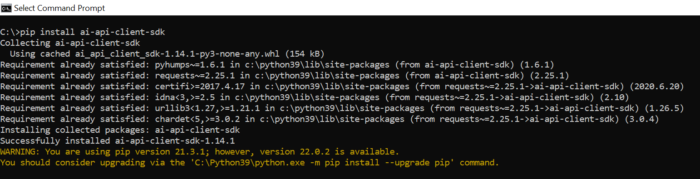

## Details
### You will learn
  - How to install packages for python
  - How to execute python code in Jupyter
  - How to connect to AI Core using AI API Client SDK

---

[ACCORDION-BEGIN [Step 1: ](Install python)]

Install python. [Download here](https://www.python.org/downloads/)

`pip` is the python package installer, it will be installed along python.

To check for `pip` after installation completes,
execute the following on terminal *(command prompt)*

```BASH
pip --version
```

!

[DONE]
[ACCORDION-END]

[ACCORDION-BEGIN [Step 2: ](Install AI API client SDK)]

`AI-API-Client-SDK` is a python package, that helps you control to SAP AI Core through   [AI API](https://help.sap.com/viewer/2d6c5984063c40a59eda62f4a9135bee/LATEST/en-US/716d4c38e3054c93a9d481b51cc66298.html).

Execute the following on terminal to install `AI API client SDK` package in python.

```BASH
pip install ai-api-client-sdk
```

!

This fetches the python package from the public repository for python packages and installs in your system. Locate the public repository [here](https://pypi.org/project/ai-api-client-sdk/).

Execute the following on terminal to install `PyYaml` package.

```BASH
pip install PyYaml
```

[DONE]
[ACCORDION-END]


[ACCORDION-BEGIN [Step 3: ](Install Jupyter)]

Jupyter is used to execute python code pieces in form of cells.

Use `pip` to install Jupyter. Execute the following on terminal.

```BASH
pip install notebook
```

Check if Jupyter is correctly installed. Execute the following on terminal.

```BASH
jupyter --version
```

!

[DONE]
[ACCORDION-END]

[ACCORDION-BEGIN [Step 4: ](Start Jupyter Notebook)]

On the terminal, navigate to folder which you will be using for this the tutorial (must not be GitHub synced, as in the folder you will store sensitive information). Here my folder is `C:/aicore-test`

Execute the following on terminal.

```BASH
jupyter notebook
```

!

This will automatically open a webpage in your default browser.

> **IMPORTANT:** DO NOT close the terminal which started the Jupyter notebook while using the notebook. The webpage is just an interface to this terminal.

[DONE]
[ACCORDION-END]

[ACCORDION-BEGIN [Step 5: ](Create a Jupyter notebook)]

Click **New > Python 3 `(ipykernel)`** on Jupyter webpage (result of starting Jupyter).

!

Click on *Untitled* to change the notebook name.

Type `main` in the dialog box that appears. Click *Rename*.

!


After renaming you can see your folder (where you started Jupyter session from terminal) will have `main.ipynb`.

*(The below screenshot is of the folder from IDE)*

!

[DONE]
[ACCORDION-END]


[ACCORDION-BEGIN [Step 6: ](Run Python code in Jupyter notebook)]

Type your python codes inside the Jupyter notebook.

```PYTHON
print("Hi, printed using python")
```

!  

- (1) Write you python code in the gray box, its called **cell** in Jupyter notebook.

- (2) Click on he arrow button next to cell to execute the cell *(python code piece)*.

[DONE]
[ACCORDION-END]

[ACCORDION-BEGIN [Step 7: ](Create AI API client in python)]

Get service key for your SAP AI Core. [Read How to create service key for SAP AI Core.](https://help.sap.com/viewer/2d6c5984063c40a59eda62f4a9135bee/LATEST/en-US/7323ff4e37ba41c198b06e9669b80920.html)

> If you have not provisioned SAP AI Core. Read [provisioning steps](https://help.sap.com/viewer/2d6c5984063c40a59eda62f4a9135bee/LATEST/en-US/38c4599432d74c1d94e70f7c955a717d.html) to provision SAP AI Core service.

Here's an example service key file. Verify if your SAP AI Core service file has same name of keys as mentioned here:

```JSON
{
    "clientid": "ab-cdefg-111-12233!h7777|aicore!1111",
    "clientsecret": "qnwerntny=",
    "url": "https://tutorial.authentication.sap.hana.ondemand.com",
    "identityzone": "tutorial",
    "identityzoneid": "5555a-a2c-4444-2222",
    "appname": "cdefg-111-12233!h7777|aicore!1111",
    "serviceurls": {
        "AI_API_URL": "https://api.ai.ml.hana.ondemand.com"
    }
}
```

Download SAP AI Core service key file (JSON).

Save the file in the folder relative to where your Jupyter notebook is located, inside the `files` folder: `files/aic_service_key.json`.

You will use the saved location to load service key and create AI API client, so ensure the path is correct.                    

!


1. Create a new cell in Jupyter notebook.

    !


2. Paste the code snippet and click the arrow to execute. *(Alternative: **Run** > **Run Cells**)*.

    ```PYTHON
    from ai_api_client_sdk.ai_api_v2_client import AIAPIV2Client
    import json

    # Your service key JSON file relative to this notebook
    aic_service_key_path = 'files/aic_service_key.json'

    # Loads the service key file
    with open(aic_service_key_path) as ask:
        aic_service_key = json.load(ask)

    # Creating an AI API client instance
    ai_api_client = AIAPIV2Client(
        base_url = aic_service_key["serviceurls"]["AI_API_URL"] + "/v2", # The present AI API version is 2
        auth_url=  aic_service_key["url"] + "/oauth/token",
        client_id = aic_service_key['clientid'],
        client_secret = aic_service_key['clientsecret']
    )
    ```

    !

    - The code will load `aic_service_key.json`
    - It will create connection to your SAP AI Core instance via AI API client SDK.
    - Store the connection to AI API client instance variable `ai_api_client`.
    - Use this `ai_api_client` variable  throughout the tutorial to refer to your connection to SAP AI Core, watch out for **Warning** in the tutorials, where the same variable is referred (used).

[DONE]
[ACCORDION-END]


[ACCORDION-BEGIN [Step 8: ](Test yourself)]

Assuming you have the following file snippet in your SAP AI Core service key *(JSON file)*.

```
{
    ...
    "serviceurls": {
      "AI_API_URL": "https://api.ai.ml.hana.ondemand.com"
}
```
And given that at present the API version for AI API is `v2`.

What value would you write for the parameter `base_url` in the following code snippet, to create connection to SAP AI Core using AI API client SDK ?

```PYTHON[2]
my_ai_core_connection = AIAPIV2Client(
    base_url =  # Your response
    ...
)
```

[VALIDATE_1]
[ACCORDION-END]

---
