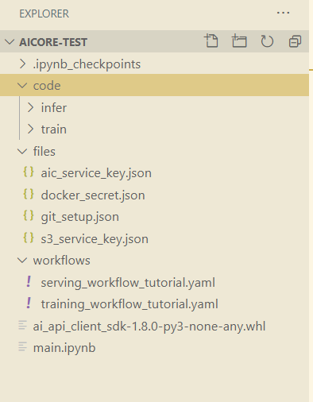
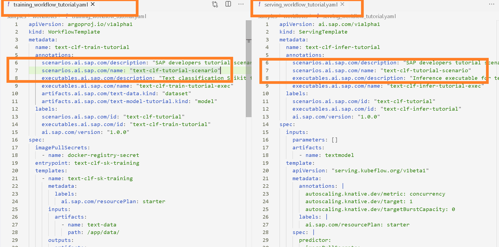

## Details
### You will learn
- How to write execution configuration.
- How to start training execution on SAP AI Core

---

[ACCORDION-BEGIN [Step 1: ](Upload data to S3)]

Previously you uploaded dataset `travel.csv` to AWS S3 Bucket, you will be using it here.

Ensure you have the following directory structure to complete this step **(contents of each file given in previous tutorials)**

!

[DONE]
[ACCORDION-END]

[ACCORDION-BEGIN [Step 2: ](Import python packages for SAP AI API Client SDK)]

Execute the following python code on your Jupyter notebook cell

```PYTHON
import sys, os
import json
import requests
import base64
import time
import yaml
from IPython.display import clear_output
from pprint import pprint

from ai_api_client_sdk.ai_api_v2_client import AIAPIV2Client
from ai_api_client_sdk.models.artifact import Artifact
from ai_api_client_sdk.models.status import Status
from ai_api_client_sdk.models.target_status import TargetStatus
from ai_api_client_sdk.models.parameter_binding import ParameterBinding
from ai_api_client_sdk.models.input_artifact_binding import InputArtifactBinding
```

[DONE]
[ACCORDION-END]


[ACCORDION-BEGIN [Step 3: ](Create SAP AI API Client SDK instance)]

Execute the following python code on your Jupyter notebook cell

```PYTHON
resource_group = "tutorial"  # Must be created before

aic_service_key = 'files/aic_service_key.json' # ENSURE YOU HAVE THE FILE PLACED CORRECTLY
with open(aic_service_key) as ask:
    aic_s_k = json.load(ask)

# NO CHANGES REQUIRED BELOW
#
ai_api_v2_client = AIAPIV2Client(
    base_url=aic_s_k["serviceurls"]["ML_API_URL"] + "/v2/lm",
    auth_url=aic_s_k["url"] + "/oauth/token",
    client_id=aic_s_k['clientid'],
    client_secret=aic_s_k['clientsecret'],
    resource_group=resource_group)
```

Expected Outputs

*No Outputs*

[DONE]
[ACCORDION-END]


[ACCORDION-BEGIN [Step 4: ](Check the available scenarios.)]

Scenarios refers to the use case. It is created by an identifier within the workflows *(YAML files, see screenshots below)* that you synced with GitHub in previous tutorial. For all workflows of same use case, write the same scenario id.

!

Execute the following python code on your Jupyter notebook cell

```PYTHON
scenario_resp = ai_api_v2_client.scenario.query(resource_group)

print("Scenarios")
print("---" * 20)
for idx, scenario in enumerate(scenario_resp.resources):
    print(f"Scenario ID {idx + 1} -> [{scenario.id}]")
```

In the outputs, you should see: `text-clf-tutorial`

Expected Output

```
Scenarios
---------------------------
Scenario ID 1 -> [text-clf-tutorial]
```

[DONE]
[ACCORDION-END]


[ACCORDION-BEGIN [Step 5: ](Register training data as artifact)]

An **Artifact** is reference to data or a file that is produced or consumed by an execution *(training code)* or deployment.

Previously you uploaded dataset to AWS S3 and connected S3 to SAP AI Core. Now you will specifically point to that dataset in S3.

Execute the following python code on your Jupyter notebook cell

```PYTHON
# NO CHANGES REQUIRED BELOW
#
# Load training_workflow.yaml
training_workflow_file = 'workflows/training_workflow_tutorial.yaml'
with open(training_workflow_file) as twf:
    training_workflow = yaml.safe_load(twf)
#
# Load scenario id from train_workflow.yaml
scenario_id = training_workflow['metadata']['labels']['scenarios.ai.sap.com/id']
#
# Set the artifact configuration
artifact = {
        "name": "tutorial-train-data", # Modifiable Name
        "kind": Artifact.Kind.DATASET,
        "url": "ai://default/data",
        "description": "Travel text data set",
        "scenario_id": scenario_id
    }
# Store the artifact response to retrieve the id for the training configuration
artifact_resp = ai_api_v2_client.artifact.create(**artifact)
print(f"Artifacts registered for {scenario_id} scenario!")
pprint(vars(artifact_resp))
#
# Checks if the message contains expected string
assert artifact_resp.message == 'Artifact acknowledged'
```

Expected Output

> In the output below, `default` in the output below refers to the name of registered AWS S3 Object Store with SAP AI Core *(created earlier)*.
> The `id` refers to `artifact_id`.

```[4]
Artifacts registered for text-clf-tutorial scenario!
{'id': '5dde103a-5b4d-4ec8-8131-3435151afabb',
 'message': 'Artifact acknowledged',
 'url': 'ai://default/data'}
```

[DONE]
[ACCORDION-END]


[ACCORDION-BEGIN [Step 6: ](Create training configuration)]

A **Configuration** will bind all the entities *(you require)* that are connected/ registered to SAP AI Core, i.e.
    - the workflows, using `executable_id` and `scenario_id`
    - the dataset, using `artifact_id`.

The configuration is reusable entity.

Execute the following python code on your Jupyter notebook cell

```PYTHON
input_artifact_name = training_workflow['spec']['templates'][0]['inputs']['artifacts'][0]['name']
executable_name = training_workflow['metadata']['name']

artifact_binding = {
    "key": input_artifact_name,
    "artifact_id": artifact_resp.id
}

train_configuration = {
    "name": "dev-tutorial-training-configuration",
    "scenario_id": scenario_id,
    "executable_id": executable_name,
    "parameter_bindings": [],
    "input_artifact_bindings": [ InputArtifactBinding(**artifact_binding) ]
}

# store the configuration response to access the id to create an execution
train_config_resp = ai_api_v2_client.configuration.create(**train_configuration)
pprint(vars(train_config_resp))

assert train_config_resp.message == 'Configuration created'

print("Configuration created for running the training")
```

Expected Output

> In the output below, `id` refers to `configuration_id`.

```
{ 'id': '1a667982-8dda-45bd-b624-2e76ba171647',
    'message': 'Configuration created'}
Configuration created for running the training

```

[DONE]
[ACCORDION-END]


[ACCORDION-BEGIN [Step 7: ](Create training execution)]

To run configuration, start the execution.

Execute the following python code on your Jupyter notebook cell

```PYTHON
execution_resp = ai_api_v2_client.execution.create(train_config_resp.id)
pprint(vars(execution_resp))
```

Expected Output

> The `id` in the output below refers to `execution_id`.

```
{'id': e42493be71676403',
 'message': 'Execution scheduled',
 'status': <Status.UNKNOWN: 'UNKNOWN'>}
```

[DONE]
[ACCORDION-END]


[ACCORDION-BEGIN [Step 8: ](Observe training status)]

Since the training of the model takes some time, periodically check on the status.
Poll the status *(the code below)* of the training and wait until it goes into one of the state - `COMPLETED` or `DEAD`.

Execute the following python code on your Jupyter notebook cell


```PYTHON
status = None
while status != Status.COMPLETED and status != Status.DEAD:
    # Sleep for 5 secs to avoid overwhelming the API with requests
    time.sleep(5)
    # Clear outputs to reduce clutter
    clear_output(wait=True)

    execution = ai_api_v2_client.execution.get(execution_resp.id)
    status = execution.status
    print('...... execution status ......', flush=True)
    print(f"Training status: {execution.status}")
    print(f"Training status details: {execution.status_details}")


if execution.status == Status.COMPLETED:
    print(f"Training complete for execution [{execution_resp.id}]!")
    output_artifact = execution.output_artifacts[0]
    output = {
        "id": output_artifact.id,
        "name": output_artifact.name,
        "url": output_artifact.url
    }
    with open('training_output.json', 'w') as fp:
        json.dump(output, fp)
```

Example Output

```
...... execution status ......
Training status: Status.COMPLETED
Training status details: None
Training complete for execution [e42493be71676403]!
```

[VALIDATE_1]
[ACCORDION-END]

---
