## Details
### You will learn
- How to build Docker images for python code
- How to upload Docker image to docker hub.
- How set workflows to train and serve your ML model with SAP AI Core
- How to set computing hardware resources, GPUs for your ML model

---

[ACCORDION-BEGIN [Step 1: ](Create ML code and Docker files)]

Docker will be used to store python code in form of containers *(portable environments)*.

Create files *(download links below)* as-it-is. Resulting directory structure may look like following:  

!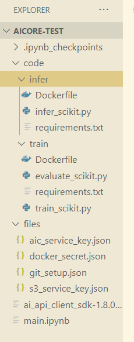

File Links

Training Scripts

| `train/`| Download Link |
| ---  | ----- |
| `Dockerfile` | [Download](https://raw.githubusercontent.com/SAPDocuments/Tutorials/master/tutorials/ai-core-aiapi-clientsdk-workflows/files/train/Dockerfile) |
| `evaluate_scikit.py` | [Download](https://raw.githubusercontent.com/SAPDocuments/Tutorials/master/tutorials/ai-core-aiapi-clientsdk-workflows/files/train/evaluate_scikit.py)
| `requirements.txt` | [Download](https://raw.githubusercontent.com/SAPDocuments/Tutorials/master/tutorials/ai-core-aiapi-clientsdk-workflows/files/train/requirements.txt)
| `train_scikit.py` | [Download](https://raw.githubusercontent.com/SAPDocuments/Tutorials/master/tutorials/ai-core-aiapi-clientsdk-workflows/files/train/train_scikit.py)


Inference/ Serving Scripts

| `infer/` | Download Link |
| -------- | ------------- |
| `Dockerfile` | [Download](https://raw.githubusercontent.com/SAPDocuments/Tutorials/master/tutorials/ai-core-aiapi-clientsdk-workflows/files/infer/Dockerfile)
| `infer_scikit.py` | [Download](https://raw.githubusercontent.com/SAPDocuments/Tutorials/master/tutorials/ai-core-aiapi-clientsdk-workflows/files/infer/infer_scikit.py)
| `requirements.txt` | [Download](https://raw.githubusercontent.com/SAPDocuments/Tutorials/master/tutorials/ai-core-aiapi-clientsdk-workflows/files/infer/requirements.txt)

[DONE]
[ACCORDION-END]

[ACCORDION-BEGIN [Step 2: ](Convert python code to Docker image)]

Connect your Docker Desktop to the Docker account.

```BASH
docker login docker.io -u <your-docker-username>
```

Type your password *(nothing will appear on screen: just type your password and press enter)*  

!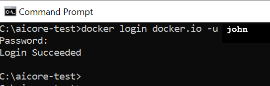

Navigate to place where you have stored your ML code files.  

!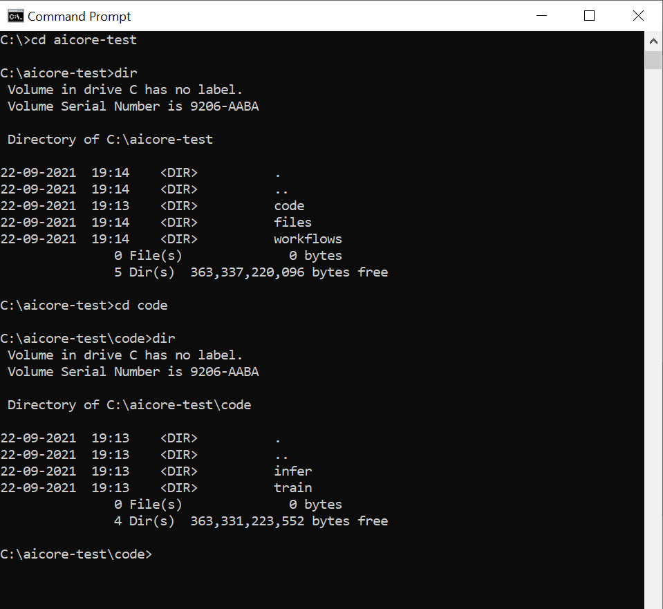

Navigate inside `train` directory on terminal.

```BASH
cd train
```

Build docker image using the following command to build docker image for training the model. *(change the highlighted line)*.

```BASH[1]
docker build -t <your-dockerhub-username>/text-clf-train:0.0.1 .
```

!

Similarly navigate inside `infer` folder and execute the following command to build docker image for serving the model.:

```BASH[1]
docker build -t <your-dockerhub-username>/text-clf-serve:0.0.1 .
```

!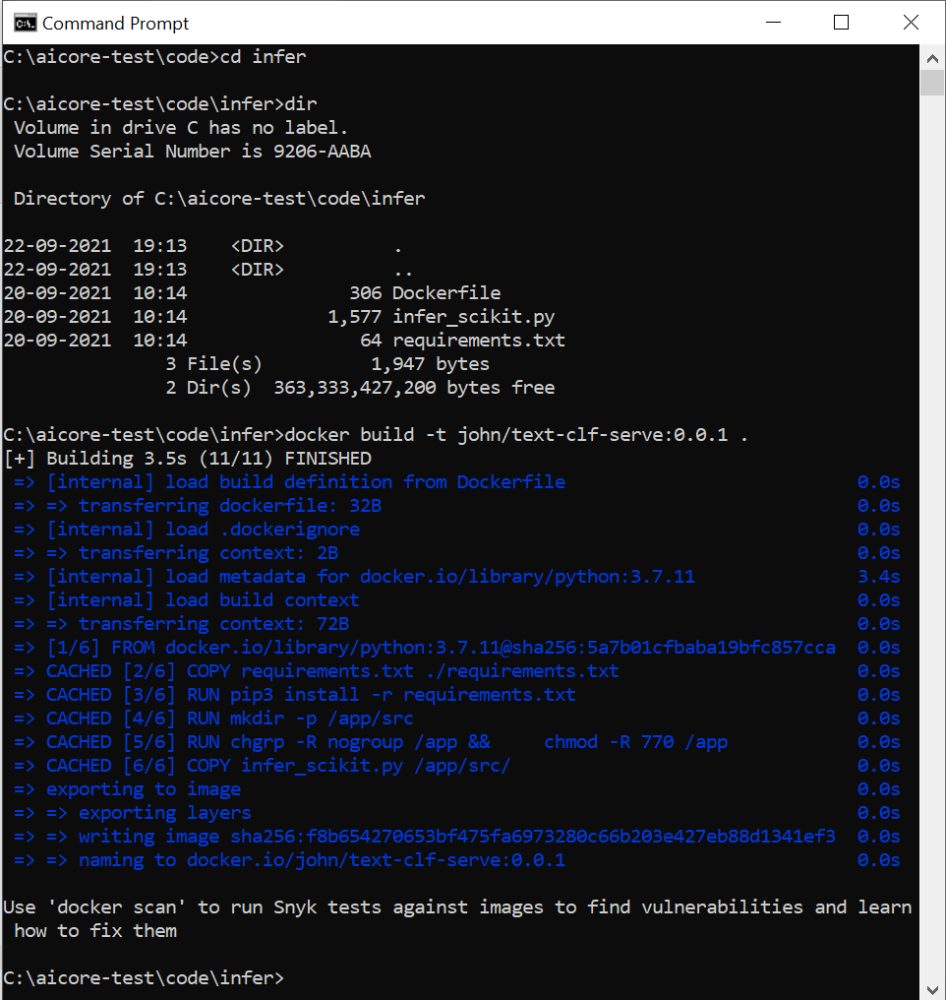

[DONE]
[ACCORDION-END]


[ACCORDION-BEGIN [Step 3: ](Upload Docker images to Docker repository)]

Execute the following on terminal *(change highlighted line)*.

```BASH[1]
docker push docker.io/<your-username>/text-clf-train:0.0.1
```

!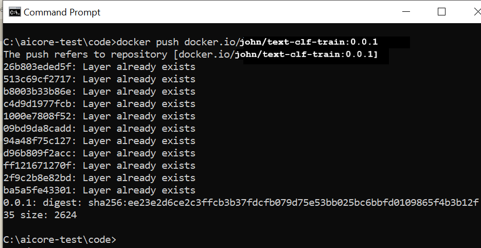

Similarly push your serving docker image.

Execute the following on terminal *(change highlighted line)*.

```BASH[1]
docker push docker.io/<your-docker-username>/text-clf-serve:0.0.1
```

Visit <https://hub.docker.com>, Inside the repository `text-clf-train` you will see you Docker image with the `tag` representing the version.  

!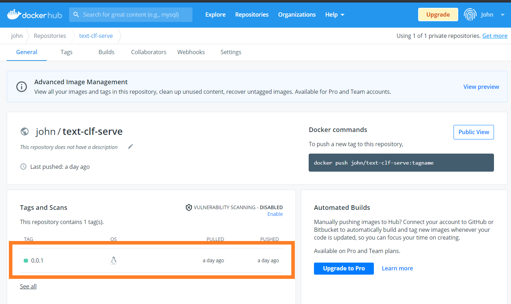

[DONE]
[ACCORDION-END]

[ACCORDION-BEGIN [Step 4: ](Create workflow files)]

Workflows instructs SAP AI Core,
  - how to execute the Docker images *(orchestrate)*
  - what inputs to provide(datasets)
  - what outputs to generate.

*(Further read [`ArgoWorkflows`](https://github.com/argoproj/argo-workflows) )*

Create a folder `workflows` locally and create the following file *(download links below)* as depicted in the image below.

Download Files

| File | Link |
| --- | --- |
| `training_workflow_tutorial.yaml` | [Download](https://raw.githubusercontent.com/SAPDocuments/Tutorials/master/tutorials/ai-core-aiapi-postman-workflows/files/workflows/training_workflow_tutorial.yaml)  |
| `serving_workflow_tutorial.yaml` | [Download](https://raw.githubusercontent.com/SAPDocuments/Tutorials/master/tutorials/ai-core-aiapi-postman-workflows/files/workflows/serving_workflow_tutorial.yaml)

!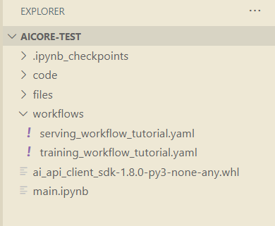

[DONE]
[ACCORDION-END]

[ACCORDION-BEGIN [Step 5: ](Choose computing hardware resources)]

Inside YAML files from previous step find the line

```YAML[2]
  ...
  ai.sap.com/resourcePlan: starter
  ...
```

The `starter` is the computing resource plan used in this tutorial. Below is the list of other available plans offered by SAP AI Core.

|     `resourcePlan` ID    |     GPUs          |     CPU cores    |     Memory (Gb)    |
|------------------------|-------------------|------------------|--------------------|
|     Train-L            |     1 V100 GPU    |     5            |     47             |
|     Infer-S            |     1 T4 GPU      |     3            |     10             |
|     Infer-M            |     1 T4 GPU      |     7            |     25             |
|     Infer-L            |     1 T4 GPU      |     15           |     55             |
|     Starter            |                   |     1            |     2.5            |
|     Basic              |                   |     3            |     10             |
|     Basic.8x           |                   |     31           |     115            |


[DONE]
[ACCORDION-END]


[ACCORDION-BEGIN [Step 6: ](Add Docker information to workflow)]

Edit the following lines *(highlighted)* in each workflow file *(YAML)*.

- `training_workflow_tutorial.yaml`

	```YAML[5]
	...
	spec:
		...
		container:
		image: "<your_docker_repo_url>/<your_username_in_docker_repo>/text-clf-train:0.0.1"
		...
	```

  !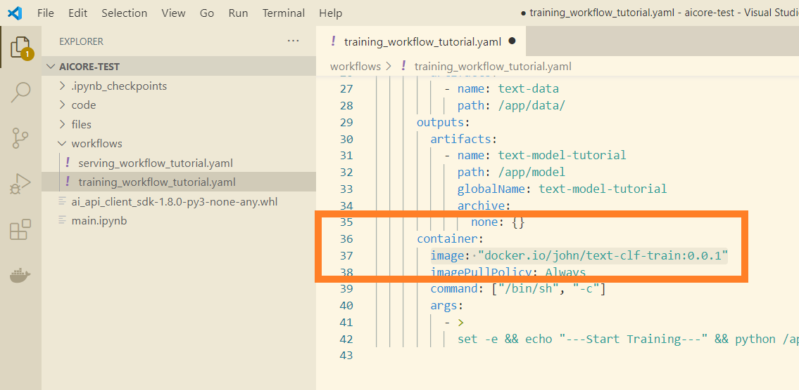

- `serving_workflow_tutorial.yaml`

	```YAML[10]
	...
	spec:
		...
		template:
			...
			spec:
				predictor
					...
					containers:
						image: "<your_docker_repo_url>/<your_username_in_docker_repo>/text-clf-serve:0.0.1"
	...
	```

  !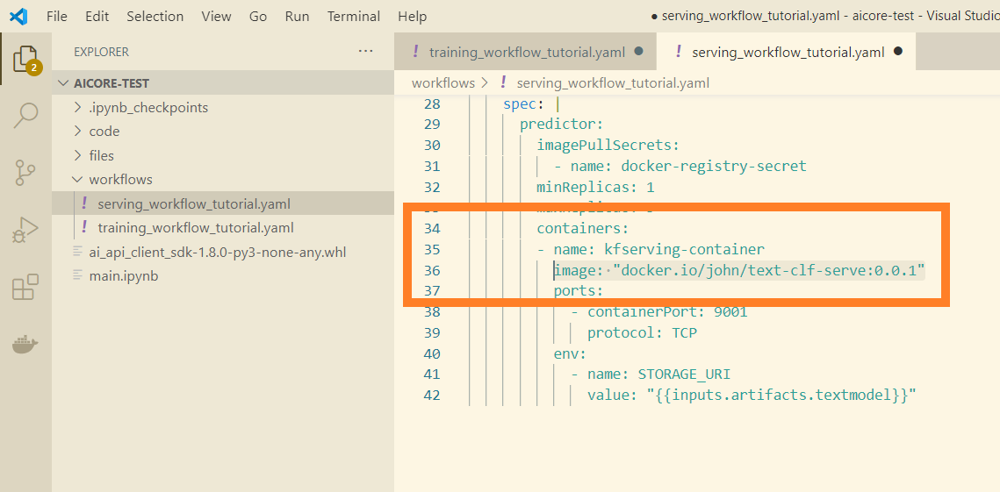


[DONE]
[ACCORDION-END]

[ACCORDION-BEGIN [Step 7: ](Upload workflows to GitHub repository)]

1. Copy the `workflows` folder *(from previous step)* to your cloned local GitHub folder. Ensure your files are placed as per image below  

	!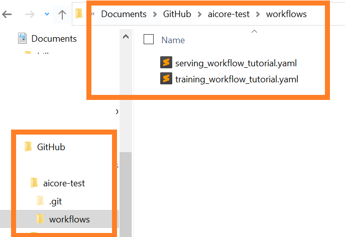

2. Open GitHub Desktop.

3. Type the commit message `workflows added`. And click on **Commit to main** button.

	!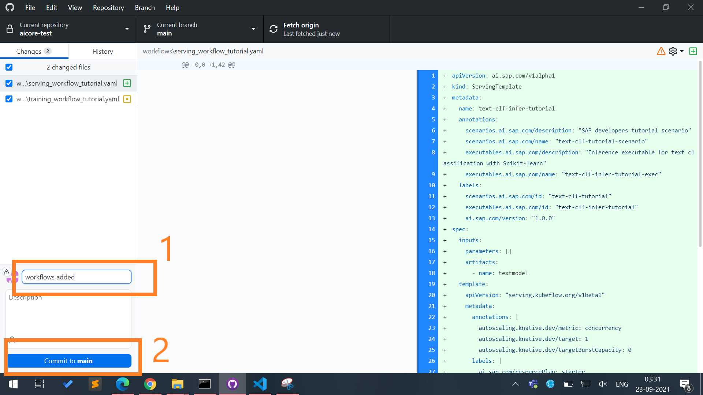  

4. Click on **Push origin**.  

	!

Now SAP AI Core will automatically sync workflows from your GitHub through the Applications.

> **IMPORTANT:** The SAP AI Core syncs in interval of 3 minutes.

[DONE]
[ACCORDION-END]


[ACCORDION-BEGIN [Step 8: ](Check workflow sync status with SAP AI API Client SDK)]

> **Warning** Ensure you have properly set up `files/aic_service_key.json` and `ai_api_client` previously.

Execute the following python code on your Jupyter notebook cell

```PYTHON
app_name = "aicore-test-app"

ai_api_client.rest_client.get(
    path=f"/admin/applications/{app_name}/status"
)
```

Example Output

```PYTHON
{
    'health_status': 'Healthy',
    'message': 'successfully synced (all tasks run)',
    'reconciled_at': '2021-09-21T11:10:10Z',
    'source': {'path': 'workflows',
     'repourl': 'https://GitHub.com/John/aicore-test',
     'revision': '87f3f1c2cedb686235e8cfe395266d651ffb44b1'},
    'sync_finished_at': '2021-09-20T11:10:10Z',
    'sync_ressources_status': [
     {'kind': 'ServingTemplate',
      'message': 'servingtemplate.ai.sap.com/text-clf-infer-tutorial created',
      'name': 'text-clf-infer-tutorial',
      'status': 'Synced'},
     {'kind': 'WorkflowTemplate',
      'message': 'workflowtemplate.argoproj.io/text-clf-train-tutorial created',
      'name': 'text-clf-train-tutorial',
      'status': 'Synced'}],
    'sync_started_at': '2021-09-20T11:10:10Z',
    'sync_status': 'Synced'}
```


### Summary: what was achieved.

- The training and serving docker images are pushed to the docker repository
- The training and serving workflows(*templates*) are uploaded to the GitHub repository.

!


[VALIDATE_6]
[ACCORDION-END]
