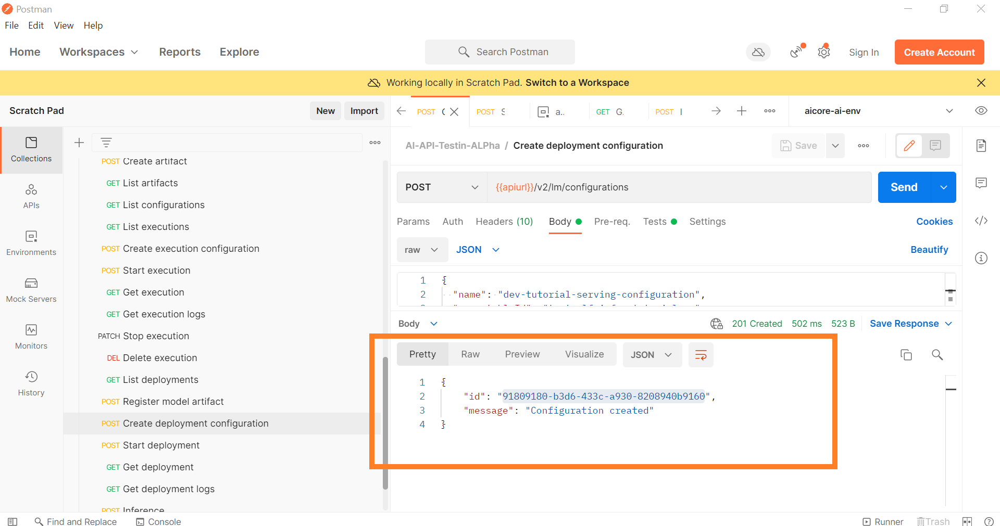
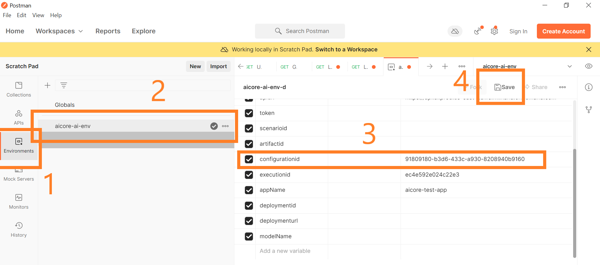
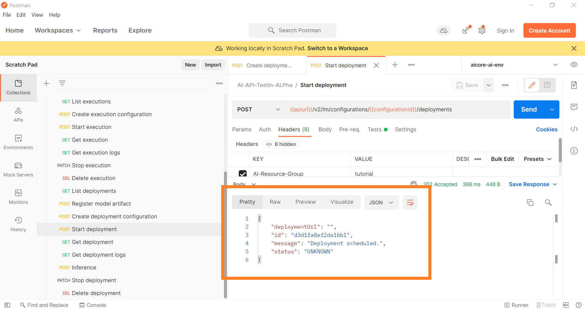
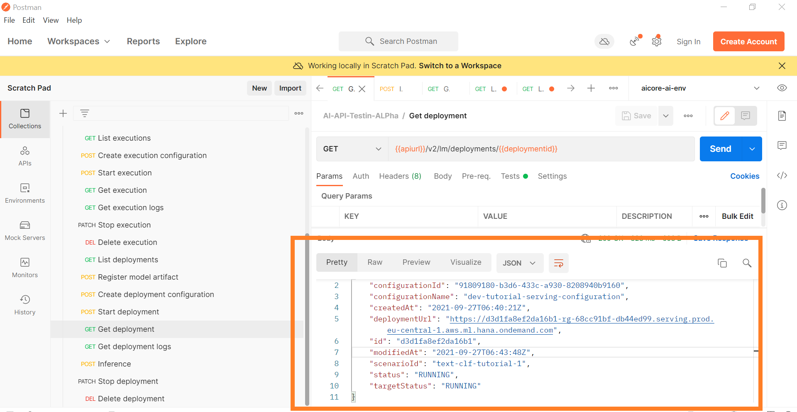
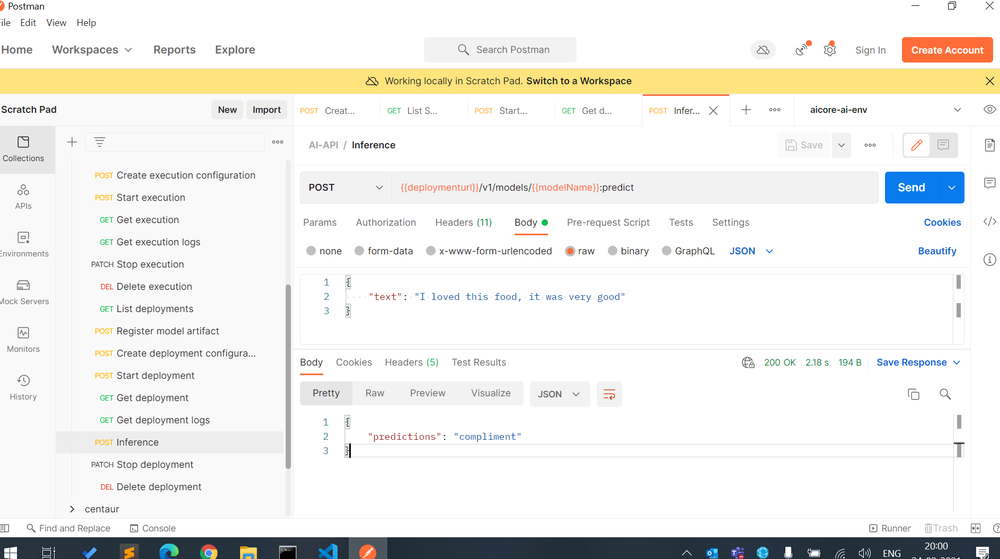

## Details
### You will learn
  - How to create deployment configuration on SAP AI Core
  - Manage model deployment on SAP AI Core via Postman Client.

---

Ensure your model training is completed without error, because the weights of the model are derived from training TUTORIAL ( Training the Model with SAP AI Core(Postman) ).

[ACCORDION-BEGIN [Step 1: ](Create Serving Configuration for Deployment)]

Similar to the training we will now create a serving configuration. This time the input artifact is the trained model.
We also create a deployment in the same step, since that is just one more line of code.


> **COLLECTIONS** > *POST* Create deployment configuration

### Endpoint

**POST**
`{{apiurl}}/v2/lm/configurations`

### HEADER

| Key | Value |
| --- | --- |
| `AI-Resource-Group` | tutorial |

### BODY
```
{
  "name": "dev-tutorial-serving-configuration",
  "executableId": "text-clf-infer-tutorial",
  "scenarioId": "text-clf-tutorial",
  "versionId": "0.0.1",
  "parameterBindings": [],
  "inputArtifactBindings": [
      {
      "key": "textmodel",
      "artifactId": "bbf25c3a-0ba6-4b57-997e-c33ac1bfb328"
    }
  ]
}
```

**IMPORTANT:** Following the key-value pairs to be changed in the body

| Key | Where to get value from |
| --- | --- |
| `artifactId` | from `RESPONSE` of API call ` *GET* Get execution`,<br> the output artifact Id

other values are used from `workflows\serving_workflow_tutorial.yaml`

!

**SEND**

### Response

```
{
    "id": "91809180-b3d6-433c-a930-8208940b9160",
    "message": "Configuration created"
}
```

!

**IMPORTANT:** This `id` needs to be added in the Postman Environment Variable.

| VARIABLE| CURRENT VALUE |
| --- | --- |
| `configurationid` | 91809180-b3d6-433c-a930-8208940b9160

!


[DONE]
[ACCORDION-END]


[ACCORDION-BEGIN [Step 2: ](Start Serving Deployment)]

We had create the configuration ( *serving configuration*) of deployment in the previous step. Now we will use that configuration to deploy the model.

> **COLLECTIONS** > *POST* Start deployment

### Endpoint
**POST**
`{{apiurl}}/v2/lm/configurations/{{configurationid}}/deployments`

### Header

| Key | Value |
| --- | --- |
| `AI-Resource-Group` | tutorial |


**SEND**

### Response

```
{'deployment_url': '',
 'id': 'd3d1fa8ef2da16b1',
 'message': 'Deployment scheduled.',
 'status': <Status.UNKNOWN: 'UNKNOWN'>}
```      

*(If the response results in 404, read the **Deprecation Notice below** )*

!

**IMPORTANT:** This `id` needs to be added in the Postman Environment Variable.

| VARIABLE| CURRENT VALUE |
| --- | --- |
| `deploymentid` | d3d1fa8ef2da16b1

!

### Deprecation Notice

If the previous call to start deployment configuration does not work try with following endpoint, header, body as follows.

**ENDPOINT**

*POST*
`{{apiurl}}/v2/lm/deployments`

**HEADER**

| KEY | VALUE |
| --- | --- |
| `AI-Resource-Group` | `tutorial`

**BODY**

*Change `configurationId` below*
```
{
  "configurationId": "91809180-b3d6-433c-a930-8208940b9160"
}
```

[DONE]
[ACCORDION-END]


[ACCORDION-BEGIN [Step 3: ](Observe Deployment Status)]

Since it again takes some time for the our trained model to be deployed and ready for inference we will periodically check the status.

> **COLLECTIONS** > *GET* Get deployment

### Endpoint
**GET**
`{{apiurl}}/v2/lm/deployments/{{deploymentid}}`


### Header

| Key | Value |
| --- | --- |
| `AI-Resource-Group` | `tutorial` |

### Response

> **Note**: Do not worry about temporary errors in the status details. The deployment may take a few minutes(~ 1 min)

```
{
    "configurationId": "91809180-b3d6-433c-a930-8208940b9160",
    "configurationName": "dev-tutorial-serving-configuration",
    "createdAt": "2021-09-27T06:40:21Z",
    "deploymentUrl": "https://d3d1fa8ef2da16b1-rg-68cc91bf-db44ed99.serving.prod.eu-central-1.aws.ml.hana.ondemand.com",
    "id": "d3d1fa8ef2da16b1",
    "modifiedAt": "2021-09-27T06:43:48Z",
    "scenarioId": "text-clf-tutorial-1",
    "status": "RUNNING",
    "targetStatus": "RUNNING"
}
```
!

**IMPORTANT:** This `deploymenturl` needs to be added in the Postman Environment Variable. ( *Create a variable if not exists*)

| VARIABLE| CURRENT VALUE |
| --- | --- |
| `deploymenturl` | `https://d3d1fa8ef2da16b1-rg-68cc91bf-db44ed99.serving.prod.eu-central-1.aws.ml.hana.ondemand.com`


[DONE]
[ACCORDION-END]

[ACCORDION-BEGIN [Step 4: ](Use Deployed Model)]


Inference the deployed model

We will use the deployed model to perform inference. Ensure that the deployment is complete before we trigger the inference.

### Endpoint

**POST**
`{{deploymenturl}}/v1/models/{{modelName}}:predict`

> Note: This URL endpoint along with model name is generated by the inference python script . Checkout `infer_scikit.py`

### ADD Postman Environment Variable

| VARIABLE | CURRENT VALUE |
| --- | --- |
| `modelName` | `textmodel` |

### Header

| Key | Value |
| --- | --- |
| `Content-Type` | application/json |
| `AI-Resource-Group` | tutorial |


### Body
```
{
    "text": "I loved this food, it was very good"
}
```  

**SEND**

### Response

!

[DONE]
[ACCORDION-END]


[ACCORDION-BEGIN [Step 5: ](Stop the deployed model)]


Stop the deployment

**The Inference service runs 24/7. In order to reduce costs we stop it.**

> **COLLECTIONS** > *PATCH* Stop deployment

### Endpoint
**PATCH**
`{{apiurl}}/v2/lm/deployments/{{deploymentid}}`

### Header

| Key | Value |
| --- | --- |
| `AI-Resource-Group` | tutorial |

### Body
```
{
    "targetStatus": "STOPPED"
}
```

**SEND**

---
**END OF TUTORIAL**


[VALIDATE_1]
[ACCORDION-END]

---
