## Details
### You will learn
  - How to create GitHub and Docker repository.
  - Make API calls connect repository to SAP AI Core

---

[ACCORDION-BEGIN [Step 1: ](Create GitHub repository)]

A GitHub repository refers to a folder *(project)*, with Version-Control, which means you can track any changes to files contained within revert them.

1. Sign up for GitHub, Go to [github.com](https://github.com/).

2. Create a repository, Click **New**.

    !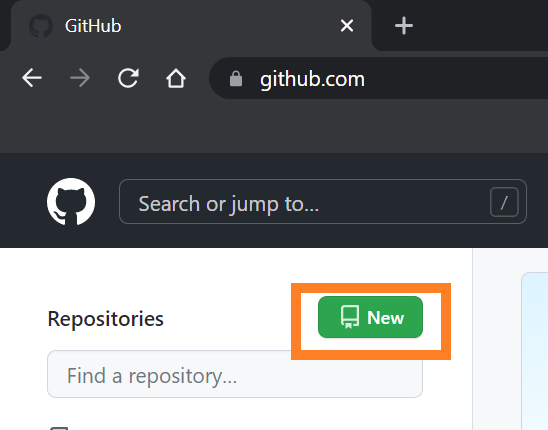  

3. Set the repository name as `aicore-test` ( *customizable*)

    !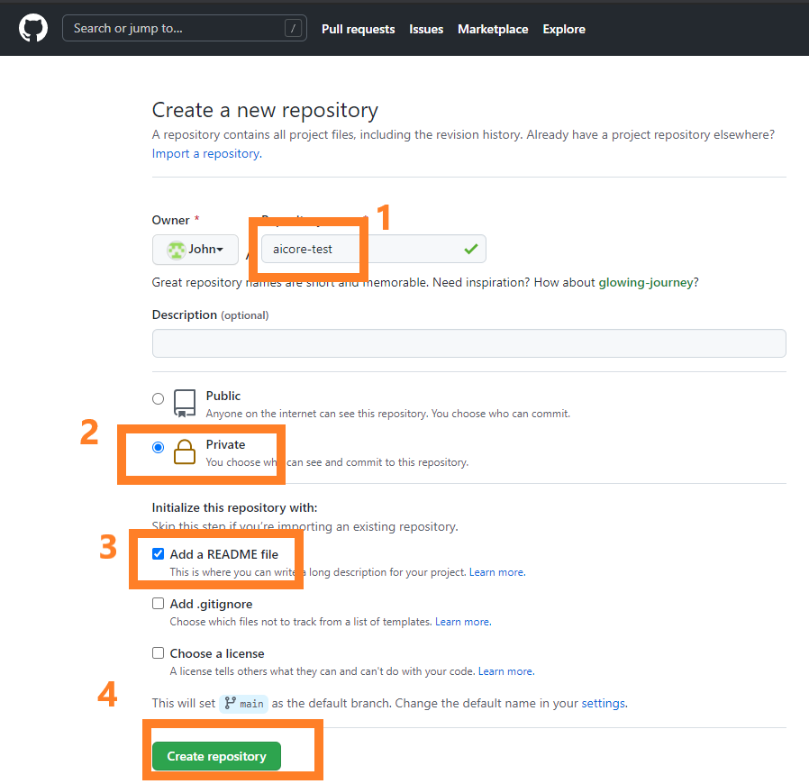

    !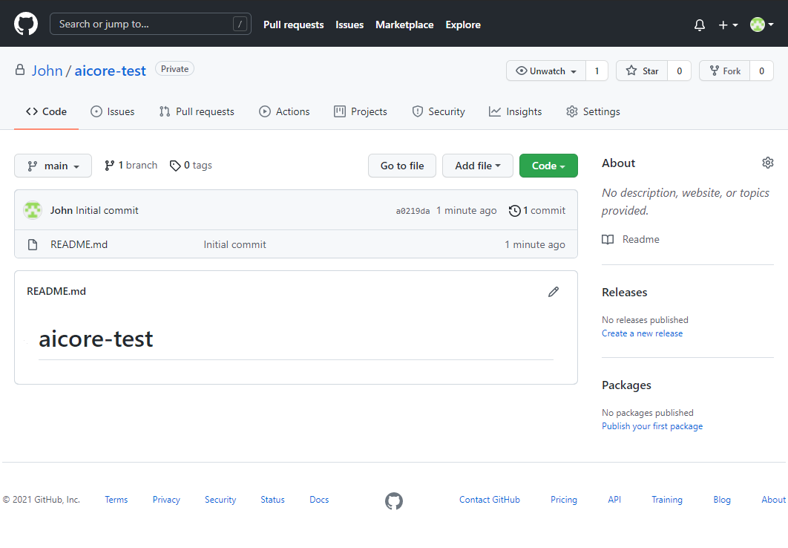

[DONE]
[ACCORDION-END]

[ACCORDION-BEGIN [Step 2: ](Clone GitHub using GitHub Desktop)]

Cloning is the process of managing your GitHub repositories on you local computer

GitHub Desktop helps you clone, create, edit and sync files of your GitHub repository from you local computer.

1. Install GitHub Desktop. [Download here](https://desktop.github.com/)  

2. Open GitHub Desktop.

3. From welcome screen login to your GitHub Account *(Alternative login: **File** > **Options** > **Accounts**).

3. Click **File > Clone a repository**.

    !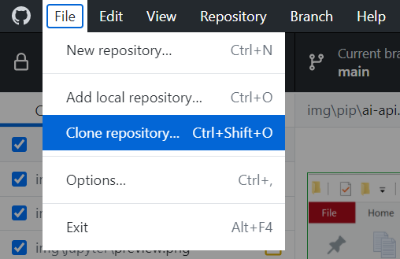

4. Go to **URL** tab. Type `<your github username>/aicore-test`.

    !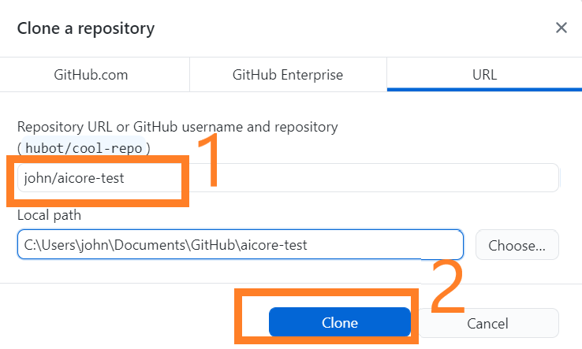

[DONE]
[ACCORDION-END]

[ACCORDION-BEGIN [Step 3: ](Upload Files to GitHub)]

1. Create a folder name `workflows`. Inside the local copy of your GitHub *(cloned repository)*

    !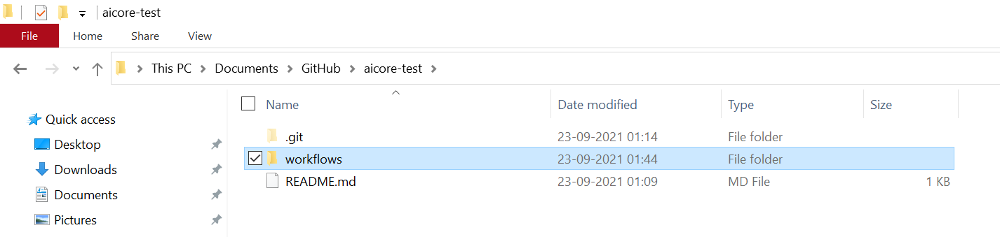

2. Create **an empty file** named `training_workflow_tutorial.yaml` inside the `workflows` folder.

    !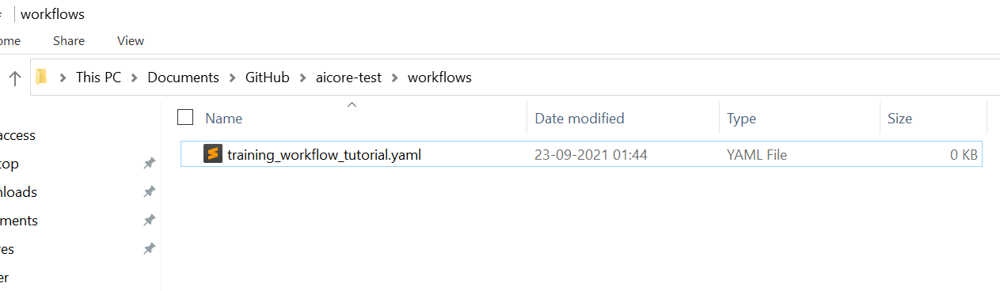

    > **CAUTION**: Avoid storing any service keys or passwords inside a Git tracked folder.

3. Sync your local git repo with online. Open GitHub Desktop.

4. Click on **Commit to main** button

    !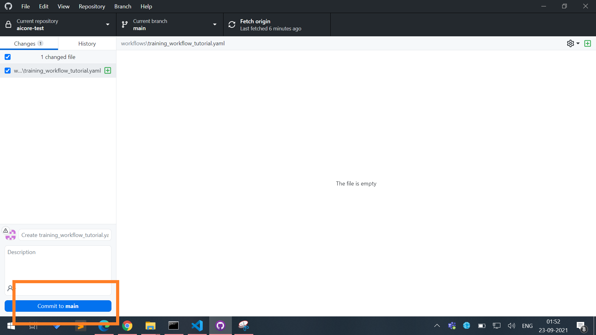

5. Then pres **Push Origin** button.

    !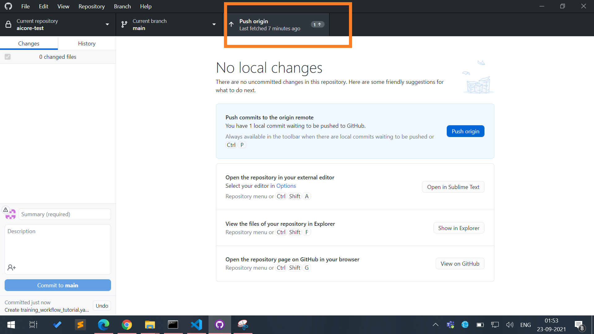

This will sync up your local files with GitHub repository(online).

GitHub Desktop will only show **un-synced** changes.

!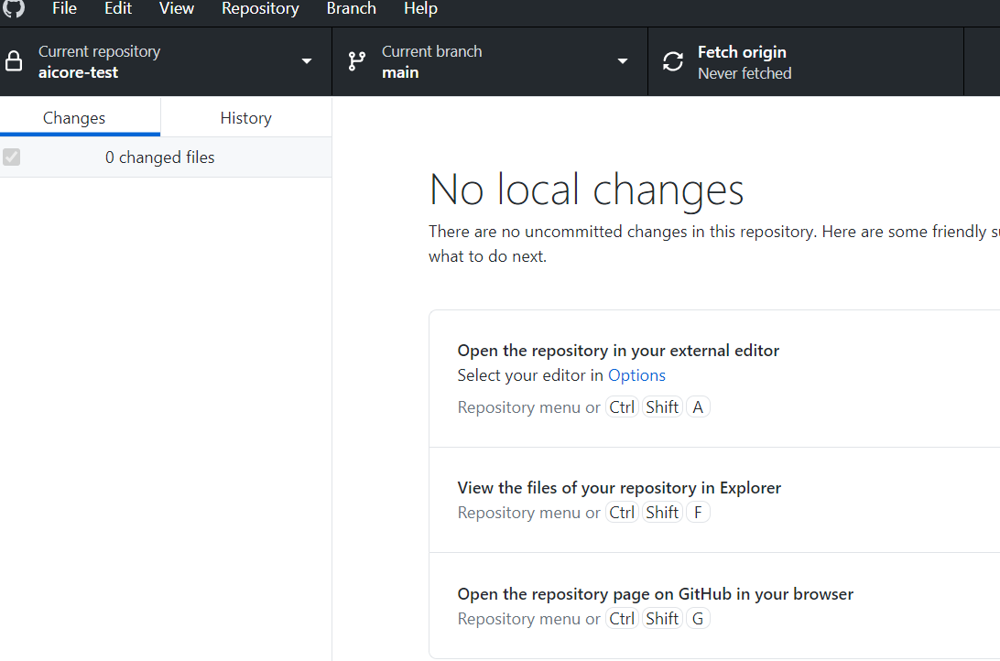


[DONE]
[ACCORDION-END]


[ACCORDION-BEGIN [Step 4: ](API to connect GitHub SAP AI Core)]


> **CAUTION** At present SAP AI Core can connect to single GitHub repository, skip this step if its already connected to one. Contact support to change if required.

After connecting GitHub repository to your SAP AI Core account, whenever you will push changes *(upload files)* to GitHub, the SAP AI Core can pull(sync) them automatically.

Make the following API call using Postman

> **COLLECTIONS** > admin > repositories > *POST* Create repository

### Endpoint
**POST**
`{{apiurl}}/v2/admin/repositories`

### Body

- Get or generate GitHub Personal Access Tokens (PAT) [See how](https://docs.github.com/en/authentication/keeping-your-account-and-data-secure/creating-a-personal-access-token).
>**IMPORTANT** Do not use your GitHub Passwords in the request body.

- Edit your GitHub URL and your credentials, *(highlighted lines)* below.

```JSON[3, 4, 5]
{
    "name": "aicore-test",
    "url": "https://github.com/<your-username>/aicore-test",
    "username": "Your-github-username",
    "password": "your-git-PAT-token"
}
```

!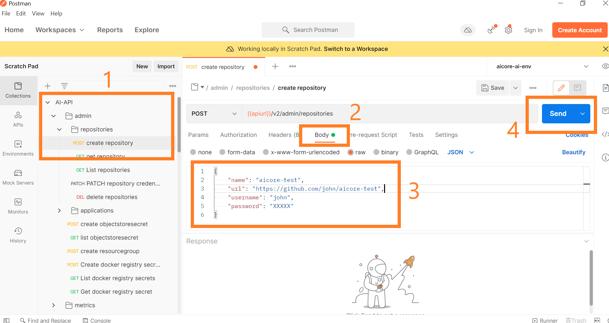

**SEND**

### Response

```
{   
    "message": "Repository has been on-boarded."
}
```

[DONE]
[ACCORDION-END]

[ACCORDION-BEGIN [Step 5: ](API to list connected GitHub repository)]
List Connected Git Repositories

> **COLLECTIONS** > admin> repositories > *GET* List repositories


### Endpoint
**GET**
`{{apiurl}}/v2/admin/repositories`

**SEND**

### RESPONSE
```
{
   'count': 1,
   'resources': [
      {
           'name': 'aicore-test',
           'status': 'COMPLETED',
           'url': 'https://github.com/john/aicore-test'
       }
   ]
}
```

[DONE]
[ACCORDION-END]


[ACCORDION-BEGIN [Step 6: ](API to create application on SAP AI Core)]

Application is an SAP AI Core entity which links a sub-folder inside your connected GitHub repository. SAP AI Core will look into these folders for any workflow *(explained later)*, and sub-folder within the same will not be searched for.

> **COLLECTIONS** > admin > applications > *POST* Create application

### Endpoint
**POST**
`{{apiurl}}/v2/admin/applications`

### Body

Edit your GitHub username *(highlighted lines)* below.

```JSON[3]
{
    "applicationName": "aicore-test-app",
    "repositoryUrl": "https://github.com/<your-username>/aicore-test",
    "revision": "HEAD",
    "path": "workflows"
}
```

!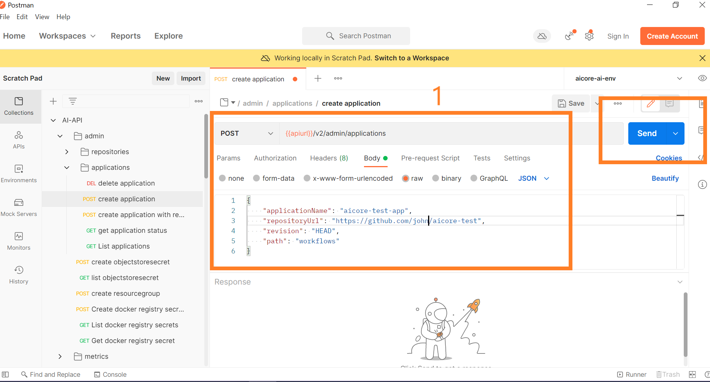

**SEND**

### RESPONSE
```
{
    "id": "aicore-test-app",
    "message": "Application has been successfully created."
}
```

[DONE]
[ACCORDION-END]


[ACCORDION-BEGIN [Step 7: ](API to list connected Applications)]

> **COLLECTIONS** > admin > applications > *GET* List applications

### Endpoint
**GET**
`{{apiurl}}/v2/admin/applications`

**SEND**

### Response

```
{
    'count': 1,
    'resources': [{
        'application_name': 'aicore-test-app',
        'path': 'workflows',
        'repository_url': 'https://github.com/john/aicore-test',
        'revision': 'HEAD'
    }]
}
```

[DONE]
[ACCORDION-END]

[ACCORDION-BEGIN [Step 8: ](Create Docker repository)]

1. Sign up at [docker.com](https://www.docker.com)

2. Click **Create Repository**.

    !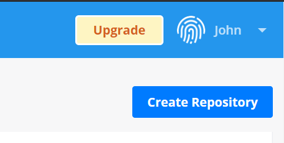

3. Name the repository "text-clf-train"  

    !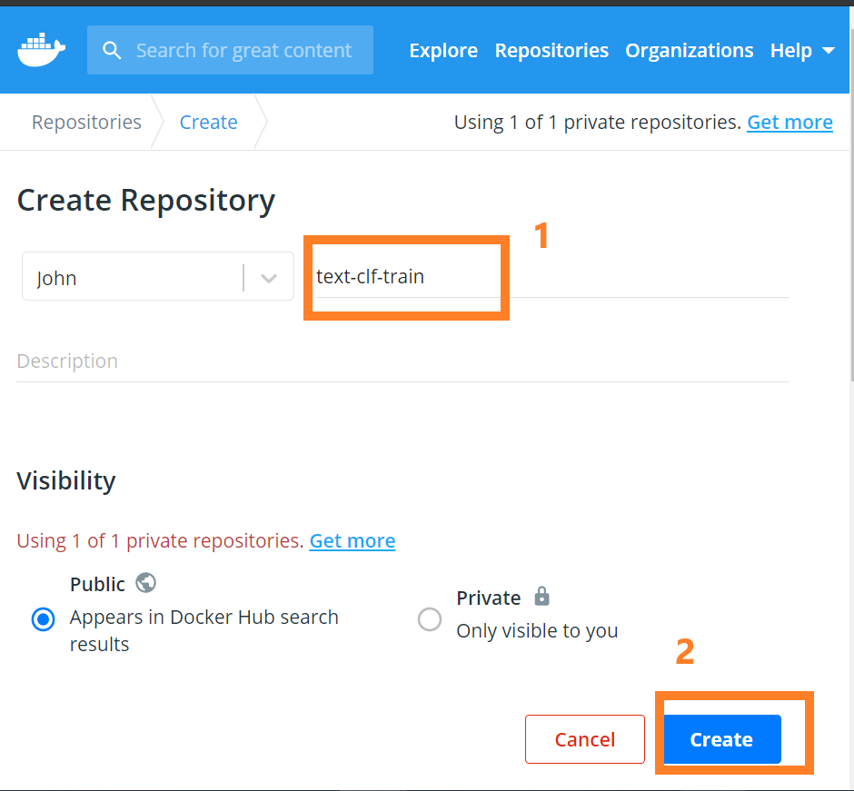

4. Create another repository similarly, named **text-clf-serve**.

    !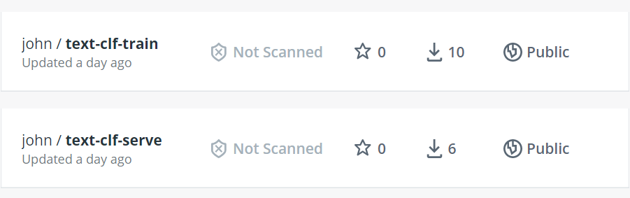


[DONE]
[ACCORDION-END]

[ACCORDION-BEGIN [Step 9: ](Manage Docker locally)]

1. Download and Install Docker Desktop. [Download here](https://www.docker.com/products/docker-desktop)

2. After Installation. You will see Docker Desktop icon on your desktop tray.

    !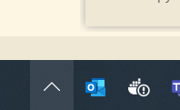

3. Verify with your terminal *(command prompt)*. Execute the following on terminal.

    ```BASH
    docker --version
    ```

    !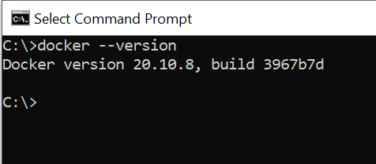

[DONE]
[ACCORDION-END]

[ACCORDION-BEGIN [Step 10: ](API to Create Docker Registry Secret.)]

Secret hold your docker credentials which enables SAP AI Core to fetch your docker images (code files).

You can create multiple secrets.

> **COLLECTIONS** > admin > *POST* Create docker registry secret

### Endpoint
**POST**
`{{apiurl}}/v2/admin/dockerRegistrySecrets`

Create the following file `docker_secret.json` .

### Body

Edit and replace `$username` with your Docker username and `$password` with password. *(highlighted line)*.

```JSON[4]
{
  "name": "docker-registry-secret",
  "data": {
    ".dockerconfigjson": "{\"auths\": {\"docker.io\": {\"username\": \"$username\", \"password\": \"$password\"}}}"
  }
}
```

!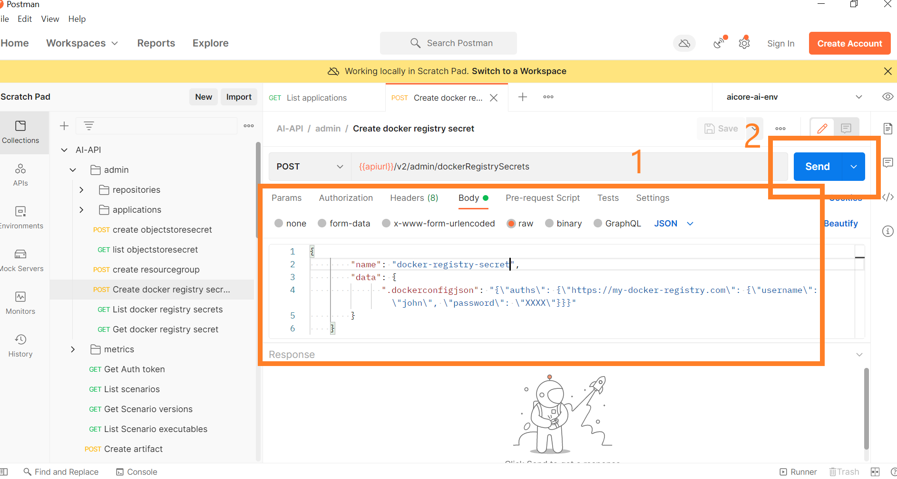

**SEND**

### Response
```
{'message': 'secret has been been created'}
```

#### List connected Docker registry secret
> **COLLECTIONS** > admin > *GET* List docker registry secrets

`RESPONSE`

```
{
    'count': 1,
    'resources': [{
        'name': 'docker-registry-secret'
    }]
}
```

> **IMPORTANT:** Creating docker secret does not imply docker account gets connected. It only implies that whenever SAP AI Core search(if required) for docker images it will use these credentials to search docker repository. At that time it may happen that the provided credentials are incorrect.

[VALIDATE_1]
[ACCORDION-END]

---
