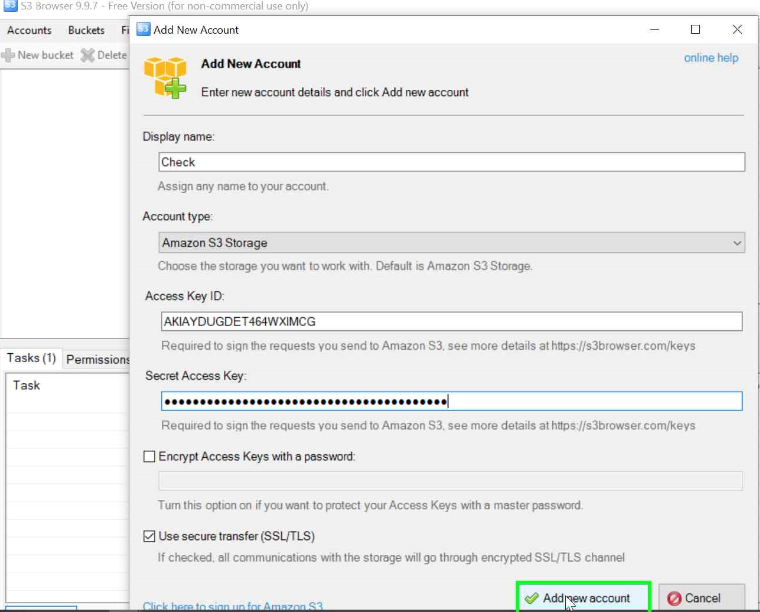
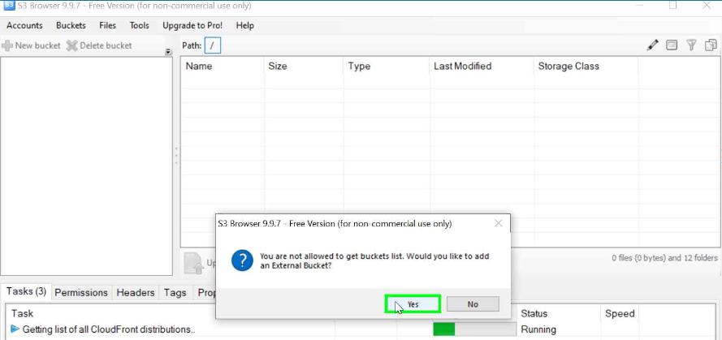
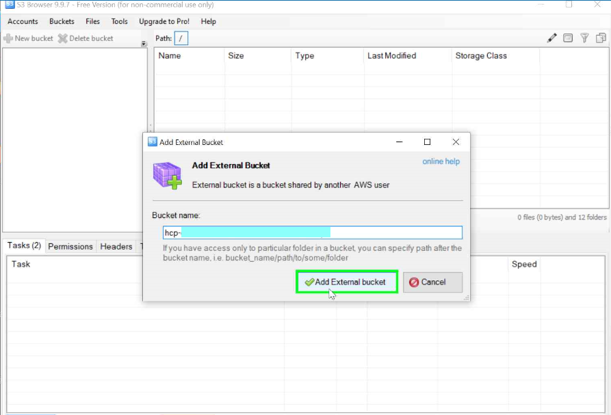
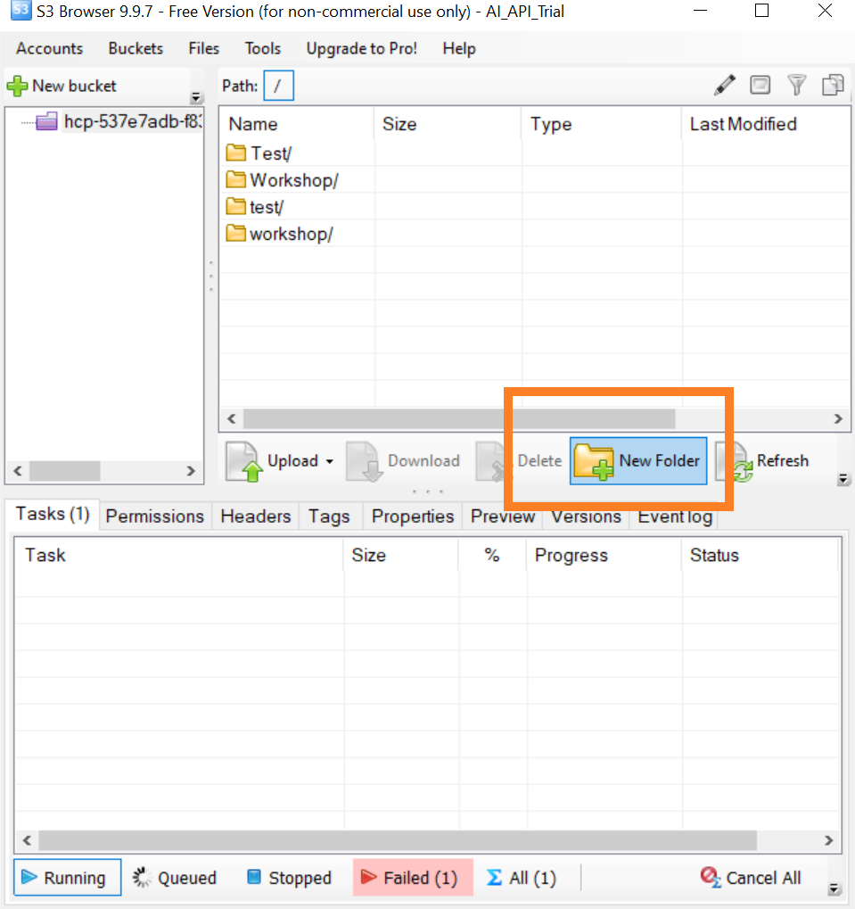
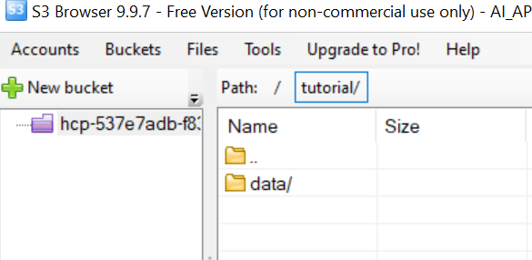
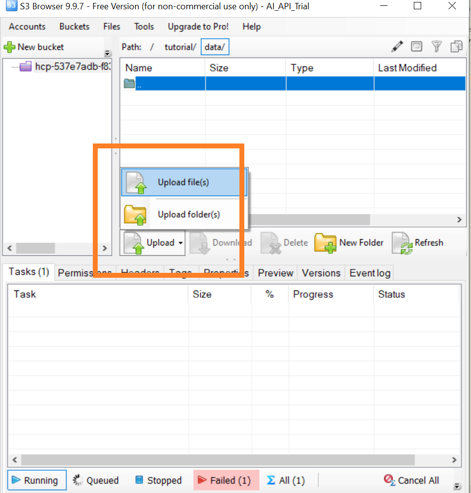
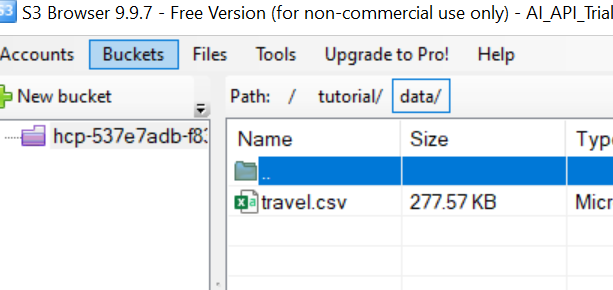

## Details
### You will learn
  - How to enable multi-tenancy with resource group.
  - Create AWS S3 connection to SAP AI Core

---

[ACCORDION-BEGIN [Step 1: ](Create resource group)]


Resource groups represent a virtual collection of related resources within the scope of one SAP AI Core tenant.

> **COLLECTIONS** > admin > *POST* Create `resourcegroup`

### Endpoint
**POST**
`{{apiurl}}/v2/admin/resourceGroups`

### Body

```
{
  "resourceGroupId": "tutorial"
}
```

!

**SEND**

### Response
```
{
    'resource_group_id': 'tutorial',
    'tenant_id': '1111-dddd-444-888-888888',
    'zone_id': ''
}
```
The value of `tenant_id` is equal to the value of `identityzoneid` from service key of SAP AI Core.

>**IMPORTANT:** The `create resource group` request results in `Response: 202`, which means the backend server will take time(~30 sec) to create the group. List the resource group(*see below*) to see the status of creation

[DONE]
[ACCORDION-END]

[ACCORDION-BEGIN [Step 2: ](API to list resource groups)]

> **COLLECTIONS** > admin > *GET* List `resourcegroup`

### Endpoint
**GET**
`{{apiurl}}/v2/admin/resourceGroups`

**SEND**

!

### Response

```
{'count': 1,
 'resources': [{
    'resource_group_id': 'tutorial',
    'status': 'PROVISIONED',
    'status_message': 'All onboarding steps are completed.',
    'tenant_id': '1111-dddd-444-888-888888',
    'zone_id': ''
  ]}
}
```

[DONE]
[ACCORDION-END]

[ACCORDION-BEGIN [Step 3: ](Manage AWS S3 Object Store using S3 Browser)]

1. You can get AWS S3 Bucket from either of two ways:

	1. Through BTP Cockpit.

	2. Through AWS. Refer [AWS User Guide to S3](https://docs.aws.amazon.com/AmazonS3/latest/userguide/create-bucket-overview.html)


2. Install S3 Browser. [Download here](https://s3browser.com/)

3. Open S3 Browser and Enter your Credentials.  

    !

4. If you don't have bucket create one and skip to next step.

	!  

	!  


[DONE]
[ACCORDION-END]


[ACCORDION-BEGIN [Step 4: ](Upload dataset to AWS S3 Object Store)]

1. Open S3 Browser.

2. Click **New Folder** and Create a folder named `tutorial`.

	!

2. Create another folder name `data` inside the `tutorial`.

	!.

3. Upload your datafile `travel.csv` inside `tutorial/data/`. This will be used for training the model.

	| File   | Link |
	|  :------------- | :------------- |
	|  `travel.csv` | [Download Here](https://raw.githubusercontent.com/SAPDocuments/Tutorials/master/tutorials/ai-core-aiapi-postman-resource/travel.csv) |

	!


Final look of S3 bucket.

!


[DONE]
[ACCORDION-END]

[ACCORDION-BEGIN [Step 5: ](API to connect S3 Object Store to SAP AI Core)]

Object Stores are connected to the resource groups, hence ensure you have the resource group created before proceeding.

Get your AWS S3 Credentials in the format below.

>  In case you are using the SAP Object Store, get the content from `SAP BTP cockpit > SAP BTP subaccount > Instances and Subscriptions > Instances > Credentials `.

```JSON
{
  "access_key_id": "ASDFASDFASDFASDF",
  "bucket": "asd-11111111-2222-3333-4444-55555555555",
  "secret_access_key": "asdfASDFqwerQWERasdfQWER",
  "host": "s3.amazonaws.com",
  "region": "us-east-1",
  "uri": "s3://ASDFASDFASDFASDF:asdfASDFqwerQWERasdfQWER@s3.amazonaws.com/asd-11111111-2222-3333-4444-55555555555",
  "username": "asd-s3-123456-78910-aaa3-dddd-asdf12345"
}
```

Make the API call.

> **COLLECTIONS** > *POST* create `objectstore`

### Endpoint
**POST**
`{{apiurl}}/v2/admin/objectStoreSecrets`

### Body
Create the body using above s3 credentials with following key-value, **(other key-value take from example body below)**

| S3 Key | BODY Key | *Example Value*|
| --- | -- | --- |
| bucket | bucket | asd-11111111-2222-3333-4444-55555555555
| `access_key_id` | `data` > `AWS_ACCESS_KEY_ID` | ASDFASDFASDFASDF
| `secret_access_key` | `data` > `AWS_SECRET_ACCESS_KEY` | `asdfASDFqwerQWERasdfQWER`
| `regiion` | region | us-east-1
| `host` | endpoint | s3.amazonaws.com

Example Body

Edit the highlighted lines.
```JSON[4, 5, 7, 9, 10]
{
    "name": "default",
    "type": "S3",
    "bucket": "asd-11111111-2222-3333-4444-55555555555",
    "endpoint": "s3.amazonaws.com",
    "pathPrefix": "tutorial",
    "region": "us-east-1",
    "data": {
        "AWS_ACCESS_KEY_ID": "ASDFASDFASDFASDF",
        "AWS_SECRET_ACCESS_KEY": "asdfASDFqwerQWERasdfQWER"
    }
}
```
**DONT SEND YET! You will require to set header as well**
!


**HEADER**

|KEY | VALUE |
| --- | --- |
| AI-Resource-Group | tutorial |


!

**SEND**

### Response

```
{'message': 'secret has been created'}
```

This will connect your object store. The connection will be named `default`.

[VALIDATE_1]
[ACCORDION-END]

---
