## Details
### You will learn
  - How to use Postman environment variable
  - How to authorize Postman API calls with OAuth
---

[ACCORDION-BEGIN [Step 1: ](Setup Postman with SAP AI Core API Collections)]

Download the following files

|  File Name   | File Description | Download LINK
|  :------------- | :------------- | --- |
|  `AI-API_postman_collection.json` | [Download Here](https://raw.githubusercontent.com/SAPDocuments/Tutorials/master/tutorials/ai-core-aiapi-postman-setup/AI-API_postman_collection.json)
|  `AI-API_postman_environment.json` | [Download Here](https://raw.githubusercontent.com/SAPDocuments/Tutorials/master/tutorials/ai-core-aiapi-postman-setup/AI-API_postman_environment.json)


Open Postman.
Click on the **Import** button.

!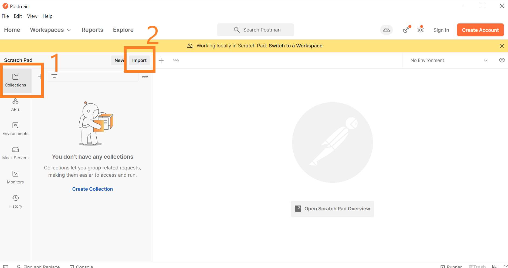

Click on **Upload Files** and browse-open the `AI-API_postman_collection.json` file.

!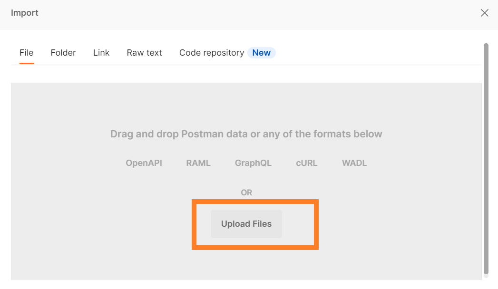

Then click **Import**.

!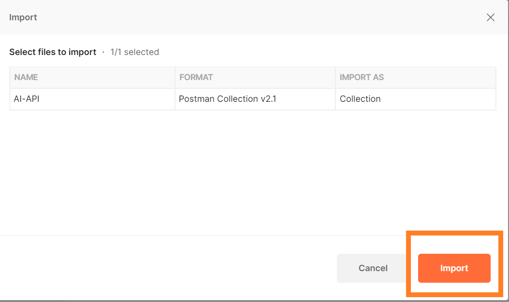

You will see all the API endpoints used for SAP AI Core calls gets listed under **Collections > AI-API** in Postman

!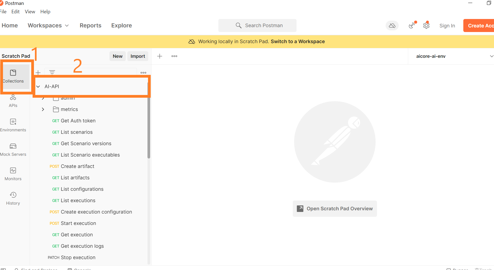.

Follow the same steps and import your `AI-API_postman_environment.json`,

!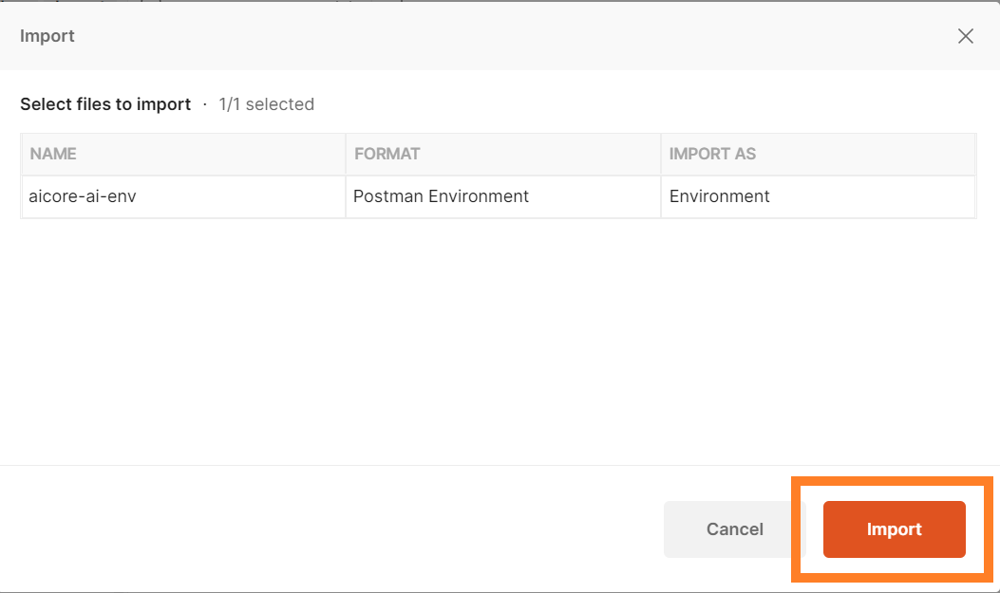

[DONE]
[ACCORDION-END]


[ACCORDION-BEGIN [Step 2: ](Set Environment Variable)]

To use environment variables for our API calls.

1. Click the drop-down on the top right corner
2. select `aicore-ai-env` ( *imported in previous step* )

> If any part of your API call, whether endpoint, **Headers**, **Body**, **Authorization** use environment variable, it is enclosed within double braces. Example:`{{clientid}}`

!

To quick-edit value of environment variable.

1. Click on the **eye** button on top right corner
2. Click on the pencil under the column **CURRENT VALUE**.
3. Type the value in the field and click anywhere outside the popup-box. It would be saved.

!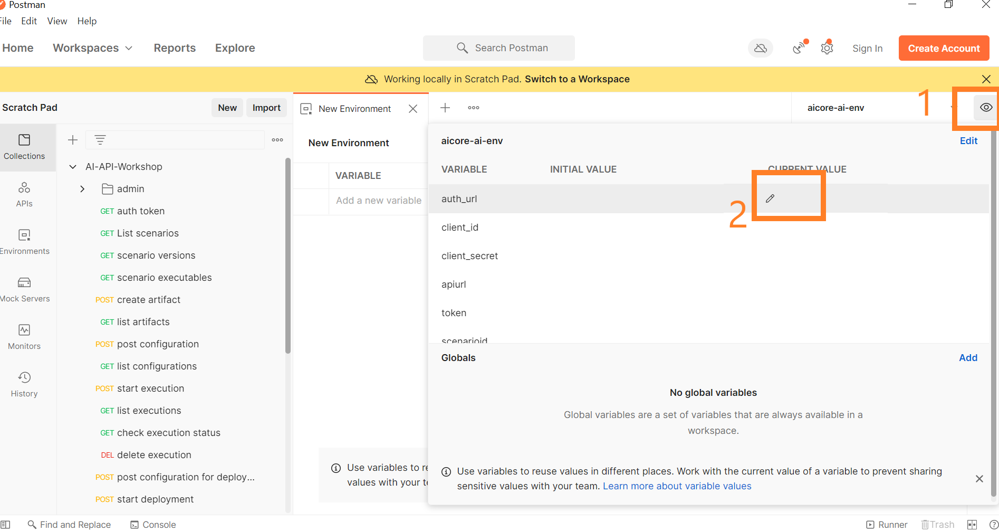


### Test yourself

In the given image, the API endpoint uses a environment variable.

!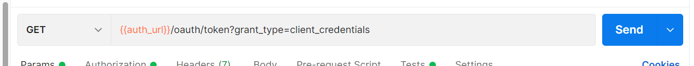

[VALIDATE_1]
[ACCORDION-END]

[ACCORDION-BEGIN [Step 3: ](Set SAP AI Core service keys as Postman Environment variables)]


Follow the [provisioning steps](https://help.sap.com/viewer/product/AI_CORE/CLOUD/en-US) to get an SAP AI Core service instance key from SAP BTP cockpit.

> If you already have an SAP AI Core service instance you can get the service key from your SAP BTP cockpit:
**SAP BTP cockpit > SAP BTP subaccount > Instances and Subscriptions > Instances > Credentials**

The service key file contents should look similar like this:

```JSON
{
  "clientid": "ss-2222-aaa-4444-888-8555!bbb|aicore!bbb",
  "appname": "2222-aaa-4444-888-8555!bbb|aicore!bbb",
  "identityzone": "tutorial",
  "identityzoneid": "11111-dddd-444-888-888888",
  "clientsecret": "8MQWERTy=",
  "serviceurls": {
  "ML_API_URL": "https://api.ai.prod.us-east-1.aws.ml.hana.ondemand.com"
  },
  "url": "https://tutorial.authentication.us10.hana.ondemand.com"
}
```

> **CAUTION** Set your own values, the values presented are for understanding.

Manual edit your Postman environment variables w.r.t. to the SAP AI Core service key JSON obtained, use the VARIABLE association mentioned below.

| Postman VARIABLE | KEY in SERVICE KEY ( *paste their values* ) |
|--- | --- |
| `auth_url` | `url`
| `client_id` | `clientid`
| `client_secret` | `clientsecret`
| `apiurl` | `ML_API_URL`

!

[DONE]
[ACCORDION-END]


[ACCORDION-BEGIN [Step 4: ](SAP AI Core API OAuth token Generation)]

OAuth token are similar to your signature, adding credibility to API calls.

To generate OAuth token.

> **COLLECTIONS** > *GET* Auth token

### Endpoint
`{{auth_url}}/oauth/token?grant_type=client_credentials`

!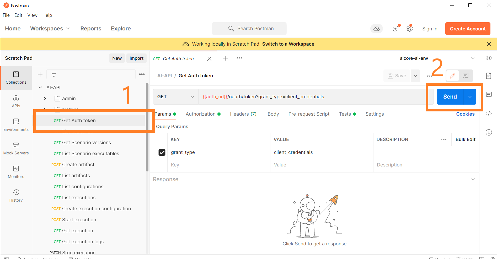

**SEND**

### Response

!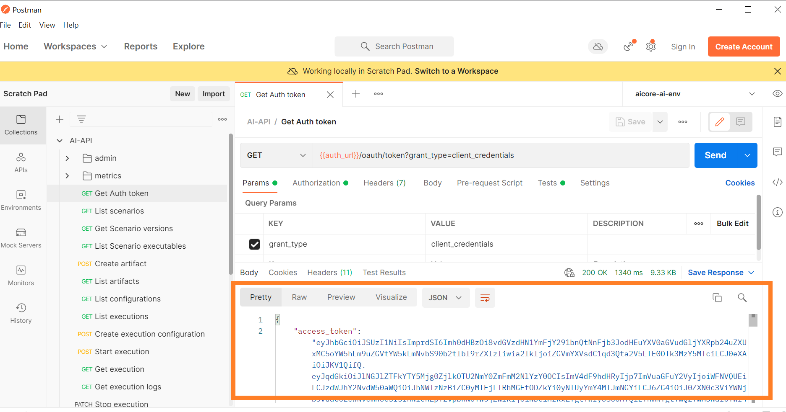

The OAuth token will be automatically updated in your environment variables under `token`. ( *If not, set it manually, value from response.* )

!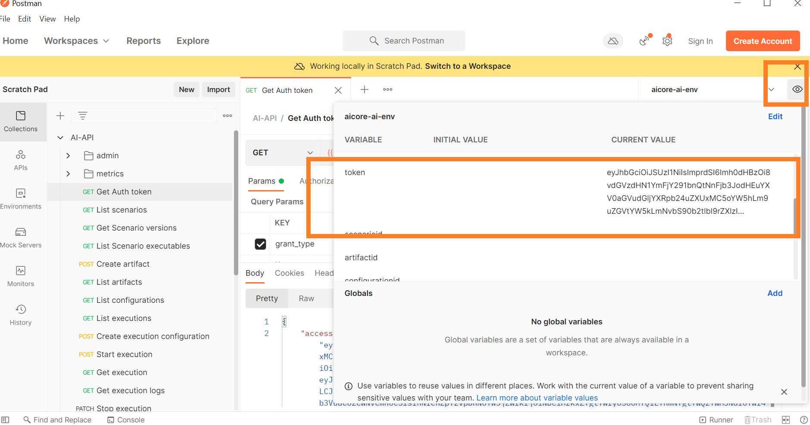

- OAuth token are used in any other API calls, under **Authorization**.
- The OAuth token hold valid for a certain duration (~ hour). You will need to call the API again if you encounter error stating ```JWT expired```.

### Test yourself

The OAuth `token` will be used in **Authorization** for any other API calls. Lets locate.

1. Click on any other API Call. Go to **Authorization** tab.

    !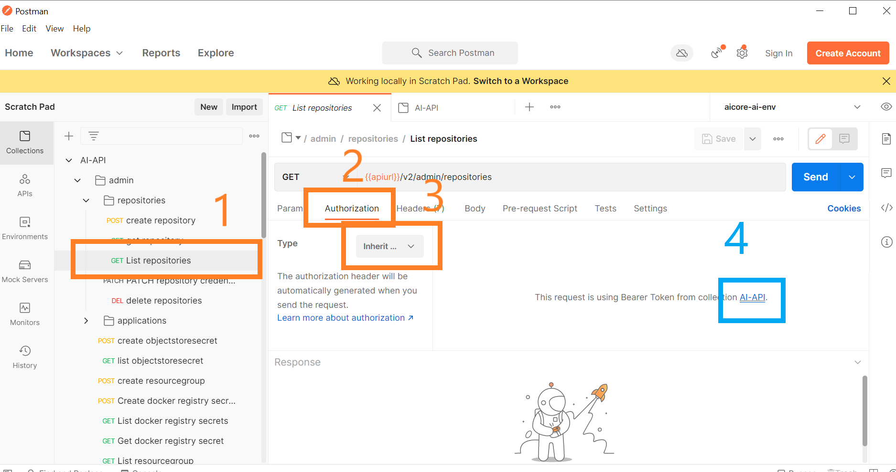

    If **Type**: *Inherit auth from parent*. Locate what **Type** parent(collection) is using.

2. You will find the **Type** `Bearer Token` and **Token** value set to environment variable `token`.

    !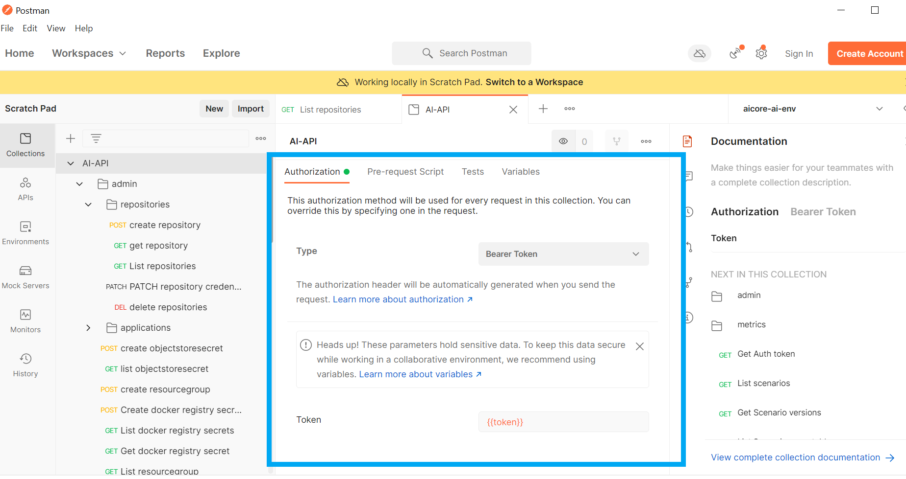

[VALIDATE_2]
[ACCORDION-END]

---
