## Details
### You will learn
  - How to Create Execution Configuration for SAP AI Core
  - How to Observe Execution on SAP AI Core

---

[ACCORDION-BEGIN [Step 1: ](API to List Available Scenarios)]

Scenarios refers to the use-case. It is defined by an identifier within the workflows *(YAML files)* that we created-synced earlier. For all related workflows write the same scenario.

!


> **COLLECTIONS** > *GET* List scenario

### Endpoint
**GET**
`{{apiurl}}/v2/lm/scenarios`

### HEADER

| KEY | VALUE |
| --- | --- |
| `AI-Resource-Group` | `tutorial` |

**SEND**

### Response

!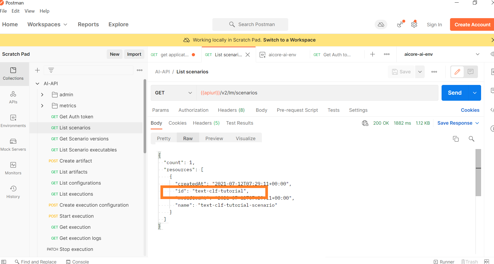

In the `RESPONSE`, you should see `id : text-clf-tutorial`

[DONE]
[ACCORDION-END]


[ACCORDION-BEGIN [Step 2: ](API to Register Train Dataset as Artifact)]

Every data entity *(dataset, model weights)* in SAP AI Core is considered artifact.

Previous we uploaded our data to AWS S3 and connected S3 to SAP AI Core.

Now we have specifically point to that dataset of S3.

> **COLLECTIONS** > *POST* Create artifact

### Endpoint

**POST**
`{{apiurl}}/v2/lm/artifacts`

### Header

| KEY | VALUE
| --- | ---
| `AI-Resource-Group` | `tutorial`

### Body
```
{
  "name": "tutorial-train-data",
  "kind": "dataset",
  "url": "ai://default/data",
  "description": "Text Classification Dataset",
  "scenarioId": "text-clf-tutorial"
}
```

**IMPORTANT:** DO NOT end `url` in the **Body** with `forward slash`.

**SEND**

!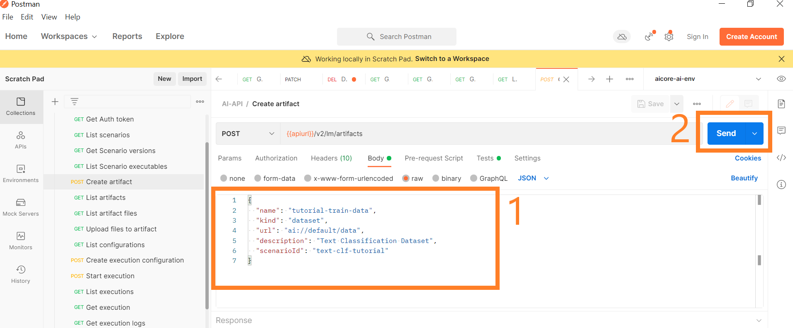

`RESPONSE`
```
{
    "id": "aefde425-231f-44a0-9abf-9228fc1b24c9",
    "message": "Artifact acknowledged",
    "url": "ai://default/data/"
}
```
</details>


[DONE]
[ACCORDION-END]


[ACCORDION-BEGIN [Step 3: ](Create Training Configuration)]

The training configuration specifies the input artifact as well as scenario and executable id *(`name` mentioned in the training workflow)*.

!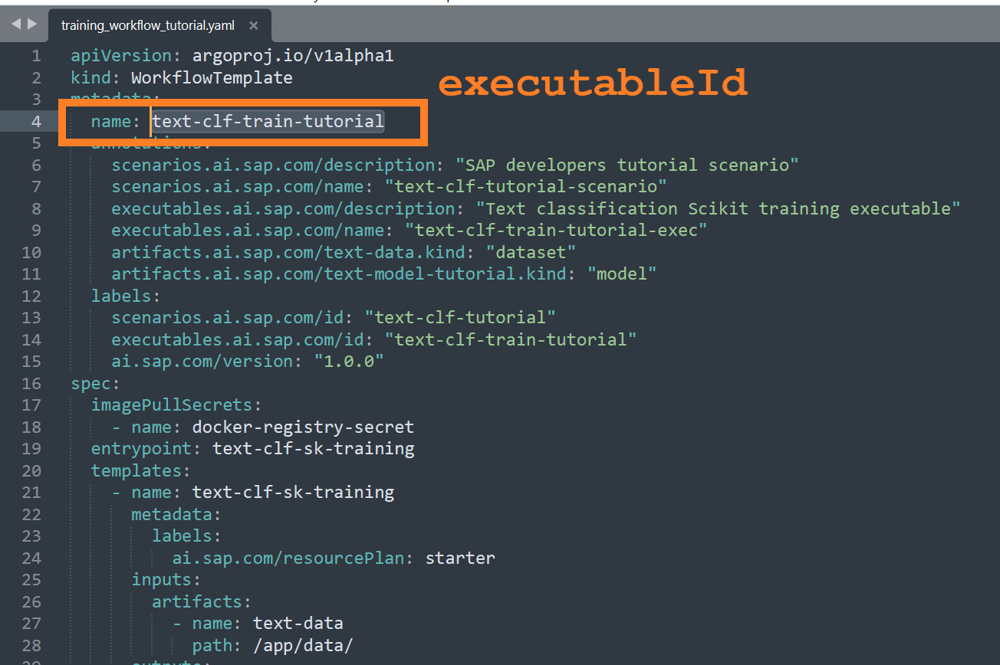

> **COLLECTIONS** > *POST* Create execution configuration

### Endpoint
**POST**
`{{apiurl}}/v2/lm/executions`

### HEADER

| KEY | VALUE
| --- | ---
| `AI-Resource-Group` | `tutorial`

### BODY
```
{
  "name": "dev-tutorial-training-configuration",
  "executableId": "text-clf-train-tutorial",
  "scenarioId": "text-clf-tutorial",
  "versionId": "0.0.1",
  "parameterBindings": [],
  "inputArtifactBindings": [
      {
      "key": "text-data",
      "artifactId": "aefde425-231f-44a0-9abf-9228fc1b24c9"
    }
  ]
}
```

**IMPORTANT:** Following the key-value pairs to be changed in the body

| Key | Where to get value from |
| --- | --- |
| `artifactId` | from `RESPONSE` of API call `GET List artifacts`

other values are used from `workflows\training_workflow_tutorial.yaml`

### Response

```
{
    'id': '1a10f5fd-27ed-486a-8f6e-4eed061b65d1',
    'message': 'Configuration created'
}    
```

!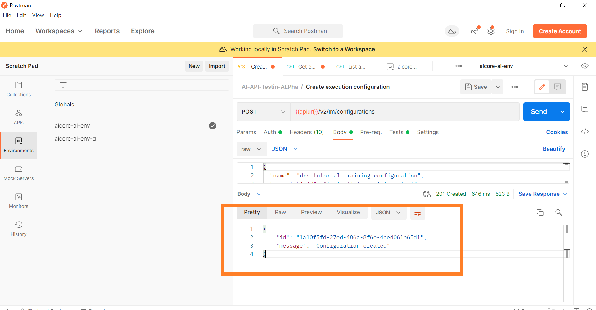

**IMPORTANT:** This `id` needs to be added in the Postman Environment Variable.

| VARIABLE| CURRENT VALUE |
| --- | --- |
| `configurationid` | 1a10f5fd-27ed-486a-8f6e-4eed061b65d1

!


[DONE]
[ACCORDION-END]

[ACCORDION-BEGIN [Step 4: ](Create Training Execution)]

After registering the artifact and creating a configuration for the execution, it is very simple to create an execution.

> **COLLECTIONS** > *POST* Start execution

### Endpoint

**POST**
`{{apiurl}}/v2/lm/configurations/{{configurationid}}/executions`

### Header

| Key | Value |
| --- | --- |
| AI-Resource-Group | tutorial |

!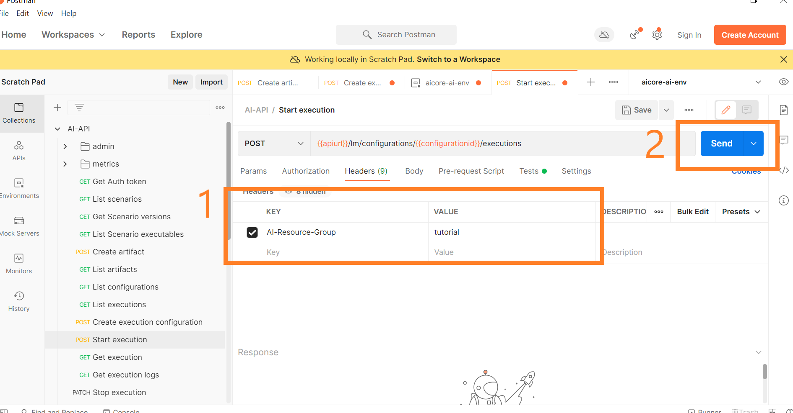

### Response

```
{'id': ec4e592e024c22e3',
 'message': 'Execution scheduled',
 'status': <Status.UNKNOWN: 'UNKNOWN'>}
```

*(If the response results in 404, read the **Deprecation Notice below** )*

!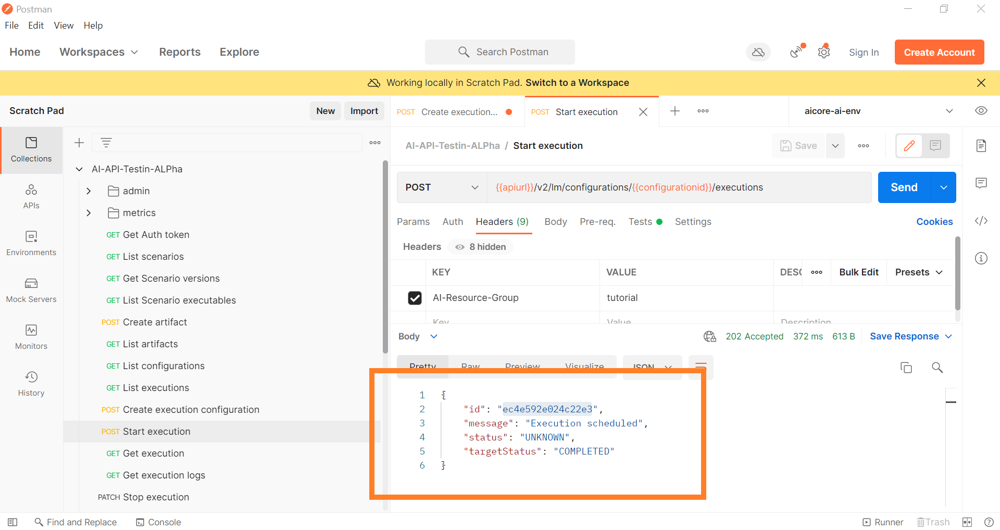

**IMPORTANT:** This `id` needs to be added in the Postman Environment Variable.

| VARIABLE| CURRENT VALUE |
| --- | --- |
| `executionid` | ec4e592e024c22e3

!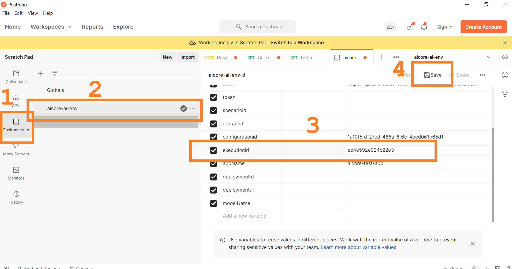

### Deprecation Notice

If the previous call to create training execution does not work try with following endpoint, header, body as follows.

**ENDPOINT**

*POST*
`{{apiurl}}/v2/lm/configurations`

**HEADER**

| KEY | VALUE |
| --- | --- |
| `AI-Resource-Group` | `tutorial`

**BODY**

*Change `configurationId` below*
```
{
  "configurationId": "1a10f5fd-27ed-486a-8f6e-4eed061b65d1"
}
```

[DONE]
[ACCORDION-END]


[ACCORDION-BEGIN [Step 5: ](API to Observe Training Status)]

Since the training of the model takes some time, we can periodically check on the status.
Let's poll the status of the training and wait until it goes into one of the state - `COMPLETED` or `DEAD`.

> **COLLECTIONS** > *GET* Get execution

`HEADER`

| Key | Value |
| --- | --- |
| AI-Resource-Group | tutorial |


!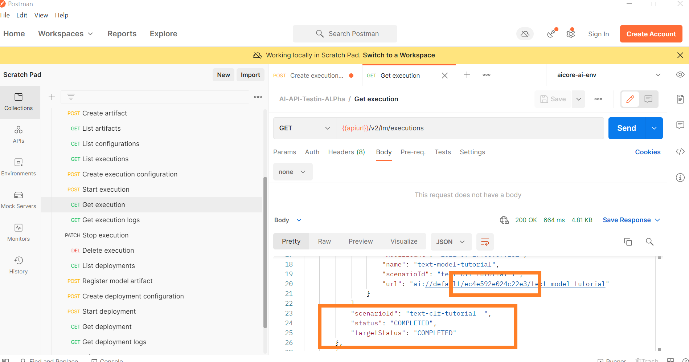

**IMPORTANT:** Training the model takes time. Retry sending the request in intervals of 1 min.


**NOTE** In the same response you will get `outputArtifacts`>`id` deployment of the serving model. These artifacts represents the data (model weights).

!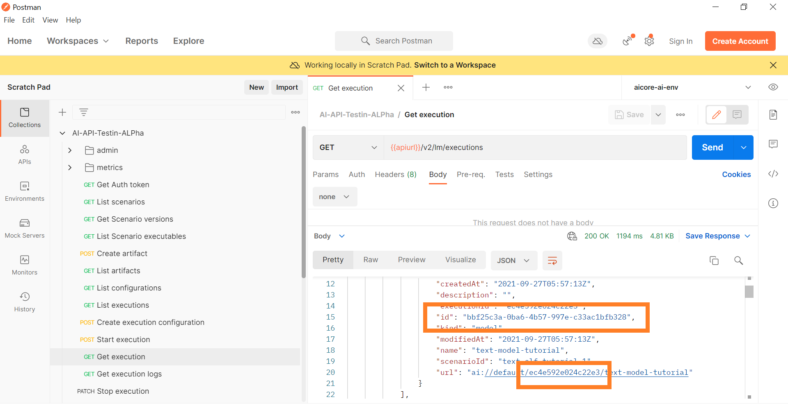

[VALIDATE_1]
[ACCORDION-END]

[ACCORDION-BEGIN [Step 6: ](Store Training Metrics)]

SAP AI Core, maintains a persistent data related to each execution *(model training)*. This data is custom decided and can be anything.

## Storing Metrics

> **COllECTIONS** > metrics > *PATCH* > Update/create metric resources (add/modify value of existing ones) against some execution

### Endpoint

**PATCH**
{{apiurl}}/v2/lm/metrics

### Header

| KEY | VALUE |
| `AI-Resource-Group` | `tutorial` |
| Content-Type | `application/merge-patch+json` |

### Body

```
{
  "executionId": "ec4e592e024c22e3",
  "metrics": [
    {
      "name": "Error Rate",
      "value": 0.98,
      "timestamp": "2021-06-28T07:50:24.589Z",
      "step": 2,
      "labels": [
        {
          "name": "group",
          "value": "tree-82"
        },
        {
            "name": "metrics.ai.sap.com/Artifact.name",
            "value": "text-model-tutorial"
        }
      ]
    }
  ],
  "tags": [
    {
      "name": "Artifact Group",
      "value": "RFC-1"
    }
  ],
  "customInfo": [
    {
      "name": "Confusion Matrix",
      "value": "[{'Predicted': 'False',  'Actual': 'False','value': 34},{'Predicted': 'False','Actual': 'True',  'value': 124}, {'Predicted': 'True','Actual': 'False','value': 165},{  'Predicted': 'True','Actual': 'True','value': 36}]"
    }
  ]
}
```

**SEND**

### Response

`204` :
*(No Response)*

!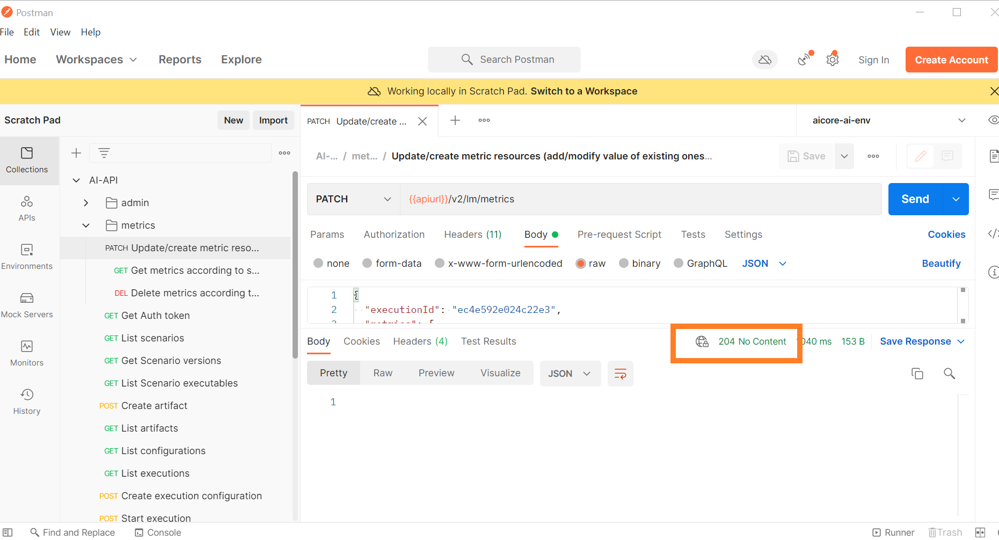

## Retrieving Metrics

1. Using SAP BTP Cockpit

        !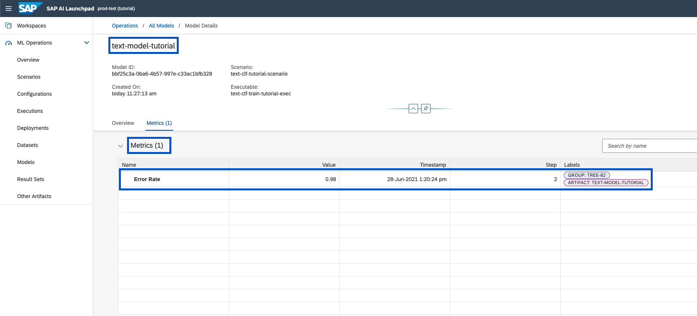

2. Using Postman

### Endpoint

**GET**
`{{apiurl}}/v2/lm/metrics?executionIds=ec4e592e024c22e3`

### `Params`

| Key | Value |
| --- | --- |
| `executionIds` | `ec4e592e024c22e3` |

### Header

| KEY | VALUE |
| --- | --- |
| `AI-Resource-Group` | `tutorial`

**SEND**

### Response

!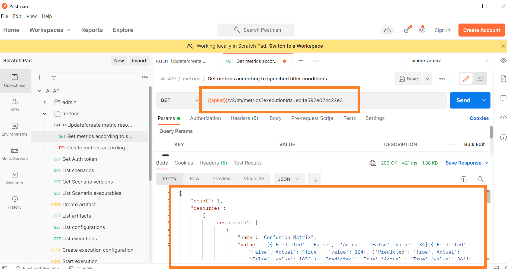

[DONE]
[ACCORDION-END]
---
