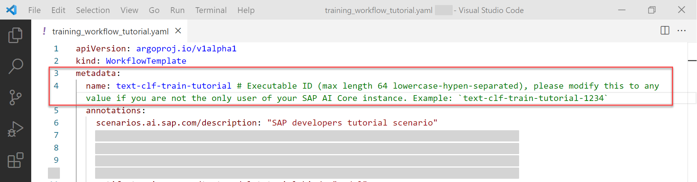

## Details
### You will learn
  - How to build docker images and host them in a Docker Hub Repository
  - To write ML Pipeline via Workflows.

---

[ACCORDION-BEGIN [Step 1: ](Create ML Code and Dockerfile)]


Docker will be used to store python code in form of containers *(portable environments)*.

Create a directory called `train`, and another called `infer`. Download the following files to their respective directories.

Training Scripts

| `train/`| Download Link |
| ---  | ----- |
| `Dockerfile` | [Download](https://raw.githubusercontent.com/SAPDocuments/Tutorials/master/tutorials/ai-core-aiapi-postman-workflows/files/train/Dockerfile) |
| `evaluate_scikit.py` | [Download](https://raw.githubusercontent.com/SAPDocuments/Tutorials/master/tutorials/ai-core-aiapi-postman-workflows/files/train/evaluate_scikit.py)
| `requirements.txt` | [Download](https://raw.githubusercontent.com/SAPDocuments/Tutorials/master/tutorials/ai-core-aiapi-postman-workflows/files/train/requirements.txt)
| `train_scikit.py` | [Download](https://raw.githubusercontent.com/SAPDocuments/Tutorials/master/tutorials/ai-core-aiapi-postman-workflows/files/train/train_scikit.py)


Inference/ Serving Scripts

| `infer/` | Download Link |
| -------- | ------------- |
| `Dockerfile` | [Download](https://raw.githubusercontent.com/SAPDocuments/Tutorials/master/tutorials/ai-core-aiapi-postman-workflows/files/infer/Dockerfile)
| `infer_scikit.py` | [Download](https://raw.githubusercontent.com/SAPDocuments/Tutorials/master/tutorials/ai-core-aiapi-postman-workflows/files/infer/infer_scikit.py)
| `requirements.txt` | [Download](https://raw.githubusercontent.com/SAPDocuments/Tutorials/master/tutorials/ai-core-aiapi-postman-workflows/files/infer/requirements.txt)

The resulting directory structure should look something like:

!

[DONE]
[ACCORDION-END]

[ACCORDION-BEGIN [Step 2: ](Build Docker image)]

1. Edit and execute the following line on the terminal, to connect to you Docker account.
    ```BASH[1]
    docker login docker.io -u <your-dockerhub-username>
    ```

2. Enter your password when prompted. Note that nothing will appear on the screen. Press enter once you have typed your password.

    !

3. Navigate to the directory where you stored the code files.  

    !

4. Navigate to your `train` directory.

    ```BASH
    cd train
    ```

5. To build the Docker image, edit and execute the code below:

    ```BASH[1]
    docker build -t <your-dockerhub-username>/text-clf-train:0.0.1 .
    ```

    !


Similarly navigate to your `infer` folder and edit and execute the following command to a build Docker image for inferencing *(or serving)* the model.

```BASH
docker build -t <your-dockerhub-username>/text-clf-serve:0.0.1 .
```

!

[DONE]
[ACCORDION-END]


[ACCORDION-BEGIN [Step 3: ](Upload docker image to docker repository)]

Edit and execute the following command on you terminal, to push your local docker image to Docker Hub cloud.

```BASH[1]
docker push docker.io/<your-dockerhub-username>/text-clf-train:0.0.1
```

You should see something like:

!

Edit and execute the code to push your inferencing Docker image again.

```BASH[1]
docker push docker.io/<your-dockerhub-username>/text-clf-serve:0.0.1
```

Visit <https://hub.docker.com>, if your images have pushed successfully, you will see them inside their respective repositories.

!

[DONE]
[ACCORDION-END]

[ACCORDION-BEGIN [Step 4: ](Create Workflow Files)]

Workflows will instruct SAP AI Core on:
  - how to execute the docker images.
  - what inputs to provide (such as datasets and models).
  - what outputs to give.

Create a folder called `workflows` inside to your cloned local GitHub folder. Download the following files to this folder:

| File | Link |
| --- | --- |
| `training_workflow_tutorial.yaml` | [Download](https://raw.githubusercontent.com/SAPDocuments/Tutorials/master/tutorials/ai-core-aiapi-postman-workflows/files/workflows/training_workflow_tutorial.yaml)  |
| `serving_workflow_tutorial.yaml` | [Download](https://raw.githubusercontent.com/SAPDocuments/Tutorials/master/tutorials/ai-core-aiapi-postman-workflows/files/workflows/serving_workflow_tutorial.yaml)

Your directory should look something like:
!

### Give unique ID to the workflows

Edit `training_workflow_tutorial.yaml`. The key `metadata > name` is termed **executable ID** (highlighted in the image below). This executable ID is a unique identifier of your workflow not the file name of the workflow in SAP AI Core. The workflow's **Executable ID** needs to be unique across all the workflows (even from different GitHub repos) you sync with your SAP AI Core instance. Edit the value to some unique value

```YAML
...

metadata:
  name: text-clf-train-tutorial-772  # Executable ID (max length 64 lowercase-hypen-separated), please modify this to any value if you are not the only user of your SAP AI Core instance. Example: `text-clf-train-tutorial-1234`
...
```

!


Edit the `serving_workflow_tutorial.yaml` for the executable ID similarly.


[DONE]
[ACCORDION-END]

[ACCORDION-BEGIN [Step 5: ](Choose computing hardware resources)]

Inside each of the YAML files from previous step, find the line:

```YAML[2]
  ...
  ai.sap.com/resourcePlan: starter
  ...
```

`starter` refers to your computing resource plan. For this tutorial, you can use the Starter plan. For your reference, these are the other available plans offered by SAP AI Core:

|     `resourcePlan` ID    |     GPUs          |     CPU cores    |     Memory (Gb)    |
|------------------------|-------------------|------------------|--------------------|
|     Train-L            |     1 V100 GPU    |     5            |     47             |
|     Infer-S            |     1 T4 GPU      |     3            |     10             |
|     Infer-M            |     1 T4 GPU      |     7            |     25             |
|     Infer-L            |     1 T4 GPU      |     15           |     55             |
|     Starter            |                   |     1            |     2.5            |
|     Basic              |                   |     3            |     10             |
|     Basic.8x           |                   |     31           |     115            |

[DONE]
[ACCORDION-END]

[ACCORDION-BEGIN [Step 6: ](Add Docker details to workflows)]

1. Edit the following line of code in your YAML files, to include your docker registry secret name that you defined in [create docker registry secret](https://developers.sap.com/tutorials/ai-core-aiapi-postman-repository.html#b8f76aa7-69d4-4287-8e69-b275fc6a59f7). This will allow Docker images to be pulled from your docker registry.

    ```YAML[3]
    ...
    imagePullSecrets
      - name: docker-registry-secret
    ...
    ```

    

2. Edit the following line in the training file to specify the Docker image.

    	```YAML[5]
    	...
    	spec:
    		...
    		container:
    		image: "<your_docker_repo_url>/<your_username_in_docker_repo>/text-clf-train:0.0.1"
    		...
    	```

      !

3. Similarly, specify the Docker image in the serving file:

    	```YAML[10]
    	...
    	spec:
    		...
    		template:
    			...
    			spec:
    				predictor
    					...
    					containers:
    						image: "<your_docker_repo_url>/<your_username_in_docker_repo>/text-clf-serve:0.0.1"
    	...
    	```

      !

[DONE]
[ACCORDION-END]

[ACCORDION-BEGIN [Step 7: ](Upload workflows to GitHub repository)]

1. Open GitHub Desktop and choose the repository that you made for this tutorial.

2. In the commit Summary, type `workflows added`. Click on **Commit to main** button.

	!  

3. Click on **Push origin**.  

	!

Now SAP AI Core will automatically sync workflows from your GitHub through the Postman application commands.

> **IMPORTANT:** The SAP AI Core syncs in interval of 3 minutes.


[DONE]
[ACCORDION-END]

[ACCORDION-BEGIN [Step 8: ](API to check workflow sync status)]

When three minutes has passed, add your application to the environment variables:

> Environments aicore-ai-env >

| Key | Value |
| --- | --- |
| `appName` | `aicore-test-app`

and press Save.

!

Check the sync status of your workflows by editing and executing:

> **COLLECTIONS** > admin > applications > *GET* get application status             `{{apiurl}}/v2/admin/applications/{{appName}}/status`

This should return:

```
{
    "healthStatus": "Healthy",
    "message": "successfully synced (all tasks run)",
    "reconciledAt": "2021-09-27T03:16:41Z",
    "source": {
        "path": "workflows",
        "repoURL": "https://github.com/john/aicore-test",
        "revision": "8505d9235fc19f672096e22354a934e429dad9a3"
    },
    "syncFinishedAt": "2021-09-27T03:16:41Z",
    "syncRessourcesStatus": [
        {
            "kind": "WorkflowTemplate",
            "message": "workflowtemplate.argoproj.io/text-clf-train-tutorial configured",
            "name": "text-clf-train-tutorial",
            "status": "Synced"
        }
    ],
    "syncStartedAt": "2021-09-27T03:16:40Z",
    "syncStatus": "Synced"
}
```

If you receive the error: `"message": "KeyError : 'operationState'"` instead, your repository folder is empty. You must wait for 3 minutes after uploading something to GitHub for it to sync.

If you receive the error: `"message": "Error retrieving status for application aicore-test-app"`, check that you have successfully registered the GitHub directory as application.

[DONE]
[ACCORDION-END]

[ACCORDION-BEGIN [Step 9: ](Summary)]

**A small recap of what has been done so far.**

- Postman, Docker,  AWS and GitHub have been connected.
- The training and serving docker images have been pushed to the docker repository.
- The training and serving workflows (*templates*) have been uploaded to the GitHub repository.

!


[VALIDATE_1]
[ACCORDION-END]

---
