## Details
### You will learn
  - Build docker images and host on Docker Hub Repository
  - Write ML Pipeline via Workflows.

---

[ACCORDION-BEGIN [Step 1: ](Create ML Code and Dockerfile)]


Docker will be used to store python code in form of containers *(portable environments)*.

Create following files *(download link below)* as-it-is. Resulting directory structure may look like following:

!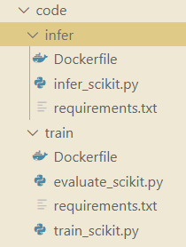


File Links

Training Scripts

| `train/`| Download Link |
| ---  | ----- |
| `Dockerfile` | [Download](https://raw.githubusercontent.com/SAPDocuments/Tutorials/master/tutorials/ai-core-aiapi-postman-workflows/files/train/Dockerfile) |
| `evaluate_scikit.py` | [Download](https://raw.githubusercontent.com/SAPDocuments/Tutorials/master/tutorials/ai-core-aiapi-postman-workflows/files/train/evaluate_scikit.py)
| `requirements.txt` | [Download](https://raw.githubusercontent.com/SAPDocuments/Tutorials/master/tutorials/ai-core-aiapi-postman-workflows/files/train/requirements.txt)
| `train_scikit.py` | [Download](https://raw.githubusercontent.com/SAPDocuments/Tutorials/master/tutorials/ai-core-aiapi-postman-workflows/files/train/train_scikit.py)


Inference/ Serving Scripts

| `infer/` | Download Link |
| -------- | ------------- |
| `Dockerfile` | [Download](https://raw.githubusercontent.com/SAPDocuments/Tutorials/master/tutorials/ai-core-aiapi-postman-workflows/files/infer/Dockerfile)
| `infer_scikit.py` | [Download](https://raw.githubusercontent.com/SAPDocuments/Tutorials/master/tutorials/ai-core-aiapi-postman-workflows/files/infer/infer_scikit.py)
| `requirements.txt` | [Download](https://raw.githubusercontent.com/SAPDocuments/Tutorials/master/tutorials/ai-core-aiapi-postman-workflows/files/infer/requirements.txt)

[DONE]
[ACCORDION-END]


[ACCORDION-BEGIN [Step 2: ](Build Docker image)]

1. Execute following line on terminal, to connect to you Docker account.
    Edit the highlighted line   
    ```BASH[1]
    docker login docker.io -u <your-dockerhub-username>
    ```

2. Type your password *(nothing will appear on screen: just type your password and press enter)*

    !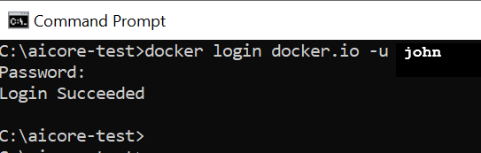

3. Navigate to place where you have stored the code files.  

    !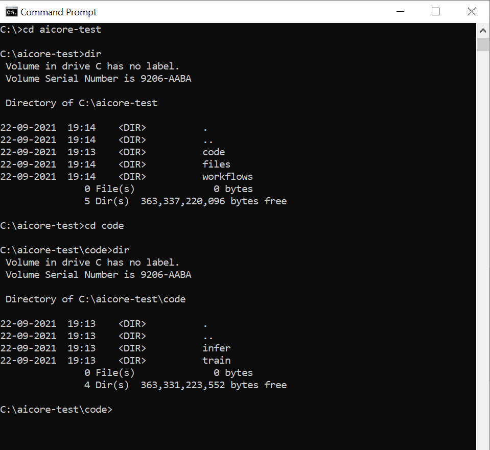

4. Navigate inside `train`

    ```BASH
    cd train
    ```

5. Build Docker image *(change the highlighted line)*.

    ```BASH[1]
    docker build -t <your-dockerhub-username>/text-clf-train:0.0.1 .
    ```

    !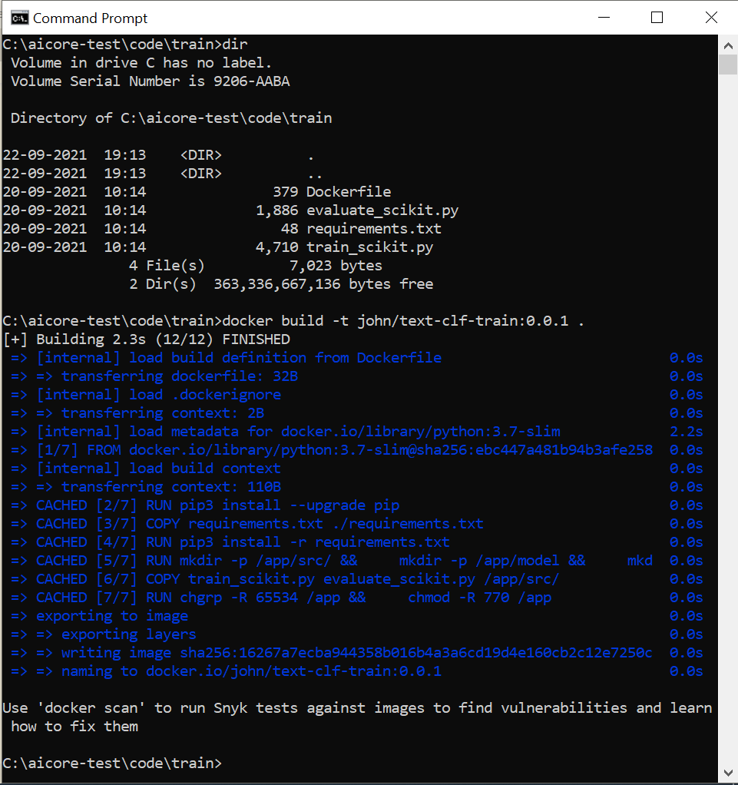


Similarly navigate inside `infer` folder and execute the following command to build docker image for serving the model.:

```BASH
docker build -t <your-dockerhub-username>/text-clf-serve:0.0.1 .
```

!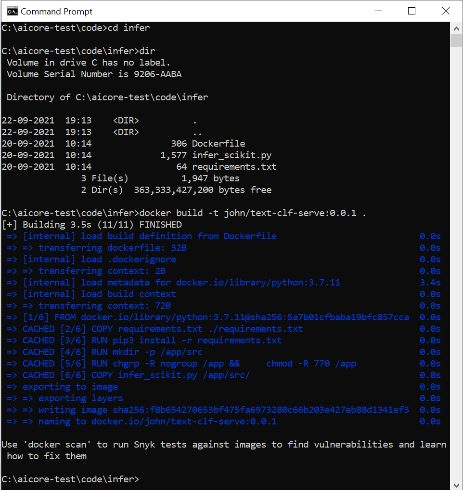

[DONE]
[ACCORDION-END]


[ACCORDION-BEGIN [Step 3: ](Upload docker image to docker repository)]

Push your local docker image to Docker Hub cloud.

Execute the following on you terminal. *(change the highlighted line)*

```BASH[1]
docker push docker.io/<your-dockerhub-username>/text-clf-train:0.0.1
```

*(sample image if previously uploaded)*

!

Similarly push your serving docker image. *(change the highlighted line)*.

```BASH[1]
docker push docker.io/<your-dockerhub-username>/text-clf-serve:0.0.1
```

Visit <https://hub.docker.com>, inside the repository `text-clf-serve` you will see you uploads.

!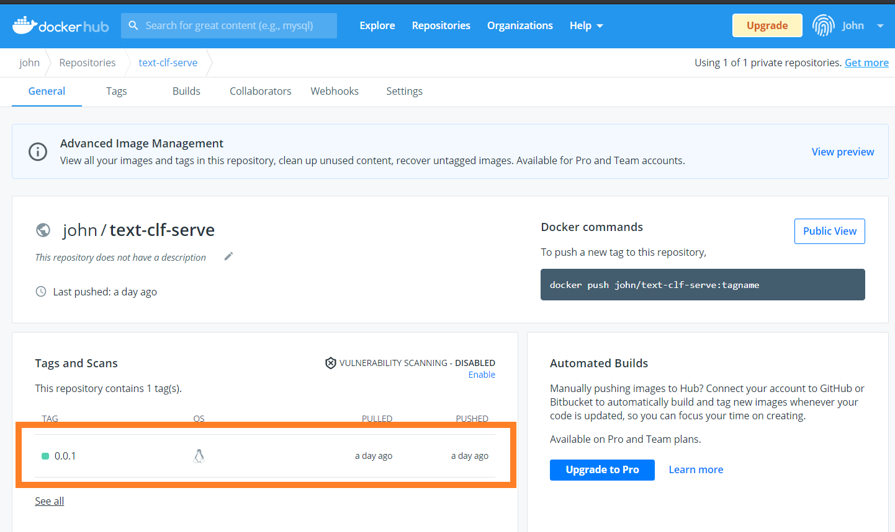

[DONE]
[ACCORDION-END]

[ACCORDION-BEGIN [Step 4: ](Create Workflow Files)]

Workflows will instruct SAP AI Core
    - how to execute the docker images
    - what inputs to provide(datasets)
    - what outputs it gives.

*(Further read [`ArgoWorkflows`](https://github.com/argoproj/argo-workflows) )*


Create a folder `workflows` inside to your cloned local GitHub folder.

Create the following file *(download links below)* as depicted in the image

Download Files

| File | Link |
| --- | --- |
| `training_workflow_tutorial.yaml` | [Download](https://raw.githubusercontent.com/SAPDocuments/Tutorials/master/tutorials/ai-core-aiapi-postman-workflows/files/workflows/training_workflow_tutorial.yaml)  |
| `serving_workflow_tutorial.yaml` | [Download](https://raw.githubusercontent.com/SAPDocuments/Tutorials/master/tutorials/ai-core-aiapi-postman-workflows/files/workflows/serving_workflow_tutorial.yaml)


!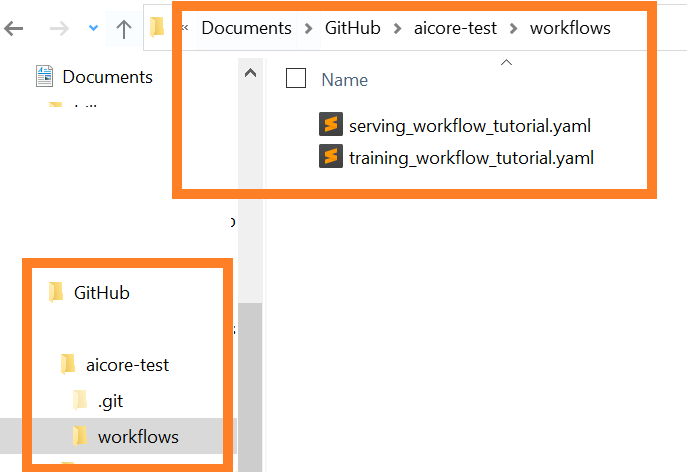


[DONE]
[ACCORDION-END]

[ACCORDION-BEGIN [Step 5: ](Choose computing hardware resources)]

Inside YAML files from previous step find the line

```YAML[2]
  ...
  ai.sap.com/resourcePlan: starter
  ...
```

The `starter` is the computing resource plan is used in this tutorial. Below is the list of other available plans offered by SAP AI Core.

|     `resourcePlan` ID    |     GPUs          |     CPU cores    |     Memory (Gb)    |
|------------------------|-------------------|------------------|--------------------|
|     Train-L            |     1 V100 GPU    |     5            |     47             |
|     Infer-S            |     1 T4 GPU      |     3            |     10             |
|     Infer-M            |     1 T4 GPU      |     7            |     25             |
|     Infer-L            |     1 T4 GPU      |     15           |     55             |
|     Starter            |                   |     1            |     2.5            |
|     Basic              |                   |     3            |     10             |
|     Basic.8x           |                   |     31           |     115            |

[DONE]
[ACCORDION-END]

[ACCORDION-BEGIN [Step 6: ](Add Docker details to workflows)]

1. Add the docker registry secret name. This will authorize while pull image from your docker registry. The docker registry secret must be created before. See [API to create docker registry secret](https://developers.sap.com/tutorials/ai-core-aiapi-postman-repository.html#b8f76aa7-69d4-4287-8e69-b275fc6a59f7)

    Edit the following lines *(highlighted)* in each workflow file *(YAML)*.

    ```YAML[3]
    ...
    imagePullSecrets
      - name: docker-registry-secret
    ...
    ```

    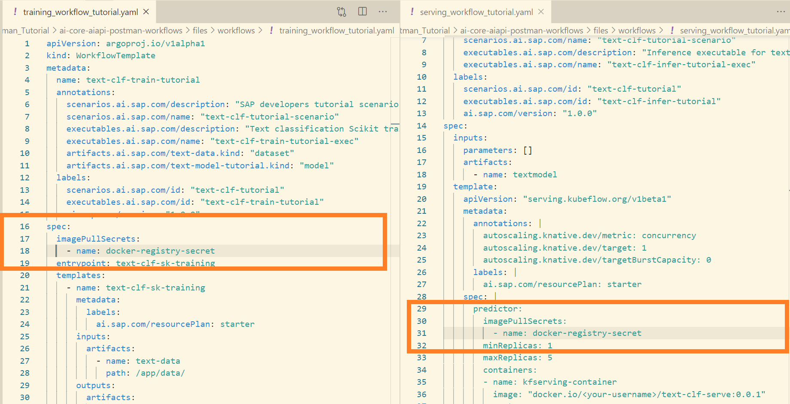

2. Add the training docker image information. Edit the following lines *(highlighted)* in each workflow file *(YAML)*.

    - `training_workflow_tutorial.yaml`

    	```YAML[5]
    	...
    	spec:
    		...
    		container:
    		image: "<your_docker_repo_url>/<your_username_in_docker_repo>/text-clf-train:0.0.1"
    		...
    	```

      !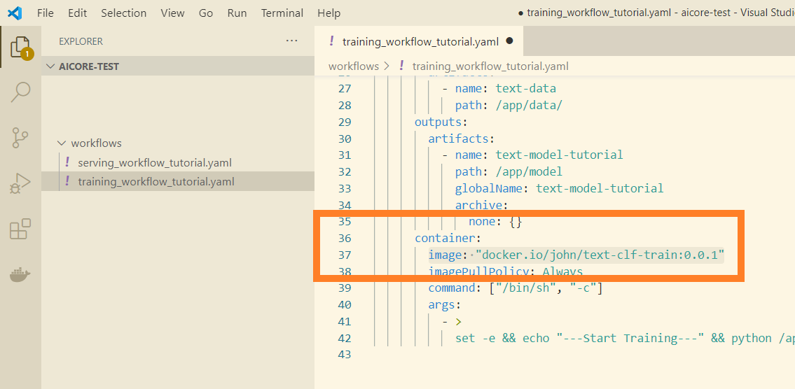

    - `serving_workflow_tutorial.yaml`

    	```YAML[10]
    	...
    	spec:
    		...
    		template:
    			...
    			spec:
    				predictor
    					...
    					containers:
    						image: "<your_docker_repo_url>/<your_username_in_docker_repo>/text-clf-serve:0.0.1"
    	...
    	```

      !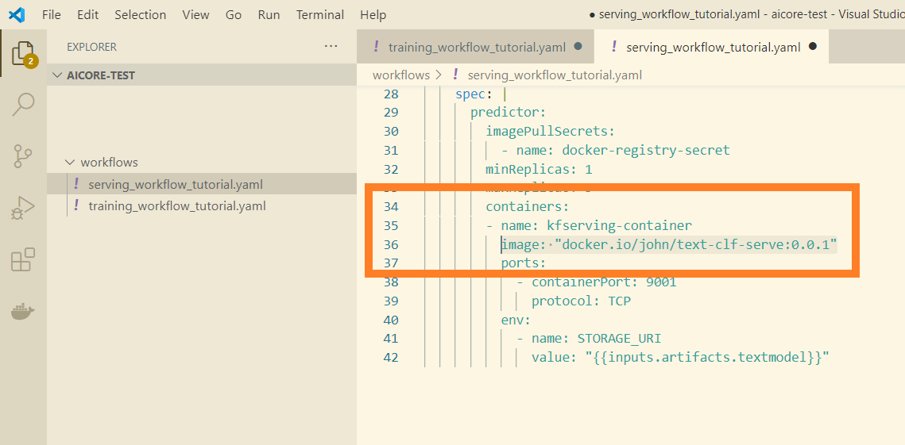

[DONE]
[ACCORDION-END]

[ACCORDION-BEGIN [Step 7: ](Upload workflows to GitHub repository)]

1. Copy the `workflows` folder *(from previous step)* to your cloned local GitHub folder. Ensure your files are placed as per image below  

	!

2. Open GitHub Desktop.

3. Type the commit message `workflows added`. And click on **Commit to main** button.

	!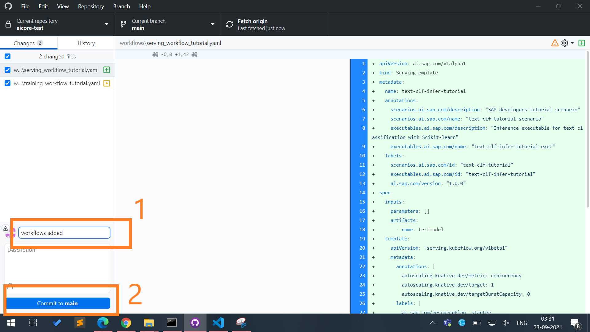  

4. Click on **Push origin**.  

	!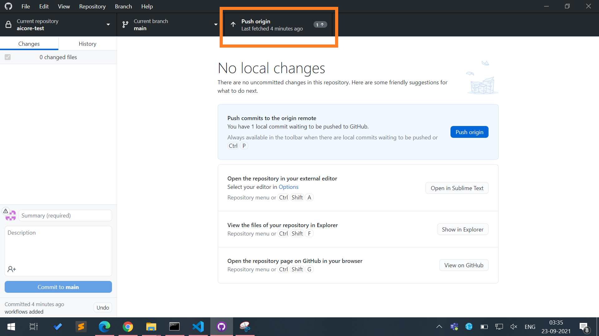

Now SAP AI Core will automatically sync workflows from your GitHub through the Applications.

> **IMPORTANT:** The SAP AI Core syncs in interval of 3 minutes.

[DONE]
[ACCORDION-END]

[ACCORDION-BEGIN [Step 8: ](API to check workflow sync status)]

> **IMPORTANT:** WAIT ATLEAST 3 MINS before sync is done.

Check the sync status of your workflows with postman.

### ADD POSTMAN Environment Variable

| Key | Value |
| --- | --- |
| `appName` | `aicore-test-app`

!


> **COLLECTIONS** > admin > applications > *GET* get application status

### Endpoint
**GET**
`{{apiurl}}/v2/admin/applications/{{appName}}/status`


**SEND**

### RESPONSE

*(if 404, See troubleshooting below.)*

```
{
    "healthStatus": "Healthy",
    "message": "successfully synced (all tasks run)",
    "reconciledAt": "2021-09-27T03:16:41Z",
    "source": {
        "path": "workflows",
        "repoURL": "https://github.com/john/aicore-test",
        "revision": "8505d9235fc19f672096e22354a934e429dad9a3"
    },
    "syncFinishedAt": "2021-09-27T03:16:41Z",
    "syncRessourcesStatus": [
        {
            "kind": "WorkflowTemplate",
            "message": "workflowtemplate.argoproj.io/text-clf-train-tutorial configured",
            "name": "text-clf-train-tutorial",
            "status": "Synced"
        }
    ],
    "syncStartedAt": "2021-09-27T03:16:40Z",
    "syncStatus": "Synced"
}
```

!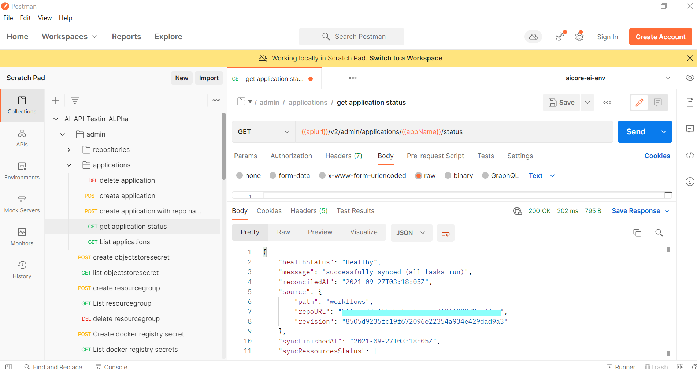


### Troubleshooting

1. `"message": "KeyError : 'operationState'"`

    Your repository folder is empty from last sync. Wait for 3 minutes after uploading something to GitHub.

2. `"message": "Error retrieving status for application aicore-test-app"`

    Unable to reach out application(SAP AI Core) named `aicore-test-app`, check if you have registered the GitHub directory as application.

[DONE]
[ACCORDION-END]

[ACCORDION-BEGIN [Step 9: ](Summary)]

**A small recap of what has been done so far.**

- The training and serving docker images are pushed to the docker repository
- The training and serving workflows(*templates*) are uploaded to the GitHub repository.

!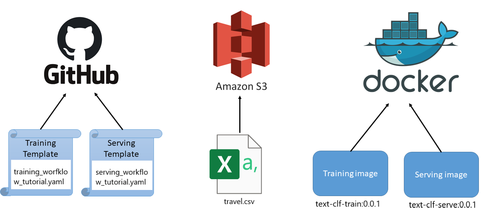


[VALIDATE_1]
[ACCORDION-END]

---
