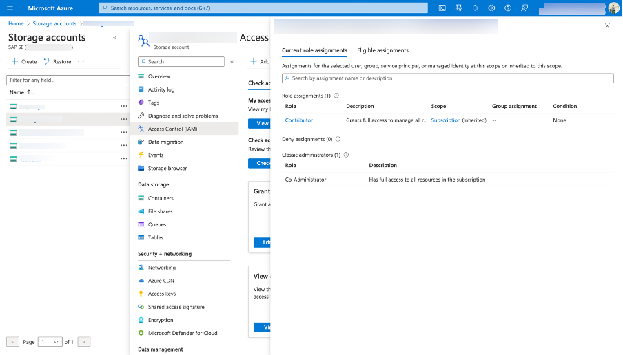
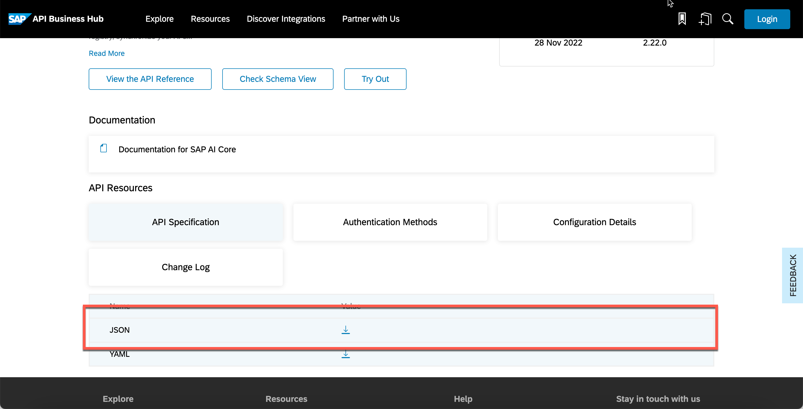
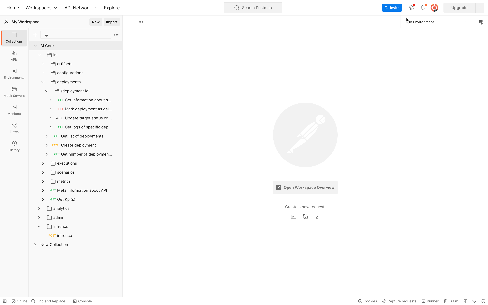
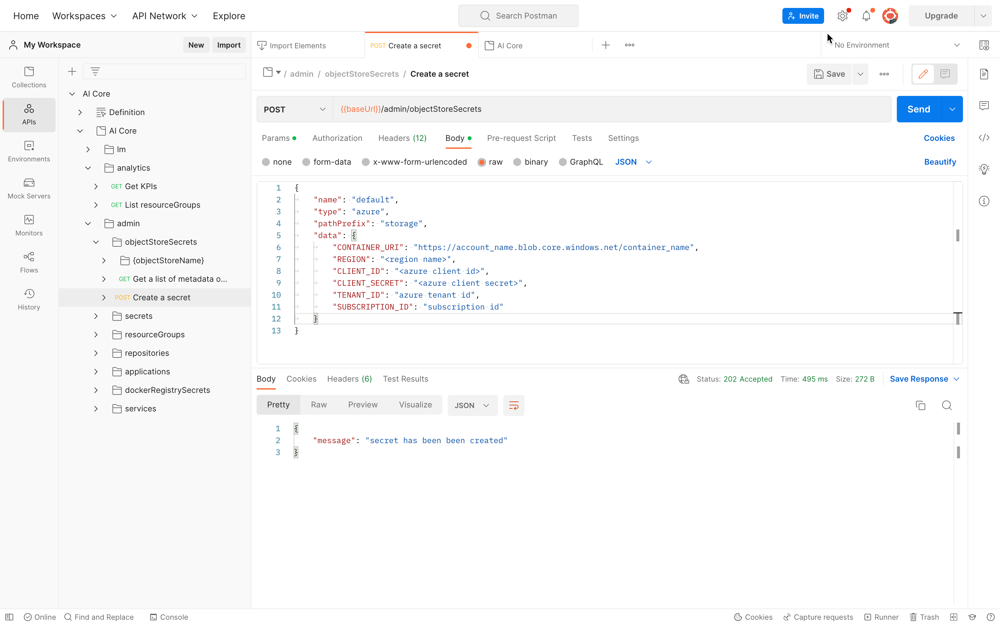

# Setup Azure DataBucket With AI Core
<!-- description -->Set up azure bucket (Azure Blob Storage) with SAP AI Core.

## Prerequisites
- An existing Azure account with Admin access to create and use Azure Datastore.
-TODO establish the setup prerequisites for SAP AI Core 


## You will learn
- About Azure data store
- To setup Azure for use with AI core
- Setup Azure data buckets for use with AI Core.

## What is azure data store ?

>**IMPORTANT** Before you start this tutorial with SAP AI Launchpad, it is recommended that you should set up at least one other tool, either Postman or Python (SAP AI Core SDK) because some steps of this tutorial cannot be performed with SAP AI Launchpad.


### System Setup
For Detailed docs reffer : [AI Core Setup](https://developers.sap.com/tutorials/ai-core-setup.html)
TODO establish the setup prerequisites for SAP AI Core 


- Downloading postman config

Go to [AI core API](https://api.sap.com/api/AI_CORE_API/overview) and download the JSON File.



- Open Postman and in the Top right corner click on Import.


- Under file click on Choose file and Select the Json that you just downloaded.


- Once the Import is done you will be able to see the Postman config.



###  Creating Object store Secret

At Postman at AI core API Go to admin > Object store secret > create object store secret.
And set the following json as body
```Python
{
	"name": "default",
	"type": "azure",
	"pathPrefix": "<path prefix to be appended>",
	"data": {
		"CONTAINER_URI": "https://account_name.blob.core.windows.net/container_name",  # required
		"REGION": "<region-name>",                  # optional
		"CLIENT_ID": "<azure-client-id>",           # optional
		"CLIENT_SECRET": "<azure-client-secret>",   # optional
		"STORAGE_ACCESS_KEY": "sas_token",          # optional
		"TENANT_ID": "azure tenant id",             # optional
		"SUBSCRIPTION_ID": "subscription id",       # optional
	}
}
```

Once Its done click on Send



Hence Your Object Store secret for Azure Data buckets is created.
