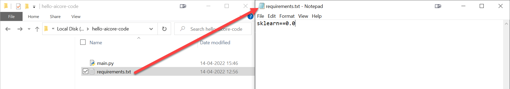
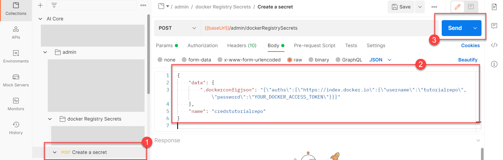
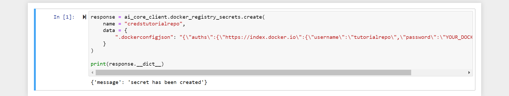

# Build a House Price Predictor with SAP AI Core
<!-- description --> Build portable AI code with Docker and use it with SAP AI Core.

## Prerequisites
- You have created your first workflow with SAP AI Core, using [this tutorial](https://developers.sap.com/tutorials/ai-core-helloworld.html/#)

## You will learn
- How to build Docker images from code.
- How to use Docker images with SAP AI Core
- How to check and debug execution logs for errors.

## Intro
By the end of the tutorial you will have your AI code in form of a Docker image, connected to your AI workflow. You will also know how to use Docker images together with AI core and how to debug your code if the **Execution** goes to an unexpected state. This tutorial is a precursor to the set up of data pipelines and model generation.

You may still complete this tutorial if you are not familiar with the Python programming language.


Please find downloadable sample notebooks for the tutorials : . Note that these tutorials are for demonstration purposes only and should not be used in production environments. To execute them properly, you'll need to set up your own S3 bucket or provision services from BTP, including an AI Core with a standard plan for narrow AI and an extended plan for GenAI HUB. Ensure you input the service keys of these services into the relevant cells of the notebook.
[Link to notebook](https://github.com/SAP-samples/ai-core-samples/blob/main/02_ai_core/tutorials/01_create_your_first_machine_learning_project_using_sap_ai_core/01_03_build_a_house_price_predictor_with_sap_ai_core/build-house-predictor.ipynb)

---

### Create a Docker account and generate a Docker access token

You need a Docker repository to store your AI code on the cloud in the form of Docker images. SAP AI core will fetch your code from this Docker repository. The image ensures that your code is bundled along with all of the dependencies, directory structure and drivers that are required when using GPU.

> **INFORMATION** You may use your organization's own Docker registry/repository. But please ensure that the repository is internet facing, not protected by a firewall.

[Sign Up](https://www.docker.com/) for a Docker account.

Click on the profile button (your profile name) and then select **Account Settings**.

<!-- border -->

Select **Security** from the navigation bar and click **New Access Token**.

<!-- border -->

Follow the guided steps, and then store the token that you receive in your local system.

> **SECURITY TIP**: This access token means that SAP AI Core can access the specified Docker repository without you sharing you Docker credentials. It also means that you can revoke access by deleting the token, rather than having to change your credentials.


### Install Docker Desktop

[Download and Install](https://www.docker.com/products/docker-desktop) Docker Desktop. You will need Docker Desktop to help you build Docker images of your AI code.

Run your Docker Desktop. You will observe "whale icon" on your tray when Docker Desktop is running.

<!-- border -->


### Write AI code for house price prediction


Create a directory (folder) named **hello-aicore-code**.

Create a file `main.py`. Paste the following snippet in the file.

```PYTHON
# Load Datasets
from sklearn import datasets
data_house = datasets.fetch_california_housing()
X = data_house['data']
y = data_house['target']
#
# Partition into Train and test dataset
from sklearn.model_selection import train_test_split
train_x, test_x, train_y, test_y = train_test_split(X, y, test_size=0.3)
#
# Init model
from sklearn.tree import DecisionTreeRegressor
clf = DecisionTreeRegressor()
#
# Train model
clf.fit(train_x, train_y)
#
# Test model
test_r2_score = clf.score(test_x, test_y)
# Output will be available in logs of SAP AI Core.
# Not the ideal way of storing /reporting metrics in SAP AI Core, but that is not the focus this tutorial
print(f"Test Data Score {test_r2_score}")
```

<!-- border -->

Create another file `requirements.txt` in the same directory. Here you will mention which python libraries are required to execute your code.

> **RECOMMENDED** In production you should use the terminal command `pip list --format freeze > requirements.txt` to auto generate `requirements.txt`.

Paste the following snippet into `requirements.txt`.

```TEXT
scikit-learn
```

<!-- border -->

The code builds a model using the [California Housing Dataset](https://scikit-learn.org/stable/datasets/real_world.html#california-housing-dataset) available in Scikit-Learn. Note that the code neither reads a datafile nor stores the model. We will cover both of these in a different tutorial.


### Transform your AI code into a Docker image


In the same directory, create a file named `Dockerfile` with **no extension**. This file stores instructions for Docker to build an image. Your Docker image is a Linux distribution, therefore commands in this `Dockerfile` are similar to Linux commands with verbs for Docker as the suffix. Paste the following content **exactly** as it is, into the file:

```TEXT
# Specify which base layers (default dependencies) to use
# You may find more base layers at https://hub.docker.com/
FROM python:3.7
#
# Creates directory within your Docker image
RUN mkdir -p /app/src/
#
# Copies file from your Local system TO path in Docker image
COPY main.py /app/src/
COPY requirements.txt /app/src/
#
# Installs dependencies within you Docker image
RUN pip3 install -r /app/src/requirements.txt
#
# Enable permission to execute anything inside the folder app
RUN chgrp -R 65534 /app && \
    chmod -R 777 /app
```

<!-- border -->

You may notice that you did not specify the command to run the script `main.py` in the `Dockerfile`. This command will be written into the AI workflow and is covered later in this tutorial.

Open your terminal and navigate to your `hello-aicore-code` directory.  You will use the terminal to build your Docker image.

<!-- border -->

Copy and edit the following command to build your docker image. The command follows the format `docker build -t <DOCKER_REGITRY>/<YOUR_DOCKER_USERNAME>/<IMAGE_NAME>:<TAG_NAME>`. So for example, if you are using your organization's registry which has the URL `myteam.myorg`, The command should be `docker build -t myteam.myorg/yourusername/house-price:01 .`

```BASH
docker build -t docker.io/<YOUR_DOCKER_USERNAME>/house-price:01 .
```

> **INFORMATION** In the command, `-t` indicates that there is a tag name, followed by a colon and version. The name is your descriptive string, and the version can be in any format, here `house-price` and `01`, respectively. The `.` (dot) at the end instructs Docker to look for the filename `Dockerfile` in the present directory.

> **INFORMATION** The platform information relates to your operating system, for example `linux/amd64`.

The result of this command should be:

<!-- border -->


### Connect your local system to a Docker account


Login to your Docker account from your terminal. This is a one time step that stores your Docker account credentials in your local Docker Desktop.

> **INFORMATION** If you are using your organization docker registry (hosting) please use the command in the format `docker login <URL_YOUR_ORGANIZATIONS_DOCKER_REGISTRY>`

```BASH
docker login docker.io
```

Copy and paste your generated Docker Access Token to use as your password. For security reasons, your input will not be printed on the screen.

<!-- border -->


### Upload a Docker image to the cloud


```BASH
docker push docker.io/<YOUR_USERNAME>/house-price:01
```

<!-- border -->


### Store your Docker credentials in SAP AI Core as a Docker registry secret


This step is required once. Storing Docker credentials enables SAP AI Core to pull (download) your Docker images from a **private** Docker repository. Use of a private Docker image prevents others from seeing your content.

> **WARNING** SAP AI Core does not verify your docker credentials, please ensure that you are storing the correct credentials.

[OPTION BEGIN [SAP AI Launchpad]]

Select your SAP AI Core connection under the **Workspaces** app.

Click **Docker Registry Secrets** in the **AI Core Administration** app. Click **Add**.

<!-- border -->

Name your secret, and paste and edit the snippet into the `Secret` field.

```JSON
{
        ".dockerconfigjson": "{\"auths\":{\"YOUR_DOCKER_REGISTRY_URL\":{\"username\":\"YOUR_DOCKER_USERNAME\",\"password\":\"YOUR_DOCKER_ACCESS_TOKEN\"}}}"    }
```

<!-- border -->


[OPTION END]

[OPTION BEGIN [Postman]]

**BODY**

Click on POST Create a secret. Paste and edit the snippet into the body of the request, using the information below as a guide.

```JSON
{
    "data": {
        ".dockerconfigjson": "{\"auths\":{\"YOUR_DOCKER_REGISTRY_URL\":{\"username\":\"YOUR_DOCKER_USERNAME\",\"password\":\"YOUR_DOCKER_ACCESS_TOKEN\"}}}"
    },
    "name": "credstutorialrepo"
}
```

<!-- border -->

[OPTION END]

[OPTION BEGIN [SAP AI Core SDK]]

Paste and edit the snippet into the body of the request, using the information below as a guide.

```PYTHON
response = ai_core_client.docker_registry_secrets.create(
    name = "credstutorialrepo",
    data = {
        ".dockerconfigjson": "{\"auths\":{\"YOUR_DOCKER_REGISTRY_URL\":{\"username\":\"YOUR_DOCKER_USERNAME\",\"password\":\"YOUR_DOCKER_ACCESS_TOKEN\"}}}"
    }
)

print(response.__dict__)
```

<!-- border -->

[OPTION END]

1. **Name**: Enter `credstutorialrepo`. This is becomes an identifier for your Docker credentials within SAP AI Core. This value is your docker registry secret.
2. **URL**: If you have used your organization's Docker registry then use its URL, otherwise, enter `https://index.docker.io`.
3. **Username**: Your Docker username.
4. **Access Token**: The access token generated previously, in the Docker account settings.

> **TIP** You can store multiple Docker credentials in SAP AI Core.


### Reference a Docker image in your AI workflow


This step requires the GitHub folder that you synced in [this tutorial](https://developers.sap.com/tutorials/ai-core-helloworld.html/#). In this folder, create another YAML file called `code-pipeline.yaml`. (This filename is not used as an identifier within SAP AI Core.)

<!-- border -->

Paste the following snippet into your YAML file. Edit the highlighted lines, using the comments and your own Docker image information. Click **Commit Changes**. The code is also available by following [this link](https://raw.githubusercontent.com/SAP-samples/ai-core-samples/main/02_ai_core/tutorials/01_create_your_first_machine_learning_project_using_sap_ai_core/01_03_build_a_house_price_predictor_with_sap_ai_core/step-8-code-pipeline.yaml)

```YAML[4, 15, 25]
apiVersion: argoproj.io/v1alpha1
kind: WorkflowTemplate
metadata:
  name: code-pipeline # executable id, must be unique across all your workflows (YAML files), please modify this to any value (e.g. code-pipeline-12345) if you are not the only user of your SAP AI Core instance.
  annotations:
    scenarios.ai.sap.com/description: "Tutorial to add custom code to SAP AI Core"
    scenarios.ai.sap.com/name: "Code (Tutorial)"
    executables.ai.sap.com/description: "Trains model on median house prices"
    executables.ai.sap.com/name: "House Price (Sklearn Example)"
  labels:
    scenarios.ai.sap.com/id: "learning-code"
    ai.sap.com/version: "1.0"
spec:
  imagePullSecrets:
    - name: credstutorialrepo # your docker registry secret
  entrypoint: mypipeline
  templates:
  - name: mypipeline
    steps:
    - - name: mypredictor
        template: mycodeblock1

  - name: mycodeblock1
    container:
      image: docker.io/<YOUR_DOCKER_USERNAME>/house-price:01 # Your docker image name
      command: ["/bin/sh", "-c"]
      args:
        - "python /app/src/main.py"
```

### Description of edits in your workflow.

Observe the difference between the `hello.yaml` (created in the prerequisite tutorial) and `code-pipeline.yaml`.

<!-- border -->

1. `imagePullSecrets`: A key that specifies which credentials will be used to access the Docker registry. The value `credstutorialrepo` specifies the Docker registry secret that you created previously to store Docker information in SAP AI Core.
2. `image`: A key that specifies which code to use in the workflow and which commands to execute within the Docker image.


### Check the sync status of your workflow


[OPTION BEGIN [SAP AI Launchpad]]

Click **Workspaces** >  **Applications** > **your SAP AI Core connection** in SAP AI Launchpad.

Navigate to your application. Check the status of your workflow. SAP AI Core will automatically sync this workflow, this can take up to three minutes.

> **WARNING** If you don't see the YAML workflow file in your Applications, even after 5 minutes, it is possible that another user of your SAP AI Core instance has used the same workflow name. Check that **each** of your workflows have unique executable ID, even if they are from separate users or GitHub repositories.

<!-- border -->

Under scenarios, you will also see a scenario named `Code (Tutorial)`.

<!-- border -->

[OPTION END]

[OPTION BEGIN [Postman]]

Click **Collections** > GET Returns the `ArgoCD` application status.

<!-- border -->

**Response**

```JSON
...
{
    "kind": "WorkflowTemplate",
    "message": "workflowtemplate.argoproj.io/code-pipeline configured",
    "name": "code-pipeline",
    "status": "Synced"
},
...
```

List all available scenarios by clicking **Collections** > **Scenarios** > GET get list of scenarios.

<!-- border -->

**Response**

```JSON
{
    "createdAt": "2022-04-15T04:30:52+00:00",
    "description": "Tutorial to add custom code to SAP AI Core",
    "id": "learning-code",
    "modifiedAt": "2022-04-15T04:30:52+00:00",
    "name": "Code (Tutorial)"
},
```

[OPTION END]

[OPTION BEGIN [SAP AI Core SDK]]

Get the application status.

```PYTHON
response = ai_core_client.applications.get_status(application_name='learning-scenarios-app')

print(response.message)
for sync_status in response.sync_ressources_status:
    print(sync_status.__dict__)
```

Your output should contain the following snippet:

```TEXT
...
{'name': 'code-pipeline', 'kind': 'WorkflowTemplate', 'status': 'Synced', 'message': 'workflowtemplate.argoproj.io/code-pipeline configured'}
```

List the executables for the scenario `learning-code`:

```PYTHON
response = ai_core_client.executable.query(
    scenario_id = "learning-code", resource_group='default'
)

for executable in response.resources:
    print(executable.__dict__)
```

**Output**

```
{'id': 'code-pipeline', 'scenario_id': 'learning-code', 'version_id': '1.0', 'name': 'House Price (Sklearn Example)', 'description': 'Trains model on median house prices', 'deployable': False, 'parameters': [], 'input_artifacts': [], ...}
```

[OPTION END]

> ### How is a different Scenario created even when the application is syncing the your GitHub folder?
> The application's only task is to sync and look for syntax errors in YAML files. By modifying annotations (`scenarios.ai.sap.com/id`, `scenarios.ai.sap.com/name` and `scenarios.ai.sap.com/description`) within the YAML you create new scenario.


### Run your AI workflow


[OPTION BEGIN [SAP AI Launchpad]]

In the **Workspaces** app, select the `default` resource group.

In the **ML Operations** App, click **Configurations**.

Click **Create**.

<!-- border -->

Follow the guided process of creating configurations.

<!-- border -->

1. **Configuration Name**: write `code-workflow-1`.
2. **Scenario Name**: select `Code (Tutorial)`.
3. **Version**: select `1.0`.
4. **Executable**: select `House Price (Sklearn Example)` (refers to the Executable Name).

Click **Next** to review the remaining steps, and click **Create**.

<!-- border -->

Click **Create Execution**. You will be redirected to your execution details page, and your Docker image will start executing.

<!-- border -->

Click the **refresh icon**.

[OPTION END]


[OPTION BEGIN [Postman]]

Create a configuration with the **BODY**:

```JSON
{
    "executableId": "code-pipeline",
    "name": "code-workflow-1",
    "scenarioId": "learning-code"
}
```

**Example Response**

```JSON
{
    "id": "abe8e956-945e-46ca-9b90-9b9e5f41867a",
    "message": "Configuration created"
}
```

>Note The configuration ID differs every time you create one, and for all users.

Use your own configuration ID to start an execution with the **BODY**:

```JSON
{
    "configurationId": "8430138e-da18-475f-8fa9-26feddb3d7e6"
}
```

**Example Response**

```JSON
{
    "id": "e9d69a2f9c525325",
    "message": "Execution scheduled",
    "status": "UNKNOWN",
    "targetStatus": "COMPLETED"
}
```

>Note The configuration ID differs every time you create one, and for all users.

Use your execution ID to get information on the status of your execution.

<!-- border -->


[OPTION END]


[OPTION BEGIN [SAP AI Core SDK]]

Create a configuration using the following code snippet:

```PYTHON
# Create configuration
response = ai_core_client.configuration.create(
    name = "code-workflow-1",
    scenario_id = "learning-code",
    executable_id = "code-pipeline",
    resource_group = "default"
)
print(response.__dict__)
```

**Example Response**

```
{'id': 'bd812e2c-5c71-406f-8562-a27609593de0', 'message': 'Configuration created'}
```
>Note The configuration ID differs every time you create one, and for all users.

Paste and edit the snippet below, using your configuration ID. Run it to start an execution.

```PYTHON
response = ai_core_client.execution.create(
    configuration_id = 'bd812e2c-5c71-406f-8562-a27609593de0',
    resource_group = 'default'
)

response.__dict__
```

**Example Response**
```
{
    "id": "e9d69a2f9c525325",
    "message": "Execution scheduled",
    "status": "UNKNOWN",
    "targetStatus": "COMPLETED"
}
```

>Note The configuration ID differs every time you create one, and for all users.

Paste and edit the snippet below, using your execution ID. Run the code to get your execution status.

```PYTHON
# Get execution status from SAP AI Core
# execute this multiple times in interval of 30 seconds
response = ai_core_client.execution.get(
    execution_id = '<YOUR_EXECUTION_ID', # Change this
    resource_group = 'default'
)

response.__dict__
```

[OPTION END]

The execution will go from **UNKOWN** to **RUNNING** then to the **DEAD** state. Resolving this is covered in next step.


### Look for error logs in execution


[OPTION BEGIN [SAP AI Launchpad]]

In the **Overview** tab in the **Status details** section, you will find the most recent log from your execution. You should see a stack trace of errors.

<!-- border -->

> **INFORMATION**: In the rare case that you observe the status: `Task currently un-schedulable due to lack of resource`, wait for a few minutes, it will automatically resolve itself and your execution will continue to run.

Click the **Logs** tab to see the stack trace generated from your code.

<!-- border -->

[OPTION END]


[OPTION BEGIN [Postman]]

Use your execution ID to get the logs from SAP AI Core. You should see a stack trace of errors.

> **WARNING**: You are required to use the `start` parameter when getting logs from an execution older than an hour.

<!-- border -->

[OPTION END]

[OPTION BEGIN [SAP AI Core SDK]]

To query the execution logs, paste and edit the snippet below, using your execution ID. You should see a stack trace of errors.

```PYTHON
# get execution logs
response = ai_core_client.execution.query_logs(
    execution_id = 'e06a4ab94956c569',
    resource_group = 'default',
    start = datetime(1990, 1, 1) # Optional, required when execution is older than one hour
)

for log in response.data.result:
    print(log.__dict__)
```

<!-- border -->

[OPTION END]

We can see that `scikit-learn` was unable to create directory for caching. Let's resolve this in the next step.


### Fix and update code


Update the highlighted line in `main.py`. Set the parameter `data_home` of function `dataset.fetch_california_housing` to `/app/src`. You had already set elevated permissions for this directory in your `Dockerfile`.

<!-- border -->

Build your code again, this time with a new tag. We use `02`, i.e. the second version of your Docker image.

```BASH
docker build -t docker.io/<YOUR_DOCKER_USERNAME>/house-price:02 .
```

<!-- border -->

Upload your code to your Docker registry.

```BASH
docker push docker.io/<YOUR_DOCKER_USERNAME>/house-price:02
```

<!-- border -->


### Update your AI workflow


Locate your workflow (YAML file) in GitHub. Click on the **Pencil Icon** to edit your workflow. The original code is also available by following [this link](https://raw.githubusercontent.com/SAP-samples/ai-core-samples/main/02_ai_core/tutorials/01_create_your_first_machine_learning_project_using_sap_ai_core/01_03_build_a_house_price_predictor_with_sap_ai_core/step-8-code-pipeline.yaml)

<!-- border -->

Update your workflow by adding the new `02` tag to the `ai.sap.com/version` and the Docker image name.

<!-- border -->

Click **Commit Changes** after editing.

> ### Why update the version each time you make changes to your workflow?
> The executable version is denoted by `ai.sap.com/version`. SAP AI Core syncs you workflows every three minutes and the version number is easily observable. You can be confident that your changes have synced. An alternative method of checking is to check that the latest **REVISION** number from GitHub is reflected in AI Core.


### Create execution


[OPTION BEGIN [SAP AI Launchpad]]

Go to SAP AI Launchpad. Click **ML Operations** > **Configuration**.

Look at the **Scenario** version in the configuration named `code-workflow-1`. If it shows `Version 2.0`, it has synced successfully, if not, please wait for ~ 3 minutes and refresh the page.

<!-- border -->

Click on `code-workflow-1` to see your configuration details. Click **Create Execution**. A new run of your workflow will start.

Check the status of your execution. When the status turns to **COMPLETED**, you will see the output of the `print` statement from your code. You may need to check the **Logs** to see this.

<!-- border -->

[OPTION END]


[OPTION BEGIN [Postman]]

On Postman, list the executables in the same way as before, for the scenario `learning-code`. You should see that the version has updated to `2.0`. If not please wait for ~ 3 minutes and list the executables again.

Create a new execution, using the procedure and configuration ID from the previous steps.

Check the status of your execution. When the status turns to **COMPLETED**, you will see the output of the `print` statement from your code. You may need to check the **Logs** to see this.

[OPTION END]

[OPTION BEGIN [SAP AI Core SDK]]

Use the code snippet to list the executables for the scenario `learning-code`. You should see that the version has updated to `2.0`. If not please wait for ~ 3 minutes and list the executables again.

```PYTHON
response = ai_core_client.executable.query(
    scenario_id = "learning-code", resource_group='default'
)

for executable in response.resources:
    print(executable.__dict__)
```

Create a new execution, using the procedure and configuration ID from the previous steps.

Check the status of your execution. When the status turns to **COMPLETED**, you will see the output of the `print` statement from your code. You may need to check the **Logs** to see this.

[OPTION END]


### Scheduling Execution (optional)

AI core Also provides the functionality to auto shedule Executions based on Time. 

To shedule an Execution at particular time of the day visit ML `operations > shedules` and click on Add

<!-- border -->

Choose senario as House price and click on next

<!-- border -->

Choose Executable and click on next.

<!-- border -->

Now a screen will appear where you can choose between the avilable Execution config and click on next

<!-- border -->

Now we need to choose the Schedule for our execution. Enter name as `Demo-Schedule` and choose between date and time in case you need to run the Execution for once else Choose recurring Enter the cron Job and choose the start and end date and click on Review

<!-- border -->

Check all the details before creating the execution and click on Create.

<!-- border -->

You would be able to see the schedule created under schedules tab in ML operations

<!-- border -->
