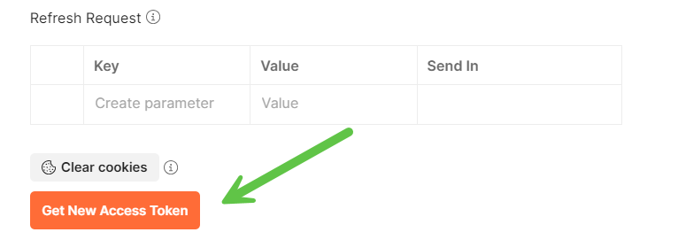
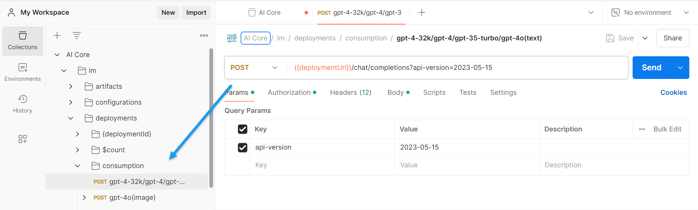

# Using foundational models  on SAP AI Core
<!-- description --> In this tutorial we are going to learn on how to consume LLM on AI core deployed on SAP AI core.

## You will learn
- How to infrence foundational models on AI core

## Prerequisites
- A BTP global account
If you are an SAP Developer or SAP employee, please refer to the following links ( **for internal SAP stakeholders only** ) - 
[How to create a BTP Account (internal)](https://me.sap.com/notes/3493139)
[SAP AI Core](https://help.sap.com/docs/sap-ai-core?version=INTERNAL&locale=en-US&state=PRODUCTION)
If you are an external developer or a customer or a partner kindly refer to this [tutorial](https://developers.sap.com/tutorials/btp-cockpit-entitlements.html)
- Ai core setup and basic knowledge: [Link to documentation](https://developers.sap.com/tutorials/ai-core-setup.html)
- Ai core Instance with Standard Plan or Extended Plan

### anthropic--claude-3.5-sonnet 
[OPTION BEGIN [curl]]

The following example shows how you can consume this generative AI model using curl. For more information about prompts, see the tutorial [Prompt LLMs in the Generative AI Hub in SAP AI Core & Launchpad Information published on SAP site](https://help.sap.com/docs/link-disclaimer?site=https%3A%2F%2Fdevelopers.sap.com%2Ftutorials%2Fai-core-generative-ai.html).

Before you use these models, please ensure that the deployment has already been created. You can create the deployment either through [generative-ai-hub-sdk or AI Launchpad](https://developers.sap.com/tutorials/ai-core-generative-ai.html#ad7ffc1e-e94e-4de4-b70f-116b038aff04).

For inferencing the model through curl,

open Windows PowerShell (for Windows based devices)
NOTE: do not use DOS Prompt instead of PowerShell

open Terminal (for macOS based devices)

Enter the following command after replacing \<deployment_url\>, \<resource-group\>, \<token\> with the values for the corresponding model.

NOTE:

for macOS based devices use the bash command

for windows devices, use the PowerShell command


```bash
curl --location '$DEPLOYMENT_URL/invoke' \ 
--header 'AI-Resource-Group: default' \ 
--header 'Content-Type: application/json' \ 
--header "Authorization: Bearer $AUTH_TOKEN" \ 
--data '{ 
    "anthropic_version": "bedrock-2023-05-31", 
    "max_tokens": 100, 
    "messages": [ 
        { 
        "role": "user",  
        "content": "Hello, Claude" 
        } 
    ] 
  }' 
```

```powershell
curl.exe --location "$DEPLOYMENT_URL/invoke" --header "AI-Resource-Group: default" --header "Content-Type: application/json" --header "Authorization: Bearer $AUTH_TOKEN" --data '{ \"anthropic_version\": \"bedrock-2023-05-31\", \"max_tokens\": 100, \"messages\": [ { \"role\": \"user\", \"content\": \"Hello, Claude\" } ] }'
```

[OPTION END]

[OPTION BEGIN [Postman]]

To begin using the APIs in AI Core, we start with setting up the authentication methods.


Once the `Access Token URL`, `Client ID` and `Client Secret` are updated, we can proceed to generating a token. Scroll to the bottom and click on 'Get New Access Token'.

For ease of access, we set up the region, baseUrl and deploymentUrl variables as a pre-requisite. This avoids the need of passing these values repeatedly for different scenarios. 

NOTE: the deployment URL is specific to the model we intend to use.


Next, we'll head to the AI Core/lm/deployments/consumption, and select the model we want to use.



Add the name of your respective resource group. 


Lastly, to begin making API calls, we’ll set up the authentication method to fetch the token from parent. For this, we'll go to Authorization and set the Auth Types as `Inherit auth from parent`.


Now we’re ready to use the API for various models.

[OPTION END]

[OPTION BEGIN [GenAI Hub SDK]]

In this example we will see how to consume this generative AI model using Generative AI Hub SDK.

Before we proceed, we need to ensure that SAP generative AI hub SDK has been successfully installed and set-up on our device. Refer to [generative-ai-hub-sdk 2.1.1](https://pypi.org/project/generative-ai-hub-sdk/) for the instructions for the same.

Before you use these models, please ensure that the deployment has already been created. You can create the deployment either through generative-ai-hub-sdk or AI Launchpad.

For inferencing the corresponding model through Generative AI Hub SDK, execute the following python command - 

```PYTHON
from gen_ai_hub.proxy.native.amazon.clients import Session
bedrock = Session().client(model_name="anthropic--claude-3.5-sonnet")
conversation = [
    {
        "role": "user",
        "content": [
            {
                "text": "Describe the purpose of a 'hello world' program in one line."
            }
        ],
    }
]
response = bedrock.converse(
    messages=conversation,
    inferenceConfig={"maxTokens": 512, "temperature": 0.5, "topP": 0.9},
)
print(response['output']['message']['content'][0]['text'])
```
[OPTION END]

For more information on the models refer to [Claude 3 Family](https://www.anthropic.com/news/claude-3-family).

### GPT-4.0-mini
[OPTION BEGIN [curl]]

The following example shows how you can consume this generative AI model using curl. For more information about prompts, see the tutorial [Prompt LLMs in the Generative AI Hub in SAP AI Core & Launchpad Information published on SAP site](https://help.sap.com/docs/link-disclaimer?site=https%3A%2F%2Fdevelopers.sap.com%2Ftutorials%2Fai-core-generative-ai.html).

Before you use these models, please ensure that the deployment has already been created. You can create the deployment either through [generative-ai-hub-sdk or AI Launchpad](https://developers.sap.com/tutorials/ai-core-generative-ai.html#ad7ffc1e-e94e-4de4-b70f-116b038aff04).

For inferencing the model through curl,

open Windows PowerShell (for Windows based devices)
NOTE: do not use DOS Prompt instead of PowerShell

open Terminal (for macOS based devices)

Enter the following command after replacing \<deployment_url\>, \<resource-group\>, \<token\> with the values for the corresponding model.

NOTE:

for macOS based devices use the bash command

for windows devices, use the PowerShell command


```bash
curl --location 'https://<enter-your-deployment-url-here>/chat/completions?api-version=2023-05-15' \ 
--header 'AI-Resource-Group: <Resource Group Id>' \ 
--header 'Content-Type: application/json' \ 
--header "Authorization: Bearer $TOKEN" \ 
--data '{ 
"messages": [ 
    { 
"role": "user", 
"content": "sample input prompt" 
} 
], 
"max_tokens": 100, 
"temperature": 0.0, 
"frequency_penalty": 0, 
"presence_penalty": 0, 
"stop": "null" 
}' 
```

```powershell
curl.exe --location "https://<enter-your-deployment-url-here>/chat/completions?api-version=2023-05-15" --header "AI-Resource-Group: <Resource Group Id>" --header "Content-Type: application/json" --header "Authorization: Bearer $TOKEN" --data '{ \"messages\": [ { \"role\": \"user\", \"content\": \"sample input prompt\" } ], \"max_tokens\": 100, \"temperature\": 0.0, \"frequency_penalty\": 0, \"presence_penalty\": 0, \"stop\": \"null\" }'
```

[OPTION END]

[OPTION BEGIN [Postman]]

To begin using the APIs in AI Core, we start with setting up the authentication methods.


Once the `Access Token URL`, `Client ID` and `Client Secret` are updated, we can proceed to generating a token. Scroll to the bottom and click on 'Get New Access Token'.

For ease of access, we set up the region, baseUrl and deploymentUrl variables as a pre-requisite. This avoids the need of passing these values repeatedly for different scenarios. 

NOTE: the deployment URL is specific to the model we intend to use.


Next, we'll head to the AI Core/lm/deployments/consumption, and select the model we want to use.


Add the name of your respective resource group. 


Lastly, to begin making API calls, we’ll set up the authentication method to fetch the token from parent. For this, we'll go to Authorization and set the Auth Types as `Inherit auth from parent`.


Now we’re ready to use the API for various models.

[OPTION END]

[OPTION BEGIN [GenAI Hub SDK]]

In this example we will see how to consume this generative AI model using Generative AI Hub SDK.

Before we proceed, we need to ensure that SAP generative AI hub SDK has been successfully installed and set-up on our device. Refer to [generative-ai-hub-sdk 2.1.1](https://pypi.org/project/generative-ai-hub-sdk/) for the instructions for the same.

Before you use these models, please ensure that the deployment has already been created. You can create the deployment either through generative-ai-hub-sdk or AI Launchpad.

For inferencing the corresponding model through Generative AI Hub SDK, execute the following python command - 

```PYTHON
from gen_ai_hub.proxy.native.openai import chat 
messages = [{"role": "user", "content": "what is SAP business AI"} ] 
kwargs = dict(model_name='gpt-4o-mini', messages=messages) 
response = chat.completions.create(**kwargs) 
print(response.to_dict()["choices"][0]["message"]["content"]) 
```
[OPTION END]

For more information on the models refer to [GPT4.0 Mini](https://openai.com/index/gpt-4o-mini-advancing-cost-efficient-intelligence/).

### LLAMA 3.1 
[OPTION BEGIN [curl]]

The following example shows how you can consume this generative AI model using curl. For more information about prompts, see the tutorial [Prompt LLMs in the Generative AI Hub in SAP AI Core & Launchpad Information published on SAP site](https://help.sap.com/docs/link-disclaimer?site=https%3A%2F%2Fdevelopers.sap.com%2Ftutorials%2Fai-core-generative-ai.html).

Before you use these models, please ensure that the deployment has already been created. You can create the deployment either through [generative-ai-hub-sdk or AI Launchpad](https://developers.sap.com/tutorials/ai-core-generative-ai.html#ad7ffc1e-e94e-4de4-b70f-116b038aff04).

For inferencing the model through curl,

open Windows PowerShell (for Windows based devices)
NOTE: do not use DOS Prompt instead of PowerShell

open Terminal (for macOS based devices)

Enter the following command after replacing \<deployment_url\>, \<resource-group\>, \<token\> with the values for the corresponding model.

NOTE:

for macOS based devices use the bash command

for windows devices, use the PowerShell command


```bash
curl --location '<Deployment_url>/chat/completions' \ 
--header 'AI-Resource-Group: <resource_group>' \ 
--header 'Content-Type: application/json' \ 
--header 'Authorization: Bearer <token>' \ 
--data '{ 
    "model": "meta--llama3.1-70b-instruct",  
    "messages": [ 
        { 
            "role": "user", 
            "content": "What is the difference between Accountability vs Responsibility, answer in 200 words?" 
        } 
    ], 
    "max_tokens": 100 
}' 
```

```powershell
curl.exe --location "<Deployment_url>/chat/completions" --header "AI-Resource-Group: <resource_group>" --header "Content-Type: application/json" --header "Authorization: Bearer <token>" --data '{ \"model\": \"meta--llama3.1-70b-instruct\", \"messages\": [ { \"role\": \"user\", \"content\": \"What is the difference between Accountability vs Responsibility, answer in 200 words?\" } ], \"max_tokens\": 100 }'
```

[OPTION END]

[OPTION BEGIN [Postman]]

To begin using the APIs in AI Core, we start with setting up the authentication methods.


Once the `Access Token URL`, `Client ID` and `Client Secret` are updated, we can proceed to generating a token. Scroll to the bottom and click on 'Get New Access Token'.

For ease of access, we set up the region, baseUrl and deploymentUrl variables as a pre-requisite. This avoids the need of passing these values repeatedly for different scenarios. 

NOTE: the deployment URL is specific to the model we intend to use.


Next, we'll head to the AI Core/lm/deployments/consumption, and select the model we want to use.


Add the name of your respective resource group. 


Lastly, to begin making API calls, we’ll set up the authentication method to fetch the token from parent. For this, we'll go to Authorization and set the Auth Types as `Inherit auth from parent`.


Now we’re ready to use the API for various models.

[OPTION END]

For more information on the models refer to [Llama 3.1](https://ai.meta.com/blog/meta-llama-3-1/).

### text-embedding-ada-002 / text-embedding-3-small / text-embedding-3-large
[OPTION BEGIN [curl]]

The following example shows how you can consume this generative AI model using curl. For more information about prompts, see the tutorial [Prompt LLMs in the Generative AI Hub in SAP AI Core & Launchpad Information published on SAP site](https://help.sap.com/docs/link-disclaimer?site=https%3A%2F%2Fdevelopers.sap.com%2Ftutorials%2Fai-core-generative-ai.html).

Before you use these models, please ensure that the deployment has already been created. You can create the deployment either through [generative-ai-hub-sdk or AI Launchpad](https://developers.sap.com/tutorials/ai-core-generative-ai.html#ad7ffc1e-e94e-4de4-b70f-116b038aff04).

For inferencing the model through curl,

open Windows PowerShell (for Windows based devices)
NOTE: do not use DOS Prompt instead of PowerShell

open Terminal (for macOS based devices)

Enter the following command after replacing \<deployment_url\>, \<resource-group\>, \<token\> with the values for the corresponding model.

NOTE:

for macOS based devices use the bash command

for windows devices, use the PowerShell command


```bash
curl -L '<deployment_url>/embeddings?api-version=2023-05-15' --header 'AI-Resource-Group: <resource-group>' --header 'Content-Type: application/json' --header 'Authorization: Bearer <token>' --data '{
    "input" :"This is my input text"
}'
```

```powershell
curl.exe -L "<deployment_url>/embeddings?api-version=2023-05-15" --header "AI-Resource-Group: <resource-group>" --header "Content-Type: application/json" --header "Authorization: Bearer <token>" --data '{ \"input\" :\"This is my input text\" }'
```

[OPTION END]

[OPTION BEGIN [Postman]]

To begin using the APIs in AI Core, we start with setting up the authentication methods.


Once the `Access Token URL`, `Client ID` and `Client Secret` are updated, we can proceed to generating a token. Scroll to the bottom and click on 'Get New Access Token'.

For ease of access, we set up the region, baseUrl and deploymentUrl variables as a pre-requisite. This avoids the need of passing these values repeatedly for different scenarios. 

NOTE: the deployment URL is specific to the model we intend to use.


Next, we'll head to the AI Core/lm/deployments/consumption, and select the model we want to use.


Add the name of your respective resource group. 


Lastly, to begin making API calls, we’ll set up the authentication method to fetch the token from parent. For this, we'll go to Authorization and set the Auth Types as `Inherit auth from parent`.


Now we’re ready to use the API for various models.

[OPTION END]

[OPTION BEGIN [GenAI Hub SDK]]

In this example we will see how to consume this generative AI model using Generative AI Hub SDK.

Before we proceed, we need to ensure that SAP generative AI hub SDK has been successfully installed and set-up on our device. Refer to [generative-ai-hub-sdk 2.1.1](https://pypi.org/project/generative-ai-hub-sdk/) for the instructions for the same.

Before you use these models, please ensure that the deployment has already been created. You can create the deployment either through generative-ai-hub-sdk or AI Launchpad.

For inferencing the corresponding model through Generative AI Hub SDK, execute the following python command - 

```PYTHON
from gen_ai_hub.proxy.native.openai import embeddings

response = embeddings.create(
    input="Every decoding is another encoding.",
    model_name="text-embedding-ada-002"
)
print(response.data)
```

**NOTE** - you can switch the model name between text-embedding-ada-002/text-embedding-3-small/text-embedding-3-large as per requirement.


[OPTION END]

For more information on the models refer to [Embeddings - OpenAI](https://platform.openai.com/docs/guides/embeddings/use-cases).

### Textembedding-gecko
[OPTION BEGIN [curl]]

The following example shows how you can consume this generative AI model using curl. For more information about prompts, see the tutorial [Prompt LLMs in the Generative AI Hub in SAP AI Core & Launchpad Information published on SAP site](https://help.sap.com/docs/link-disclaimer?site=https%3A%2F%2Fdevelopers.sap.com%2Ftutorials%2Fai-core-generative-ai.html).

Before you use these models, please ensure that the deployment has already been created. You can create the deployment either through [generative-ai-hub-sdk or AI Launchpad](https://developers.sap.com/tutorials/ai-core-generative-ai.html#ad7ffc1e-e94e-4de4-b70f-116b038aff04).

For inferencing the model through curl,

open Windows PowerShell (for Windows based devices)
NOTE: do not use DOS Prompt instead of PowerShell

open Terminal (for macOS based devices)

Enter the following command after replacing \<deployment_url\>, \<resource-group\>, \<token\> with the values for the corresponding model.

NOTE:

for macOS based devices use the bash command

for windows devices, use the PowerShell command


```bash
curl -L '<deployment_url>/models/textembedding-gecko:predict' --header 'AI-Resource-Group: <resource-group>' --header 'Content-Type: application/json' --header 'Authorization: Bearer <token>' --data '{
  "instances": [
    {
      "task_type": "RETRIEVAL_DOCUMENT",
      "title": "Document title",
      "content": "I would like embeddings for this text!"
    }
  ]
}'
```

```powershell
curl.exe -L "<deployment_url>/models/textembedding-gecko:predict" --header "AI-Resource-Group: <resource-group>" --header "Content-Type: application/json" --header "Authorization: Bearer <token>" --data '{ \"instances\": [ { \"task_type\": \"RETRIEVAL_DOCUMENT\", \"title\": \"Document title\", \"content\": \"I would like embeddings for this text!\" } ] }'
```

[OPTION END]

[OPTION BEGIN [Postman]]

To begin using the APIs in AI Core, we start with setting up the authentication methods.


Once the `Access Token URL`, `Client ID` and `Client Secret` are updated, we can proceed to generating a token. Scroll to the bottom and click on 'Get New Access Token'.

For ease of access, we set up the region, baseUrl and deploymentUrl variables as a pre-requisite. This avoids the need of passing these values repeatedly for different scenarios. 

NOTE: the deployment URL is specific to the model we intend to use.


Next, we'll head to the AI Core/lm/deployments/consumption, and select the model we want to use.


Add the name of your respective resource group. 


Lastly, to begin making API calls, we’ll set up the authentication method to fetch the token from parent. For this, we'll go to Authorization and set the Auth Types as `Inherit auth from parent`.


Now we’re ready to use the API for various models.

[OPTION END]

For more information on the models refer to [Text embeddings API ](https://cloud.google.com/vertex-ai/generative-ai/docs/model-reference/text-embeddings-api).

### Textembedding-gecko-multilingual
[OPTION BEGIN [curl]]

The following example shows how you can consume this generative AI model using curl. For more information about prompts, see the tutorial [Prompt LLMs in the Generative AI Hub in SAP AI Core & Launchpad Information published on SAP site](https://help.sap.com/docs/link-disclaimer?site=https%3A%2F%2Fdevelopers.sap.com%2Ftutorials%2Fai-core-generative-ai.html).

Before you use these models, please ensure that the deployment has already been created. You can create the deployment either through [generative-ai-hub-sdk or AI Launchpad](https://developers.sap.com/tutorials/ai-core-generative-ai.html#ad7ffc1e-e94e-4de4-b70f-116b038aff04).

For inferencing the model through curl,

open Windows PowerShell (for Windows based devices)
NOTE: do not use DOS Prompt instead of PowerShell

open Terminal (for macOS based devices)

Enter the following command after replacing \<deployment_url\>, \<resource-group\>, \<token\> with the values for the corresponding model.

NOTE:

for macOS based devices use the bash command

for windows devices, use the PowerShell command


```bash
curl -L '<deployment_url>/models/textembedding-gecko-multilingual:predict' --header 'AI-Resource-Group: <resource-group>' --header 'Content-Type: application/json' --header 'Authorization: Bearer <token>' --data '{
  "instances": [
    {
      "task_type": "RETRIEVAL_DOCUMENT",
      "title": "Document title",
      "content": "I would like embeddings for this text!"
    }
  ]
}'
```

```powershell
curl.exe -L "<deployment_url>/models/textembedding-gecko-multilingual:predict" --header "AI-Resource-Group: <resource-group>" --header "Content-Type: application/json" --header "Authorization: Bearer <token>" --data '{ \"instances\": [ { \"task_type\": \"RETRIEVAL_DOCUMENT\", \"title\": \"Document title\", \"content\": \"I would like embeddings for this text!\" } ] }'
```

[OPTION END]

[OPTION BEGIN [Postman]]

To begin using the APIs in AI Core, we start with setting up the authentication methods.


Once the `Access Token URL`, `Client ID` and `Client Secret` are updated, we can proceed to generating a token. Scroll to the bottom and click on 'Get New Access Token'.

For ease of access, we set up the region, baseUrl and deploymentUrl variables as a pre-requisite. This avoids the need of passing these values repeatedly for different scenarios. 

NOTE: the deployment URL is specific to the model we intend to use.


Next, we'll head to the AI Core/lm/deployments/consumption, and select the model we want to use.


Add the name of your respective resource group. 


Lastly, to begin making API calls, we’ll set up the authentication method to fetch the token from parent. For this, we'll go to Authorization and set the Auth Types as `Inherit auth from parent`.


Now we’re ready to use the API for various models.

[OPTION END]

For more information on the models refer to [Text embeddings API ](https://cloud.google.com/vertex-ai/generative-ai/docs/model-reference/text-embeddings-api).

### mistralai--mixtral-8x7b-instruct-v01
[OPTION BEGIN [curl]]

The following example shows how you can consume this generative AI model using curl. For more information about prompts, see the tutorial [Prompt LLMs in the Generative AI Hub in SAP AI Core & Launchpad Information published on SAP site](https://help.sap.com/docs/link-disclaimer?site=https%3A%2F%2Fdevelopers.sap.com%2Ftutorials%2Fai-core-generative-ai.html).

Before you use these models, please ensure that the deployment has already been created. You can create the deployment either through [generative-ai-hub-sdk or AI Launchpad](https://developers.sap.com/tutorials/ai-core-generative-ai.html#ad7ffc1e-e94e-4de4-b70f-116b038aff04).

For inferencing the model through curl,

open Windows PowerShell (for Windows based devices)
NOTE: do not use DOS Prompt instead of PowerShell

open Terminal (for macOS based devices)

Enter the following command after replacing \<deployment_url\>, \<resource-group\>, \<token\> with the values for the corresponding model.

NOTE:

for macOS based devices use the bash command

for windows devices, use the PowerShell command


```bash
curl -L 'deployment_url/chat/completions' \
--header 'AI-Resource-Group: <resource-group>' \
--header 'Content-Type: application/json' \
--header 'Authorization: Bearer <token>' \
--data '{
    "model": "mistralai--mixtral-8x7b-instruct-v01",
    "messages": [
        {
        "role": "user",
        "content": "Sample prompt"
        }
    ],
    "max_tokens": 100
  }'
```

```powershell
curl.exe -L "deployment_url/chat/completions" --header "AI-Resource-Group: <resource-group>" --header "Content-Type: application/json" --header "Authorization: Bearer <token>" --data '{ \"model\": \"mistralai--mixtral-8x7b-instruct-v01\", \"messages\": [ { \"role\": \"user\", \"content\": \"Sample prompt\" } ], \"max_tokens\": 100 }'
```

[OPTION END]

[OPTION BEGIN [Postman]]

To begin using the APIs in AI Core, we start with setting up the authentication methods.


Once the `Access Token URL`, `Client ID` and `Client Secret` are updated, we can proceed to generating a token. Scroll to the bottom and click on 'Get New Access Token'.

For ease of access, we set up the region, baseUrl and deploymentUrl variables as a pre-requisite. This avoids the need of passing these values repeatedly for different scenarios. 

NOTE: the deployment URL is specific to the model we intend to use.


Next, we'll head to the AI Core/lm/deployments/consumption, and select the model we want to use.


Add the name of your respective resource group. 


Lastly, to begin making API calls, we’ll set up the authentication method to fetch the token from parent. For this, we'll go to Authorization and set the Auth Types as `Inherit auth from parent`.


Now we’re ready to use the API for various models.

[OPTION END]

[OPTION BEGIN [GenAI Hub SDK]]

In this example we will see how to consume this generative AI model using Generative AI Hub SDK.

Before we proceed, we need to ensure that SAP generative AI hub SDK has been successfully installed and set-up on our device. Refer to [generative-ai-hub-sdk 2.1.1](https://pypi.org/project/generative-ai-hub-sdk/) for the instructions for the same.

Before you use these models, please ensure that the deployment has already been created. You can create the deployment either through generative-ai-hub-sdk or AI Launchpad.

For inferencing the corresponding model through Generative AI Hub SDK, execute the following python command - 

```PYTHON
from gen_ai_hub.proxy.native.openai import chat

messages = [{"role": "user", "content": "what is SAP business AI"} ]

kwargs = dict(model_name='mistralai--mixtral-8x7b-instruct-v01', messages=messages)
response = chat.completions.create(**kwargs)

print(response.to_dict()["choices"][0]["message"]["content"])
```


[OPTION END]

For more information on the models refer to [Mixtral-8x7B-Instruct-v0.1](https://huggingface.co/mistralai/Mixtral-8x7B-Instruct-v0.1).

### amazon--titan-text-express  /  amazon--titan-text-lite
[OPTION BEGIN [curl]]

The following example shows how you can consume this generative AI model using curl. For more information about prompts, see the tutorial [Prompt LLMs in the Generative AI Hub in SAP AI Core & Launchpad Information published on SAP site](https://help.sap.com/docs/link-disclaimer?site=https%3A%2F%2Fdevelopers.sap.com%2Ftutorials%2Fai-core-generative-ai.html).

Before you use these models, please ensure that the deployment has already been created. You can create the deployment either through [generative-ai-hub-sdk or AI Launchpad](https://developers.sap.com/tutorials/ai-core-generative-ai.html#ad7ffc1e-e94e-4de4-b70f-116b038aff04).

For inferencing the model through curl,

open Windows PowerShell (for Windows based devices)
NOTE: do not use DOS Prompt instead of PowerShell

open Terminal (for macOS based devices)

Enter the following command after replacing \<deployment_url\>, \<resource-group\>, \<token\> with the values for the corresponding model.

NOTE:

for macOS based devices use the bash command

for windows devices, use the PowerShell command


```bash
curl -L '<Deployment_url>/invoke' \
--header 'AI-Resource-Group: <resource_group>' \
--header 'Content-Type: application/json' \
--header 'Authorization: Bearer <token>' \
--data '{
    "inputText": "How does AI works",
    "textGenerationConfig": {
        "maxTokenCount": 100,
        "stopSequences": [],
        "temperature": 0,
        "topP": 1
    }
}'
```

```powershell
curl.exe -L "<Deployment_url>/invoke" --header "AI-Resource-Group: <resource_group>" --header "Content-Type: application/json" --header "Authorization: Bearer <token>" --data '{ \"inputText\": \"How does AI works\", \"textGenerationConfig\": { \"maxTokenCount\": 100, \"stopSequences\": [], \"temperature\": 0, \"topP\": 1 } }'
```

[OPTION END]

[OPTION BEGIN [Postman]]

To begin using the APIs in AI Core, we start with setting up the authentication methods.


Once the `Access Token URL`, `Client ID` and `Client Secret` are updated, we can proceed to generating a token. Scroll to the bottom and click on 'Get New Access Token'.

For ease of access, we set up the region, baseUrl and deploymentUrl variables as a pre-requisite. This avoids the need of passing these values repeatedly for different scenarios. 

NOTE: the deployment URL is specific to the model we intend to use.


Next, we'll head to the AI Core/lm/deployments/consumption, and select the model we want to use.


Add the name of your respective resource group. 


Lastly, to begin making API calls, we’ll set up the authentication method to fetch the token from parent. For this, we'll go to Authorization and set the Auth Types as `Inherit auth from parent`.


Now we’re ready to use the API for various models.

[OPTION END]

[OPTION BEGIN [GenAI Hub SDK]]

In this example we will see how to consume this generative AI model using Generative AI Hub SDK.

Before we proceed, we need to ensure that SAP generative AI hub SDK has been successfully installed and set-up on our device. Refer to [generative-ai-hub-sdk 2.1.1](https://pypi.org/project/generative-ai-hub-sdk/) for the instructions for the same.

Before you use these models, please ensure that the deployment has already been created. You can create the deployment either through generative-ai-hub-sdk or AI Launchpad.

For inferencing the corresponding model through Generative AI Hub SDK, execute the following python command - 

```PYTHON
import json
from gen_ai_hub.proxy.native.amazon.clients import Session

bedrock = Session().client(model_name="amazon--titan-text-express")
body = json.dumps(
    {
            "inputText": "Explain black holes to 8th graders.",
            "textGenerationConfig": {
                "maxTokenCount": 3072,
                "stopSequences": [],
                "temperature": 0.7,
                "topP": 0.9,
            },
    }
)
response = bedrock.invoke_model(body=body)
response_body = json.loads(response.get("body").read())
print(response_body['results'][0]['outputText'])
```

**NOTE** - you can switch the model name between amazon--titan-text-express/amazon--titan-text-lite as per requirement.


[OPTION END]

For more information on the models refer to [Amazon Titan Text models](https://aws.amazon.com/about-aws/whats-new/2023/11/amazon-titan-models-express-lite-bedrock/).

### anthropic--claude-3-haiku  /  anthropic--claude-3-sonnet
[OPTION BEGIN [curl]]

The following example shows how you can consume this generative AI model using curl. For more information about prompts, see the tutorial [Prompt LLMs in the Generative AI Hub in SAP AI Core & Launchpad Information published on SAP site](https://help.sap.com/docs/link-disclaimer?site=https%3A%2F%2Fdevelopers.sap.com%2Ftutorials%2Fai-core-generative-ai.html).

Before you use these models, please ensure that the deployment has already been created. You can create the deployment either through [generative-ai-hub-sdk or AI Launchpad](https://developers.sap.com/tutorials/ai-core-generative-ai.html#ad7ffc1e-e94e-4de4-b70f-116b038aff04).

For inferencing the model through curl,

open Windows PowerShell (for Windows based devices)
NOTE: do not use DOS Prompt instead of PowerShell

open Terminal (for macOS based devices)

Enter the following command after replacing \<deployment_url\>, \<resource-group\>, \<token\> with the values for the corresponding model.

NOTE:

for macOS based devices use the bash command

for windows devices, use the PowerShell command


```bash
curl -L '<deployment_url>/invoke' \
--header 'AI-Resource-Group: <Resource_group>' \
--header 'Content-Type: application/json' \
--header 'Authorization: Bearer <token>' \
--data '{
    "anthropic_version": "bedrock-2023-05-31",
    "max_tokens": 100,
    "messages": [
        {
            "role": "user",
            "content": "Hello, Claude"
        }
    ]
}'
```

```powershell
curl.exe -L "<deployment_url>/invoke" --header "AI-Resource-Group: <Resource_group>" --header "Content-Type: application/json" --header "Authorization: Bearer <token>" --data '{ \"anthropic_version\": \"bedrock-2023-05-31\", \"max_tokens\": 100, \"messages\": [ { \"role\": \"user\", \"content\": \"Hello, Claude\" } ] }'
```

[OPTION END]

[OPTION BEGIN [Postman]]

To begin using the APIs in AI Core, we start with setting up the authentication methods.


Once the `Access Token URL`, `Client ID` and `Client Secret` are updated, we can proceed to generating a token. Scroll to the bottom and click on 'Get New Access Token'.

For ease of access, we set up the region, baseUrl and deploymentUrl variables as a pre-requisite. This avoids the need of passing these values repeatedly for different scenarios. 

NOTE: the deployment URL is specific to the model we intend to use.


Next, we'll head to the AI Core/lm/deployments/consumption, and select the model we want to use.


Add the name of your respective resource group. 


Lastly, to begin making API calls, we’ll set up the authentication method to fetch the token from parent. For this, we'll go to Authorization and set the Auth Types as `Inherit auth from parent`.


Now we’re ready to use the API for various models.

[OPTION END]

[OPTION BEGIN [GenAI Hub SDK]]

In this example we will see how to consume this generative AI model using Generative AI Hub SDK.

Before we proceed, we need to ensure that SAP generative AI hub SDK has been successfully installed and set-up on our device. Refer to [generative-ai-hub-sdk 2.1.1](https://pypi.org/project/generative-ai-hub-sdk/) for the instructions for the same.

Before you use these models, please ensure that the deployment has already been created. You can create the deployment either through generative-ai-hub-sdk or AI Launchpad.

For inferencing the corresponding model through Generative AI Hub SDK, execute the following python command - 

```PYTHON
from gen_ai_hub.proxy.native.amazon.clients import Session

bedrock = Session().client(model_name="anthropic--claude-3-haiku")
conversation = [
    {
        "role": "user",
        "content": [
            {
                "text": "Describe the purpose of a 'hello world' program in one line."
            }
        ],
    }
]
response = bedrock.converse(
    messages=conversation,
    inferenceConfig={"maxTokens": 512, "temperature": 0.5, "topP": 0.9},
)

print(response['output']['message']['content'][0]['text'])
```

**NOTE** - you can switch the model name between anthropic--claude-3-haiku/anthropic--claude-3-sonnet as per requirement.


[OPTION END]

For more information on the models refer to [Claude 3 Family](https://www.anthropic.com/news/claude-3-family).

### meta--llama3-70b-instruct
[OPTION BEGIN [curl]]

The following example shows how you can consume this generative AI model using curl. For more information about prompts, see the tutorial [Prompt LLMs in the Generative AI Hub in SAP AI Core & Launchpad Information published on SAP site](https://help.sap.com/docs/link-disclaimer?site=https%3A%2F%2Fdevelopers.sap.com%2Ftutorials%2Fai-core-generative-ai.html).

Before you use these models, please ensure that the deployment has already been created. You can create the deployment either through [generative-ai-hub-sdk or AI Launchpad](https://developers.sap.com/tutorials/ai-core-generative-ai.html#ad7ffc1e-e94e-4de4-b70f-116b038aff04).

For inferencing the model through curl,

open Windows PowerShell (for Windows based devices)
NOTE: do not use DOS Prompt instead of PowerShell

open Terminal (for macOS based devices)

Enter the following command after replacing \<deployment_url\>, \<resource-group\>, \<token\> with the values for the corresponding model.

NOTE:

for macOS based devices use the bash command

for windows devices, use the PowerShell command


```bash
curl -L '<Deployment_url>/chat/completions' \
--header 'AI-Resource-Group: <resource_group>' \
--header 'Content-Type: application/json' \
--header 'Authorization: Bearer <token>' \
--data '{
    "model": "meta--llama3-70b-instruct",
    "messages": [
        {
            "role": "user",
            "content": "What is the difference between Accountability vs Responsibility, answer in 200 words?"
        }
    ],
    "max_tokens": 100
}'
```

```powershell
curl.exe -L "<Deployment_url>/chat/completions" --header "AI-Resource-Group: <resource_group>" --header "Content-Type: application/json" --header "Authorization: Bearer <token>" --data '{ \"model\": \"meta--llama3-70b-instruct\", \"messages\": [ { \"role\": \"user\", \"content\": \"What is the difference between Accountability vs Responsibility, answer in 200 words?\" } ], \"max_tokens\": 100 }'
```

[OPTION END]

[OPTION BEGIN [Postman]]

To begin using the APIs in AI Core, we start with setting up the authentication methods.


Once the `Access Token URL`, `Client ID` and `Client Secret` are updated, we can proceed to generating a token. Scroll to the bottom and click on 'Get New Access Token'.

For ease of access, we set up the region, baseUrl and deploymentUrl variables as a pre-requisite. This avoids the need of passing these values repeatedly for different scenarios. 

NOTE: the deployment URL is specific to the model we intend to use.


Next, we'll head to the AI Core/lm/deployments/consumption, and select the model we want to use.


Add the name of your respective resource group. 


Lastly, to begin making API calls, we’ll set up the authentication method to fetch the token from parent. For this, we'll go to Authorization and set the Auth Types as `Inherit auth from parent`.


Now we’re ready to use the API for various models.

[OPTION END]

[OPTION BEGIN [GenAI Hub SDK]]

In this example we will see how to consume this generative AI model using Generative AI Hub SDK.

Before we proceed, we need to ensure that SAP generative AI hub SDK has been successfully installed and set-up on our device. Refer to [generative-ai-hub-sdk 2.1.1](https://pypi.org/project/generative-ai-hub-sdk/) for the instructions for the same.

Before you use these models, please ensure that the deployment has already been created. You can create the deployment either through generative-ai-hub-sdk or AI Launchpad.

For inferencing the corresponding model through Generative AI Hub SDK, execute the following python command - 

```PYTHON
from gen_ai_hub.proxy.native.openai import chat

messages = [{"role": "user", "content": "what is SAP business AI"} ]

kwargs = dict(model_name='meta--llama3-70b-instruct', messages=messages)
response = chat.completions.create(**kwargs)

print(response.to_dict()["choices"][0]["message"]["content"])
```


[OPTION END]

For more information on the models refer to [Meta-Llama-3-70B-Instruct](https://huggingface.co/meta-llama/Meta-Llama-3-70B-Instruct).

### anthropic--claude-3-opus
[OPTION BEGIN [curl]]

The following example shows how you can consume this generative AI model using curl. For more information about prompts, see the tutorial [Prompt LLMs in the Generative AI Hub in SAP AI Core & Launchpad Information published on SAP site](https://help.sap.com/docs/link-disclaimer?site=https%3A%2F%2Fdevelopers.sap.com%2Ftutorials%2Fai-core-generative-ai.html).

Before you use these models, please ensure that the deployment has already been created. You can create the deployment either through [generative-ai-hub-sdk or AI Launchpad](https://developers.sap.com/tutorials/ai-core-generative-ai.html#ad7ffc1e-e94e-4de4-b70f-116b038aff04).

For inferencing the model through curl,

open Windows PowerShell (for Windows based devices)
NOTE: do not use DOS Prompt instead of PowerShell

open Terminal (for macOS based devices)

Enter the following command after replacing \<deployment_url\>, \<resource-group\>, \<token\> with the values for the corresponding model.

NOTE:

for macOS based devices use the bash command

for windows devices, use the PowerShell command


```bash
curl -L '<deployment_url>/invoke' \
--header 'AI-Resource-Group: <Resource_group>' \
--header 'Content-Type: application/json' \
--header 'Authorization: Bearer <token>' \
--data '{
    "anthropic_version": "bedrock-2023-05-31",
    "max_tokens": 100,
    "messages": [
        {
            "role": "user",
            "content": "Hello, Opus"
        }
    ]
}'
```

```powershell
curl.exe -L "<deployment_url>/invoke" --header "AI-Resource-Group: <Resource_group>" --header "Content-Type: application/json" --header "Authorization: Bearer <token>" --data '{ \"anthropic_version\": \"bedrock-2023-05-31\", \"max_tokens\": 100, \"messages\": [ { \"role\": \"user\", \"content\": \"Hello, Opus\" } ] }'
```

[OPTION END]

[OPTION BEGIN [Postman]]

To begin using the APIs in AI Core, we start with setting up the authentication methods.


Once the `Access Token URL`, `Client ID` and `Client Secret` are updated, we can proceed to generating a token. Scroll to the bottom and click on 'Get New Access Token'.

For ease of access, we set up the region, baseUrl and deploymentUrl variables as a pre-requisite. This avoids the need of passing these values repeatedly for different scenarios. 

NOTE: the deployment URL is specific to the model we intend to use.


Next, we'll head to the AI Core/lm/deployments/consumption, and select the model we want to use.


Add the name of your respective resource group. 


Lastly, to begin making API calls, we’ll set up the authentication method to fetch the token from parent. For this, we'll go to Authorization and set the Auth Types as `Inherit auth from parent`.


Now we’re ready to use the API for various models.

[OPTION END]

[OPTION BEGIN [GenAI Hub SDK]]

In this example we will see how to consume this generative AI model using Generative AI Hub SDK.

Before we proceed, we need to ensure that SAP generative AI hub SDK has been successfully installed and set-up on our device. Refer to [generative-ai-hub-sdk 2.1.1](https://pypi.org/project/generative-ai-hub-sdk/) for the instructions for the same.

Before you use these models, please ensure that the deployment has already been created. You can create the deployment either through generative-ai-hub-sdk or AI Launchpad.

For inferencing the corresponding model through Generative AI Hub SDK, execute the following python command - 

```PYTHON
from gen_ai_hub.proxy.native.amazon.clients import Session

bedrock = Session().client(model_name="anthropic--claude-3-opus")
conversation = [
    {
        "role": "user",
        "content": [
            {
                "text": "Describe the purpose of a 'hello world' program in one line."
            }
        ],
    }
]
response = bedrock.converse(
    messages=conversation,
    inferenceConfig={"maxTokens": 512, "temperature": 0.5, "topP": 0.9},
)

print(response['output']['message']['content'][0]['text'])
```


[OPTION END]

For more information on the models refer to [Claude 3 Family](https://www.anthropic.com/news/claude-3-family).

### amazon--titan-embed-text
[OPTION BEGIN [curl]]

The following example shows how you can consume this generative AI model using curl. For more information about prompts, see the tutorial [Prompt LLMs in the Generative AI Hub in SAP AI Core & Launchpad Information published on SAP site](https://help.sap.com/docs/link-disclaimer?site=https%3A%2F%2Fdevelopers.sap.com%2Ftutorials%2Fai-core-generative-ai.html).

Before you use these models, please ensure that the deployment has already been created. You can create the deployment either through [generative-ai-hub-sdk or AI Launchpad](https://developers.sap.com/tutorials/ai-core-generative-ai.html#ad7ffc1e-e94e-4de4-b70f-116b038aff04).

For inferencing the model through curl,

open Windows PowerShell (for Windows based devices)
NOTE: do not use DOS Prompt instead of PowerShell

open Terminal (for macOS based devices)

Enter the following command after replacing \<deployment_url\>, \<resource-group\>, \<token\> with the values for the corresponding model.

NOTE:

for macOS based devices use the bash command

for windows devices, use the PowerShell command


```bash
curl -L '<Deployment_url>/invoke' \
--header 'AI-Resource-Group: <resource_group>' \
--header 'Content-Type: application/json' \
--header 'Authorization: Bearer <token>' \
--data '{
    "inputText": "Hello World"
}'
```

```powershell
curl.exe -L "<Deployment_url>/invoke" --header "AI-Resource-Group: <resource_group>" --header "Content-Type: application/json" --header "Authorization: Bearer <token>" --data '{ \"inputText\": \"Hello World\" }'
```

[OPTION END]

[OPTION BEGIN [Postman]]

To begin using the APIs in AI Core, we start with setting up the authentication methods.


Once the `Access Token URL`, `Client ID` and `Client Secret` are updated, we can proceed to generating a token. Scroll to the bottom and click on 'Get New Access Token'.

For ease of access, we set up the region, baseUrl and deploymentUrl variables as a pre-requisite. This avoids the need of passing these values repeatedly for different scenarios. 

NOTE: the deployment URL is specific to the model we intend to use.


Next, we'll head to the AI Core/lm/deployments/consumption, and select the model we want to use.


Add the name of your respective resource group. 


Lastly, to begin making API calls, we’ll set up the authentication method to fetch the token from parent. For this, we'll go to Authorization and set the Auth Types as `Inherit auth from parent`.


Now we’re ready to use the API for various models.

[OPTION END]

[OPTION BEGIN [GenAI Hub SDK]]

In this example we will see how to consume this generative AI model using Generative AI Hub SDK.

Before we proceed, we need to ensure that SAP generative AI hub SDK has been successfully installed and set-up on our device. Refer to [generative-ai-hub-sdk 2.1.1](https://pypi.org/project/generative-ai-hub-sdk/) for the instructions for the same.

Before you use these models, please ensure that the deployment has already been created. You can create the deployment either through generative-ai-hub-sdk or AI Launchpad.

For inferencing the corresponding model through Generative AI Hub SDK, execute the following python command - 

```PYTHON
from gen_ai_hub.proxy.native.amazon.clients import Session

bedrock = Session().client(model_name="amazon--titan-embed-text")
body = json.dumps(
    {
        "inputText": "Please recommend books with a theme similar to the movie 'Inception'.",
    }
)
response = bedrock.invoke_model(
    body=body,
)
response_body = json.loads(response.get("body").read())
print(response_body)
```


[OPTION END]

For more information on the models refer to [Amazon Titan Text models](https://aws.amazon.com/about-aws/whats-new/2023/11/amazon-titan-models-express-lite-bedrock/).