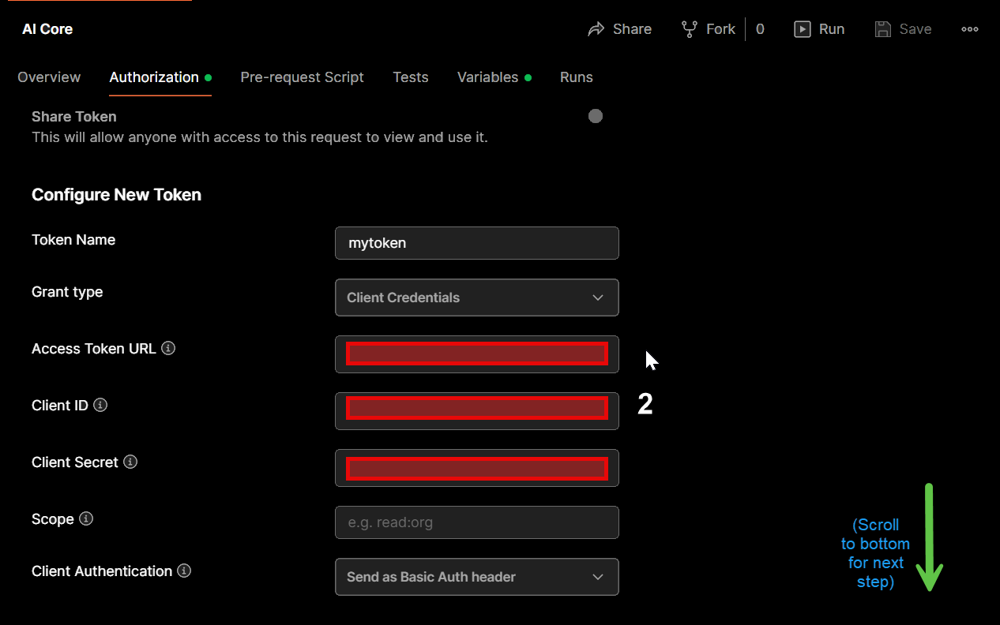
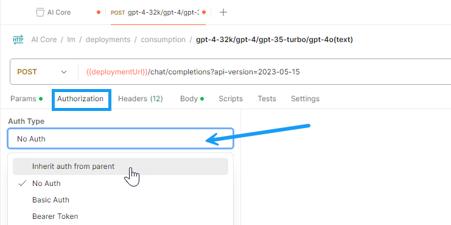

# Using foundational models  on SAP AI Core
<!-- description --> In this tutorial we are going to learn on how to consume LLM on AI core deployed on SAP AI core.

## You will learn
- How to infrence foundational models on AI core

## Prerequisites
Ai core setup and basic knowledge: [Link to documentation](https://developers.sap.com/tutorials/ai-core-setup.html)
Ai core Instance with Standard Plan or Extended Plan


### OpenAI GPT 3.5 / 35-16k / 4 / 4-32k

[OPTION BEGIN [curl]]

The following example shows how you can consume this generative AI model using curl. For more information about prompts, see the tutorial [Prompt LLMs in the Generative AI Hub in SAP AI Core & Launchpad Information published on SAP site](https://help.sap.com/docs/link-disclaimer?site=https%3A%2F%2Fdevelopers.sap.com%2Ftutorials%2Fai-core-generative-ai.html).

Before you use these models, please ensure that the deployment has already been created. You can create the deployment either through [generative-ai-hub-sdk or AI Launchpad](https://developers.sap.com/tutorials/ai-core-generative-ai.html#ad7ffc1e-e94e-4de4-b70f-116b038aff04).

For inferencing the corresponding model through curl,

- open Windows PowerShell (for Windows based devices)

NOTE: **do not use DOS Prompt instead of PowerShell**

- open Terminal (for macOS based devices)

Enter the following command after replacing `<deployment_url>` with the deployment url for the corresponding model.

NOTE: for windows devices, **replace "curl" with "curl.exe"**

```powershell
curl -L '<deployment_url>/chat/completions?api-version=2023-05-15' -H 'AI-Resource-Group: <resource-group>' -H 'Content-Type: application/json' -H 'Authorization: Bearer <token>' -d '{
"messages": [
    {
        "role": "user",
        "content": "<PROMPT>”
    }
],
"max_tokens": 100,
"temperature": 0.0,
"frequency_penalty": 0,
"presence_penalty": 0,
"stop": "null"
}'
```
[OPTION END]

[OPTION BEGIN [Postman]]

To begin using the APIs in AI Core, we start with setting up the authentication methods.



For ease of access, we set up the region, baseUrl and deploymentUrl variables as a pre-requisite. This avoids the need of passing these values repeatedly for different scenarios. 
NOTE: the deployment URL is specific to the model we intend to use.


Add the name of your respective resource group. 


Next, to begin making API calls, we’ll create a new access token. Now we’re ready to use the API for various models.


[OPTION END]

For more information on the models refer to [Models - OpenAI](https://platform.openai.com/docs/models/models)

### text-embedding-ada-002 / text-embedding-3-small / text-embedding-3-large
[OPTION BEGIN [curl]]

The following example shows how you can consume this generative AI model using curl. For more information about prompts, see the tutorial [Prompt LLMs in the Generative AI Hub in SAP AI Core & Launchpad Information published on SAP site](https://help.sap.com/docs/link-disclaimer?site=https%3A%2F%2Fdevelopers.sap.com%2Ftutorials%2Fai-core-generative-ai.html).

Before you use these models, please ensure that the deployment has already been created. You can create the deployment either through [generative-ai-hub-sdk or AI Launchpad](https://developers.sap.com/tutorials/ai-core-generative-ai.html#ad7ffc1e-e94e-4de4-b70f-116b038aff04).

For inferencing the corresponding model through curl,

- open Windows PowerShell (for Windows based devices)

NOTE: **do not use DOS Prompt instead of PowerShell**

- open Terminal (for macOS based devices)

Enter the following command after replacing `<deployment_url>` with the deployment url for the corresponding model.

NOTE: for windows devices, **replace "curl" with "curl.exe"**


```powershell
curl -L '<deployment_url>/embeddings?api-version=2023-05-15' -H 'AI-Resource-Group: <resource-group>' -H 'Content-Type: application/json' -H 'Authorization: Bearer <token>' -d '{
    "input" :"This is my input text"
}'
```

[OPTION END]

[OPTION BEGIN [Postman]]

To begin using the APIs in AI Core, we start with setting up the authentication methods.


For ease of access, we set up the region, baseUrl and deploymentUrl variables as a pre-requisite. This avoids the need of passing these values repeatedly for different scenarios. 
NOTE: the deployment URL is specific to the model we intend to use.


Add the name of your respective resource group. 


Next, to begin making API calls, we’ll create a new access token. Now we’re ready to use the API for various models.


[OPTION END]

For more information on the models refer to [Embeddings - OpenAI](https://platform.openai.com/docs/guides/embeddings/use-cases).

### Falcon

[OPTION BEGIN [curl]]

The following example shows how you can consume this generative AI model using curl. For more information about prompts, see the tutorial [Prompt LLMs in the Generative AI Hub in SAP AI Core & Launchpad Information published on SAP site](https://help.sap.com/docs/link-disclaimer?site=https%3A%2F%2Fdevelopers.sap.com%2Ftutorials%2Fai-core-generative-ai.html).

Before you use these models, please ensure that the deployment has already been created. You can create the deployment either through [generative-ai-hub-sdk or AI Launchpad](https://developers.sap.com/tutorials/ai-core-generative-ai.html#ad7ffc1e-e94e-4de4-b70f-116b038aff04).

For inferencing the corresponding model through curl,

- open Windows PowerShell (for Windows based devices)

NOTE: **do not use DOS Prompt instead of PowerShell**

- open Terminal (for macOS based devices)

Enter the following command after replacing `<deployment_url>` with the deployment url for the corresponding model.

NOTE: for windows devices, **replace "curl" with "curl.exe"**


```powershell
curl -L '<deployment_url>/chat/completions' -H 'AI-Resource-Group: <resource-group>'  -H 'Content-Type: application/json' -H 'Authorization: Bearer <token>' -d '{
  "model": "tiiuae--falcon-40b-instruct",
    "messages": [
        {
            "role": "user",
            "content": "PROMPT"
        }
    ],
    "max_tokens": 100
}'
```

[OPTION END]

[OPTION BEGIN [Postman]]

To begin using the APIs in AI Core, we start with setting up the authentication methods.


For ease of access, we set up the region, baseUrl and deploymentUrl variables as a pre-requisite. This avoids the need of passing these values repeatedly for different scenarios. 
NOTE: the deployment URL is specific to the model we intend to use.


Add the name of your respective resource group. 


Next, to begin making API calls, we’ll create a new access token. Now we’re ready to use the API for various models.


[OPTION END]

For more information on the models refer to [HuggingFace - Falcon](https://huggingface.co/tiiuae/falcon-40b).

### Gemini-1.0-pro
[OPTION BEGIN [curl]]

The following example shows how you can consume this generative AI model using curl. For more information about prompts, see the tutorial [Prompt LLMs in the Generative AI Hub in SAP AI Core & Launchpad Information published on SAP site](https://help.sap.com/docs/link-disclaimer?site=https%3A%2F%2Fdevelopers.sap.com%2Ftutorials%2Fai-core-generative-ai.html).

Before you use these models, please ensure that the deployment has already been created. You can create the deployment either through [generative-ai-hub-sdk or AI Launchpad](https://developers.sap.com/tutorials/ai-core-generative-ai.html#ad7ffc1e-e94e-4de4-b70f-116b038aff04).

For inferencing the corresponding model through curl,

- open Windows PowerShell (for Windows based devices)

NOTE: **do not use DOS Prompt instead of PowerShell**

- open Terminal (for macOS based devices)

Enter the following command after replacing `<deployment_url>` with the deployment url for the corresponding model.

NOTE: for windows devices, **replace "curl" with "curl.exe"**


```powershell
curl -L '<deployment_url>/models/gemini-1.0-pro:generateContent' -H 'AI-Resource-Group: <resource-group>' -H 'Content-Type: application/json' -H 'Authorization: Bearer <token>' -d '{
  "contents": [
    {
    "role": "user",
    "parts": { "text": "Hello!" }
    },
    {
    "role": "model",
    "parts": { "text": "Argh! What brings ye to my ship?" }
    },
    {
    "role": "user",
    "parts": { "text": "Wow! You are a real-life pirate!" }
    }
  ],
  "safety_settings": {
    "category": "HARM_CATEGORY_SEXUALLY_EXPLICIT",
    "threshold": "BLOCK_LOW_AND_ABOVE"
  },
  "generation_config": {
    "temperature": 0.9,
    "topP": 1,
    "candidateCount": 1,
    "maxOutputTokens": 2048
  }
}'
```

[OPTION END]

[OPTION BEGIN [Postman]]

To begin using the APIs in AI Core, we start with setting up the authentication methods.


For ease of access, we set up the region, baseUrl and deploymentUrl variables as a pre-requisite. This avoids the need of passing these values repeatedly for different scenarios. 
NOTE: the deployment URL is specific to the model we intend to use.


Add the name of your respective resource group. 


Next, to begin making API calls, we’ll create a new access token. Now we’re ready to use the API for various models.


[OPTION END]

For more information on the models refer to [Gemini Models](https://deepmind.google/technologies/gemini/).

### Text-bison model
[OPTION BEGIN [curl]]

The following example shows how you can consume this generative AI model using curl. For more information about prompts, see the tutorial [Prompt LLMs in the Generative AI Hub in SAP AI Core & Launchpad Information published on SAP site](https://help.sap.com/docs/link-disclaimer?site=https%3A%2F%2Fdevelopers.sap.com%2Ftutorials%2Fai-core-generative-ai.html).

Before you use these models, please ensure that the deployment has already been created. You can create the deployment either through [generative-ai-hub-sdk or AI Launchpad](https://developers.sap.com/tutorials/ai-core-generative-ai.html#ad7ffc1e-e94e-4de4-b70f-116b038aff04).

For inferencing the corresponding model through curl,

- open Windows PowerShell (for Windows based devices)

NOTE: **do not use DOS Prompt instead of PowerShell**

- open Terminal (for macOS based devices)

Enter the following command after replacing `<deployment_url>` with the deployment url for the corresponding model.

NOTE: for windows devices, **replace "curl" with "curl.exe"**


```powershell
curl -L '<deployment_url>/models/text-bison:predict' -H 'AI-Resource-Group: <resource-group>' -H 'Content-Type: application/json' -H 'Authorization: Bearer <token>' -d '{
  "instances": [
    {
      "prompt": "Hi, what can you do?"
    }
  ],
  "parameters": {
    "temperature": 0.8
  }
}'
```

[OPTION END]

[OPTION BEGIN [Postman]]

To begin using the APIs in AI Core, we start with setting up the authentication methods.


For ease of access, we set up the region, baseUrl and deploymentUrl variables as a pre-requisite. This avoids the need of passing these values repeatedly for different scenarios. 
NOTE: the deployment URL is specific to the model we intend to use.


Add the name of your respective resource group. 


Next, to begin making API calls, we’ll create a new access token. Now we’re ready to use the API for various models.


[OPTION END]

For more information on the models refer to [PaLM 2 for text](https://cloud.google.com/vertex-ai/generative-ai/docs/model-reference/text).

### Chat-bison model
[OPTION BEGIN [curl]]

The following example shows how you can consume this generative AI model using curl. For more information about prompts, see the tutorial [Prompt LLMs in the Generative AI Hub in SAP AI Core & Launchpad Information published on SAP site](https://help.sap.com/docs/link-disclaimer?site=https%3A%2F%2Fdevelopers.sap.com%2Ftutorials%2Fai-core-generative-ai.html).

Before you use these models, please ensure that the deployment has already been created. You can create the deployment either through [generative-ai-hub-sdk or AI Launchpad](https://developers.sap.com/tutorials/ai-core-generative-ai.html#ad7ffc1e-e94e-4de4-b70f-116b038aff04).

For inferencing the corresponding model through curl,

- open Windows PowerShell (for Windows based devices)

NOTE: **do not use DOS Prompt instead of PowerShell**

- open Terminal (for macOS based devices)

Enter the following command after replacing `<deployment_url>` with the deployment url for the corresponding model.

NOTE: for windows devices, **replace "curl" with "curl.exe"**

```powershell
curl -L '<deployment_url>/models/chat-bison:predict' -H 'AI-Resource-Group: <resource-group>' -H 'Content-Type: application/json' -H 'Authorization: Bearer <token>' -d '{
  "instances": [
    {
      "context": "Your conversation context here",
      "messages": [
        {
          "author": "user",
          "content": "User message 1"
        },
        {
          "author": "assistant",
          "content": "Assistant response 1"
        },
        {
          "author": "user",
          "content": "User message 2"
        }
      ]
    }
  ],
  "parameters": {
    "temperature": 0.8,
    "maxOutputTokens": 50
  }
}
```

[OPTION END]

[OPTION BEGIN [Postman]]

To begin using the APIs in AI Core, we start with setting up the authentication methods.


For ease of access, we set up the region, baseUrl and deploymentUrl variables as a pre-requisite. This avoids the need of passing these values repeatedly for different scenarios. 
NOTE: the deployment URL is specific to the model we intend to use.


Add the name of your respective resource group. 


Next, to begin making API calls, we’ll create a new access token. Now we’re ready to use the API for various models.


[OPTION END]

For more information on the models refer to [PaLM 2 for chat](https://cloud.google.com/vertex-ai/generative-ai/docs/model-reference/text-chat).

### Textembedding-gecko
[OPTION BEGIN [curl]]

The following example shows how you can consume this generative AI model using curl. For more information about prompts, see the tutorial [Prompt LLMs in the Generative AI Hub in SAP AI Core & Launchpad Information published on SAP site](https://help.sap.com/docs/link-disclaimer?site=https%3A%2F%2Fdevelopers.sap.com%2Ftutorials%2Fai-core-generative-ai.html).

Before you use these models, please ensure that the deployment has already been created. You can create the deployment either through [generative-ai-hub-sdk or AI Launchpad](https://developers.sap.com/tutorials/ai-core-generative-ai.html#ad7ffc1e-e94e-4de4-b70f-116b038aff04).

For inferencing the corresponding model through curl,

- open Windows PowerShell (for Windows based devices)

NOTE: **do not use DOS Prompt instead of PowerShell**

- open Terminal (for macOS based devices)

Enter the following command after replacing `<deployment_url>` with the deployment url for the corresponding model.

NOTE: for windows devices, **replace "curl" with "curl.exe"**


```powershell
curl -L '<deployment_url>/models/textembedding-gecko:predict' -H 'AI-Resource-Group: <resource-group>' -H 'Content-Type: application/json' -H 'Authorization: Bearer <token>' -d '{
  "instances": [
    {
      "task_type": "RETRIEVAL_DOCUMENT",
      "title": "Document title",
      "content": "I would like embeddings for this text!"
    }
  ]
}'
```

[OPTION END]

[OPTION BEGIN [Postman]]

To begin using the APIs in AI Core, we start with setting up the authentication methods.


For ease of access, we set up the region, baseUrl and deploymentUrl variables as a pre-requisite. This avoids the need of passing these values repeatedly for different scenarios. 
NOTE: the deployment URL is specific to the model we intend to use.


Add the name of your respective resource group. 


Next, to begin making API calls, we’ll create a new access token. Now we’re ready to use the API for various models.


[OPTION END]

For more information on the models refer to [Text embeddings API ](https://cloud.google.com/vertex-ai/generative-ai/docs/model-reference/text-embeddings-api).

### Textembedding-gecko-multilingual
[OPTION BEGIN [curl]]

The following example shows how you can consume this generative AI model using curl. For more information about prompts, see the tutorial [Prompt LLMs in the Generative AI Hub in SAP AI Core & Launchpad Information published on SAP site](https://help.sap.com/docs/link-disclaimer?site=https%3A%2F%2Fdevelopers.sap.com%2Ftutorials%2Fai-core-generative-ai.html).

Before you use these models, please ensure that the deployment has already been created. You can create the deployment either through [generative-ai-hub-sdk or AI Launchpad](https://developers.sap.com/tutorials/ai-core-generative-ai.html#ad7ffc1e-e94e-4de4-b70f-116b038aff04).

For inferencing the corresponding model through curl,

- open Windows PowerShell (for Windows based devices)

NOTE: **do not use DOS Prompt instead of PowerShell**

- open Terminal (for macOS based devices)

Enter the following command after replacing `<deployment_url>` with the deployment url for the corresponding model.

NOTE: for windows devices, **replace "curl" with "curl.exe"**


```powershell
curl -L '<deployment_url>/models/textembedding-gecko-multilingual:predict' -H 'AI-Resource-Group: <resource-group>' -H 'Content-Type: application/json' -H 'Authorization: Bearer <token>' -d '{
  "instances": [
    {
      "task_type": "RETRIEVAL_DOCUMENT",
      "title": "Document title",
      "content": "I would like embeddings for this text!"
    }
  ]
}'
```

[OPTION END]

[OPTION BEGIN [Postman]]

To begin using the APIs in AI Core, we start with setting up the authentication methods.


For ease of access, we set up the region, baseUrl and deploymentUrl variables as a pre-requisite. This avoids the need of passing these values repeatedly for different scenarios. 
NOTE: the deployment URL is specific to the model we intend to use.


Add the name of your respective resource group. 


Next, to begin making API calls, we’ll create a new access token. Now we’re ready to use the API for various models.


[OPTION END]

For more information on the models refer to [Text embeddings API ](https://cloud.google.com/vertex-ai/generative-ai/docs/model-reference/text-embeddings-api).

### Alephalpha-luminous-base-control
[OPTION BEGIN [curl]]

The following example shows how you can consume this generative AI model using curl. For more information about prompts, see the tutorial [Prompt LLMs in the Generative AI Hub in SAP AI Core & Launchpad Information published on SAP site](https://help.sap.com/docs/link-disclaimer?site=https%3A%2F%2Fdevelopers.sap.com%2Ftutorials%2Fai-core-generative-ai.html).

Before you use these models, please ensure that the deployment has already been created. You can create the deployment either through [generative-ai-hub-sdk or AI Launchpad](https://developers.sap.com/tutorials/ai-core-generative-ai.html#ad7ffc1e-e94e-4de4-b70f-116b038aff04).

For inferencing the corresponding model through curl,

- open Windows PowerShell (for Windows based devices)

NOTE: **do not use DOS Prompt instead of PowerShell**

- open Terminal (for macOS based devices)

Enter the following command after replacing `<deployment_url>` with the deployment url for the corresponding model.

NOTE: for windows devices, **replace "curl" with "curl.exe"**


Text Completions

```powershell
curl --location '<Deployment_url>/complete' \
--header 'AI-Resource-Group: <resource-group>' \
--header 'Content-Type: application/json' \
--header 'Authorization: Bearer <jwt>' \
--data '{
  "model": "alephalpha-luminous-base-control",
  "prompt": "An apple a day..",
  "maximum_tokens": 100
}'
```

Embedding

```powershell
curl --location '<Deployment_url>/semantic_embed' \
--header 'AI-Resource-Group: <resource-group>' \
--header 'Content-Type: application/json' \
--header 'Authorization: Bearer <jwt>' \
--data '{
    "model": "alephalpha-luminous-base-control",
    "prompt": "An apple a day..",
    "representation": "symmetric"
}'
```

[OPTION END]

[OPTION BEGIN [Postman]]

To begin using the APIs in AI Core, we start with setting up the authentication methods.


For ease of access, we set up the region, baseUrl and deploymentUrl variables as a pre-requisite. This avoids the need of passing these values repeatedly for different scenarios. 
NOTE: the deployment URL is specific to the model we intend to use.


Add the name of your respective resource group. 


Next, to begin making API calls, we’ll create a new access token. Now we’re ready to use the API for various models.


[OPTION END]

For more information on the models refer to [What is Luminous?](https://docs.aleph-alpha.com/docs/introduction/luminous/)

### alephalpha-luminous-supreme-control
[OPTION BEGIN [curl]]

The following example shows how you can consume this generative AI model using curl. For more information about prompts, see the tutorial [Prompt LLMs in the Generative AI Hub in SAP AI Core & Launchpad Information published on SAP site](https://help.sap.com/docs/link-disclaimer?site=https%3A%2F%2Fdevelopers.sap.com%2Ftutorials%2Fai-core-generative-ai.html).

Before you use these models, please ensure that the deployment has already been created. You can create the deployment either through [generative-ai-hub-sdk or AI Launchpad](https://developers.sap.com/tutorials/ai-core-generative-ai.html#ad7ffc1e-e94e-4de4-b70f-116b038aff04).

For inferencing the corresponding model through curl,

- open Windows PowerShell (for Windows based devices)

NOTE: **do not use DOS Prompt instead of PowerShell**

- open Terminal (for macOS based devices)

Enter the following command after replacing `<deployment_url>` with the deployment url for the corresponding model.

NOTE: for windows devices, **replace "curl" with "curl.exe"**


Completion

```powershell
curl --location '<Deployment_url>/complete' \
--header 'AI-Resource-Group:  <resource-group>' \
--header 'Content-Type: application/json' \
--header 'Authorization: Bearer <jwt> ' \
--data '{
    "model": "alephalpha-luminous-supreme-control",
    "prompt": "An apple a day..",
    "maximum_tokens": 100
}'
```

[OPTION END]

[OPTION BEGIN [Postman]]

To begin using the APIs in AI Core, we start with setting up the authentication methods.


For ease of access, we set up the region, baseUrl and deploymentUrl variables as a pre-requisite. This avoids the need of passing these values repeatedly for different scenarios. 
NOTE: the deployment URL is specific to the model we intend to use.


Add the name of your respective resource group. 


Next, to begin making API calls, we’ll create a new access token. Now we’re ready to use the API for various models.


[OPTION END]

For more information on the models refer to [What is Luminous?](https://docs.aleph-alpha.com/docs/introduction/luminous/)

### alephalpha-luminous-base
[OPTION BEGIN [curl]]

The following example shows how you can consume this generative AI model using curl. For more information about prompts, see the tutorial [Prompt LLMs in the Generative AI Hub in SAP AI Core & Launchpad Information published on SAP site](https://help.sap.com/docs/link-disclaimer?site=https%3A%2F%2Fdevelopers.sap.com%2Ftutorials%2Fai-core-generative-ai.html).

Before you use these models, please ensure that the deployment has already been created. You can create the deployment either through [generative-ai-hub-sdk or AI Launchpad](https://developers.sap.com/tutorials/ai-core-generative-ai.html#ad7ffc1e-e94e-4de4-b70f-116b038aff04).

For inferencing the corresponding model through curl,

- open Windows PowerShell (for Windows based devices)

NOTE: **do not use DOS Prompt instead of PowerShell**

- open Terminal (for macOS based devices)

Enter the following command after replacing `<deployment_url>` with the deployment url for the corresponding model.

NOTE: for windows devices, **replace "curl" with "curl.exe"**


Embeddings

```powershell
curl --location <Deployment_url>/semantic_embed' \
--header 'AI-Resource-Group: <resource-group>'  \
--header 'Content-Type: application/json' \
--header 'Authorization: Bearer <JWT>' \
--data '{
    "model": "alephalpha-luminous-base",
    "prompt": "An apple a day..",
    "representation": "symmetric"
}'
```

[OPTION END]

[OPTION BEGIN [Postman]]

To begin using the APIs in AI Core, we start with setting up the authentication methods.


For ease of access, we set up the region, baseUrl and deploymentUrl variables as a pre-requisite. This avoids the need of passing these values repeatedly for different scenarios. 
NOTE: the deployment URL is specific to the model we intend to use.


Add the name of your respective resource group. 


Next, to begin making API calls, we’ll create a new access token. Now we’re ready to use the API for various models.


[OPTION END]

For more information on the models refer to [What is Luminous?](https://docs.aleph-alpha.com/docs/introduction/luminous/)


### mistralai--mixtral-8x7b-instruct-v01
[OPTION BEGIN [curl]]

The following example shows how you can consume this generative AI model using curl. For more information about prompts, see the tutorial [Prompt LLMs in the Generative AI Hub in SAP AI Core & Launchpad Information published on SAP site](https://help.sap.com/docs/link-disclaimer?site=https%3A%2F%2Fdevelopers.sap.com%2Ftutorials%2Fai-core-generative-ai.html).

Before you use these models, please ensure that the deployment has already been created. You can create the deployment either through [generative-ai-hub-sdk or AI Launchpad](https://developers.sap.com/tutorials/ai-core-generative-ai.html#ad7ffc1e-e94e-4de4-b70f-116b038aff04).

For inferencing the corresponding model through curl,

- open Windows PowerShell (for Windows based devices)

NOTE: **do not use DOS Prompt instead of PowerShell**

- open Terminal (for macOS based devices)

Enter the following command after replacing `<deployment_url>` with the deployment url for the corresponding model.

NOTE: for windows devices, **replace "curl" with "curl.exe"**


```powershell
curl --location 'deployment_url/chat/completions' \
--header 'AI-Resource-Group: <resource-group>' \
--header 'Content-Type: application/json' \
--header 'Authorization: Bearer <jwt_token>' \
--data '{
    "model": "mistralai--mixtral-8x7b-instruct-v01",
    "messages": [
        {
        "role": "user",
        "content": "Sample prompt"
        }
    ],
    "max_tokens": 100
  }'
```

[OPTION END]

[OPTION BEGIN [Postman]]

To begin using the APIs in AI Core, we start with setting up the authentication methods.


For ease of access, we set up the region, baseUrl and deploymentUrl variables as a pre-requisite. This avoids the need of passing these values repeatedly for different scenarios. 
NOTE: the deployment URL is specific to the model we intend to use.


Add the name of your respective resource group. 


Next, to begin making API calls, we’ll create a new access token. Now we’re ready to use the API for various models.


[OPTION END]

For more information on the models refer to [Mixtral-8x7B-Instruct-v0.1](https://huggingface.co/mistralai/Mixtral-8x7B-Instruct-v0.1).

### amazon--titan-text-express  /  amazon--titan-text-lite
[OPTION BEGIN [curl]]

The following example shows how you can consume this generative AI model using curl. For more information about prompts, see the tutorial [Prompt LLMs in the Generative AI Hub in SAP AI Core & Launchpad Information published on SAP site](https://help.sap.com/docs/link-disclaimer?site=https%3A%2F%2Fdevelopers.sap.com%2Ftutorials%2Fai-core-generative-ai.html).

Before you use these models, please ensure that the deployment has already been created. You can create the deployment either through [generative-ai-hub-sdk or AI Launchpad](https://developers.sap.com/tutorials/ai-core-generative-ai.html#ad7ffc1e-e94e-4de4-b70f-116b038aff04).

For inferencing the corresponding model through curl,

- open Windows PowerShell (for Windows based devices)

NOTE: **do not use DOS Prompt instead of PowerShell**

- open Terminal (for macOS based devices)

Enter the following command after replacing `<deployment_url>` with the deployment url for the corresponding model.

NOTE: for windows devices, **replace "curl" with "curl.exe"**


```powershell
curl --location '<Deployment_url>/invoke' \
--header 'AI-Resource-Group: <resource_group>' \
--header 'Content-Type: application/json' \
--header 'Authorization: Bearer <JWT_token>' \
--data '{
    "inputText": "How does AI works",
    "textGenerationConfig": {
        "maxTokenCount": 100,
        "stopSequences": [],
        "temperature": 0,
        "topP": 1
    }
}'
```

[OPTION END]

[OPTION BEGIN [Postman]]

To begin using the APIs in AI Core, we start with setting up the authentication methods.


For ease of access, we set up the region, baseUrl and deploymentUrl variables as a pre-requisite. This avoids the need of passing these values repeatedly for different scenarios. 
NOTE: the deployment URL is specific to the model we intend to use.


Add the name of your respective resource group. 


Next, to begin making API calls, we’ll create a new access token. Now we’re ready to use the API for various models.


[OPTION END]

For more information on the models refer to [Amazon Titan Text models](https://aws.amazon.com/about-aws/whats-new/2023/11/amazon-titan-models-express-lite-bedrock/).

### anthropic--claude-3-haiku  /  anthropic--claude-3-sonnet
[OPTION BEGIN [curl]]

The following example shows how you can consume this generative AI model using curl. For more information about prompts, see the tutorial [Prompt LLMs in the Generative AI Hub in SAP AI Core & Launchpad Information published on SAP site](https://help.sap.com/docs/link-disclaimer?site=https%3A%2F%2Fdevelopers.sap.com%2Ftutorials%2Fai-core-generative-ai.html).

Before you use these models, please ensure that the deployment has already been created. You can create the deployment either through [generative-ai-hub-sdk or AI Launchpad](https://developers.sap.com/tutorials/ai-core-generative-ai.html#ad7ffc1e-e94e-4de4-b70f-116b038aff04).

For inferencing the corresponding model through curl,

- open Windows PowerShell (for Windows based devices)

NOTE: **do not use DOS Prompt instead of PowerShell**

- open Terminal (for macOS based devices)

Enter the following command after replacing `<deployment_url>` with the deployment url for the corresponding model.

NOTE: for windows devices, **replace "curl" with "curl.exe"**


```powershell
curl --location '<deployment_url>/invoke' \
--header 'AI-Resource-Group: <Resource_group>' \
--header 'Content-Type: application/json' \
--header 'Authorization: Bearer <JWT_token>' \
--data '{
    "anthropic_version": "bedrock-2023-05-31",
    "max_tokens": 100,
    "messages": [
        {
            "role": "user",
            "content": "Hello, Claude"
        }
    ]
}'
```

[OPTION END]

[OPTION BEGIN [Postman]]

To begin using the APIs in AI Core, we start with setting up the authentication methods.


For ease of access, we set up the region, baseUrl and deploymentUrl variables as a pre-requisite. This avoids the need of passing these values repeatedly for different scenarios. 
NOTE: the deployment URL is specific to the model we intend to use.


Add the name of your respective resource group. 


Next, to begin making API calls, we’ll create a new access token. Now we’re ready to use the API for various models.


[OPTION END]

For more information on the models refer to [Claude 3 Family](https://www.anthropic.com/news/claude-3-family).

### meta--llama3-70b-instruct
[OPTION BEGIN [curl]]

The following example shows how you can consume this generative AI model using curl. For more information about prompts, see the tutorial [Prompt LLMs in the Generative AI Hub in SAP AI Core & Launchpad Information published on SAP site](https://help.sap.com/docs/link-disclaimer?site=https%3A%2F%2Fdevelopers.sap.com%2Ftutorials%2Fai-core-generative-ai.html).

Before you use these models, please ensure that the deployment has already been created. You can create the deployment either through [generative-ai-hub-sdk or AI Launchpad](https://developers.sap.com/tutorials/ai-core-generative-ai.html#ad7ffc1e-e94e-4de4-b70f-116b038aff04).

For inferencing the corresponding model through curl,

- open Windows PowerShell (for Windows based devices)

NOTE: **do not use DOS Prompt instead of PowerShell**

- open Terminal (for macOS based devices)

Enter the following command after replacing `<deployment_url>` with the deployment url for the corresponding model.

NOTE: for windows devices, **replace "curl" with "curl.exe"**


```powershell
curl --location '<Deployment_url>/chat/completions' \
--header 'AI-Resource-Group: <resource_group>' \
--header 'Content-Type: application/json' \
--header 'Authorization: Bearer <JWT_token>' \
--data '{
    "model": "meta--llama3-70b-instruct",
    "messages": [
        {
            "role": "user",
            "content": "What'\''s the difference between Accountability vs Responsibility, answer in 200 words?"
        }
    ],
    "max_tokens": 100
}'
```

[OPTION END]

[OPTION BEGIN [Postman]]

To begin using the APIs in AI Core, we start with setting up the authentication methods.


For ease of access, we set up the region, baseUrl and deploymentUrl variables as a pre-requisite. This avoids the need of passing these values repeatedly for different scenarios. 
NOTE: the deployment URL is specific to the model we intend to use.


Add the name of your respective resource group. 


Next, to begin making API calls, we’ll create a new access token. Now we’re ready to use the API for various models.


[OPTION END]

For more information on the models refer to [Meta-Llama-3-70B-Instruct](https://huggingface.co/meta-llama/Meta-Llama-3-70B-Instruct).

### anthropic--claude-3-opus
[OPTION BEGIN [curl]]

The following example shows how you can consume this generative AI model using curl. For more information about prompts, see the tutorial [Prompt LLMs in the Generative AI Hub in SAP AI Core & Launchpad Information published on SAP site](https://help.sap.com/docs/link-disclaimer?site=https%3A%2F%2Fdevelopers.sap.com%2Ftutorials%2Fai-core-generative-ai.html).

Before you use these models, please ensure that the deployment has already been created. You can create the deployment either through [generative-ai-hub-sdk or AI Launchpad](https://developers.sap.com/tutorials/ai-core-generative-ai.html#ad7ffc1e-e94e-4de4-b70f-116b038aff04).

For inferencing the corresponding model through curl,

- open Windows PowerShell (for Windows based devices)

NOTE: **do not use DOS Prompt instead of PowerShell**

- open Terminal (for macOS based devices)

Enter the following command after replacing `<deployment_url>` with the deployment url for the corresponding model.

NOTE: for windows devices, **replace "curl" with "curl.exe"**


```powershell
curl --location '<deployment_url>/invoke' \
--header 'AI-Resource-Group: <Resource_group>' \
--header 'Content-Type: application/json' \
--header 'Authorization: Bearer <JWT_token>' \
--data '{
    "anthropic_version": "bedrock-2023-05-31",
    "max_tokens": 100,
    "messages": [
        {
            "role": "user",
            "content": "Hello, Opus"
        }
    ]
}'
```

[OPTION END]

[OPTION BEGIN [Postman]]

To begin using the APIs in AI Core, we start with setting up the authentication methods.


For ease of access, we set up the region, baseUrl and deploymentUrl variables as a pre-requisite. This avoids the need of passing these values repeatedly for different scenarios. 
NOTE: the deployment URL is specific to the model we intend to use.


Add the name of your respective resource group. 


Next, to begin making API calls, we’ll create a new access token. Now we’re ready to use the API for various models.


[OPTION END]

For more information on the models refer to [Claude 3 Family](https://www.anthropic.com/news/claude-3-family).

### amazon--titan-embed-text
[OPTION BEGIN [curl]]

The following example shows how you can consume this generative AI model using curl. For more information about prompts, see the tutorial [Prompt LLMs in the Generative AI Hub in SAP AI Core & Launchpad Information published on SAP site](https://help.sap.com/docs/link-disclaimer?site=https%3A%2F%2Fdevelopers.sap.com%2Ftutorials%2Fai-core-generative-ai.html).

Before you use these models, please ensure that the deployment has already been created. You can create the deployment either through [generative-ai-hub-sdk or AI Launchpad](https://developers.sap.com/tutorials/ai-core-generative-ai.html#ad7ffc1e-e94e-4de4-b70f-116b038aff04).

For inferencing the corresponding model through curl,

- open Windows PowerShell (for Windows based devices)

NOTE: **do not use DOS Prompt instead of PowerShell**

- open Terminal (for macOS based devices)

Enter the following command after replacing `<deployment_url>` with the deployment url for the corresponding model.

NOTE: for windows devices, **replace "curl" with "curl.exe"**


```powershell
curl --location '<Deployment_url>/invoke' \
--header 'AI-Resource-Group: <resource_group>' \
--header 'Content-Type: application/json' \
--header 'Authorization: Bearer <JWT_token>' \
--data '{
    "inputText": "Hello World"
}'
```

[OPTION END]

[OPTION BEGIN [Postman]]

To begin using the APIs in AI Core, we start with setting up the authentication methods.


For ease of access, we set up the region, baseUrl and deploymentUrl variables as a pre-requisite. This avoids the need of passing these values repeatedly for different scenarios. 
NOTE: the deployment URL is specific to the model we intend to use.


Add the name of your respective resource group. 


Next, to begin making API calls, we’ll create a new access token. Now we’re ready to use the API for various models.


[OPTION END]

For more information on the models refer to [Amazon Titan Text models](https://aws.amazon.com/about-aws/whats-new/2023/11/amazon-titan-models-express-lite-bedrock/).
