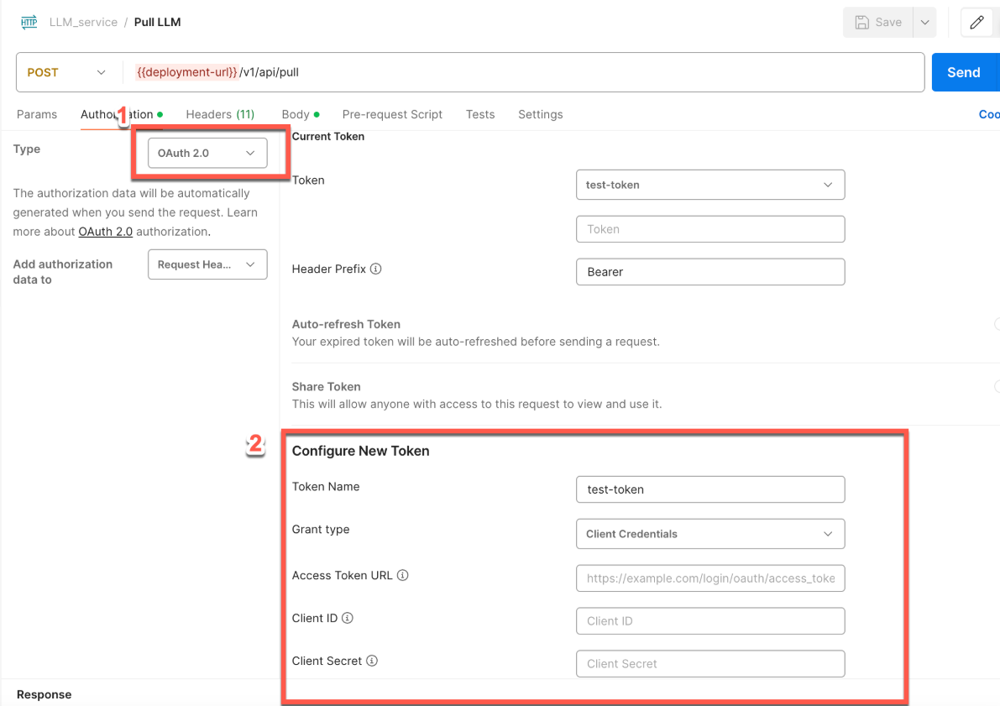
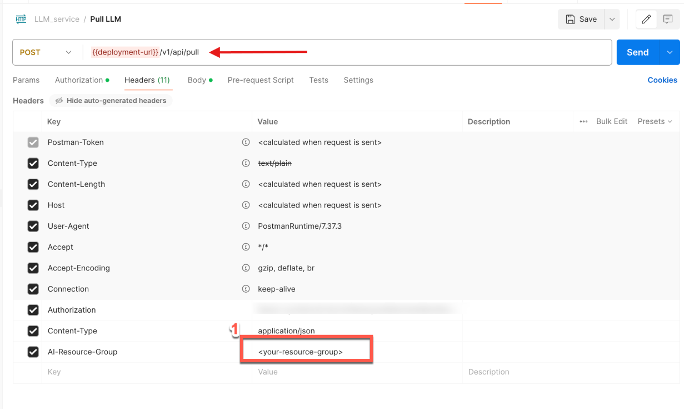
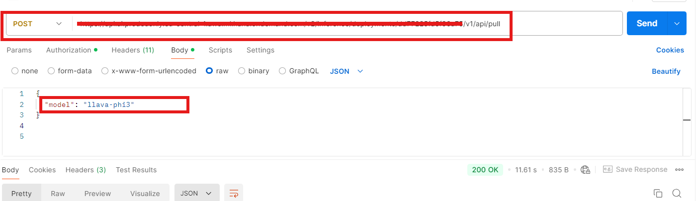
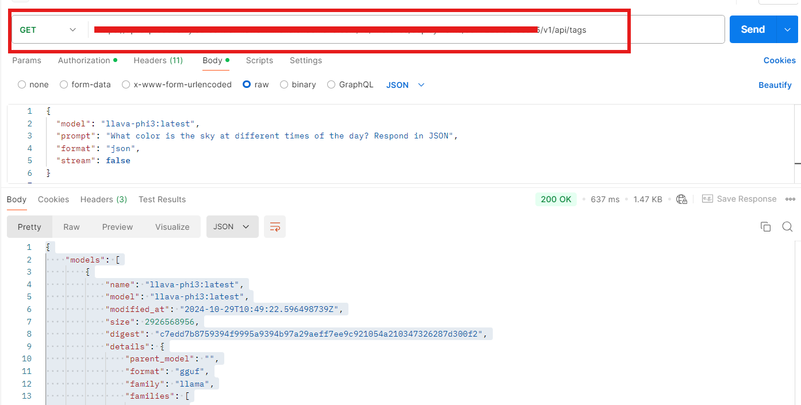
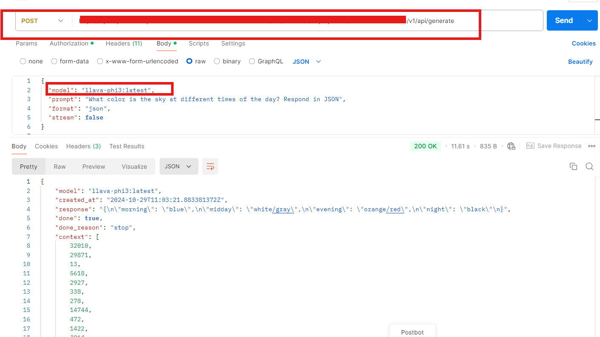

# Using small language models on SAP AI Core
<!-- description --> In this tutorial we are going to learn on how to deploy a custom LLM on AI core using ollama for the example we would be taking Gemma as a model from hugging face and deploy it on SAP AI core.

## You will learn
- How to Deploy ollama on AI core
- Add models to ollama and inference models

## Prerequisites
Ai core setup and basic knowledge: [Link to documentation](https://developers.sap.com/tutorials/ai-core-setup.html)
Ai core Instance with Standard Plan or Extended Plan
Docker Desktop Setup [Download and Install](https://www.docker.com/products/docker-desktop)
Github Account

### Architecture Overview
In this tutorial we are deploying ollama an open-source project that serves as a powerful and user-friendly platform for running LLMs on on SAP AI core. which acts as a bridge between the complexities of LLM technology and the desire for an accessible and customizable AI experience.


We can pick any model from the above model hubs and connect it to AI core for the example we are going to deploy ollama on AI core and enable Gemma and inference the same.

### Adding workflow file to github
Workflows for SAP AI Core are created using YAML or JSON files that are compatible with the SAP AI Core schema. Let’s start with adding a Argo Workflow file to manage: `ollama`.

In your Github Create a new repository, click **Add file** > **Create new file**.


Type `LearningScenarios/ollama.yaml` into the Name your file field. This will automatically create the folder `workflows` and a workflow named `ollama.yaml` inside it.


> CAUTION Do not use the name of your workflow file (`ollama.yaml`) as any other identifier within SAP AI Core.


Now copy and paste the following snippet to the editor. 
```yaml 
apiVersion: ai.sap.com/v1alpha1
kind: ServingTemplate
metadata:
  name: ollama
  annotations:
    scenarios.ai.sap.com/description: "Run a ollama server on SAP AI Core"
    scenarios.ai.sap.com/name: "ollama"
    executables.ai.sap.com/description: "ollama service"
    executables.ai.sap.com/name: "ollama"
  labels:
    scenarios.ai.sap.com/id: "ollama"
    ai.sap.com/version: "0.0.1"
spec:
  template:
    apiVersion: "serving.kserve.io/v1beta1"
    metadata:
      annotations: |
        autoscaling.knative.dev/metric: concurrency
        autoscaling.knative.dev/target: 1
        autoscaling.knative.dev/targetBurstCapacity: 0
      labels: |
        ai.sap.com/resourcePlan: infer.s
    spec: |
      predictor:
        imagePullSecrets:
        - name: <YOUR_DOCKER_SECRET>
        minReplicas: 1
        maxReplicas: 1
        containers:
        - name: kserve-container
          image: docker.io/<YOUR_DOCKER_USER>/ollama:ai-core
          ports:
            - containerPort: 8080
              protocol: TCP
```
Replace `<YOUR_DOCKER_SECRET>` with Default and replace `<YOUR_DOCKER_USER>` with your docker username. 

**NOTE** - we'll generate the docker image referred here in the following steps.

### Create a Docker account and generate a Docker access token and Install Docker
[Sign Up](https://www.docker.com/) for a Docker account.

Click on the profile button (your profile name) and then select **Account Settings**.


Select **Security** from the navigation bar and click **New Access Token**.


###Creating a Docker Image

Create a directory (folder) named `custom-llm`.
Create a file `Dockerfile`. Paste the following snippet in the file.

```dockerfile
# Specify the base layers (default dependencies) to use
ARG BASE_IMAGE=ubuntu:22.04
FROM ${BASE_IMAGE}

# Update and install dependencies
RUN apt-get update && \
    apt-get install -y \
    ca-certificates \
    nginx \
    curl && \
    apt-get clean && \
    rm -rf /var/lib/apt/lists/*

# Install ollama
RUN curl -fsSL https://ollama.com/install.sh | sh

# Expose port and set environment variables for ollama
ENV ollama_HOST=0.0.0.0
ENV PATH=/usr/local/sbin:/usr/local/bin:/usr/sbin:/usr/bin:/sbin:/bin
ENV LD_LIBRARY_PATH=/usr/local/nvidia/lib:/usr/local/nvidia/lib64
ENV NVIDIA_DRIVER_CAPABILITIES=compute,utility

# Configure nginx for reverse proxy
RUN echo "events { use epoll; worker_connections 128; } \
    http { \
        server { \
                    listen 8080; \
                        location ^~ /v1/api/ { \
                            proxy_pass http://localhost:11434/api/; \
                            proxy_set_header Host \$host; \
                            proxy_set_header X-Real-IP \$remote_addr; \
                            proxy_set_header X-Forwarded-For \$proxy_add_x_forwarded_for; \
                            proxy_set_header X-Forwarded-Proto \$scheme; \
                        } \
                        location ^~ /v1/chat/ { \
                            proxy_pass http://localhost:11434/v1/chat/; \
                            proxy_set_header Host \$host; \
                            proxy_set_header X-Real-IP \$remote_addr; \
                            proxy_set_header X-Forwarded-For \$proxy_add_x_forwarded_for; \
                            proxy_set_header X-Forwarded-Proto \$scheme; \
                        } \
                } \
        }" > /etc/nginx/nginx.conf && \
    chmod -R 777 /var/log/nginx /var/lib/nginx /run

EXPOSE 8080

# Create directory for user nobody SAP AI Core run-time
RUN mkdir -p /nonexistent/.ollama && \
    chown -R nobody:nogroup /nonexistent && \
    chmod -R 770 /nonexistent
#   chmod -R 777 /nonexistent/.ollama

# Start nginx and ollama service
CMD service nginx start && /usr/local/bin/ollama serve

```

in the same directory open terminal and run the following commands:


1.Login to docker hub
```powershell
docker login -u <YOUR_DOCKER_USER> -p <YOUR_DOCKER_ACCESS_TOKEN>
```

2.Build the docker image
```powershell
docker build --platform=linux/amd64 -t docker.io/<YOUR_DOCKER_USER>/ollama:ai-core .
```

3.Push the docker image to docker hub to be used by deployment in SAP AI Core
```powershell
docker push docker.io/<YOUR_DOCKER_USER>/ollama:ai-core
```

### Storing docker secrets to AI core

This step is required once. Storing Docker credentials enables SAP AI Core to pull (download) your Docker images from a private Docker repository. Use of a private Docker image prevents others from seeing your content.

Select your SAP AI Core connection under the **Workspaces app**.

Click **Docker Registry Secrets** in the **AI Core Administration app**. Click Add.

A Pop up will appear on screen and add the following Json with the details to your Docker Creds.

```json
{
    ".dockerconfigjson": "{\"auths\":{\"YOUR_DOCKER_REGISTRY_URL\":{\"username\":\"YOUR_DOCKER_USERNAME\",\"password\":\"YOUR_DOCKER_ACCESS_TOKEN\"}}}"
}
```

### Onboarding Github and application on AI core

Select on your SAP AI Core connection under **Workspaces app** in the SAP AI Launchpad.


Under the **Git Repositories** section in **AI Core Administration app**, click **Add**.

> WARNING If you don’t see the AI Core Administration app, check that you had selected your SAP AI Core connection from the Workspaces app. If it is still not visible then ask your SAP AI Launchpad administrator to assign roles to you so that you can access the app.


Enter your GitHub repository details (created in the previous step) in the dialog box that appears, and click **Add**.


Use the following information as reference:

- **URL:** Paste the URL of your GitHub repository and add the suffix /workflows.

- **Username:** Your GitHub username.

- **Password:** Paste your GitHub Personal Access Token, generated in the previous step.

> Note: Password does not gets validated at time of Adding Github Repository its just meant to save Github Creds to AI core. Passwords gets validated at time of creating Application or when Application refreshes connection to AI core.

You will see your GitHub onboarding completed in a few seconds. As a next steps we will enable an application on AI core.


Go to your SAP AI Launchpad.
In the AI Core **Administration app**, click **Applications** > **Create**.


Using the reference below as a guide, specify the details of your application. This form will create your application on your SAP AI Launchpad.


Use the following information for reference:


- **Application Name:** An identifier of your choice. learning-scenarios-app is used as an example of best practice in this tutorial because it is a descriptive name.

- **Repository URL:** Your GitHub account URL and repository suffix. This helps you select the credentials to access the repository.

- **Path:** The folder in your GitHub where your workflow is located. For this tutorial it is LearningScenarios.

- **Revision:** The is the unique ID of your GitHub commit. Set this to HEAD to have it automatically refer to the latest commit.

**NOTE:**

1. If creation of application fails, check the ollama.yaml file, and ensure that the names in lines #4, #7, #9, and #11 are unique, and haven't been used previously.

2. Generate a fresh classic git token for authentication, with all necessary privileges provided during creation.

3. Ensure that you have put the correct url in `YOUR_DOCKER_REGISTRY_URL` while setting up docket secret.

4. Refresh the launchpad, and create a fresh application.   

### Creating configuration

Go to **ML Operations** > **Configurations**. Click on the **Create** button.


Enter the model Name and choose the workflow with following parameters

```json
"name": "ollama",
"scenario_id": "ollama",
"executable_id": "ollama",
```

Then click on **next** > **review and create**.

### Deploying Ollama to AI core

In the model click on **create deployment**. A screen will appear

Set duration as standard and click on the **Review** button.


Once you create the deployment, wait for the current status to be set to RUNNING.


Once the deployment is running, you can access the LLM’s using ollama.

### Pulling llava-phi3 and Performing Inference

Now we need to import llava-phi3 to our ollama pod before we can inference the model so here we would be using SAP AI API to call pull model call in Ollama.

[OPTION BEGIN [Postman]]

- Setting up AI core Auth Creds


- adding Resource groups to headers


- Once you have deployed the model in SAP AI Core, you can use the pull endpoint to load additional models, such as llava-phi3.
```json
{ 
     "name": "llava-phi3" 
}
```
For your reference, please see the screenshots below.

- Once the model is pulled to AI core we can check the list of models deployed under ollama deployment via the following.
```
Endpoint: {{deploymentUrl}}/v1/api/tags
```
For your reference, please see the screenshots below.


- Once the model is pulled and verified, you can use it to generate predictions. In this example, we’ll use nemotron-mini to respond to a prompt.
```
{
  "model": "llava-phi3:latest",
  "prompt": "What color is the sky at different times of the day? Respond in JSON",
  "format": "json",
  "stream": false
}
```
For your reference, please see the screenshots below.


[OPTION END]
