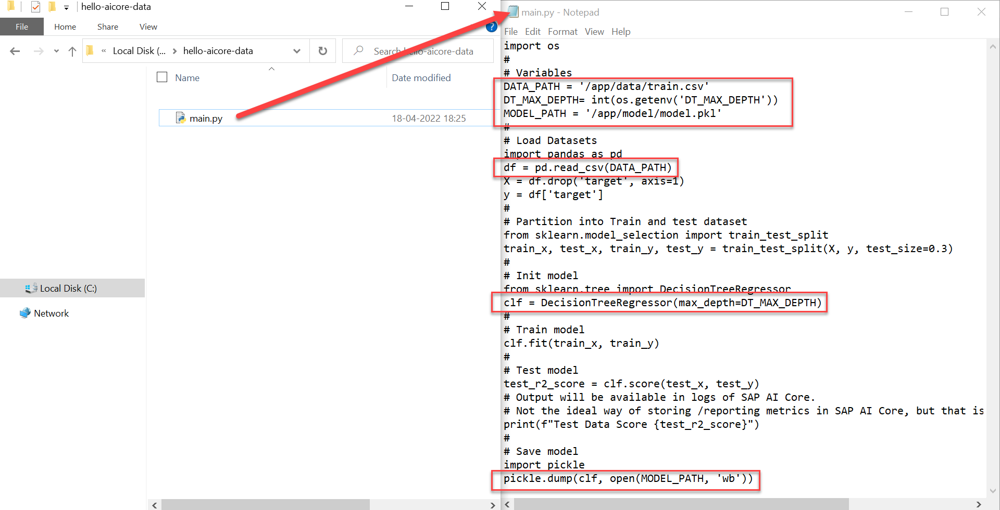
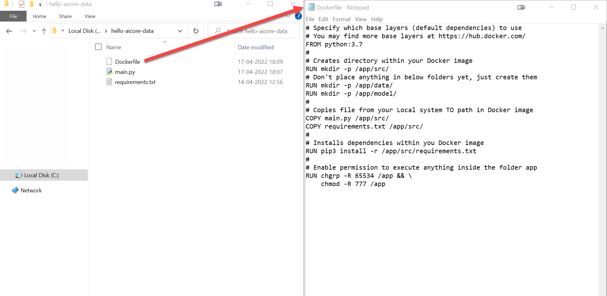
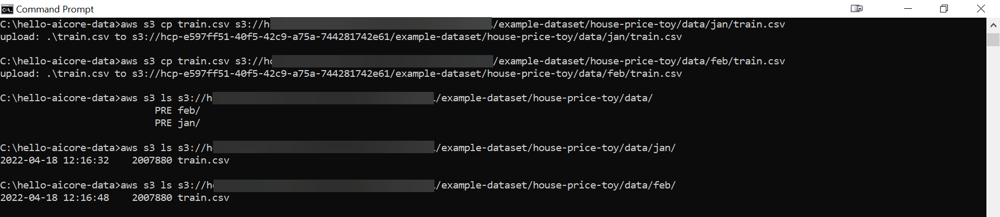
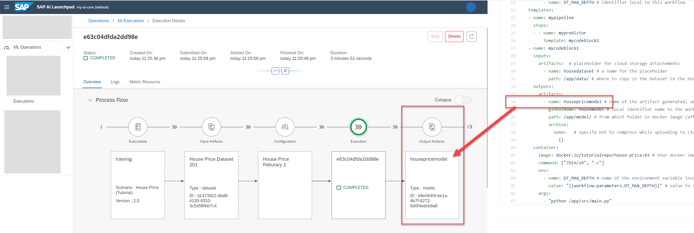

# Ingest Live Data into your House Price Predictor with SAP AI Core
<!-- description --> Build data pipelines and reuse code to train and generate models on different datasets.

## Prerequisites
- You have knowledge on connecting code to AI workflows of SAP AI Core.
- You have created your first pipeline with SAP AI Core, using [this tutorial](https://developers.sap.com/tutorials/ai-core-code.html/#).

## You will learn
- How to create placeholders for datasets in your code and associated AI workflow.
- How to register datasets stored in AWS S3 to SAP AI Core.
- How to use datasets with placeholders.
- How to generate models and store them in AWS S3 for later use.

## Intro
By the end of the tutorial you will have two models trained on two different datasets of house price data. It is possible to change the names of components and file paths mentioned in this tutorial, without breaking the functionality, unless stated explicitly.

>**IMPORTANT** Before you start this tutorial with SAP AI Launchpad, it is recommended that you set up at least one other tool, either Postman or Python (SAP AI Core SDK) because some steps of this tutorial cannot be performed with SAP AI Launchpad.

---

### Modify AI code


Create a new directory named `hello-aicore-data`. The code is different from [previous tutorial](https://developers.sap.com/tutorials/ai-core-code.html/#) as it reads the data from folder (volumes, virtual storage spaces). The content of these volumes is dynamically loaded during execution of workflows.

Create a file named `main.py`, and paste the following snippet there:

```PYTHON
import os
#
# Variables
DATA_PATH = '/app/data/train.csv'
DT_MAX_DEPTH= int(os.getenv('DT_MAX_DEPTH'))
MODEL_PATH = '/app/model/model.pkl'
#
# Load Datasets
import pandas as pd
df = pd.read_csv(DATA_PATH)
X = df.drop('target', axis=1)
y = df['target']
#
# Partition into Train and test dataset
from sklearn.model_selection import train_test_split
train_x, test_x, train_y, test_y = train_test_split(X, y, test_size=0.3)
#
# Init model
from sklearn.tree import DecisionTreeRegressor
clf = DecisionTreeRegressor(max_depth=DT_MAX_DEPTH)
#
# Train model
clf.fit(train_x, train_y)
#
# Test model
test_r2_score = clf.score(test_x, test_y)
# Output will be available in logs of SAP AI Core.
# Not the ideal way of storing /reporting metrics in SAP AI Core, but that is not the focus this tutorial
print(f"Test Data Score {test_r2_score}")
#
# Save model
import pickle
pickle.dump(clf, open(MODEL_PATH, 'wb'))
```

### Understanding your code

Your code reads the data file `train.csv` from the location `/app/data`, which will be prepared in a later step. It also reads the variable (hyper-parameter) `DT_MAX_DEPTH` from the environment variables later. When generated, your model will be stored in the location `/app/model/` . You will also learn how to transport this code from SAP AI Core to your own cloud storage.

> **Recommendation**: Although the dataset file `train.csv` is not present, it will be dynamically copied during execution to the volume mentioned in `(/app/data)`. Its recommended to pass the filename `(train.csv)` through the environment variable to your code so that if your dataset filename changes, you can dynamically set the dataset file.

<!-- border -->

Create file `requirements.txt` as shown below. Here, if you don't specify a particular version, as shown for `pandas`, then the latest version of the package will be fetched automatically.

```TEXT
sklearn==0.0
pandas
```

Create a file called `Dockerfile` with following contents.

> This filename cannot be amended, and does not have a `.filetype`

```TEXT
# Specify which base layers (default dependencies) to use
# You may find more base layers at https://hub.docker.com/
FROM python:3.7
#
# Creates directory within your Docker image
RUN mkdir -p /app/src/
# Don't place anything in below folders yet, just create them
RUN mkdir -p /app/data/
RUN mkdir -p /app/model/
#
# Copies file from your Local system TO path in Docker image
COPY main.py /app/src/
COPY requirements.txt /app/src/  
#
# Installs dependencies within you Docker image
RUN pip3 install -r /app/src/requirements.txt
#
# Enable permission to execute anything inside the folder app
RUN chgrp -R 65534 /app && \
    chmod -R 777 /app
```

<!-- border -->

> **IMPORTANT** Your `Dockerfile` creates empty folders to store your datasets and models (`/app/data` and `/app/model/` in the example above). Contents from cloud storage will be copied to and from these folders later. Any contents in these folders will be overwritten by the Docker image build.

Build and upload your Docker image to Docker repository, using the following code in the terminal.

```BASH
docker build -t docker.io/<YOUR_DOCKER_USERNAME>/house-price:03 .
docker push docker.io/<YOUR_DOCKER_USERNAME>/house-price:03
```


### Create placeholders for datasets in workflows


Create a pipeline (YAML file) named `house-price-train.yaml` in your GitHub repository. Use the existing GitHub path which is already synced by your application of SAP AI Core.

```YAML
apiVersion: argoproj.io/v1alpha1
kind: WorkflowTemplate
metadata:
  name: data-pipeline # executable id, must be unique across all your workflows (YAML files)
  annotations:
    scenarios.ai.sap.com/description: "Learning how to ingest data to workflows"
    scenarios.ai.sap.com/name: "House Price (Tutorial)" # Scenario name should be the use case
    executables.ai.sap.com/description: "Train with live data"
    executables.ai.sap.com/name: "training" # Executable name should describe the workflow in the use case
    artifacts.ai.sap.com/housedataset.kind: "dataset" # Helps in suggesting the kind of inputs that can be attached.
  labels:
    scenarios.ai.sap.com/id: "learning-datalines"
    ai.sap.com/version: "1.0"
spec:
  imagePullSecrets:
    - name: credstutorialrepo # your docker registry secret
  entrypoint: mypipeline
  templates:
  - name: mypipeline
    steps:
    - - name: mypredictor
        template: mycodeblock1
  - name: mycodeblock1
    inputs:
      artifacts:  # placeholder for cloud storage attachements
        - name: housedataset # a name for the placeholder
          path: /app/data/ # where to copy in the Dataset in the Docker image
    container:
      image: docker.io/<YOUR_DOCKER_USERNAME>/house-price:03 # Your docker image name
      command: ["/bin/sh", "-c"]
      env:
        - name: DT_MAX_DEPTH # name of the environment variable inside Docker container
          value: "3" # will make it as variable later
      args:
        - "python /app/src/main.py"
```

### Understanding changes in your workflow

This change to your workflow creates a placeholder through which you can specify a data path (volume) to the container (Docker image in execution).

<!-- border -->

1. A placeholder named `housedataset` is created.
2. You specify the **kind of artifact** that the placeholder can accept. **Artifact** is covered in details later in this tutorial.
3. You use a placeholder to specify the **path that you created in your Dockerfile**, which is where you will copy files to your Docker image.

#### Why do we need to create placeholders?
SAP AI Core only uses your workflows as an interface, so is unaware of the volume/ attachments specified in your Docker image. Your data path is specified in your Dockerfile and has a placeholder in your workflow and data is then expected by the Docker image.


### Create placeholders for hyperparameters


In your workflow, you have used the variable `DT_MAX_DEPTH` to incorporate a static value from the corresponding environment variable. Let's make this a variable in the workflow.

<!-- border -->

Replace the contents of the above AI workflow with this snippet.

```YAML[35,36]
apiVersion: argoproj.io/v1alpha1
kind: WorkflowTemplate
metadata:
  name: data-pipeline # executable id, must be unique across all your workflows (YAML files)
  annotations:
    scenarios.ai.sap.com/description: "Learning how to ingest data to workflows"
    scenarios.ai.sap.com/name: "House Price (Tutorial)" # Scenario name should be the use case
    executables.ai.sap.com/description: "Train with live data"
    executables.ai.sap.com/name: "training" # Executable name should describe the workflow in the use case
    artifacts.ai.sap.com/housedataset.kind: "dataset" # Helps in suggesting the kind of inputs that can be attached.
  labels:
    scenarios.ai.sap.com/id: "learning-datalines"
    ai.sap.com/version: "1.0"
spec:
  imagePullSecrets:
    - name: credstutorialrepo # your docker registry secret
  entrypoint: mypipeline
  arguments:
    parameters: # placeholder for string like inputs
        - name: DT_MAX_DEPTH # identifier local to this workflow
  templates:
  - name: mypipeline
    steps:
    - - name: mypredictor
        template: mycodeblock1
  - name: mycodeblock1
    # Add your resource plan here. The annotation should follow metadata > labels > ai.sap.com/resourcePlan: <plan>
    inputs:
      artifacts:  # placeholder for cloud storage attachements
        - name: housedataset # a name for the placeholder
          path: /app/data/ # where to copy in the Dataset in the Docker image
    container:
      image: docker.io/<YOUR_DOCKER_USERNAME>/house-price:03 # Your docker image name
      command: ["/bin/sh", "-c"]
      env:
        - name: DT_MAX_DEPTH # name of the environment variable inside Docker container
          value: "{{workflow.parameters.DT_MAX_DEPTH}}" # value to set from local (to workflow) variable DT_MAX_DEPTH
      args:
        - "python /app/src/main.py"
```

The following shows the new important lines in the workflows.

<!-- border -->

####Understanding these changes

1. A placeholder named `DT_MAX_DEPTH` is created locally in the workflow. It accepts number content of input type: `string`. The input is then type cast to an integer elsewhere in your code, so it must be a string containing integers. For example: ```"4"``` is acceptable because it is a string containing content that can can be type cast to and integer.
2. You create an input `env` (Environment) variable to your Docker image, named `DT_MAX_DEPTH`. The value of this variable is fed in from `workflow.parameters.DT_MAX_DEPTH`,the local name from previous point.

Commit the changes in the GitHub.


### Set resource plan


Add the following snippet in your workflow to specify resource plan. The resource plan helps specify computing resource required to run your Docker image. The computing resources includes GPU, RAM and Processor. If not mentioned the resource plan defaults to `starter` which is the entry level [resource plan](https://help.sap.com/docs/AI_CORE/2d6c5984063c40a59eda62f4a9135bee/57f4f19d9b3b46208ee1d72017d0eab6.html?locale=en-US).


```BASH[6-8]
spec:
    ...
    templates:
    ...
    - name: mycodeblock1
      metadata:
        labels:
            ai.sap.com/resourcePlan: starter
    ...
```

**INFORMATION**: You can always verify computing resource allocated using the following command `echo $(lscpu)` within your Docker image. The command is the the shell script command of Linux to print system configuration.


### Observe your scenario and placeholder


[OPTION BEGIN [SAP AI Launchpad]]

You will observe a scenario named **House Price (Tutorial)** In the **ML Operations** tab. Click on the scenario row in the table.

Click on the **Executables** tab. You will find your executable `training`.

<!-- border -->

> **INFORMATION** If multiple executables/workflows (YAML files) have the same annotation values for their scenarios, they the are grouped under same scenario in SAP AI Core.

Click on the executable `training` to view it in more detail. The placeholders that you created in your AI workflow will appear here.

<!-- border -->

[OPTION END]

[OPTION BEGIN [Postman]]

List the executables for the scenario ID `learning-datalines`. This is the scenario ID that you specified in the workflow.

**RESPONSE**

```
{
    "count": 1,
    "resources": [
        {
            "createdAt": "2022-04-17T13:09:00+00:00",
            "deployable": false,
            "description": "Train with live data",
            "id": "data-pipeline",
            "inputArtifacts": [
                {
                    "name": "housedataset"
                }
            ],
            "modifiedAt": "2022-04-17T13:09:00+00:00",
            "name": "training",
            "outputArtifacts": [],
            "parameters": [
                {
                    "name": "DT_MAX_DEPTH",
                    "type": "string"
                }
            ],
            "scenarioId": "learning-datalines",
            "versionId": "1.0"
        }
    ]
}
```

[OPTION END]

[OPTION BEGIN [SAP AI Core SDK]]

List the executables for the scenario ID `learning-datalines`. This is the scenario ID that you specified in the workflow.

```PYTHON
response = ai_core_client.executable.query(
    scenario_id = "learning-datalines", resource_group='default'
)

for executable in response.resources:
    for key, value in executable.__dict__.items():
        if "artifact" in key or "parameter" in key:
            print(f"{key} :")
            for placeholder in value:
                print(f" {placeholder.__dict__}")
        else:
            print(f"{key} : {value}")
```

**RESPONSE**

```TEXT
id : data-pipeline
scenario_id : learning-datalines
version_id : 1.0
name : training
description : Train with live data
deployable : False
parameters :
 {'name': 'DT_MAX_DEPTH', 'type': <Type.STRING: 'string'>}
input_artifacts :
 {'name': 'housedataset'}
output_artifacts :
 {'name': 'housemodel'}
labels : None
...
```

[OPTION END]

Observe the value of the `name` variable in both `inputArtifacts` and `parameters`. These represent the placeholder names which were specified earlier in the process. You are required use these names later when creating your **configuration**.


### Create cloud storage for datasets and models
## Why use cloud storage?
SAP AI Core only provides your ephemeral (short-lived) storage, while training or inferencing a model.  Amazon Web Services (AWS) S3 Object store is the cloud storage used by SAP AI Core for storing datasets and models. Here, they can be stored over a longer time period, and can be transferred to and from SAP AI Core during training or online inferencing.

You need to create AWS S3 object store, using one of the following links:

- If you are a BTP user, create your storage through the [SAP Business Technology Platform](https://help.sap.com/docs/ObjectStore/2ee77ef7ea4648f9ab2c54ee3aef0a29/4236b942f67349d5a583773162d99660.html). While BTP offers alternative storage solutions, this tutorial uses AWS S3.
- If you are not a BTP user, go directly through [AWS site](https://aws.amazon.com/free/?all-free-tier.sort-by=item.additionalFields.SortRank&all-free-tier.sort-order=asc&awsf.Free%20Tier%20Categories=categories%23storage&trk=e31669e1-2406-4016-9dc4-feb8ed89019b&sc_channel=ps&sc_campaign=acquisition&sc_medium=ACQ-P|PS-BI|Brand|Desktop|SU|Storage|S3|IN|EN|Text&s_kwcid=AL!4422!10!71880729042342!71881173212098&ef_id=77e85e62d00a1077e8c33c3e3fbff9e2:G:s&s_kwcid=AL!4422!10!71880729042342!71881173212098&awsf.Free%20Tier%20Types=*all)


### Connect local system to AWS S3


Download and Install the [AWS Command Line Interface (CLI)](https://docs.aws.amazon.com/cli/latest/userguide/getting-started-install.html).

To configure settings for your CWS CLI, open your terminal and run:

```BASH
aws configure
```

<!-- border -->

Enter your AWS credentials. Note that the appearance of the screen will not change as you type. You can leave the `Default output format` entry as blank. Press **enter** to submit your credentials.

Your credentials are stored in your system and used by the AWS CLI to interact with AWS. Fore more information, see [Configuring the AWS CLI](https://docs.aws.amazon.com/cli/latest/userguide/cli-configure-quickstart.html)


### Upload datasets to AWS S3


 Download the `train.csv` [dataset](https://raw.githubusercontent.com/sap-tutorials/Tutorials/master/tutorials/ai-core-data/train.csv). You need to right click, and save the page as `train.csv`.

<!-- border -->

<!-- border -->

> **INFORMATION** The data used is from `Scikit Learn`. The source of the data is [here](https://scikit-learn.org/stable/modules/generated/sklearn.datasets.fetch_california_housing.html).

To upload the datasets to your AWS S3 Storage, paste and edit the following command in the terminal:

```BASH
aws s3 cp train.csv s3://<YOUR_BUCKET_NAME>/example-dataset/house-price-toy/data/jan/train.csv
```

<!-- border -->

This command uploaded the data to a folder called `jan`. Upload it one more time in another folder called `feb`, by changing your command as shown:

```BASH
aws s3 cp train.csv s3://<YOUR_BUCKET_NAME>/example-dataset/house-price-toy/data/feb/train.csv
```

You now know how to upload and use multiple datasets with SAP AI Core.

List your files in your AWS S3 bucket by editing the following command:

```BASH
aws s3 ls s3//<YOUR_BUCKET_NAME/example-dataset/house-price-toy/data/
```
> **CAUTION**: Ensure your file names and format match what you have specified in your code. For example, if you specify ´train.csv´ in your code, the system expects a file called train, which is of type: comma separated value.

<!-- border -->


### Store an object store secret in SAP AI Core


An object store secret is required to store credentials to access your AWS S3 buckets, and limit access to a particular directory.

[OPTION BEGIN [SAP AI Launchpad]]

Create an object store secret by clicking **Object Store Secrets** > **Add** in your workspace, and completing the dialog box.

<!-- border -->

[OPTION END]

[OPTION BEGIN [Postman]]

Create an object store secret by clicking **POST Create a secret** and using the header and body below.

<!-- border -->

**HEADER**

> **CAUTION** IF the following Header is not specified, this secret is restricted to the `default` resource group.

| Key | Value |
| --- | --- |
| `AI-Resource-Group` | `default` |

**BODY**

```JSON
{
    "name": "mys3",
    "data": {
        "AWS_ACCESS_KEY_ID": "<YOUR_AWS_ID>",
        "AWS_SECRET_ACCESS_KEY": "<YOUR_AWS_KEY>"
    },
    "type": "S3",
    "bucket": "<YOUR_BUCKET_NAME>",
    "endpoint": "s3-eu-central-1.amazonaws.com",
    "region": "eu-central-1",
    "pathPrefix": "example-dataset/house-price-toy"
}
```

**RESPONSE**
```
{
    "message": "secret has been created"
}
```

[OPTION END]


[OPTION BEGIN [SAP AI Core SDK]]

Edit and execute the following snippet to create object store secret in SAP AI Core.

```PYTHON
# Create object Store secret
response = ai_core_client.object_store_secrets.create(
    name = "mys3", # identifier for this secret within your SAP AI Core
    path_prefix = "example-dataset/house-price-toy", # path that we want to limit restrict this secret access to
    type = "S3",
    data = { # Dictionary of credentials of AWS
        "AWS_ACCESS_KEY_ID": "<YOUR_AWS_ID>",
        "AWS_SECRET_ACCESS_KEY": "<YOUR_AWS_KEY>"
    },
    bucket = "<YOUR_BUCKET_NAME>", # Edit this
    region = "eu-central-1", # Edit this
    endpoint = "s3-eu-central-1.amazonaws.com", # Edit this
    resource_group = "default" # object store secret are restricted within this resource group. you may change this when creating secret for another resource group.
)
print(response.__dict__)
```

[OPTION END]

- The Resource Group must be `default`
- The `Name` field is your choice of identifier for your secret within SAP AI Core. 
- Entries to the other fields are found in your AWS account.

> ### Why not put a complete path to train.csv as `pathPrefix`?
> You might have noticed that previously you uploaded data to `example-dataset/house-price-toy/data/jan/train.csv` but here in object store secret the `pathPrefix` is you set the value `example-dataset/house-price-toy`. This is because the use of `pathPrefix` is to restrict access to particular directory of your cloud storage.
>
>Why define a complete path instead of using the `pathPrefix`? Using a root path only would mean that all files and subdirectories in the path would be copied from your AWS S3 to SAP AI Core. This might not be useful where you have multiple datasets only one of them is in use. Extending the `pathPrefix` to a complete path allows the user to specify specific artifacts.

With your object store secret created, you can now reference any sub-folders to `pathPrefix` containing artifacts such as datasets or models.

> **INFORMATION** You may create any number of object store secrets each with unique `name`. They can point to the same or different object stores.


### Create artifact to specify folder of dataset


[OPTION BEGIN [SAP AI Launchpad]]

> **IMPORTANT** Currently, SAP AI Launchpad offers no functionality to perform this step. Please perform this step using any one of the alternative options from the option tab.

[OPTION END]

[OPTION BEGIN [Postman]]

Create an artifact for the `train.csv` file that we uploaded to the `jan` folder, by clicking **POST Register artifact** and using the body underneath.

<!-- border -->

**BODY**

```JSON
{
    "kind": "dataset",
    "name": "House Price Dataset 101",
    "scenarioId": "learning-datalines",
    "url": "ai://mys3/data/jan",
    "labels": [
        {
            "key": "ext.ai.sap.com/month",
            "value": "Jan"
        }
    ],
    "description": "Prices in the month of Jan"
}
```

The `id` returned in the response is the unique identifier of your artifact - not its name.

Create another artifact in the same way, for the `feb` folder. Refer to the snippet below for guidance on the changes required.

```JSON
{
    "kind": "dataset",
    "name": "House Price Dataset 201",
    "scenarioId": "learning-datalines",
    "url": "ai://mys3/data/feb",
    "labels": [
        {
            "key": "ext.ai.sap.com/month",
            "value": "Feb"
        }
    ],
    "description": "Prices in the month of Feb"
}
```

[OPTION END]

[OPTION BEGIN [SAP AI Core SDK]]

Execute the following snippet to create artifact for first `train.csv` that we uploaded to `jan` folder.

```PYTHON
# Create Artifact
from ai_api_client_sdk.models.artifact import Artifact
from ai_api_client_sdk.models.label import Label

response = ai_core_client.artifact.create(
    name = "House Price Dataset 101", # Custom Non-unqiue identifier
    kind = Artifact.Kind.DATASET,
    url = "ai://mys3/data/jan", #
    scenario_id = "learning-datalines",
    description = "Prices in the month of Jan",
    labels = [
        Label(key="ext.ai.sap.com/month", value="Jan"), # any descriptive key-value pair, helps in filtering, key must have the prefix ext.ai.sap.com/
    ],
    resource_group = "default" # required to restrict object store secret usage within a resource group
)

print(response.__dict__)
```

Create another artifact in the same way, for the `feb` folder. Refer to the snippet below for guidance on the changes required.

```PYTHON
# Create Artifact
response = ai_core_client.artifact.create(
    name = "House Price Dataset 201",
    kind = Artifact.Kind.DATASET,
    url = "ai://mys3/data/feb",
    scenario_id = "learning-datalines",
    description = "Prices in the month of Feb",
    labels = [
        Label(key="ext.ai.sap.com/month", value="Feb"),
    ],
    resource_group = "default"
)

print(response.__dict__)
```

[OPTION END]

You have learnt to add data artifacts, allowing you to ingest more data over time.

### Important points to notice

1. Notice the `url` used in above snippet is `ai://mys3/data/jan`, here `mys3` is the object store secret name that you created previously. Hence the path translates as `ai://<PATH_PREFIX_OF_mys3>/data/jan` which is the directory that your dataset file is located in.
2. The `url` points to a directory, not a file, which gives you advantage that you can store multiple files in an AWS S3 directory and register the directory containing all files as a single artifact.
3. All the files present in the path referenced by artifact will be copied from your S3 storage to your SAP AI Core instance during training or inferencing. This includes subfolders, apart from where `Kind = MODEL`.


### Locate artifacts


[OPTION BEGIN [SAP AI Launchpad]]

Navigate to your data set by clicking **Workspaces** > **default** > **ML Operations** > **Datasets**.


<!-- border -->

[OPTION END]


[OPTION BEGIN [Postman]]

Get a list of your artifacts by clicking **GET Get list of artifacts**.

<!-- border -->

[OPTION END]

[OPTION BEGIN [SAP AI Core SDK]]

Get a list of your artifacts using the following code snippet:

```PYTHON
### List Artifacts
response = ai_core_client.artifact.query(resource_group="default")
#
for artifact in response.resources:
    for key, value in artifact.__dict__.items():
        if "label" in key:
            if value is None:
                continue
            print(f"{key} :")
            for label in value:
                print(f" {label.__dict__}")
        else:
            print(f"{key} : {value}")
    print('-'*3)
```

**RESPONSE**

```TEXT
...
id : f0a93424-3581-44d5-8c6b-10821fa11a24
name : House Price Dataset 101
url : ai://mys3/data/jan
kind : Kind.DATASET
description : Prices in the month of Jan
scenario_id : learning-datalines
execution_id : None
configuration_id : None
labels :
 {'key': 'ext.ai.sap.com/month', 'value': 'Jan'}
created_at : 2022-04-23 10:01:20
modified_at : 2022-04-23 10:01:20
---
id : d1473922-4bd8-4130-9310-3c5d58fbb7c4
name : House Price Dataset 201
url : ai://mys3/data/feb
kind : Kind.DATASET
description : Prices in the month of Feb
scenario_id : learning-datalines
execution_id : None
configuration_id : None
labels :
 {'key': 'ext.ai.sap.com/month', 'value': 'Feb'}
created_at : 2022-04-18 12:31:34
modified_at : 2022-04-18 12:31:34
...
```

[OPTION END]

> **INFORMATION** Artifacts appear in the `default` resource group and the **Datasets** menu, because you had registered artifacts with `resource_group = default` and `Kind = Dataset` in Step 9.

Copy the artifact ID of the January dataset. You will use this value in the placeholders of your workflows to create your execution. The **ID** of artifacts allows SAP AI Core to ingest data into workflows.


### Use artifacts with workflows using a configuration


[OPTION BEGIN [SAP AI Launchpad]]

Click **ML Operations** > **Configuration** > **Create**. Enter the following details and click **Next**.

<!-- border -->

The field for `DT_MAX_DEPTH` allows you to use the configuration to pass values to placeholders of hyper-parameters that you prepared earlier in your workflows. In this case, type `3` and click **Next**.

<!-- border -->

Locate your artifact (using the unique **ID**) in the **Available Artifacts** pane. Click the dropdown menu and the checkbox of `housedataset`. This is named of the placeholder for dataset in your workflow. As a result, the placeholder will now take the value of the artifact.

<!-- border -->

Click **Review** and click **Create**.

You will redirected to the details page of the newly created configuration.

[OPTION END]

[OPTION BEGIN [Postman]]

Use the artifact ID of the `jan` dataset and the placeholder names to create a configuration, based on the code snippet. The key value pair for `DT_MAX_DEPTH` allows you to use the configuration to pass values to placeholders of the hyper-parameters that your prepared earlier in your workflows. In this case, type `"3"`.

**BODY**

```JSON
{
    "name": "House Price January 1",
    "scenarioId": "learning-datalines",
    "executableId": "data-pipeline",
    "inputArtifactBindings": [
        {
            "key": "housedataset",
            "artifactId": "<YOUR_JAN_ARTIFACT_ID>"
        }
    ],
    "parameterBindings": [
        {
            "key": "DT_MAX_DEPTH",
            "value": "3"
        }
    ]
}
```
### Important points

1. You bind the artifact in the section `inputArtifactBindings`, where `key` denotes the placeholder name from your workflow and `artifactId` is the unique ID of the artifact that you registered. In later steps, you will bind the `feb` dataset's artifact ID, to learn how the same workflow can be used with multiple datasets.

2. You provide the value to hyper-parameters using the section `parameterBindings`, where the `key` denotes the placeholder and the value is the string. Your code converts this value to an integer type before utilizing it.

[OPTION END]


[OPTION BEGIN [SAP AI Core SDK]]

Paste and edit the code snippet. The key value pair for `DT_MAX_DEPTH` allows your to use the configuration to pass values to placeholders of the hyper-parameters that your prepared earlier in your workflows. In this case, type `"3"`. You should locate your `jan` dataset artifact ID by listing all artifacts and using the relevant ID.

```PYTHON
from ai_api_client_sdk.models.parameter_binding import ParameterBinding
from ai_api_client_sdk.models.input_artifact_binding import InputArtifactBinding

response = ai_core_client.configuration.create(
    name = "House Price January 1",
    scenario_id = "learning-datalines",
    executable_id = "data-pipeline",
    input_artifact_bindings = [
        InputArtifactBinding(key = "housedataset", artifact_id = "<YOUR_JAN_ARTIFACT_ID>") # placeholder as name
    ],
    parameter_bindings = [
        ParameterBinding(key = "DT_MAX_DEPTH", value = "3") # placeholder name as key
    ],
    resource_group = "default"
)
print(response.__dict__)
```

<!-- border -->

### Important points

1. You bind the artifact in the section `inputArtifactBindings`, where `key` denotes the placeholder name from your workflow and `artifactId` is the unique ID of the artifact that you registered. In later steps, you will bind the `feb` dataset's artifact ID, to learn how the same workflow can be used with multiple datasets.

2. You provide the value to hyper-parameters using the section `parameterBindings`, where the `key` denotes the placeholder and the value is a string. Your code converts this value to an integer type before utilizing it.

[OPTION END]

This is how you bind values to placeholders to your workflows.


### Run you workflow using execution


[OPTION BEGIN [SAP AI Launchpad]]

Click **Create Execution** in the configuration details page. This will start a new execution with the values specified in the configuration. On the **Logs** tab of your execution, you will see that the data from AWS S3 has been incorporated into SAP AI Core.

<!-- border -->

[OPTION END]

[OPTION BEGIN [Postman]]

Use the configuration ID from previous step to create and launch a new execution.

Query the execution logs. The logs will show that the data from AWS S3 has been incorporated into SAP AI Core.

<!-- border -->

[OPTION END]

[OPTION BEGIN [SAP AI Core SDK]]

Use the configuration ID from the previous step to create and launch a new execution.

```PYTHON
response = ai_core_client.execution.create(
    configuration_id = '<YOUR_CONFIGURATION_ID>',
    resource_group = 'default'
)

response.__dict__
```

Query the status of the execution. The logs will show that the data from AWS S3 has been incorporated into SAP AI Core.

```PYTHON
# show execution logs
response = ai_core_client.execution.query_logs(
    execution_id = '<YOUR_EXECUTION_ID>',
    resource_group = 'default',
    start = datetime(1990, 1, 1) # Optional, else shows logs of last 1 hour
)

for log in response.data.result:
    print(log.__dict__)
```

[OPTION END]

Until now you have ingested data and specified variables in SAP AI Core. To save your model to use later, you need to extract the model to cloud storage. We will complete this in the next step.


### Set model pipeline in workflow


In your GitHub repository, edit the workflow `house-price-train.yaml` and replace the contents with the below snippet. Make sure to add your Docker credentials and artifact details to the relevant fields.

```YAML
apiVersion: argoproj.io/v1alpha1
kind: WorkflowTemplate
metadata:
  name: data-pipeline # executable id, must be unique across all your workflows (YAML files)
  annotations:
    scenarios.ai.sap.com/description: "Learning how to ingest data to workflows"
    scenarios.ai.sap.com/name: "House Price (Tutorial)" # Scenario name should be the use case
    executables.ai.sap.com/description: "Train with live data"
    executables.ai.sap.com/name: "training" # Executable name should describe the workflow in the use case
    artifacts.ai.sap.com/housedataset.kind: "dataset" # Helps in suggesting the kind of artifact that can be attached.
    artifacts.ai.sap.com/housemodel.kind: "model" # Helps in suggesting the kind of artifact that can be generated.
  labels:
    scenarios.ai.sap.com/id: "learning-datalines"
    ai.sap.com/version: "2.0"
spec:
  imagePullSecrets:
    - name: credstutorialrepo # your docker registry secret
  entrypoint: mypipeline
  arguments:
    parameters: # placeholder for string like inputs
        - name: DT_MAX_DEPTH # identifier local to this workflow
  templates:
  - name: mypipeline
    steps:
    - - name: mypredictor
        template: mycodeblock1
  - name: mycodeblock1
    inputs:
      artifacts:  # placeholder for cloud storage attachements
        - name: housedataset # a name for the placeholder
          path: /app/data/ # where to copy in the Dataset in the Docker image
    outputs:
      artifacts:
        - name: housepricemodel # local identifier name to the workflow
          globalName: housemodel # name of the artifact generated, and folder name when placed in S3, complete directory will be `../<executaion_id>/housemodel`. Also used above in annotation
          path: /app/model/ # from which folder in docker image (after running workflow step) copy contents to cloud storage
          archive:
            none:   # specify not to compress while uploading to cloud
              {}
    container:
      image: docker.io/<YOUR_DOCKER_USERNAME>/house-price:03 # Your docker image name
      command: ["/bin/sh", "-c"]
      env:
        - name: DT_MAX_DEPTH # name of the environment variable inside Docker container
          value: "{{workflow.parameters.DT_MAX_DEPTH}}" # value to set from local (to workflow) variable DT_MAX_DEPTH
      args:
        - "python /app/src/main.py"
```

### Description of changes

<!-- border -->

You added a new `outputs` section, where you specified files and their directories, which are created during the execution, and will be uploaded to AWS S3 and automatically registered as artifacts in SAP AI Core. You also added a line in the `annotations` section, which specified the `kind` of artifact that would be generated. In this case, a model.

All of the contents within your `/app/model/` directory, as defined in your Docker image, will be uploaded to AWS S3. This implies you may generate multiple files of any format after training, for example `class_labels.npy`, `model.h5`, `classifier.pkl` or `tokens.json`.


### Create required object store secret `default` for model


It is compulsory to create a object store secret named `default` within your resource group, for your executable to **generate models and store them in AWS S3**. After execution the model will be saved to `PATH_PREFIX_of_default/<execution_id>/housepricemodel` in your AWS S3. The `housepricemodel` is mentioned in the workflow in the previous step.

[OPTION BEGIN [SAP AI Launchpad]]

Create an object store secret by clicking **Object Store Secrets** > **Add** in your workspace, and completing the dialog box. Enter `default` for the secret name.

<!-- border -->

[OPTION END]

[OPTION BEGIN [Postman]]


> **TIP** You can create multiple object store secrets with different `name` keys within the same resource group. You can also patch to modify the values of an existing object store secret.

**HEADER**

> **CAUTION** IF the following Header is not specified, this secret is restricted to the `default` resource group.

| Key | Value |
| --- | --- |
| `AI-Resource-Group` | `default` |

Paste and edit the following snippet:

```JSON[2]
{
    "name": "default",
    "data": {
        "AWS_ACCESS_KEY_ID": "<YOUR_AWS_ID>",
        "AWS_SECRET_ACCESS_KEY": "<YOUR_AWS_KEY>"
    },
    "type": "S3",
    "bucket": "<YOUR_BUCKET_NAME>",
    "endpoint": "s3-eu-central-1.amazonaws.com",
    "region": "eu-central-1",
    "pathPrefix": "example-dataset/house-price-toy/model"
}
```
The value of the `name` key must be `default`. This should not be confused with the resource group name, which is also `default`. These are unrelated.

[OPTION END]

[OPTION BEGIN [SAP AI Core SDK]]

> **TIP** You can create multiple object store secrets with different `name` keys within the same resource group. You can also patch to modify values of an existing object store secret.

Paste and edit the following snippet:

```PYTHON
# Create object Store secret for placing models to S3
response = ai_core_client.object_store_secrets.create(
    name = "default", # name must be `default`
    path_prefix = "example-dataset/house-price-toy/model", # ensure path prefix is targeted to your models subdirectory
    type = "S3",
    data = { # Dictionary of credentials of AWS
        "AWS_ACCESS_KEY_ID": "<YOUR_AWS_ID>",
        "AWS_SECRET_ACCESS_KEY": "<YOUR_AWS_KEY>"
    },
    bucket = "<YOUR_BUCKET_NAME>", # bucket name,
    region = "eu-central-1", # Edit this
    endpoint = "s3-eu-central-1.amazonaws.com", # Edit this
    resource_group = "default"
)
print(response.__dict__)
```

The value of the `name` key must be `default`. This should not be confused with the resource group name, which is also `default`. These are unrelated.

[OPTION END]


### Create another configuration with new data


This time, train the model with the `feb` dataset and with a different hyper-parameter value.

[OPTION BEGIN [SAP AI Launchpad]]

On your SAP AI Launchpad, click **ML Operations** > **Configuration** > **Create**.

Enter a configuration name and select your other details. Select your updated the version of workflow here.

<!-- border -->

Type `5` for the `DT_MAX_DEPTH` field and click **Next**.

Attach the `feb` artifact that you have registered.

<!-- border -->

Click **Review** > **Create**.

[OPTION END]

[OPTION BEGIN [Postman]]

Paste and edit the snippet below. You should locate your `feb` dataset artifact ID by listing all artifacts and then using the relevant ID.

**BODY**

```JSON
{
    "name": "House Price Feburary 1",
    "scenarioId": "learning-datalines",
    "executableId": "data-pipeline",
    "inputArtifactBindings": [
        {
            "key": "housedataset",
            "artifactId": "<YOUR_FEB_ARTIFACT_ID>"
        }
    ],
    "parameterBindings": [
        {
            "key": "DT_MAX_DEPTH",
            "value": "5"
        }
    ]
}
```

[OPTION END]


[OPTION BEGIN [SAP AI Core SDK]]

Paste and edit the snippet below. You should locate your `feb` dataset artifact ID by listing all artifacts and then using the relevant ID.

```PYTHON
from ai_api_client_sdk.models.parameter_binding import ParameterBinding
from ai_api_client_sdk.models.input_artifact_binding import InputArtifactBinding

response = ai_core_client.configuration.create(
    name = "House Price Feburary 1",
    scenario_id = "learning-datalines",
    executable_id = "data-pipeline",
    input_artifact_bindings = [
        InputArtifactBinding(key = "housedataset", artifact_id = "<YOUR_FEB_ARTIFACT_ID>") # placeholder as name
    ],
    parameter_bindings = [
        ParameterBinding(key = "DT_MAX_DEPTH", value = "5") # placeholder name as key
    ],
    resource_group = "default"
)
print(response.__dict__)
```

[OPTION END]


### Create another execution


Use your new configuration to create an execution.

[OPTION BEGIN [SAP AI Launchpad]]

Click **Create Execution** in the configuration details page.

<!-- border -->

To see the details of your new model, click the model card, and then on **execution** in the **Process Flow**. The information is also available through **ML Operations** > **Models**.

<!-- border -->

[OPTION END]

[OPTION BEGIN [Postman]]

List the execution status.

<!-- border -->

[OPTION END]

[OPTION BEGIN [SAP AI Core SDK]]

To query the execution status, paste and edit the code snippet below.

```PYTHON
# execute this multiple times in interval of 30 seconds
response = ai_core_client.execution.get(
    execution_id = '<YOUR_EXECUTION_ID>',
    resource_group = 'default'
)

for key, value in response.__dict__.items():
    if "output" in key:
        print(f"{key} : ")
        for artifact in value:
            print(f" {artifact.__dict__}")
    else:
        print(f"{key} : {value}")
```

<!-- border -->

[OPTION END]

When your execution shows status **COMPLETED**, you will see that a new model artifact called `housepricemodel` has been generated. Note that the `outputArtifacts` are automatically registered and copied to AWS S3. Note that your artifact is of the kind **model** and that its **ID** is its only unique identifier - not its name.

Generating and associating metrics (model quality) will covered in a separate tutorial.


### Locate your model in AWS S3


List your new files by pasting and editing the following snippet in your terminal.

```BASH
aws s3 ls s3://<YOUR_BUCKET_NAME>/example-dataset/house-price-toy/model/<YOUR_EXECUTION_ID>/housepricemodel
```

You are listing the files in the path `example-dataset/house-price-toy/model/` because this is the value you set earlier for the `pathPrefix` variable, for your object store secret named `default`.

<!-- border -->


