# Make Predictions for House Prices with SAP AI Core
<!-- description --> Deploy AI models and set up serving pipelines to scale prediction server.

## Prerequisites
 - You have connected code to the AI workflows of SAP AI Core using [this tutorial](ai-core-code).
 - You have trained a model using SAP AI Core, such as the house price predictor model in [this tutorial](ai-core-data), or your own model trained in your local system. If you trained your own local model, follow [this tutorial](ai-core-tensorflow-byod) to use it with SAP AI Core.
 - You know how to locate artifacts. This is explained in [this tutorial](ai-core-data).

## You will learn
  - How to create deployment server an for AI model
  - How to set up scaling options for your deployment server
  - How to swap a deployed AI model with a different new model

## Intro
You will create a deployment server for AI models to use in online inferencing. It is possible to change the names of components mentioned in this tutorial, without breaking the functionality, unless stated explicitly.

The deployment server demonstrated in this tutorial can only be used in the backend of your AI project. For security reasons, in your real set up you will not be able to directly make prediction calls from your front end application to the deployment server. Doing so will lead to an inevitable Cross-origin Resource Sharing (CORS) error. As a temporary resolution, please deploy another application between your front end application and this deployment server. This middle application should use the SAP AI Core SDK (python package) to make calls to the deployment server.


Please find downloadable sample notebooks for the tutorials : . Note that these tutorials are for demonstration purposes only and should not be used in production environments. To execute them properly, you'll need to set up your own S3 bucket or provision services from BTP, including an AI Core with a standard plan for narrow AI and an extended plan for GenAI HUB. Ensure you input the service keys of these services into the relevant cells of the notebook.
[Link to notebook](https://github.com/SAP-samples/ai-core-samples/blob/main/02_ai_core/tutorials/01_create_your_first_machine_learning_project_using_sap_ai_core/01_05_make_predictions_for_house_prices_with_sap_ai_core/make-prediction.ipynb)

---

### Write code for serving engine


Create a new directory in your local system named `hello-aicore-server`.

Create a file named `main.py`, and paste the following snippet there:

```PYTHON[2]
import os
import pickle
import numpy as np
from flask import Flask
from flask import request as call_request

# Creates Flask serving engine
app = Flask(__name__)

model = None

@app.before_first_request
def init():
    """
    Load model else crash, deployment will not start
    """
    global model
    model = pickle.load(open ('/mnt/models/model.pkl','rb')) # All the model files will be read from /mnt/models
    return None

@app.route("/v2/greet", methods=["GET"])
def status():
    global model
    if model is None:
        return "Flask Code: Model was not loaded."
    else:
        return "Model is loaded."

# You may customize the endpoint, but must have the prefix `/v<number>`
@app.route("/v2/predict", methods=["POST"])
def predict():
    """
    Perform an inference on the model created in initialize

    Returns:
        String value price.
    """
    global model
    #
    query = dict(call_request.json)
    input_features = [ # list of values from request call
        query['MedInc'],
        query['HouseAge'],
        query['AveRooms'],
        query['AveBedrms'],
        query['Population'],
        query['AveOccup'],
        query['Latitude'],
        query['Longitude'],
    ]
    # Prediction
    prediction = model.predict(
        np.array([list(map(float, input_features)),]) # (trailing comma) <,> to make batch with 1 observation
    )
    output = str(prediction)
    # Response
    return output

if __name__ == "__main__":
    print("Serving Initializing")
    init()
    print(f'{os.environ["greetingmessage"]}')
    print("Serving Started")
    app.run(host="0.0.0.0", debug=True, port=9001)
```

#### Understanding your code

Where should you load your model from?

- Your code reads files from folder `/mnt/models`. This folder path is hard-coded in SAP AI Core, and cannot be modified.
- Later, you will dynamically place your model file in the path `/mnt/models`.
- You may place multiple files inside `/mnt/models` as part of your model. These files may have multiple formats, such as `.py` or `.pickle`, however you should not-create sub-directories within it.

Which serving engine to use?

- Your code uses Flask to create a server, however you may use another python library if you would like to.
- Your format for prediction REST calls will depend on the implementation of this deployment server.
- You implement the endpoint `/v2/predict` to make predictions. You may modify the endpoint name and format, but each endpoint must have the prefix `/v<NUMBER>`. For example if you want to create endpoint to greet your server, then the endpoint implementation should be `/v2/greet` or `/v1/greet`

Create file `requirements.txt` as shown below.

```TEXT
scikit-learn==0.24.2
joblib==1.0.1
Flask==2.0.1
gunicorn==20.1.0
```


### Bundle and publish code to cloud


Create a file called `Dockerfile` in the folder `hello-aicore-server` with the following contents. The `Dockerfile` contains instructions to package your code files as a single Docker image.

> This filename cannot be amended, and does not have a `.filetype`.

```TEXT
# Base layer (default dependencies) to use
# You should find more base layers at https://hub.docker.com
FROM python:3.7.11
ENV LANG C.UTF-8

# Custom location to place code files
RUN mkdir -p /app/src
COPY main.py /app/src/
COPY requirements.txt /app/src/requirements.txt
RUN pip3 install -r /app/src/requirements.txt

# Required to execute script
RUN chgrp -R nogroup /app && \
    chmod -R 770 /app
```


Open your terminal and navigate to your `hello-aicore-server` folder, using the following code.

```BASH
cd hello-aicore-server
```

Build your Docker image by adapting the following code.

```BASH
docker build -t docker.io/<YOUR_DOCKER_USERNAME>/house-server:01 .
```

> The period `.` at the end of your command instructs Docker to find the `Dockerfile` in the current directory target by your terminal.

Upload your Docker image to your Docker repository, by adapting the following code.

```BASH
docker push docker.io/<YOUR_DOCKER_USERNAME>/house-server:01
```


### Create a serving executable


Create an executable (YAML file) named `house-price-server.yaml` in your GitHub repository. You may use the existing GitHub path which is already tracked synced to your application of SAP AI Core.

> **IMPORTANT** The structure(schemas) of workflows and executables are different for both training and serving in SAP AI Core. For available options for the schemas you must refer to the [official help guide of SAP AI Core](https://help.sap.com/docs/AI_CORE/2d6c5984063c40a59eda62f4a9135bee/8a1f91a18cf0473e8689789f1636675a.html?locale=en-US)

```YAML
apiVersion: ai.sap.com/v1alpha1
kind: ServingTemplate
metadata:
  name: server-pipeline # executable ID, must be unique across your SAP AI Core instance, for example use `server-pipeline-yourname-1234`
  annotations:
    scenarios.ai.sap.com/description: "Learning to predict house price"
    scenarios.ai.sap.com/name: "House Price (Tutorial)"
    executables.ai.sap.com/description: "Create online server to make live predictions"
    executables.ai.sap.com/name: "server"
    artifacts.ai.sap.com/housepricemodel.kind: "model" # Suggest the kind of artifact to input.
  labels:
    scenarios.ai.sap.com/id: "learning-datalines"
    ai.sap.com/version: "1.0"
spec:
  inputs:
    artifacts:
      - name: housepricemodel # placeholder name, do not add `-` in value use only alphanumeric chars
    parameters:
      - name: greetmessage # placeholder name
        type: string # required for every parameters
  template:
    apiVersion: "serving.kserve.io/v1beta1"
    metadata:
      annotations: |
        autoscaling.knative.dev/metric: concurrency   # condition when to scale
        autoscaling.knative.dev/target: 1
        autoscaling.knative.dev/targetBurstCapacity: 0
      labels: |
        ai.sap.com/resourcePlan: starter # computing power
    spec: |
      predictor:
        imagePullSecrets:
          - name: credstutorialrepo   # your docker registry secret
        minReplicas: 1
        maxReplicas: 5    # how much to scale
        containers:
        - name: kserve-container
          image: "docker.io/<YOUR_DOCKER_USERNAME>/house-server:01"
          ports:
            - containerPort: 9001    # customizable port
              protocol: TCP
          command: ["/bin/sh", "-c"]
          args:
            - >
              set -e && echo "Starting" && gunicorn --chdir /app/src main:app -b 0.0.0.0:9001 # filename `main` flask variable `app`
          env:
            - name: STORAGE_URI # Required
              value: "{{inputs.artifacts.housepricemodel}}" # Required reference from artifact name, see above
            - name: greetingmessage # different name to avoid confusion
              value: "{{inputs.parameters.greetmessage}}"
```

#### Understanding your serving executable

1. You use an input artifacts placeholder `housepricemodel` for your model.
2. You use an input parameters placeholder `greetmessage` to pass any value in a string.
3. You use the `starter` computing resource plan with `ai.sap.com/resourcePlan`. To start, using a non-GPU based resource plan for serving (like `starter`) is cost effective. Find out more about available resource plans in [the help portal](https://help.sap.com/docs/AI_CORE/2d6c5984063c40a59eda62f4a9135bee/57f4f19d9b3b46208ee1d72017d0eab6.html?locale=en-US).
4. You set the auto scaling of the server with the parameters: `minReplicas` and `maxReplicas`.
5. You set the serving code to use through a Docker `image`, and the credentials to access it via `imagePullSecrets`. You must ensure that if you are using a public docker registry that has the file type `docker.io`, your secret points to the URL `https://index.docker.io`. You may delete and recreate the docker registry secret. This will not affect training templates running in parallel.
6. You use the placeholder `env` to pass your `inputs` values as environment variables in your Docker image.
7. You use the model placeholder value (reference to cloud storage) `STORAGE_URI` through the environment variables. The model files stored in your cloud storage (referenced by the value of your input artifacts placeholder) will be copied to the path `/mnt/models` inside your Docker image.


### Select a model to deploy using a configuration


[OPTION BEGIN [SAP AI Launchpad]]

Click **ML Operations > Configuration > Create**. Enter the following details and click **Next**.

<!-- border -->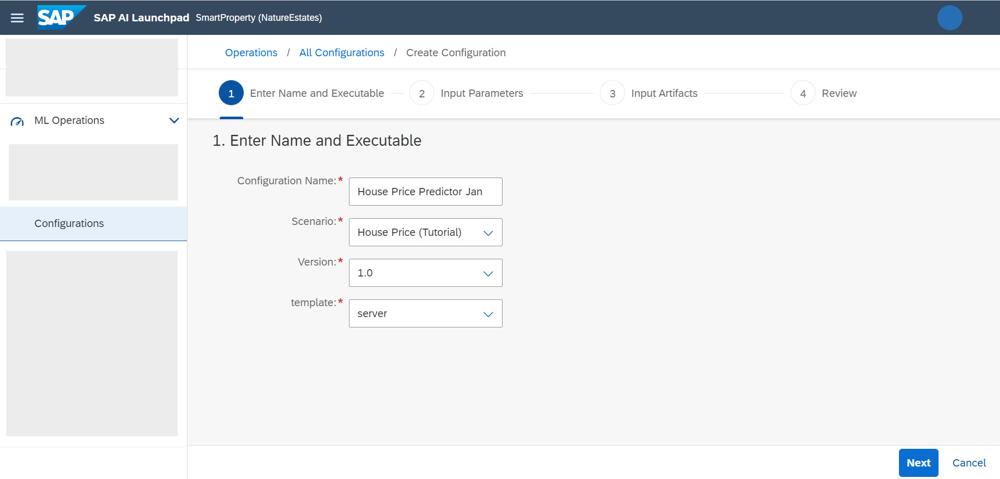

Enter `Hi AI Core Server` in the `greetmessage` field and click **Next**.

<!-- border -->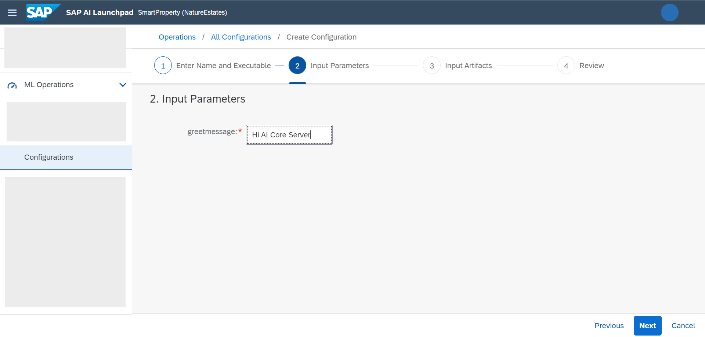

Locate your model artifact in the **Available Artifacts** pane, by using the unique ID. Click the dropdown menu and click the checkbox of `housepricemodel`. This is the name of the placeholder for the model in your serving executable. As a result, the placeholder will now take the value of the artifact.

<!-- border -->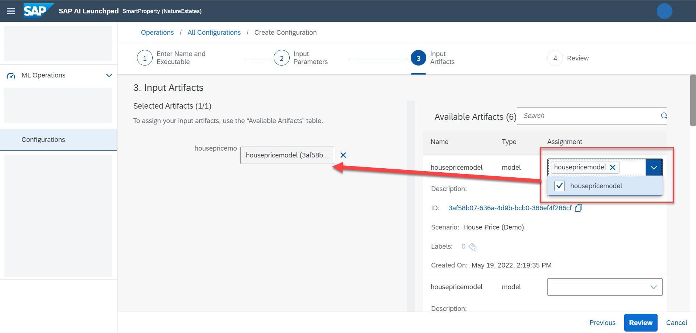

> Note This is specific to this executable, and allows you pass values to the placeholder of environment variables that you prepared earlier in your workflows.

Click **Review** > **Create**.

[OPTION END]


[OPTION BEGIN [SAP AI Core SDK]]

Paste and edit the code snippet. The key value pair for `housepricemodel` allows your to use the configuration to pass values to placeholders of artifacts that you prepared earlier in your workflows. You should locate your model artifact ID by listing all artifacts and using the relevant ID.

```PYTHON
from ai_api_client_sdk.models.parameter_binding import ParameterBinding
from ai_api_client_sdk.models.input_artifact_binding import InputArtifactBinding

response = ai_core_client.configuration.create(
    name = "House Price Predictor Jan",
    scenario_id = "learning-datalines",
    executable_id = "server-pipeline",
    input_artifact_bindings = [
        InputArtifactBinding(key = "housepricemodel", artifact_id = "<YOUR_MODEL_ARTIFACT_ID>") # placeholder  name as key
    ],
    parameter_bindings = [
        ParameterBinding(key = "greetmessage", value = "Hi AI Core server") # placeholder name as key
    ],
    resource_group = "default"
)
print(response.__dict__)
```


[OPTION END]

>**IMPORTANT** An artifact is a reference to files stored in your cloud storage. A single artifact can refer to a location containing multiple files. For model artifacts, your artifact must not point to a directory which contains a subdirectory. For example, if your artifact points to `s3://my/storage/of/house/modelv2`, `modelv2` must not contain sub-directories.


### Start a deployment


[OPTION BEGIN [SAP AI Launchpad]]

Click **Start Deployment** in the configuration details page.

<!-- border -->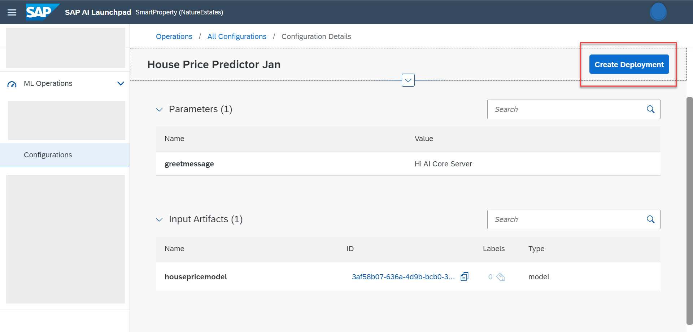

A next Screen will apear where you need to choose time to live for Deployment either you can choose standard for unlimtied time or Custom with set Expiry for Deployment

<!-- border -->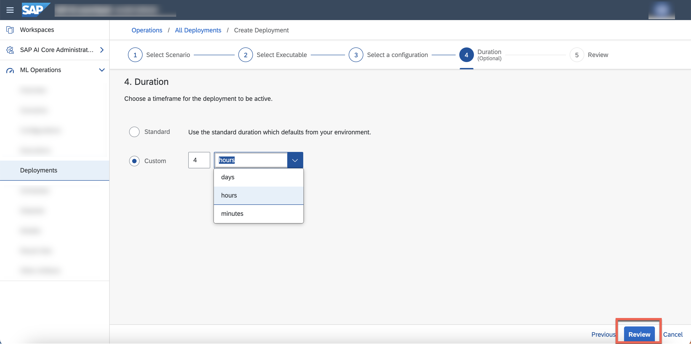

Once You have choosen TTL for deployment click on review. and once you are sure Click Next. This starts a new deployment with the values specified in the configuration.

> **WARNING** While your deployment is initializing, it may show the status that the deployment ID is not found.

On the **Logs** tab of your deployment, you will see the serving engine start.

<!-- border -->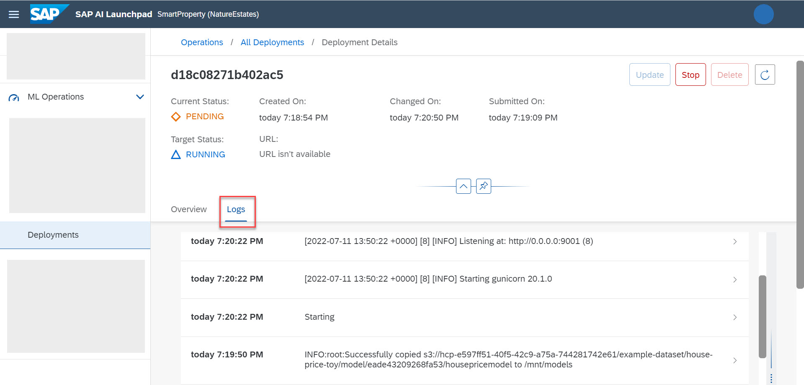

[OPTION END]


[OPTION BEGIN [SAP AI Core SDK]]

Paste and edit the snippet below. Your should use the configuration ID generated from previous step.

```PYTHON
response = ai_core_client.deployment.create(
    configuration_id="YOUR_CONFIGURATIO_ID",
    resource_group='default'
)

print(response.__dict__)
```

[OPTION END]


### Make a prediction


[OPTION BEGIN [SAP AI Launchpad]]

Copy your deployment URL.

<!-- border -->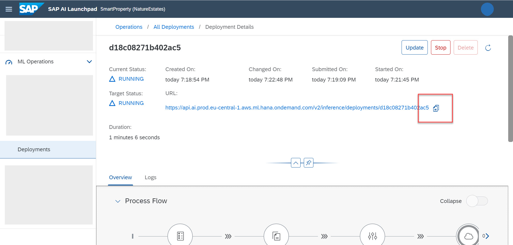

You must use a REST client to make prediction calls. If you are using the official API collection of SAP AI Core with Postman this may look like the following:

**ENDPOINT**

POST `<DEPLOYMENT_URL>/v2/predict`

**HEADER**

| Key | Value |
| --- | --- |
| `AI-Resource-Group` | `default` |

**REQUEST BODY**

```JSON
{
    "MedInc": 8.3252,
    "HouseAge": 41,
    "AveRooms": 6.984126984,
    "AveBedrms":1.023809524,
    "Population":322,
    "AveOccup": 2.555555556,
    "Latitude":37.88,
    "Longitude":-122.23
}
```

<!-- border -->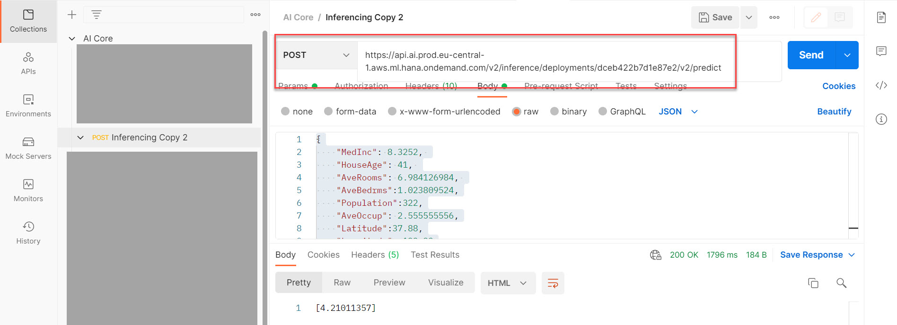

> **IMPORTANT** You may need to duplicate an existing endpoint in the collection and modify it. If you get `RBAC: Access Denied` then check the following in the order mentioned.
>
> - **Authorization**: if a bearer token is used.
> - The **Resource group** in the header.
> - If the **Endpoint** is correct.
> - The **POST** or **GET** method used.

[OPTION END]


[OPTION BEGIN [SAP AI Core SDK]]

To query the deployment status, paste and edit the snippet below. You should use the deployment ID from the previous step.

```PYTHON
response = ai_core_client.deployment.get(
    deployment_id="YOUR_DEPLOYMENT_ID",
    resource_group="default"
)

print(response.__dict__)
```

Copy the deployment URL. The deployment URL is generated only when the deployment state is **Running**.

<!-- border -->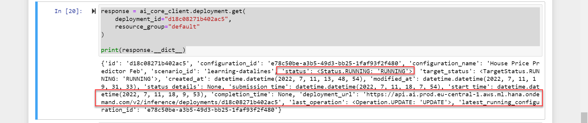

Paste and edit the snippet below to make a prediction.

```PYTHON
import requests

# URL
deployment_url = "YOUR_DEPLOYMENT_URL"

# Preparing the input for inference
test_input = {
    "MedInc": 8.3252,
    "HouseAge": 41,
    "AveRooms": 6.984126984,
    "AveBedrms":1.023809524,
    "Population":322,
    "AveOccup": 2.555555556,
    "Latitude":37.88,
    "Longitude":-122.23
}

endpoint = f"{deployment_url}/v2/predict" # endpoint implemented in serving engine
headers = {"Authorization": ai_core_client.rest_client.get_token(),
           'ai-resource-group': "default",
           "Content-Type": "application/json"}
response = requests.post(endpoint, headers=headers, json=test_input)

print('Inference result:', response.json())
```

<!-- border -->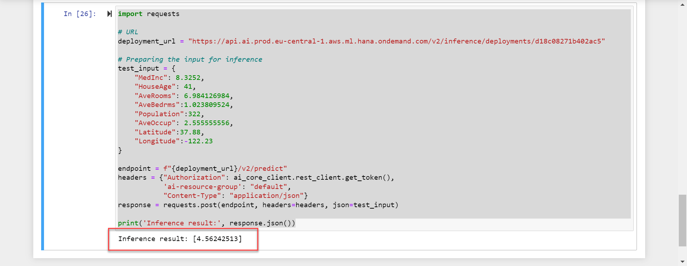

[OPTION END]

The prediction value is expressed in hundreds of thousands of dollars ($100,000) for [this specific use case](https://scikit-learn.org/stable/datasets/real_world.html#california-housing-dataset).


### Switch the deployed model


Switching between deployed models means that you can update the model used in your deployment server, without affecting the deployment URL.

[OPTION BEGIN [SAP AI Launchpad]]

To create a new configuration, click **ML Operations > Configuration > Create**. Enter the following details and click **Next**.

<!-- border -->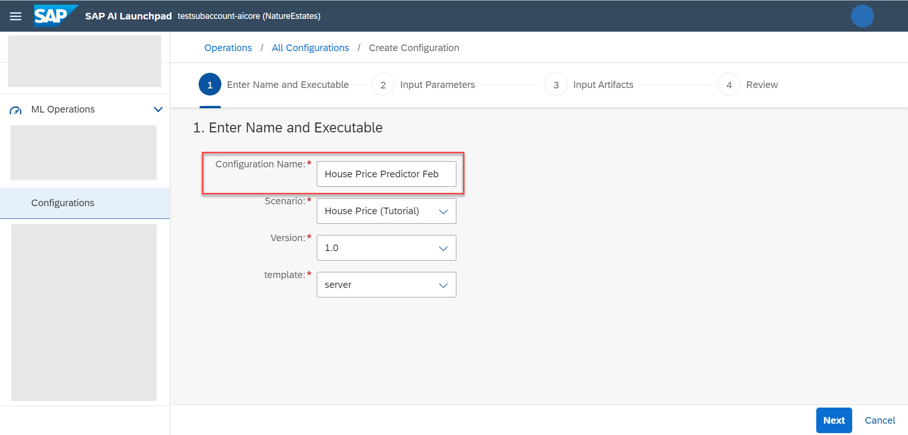

Select a different model in the **Input Artifact** step.

<!-- border -->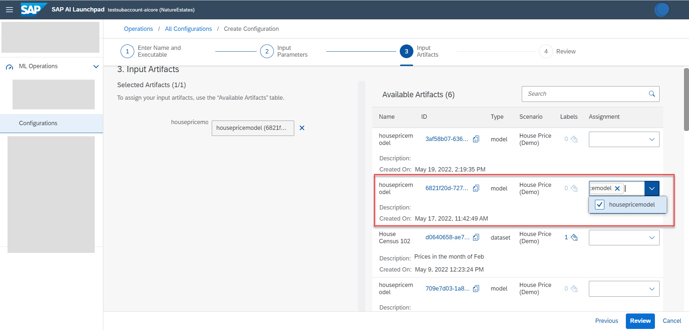

Click **Review** and **Create**.

To update your existing deployment with this newly created configuration, click **ML Operations > Deployment**.

Click on your deployment row in the table, then click **Update**.

<!-- border -->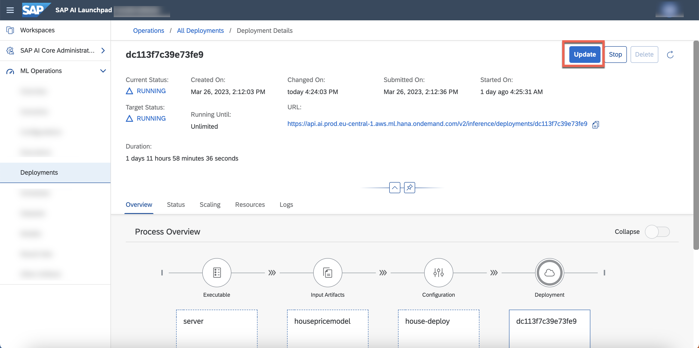

Select the configuration named `House Predictor Feb` and click **Update**.

<!-- border -->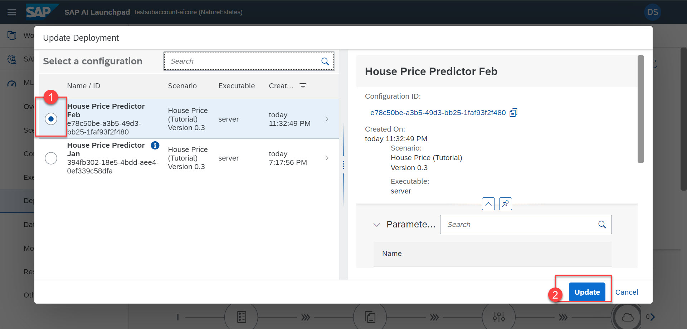


[OPTION END]


[OPTION BEGIN [SAP AI Core SDK]]

To create a new configuration, paste and edit the code snippet below.

```PYTHON
response = ai_core_client.configuration.create(
    name = "House Price Predictor Feb",
    scenario_id = "learning-datalines",
    executable_id = "server-pipeline",
    input_artifact_bindings = [
        InputArtifactBinding(key = "housepricemodel", artifact_id = "<YOUR_MODEL_ARTIFACT_ID>") # placeholder  name as key
    ],
    parameter_bindings = [
        ParameterBinding(key = "greetmessage", value = "Hi AI Core server") # placeholder name as key
    ],
    resource_group = "default"
)
print(response.__dict__)
```

To patch the deployment with a new configuration, paste and edit the code snippet below.

```PYTHON
response = ai_core_client.deployment.modify(
    deployment_id = "YOUR_DEPLOYMENT_ID", # existing deployment
    configuration_id = "NEW_CONFIGURATION_ID", # new configuration ID
    resource_group = "default"
)

print(response.__dict__)
```

[OPTION END]

The **Current Status** of your deployment changes to **Unknown** while your new model is copied to the serving engine. After the deployment has been copied successfully, the status changes to **Running** and is ready to make new predictions.

<!-- border -->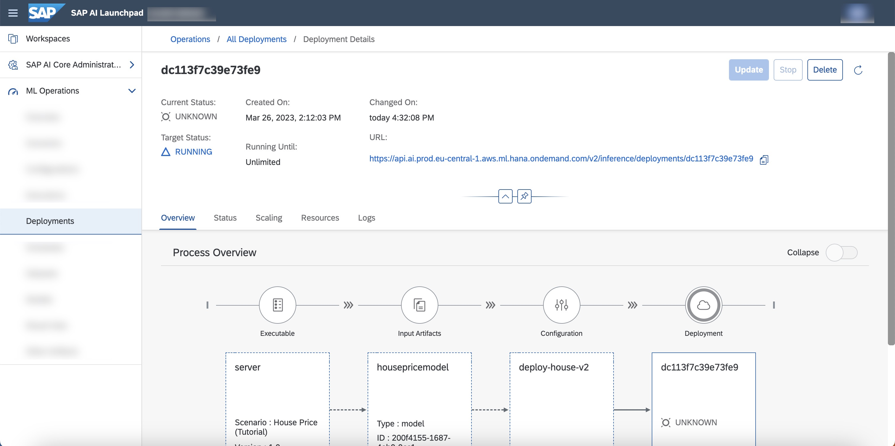

### Stop a deployment


A running deployment incurs cost because it is allocated cloud resources. Stopping the deployment frees up these resources and therefore there is no charge for a deployment of status **Stopped**.

[OPTION BEGIN [SAP AI Launchpad]]

On the deployment details page, click **Stop**.

<!-- border -->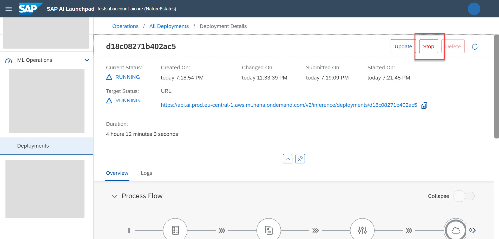

[OPTION END]


[OPTION BEGIN [SAP AI Core SDK]]

Use the following code snippet:

```PYTHON
from ai_api_client_sdk.models.target_status import TargetStatus
response = ai_core_client.deployment.modify(
    deployment_id="YOUR_DEPLOYMENT_ID",
    target_status=TargetStatus.STOPPED,
    resource_group="default"
)

print(response.__dict__)
```

[OPTION END]

>Note: You cannot restart a deployment. You must create a new deployment, reusing the configuration. Each deployment will have a different URL.


---

### Check Running Resources (optional)


You can check the Current running Pods Using in AI Lauchpad Choosing the Deployment and clicking on Scaling tab

<!-- border -->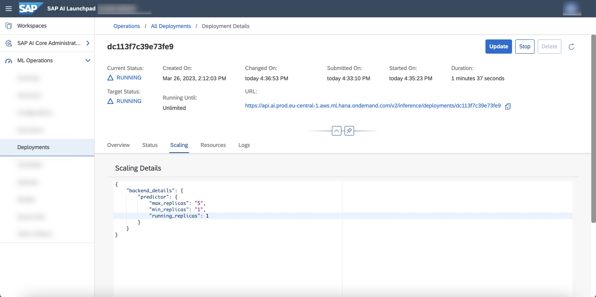

Similary if you want to check for resource plan just visit the resources tab 

<!-- border -->
