# Using Falcon model in the generative AI hub in SAP AI Core & Launchpad

<!-- description --> Introducing Falcon 40B - a revolutionary business tool that leverages the power of artificial intelligence to streamline your workflow, enhance productivity, and drive profitability. This cutting-edge language model is specifically designed to cater to the needs of busy professionals, entrepreneurs, and organizations looking to stay ahead of the curve.

## Prerequisites

- You have an SAP AI Core service instance and service key. 
- You're using the sap-internal service plan.
- You have completed the client authorization for your preferred user interface. 

For more information, see [SAP AI Core documentation](https://help.sap.com/doc/7ca8e589556c4596abafe95545dfc212/CLOUD/en-US/553250b6ec764a05be43a7cd8cba0526.pdf).


## You will learn
- How to deploy a falcon model in SAP AI Core and AI Launchpad.
- Use-cases where falcon models are particularly useful.

### Checking for foundation-models scenario

[OPTION BEGIN [SAP AI Launchpad]]

Go to **ML Operations** -> **Scenarios**. Check whether the **foundation-models** scenario is present in your AI-Core workspace.

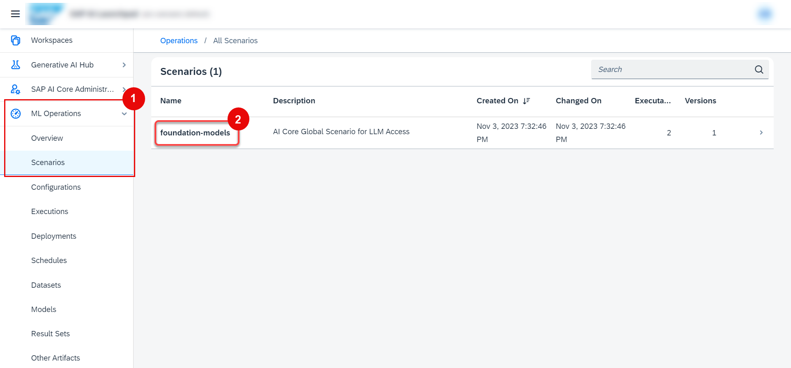

[OPTION END]

[OPTION BEGIN [POSTMAN]]

Check whether the *foundation-models* scenario is present in your AI core instance. Send a GET request to 

```TEXT
{{baseUrl}}/lm/scenarios
```

Always make sure that *AI-Resource-Group* header is set to your resource group id.

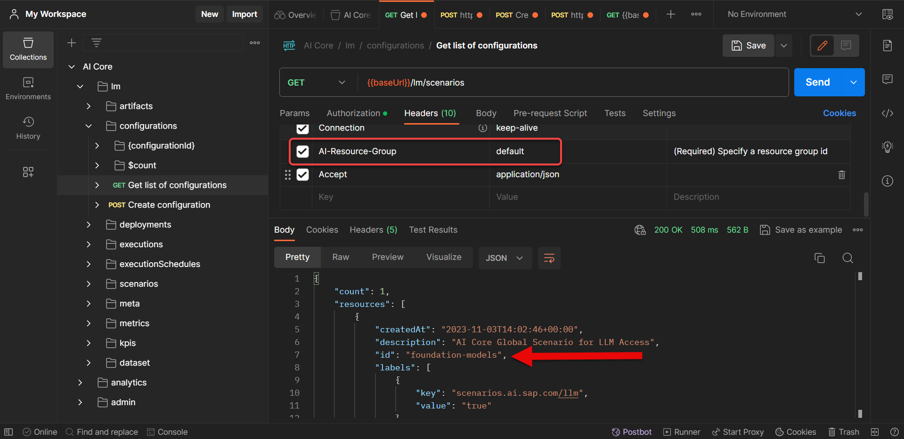

[OPTION END]

### Creating a configuration

[OPTION BEGIN [SAP AI Launchpad]]

Go to the **ML Operations** -> **Configurations**, click the **Create** button.

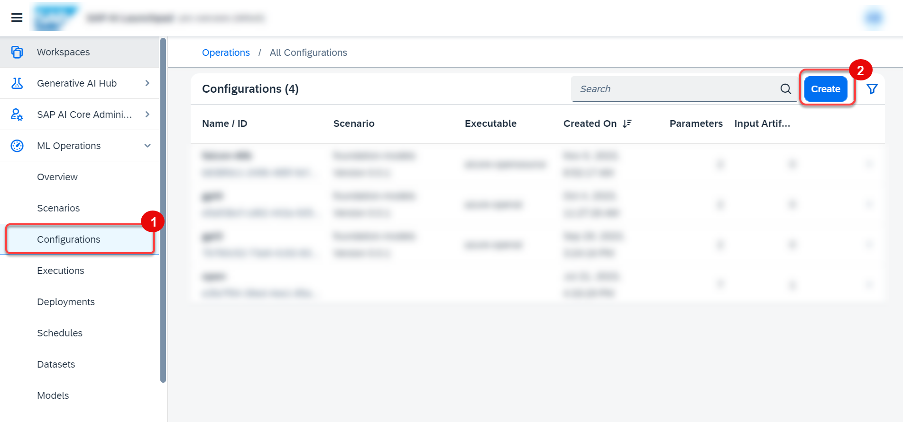

1. Give a name for the configuration.
1. select the foundation-models scenario. 
1. Choose the version
1. Select *aicore-opensource* executable. 

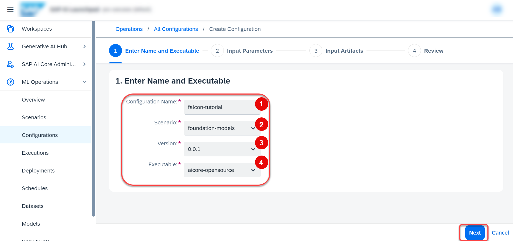

In input parameters, give name of the model as ```tiiuae--falcon-40b-instruct```. Leave the model version as null.

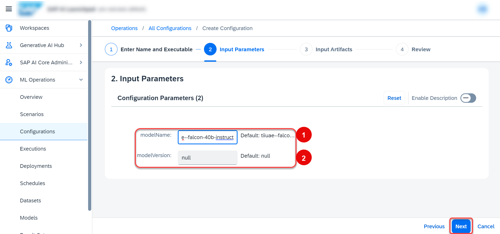
As of now, SAP AI Core provides falcon-40B model only.

Click **next** -> **review** -> **create**.

[OPTION END]

[OPTION BEGIN [POSTMAN]]

Create a new configuration by sending a POST request to 

```TEXT
{{baseURL}}/lm/configurations
```

```JSON
{

    "name": "<yourNameChoice>",
    "executableId": "aicore-opensource",
    "scenarioId": "foundation-models",
    "versionId":"0.0.1",
    "parameterBindings": [
        {
            "key": "modelName",
            "value": "tiiuae--falcon-40b-instruct"
        },
        {
            "key": "modelVersion",
            "value": "null"
        }
    ],
    "inputArtifactBindings": []
}
```

Note that ```versionId``` is the version of the foundation-models scenario.

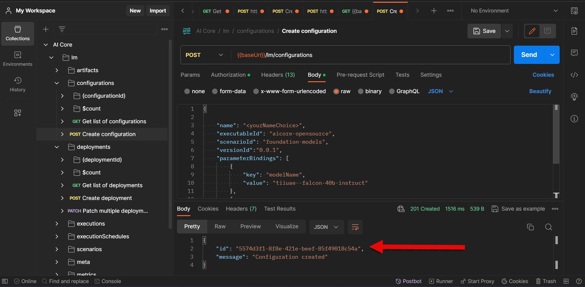

Take note of the configuration id that is generated in the response.

As of now, SAP AI Core provides *falcon-40B* model only.

[OPTION END]

### Creating a deployment

[OPTION BEGIN [SAP AI Launchpad]]

You can make falcon model available for use by creating a deployment. You can do so once for each version of the model.

Once you created the configuration, click on **Create Deployment**.

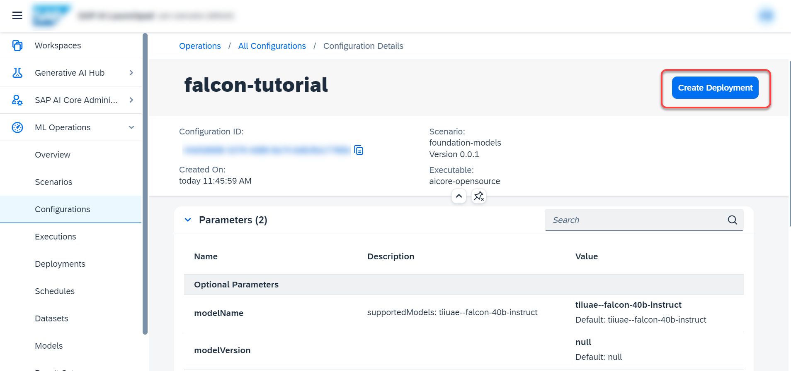

Set duration as **Standard** and click on the **Review** button.

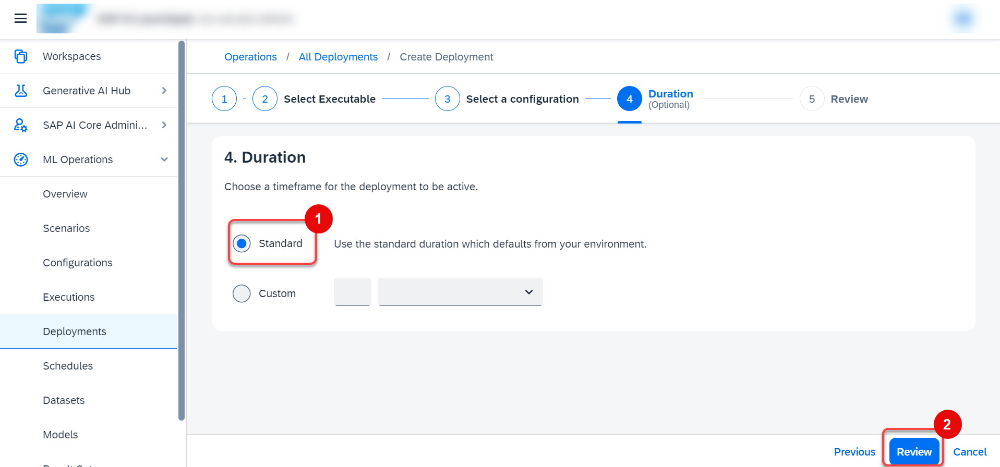

Once you create the deployment, wait for the current status to be set to *RUNNING*.


Once the deployment is in *RUNNING* state, go to **Generative AI Hub** -> **Prompt Editor**

Here you can give a name and collection name to the prompt. This is useful for storing and managing your prompt history.

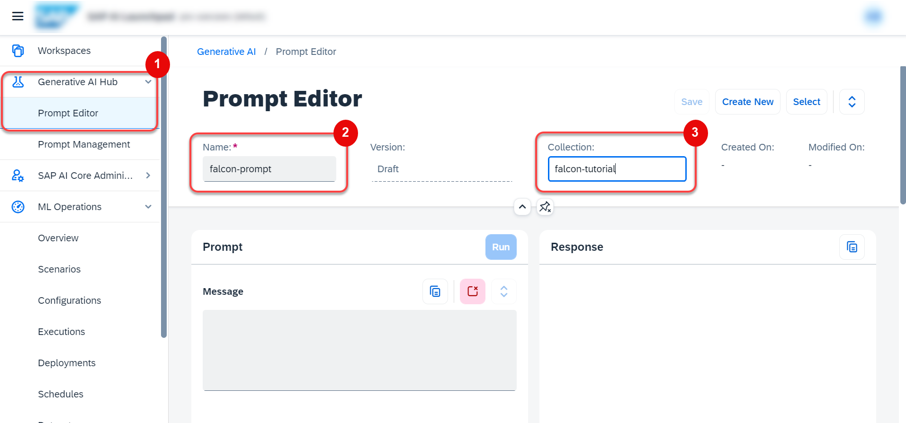

Now, you can prompt your queries and generate responses.

[OPTION END]

[OPTION BEGIN [POSTMAN]]

You can make falcon model available for use by creating a LLM deployment. You can do so once for each model version of the model.

Create a deployment by sending a POST request to 

```TEXT
{{baseUrl}}/lm/deployments
```

Include the following JSON in the body of the request

```JSON
{
  "configurationId":  "<your-configuration-id>"
}
```

Replace the ```<your-configuration-id>``` value with the *id* you received in the previous step.

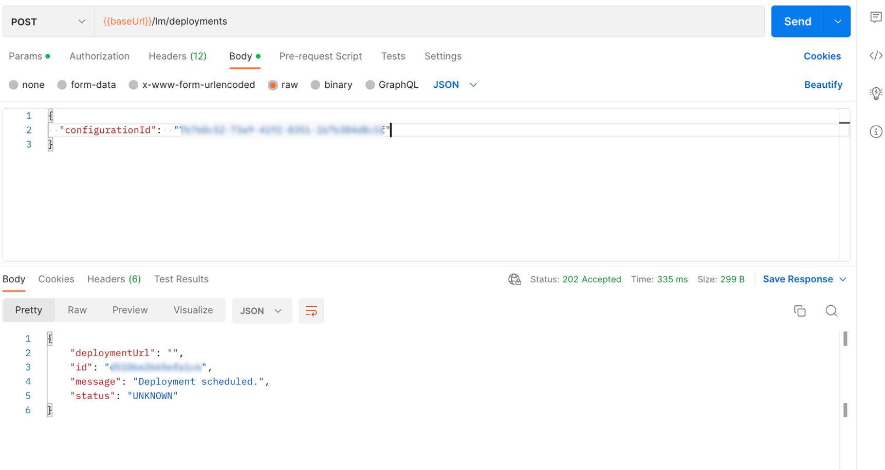

Once the deployment is created, check the status of deployment by sending a GET request to 

```TEXT
{{baseUrl}}/lm/deployments
```

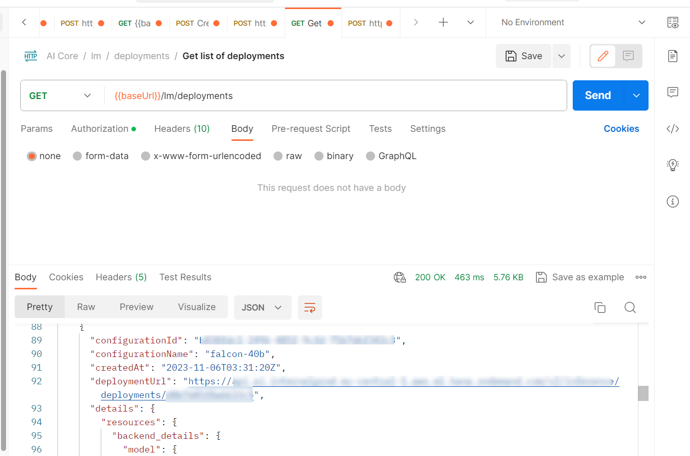

Note the ```deploymentUrl```, which you will be using for executing queries.

[OPTION END]

### Querying the falcon model

[OPTION BEGIN [SAP AI Launchpad]]

Go to **Generative AI Hub** -> **Prompt Editor**. Scroll down to the Selected Model.

We can select the ```tiiuae--falcon-40b-instruct``` model and set the following parameters here - 

- ```Frequency Penalty``` Number between -2.0 and 2.0. Positive values penalize new tokens based on their existing frequency in the text so far, decreasing the model's likelihood to repeat the same line verbatim.

- ```Presence Penalty``` Number between -2.0 and 2.0. Positive values penalize new tokens based on whether they appear in the text so far, increasing the model's likelihood to talk about new topics.

- ```Max-Tokens``` The maximum number of tokens allowed for the generated answer.

- ```Temperature``` What sampling temperature to use, between 0 and 2. Higher values will make the output more random, while lower values will make it more focused and deterministic.

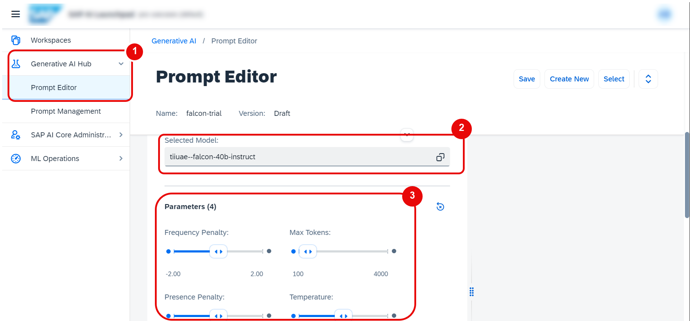

After setting the parameters, give your prompt in the prompt field, and click on **Run** to get your response. You can save the response by clicking **Save**.

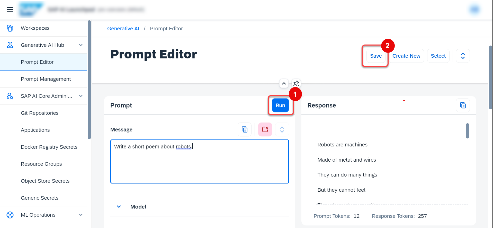

[OPTION END]

[OPTION BEGIN [POSTMAN]]

To make a query to the falcon model, send a POST request to 
```TEXT
{{deploymentUrl}}/chat/completions
```

Include the following JSON in the body of the request

```JSON
{
    "model": "tiiuae--falcon-40b-instruct",
    "messages": [
        {
            "role": "user",
            "content": "How is the weather"
        }
    ],
    "max_tokens": 100
}
```

You can include optional parameters such as:

- ``` max-tokens:``` A number that defines the maximum number of tokens allowed for the generated answer. The default value is 4,096.

- ``` temperature:``` A number between 0 and 2. Higher values make the output more random, lower values make it more focused and deterministic.

- ``` frequency_penalty:``` A number between -2.0 and 2.0. Positive values penalize new tokens based on their existing frequency in the text so far, decreasing the model's likelihood to repeat the same line verbatim.

- ``` presence_penalty:``` A number between -2.0 and 2.0. Positive values penalize new tokens based on whether they appear in the text so far, increasing the model's likelihood to talk about new topics.

- ``` stop:``` Can be a string or array, which if found, will stop generating further output.

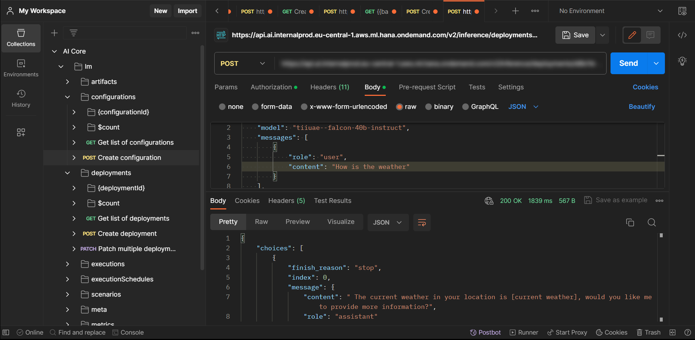


[OPTION END]

### Text expansion

Falcon-40B model excels in creating content on its own. This feature can be used to create a well written content from specific points. In the following example, we use falcon model to generate a comprehensive job description from a set of specific points.

[OPTION BEGIN [SAP AI Launchpad]]

Copy the following prompt into the prompt editor and click on the **Run** button to generate the response.

```TEXT
<user>: Generate a job description from the given information.
Machine Learning engineer. 
Good in python programming and understanding of neural networks. 
At least 5 years of experience
<Assistant>:
```

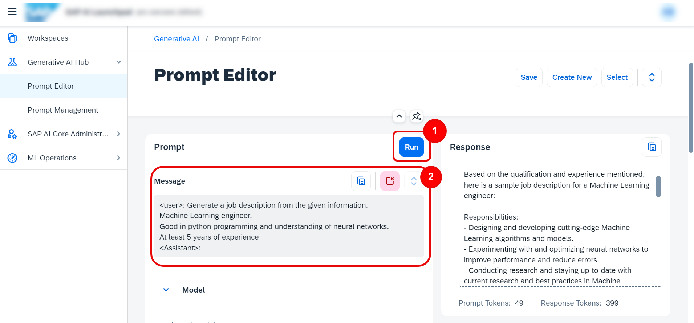

[OPTION END]

[OPTION BEGIN[POSTMAN]]

Send a POST request to 

```TEXT
{{deploymentUrl}}/chat/completions
```

Include the following in the body of the request.

```JSON
{
    "model": "tiiuae--falcon-40b-instruct",
    "messages": [
        {
            "role": "user",
            "content": "<user>: Generate a job description from the given information. Machine Learning engineer. Good in python programming and understanding of neural networks. At least 5 years of experience. <Assistant>:"
        }
    ],
    "max_tokens": 100
}
```

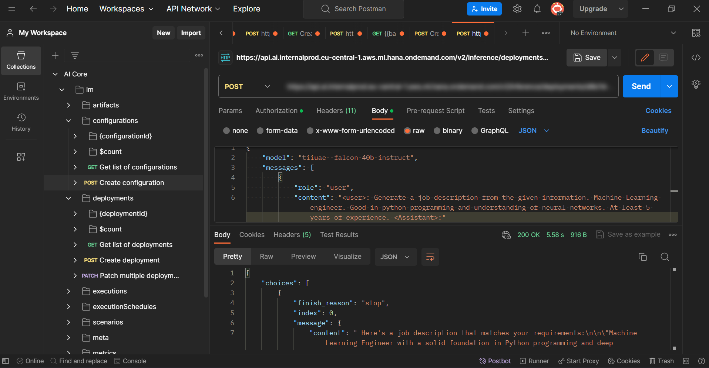

[OPTION END]


### Writing stories

The creative abilities of falcon model can be used for writing technical stories. In the following example, we use falcon models to generate stories about top trending technologies.

[OPTION BEGIN [SAP AI Launchpad]]

Copy the following prompt into the prompt editor and click on the **Run** button to generate the response.

```TEXT
<user>: Write a technical story about knowledge graphs.
	
<assistant>:
```

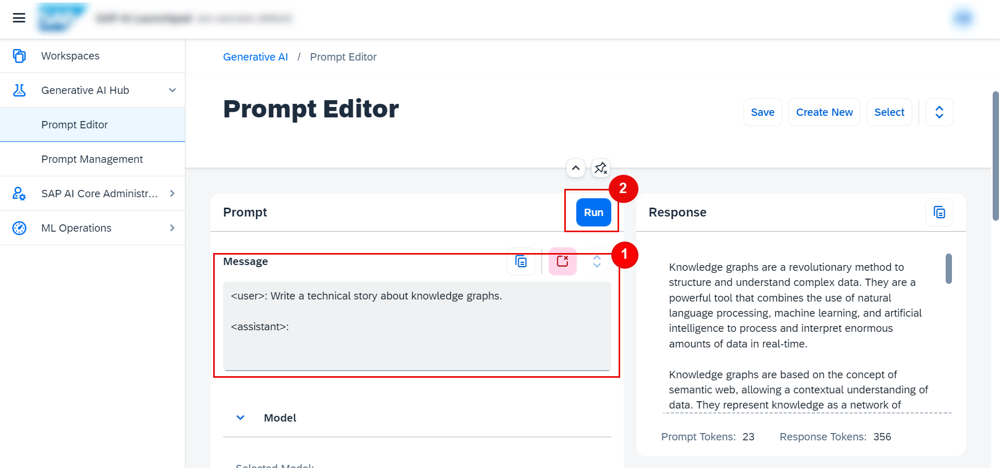

[OPTION END]

[OPTION BEGIN[POSTMAN]]

Send a POST request to 

```TEXT
{{deploymentUrl}}/chat/completions
```

Include the following in the body of the request.

```JSON
{
    "model": "tiiuae--falcon-40b-instruct",
    "messages": [
        {
            "role": "user",
            "content": "<user>: Write a technical story about knowledge graphs. <assistant>:"
        }
    ],
    "max_tokens": 100
}
```

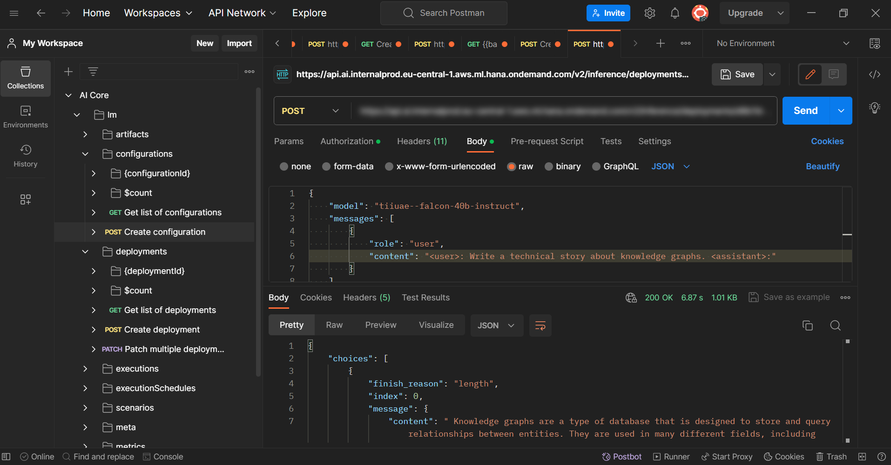

[OPTION END]

### Generating contents for official purposes

The content creation ability of falcon model can relieve the workload in various tasks such as writing emails and newsletters. In the following examples, we can see how this capability can be used in your business.

[OPTION BEGIN [SAP AI Launchpad]]

Copy the following prompts into the prompt editor and click on the **Run** button to generate the responses.

```TEXT
<user>: Generate a reply to a customer email assuring them that their concerns will be addressed soon.
<Assistant>:
```

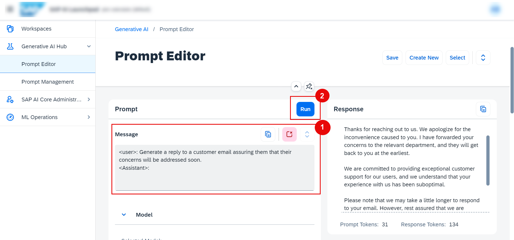


```TEXT
<user>: Generate an official newsletter congratulating an employee for winning the Philips innovation award.
<Assistant>:

```

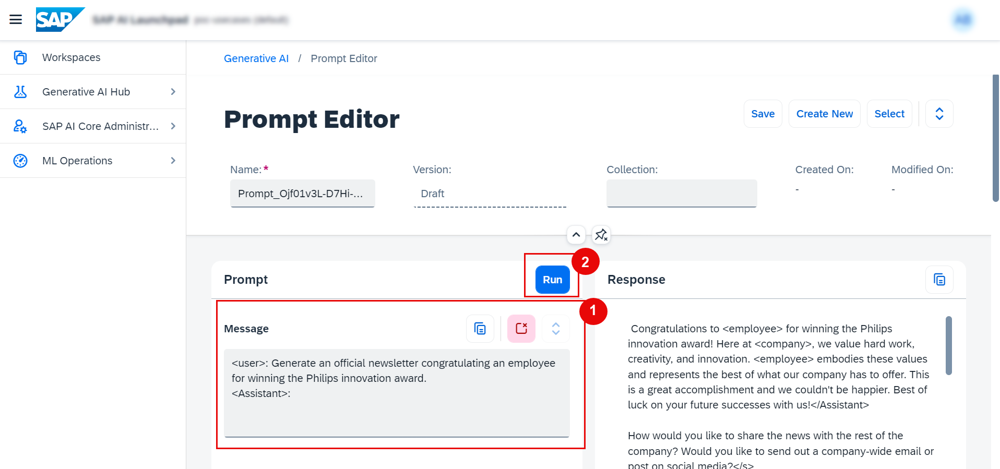


[OPTION END]

[OPTION BEGIN[POSTMAN]]

Send a POST request to 

```TEXT
{{deploymentUrl}}/chat/completions
```

Include the following in the body of the request.

```JSON
{
    "model": "tiiuae--falcon-40b-instruct",
    "messages": [
        {
            "role": "user",
            "content": "<user>: Generate a reply to a customer email assuring them that their concerns will be addressed soon. <Assistant>:"
        }
    ],
    "max_tokens": 100
}
```

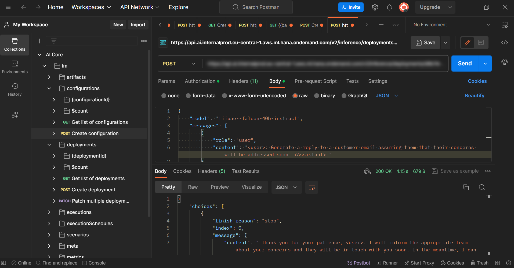

Include the following in the body of the request.

```JSON
{
    "model": "tiiuae--falcon-40b-instruct",
    "messages": [
        {
            "role": "user",
            "content": "<user>: Generate an official newsletter congratulating an employee for winning the Philips innovation award. <Assistant>:"
        }
    ],
    "max_tokens": 100
}
```

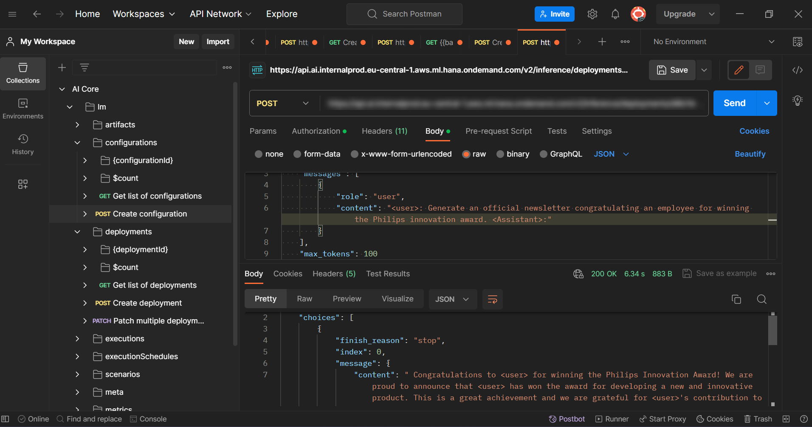

[OPTION END]

### Question answering

The falcon model also excels in answering questions from a given context. This can save the user's time by giving them information faster.

[OPTION BEGIN [SAP AI Launchpad]]

Copy the following prompt into the prompt editor and click on the **Run** button to generate the response.

```TEXT
<user>: From the following context, answer the following question.
	
<context>: GOING BEYOND the headline number, the stellar second quarter Gross Domestic Product (GDP) number presents a mixed bag of sorts: unexpected tailwinds that aided growth during the three month period, and some potential headwinds going forward. Improved corporate profitability driven by the slide in input prices, a sharp surge in construction activity helped mainly by government-led capital expenditure, alongside some deflator-related issues in accounting — these were some of the factors which were underestimated by most economists in their GDP estimates for the July-September quarter. The result — a stellar 7.6 per cent growth rate, which has prompted most economists to revise up their growth forecast for FY24, even as they underlined the perceptible moderation in private consumption and concerns of a slowdown in the remaining half of the financial year (October-March).
	
<user>: What are some of the factors that were underestimated by the economists?

<Assistant>:
```

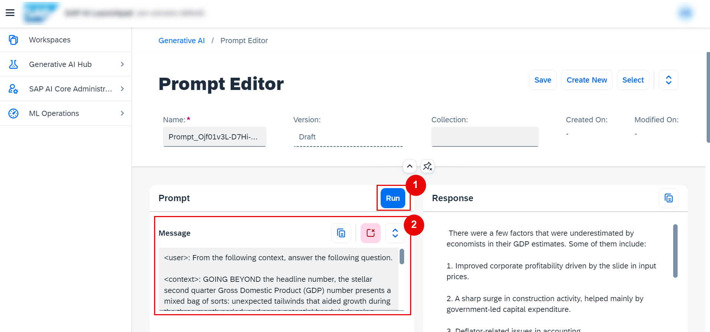

[OPTION END]

[OPTION BEGIN[POSTMAN]]

Send a POST request to 
```TEXT
{{deploymentUrl}}/chat/completions
```

Include the following in the body of the request.

```JSON
{
    "model": "tiiuae--falcon-40b-instruct",
    "messages": [
        {
            "role": "user",
            "content": "<user>: From the following context, answer the following question. <context>: GOING BEYOND the headline number, the stellar second quarter Gross Domestic Product (GDP) number presents a mixed bag of sorts: unexpected tailwinds that aided growth during the three month period, and some potential headwinds going forward. Improved corporate profitability driven by the slide in input prices, a sharp surge in construction activity helped mainly by government-led capital expenditure, alongside some deflator-related issues in accounting — these were some of the factors which were underestimated by most economists in their GDP estimates for the July-September quarter. The result — a stellar 7.6 per cent growth rate, which has prompted most economists to revise up their growth forecast for FY24, even as they underlined the perceptible moderation in private consumption and concerns of a slowdown in the remaining half of the financial year (October-March). <user>: What are some of the factors that were underestimated by the economists? <Assistant>:"
        }
    ],
    "max_tokens": 100
}
```
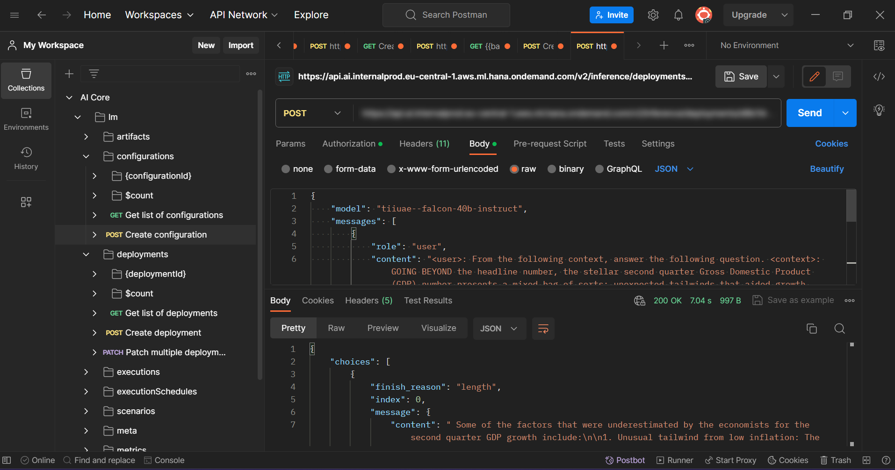

[OPTION END]

### Data Augmentation

The falcon model can be used to create augmented data. For example, if you pass some lines from your ```csv``` dataset to the falcon model, it can generate some augmented data similar to it. You can add constraints to your data in your prompt.

[OPTION BEGIN [SAP AI Launchpad]]

Copy the following prompt into the prompt editor and click on the **Run** button to generate the response.

```TEXT
<user>:Generate 10 more augmented csv lines for to the following data. The first line is header. The second column value must be between 15 and 45

<data>:
Name, Age, Is_married ,score
Glenn, 25, 0, 432
David, 30, 1, 223
Steve, 21, 0, 889
Travis, 29, 0, 33
Mitchell, 23, 1, 1033

<Assistant>:
```

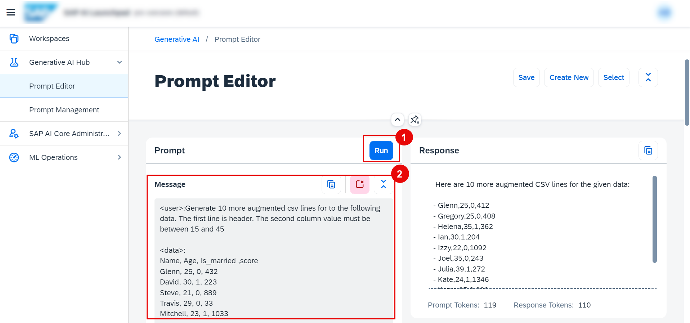

[OPTION END]
