# Retrieval Augmented Generation using generative-ai-hub-sdk and HANA vector search
<!-- description --> Using HANA vector store to store vector embeddings and using them in Retrieval Augmented Generation.

## Prerequisites

- Access to SAP AI core with sap extended plan.
- Have python3 installed in your system.
- Have generative-ai-hub-sdk installed in your system.

## You will learn
- How to create a table and store embeddings in HANA Vector Store.
- How to use the embeddings in Retrieval Augmented Generation.

Please find downloadable sample notebooks for the tutorials : Note that these tutorials are for demonstration purposes only and should not be used in production environments. To execute them properly, you'll need to set up your own S3 bucket or provision services from BTP, including an AI Core with a standard plan for narrow AI and an extended plan for GenAI HUB. Ensure you input the service keys of these services into the relevant cells of the notebook.
[Link to notebook](https://github.com/SAP-samples/ai-core-samples/blob/main/08_VectorStore/Hana/rag_hana_vector.ipynb)

### Loading vector data from a csv file

Download the following ```csv``` file and save it in your system.

 [Download File](https://raw.githubusercontent.com/SAP-samples/ai-core-samples/main/09_BusinessAIWeek/files/GRAPH_DOCU_2503.csv)

Execute the following python code in the same folder. This will load the data and store it in a data-frame.

```PYTHON
import pandas as pd
df = pd.read_csv('GRAPH_DOCU_QRC3.csv', low_memory=False)
df.head(3)
```

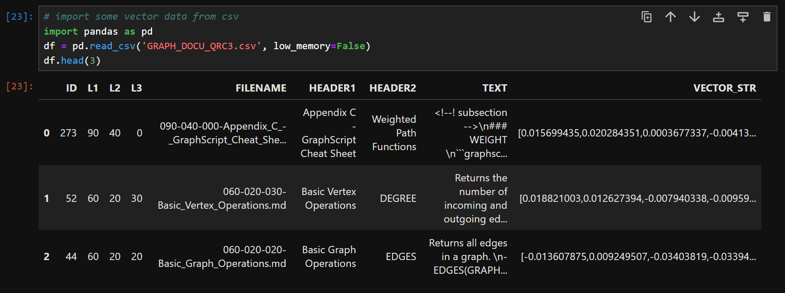

### Connection to the HANA Vector store

Execute the following python code to create a connection to the HANA Vector storage.

```PYTHON
from hana_ml import ConnectionContext
# cc = ConnectionContext(userkey='VDB_BETA', encrypt=True)
cc= ConnectionContext(
    address='<address>',
    port='<port-number>',
    user='<username>',
    password='<password>',
    encrypt=True
    )
print(cc.hana_version())
print(cc.get_current_schema())
```

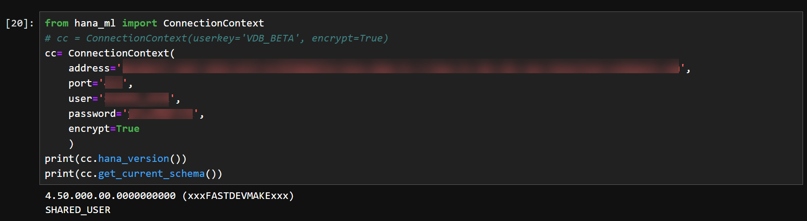

### Creating a table

To create a table, execute the following python command.

```PYTHON
# Create a table
cursor = cc.connection.cursor()
sql_command = '''CREATE TABLE GRAPH_DOCU_QRC3_2201(ID BIGINT, L1 NVARCHAR(3), L2 NVARCHAR(3), L3 NVARCHAR(3), FILENAME NVARCHAR(100), HEADER1 NVARCHAR(5000), HEADER2 NVARCHAR(5000), TEXT NCLOB, VECTOR_STR NCLOB);'''
cursor.execute(sql_command)
cursor.close()
```

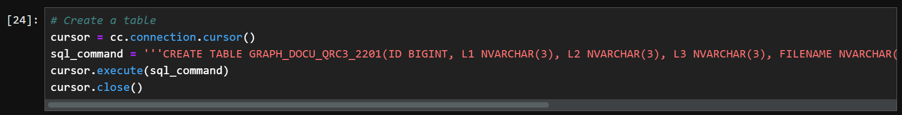

### Uploading the data to the database

Execute the following code to upload the data to the database.

```PYTHON
from hana_ml.dataframe import create_dataframe_from_pandas
v_hdf = create_dataframe_from_pandas(
    connection_context=cc,
    pandas_df=df,
    table_name="GRAPH_DOCU_QRC3_2201", 
    allow_bigint=True,
    append=True
    )
```

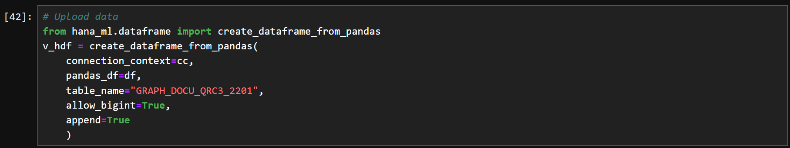

### Creating a VECTOR column

Add a new column ```VECTOR``` to the table to store the vectors. Execute the following python code.

```PYTHON
# Add REAL_VECTOR column
cursor = cc.connection.cursor()
sql_command = '''ALTER TABLE GRAPH_DOCU_QRC3_2201 ADD (VECTOR REAL_VECTOR(1536));'''
cursor.execute(sql_command)
cursor.close()
```

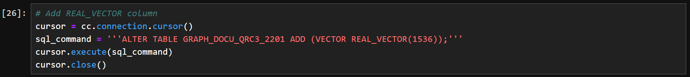

### Creating vectors from strings

The vectors for the strings can be created using the ```TO_REAL_VECTOR()``` function. Execute the following code to update the VECTOR column with the vectors.

```PYTHON
# Create vectors from strings
cursor = cc.connection.cursor()
sql_command = '''UPDATE GRAPH_DOCU_QRC3_2201 SET VECTOR = TO_REAL_VECTOR(VECTOR_STR);'''
cursor.execute(sql_command)
cursor.close()
```

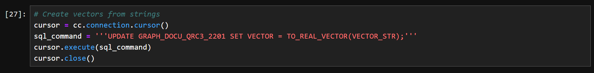

### Setting up hana_ml and generative-ai-hub-sdk

Import the ```hana_ml``` and ```generative-ai-hub-sdk``` packages. Set the proxy version of generative-ai-hub-sdk to ```gen-ai-hub``` for an AI Core proxy.

Execute the following python code.

```PYTHON
import hana_ml
print(hana_ml.__version__)

from gen_ai_hub.proxy.core.proxy_clients import get_proxy_client
proxy_client = get_proxy_client('gen-ai-hub') # for an AI Core proxy
```

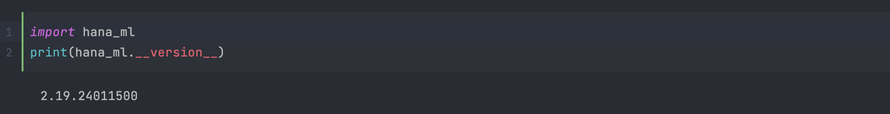

### Get Embeddings

Define the function ```get_embedding()``` to generate embeddings for our input texts. Execute the following python code.

```PYTHON
# Get embeddings
from gen_ai_hub.proxy.native.openai import embeddings

def get_embedding(input, model="text-embedding-ada-002") -> str:
    response = embeddings.create(
      model_name=model,
      input=input
    )
    return response.data[0].embedding
```
 
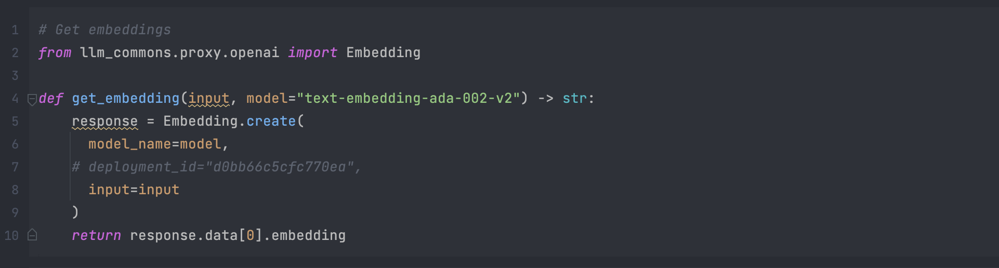

### Running vector search

Define a function ```run_vector_search()```. This function will search the vector database and finds the rows which are most similar to a given query.

Execute the following python code

```PYTHON
def run_vector_search(query: str, metric="COSINE_SIMILARITY", k=4):
    if metric == 'L2DISTANCE':
        sort = 'ASC'
    else:
        sort = 'DESC'
    query_vector = get_embedding(query)
    sql = '''SELECT TOP {k} "ID", "HEADER1", "HEADER2", "TEXT"
        FROM "GRAPH_DOCU_QRC3"
        ORDER BY "{metric}"("VECTOR", TO_REAL_VECTOR('{qv}')) {sort}'''.format(k=k, metric=metric, qv=query_vector, sort=sort)
    hdf = cc.sql(sql)
    df_context = hdf.head(k).collect()
    return df_context
```

Now we can test the function by sending a query. The function prints the rows that are most similar to the queries.

```PYTHON
query = "How can I run a shortest path algorithm?"
df_context = run_vector_search(query=query, metric="COSINE_SIMILARITY",k=4)
df_context
```

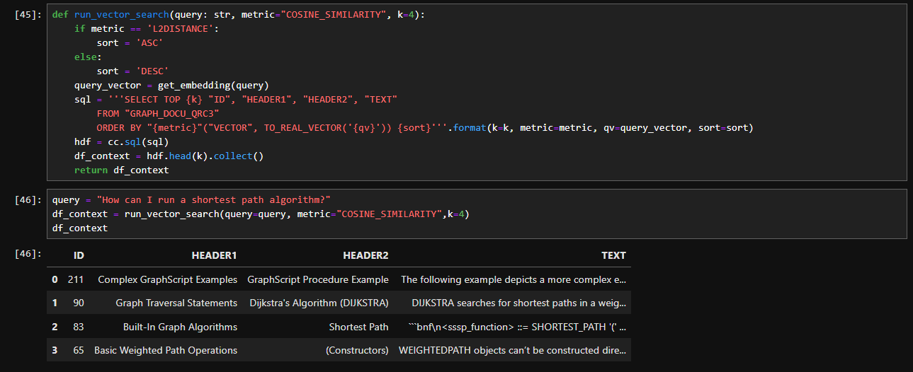

### Creating a prompt template

Create a prompt template to do retrieval augmented generation on your prompts. Execute the following python code.

```PYTHON
# Prompt. Do also use your knowledge from outside the given context.
promptTemplate_fstring = """
You are an SAP HANA Cloud expert.
You are provided multiple context items that are related to the prompt you have to answer.
Use the following pieces of context to answer the question at the end. 
Context:
{context}
Question:
{query}
"""
from langchain.prompts import PromptTemplate
promptTemplate = PromptTemplate.from_template(promptTemplate_fstring)
```

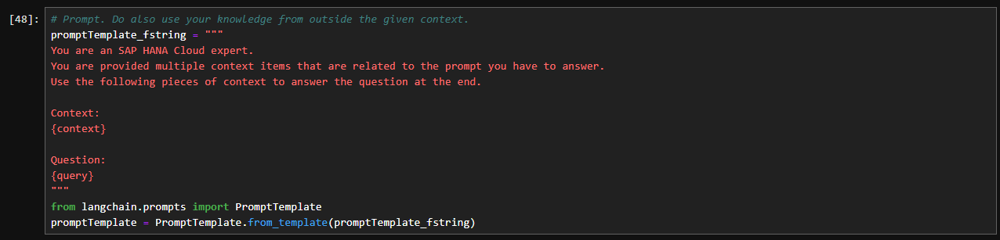

### Querying the LLM

Now create a function ```ask_llm()``` to query the LLM while using the similar vectors as context. Execute the following python code.

```PYTHON
from gen_ai_hub.proxy.langchain.openai import ChatOpenAI
from gen_ai_hub.proxy.core.proxy_clients import get_proxy_client
proxy_client = get_proxy_client('gen-ai-hub') # for an AI Core proxy

def ask_llm(query: str, retrieval_augmented_generation: bool, metric='COSINE_SIMILARITY', k = 4) -> str:

    class color:
        RED = '\033[91m'
        BLUE = '\033[94m'
        BOLD = '\033[1m'
        END = '\033[0m'
    context = ''
    if retrieval_augmented_generation == True:
        print(color.RED + 'Running retrieval augmented generation.' + color.END)
        print(color.RED + '\nEmbedding the query string and running HANA vector search.' + color.END)
        context = run_vector_search(query, metric, k)
        print(color.RED + '\nHANA vector search returned {k} best matching documents.'.format(k=k) + color.END)
        print(color.RED + '\nGenerating LLM prompt using the context information.' + color.END)
    else:
        print(color.RED + 'Generating LLM prompt WITHOUT context information.' + color.END)
    prompt = promptTemplate.format(query=query, context=' '.join(df_context['TEXT'].astype('string')))
    print(color.RED + '\nAsking LLM...' + color.END)
    llm = ChatOpenAI(proxy_model_name='gpt-4', proxy_client=proxy_client)
    response = llm.invoke(prompt).content
    print(color.RED + '...completed.' + color.END)
    print(color.RED + '\nQuery: ' + color.END, query)
    print(color.BLUE + '\nResponse:' + color.BLUE)
    print(response)
```

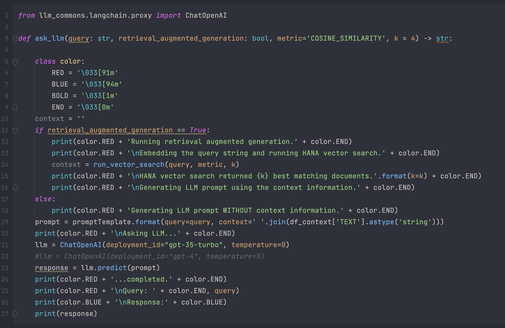

Now you can test the function using a query. Run the following python code.

```PYTHON
query = "I want to calculate a shortest path. How do I do that?"

response = ask_llm(query=query, retrieval_augmented_generation=True, k=4)
```

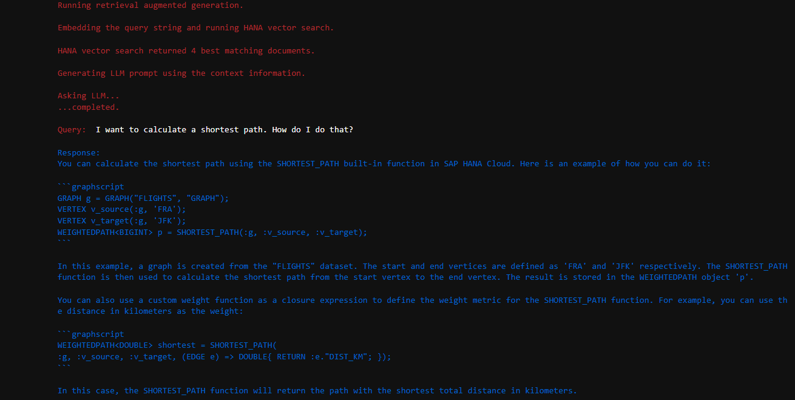

### Creating a connection using dbapi

```PYTHON
import hdbcli
from hdbcli import dbapi

cc = dbapi.connect(
    address='<address>',
    port='<port-number>',
    user='<user>',
    password='<password>',
    encrypt=True
    )
```

### Using insert methods to write directly into the table

Execute the following code to extract data from the csv file and store it in a list

```PYTHON
import csv

data = []
with open('GRAPH_DOCU_2503.csv', encoding='utf-8') as csvfile:
    csv_reader = csv.reader(csvfile)
    for row in csv_reader:
        try:
            data.append(row)
        except:
            print(row)
```

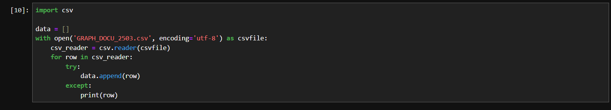

### Creating a table and adding data

To create a table, execute the following python code.

```PYTHON
# Create a table
cursor = cc.cursor()
sql_command = '''CREATE TABLE TABLENAME(ID1 BIGINT, ID2 BIGINT, L1 NVARCHAR(3), L2 NVARCHAR(3), L3 NVARCHAR(3), FILENAME NVARCHAR(100), HEADER1 NVARCHAR(5000), HEADER2 NVARCHAR(5000), TEXT NCLOB, VECTOR_STR REAL_VECTOR);'''
cursor.execute(sql_command)
cursor.close()
```

Now we insert our data into the table we created

```PYTHON
cursor = cc.cursor()
sql_insert = 'INSERT INTO TABLE10043(ID1, ID2, L1, L2, L3, FILENAME, HEADER1, HEADER2, TEXT, VECTOR_STR) VALUES (?,?,?,?,?,?,?,?,?,TO_REAL_VECTOR(?))'
cursor.executemany(sql_insert,data[1:])
```

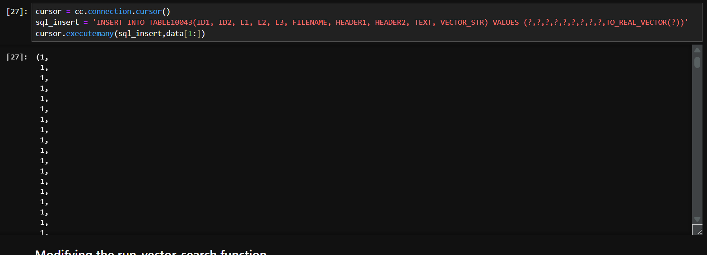

### Modifying the run_vector_search function

We can modify the run_vector_search function to make use of the VECTOR_STR column for similarity search

```PYTHON
cursor = cc.cursor()
def run_vector_search(query: str, metric="COSINE_SIMILARITY", k=4):
    if metric == 'L2DISTANCE':
        sort = 'ASC'
    else:
        sort = 'DESC'
    query_vector = get_embedding(query)
    sql = '''SELECT TOP {k} "ID2", "TEXT"
        FROM "TABLE10043"
        ORDER BY "{metric}"("VECTOR_STR", TO_REAL_VECTOR('{qv}')) {sort}'''.format(k=k, metric=metric, qv=query_vector, sort=sort)
    cursor.execute(sql)
    hdf = cursor.fetchall()
    return hdf[:k]
```

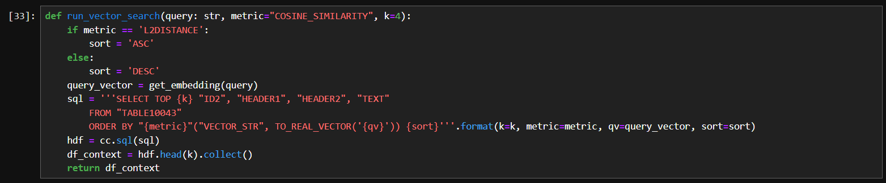

### Querying the LLM

Now create a function ```ask_llm()``` to query the LLM while using the similar vectors as context. Execute the following python code.

```PYTHON
from gen_ai_hub.proxy.langchain.openai import ChatOpenAI
from gen_ai_hub.proxy.core.proxy_clients import get_proxy_client
proxy_client = get_proxy_client('gen-ai-hub') # for an AI Core proxy

def ask_llm(query: str, retrieval_augmented_generation: bool, metric='COSINE_SIMILARITY', k = 4) -> str:

    class color:
        RED = '\033[91m'
        BLUE = '\033[94m'
        BOLD = '\033[1m'
        END = '\033[0m'
    context = ''
    if retrieval_augmented_generation == True:
        print(color.RED + 'Running retrieval augmented generation.' + color.END)
        print(color.RED + '\nEmbedding the query string and running HANA vector search.' + color.END)
        context = run_vector_search(query, metric, k)
        print(color.RED + '\nHANA vector search returned {k} best matching documents.'.format(k=k) + color.END)
        print(color.RED + '\nGenerating LLM prompt using the context information.' + color.END)
    else:
        print(color.RED + 'Generating LLM prompt WITHOUT context information.' + color.END)
    df_context = run_vector_search(query=query, metric="COSINE_SIMILARITY",k=1)
    prompt = promptTemplate.format(query=query, context=' '.join(str(df_context)))
    print(color.RED + '\nAsking LLM...' + color.END)
    llm = ChatOpenAI(proxy_model_name='gpt-4', proxy_client=proxy_client)
    response = llm.invoke(prompt).content
    print(color.RED + '...completed.' + color.END)
    print(color.RED + '\nQuery: ' + color.END, query)
    print(color.BLUE + '\nResponse:' + color.BLUE)
    print(response)
```

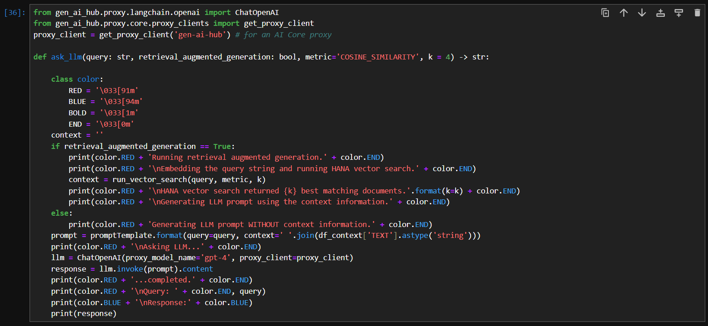

Now you can test the function using a query. Run the following python code.

```PYTHON
query = "I want to calculate a shortest path. How do I do that?"

response = ask_llm(query=query, retrieval_augmented_generation=True, k=4)
```


