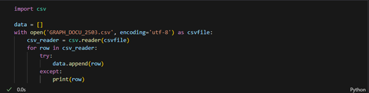
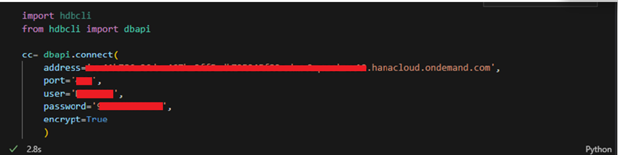
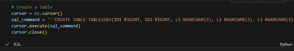
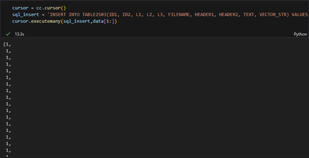
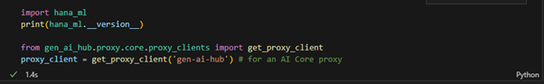
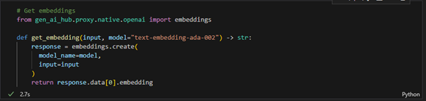
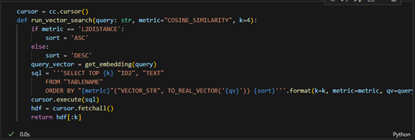
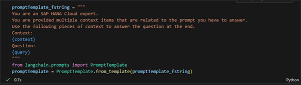
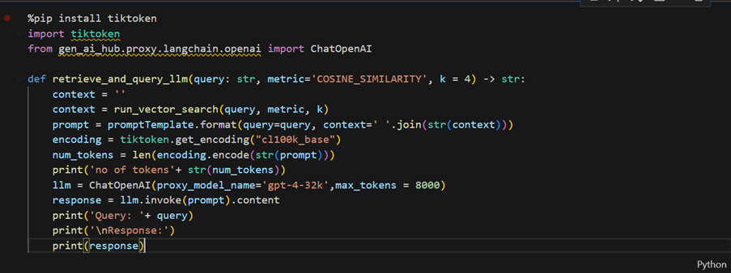

# Retrieval Augmented Generation using generative-ai-hub-sdk and HANA vector search
<!-- description --> Using HANA vector store to store vector embeddings and using them in Retrieval Augmented Generation.

## Prerequisites
- A BTP global account
If you are an SAP Developer or SAP employee, please refer to the following links (for internal SAP stakeholders only) - 
[How to create a BTP Account (internal)](https://me.sap.com/notes/3493139)
[SAP AI Core](https://help.sap.com/docs/sap-ai-core?locale=en-US)
If you are an external developer or a customer or a partner kindly refer to this [tutorial](https://developers.sap.com/tutorials/btp-cockpit-entitlements.html)
- Access to SAP AI core with sap extended plan.
- Have python3 installed in your system.
- Have generative-ai-hub-sdk installed in your system.

## You will learn
- How to create a table and store embeddings in HANA Vector Store.
- How to use the embeddings in Retrieval Augmented Generation.

Please find downloadable sample notebooks for the tutorials : Note that these tutorials are for demonstration purposes only and should not be used in production environments. To execute them properly, you'll need to set up your own S3 bucket or provision services from BTP, including an AI Core with a standard plan for narrow AI and an extended plan for GenAI HUB. Ensure you input the service keys of these services into the relevant cells of the notebook.
[Link to notebook](https://github.com/SAP-samples/ai-core-samples/blob/main/09_BusinessAIWeek/workshop_notebook-final.ipynb)

### Installing generative-ai-hub-sdk

To install the generative-ai-hub-sdk package in your system, open your terminal or command prompt and run the following command.

```
pip3 install generative-ai-hub-sdk
```

Once the package is installed, you need to configure proxy modules to use the large language models. We recommend setting these values as environment variables for AI Core credentials via a configuration file. The default path for this file is ~/.aicore/config.json. 

Open Notepad and replace the placeholder values in the JSON file with your AI Core service keys, which you downloaded from BTP. Save the file by pressing Command + S. When prompted, navigate to ~/.aicore/ and save the file as config.json. 

The default path can be overridden by setting the AICORE_HOME environment variable to the folder path from which the config file should be read. 


Source: https://pypi.org/project/generative-ai-hub-sdk/

### Loading vector data from a csv file

The dataset in [GRAPH_DOCU_2503.csv](https://raw.githubusercontent.com/SAP-samples/ai-core-samples/main/09_BusinessAIWeek/files/GRAPH_DOCU_2503.csv) includes pre-computed vector embeddings. We have incorporated these vectors into the CSV file to facilitate a quick start with vector search, eliminating the need to generate embeddings using an additional function.

This dataset is specifically derived from the Graph Engine section of the [SAP HANA Cloud documentation](https://help.sap.com/docs/hana-cloud-database/sap-hana-cloud-sap-hana-database-graph-reference/sap-hana-cloud-sap-hana-database-graph-reference), as found on the SAP Help Portal.

```PYTHON
# Read data from 'GRAPH_DOCU_2503.csv' and store each row in the 'data' list
import csv

data = []
with open('GRAPH_DOCU_2503.csv', encoding='utf-8') as csvfile:
    csv_reader = csv.reader(csvfile)
    for row in csv_reader:
        try:
            data.append(row)
        except:
            print(row)
```



### Creating a connection using dbapi

First, you'll need to install the hdbcli library to connect to the SAP HANA database. Run the following command to install it:

```PYTHON
!pip install hdbcli
```

You can establish a connection to the HANA Vector storage by replacing the address, port number, username, and password with the values provided in your credentials.

After the installation is complete, you can establish a secure connection to the HANA Vector storage by replacing the placeholder values with the actual details provided in your credentials:

```PYTHON
# Establish a secure connection to an SAP HANA database using hdbcli 
import hdbcli
from hdbcli import dbapi

cc = dbapi.connect(
    address='<host>',
    port='443',
    user='<user>',
    password='<password>',
    encrypt=True
    )
```



### Creating a table and adding data

HANA Vector storage organizes data in tables. To store your data, you can create a table in HANA Vector storage. Replace TABLENAME with a name of your choice, ensuring that it contains only uppercase letters and numbers. 

```PYTHON
# Create a table
cursor = cc.cursor()
sql_command = '''CREATE TABLE TABLENAME(ID1 BIGINT, ID2 BIGINT, L1 NVARCHAR(3), L2 NVARCHAR(3), L3 NVARCHAR(3), FILENAME NVARCHAR(100), HEADER1 NVARCHAR(5000), HEADER2 NVARCHAR(5000), TEXT NCLOB, VECTOR_STR REAL_VECTOR);'''
cursor.execute(sql_command)
cursor.close()
```



**Note**: In the SQL command, we are creating a table named TABLE2503. You can choose any name for your table but ensure that you consistently use the same name throughout your operations. Remember that you cannot create multiple tables with the same name.

Once you have created the table, you can populate it with the data that you converted to a Data Frame in the previous step. The SQL INSERT command will add all the contents from the CSV file, including text chunks, embeddings, and metadata, into the table. This demonstrates how you can insert text chunks into the HANA Vector database for implementing retrieval-augmented generation (RAG).

Replace TABLENAME with the name of your table. This process is for inserting pre-existing embeddings from a file.

```PYTHON
# Inserting data into the specified table using a prepared SQL statement with real vector conversion.
cursor = cc.cursor()
sql_insert = 'INSERT INTO TABLENAME(ID1, ID2, L1, L2, L3, FILENAME, HEADER1, HEADER2, TEXT, VECTOR_STR) VALUES (?,?,?,?,?,?,?,?,?,TO_REAL_VECTOR(?))'
cursor.executemany(sql_insert,data[1:])
```



### Setting up hana_ml and generative-ai-hub-sdk

First, you'll need to install the hana_ml package to work with SAP HANA and set up the AI Core proxy using generative-ai-hub-sdk. Run the following command to install hana_ml:

```PYTHON
!pip install hana_ml
```

After installing, you can proceed with the following code to import the necessary packages and initialize the AI Core proxy:

```PYTHON
import hana_ml
print(hana_ml.__version__)
from gen_ai_hub.proxy.core.proxy_clients import get_proxy_client
proxy_client = get_proxy_client('gen-ai-hub') # for an AI Core proxy
```


### Get Embeddings

Embeddings are vector representations of text data that capture the semantic meaning of the text. Define a get_embedding() function to generate embeddings from text data using the text-embedding-ada-002 model. This function will be used to convert user prompts into embeddings.

For example, if a user enters the prompt "How can I run a shortest path algorithm?", the get_embedding() function will convert the prompt into an embedding, which can then be used to search for similar data in the HANA database using similarity search.

```PYTHON
# Get embeddings
!pip install generative-ai-hub-sdk[langchain]
from gen_ai_hub.proxy.native.openai import embeddings

def get_embedding(input, model="text-embedding-ada-002") -> str:
    response = embeddings.create(
      model_name=model,
      input=input
    )
    return response.data[0].embedding
```



### Running vector search

Define a function run_vector_search(). This function will search the vector database and finds the rows which are most similar to a given query.

```PYTHON
# Perform a vector search on the table using the specified metric and return the top k results
cursor = cc.cursor()
def run_vector_search(query: str, metric="COSINE_SIMILARITY", k=4):
    if metric == 'L2DISTANCE':
        sort = 'ASC'
    else:
        sort = 'DESC'
    query_vector = get_embedding(query)
    sql = '''SELECT TOP {k} "ID2", "TEXT"
        FROM "TABLENAME"
        ORDER BY "{metric}"("VECTOR_STR", TO_REAL_VECTOR('{qv}')) {sort}'''.format(k=k, metric=metric, qv=query_vector, sort=sort)
    cursor.execute(sql)
    hdf = cursor.fetchall()
    return hdf[:k]
```



**Note**: By default, we are using cosine similarity for RAG.

### Creating a prompt template

Create a prompt template to do retrieval augmented generation on your prompts. Execute the following python code.

```PYTHON
# Create a prompt template
promptTemplate_fstring = """
You are an SAP HANA Cloud expert.
You are provided multiple context items that are related to the prompt you have to answer.
Use the following pieces of context to answer the question at the end. 
Context:
{context}
Question:
{query}
"""
from langchain.prompts import PromptTemplate
promptTemplate = PromptTemplate.from_template(promptTemplate_fstring)
```



### Querying the LLM

Now create a function retrieve_and_query_llm() to query the LLM while using the similar vectors as context.

The code defines a function retrieve_and_query_llm() that performs a similarity search and generates a response using a language model. It first retrieves contextually relevant information from a vector search based on the user's query, then constructs a prompt and calculates its token length using the tiktoken library. The function subsequently invokes a GPT-4 model through the Chat OpenAI class to generate and print a response based on the constructed prompt.

```PYTHON
# Import necessary modules, and define a function to query an LLM with a formatted prompt and vector-based context

!pip install tiktoken
import tiktoken
from gen_ai_hub.proxy.langchain.openai import ChatOpenAI

def retrieve_and_query_llm(query: str, metric='COSINE_SIMILARITY', k = 4) -> str:
    context = ''
    context = run_vector_search(query, metric, k)
    prompt = promptTemplate.format(query=query, context=' '.join(str(context)))
    encoding = tiktoken.get_encoding("cl100k_base")
    num_tokens = len(encoding.encode(str(prompt)))
    print('no of tokens'+ str(num_tokens))
    llm = ChatOpenAI(proxy_model_name='gpt-4-32k',max_tokens = 8000)
    response = llm.invoke(prompt).content
    print('Query: '+ query)
    print('\nResponse:')
    print(response)
```



### Testing the function

Now you can test the function using a query. Run the following python code for the same - 

```PYTHON
# Query the LLM with a request about calculating the shortest path and retrieve the response

query = "I want to calculate a shortest path. How do I do that?"
response = retrieve_and_query_llm(query=query, k=4)
response
```

