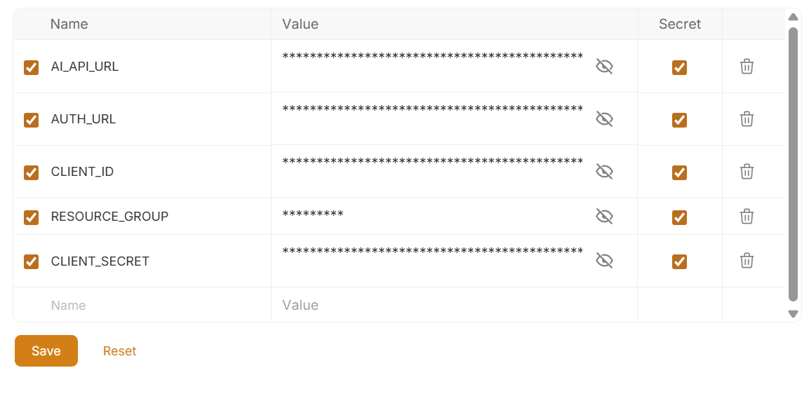
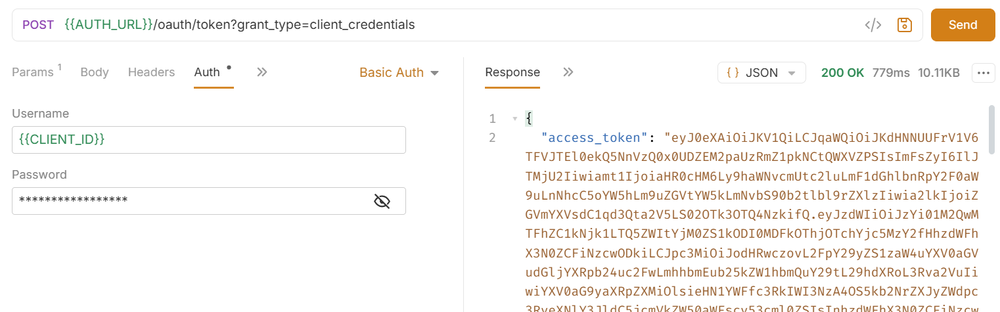
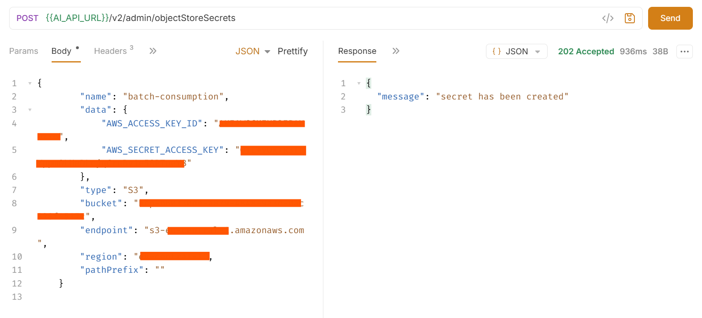
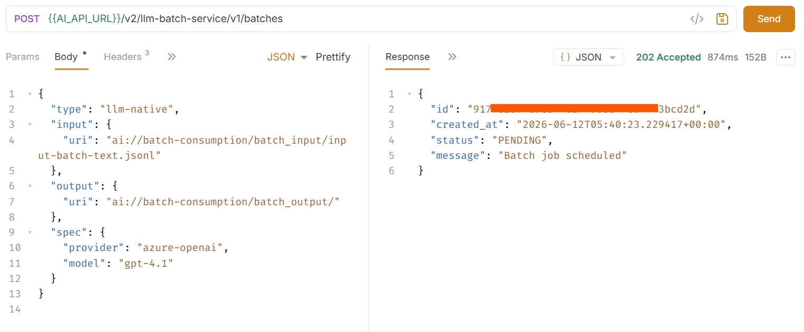
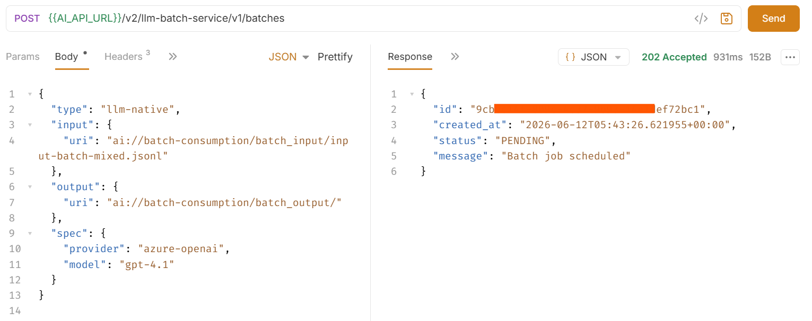
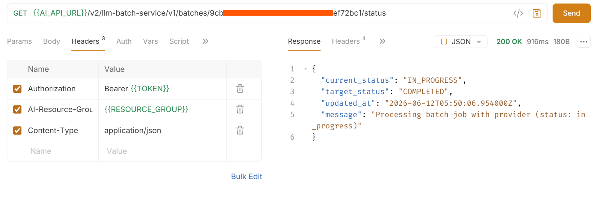
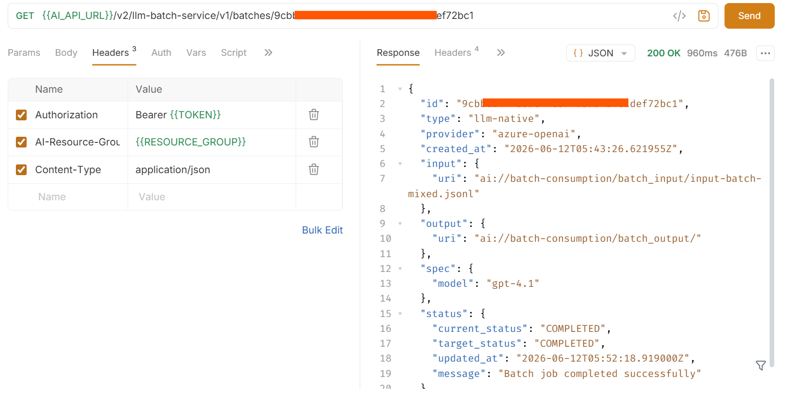
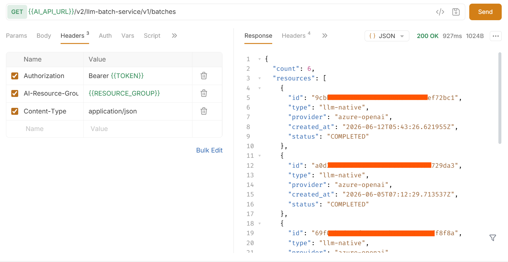
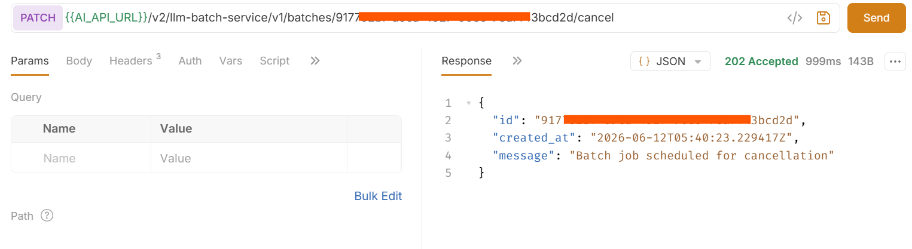
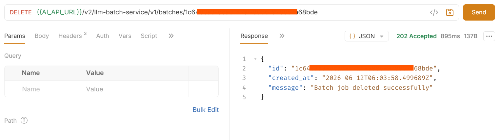

# Batch Consumption 
<!-- description --> This tutorial demonstrates how to use batch consumption in SAP AI Core to process multiple LLM requests asynchronously. You will submit two batch jobs — one with multiple text requests and one with mixed input types including text, base64 encoded images, and image URLs — and retrieve structured results from your object store.

## You Will Learn
- What the supported input types are and when to use each
- How to structure a JSONL input file with multiple requests of the same input type
- How to structure a JSONL input file containing multiple input types in a single batch
- How to create and submit a batch job using Bruno
- How to monitor batch job status and retrieve results

## Prerequisites
1. **BTP Account**  
   Set up your SAP Business Technology Platform (BTP) account.  
   [Create a BTP Account](https://developers.sap.com/group.btp-setup.html)
2. **For SAP Developers or Employees**  
   Internal SAP stakeholders should refer to the following documentation: [How to create BTP Account For Internal SAP Employee](https://me.sap.com/notes/3493139), [SAP AI Core Internal Documentation](https://help.sap.com/docs/sap-ai-core)
3. **For External Developers, Customers, or Partners**  
   Follow this tutorial to set up your environment and entitlements: [External Developer Setup Tutorial](https://developers.sap.com/tutorials/btp-cockpit-entitlements.html), [SAP AI Core External Documentation](https://help.sap.com/docs/sap-ai-core?version=CLOUD)
4. **Create BTP Instance and Service Key for SAP AI Core**  
   Follow the steps to create an instance and generate a service key for SAP AI Core:  
   [Create Service Key and Instance](https://help.sap.com/docs/sap-ai-core/sap-ai-core-service-guide/create-service-key?version=CLOUD)
5. **AI Core Setup Guide**  
   Step-by-step guide to set up and get started with SAP AI Core:  
   [AI Core Setup Tutorial](https://developers.sap.com/tutorials/ai-core-setup.html)
6. An Extended SAP AI Core service plan is required, as the Generative AI Hub is not available in the Free or Standard tiers. For more details, refer to 
[SAP AI Core Service Plans](https://help.sap.com/docs/sap-ai-core/sap-ai-core-service-guide/service-plans?version=CLOUD)
7. You have an object store secret registered in SAP AI Core for one of the following providers:
  - Amazon S3
  - Azure Blob Storage
  - Google Cloud Storage
  - Alibaba Cloud OSS
  For more information, see [Register Your Object Store Secret](https://help.sap.com/docs/AI_CORE)
8. **Bruno API Client**
   Download Bruno from [usebruno.com/downloads](https://www.usebruno.com/downloads)
9. **SAP Batch consumption Collection**
   Clone the SAP Batch consumption Bruno collection from [github.com PLACEHOLDER](https://github.com/SAP-samples/aicore-genai-samples/tree/main/genai-sample-apps/Batch_consumption)

### Pre-Read

#### What Is Batch Consumption?

Batch consumption lets you process large volumes of LLM inference requests asynchronously in SAP AI Core. You package all your requests into a single JSON Lines (`.jsonl`) file, upload it to your object store, and submit it as a batch job. SAP AI Core processes the requests in the background and writes all results to your object store in a single output file when complete.

#### When to Use Batch Consumption

Use batch consumption when:

- You have **50 or more requests** to process in one run
- Your workload is **not time-critical**
- You want to **reduce inference costs** compared to synchronous calls
- You want SAP AI Core to **manage retries and rate limits** automatically

Do not use batch consumption when:

- You need **real-time responses** (for example, a user-facing chat interface)
- Your requests use **orchestration pipelines** — only native LLM calls are supported

#### Batch Consumption vs Other Asynchronous Approaches

| Aspect | Batch Consumption | Custom Async Orchestration | Message Queue |
|---|---|---|---|
| **Setup complexity** | Low — single API call | Medium — custom code required | High — integration design required |
| **Rate limit handling** | Automatic | Manual | Manual or platform-managed |
| **Cost** | Reduced vs synchronous | Same as synchronous | Additional platform cost |
| **Best for** | Bulk LLM workloads, offline processing | Moderate volumes, custom workflows | Event-driven, cross-system pipelines |

#### Key Constraints

- Supports **native LLM calls only** — orchestration requests are not supported
- All requests in a single batch job must use the **same model**
- Output lines are **not guaranteed to be in the same order as input lines** — always use `custom_id` to match responses to requests

#### Batch Limits

| Limit | Value |
|---|---|
| Maximum input file size | 200 MB |
| Maximum requests per file | 100,000 |
| Maximum input files (no expiry set) | 500 |
| Maximum input files (expiry set) | 10,000 |

### Architecture

```
┌─────────────────────────────────────────────────────────────────────┐
│  Online Retailer — Mixed Product Inputs                              │
│                                                                      │
│  ┌─────────────┐  ┌─────────────┐  ┌─────────────┐  ┌───────────┐  │
│  │ Customer    │  │ Product     │  │ Product     │  │ Product   │  │
│  │ Review      │  │ Image       │  │ Image       │  │ Descrip-  │  │
│  │ (text)      │  │ (base64)    │  │ (URL)       │  │ tion      │  │
│  └──────┬──────┘  └──────┬──────┘  └──────┬──────┘  └─────┬─────┘  │
└─────────┼────────────────┼────────────────┼───────────────┼─────────┘
          └────────────────┴────────────────┴───────────────┘
                                    │
                                    │ Package as JSONL
                                    ▼
                       ┌────────────────────────┐
                       │  input-batch-mixed.jsonl│
                       │  (4 requests)           │
                       └────────────┬───────────┘
                                    │ Upload
                                    ▼
                       ┌────────────────────────┐
                       │  Object Store          │
                       │  (S3 / Azure / GCS /   │
                       │   Alibaba OSS)         │
                       └────────────┬───────────┘
                                    │ ai:// URI
                                    ▼
                       ┌────────────────────────┐
                       │  SAP AI Core           │
                       │  Batch Job             │
                       │  POST /v1/batches      │
                       └────────────┬───────────┘
                                    │ Async processing
                                    ▼
                       ┌────────────────────────┐
                       │  LLM Provider          │
                       │  (azure-openai)        │
                       └────────────┬───────────┘
                                    │ Results
                                    ▼
                       ┌────────────────────────┐
                       │  Object Store          │
                       │  output/<batch_id>/    │
                       │  output.jsonl          │
                       │  (single file, N lines)│
                       └────────────────────────┘
```
### Step 1: Connect to SAP AI Core Instance

[OPTION BEGIN [Bruno]]

1. Download and import the **SAP AI Core — Batch Consumption** Bruno collection provided with this tutorial in prerequisites section

2. In Bruno, open the collection and navigate to the **SAP-AI-Core** environment. Set the following variables using the values from your SAP AI Core service key:

    | Variable | Value |
    |---|---|
    | `AI_API_URL` | `serviceurls.AI_API_URL` from your service key |
    | `AUTH_URL` | `url` from your service key (without trailing slash) |
    | `CLIENT_ID` | `clientid` from your service key |
    | `CLIENT_SECRET` | `clientsecret` from your service key |
    | `RESOURCE_GROUP` | Your SAP AI Core resource group (e.g. `default`) |



3. Under the **01 - Get Token** folder, select the **Get Token** request and send it. The token is automatically saved to the `TOKEN` environment variable and used in all subsequent requests.



[OPTION END]

### Step 2: Register an Object Store Secret

Generic secrets securely store object store credentials required for batch input and output file access.

[OPTION BEGIN [Bruno]]

Under the **02 - Object Store Secret** folder, select the **Create Object Store Secret** request.

Use the following payload to create a secret for AWS S3:

```json
{
    "name": "batch-consumption",
    "data": {
        "AWS_ACCESS_KEY_ID": "<access key id>",
        "AWS_SECRET_ACCESS_KEY": "<secret access key>"
    },
    "type": "S3",
    "bucket": "<bucket>",
    "endpoint": "<url>",
    "region": "<region>",
    "pathPrefix": ""
}
```

> **Note:** All values in the `data` dictionary must be Base64-encoded as per AWS S3 credential requirements.



[OPTION END]

### Step 3: Prepare Your Input File

Batch jobs require a **JSON Lines (`.jsonl`)** file as input. Each line is a self-contained JSON object representing one inference request. Lines must not be separated by commas, and the file must end with a newline after the last line.

#### Required Fields Per Line

| Field | Description |
|---|---|
| `custom_id` | Unique identifier for the request. Used to match each response to its input. |
| `method` | HTTP method. Only `POST` is supported. |
| `url` | Inference endpoint. Only `/v1/chat/completions` is supported. |
| `body` | Request body. Must include `model` and `messages`. Add `response_format` for structured output requests. |

> **Note:** All requests in the file must use the same model.

#### Supported Input Types

The batch service supports three input types. Each uses a different structure for the `body.messages[].content` field.

**Standard Text Input**

The `content` field is a plain string. Use this for text documents, Q&A, classification, or summarisation.

```json
{
  "role": "user",
  "content": "Your prompt text here."
}
```

**Base64 Encoded Image Input**

The `content` field is an array containing a text prompt and an image as a base64-encoded data URI. Use this when your image is stored locally or is not publicly accessible.

```json
{
  "role": "user",
  "content": [
    { "type": "text", "text": "Describe this image." },
    { "type": "image_url", "image_url": { "url": "data:image/png;base64,<base64_string>" } }
  ]
}
```

> **Note:** Base64 encoding increases the size of your JSONL file. For large images, prefer the image URL approach where possible.

**Image URL Input**

The `content` field is an array containing a text prompt and a publicly accessible image URL. The LLM provider fetches the image at processing time.

```json
{
  "role": "user",
  "content": [
    { "type": "text", "text": "Describe this image." },
    { "type": "image_url", "image_url": { "url": "https://your-public-cdn.com/image.png", "detail": "high" } }
  ]
}
```

> **Important:** The image URL must be reachable by the LLM provider's servers at processing time — not just from your browser. GitHub raw URLs, internal network URLs, and short-expiry presigned URLs will fail with a `400` error. Use stable public CDN or object store URLs.


### Batch Example 1 — Multiple Requests of the Same Input Type

The `input-batch-text.jsonl` file contains three text requests in a single batch job.

**request-1** 

```jsonl
{"custom_id": "request-1", "method": "POST", "url": "/v1/chat/completions", "body": {"model": "gpt-4.1", "messages": [{"role": "system", "content": "You are a helpful assistant"}, {"role": "user", "content": "What is SAP AI Core and what are its key capabilities?"}]}}
```

**request-2**

```jsonl
{"custom_id": "request-2", "method": "POST", "url": "/v1/chat/completions", "body": {"model": "gpt-4.1", "messages": [{"role": "system", "content": "You are a helpful assistant"}, {"role": "user", "content": "What is Agentic AI and how does it differ from traditional AI systems?"}]}}
```

**request-3** 

```jsonl
{"custom_id": "request-3", "method": "POST", "url": "/v1/chat/completions", "body": {"model": "gpt-4.1", "messages": [{"role": "system", "content": "You are a helpful assistant"}, {"role": "user", "content": "Given the following context about a facility management company:\n---\n Facility Solutions manages over 500 commercial buildings across 12 cities. Their services include HVAC maintenance, cleaning, security, and emergency repairs. They receive an average of 200 service requests daily and prioritise them based on urgency and SLA levels.\n---\nBased on this context, what AI use cases would be most valuable to implement?"}]}}
```

> **Note:** `request-3` demonstrates how to pass a short context passage alongside a question. The context is embedded directly in the `user` message — no special formatting is required by the batch service.

### Batch Example 2 — Multiple Requests of Different Input Types

The `input-batch-mixed.jsonl` file contains four requests — one per input type.

**request-1 — Standard Text**

```jsonl
{"custom_id": "request-1", "method": "POST", "url": "/v1/chat/completions", "body": {"model": "gpt-4.1", "messages": [{"role": "system", "content": "You are a helpful assistant"}, {"role": "user", "content": "Analyse the following customer review and return a JSON with keys: \"sentiment\" (`positive`, `neutral`, `negative`), \"category\" (`product_quality`, `delivery`, `customer_service`, `pricing`, `general`), and \"summary\" (one sentence). Return only a valid compact JSON string.\n\nReview:\n---\nI recently purchased the wireless headphones and I am extremely satisfied with the sound quality. The noise cancellation works brilliantly, battery life lasts a full day, and delivery was prompt. Highly recommend!\n---"}]}}
```

**request-2 — Base64 Encoded Image**

```jsonl
{"custom_id": "request-2", "method": "POST", "url": "/v1/chat/completions", "body": {"model": "gpt-4.1", "messages": [{"role": "system", "content": "You are a helpful assistant"}, {"role": "user", "content": [{"type": "text", "text": "This is a product image from our retail catalogue. Describe the product, its appearance, colour, and whether the image quality is suitable for a product listing."}, {"type": "image_url", "image_url": {"url": "data:image/png;base64,<base64_encoded_product_image>"}}]}], "max_tokens": 1000}}
```

**request-3 — Image URL**

```jsonl
{"custom_id": "request-3", "method": "POST", "url": "/v1/chat/completions", "body": {"model": "gpt-4.1", "messages": [{"role": "system", "content": "You are a helpful assistant"}, {"role": "user", "content": [{"type": "text", "text": "This is a product image from our online catalogue. Describe the product, its key visual attributes, and whether it appears suitable for a retail product listing."}, {"type": "image_url", "image_url": {"url": "https://your-public-cdn.com/product-image.png", "detail": "high"}}]}], "max_tokens": 1000}}
```

**request-4 — Structured Output**

```jsonl
{"custom_id": "request-4", "method": "POST", "url": "/v1/chat/completions", "body": {"model": "gpt-4.1", "messages": [{"role": "system", "content": "You are a helpful assistant"}, {"role": "user", "content": "Extract the product details from the following description:\n---\nProduct: UltraSound Pro Wireless Headphones. Premium over-ear headphones with 40-hour battery life and active noise cancellation. Available in Midnight Black and Arctic White. Currently in stock. Rated 4.7 out of 5 by over 2,300 customers. Price: $149.99.\n---"}], "response_format": {"type": "json_schema", "json_schema": {"name": "ProductDetailsResponse", "strict": true, "schema": {"type": "object", "properties": {"product_name": {"type": "string"}, "category": {"type": "string"}, "price": {"type": "string"}, "availability": {"type": "string"}, "rating": {"type": "string"}}, "required": ["product_name", "category", "price", "availability", "rating"], "additionalProperties": false}}}}}
```

> **Note:** For `request-2`, replace `<base64_encoded_product_image>` with your actual base64 image string. For `request-3`, replace the URL with a stable, publicly accessible URL reachable by the LLM provider's servers.

### Step 4: Upload Your Input File to the Object Store

Upload your input file to your object store. SAP AI Core accesses it using the `ai://` URI scheme, which maps to a registered object store secret.

**URI Format**

```
ai://<object_store_secret_name>/<file_path>/<file_name>.jsonl
```

**Examples:**

```
ai://batch-consumption/batch_input/input-batch-text.jsonl
ai://batch-consumption/batch_input/input-batch-mixed.jsonl
```

> **Note:** Decide on your output folder URI now — you will need it in the next step. The output URI must end with `/`.

**Example output URI:**

```
ai://batch-consumption/batch_output/
```

### Step 5: Create a Batch Job

[OPTION BEGIN [Bruno]]

Under the **03 - Batch Job** folder, select the **Create Batch Job** request.

The headers are pre-configured in the collection. In the **Body** tab, update the `input.uri` and `output.uri` values with your actual object store paths:

```json
{
  "type": "llm-native",
  "input": {
    "uri": "ai://retail-store/batch_input/input-batch-mixed.jsonl"
  },
  "output": {
    "uri": "ai://retail-store/batch_output/"
  },
  "spec": {
    "provider": "azure-openai",
    "model": "gpt-4.1"
  }
}
```





> **Note:** The `output.uri` must end with `/`. The `spec.model` value must exactly match the model name used in your input file. To run Batch Example 1, replace the `input.uri` value with the path to `input-batch-text.jsonl`.

Send the request.

#### Request Parameters

| Parameter | Type | Description |
|---|---|---|
| `type` | string | Batch processing type. Only `llm-native` is supported. |
| `input.uri` | string | URI of the input JSONL file in the object store. |
| `output.uri` | string | URI of the output directory in the object store. Must end with `/`. |
| `spec.provider` | string | LLM provider. Only `azure-openai` is supported. |
| `spec.model` | string | Model name. Must match the model used in the input file. |

#### Result

```json
{
  "id": "9c4f-xxxx-xxxx-xxxx-ef72bc1",
  "created_at": "2026-06-12T05:43:26.621955+00:00",
  "status": "PENDING",
  "message": "Batch job scheduled"
}
```

**Save the `id` value.** The batch ID is automatically saved to the `BATCH_ID` environment variable in Bruno and used in all subsequent requests.

[OPTION END]

### Step 6: Check Batch Job Status

[OPTION BEGIN [Bruno]]

Under the **03 - Batch Job** folder, select the **Check Batch Status** request and send it.

#### Result

```json
{
  "current_status": "IN_PROGRESS",
  "target_status": "COMPLETED",
  "updated_at": "2026-01-07T10:35:00Z",
  "message": "Processing batch requests"
}
```


#### Status Reference

| Status | Description |
|---|---|
| `PENDING` | Job is queued and waiting to start. |
| `PREPARING_INPUT` | Input file is being validated and prepared for the LLM provider. |
| `INPUT_PREPARED` | Input file is ready. Job will be submitted to the provider shortly. |
| `IN_PROGRESS` | Job is actively being processed by the LLM provider. |
| `PREPARING_OUTPUT` | Processing complete. Output files are being written to the object store. |
| `COMPLETED` | Processing finished successfully. Output files are available in the object store. |
| `FAILED` | Processing encountered an error. |
| `CANCELLED` | Job was cancelled by the user. |

Resend the request periodically until `current_status` is `COMPLETED` before proceeding.

[OPTION END]

### Step 7: Retrieve and Interpret Your Results

Once the batch status is `COMPLETED`, download the output file from your object store.

**Output File Location**

```
ai://batch-consumption/batch_output/<batch_id>/output.jsonl
```

If any individual requests failed, an error file is written alongside:

```
ai://batch-consumption/batch_output/<batch_id>/error.jsonl
```

> **Note:** A `COMPLETED` status means the batch as a whole was processed. Individual requests may still have failed. Always check `response.status_code` for every line in the output file.


#### Results: Batch Example 1

The output file contains three response lines — one per text request. Output order is not guaranteed — always use `custom_id` to match responses to inputs.

```jsonl
{"custom_id": "request-1", "response": {"body": {"choices": [{"message": {"content": "SAP AI Core is a service within the SAP Business Technology Platform that enables lifecycle management of AI functions. Key capabilities include training and deploying AI models at scale, serving LLM inference via the Generative AI Hub, and providing observability for deployed AI workloads."}}]}, "status_code": 200}, "error": null}
{"custom_id": "request-3", "response": {"body": {"choices": [{"message": {"content": "Valuable AI use cases for ProCare include: 1) Automated request triage using NLP to classify and route service requests by urgency and SLA. 2) Predictive maintenance to anticipate equipment failures. 3) Intelligent scheduling to assign technicians based on location and workload. 4) Sentiment analysis on customer communications to proactively identify dissatisfied clients."}}]}, "status_code": 200}, "error": null}
{"custom_id": "request-2", "response": {"body": {"choices": [{"message": {"content": "Agentic AI refers to systems that autonomously plan and execute sequences of actions to achieve a goal — using tools, APIs, or other AI models — with minimal human intervention. Unlike traditional AI that maps a single input to a single output, agentic systems maintain goals across multiple steps, adapt based on intermediate results, and interact with external environments."}}]}, "status_code": 200}, "error": null}
```

| `custom_id` | Status | Output |
|---|---|---|
| `request-1` | ✅ `200` | Description of SAP AI Core and its capabilities |
| `request-2` | ✅ `200` | Explanation of Agentic AI vs traditional AI |
| `request-3` | ✅ `200` | AI use case recommendations based on the provided context |

#### Results: Batch Example 2

The output file contains four response lines — one per input type.

```jsonl
{"custom_id": "request-1", "response": {"body": {"choices": [{"message": {"content": "{\"sentiment\":\"positive\",\"category\":\"product_quality\",\"summary\":\"The customer is highly satisfied with the sound quality, noise cancellation, battery life, and delivery of the wireless headphones.\"}"}}]}, "status_code": 200}, "error": null}
{"custom_id": "request-4", "response": {"body": {"choices": [{"message": {"content": "{\"product_name\":\"UltraSound Pro Wireless Headphones\",\"category\":\"Electronics\",\"price\":\"$149.99\",\"availability\":\"In stock\",\"rating\":\"4.7 out of 5\"}"}}]}, "status_code": 200}, "error": null}
{"custom_id": "request-2", "response": {"body": {"choices": [{"message": {"content": "The image appears to show a small graphical icon rather than a full product photograph. The image resolution is not suitable for a retail product listing. Please provide a high-resolution product photograph."}}]}, "status_code": 200}, "error": null}
{"custom_id": "request-3", "response": {"body": {"choices": [{"message": {"content": "The image shows a pair of over-ear wireless headphones in Midnight Black. The earcups are large and padded with a sleek matte finish. The product is well-lit against a clean white background, making it suitable for a retail product listing."}}]}, "status_code": 200}, "error": null}
```

| `custom_id` | Input Type | Status | Key Output |
|---|---|---|---|
| `request-1` | Standard text | ✅ `200` | `sentiment: positive`, `category: product_quality` with one-line summary |
| `request-2` | Base64 image | ✅ `200` | Placeholder image flagged as unsuitable — provide a real product photo |
| `request-3` | Image URL | ✅ `200` | Visual description of headphones — suitable for catalogue listing |
| `request-4` | Structured output | ✅ `200` | Typed JSON with product_name, category, price, availability, rating |

> **Note:** `status_code: 200` means the request was processed without error. It does not mean the LLM produced the output you expected — always review the `content` field.

### Step 8: Manage Your Batch Jobs

**Get Batch Details**

[OPTION BEGIN [Bruno]]

Under the **04 - Manage Batch Jobs** folder, select the **Get Batch Details** request and send it.

**Result:**

```json
{
  "id": "9c14f-xxxx-xxxx-xxxx-f72bc1",
  "type": "llm-native",
  "provider": "azure-openai",
  "created_at": "2026-01-07T10:30:00Z",
  "input": { "uri": "ai://batch-consumption/batch_input/input-batch-mixed.jsonl" },
  "output": { "uri": "ai://batch-consumption/batch_output/" },
  "spec": { "model": "gpt-4.1" },
  "status": {
    "current_status": "COMPLETED",
    "target_status": "COMPLETED",
    "updated_at": "2026-01-07T10:45:00Z",
    "message": "Batch job completed successfully"
  }
}
```



**List Batch Jobs**

Under the **04 - Manage Batch Jobs** folder, select the **List Batch Jobs** request and send it.

**Result:**

```json
{
  "count": 2,
  "resources": [
    { "id": "9c14f-xxxx-xxxx-xxxx-f72bc1", "type": "llm-native", "provider": "azure-openai", "created_at": "2026-01-07T10:30:00Z", "status": "COMPLETED" },
    { "id": "666891-xxxx-xxxx-xxxx-557766551111", "type": "llm-native", "provider": "azure-openai", "created_at": "2026-01-07T11:00:00Z", "status": "IN_PROGRESS" }
  ]
}
```


#### Cancel a Batch Job

Under the **04 - Manage Batch Jobs** folder, select the **Cancel Batch Job** request and send it.

> **Note:** Cancellation is asynchronous. The job transitions to `CANCELLED` after any in-flight provider requests are terminated. Use Step 5 to confirm cancellation status.



#### Delete a Batch Job

Deleting a job removes its metadata from the service. Output files in the object store are not affected.

> **Restriction:** Only jobs in `COMPLETED`, `FAILED`, or `CANCELLED` state can be deleted.

Under the **04 - Manage Batch Jobs** folder, select the **Delete Batch Job** request and send it.



[OPTION END]

### Troubleshooting

**Error Codes**

| Error Code | Description | Resolution |
|---|---|---|
| `invalid_json_line` | One or more lines could not be parsed as valid JSON. | Validate each line with a JSON parser before uploading. |
| `too_many_tasks` | Requests in the file exceed the 100,000 limit. | Split into smaller files and submit separate batch jobs. |
| `url_mismatch` | A line has a URL that does not match `/v1/chat/completions`. | Ensure all lines use the same endpoint. |
| `model_not_found` | The model name in the `model` field was not found. | Verify the model name matches a valid deployment in your resource group. |
| `duplicate_custom_id` | Two or more requests share the same `custom_id`. | Ensure all `custom_id` values are unique across the file. |
| `empty_file` | The input file contains no requests. | Ensure the file has at least one valid JSON line. |
| `model_mismatch` | The `model` field differs across lines. | All requests in a batch file must use the same model. |
| `invalid_request` | A line is missing required fields or has an invalid schema. | Check that all lines include `custom_id`, `method`, `url`, and `body`. |

> **Note:** Input JSONL files must be encoded as plain **UTF-8**. Files saved with a Byte-Order-Mark (BOM) — common on Windows — will fail validation. Save explicitly as UTF-8 without BOM.
