# Custom Evaluation for Generative AI – Comprehensive Guide
<!-- description -->  This tutorial demonstrates how to use SAP AI Core Custom Evaluation to benchmark Large Language Models (LLMs) using **Orchestration Registry**. It guides you through  environment setup, configuration creation, execution, and result analysis in a unified and simplified workflow.

It extends the Quick Start tutorial and is intended for Application Developers and Data Scientists who already know the basics of GenAI workflows in SAP AI Core.

## You will learn
- How to prepare and organize datasets for evaluation.
- How to configure and run evaluations in SAP AI Core.
- How to analyze and interpret aggregated evaluation results.

## Prerequisites
1. **BTP Account**  
   Set up your SAP Business Technology Platform (BTP) account.  
   [Create a BTP Account](https://developers.sap.com/group.btp-setup.html)
2. **For SAP Developers or Employees**  
   Internal SAP stakeholders should refer to the following documentation: [How to create BTP Account For Internal SAP Employee](https://me.sap.com/notes/3493139), [SAP AI Core Internal Documentation](https://help.sap.com/docs/sap-ai-core)
3. **For External Developers, Customers, or Partners**  
   Follow this tutorial to set up your environment and entitlements: [External Developer Setup Tutorial](https://developers.sap.com/tutorials/btp-cockpit-entitlements.html), [SAP AI Core External Documentation](https://help.sap.com/docs/sap-ai-core?version=CLOUD)
4. **Create BTP Instance and Service Key for SAP AI Core**  
   Follow the steps to create an instance and generate a service key for SAP AI Core:  
   [Create Service Key and Instance](https://help.sap.com/docs/sap-ai-core/sap-ai-core-service-guide/create-service-key?version=CLOUD)
5. **AI Core Setup Guide**  
   Step-by-step guide to set up and get started with SAP AI Core:  
   [AI Core Setup Tutorial](https://developers.sap.com/tutorials/ai-core-setup.html)
6. An Extended SAP AI Core service plan is required, as the Generative AI Hub is not available in the Free or Standard tiers. For more details, refer to 
[SAP AI Core Service Plans](https://help.sap.com/docs/sap-ai-core/sap-ai-core-service-guide/service-plans?version=CLOUD)
7. **Orchestration Deployment**
   Ensure at least one orchestration deployment is ready to be consumed during this process. 
Refer to [this tutorial understand the basic consumption of GenAI models using orchestration.](https://developers.sap.com/tutorials/ai-core-orchestration-consumption.html)
8. **Basic Knowledge**
    Familiarity with the orchestration workflow is recommended
9. **Install Dependencies**
    Install the required Python packages using the requirements.txt file provided.
Download [requirements.txt](img/requirements.txt)

💡 Right-click the link above and choose **"Save link as..."** to download it directly.

## Pre-Read

This tutorial which showcases how a user can use AI Core custom evaluation to benchmark their large language models, evaluate orchestration configuration or prompts for their use case.
It uses publicly available [MedicationQA dataset](https://langtest.org/docs/pages/benchmarks/medical/medicationqa/) which consists of commonly asked consumer questions about medications. The workload computes industry standard metrics to check the reliability of the response generate by llm.

### Environment Variables Setup

[OPTION BEGIN [SAP AI Launchpad]]

- Navigate to your SAP AI Core Launchpad.

- In the Workspaces section, click on "Add" to create a new workspace.
    - A workspace in SAP AI Core is a logical container that holds your resources (like models and pipelines) and provides the isolation needed for your projects.

- When prompted, enter your AI Core credentials (such as Client ID, Client Secret, and Base URL).
    - Note: If you're unsure about where to find these credentials, refer to this [guide](https://developers.sap.com/tutorials/ai-core-generative-ai.html#1c4f36d7-f345-4822-be00-c15f133ff7d8). 

- Once the workspace is successfully created, select your desired Resource Group to begin the evaluation process.

Refer to the screenshot below for guidance:


[OPTION END]

[OPTION BEGIN [Python]]

- Open **Visual Studio Code or Jupyter Notebook**. Create a new file with the .ipynb extension (e.g., custom_evaluation.ipynb).
- Create a **.env** file in the root directory of your project.
- Add your **AI Core** and **AWS credentials** as shown below.

```env
# AICORE CREDENTIALS
AICORE_CLIENT_ID=<AICORE CLIENT ID>  
AICORE_CLIENT_SECRET=<AICORE CLIENT SECRET>
AICORE_AUTH_URL=<AICORE AUTH URL>
AICORE_BASE_URL=<AICORE BASE URL>
AICORE_RESOURCE_GROUP=<AICORE RESOURCE GROUP>

# AWS CREDENTIALS
AWS_ACCESS_KEY=<AWS ACCESS KEY>
AWS_BUCKET_ID=<AWS BUCKET ID>
AWS_REGION=<AWS REGION>
AWS_SECRET_ACCESS_KEY=<AWS SECRET ACCESS KEY> 

# ORCHESTRATION DEPLOYMENT URL
DEPLOYMENT_URL=<DEPLOYMENT URL>
```

**Note:** Replace placeholders (e.g., CLIENT_ID, CLIENT_SECRET, etc) with your actual environment credentials.

Refer to the below screenshot for clarity:
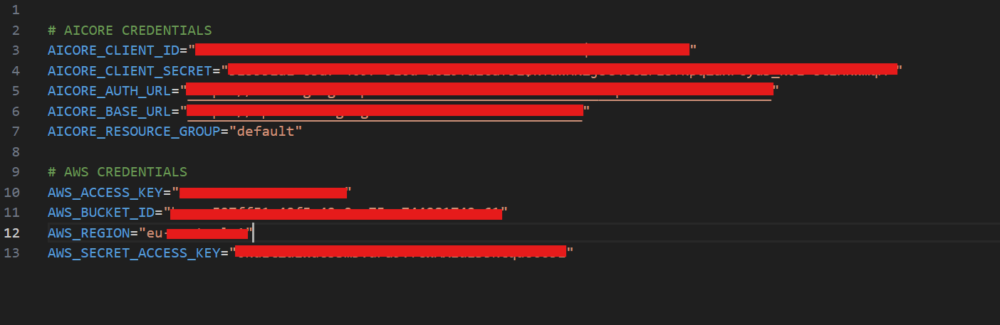

#### Install Dependencies

Install the required packages using the [requirements.txt](img/requirements.txt) file you downloaded in the Prerequisites section.
```bash
pip install -r requirements.txt
```
#### Connect to AI Core Instance

Once the environment variables are set and dependencies are installed, run the following code to connect to your instance:

```PYTHON
# Loading the credentials from the env file
from gen_ai_hub.proxy.gen_ai_hub_proxy import GenAIHubProxyClient
from dotenv import load_dotenv
import os

load_dotenv(override=True)

# Fetching environment variables
AICORE_BASE_URL = os.getenv("AICORE_BASE_URL")
AICORE_RESOURCE_GROUP = os.getenv("AICORE_RESOURCE_GROUP")
AICORE_AUTH_URL = os.getenv("AICORE_AUTH_URL")
AICORE_CLIENT_ID = os.getenv("AICORE_CLIENT_ID")
AICORE_CLIENT_SECRET = os.getenv("AICORE_CLIENT_SECRET")

AWS_ACCESS_KEY = os.getenv("AWS_ACCESS_KEY")
AWS_BUCKET_ID = os.getenv("AWS_BUCKET_ID")
AWS_REGION = os.getenv("AWS_REGION")
AWS_SECRET_ACCESS_KEY = os.getenv("AWS_SECRET_ACCESS_KEY")
DEPLOYMENT_URL = os.getenv("DEPLOYMENT_URL")

# Initializing the GenAIHubProxyClient
client = GenAIHubProxyClient(
    base_url=AICORE_BASE_URL,
    auth_url=AICORE_AUTH_URL,
    client_id=AICORE_CLIENT_ID,
    client_secret=AICORE_CLIENT_SECRET,
    resource_group=AICORE_RESOURCE_GROUP
)
```

**NOTE:** 
- Ensure the **requirements.txt** installation completes successfully before running the code.
- If you face any issues, recheck your **.env** values and installed packages.

[OPTION END]

[OPTION BEGIN [Bruno]]

- Download the [Bruno_collections](img/AI_Core.json) file

- please follow the steps in the [Tutorial](https://developers.sap.com/tutorials/ai-core-orchestration-consumption.html) to set up your environment, refer step - **Set Up Your Environment and Configure Access** and proceed till generating the token

[OPTION END]

### Preparing Dataset Files

[OPTION BEGIN [SAP AI Launchpad]]

> **Note:** This step involves local setup using Python and does not require any action on the SAP AI Launchpad.

[OPTION END]

[OPTION BEGIN [Python]]

In this step, the evaluation notebook dynamically detects the dataset file from a predefined folder structure.
You are not required to hardcode the dataset filename.

```Python
import os
import json


def get_dataset_file_name(folder_path):
    """
    Retrieves the name of the first file in the specified folder.
    """
    if not os.path.isdir(folder_path):
        print(f"The folder path '{folder_path}' does not exist.")
        return None

    items_in_folder = os.listdir(folder_path)

    for item in items_in_folder:
        item_path = os.path.join(folder_path, item)
        if os.path.isfile(item_path):
            return item

    print(f"No files were found in the folder '{folder_path}'.")
    return None


# --- MAIN EXECUTION ---
DATASET_FOLDER = "../DATASET"

DATASET_NAME = get_dataset_file_name(DATASET_FOLDER)

if DATASET_NAME:
    print(f"Dataset name: {DATASET_NAME}")
else:
    print("Missing run or dataset file.")
    raise SystemExit("Exiting due to missing run/dataset file.")
```

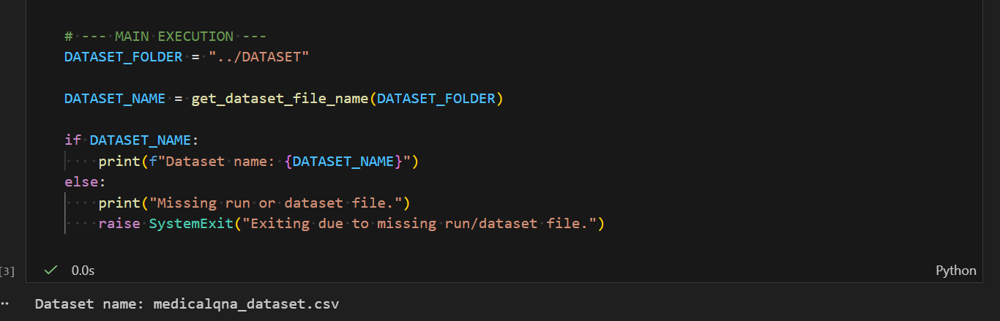

[OPTION END]

[OPTION BEGIN [Bruno]]

> **Note:** This step involves local setup using Python and does not require any action on Bruno.

[OPTION END]

### Registering an Object Store Secret in AI Core

[OPTION BEGIN [SAP AI Launchpad]]

- Open the **SAP AI Core Launchpad** and navigate to the **Administration** tab.
- Select the **Object Store** section from the left-hand menu.
- Click on **“Add”** to register a new object store secret.
- Fill in the required bucket details as shown in the screenshot below.

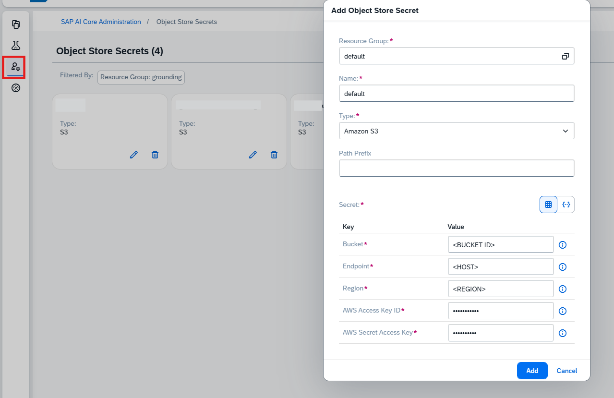

In the **Secret** field, use the following structure to provide your AWS credentials:

```json
{
    "AWS_ACCESS_KEY_ID": "Enter Your value",
    "AWS_SECRET_ACCESS_KEY": "Enter Your value"
}
```

[OPTION END]

[OPTION BEGIN [Python]]

To make your evaluation files available for AI Core orchestration, you need to:

- Upload them to an object store (e.g., AWS S3).
- Register the object store secret in AI Core.

#### **Setup Authentication and Headers**

First, define the authentication headers for AI Core REST API calls.

```PYTHON
def _get_headers():
    headers = {
        "Authorization": client.get_ai_core_token(),
        "AI-Resource-Group": AICORE_RESOURCE_GROUP,
        "Content-Type": "application/json",
    }
    return headers
```

#### **Register Object Store Secret in AI Core**

Register your S3 bucket and credentials as a secret.

```PYTHON
# Register S3 secret with AI Core which will be used an input source 
import requests
import json
import logging

def delete_oss_secret(oss_name=""):
    headers = _get_headers()
    
    DELETE_SECRETS_ENDPOINT = f'/v2/admin/objectStoreSecrets/{oss_name}'
    request_url = f"{AICORE_BASE_URL}{DELETE_SECRETS_ENDPOINT}"
    
    try:
        response = requests.delete(request_url, headers=headers, timeout=120)
        if response.status_code == 202:
            print(f"Successfully deleted object store secret: {oss_name}")
        elif response.status_code == 404:
            print(f"Object store secret not found: {oss_name}. It may not exist.")
        else:
            logging.error(f"Failed to delete object store secret: {oss_name}, Status Code: {response.status_code}")
    except Exception as e:
        logging.error(f"Error occurred while attempting to delete object store secret: {e}")
        raise

def register_oss_secret(oss_name="", path_prefix=""):
    headers = _get_headers()
    
    POST_SECRETS_ENDPOINT = '/v2/admin/objectStoreSecrets'
    request_url = f"{AICORE_BASE_URL}{POST_SECRETS_ENDPOINT}"
    
    request_body = {
        "name": oss_name,
        "data": {
            "AWS_ACCESS_KEY_ID": AWS_ACCESS_KEY,
            "AWS_SECRET_ACCESS_KEY": AWS_SECRET_ACCESS_KEY
        },
        "type": "S3",
        "bucket": AWS_BUCKET_ID,
        "endpoint": "s3-eu-central-1.amazonaws.com",
        "region": AWS_REGION,
        "pathPrefix": path_prefix,
        "verifyssl": "0",
        "usehttps": "1",
    }
    try:
        response = requests.post(
            request_url, headers=headers, data=json.dumps(request_body), timeout=120
        )
        result = response.json()
        return result
    except:
        logging.error("Error occurred while attempting to create object store secret")
        raise
        
delete_oss_secret(oss_name="default")
delete_oss_secret(oss_name="genai-simplified-notebook")
        
register_oss_secret(oss_name="default", path_prefix="")
register_oss_secret(oss_name="genai-simplified-notebook", path_prefix="")
```

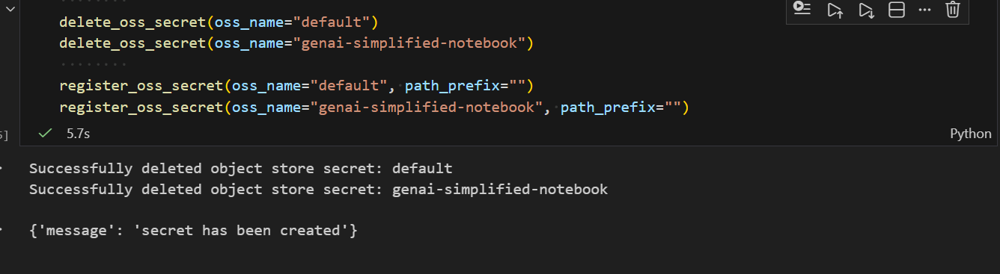

[OPTION END]

[OPTION BEGIN [Bruno]]

Generic secrets securely store AWS S3 credentials required for document access

•	Expand **objectStoreSecrets** under admin and select create a secret request

Use the below payload to create a secret for AWS S3 with NoAuthentication as authentication type.

```CODE
{
    "name": "genai-data",
    "data": {
        "AWS_ACCESS_KEY_ID": "<access key id>",
        "AWS_SECRET_ACCESS_KEY": "<secret access key>", 
    },
    "type": "S3",
    "bucket": "<bucket>",
    "endpoint": "<url>",
    "region": "<region>",
    "pathPrefix": ""    
    }
```
• Ensure that all values in the data dictionary are Base64-encoded as per AWS S3 credential requirements


[OPTION END]

> ⚠️ **Important Note (Must Read)**
>
> - You must **create an object store secret** with a user defined name (for eg: default) to store **output artifacts** from orchestration runs. This is **mandatory**.
> - For **input artifacts**, you may create additional object store secrets with different names if needed.
> - If a user defined name (for eg: default) is not configured, orchestration runs will **fail** due to missing output target setup.


### Upload and Register Dataset

[OPTION BEGIN [SAP AI Launchpad]]

After creating the secret, upload your evaluation files to the S3 bucket and register them as an artifact in AI Core.

#### **Register Uploaded Files as Artifact in AI Core**

To register your evaluation dataset with SAP AI Core, you need to upload it as an artifact. Follow the instructions below using the **SAP AI Launchpad UI**.

---

- Open the **SAP AI Core Launchpad**.
- Navigate to the **Generative AI/Optimization/Artifacts** section to create dataset artifact.

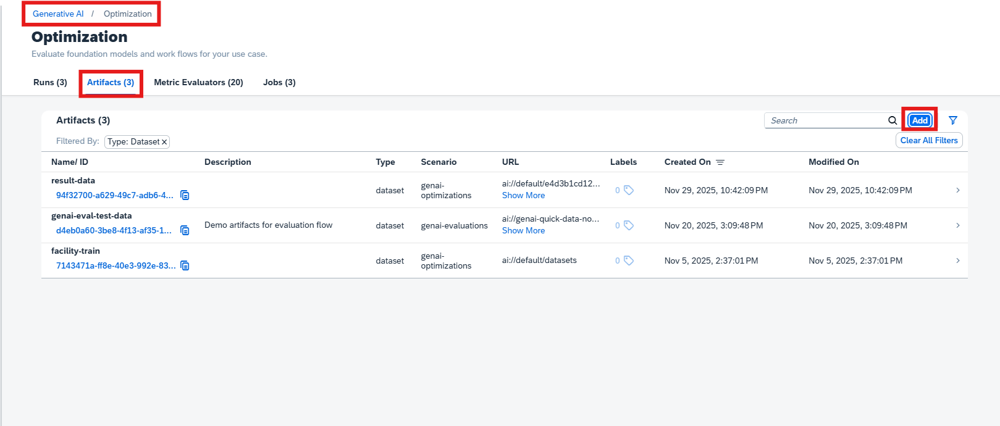

- On the **Artifacts** section, click **add**.

---

- On the **General Information** screen, enter the following:

  - **Select Scenario:** `genai-evaluations`  
  - **Name:** `genai-eval-test-data`  
  - **Description:** `Demo artifacts for evaluation flow.`
  - **Select Object Store:** `genai-data`
  - **Sub-folder path:** `genaiEvaluation/<your-user-id>`

   > 💡 Replace `<your-user-id>` with your **SAP BTP user ID** or the folder path in your object store where the evaluation files are uploaded.

- On the **Labels** screen, click **“Add Label”** and provide the following:

  - **Key:** `prompt-evaluation`  
  - **Value:** `true`  
  *(Note: The prefix `ext.ai.sap.com/` is automatically pre-filled in the UI.)*

  

- Review all entered details carefully.
- Click **“Add”** to complete the artifact registration.

[OPTION END]

[OPTION BEGIN [Python]]

After creating the secret, organize your evaluation files into the eval/ folder testdata. Upload them to S3 and register as artifacts in AI Core.

#### **Upload Files to S3 Bucket**
```python
# uploading these files to Object store to register as an artifact inside ai core

import boto3
import os
import uuid

def upload_folder_to_s3(folder_path, bucket_name, s3_prefix=""):
    """
    Upload a folder to an S3 bucket recursively.

    :param folder_path: The local folder path to upload.
    :param bucket_name: The name of the S3 bucket.
    :param s3_prefix: Optional prefix to use for the S3 keys (e.g., subfolder in the bucket).
    """
    s3_client = boto3.client(
            's3',
            aws_access_key_id=AWS_ACCESS_KEY,
            aws_secret_access_key=AWS_SECRET_ACCESS_KEY,
            region_name=AWS_REGION
            )

    for root, dirs, files in os.walk(folder_path):
        for file_name in files:
            print("val of root is ", file_name)
            local_path = os.path.join(root, file_name)
            # Compute the relative path for the S3 key
            relative_path = os.path.relpath(local_path, folder_path)
            s3_key = os.path.join(s3_prefix, relative_path).replace("\\", "/")  # Ensure S3-compatible paths
            print("val of s3 key is ", s3_key)
            print(f"Uploading {local_path} to s3://{bucket_name}/{s3_key}")
            
            # Upload the file
            s3_client.upload_file(local_path, bucket_name, s3_key)

# Example usage
folder_to_upload_testdata = "../DATASET"
user_directory_prefix = "" # replace with your i-number as string here
prefix_guid = user_directory_prefix if user_directory_prefix is not None else str(uuid.uuid4().hex)
s3_testdata_prefix = f"genaiEvaluation/{prefix_guid}/testdata" # Leave empty for root of the bucket


upload_folder_to_s3(folder_to_upload_testdata, AWS_BUCKET_ID, s3_testdata_prefix)
input_artifact_path = f"ai://genai-simplified-notebook/genaiEvaluation/{prefix_guid}"
```
 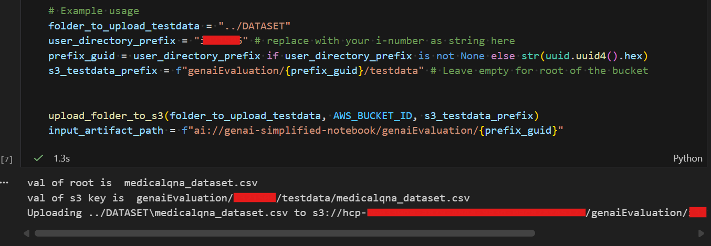

#### **Register Uploaded Files as Artifact in AI Core**

```Python
import requests
import logging
# Registering the uploaded files from AWS as artifacts to use inside configuration.

def register_artifact():
    headers = _get_headers()
    
    GET_ARTIFACTS_ENDPOINT = '/v2/lm/artifacts'
    request_url = f"{AICORE_BASE_URL}{GET_ARTIFACTS_ENDPOINT}"
    
    request_body = {
        "labels": [
            {
            "key": "ext.ai.sap.com/prompt-evaluation",
            "value": "true"
            }
        ],
        "name": "genai-eval-simplified-test-data",
        "kind": "other",
        "url": input_artifact_path, # input artifact path
        "description": "demo artifacts for evaluation flow.",
        "scenarioId": "genai-evaluations"
    }
    try:
        response = requests.post(
            request_url, headers=headers, data=json.dumps(request_body), timeout=120
        )
        result = response.json()
        print(result)
        return result['id']
    except:
        print("Error occurred while attempting to create an execution")
        raise
        
artifact_id = register_artifact()
```
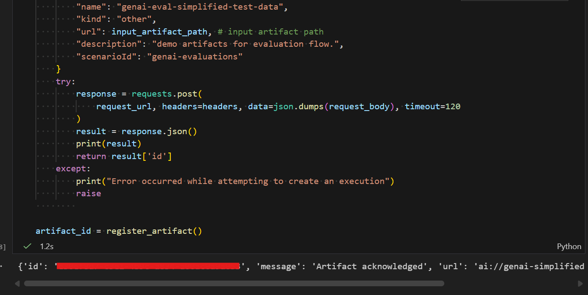

[OPTION END]

[OPTION BEGIN [Bruno]]

Before registering a dataset artifact in Bruno, you must upload your CSV file to the SAP AI Core object store using the Dataset API.
Bruno cannot upload files directly to S3; therefore, this step is required.

**Prerequisites**

    - An object store secret must already exist in your resource group.Typically, this is the default secret named **default**.

    - The Dataset API currently supports:

        - S3 object stores only

        - CSV file uploads

**Upload Your Dataset**

Use the Dataset API – Upload File request in Bruno:

```bash
PUT:{{ai_api_url}}/v2/lm/dataset/files/{{secretName}}/{{datasetPath}}
```

**Headers**

```json
Authorization: Bearer {{token}}
AI-Resource-Group: {{resourceGroup}}
Content-Type: text/csv
```

**Body**

Upload your .csv file directly as binary in Bruno’s Body 

Example Path Values:

    - secretName: default

    - datasetPath: testdata/medicalqna_dataset.csv

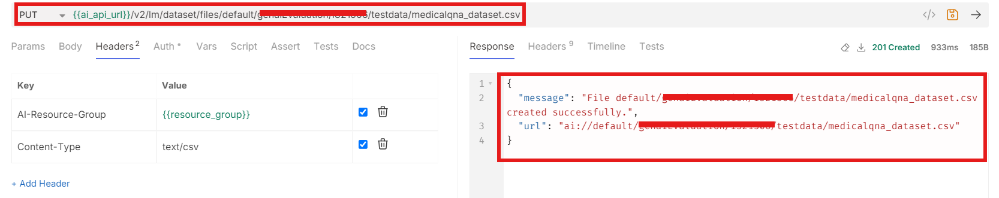

**Note:** 

Save the ai://… URL — you will use this when creating the dataset artifact.

**Register the Dataset Artifact**

- Click  on **Register artifact** under lm -> artifacts in bruno collection to register the artifact

```CODE
{
    "name": "aiconfig",
    "kind": "dataset",
    "url": "ai://default/testdata/medicalqna_dataset.csv",
    "scenarioId": "genai-evaluations"
}
```


[OPTION END]

### Approach Selection – How to Provide Prompts (Read-Up)

In this evaluation workflow, prompts can be provided in two different ways.
Before proceeding, understand the available approaches and choose the one that fits your requirement.

**🔹 Option 1 – Prompt Template + Model (Prompt Registry)**

    - The prompt is stored in the Prompt Registry

    - The model is referenced directly in the evaluation configuration

    - Prompts are reusable and version-controlled

    - Best suited for standardized or production-grade workflows

**📌 When to use this?**

If you want reusable, versioned prompts that can be managed independently.

👉 If you would like to see this approach in action, refer to the [Evaluation Quickstart tutorial](LINK TO ADD), where we demonstrate the Prompt Registry method.

**🔹 Option 2 – Orchestration Registry (Inline Prompt)**

    - The prompt is defined directly inside the orchestration configuration

    - No separate prompt registry entry is required

    - Ideal for ad-hoc, experimental, or one-time evaluations

**📌 When to use this?**

If the prompt is specific to this evaluation and does not need reuse or versioning.

### Create a Prompt Template in Orchestration Registry

In this tutorial, we will use the **Orchestration Registry (Inline Prompt)** approach.

**Create Orchestration Registry Configuration**

[OPTION BEGIN [SAP AI Launchpad]]

Go to Generative AI Hub → Orchestration → Orchestration Configurations

- click create

- In templating  add the system prompt

```json
List the benefits and side effects of the drug in the following consumer health question: {{?question}}.
```
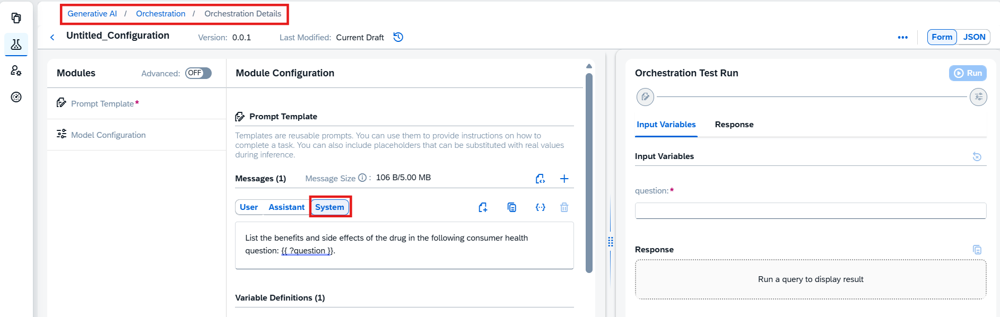

- select the model in model configuration and save the orchestration registry

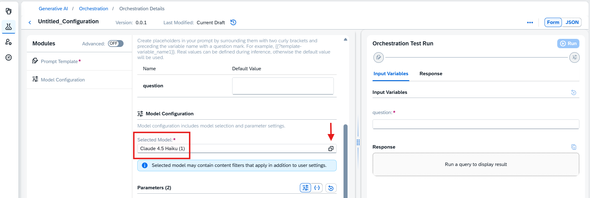

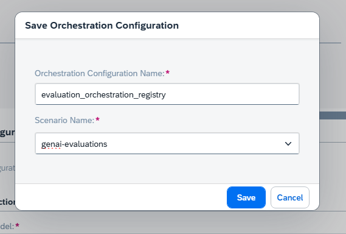

[OPTION END]

[OPTION BEGIN [Python]]

The following code defines a function `create_orchestration_registry_config()` that creates a new **Orchestration Configuration** in **Orchestration Registry**.

```python
def create_orchestration_registry_config():
    headers = _get_headers()
    prompt_template = {
    "template": [
      {
        "role": "user",
        "content": "List the benefits and side effects of the drug in the following consumer health question: {{?question}}."
      }
    ]
    }
    CREATE_ORCHESTRATION_REGISTRY = '/v2/registry/v2/orchestrationConfigs'
    request_url = f"{AICORE_BASE_URL}{CREATE_ORCHESTRATION_REGISTRY}"
    model_name,model_version=selected_models_str.split(":")
    request_body = {
      "name": "genai-eval-test",
      "version": "1.0.0",
      "scenario": "genai-evaluations",
      "spec": {
        "modules": {
          "prompt_templating": {
            "model": {
              "name": model_name,
              "version": model_version
            },
            "prompt": prompt_template
          }
        }
      }
    }
    try:
        response = requests.post(
            request_url, headers=headers, data=json.dumps(request_body), timeout=120
        )
        if(response.status_code != 200):
            print(response.json())
            raise
        result = response.json()
        print(result)
        return result['id']
    except:
        logging.error("Error occurred while attempting to create a orchestration registry id")
        raise
orchestration_registry_id = create_orchestration_registry_config()
```

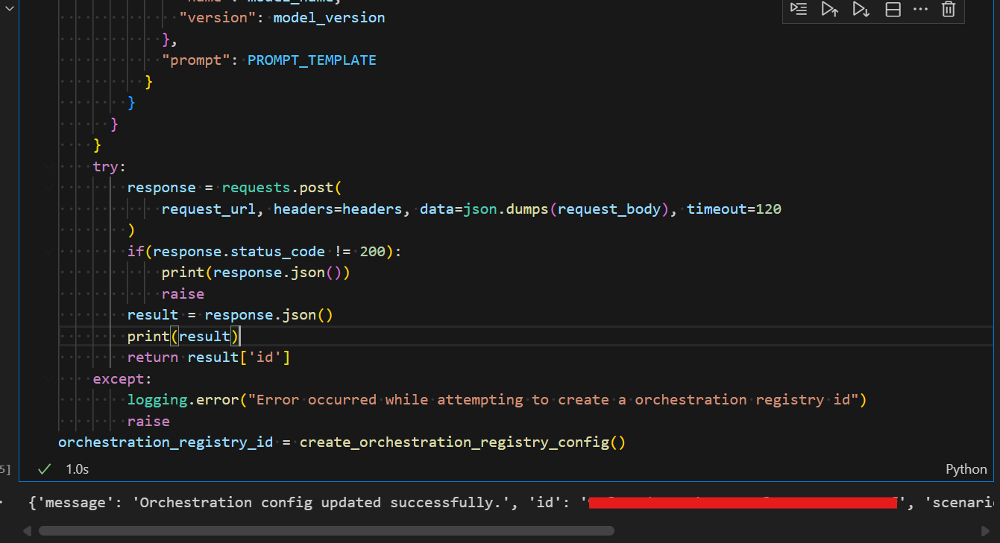

**Note** : If you wish to use an existing orchestration config, skip executing this cell and add the orchestration config id in `orchestration_registry_id` string in the next cell.

[OPTION END]

[OPTION BEGIN [Bruno]]

You can paste this directly into a Bruno .bru file or create a new request inside Bruno.

**Url:** 
```bash
POST {{AICORE_BASE_URL}}/v2/registry/v2/orchestrationConfigs
```

**headers:** 
```
{
    Authorization: Bearer {{token}}
    AI-Resource-Group: {{resource_group}}
    Content-Type: application/json
  }
```

**body:** 
```json
{
  "name": "genai-eval-test",
  "version": "1.0.0",
  "scenario": "genai-evaluations",
  "spec": {
    "modules": {
      "prompt_templating": {
        "model": {
          "name": "model_name",
          "version": "model_version" 
        },
        "prompt": {
          "template": [
            {
              "role": "user",
              "content": "List the benefits and side effects of the drug in the following consumer health question: {{?question}}."
            }
          ],
          "defaults": {}
        }
      }
    }
  }
}
```

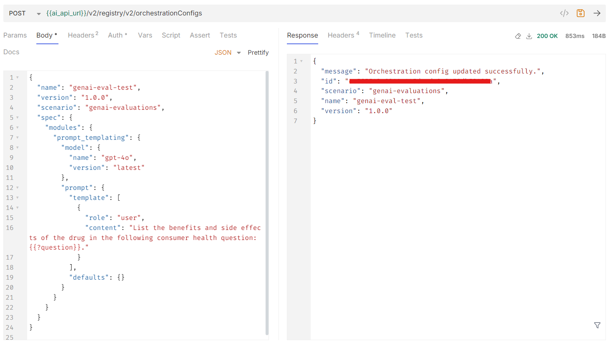

[OPTION END]

### Understanding Metrics (Pre-Read)

Metrics determine how your model outputs are evaluated during an evaluation run. They define the scoring logic that SAP AI Core uses to compare models, measure quality, and validate improvements over time.

In SAP AI Core, metrics are configured during the **Create Evaluation Configuration** step:

```json
"metrics": "Content Filter on Input,Pointwise Instruction Following,Content Filter on Output"
```

You can specify one or multiple metrics (comma-separated).

#### Types of Metrics

SAP AI Core supports two major types:

1. System-defined Metrics (Ready to use)

2. Custom Metrics (User-defined)


**1. System-defined Metrics**

These are built-in metrics provided by SAP AI Core. No additional setup required.

They are grouped into two categories:

**Computed Metrics**

These use reference data, schema validation, or deterministic logic.

| Name                     | Description                                                   | Reference required |
---------------------------------------------------------------------------------------------|------------------|
| BERT Score               | https://huggingface.co/spaces/evaluate-metric/bertscore                                                                                    | Yes              |
| BLEU                     | https://huggingface.co/spaces/evaluate-metric/bleu                                                                                         | Yes              |
| ROUGE                    | https://huggingface.co/spaces/evaluate-metric/rouge                                                                                        | Yes              |
| JSON Schema Match        | validates LLM generated response against a predefined Json schema, returns boolean result.                                                                                      | Yes              |
| Content Filter on Input  | Whether orchestration input was rejected by the input filter                                                                                       | No               |
| Content Filter on Output | Whether orchestration output was rejected by the output filter                                                                                       | No               |
| Exact Match              | Whether the output exactly matches the reference                                                                                    | Yes              |
| Language Match           | The metric returns true/false to indicate if the text matches the given language                                                                                     | No               |

👉 Use computed metrics when:

    - You have ground truth/reference answers

    - You need deterministic validation

    - You want schema validation

**model-as-a-judge metrics**

These use a judge LLM to evaluate responses qualitatively.

| Name                            | Description                                              | Reference required |--------------------------------------------------------------------------------------------------------------------
| Pointwise Instruction Following | assess the model's ability to follow instructions provided in the user prompt                                                                                       | No               |
| Pointwise Correctness          | assess the model's ability to provide a correct response based on the user prompt                                                                                       | Yes              |
| Pointwise Answer Relevance     | assess the model's response is related to user prompt                                                                                       | No               |
| Pointwise Conciseness          | assess the model's response is a short and concise answer to user prompt                                                                                       | No               |
| 

*Entries marked with an asterisk (*) are experimental metrics.

👉 Use model-as-a-judge metrics when:

    - You need qualitative evaluation

    - No exact ground truth exists

    - You want human-like evaluation logic

#### Custom Metrics (User-defined metrics)

When system metrics are insufficient, you can define your own metric.

Custom metrics can be used to evaluate the LLM outputs according to the unique needs of a use case. A user-defined llm-as-a-judge metric uses a judge LLM along with a rubric to compute a metric rating. The output of a llm-as-a-judge metric can be numeric or text.

The system defines a structure for the judge prompts and users provide the metric definition in the pre-defined format. Relevant instructions, such as output instructions, are automatically added to ensure the desired output from the LLM.

**Custom Metric Definition Structure**

```json
{
  "scenario": "genai-evaluations",
  "metricName": "my_custom_metric",
  "version": "0.0.1",
  "type": "structured",
  "model_configuration": {
    "model_name": "string",
    "model_version": "string"
  },
  "prompt_configuration": {
    "evaluation_task": "Describe the goal of this evaluation.",
    "criteria": "Explain how evaluation is performed.",
    "rating_rubric": [
      {
        "rating": 1,
        "rule": "Poor quality response"
      },
      {
        "rating": 5,
        "rule": "Excellent response"
      }
    ],
    "include_properties": ["prompt", "reference"],
    "examples": [
      {
        "prompt": "Sample prompt",
        "response": "Sample response",
        "reference": "Expected answer",
        "rating": 5,
        "explanation": "Why this rating was given"
      }
    ]
  }
}
```
**NOTE**: "scenario" and "metricName" and "version" is a required parameter for the custom metric in evaluation configuration.

**NOTE**: The user must provide at least one prompt, system or user prompt, or both prompts can be provided.

**Model Availability Notice** 

⚠️ If gpt-4.1 (2025-04-14) is not available in your region:

    - LLM-as-a-Judge metrics cannot be executed

    - Evaluation service depends on this specific model version


### Providing Models and Metrics for Evaluation

Metrics determine how your model outputs are evaluated during an evaluation run. They define the scoring logic that SAP AI Core uses to compare models, measure quality, and validate improvements over time.

Metrics must be supplied before creating an Evaluation Configuration.

[OPTION BEGIN [SAP AI Launchpad]]

In SAP AI Launchpad, metrics are selected visually during the Evaluation Configuration creation flow.

You can choose:

    - System-defined metrics

    - Custom metrics (your own definitions stored in the metric registry — cannot be created directly in AI Launchpad; to use them, register them via API/Bruno mentioned in the same step and then select them in the Evaluation Configuration)

No manual JSON input is needed—the UI provides a selectable list of available metrics.

1. Go to Generative AI Hub → Optimization.

2. Click Create to start a new evaluation configuration.


- In Select Test Input section, 

    - select orchestration configuration   

    - Select your registered dataset artifact

    - Enter the dataset path (example):
    testdata/medicalqna_dataset.csv

    - Set the number of test samples (e.g., 20)

  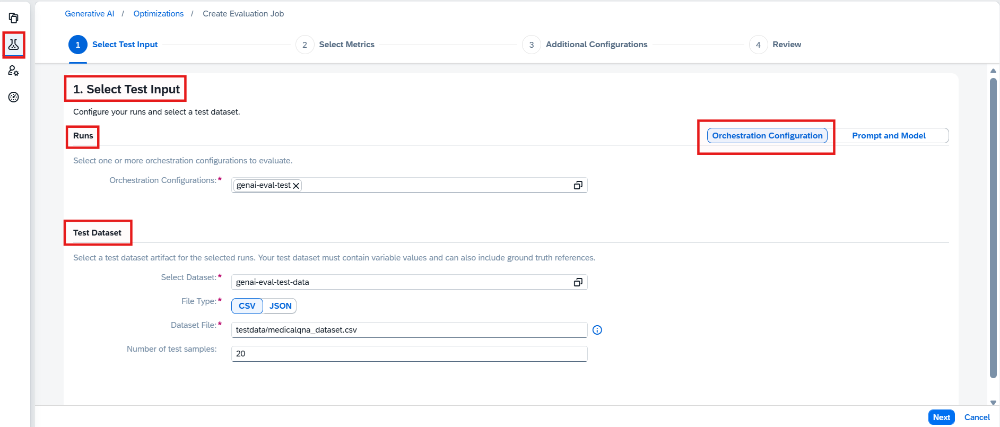

- Click **Next** to go to Metrics selection.

#### Select Evaluation Metrics

Choose the metrics you want to evaluate.

You may choose one or multiple system-defined or custom metrics—examples:

    - BERT Score

    - Content Filter on Input

    - Pointwise Instruction Following

    - Content Filter on Output

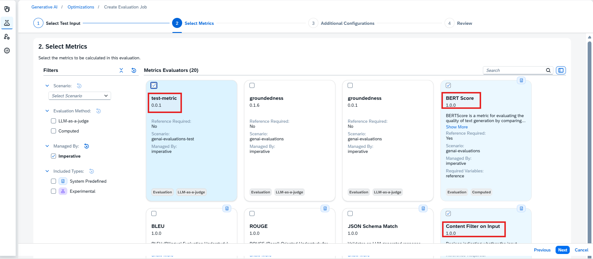

---

> 📘 **Helpful Resources**:
> 
> - [System-Defined Evaluation Metrics – SAP Documentation](https://help.sap.com/docs/sap-ai-core/generative-ai-hub/system-defined-evaluation-metrics)  
> - [Define Your Own Custom Metrics – SAP Guide](https://help.sap.com/docs/sap-ai-core/generative-ai-hub/custom-metrics)  
>   *(If your evaluation requires domain-specific or advanced scoring logic)*

> **Note: You may select additional metrics based on your use case.**

---

[OPTION END]

[OPTION BEGIN [Python]]

**Select your Models**
 
Add the models you wish to use in the string `selected_models_str`

```Python
# Manual selection of models
selected_models_str="gemini-2.5-pro:001"
print("Selected models string:", selected_models_str)
```

**Metrics Handling in Python Notebook**

When running the evaluation through the Python notebook, metric setup is partially automated.
Before the evaluation configuration is created, the script performs the following:

    - Users can manually specify metric IDs

    - Or can pass custom metrics JSON directly

    - It checks if each metric already exists in AI Core

    - If not found → creates it automatically

    - Prints final list of metric IDs used for evaluation

This ensures all metrics exist before the evaluation configuration is created.

```Python
user_metric_ids = "d18******************d1f,dbf56**********210c7e771"

custom_metric_list = [
    {
    "name": "test-metric",
    "scenario": "genai-evaluations-test",
    "version": "0.0.1",
    "evaluationMethod": "llm-as-a-judge",
    "managedBy": "imperative",
    "systemPredefined": False,
    "metricType": "evaluation",
    "spec": {
      "outputType": "numerical",
      "promptType": "structured",
      "configuration": {
        "modelConfiguration": {
          "name": "gpt-4.1-mini",
          "version": "2025-08-07",
          "parameters": [
            {
              "key": "max_tokens",
              "value": "10000"
            }
          ]
        },
        "promptConfiguration": {
          "definition": "You are an expert evaluator. Your task is to evaluate the quality of the responses generated by AI models. We will provide you with a reference and an AI-generated response. You should first read the user input carefully for analyzing the task, and then evaluate the quality of the responses based on the criteria provided in the Evaluation section below. You will assign the response a rating following the Rating Rubric and Evaluation Steps. Give step-by-step explanations for your rating, and only choose ratings from the Rating Rubric.\n\n## Metric Definition\nYou are an INFORMATION OVERLAP classifier providing the overlap of information between a response and reference.\n\n## Criteria\nGroundedness: The of information between a response generated by AI models and provided reference.\n\n## Rating Rubric\n5: (Fully grounded). The response and the reference are fully overlapped.\n4: (Mostly grounded). The response and the reference are mostly overlapped.\n3: (Somewhat grounded). The response and the reference are somewhat overlapped.\n2: (Poorly grounded). The response and the reference are slightly overlapped.\n1: (Not grounded). There is no overlap between the response and the reference.\n\n## Evaluation Steps\nSTEP 1: Assess the response in aspects of Groundedness. Identify any information in the response and provide assessment according to the Criteria.\nSTEP 2: Score based on the rating rubric. Give a brief rationale to explain your evaluation considering Groundedness.\n\nReference: {{?reference}}\nResponse: {{?aicore_llm_completion}}\n\nBegin your evaluation by providing a short explanation. Be as unbiased as possible. After providing your explanation, please rate the response according to the rubric and outputs STRICTLY following this JSON format:\n\n{ \"explanation\": string, \"rating\": integer }\n\nOutput:\n",
          "evaluationTask": "You are an expert evaluator. Your task is to evaluate the quality of the responses generated by AI models. We will provide you with a reference and an AI-generated response. You should first read the user input carefully for analyzing the task, and then evaluate the quality of the responses based on the criteria provided in the Evaluation section below. You will assign the response a rating following the Rating Rubric and Evaluation Steps. Give step-by-step explanations for your rating, and only choose ratings from the Rating Rubric.\n\n## Metric Definition\nYou are an INFORMATION OVERLAP classifier providing the overlap of information between a response and reference.\n\n## Criteria\nGroundedness: The of information between a response generated by AI models and provided reference.\n\n## Rating Rubric\n5: (Fully grounded). The response and the reference are fully overlapped.\n4: (Mostly grounded). The response and the reference are mostly overlapped.\n3: (Somewhat grounded). The response and the reference are somewhat overlapped.\n2: (Poorly grounded). The response and the reference are slightly overlapped.\n1: (Not grounded). There is no overlap between the response and the reference.\n\n## Evaluation Steps\nSTEP 1: Assess the response in aspects of Groundedness. Identify any information in the response and provide assessment according to the Criteria.\nSTEP 2: Score based on the rating rubric. Give a brief rationale to explain your evaluation considering Groundedness.\n\nReference: {{?reference}}\nResponse: {{?aicore_llm_completion}}\n\nBegin your evaluation by providing a short explanation. Be as unbiased as possible. After providing your explanation, please rate the response according to the rubric and outputs STRICTLY following this JSON format:\n\n{ \"explanation\": string, \"rating\": integer }\n\nOutput:\n",
          "criteria": "You should strictly follow the instruction given to you. Please act as an impartial judge and evaluate the quality of the responses based on the prompt and following criteria:",
          "ratingRubric": [
            {
              "rating": 3,
              "rule": "Response is completely factual with no unsupported claims"
            },
            {
              "rating": 2,
              "rule": "Response has minor inaccuracies but no major contradictions"
            },
            {
              "rating": 1,
              "rule": "Response contains significant factual errors or hallucinations"
            }
          ]
        }
      }
    }
  }
]
```

```python
import os
import json
import requests


# --- Fetch all metrics from SAP AI Core ---
def fetch_all_metrics():
    request_url = f"{AICORE_BASE_URL}/v2/lm/evaluationMetrics"
    resp = requests.get(request_url, headers=_get_headers())
    resp.raise_for_status()
    return resp.json().get("resources", [])

# --- Create or fetch a metric ---
def create_or_get_metric(custom_metric, user_metric_id=None):
    all_metrics = fetch_all_metrics()

    # 1️⃣ User-supplied ID lookup
    if user_metric_id:
        for m in all_metrics:
            if m.get("id") == user_metric_id:
                print(f"✅ Metric already exists by ID: {user_metric_id}")
                return user_metric_id
        print(f"⚠️ User metric ID {user_metric_id} not found, will only include if valid later")

    # 2️⃣ Check by scenario, name, version
    scenario = custom_metric.get("scenario")
    name = custom_metric.get("name")
    version = custom_metric.get("version")
    if not all([scenario, name, version]):
        raise ValueError("Metric must include 'scenario', 'name', and 'version'")

    for m in all_metrics:
        if (m.get("scenario") == scenario and
            m.get("name") == name and
            m.get("version") == version):
            metric_id = m.get("id")
            print(f"✅ Metric already exists: {scenario}/{name} v{version}, ID = {metric_id}")
            return metric_id

    # 3️⃣ Create metric if not found
    request_url = f"{AICORE_BASE_URL}/v2/lm/evaluationMetrics"
    required_fields = ["scenario", "name", "version", "evaluationMethod", "metricType"]
    for f in required_fields:
        if f not in custom_metric:
            raise ValueError(f"❌ Missing required field: {f}")

    resp = requests.post(request_url, headers=_get_headers(), json=custom_metric)
    resp.raise_for_status()
    metric_id = resp.json().get("id")
    print(f"✅ Metric created successfully: {name} v{version}, ID = {metric_id}")
    return metric_id

# --- Main pipeline ---

# 1️⃣ Create/fetch metrics from SAP AI Core
metric_ids = []
for metric in custom_metric_list:
    try:
        print(f"metric:{metric}")
        metric_id = create_or_get_metric(metric)
        metric_ids.append(metric_id)
    except ValueError as e:
        print(f"Skipping metric due to error: {e}")

# 2️⃣ Validate user_metric_ids separately if provided
if user_metric_ids and user_metric_ids.strip():
    all_metrics = fetch_all_metrics()
    # Split comma-separated IDs and strip whitespace
    for uid in [uid.strip() for uid in user_metric_ids.split(",")]:
        if any(m.get("id") == uid for m in all_metrics):
            metric_ids.append(uid)
        else:
            print(f"⚠️ User metric ID {uid} does not exist in AI Core, skipping.")
# 3️⃣ Convert to comma-separated string
custom_metric_ids_str = ",".join(metric_ids)
print("✅ All processed metric IDs:", custom_metric_ids_str)
```
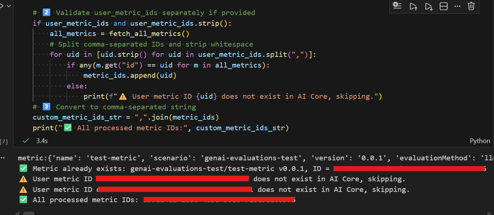

This ensures all required metrics are available before launching the evaluation.

[OPTION END]

[OPTION BEGIN [Bruno]]

Bruno supports two ways of providing metrics:

**Use System-Defined Metrics**

You can directly pass system metrics in your configuration:

Example:

```json
"metrics": "Pointwise Answer Relevance, Pointwise Instruction Following"
```

If you want to register custom metrics, you must call:

➡️ **Create Custom Metric**

```bash
POST {{ai_api_url}}/v2/lm/evaluationMetrics
```
**Body example:**

```json
{
    "name": "test-metric",
    "scenario": "genai-evaluations-test",
    "version": "0.0.1",
    "evaluationMethod": "llm-as-a-judge",
    "managedBy": "imperative",    
    "metricType": "evaluation",
    "spec": {
      "outputType": "numerical",
      "promptType": "structured",
      "configuration": {
        "modelConfiguration": {
          "name": "gpt-4.1-mini",
          "version": "2025-08-07",
          "parameters": [
            {
              "key": "max_tokens",
              "value": "10000"
            }
          ]
        },
        "promptConfiguration": {
          "definition": "You are an expert evaluator. Your task is to evaluate the quality of the responses generated by AI models. We will provide you with a reference and an AI-generated response. You should first read the user input carefully for analyzing the task, and then evaluate the quality of the responses based on the criteria provided in the Evaluation section below. You will assign the response a rating following the Rating Rubric and Evaluation Steps. Give step-by-step explanations for your rating, and only choose ratings from the Rating Rubric.\n\n## Metric Definition\nYou are an INFORMATION OVERLAP classifier providing the overlap of information between a response and reference.\n\n## Criteria\nGroundedness: The of information between a response generated by AI models and provided reference.\n\n## Rating Rubric\n5: (Fully grounded). The response and the reference are fully overlapped.\n4: (Mostly grounded). The response and the reference are mostly overlapped.\n3: (Somewhat grounded). The response and the reference are somewhat overlapped.\n2: (Poorly grounded). The response and the reference are slightly overlapped.\n1: (Not grounded). There is no overlap between the response and the reference.\n\n## Evaluation Steps\nSTEP 1: Assess the response in aspects of Groundedness. Identify any information in the response and provide assessment according to the Criteria.\nSTEP 2: Score based on the rating rubric. Give a brief rationale to explain your evaluation considering Groundedness.\n\nReference: {{?reference}}\nResponse: {{?aicore_llm_completion}}\n\nBegin your evaluation by providing a short explanation. Be as unbiased as possible. After providing your explanation, please rate the response according to the rubric and outputs STRICTLY following this JSON format:\n\n{ \"explanation\": string, \"rating\": integer }\n\nOutput:\n",
          "evaluationTask": "You are an expert evaluator. Your task is to evaluate the quality of the responses generated by AI models. We will provide you with a reference and an AI-generated response. You should first read the user input carefully for analyzing the task, and then evaluate the quality of the responses based on the criteria provided in the Evaluation section below. You will assign the response a rating following the Rating Rubric and Evaluation Steps. Give step-by-step explanations for your rating, and only choose ratings from the Rating Rubric.\n\n## Metric Definition\nYou are an INFORMATION OVERLAP classifier providing the overlap of information between a response and reference.\n\n## Criteria\nGroundedness: The of information between a response generated by AI models and provided reference.\n\n## Rating Rubric\n5: (Fully grounded). The response and the reference are fully overlapped.\n4: (Mostly grounded). The response and the reference are mostly overlapped.\n3: (Somewhat grounded). The response and the reference are somewhat overlapped.\n2: (Poorly grounded). The response and the reference are slightly overlapped.\n1: (Not grounded). There is no overlap between the response and the reference.\n\n## Evaluation Steps\nSTEP 1: Assess the response in aspects of Groundedness. Identify any information in the response and provide assessment according to the Criteria.\nSTEP 2: Score based on the rating rubric. Give a brief rationale to explain your evaluation considering Groundedness.\n\nReference: {{?reference}}\nResponse: {{?aicore_llm_completion}}\n\nBegin your evaluation by providing a short explanation. Be as unbiased as possible. After providing your explanation, please rate the response according to the rubric and outputs STRICTLY following this JSON format:\n\n{ \"explanation\": string, \"rating\": integer }\n\nOutput:\n",
          "criteria": "You should strictly follow the instruction given to you. Please act as an impartial judge and evaluate the quality of the responses based on the prompt and following criteria:",
          "ratingRubric": [
            {
              "rating": 3,
              "rule": "Response is completely factual with no unsupported claims"
            },
            {
              "rating": 2,
              "rule": "Response has minor inaccuracies but no major contradictions"
            },
            {
              "rating": 1,
              "rule": "Response contains significant factual errors or hallucinations"
            }
          ]
        }
      }
    }
  }
```
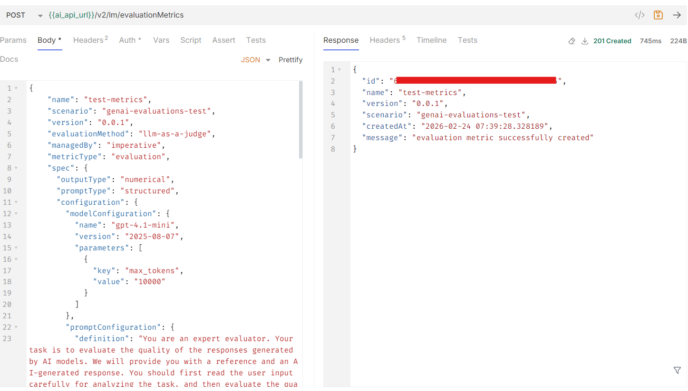

You will receive:

```json
"id": "<metric_id>"
```

This metric ID can be directly passed into the evaluation configuration.

[OPTION END]

**Note**

To evaluate and compare multiple models in a single execution, you must create a distinct orchestration registry ID for each model you wish to test. Assign a different foundation model to each registry ID, and then pass this list of registry IDs into your evaluation configuration. This ensures the system generates separate, comparable runs for each model simultaneously.

### Define and Create Evaluation Configurations

[OPTION BEGIN [SAP AI Launchpad]]

Once your dataset artifact is registered and you have completed creating Orchestration Registry, the next step is to create an Evaluation Configuration.

An Evaluation Configuration tells SAP AI Core:

    - which dataset to evaluate

    - which prompt/model or orchestration config to use

    - which metrics to compute

    - which orchestration deployment endpoint to call

    - how many repetitions to run

    - which test dataset file to load

This configuration becomes the blueprint for your evaluation execution.

**Steps to Create Evaluation Configuration**

In Additional Configuration

- Set **Number of Repetitions** to `1`.
- Choose an existing deployment for **Orchestration Endpoint**.

    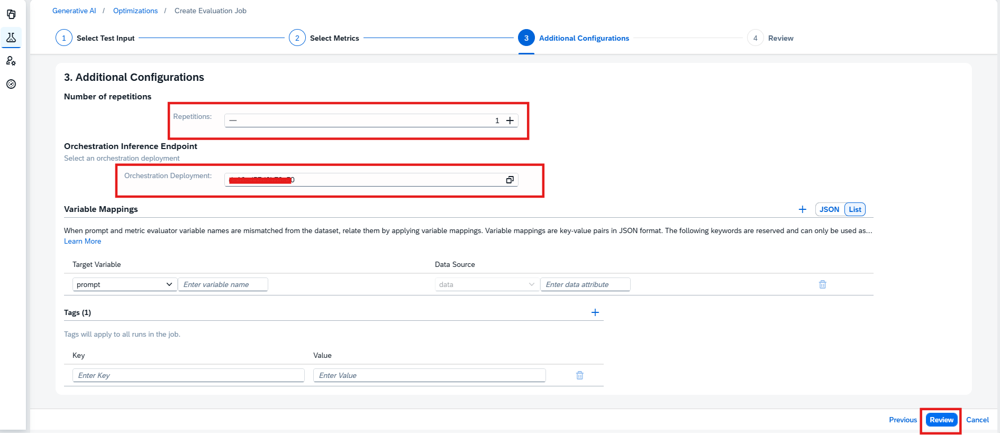
---

#### Final Review & Start

- Review all the details on the summary page.
- Once confirmed, click **Create** to start the evaluation job.

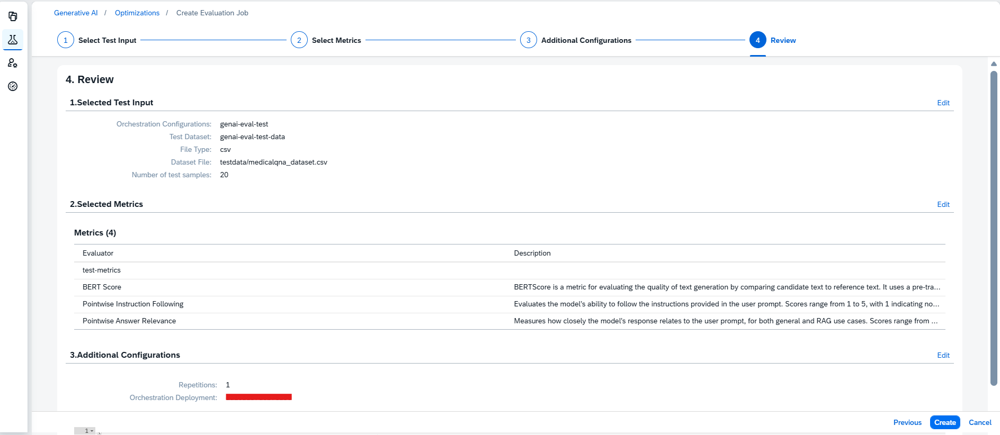

> ✅ You have now successfully configured and triggered a Generative AI Evaluation.

[OPTION END]

[OPTION BEGIN [Python]]

When using the Python notebook, the evaluation configuration is created automatically based on your selections.
Before creating the configuration, the notebook will:

    - Load the dataset artifact ID

    - Resolve metric IDs 

    - Load orchestration registry IDs

    - Validate all required parameters

**Sample parameter setup:**

```Python
import json
test_data_path = f"testdata/{DATASET_NAME}" # specify the test data path here. For the full folder just specifying testdata will work
test_datasets = json.dumps({'path': test_data_path, 'type': 'csv'})
metrics_list = ",".join([selected_metrics_str,custom_metric_ids_str])
models_list = selected_models_str
print(f"Selected metrics: {metrics_list}")
print(f"Selected models: {models_list}")
orchestration_deployment_url = deployment_url
repetitions = "1"
```

#### Create Configuration Body

The notebook builds the configuration using the required SAP AI Core fields:

    - scenarioId

    - executableId

    - dataset artifact binding

    - selected metrics

    - test dataset details

    - repetitions

    - orchestration deployment URL

    - orchestrationRegistryIds

    - models.

The following function dynamically creates the configuration body for AI Core. 

```Python
#  creating an AICORE Configuration.
import requests

request_body = {
    "name": "genai-eval-conf",
    "scenarioId": "genai-evaluations",
    "executableId": "genai-evaluations-simplified",
    "inputArtifactBindings": [
        {
            "key": "datasetFolder",
            "artifactId": "e30ef8d7-c3e1-4b9c-a834-a00ac0a9a053"
        }
    ],
    "parameterBindings": [
        {
            "key": "repetitions",
            "value": repetitions
        },
        {
            "key": "orchestrationDeploymentURL",
            "value": orchestration_deployment_url
        },
        {
            "key": "metrics",
            "value": metrics_list
        },
        {
            "key": "testDataset",
            "value": test_datasets
        },
        {
            "key": "orchestrationRegistryIds",
            "value": orchestration_registry_id
        }
    ]
}

def create_aicore_configuration():
    headers = _get_headers()
    GET_CONFIGURATIONS_ENDPOINT = '/v2/lm/configurations'
    request_url = f"{AICORE_BASE_URL}{GET_CONFIGURATIONS_ENDPOINT}"
    try:
        response = requests.post(
            request_url, headers=headers, data=json.dumps(request_body), timeout=120
        )
        print(response)
        if(response.status_code != 201):
            raise
        result = response.json()
        print(result)
        return result['id']
    except:
        logging.error("Error occurred while attempting to create a Configuration")
        raise
        
configuration_id = create_aicore_configuration()
```

You will receive a configuration ID, which is required for the next step (Execution).

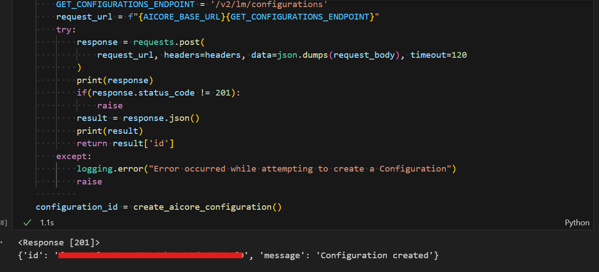

SAP AI Core returns a configuration ID, which is used to trigger the evaluation execution.

[OPTION END]

[OPTION BEGIN [Bruno]]

When creating an Evaluation Configuration through Bruno, you call:

```bash
POST {{api_url}}/v2/lm/configurations
```

Below is the sample request body to create configuration.

```json
{
  "name": "genai-eval-conf",
  "scenarioId": "genai-evaluations",
  "executableId": "genai-evaluations-simplified",
  "inputArtifactBindings": [
    {
      "key": "datasetFolder",
      "artifactId": "{{artifactId}}"
    }
  ],
  "parameterBindings": [
    {
      "key": "repetitions",
      "value": "1"
    },
    {
      "key": "orchestrationDeploymentURL",
      "value": "{{deployment_url}}"
    },
    {
      "key": "metrics",
      "value": "BERT Score, Pointwise Conciseness"
    },
    {
      "key": "testDataset",
      "value": "{\"path\": \"testdata/{{dataset_file}}\", \"type\": \"csv\"}"
    },
    {
      "key": "orchestrationRegistryIds",
      "value": "{{orchestrationRegistryIds}}"
    },
    {
      "key": "models",
      "value": "{{model_name}}:{{model_version}}"
    }
  ]
}
```
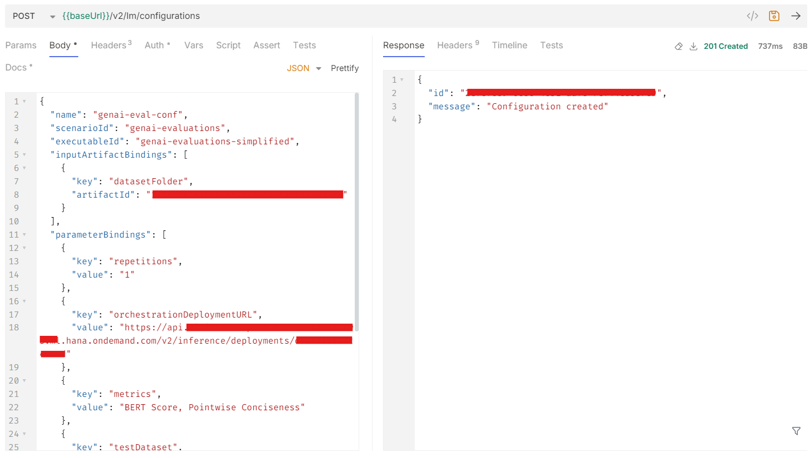

[OPTION END]

### Create and Run Evaluation Execution

After creating the Evaluation Configuration, the next step is to execute it.

Execution triggers the evaluation workflow, which:

    - Reads the test dataset

    - Generates submissions to the orchestration service

    - Collects model outputs

    - Computes all selected metrics

    - Produces aggregate and raw evaluation results

The process is identical for SAP AI Launchpad, Python, and Bruno, with only the invocation method differing.

[OPTION BEGIN [SAP AI Launchpad]]

- Once the evaluation configuration is created, the system automatically triggers an evaluation execution.

- Follow these steps to monitor its progress and verify completion:

    - Navigate to **ML Operations** in the SAP AI Core Launchpad.

    - In the sidebar, click **Executions**.
    
    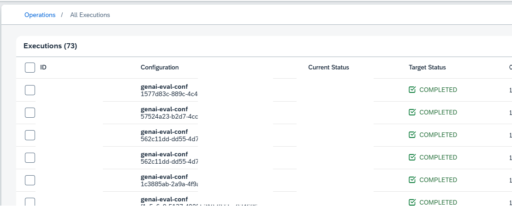

    - Locate the most recent execution triggered by your evaluation configuration. You can use the timestamp or configuration name to identify it.

    - Click on the execution entry to open its details. The Current Status will update as the process runs.

    

- Once the Target Status reaches **COMPLETED** , your evaluation has successfully finished.

> [For More information](https://help.sap.com/docs/sap-ai-core/generative-ai-hub/create-evaluation)

Track Execution Status

The execution page will show:

    - Unknown

    - Pending

    - Running

    - Completed

Once completed, you can navigate to:

    - Outputs → Tracking Metrics (aggregate results)

    - Output Artifacts (raw results stored in the SQLite DB)

[OPTION END]

[OPTION BEGIN [Python]]

Once the configuration is ready, the next step is to trigger an execution.
An execution is a single evaluation run based on the configuration you defined.

**Create Execution**

The following function starts the evaluation in SAP AI Core using the configuration ID:

```python
# create an execution with the created configuration.

import requests
def create_execution():
    headers = _get_headers()
    GET_EXECUTIONS_ENDPOINT = '/v2/lm/executions'
    request_url = f"{AICORE_BASE_URL}{GET_EXECUTIONS_ENDPOINT}"
    request_body = {"configurationId" : configuration_id} 
    try:
        response = requests.post(
            request_url, headers=headers, data=json.dumps(request_body), timeout=120
        )
        print("response received is ", response)
        result = response.json()
        print(result)
        return result['id']
    except:
        logging.error("Error occurred while attempting to create an execution")
        raise
 

execution_id = create_execution()
```
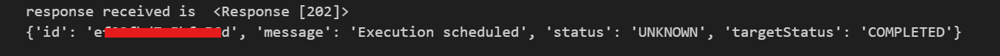

#### Monitor Execution Status

The execution progresses through states:

UNKNOWN → PENDING → RUNNING → COMPLETED

```python
# get execution status
import requests
def get_execution_status(execution_id):
    headers = _get_headers()
    LOG_EXECUTIONS_ENDPOINT = f'/v2/lm/executions/{execution_id}'
    request_url = f"{AICORE_BASE_URL}{LOG_EXECUTIONS_ENDPOINT}"
    try:
        response = requests.get(
            request_url, headers=headers, timeout=120
        )
        print("response received is ", response)
        result = response.json()
        return result
    except:
        logging.error("Error occurred while attempting to get execution status")
        raise
 

get_execution_status(execution_id)
```

#### Automatic Polling

To continuously monitor until the evaluation finishes:

```python
# Polling the execution status until it is COMPLETED or DEAD or timeout occurs
def poll_execution_status(execution_id, timeout_minutes=1800, poll_interval=30):
    start_time = time.time()
    while True:
        result = get_execution_status(execution_id)
        print(f"Execution Status: {result.get('status')}")
        if result.get("status") == "COMPLETED":
            print(f"Execution completed successfully in {time.time() - start_time} seconds, proceed to fetch results.")
            break
        if result.get("status") == "DEAD":
            print(f"Execution failed with status DEAD in {time.time() - start_time} seconds. Check the logs for more details.")
            break
        if time.time() - start_time > timeout_minutes * 60:
            raise TimeoutError(f"Execution status polling timed out after {timeout_minutes} minutes.")
        time.sleep(poll_interval)

```

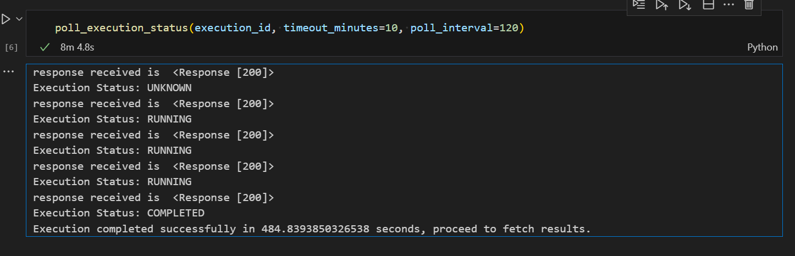

✅ Once the execution status shows COMPLETED, the evaluation results are available and can be analyzed in the next step.

[OPTION END]

[OPTION BEGIN [Bruno]]

After creating the configuration, the next step is to trigger the evaluation workload by creating an AI Core execution.

**Create an Execution with the Created Configuration**

- Click on create execution under executions, pass the configuration id created in previous step


- The status field progresses through different states over time:
UNKNOWN → PENDING → RUNNING → COMPLETED.

**Get Execution Status**

check the status of created execution by passing the execution ID, The Current Status will update as the process runs. please refer the below image


[OPTION END]

### View and Analyze Evaluation Results

Once the evaluation execution is complete, SAP AI Core generates both aggregated metrics and detailed instance-level results.
These results help compare model performance, understand quality metrics, and debug issues.

[OPTION BEGIN [SAP AI Launchpad]]

Once the evaluation workflow execution is completed, this step retrieves the aggregated evaluation metrics from the SAP AI Core service by specifying the run name.

1. Go to Optimizations 

2. In the runs section , select the run you created

3. you can View detailed results of a run across your selected metrics.

This is the easiest way to visually inspect evaluation outcomes and you can also compare multiple model runs.


- Compare run performance across your selected metrics. Metrics are aggregated at run level.

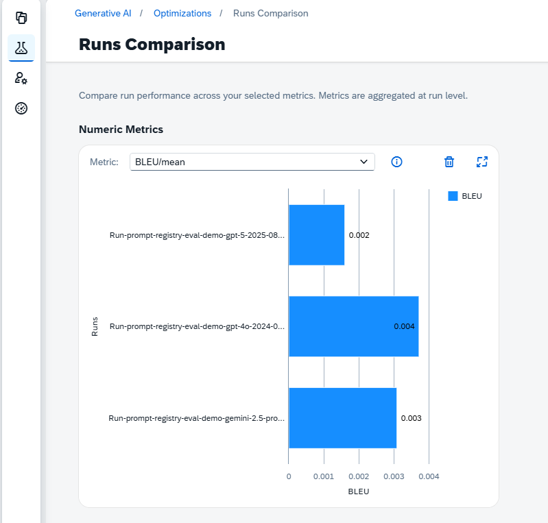

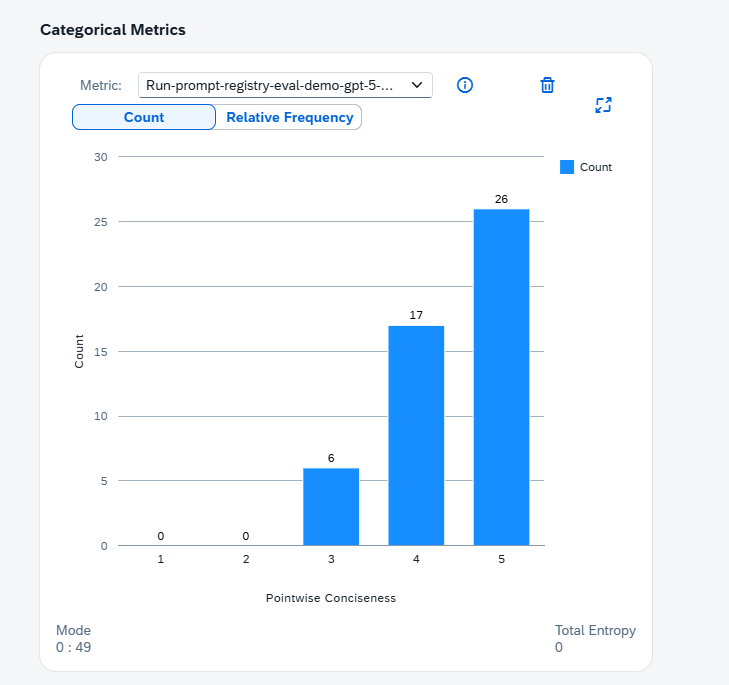

[OPTION END]

[OPTION BEGIN [Python]]

The notebook includes utility scripts to retrieve aggregated metrics, download detailed artifacts, and inspect SQLite results.This returns all metric values per evaluated run.

**Retrieve Aggregate Metrics (Tracking API)**

Aggregated metrics summarize performance across all test samples.
To fetch them using execution ID:

```python
# Get aggregate metrics using execution id
import requests
def retrieve_aggregate_metrics(execution_id):
    headers = _get_headers()
    GET_METRICS_ENDPOINT = f'/v2/lm/metrics?tagFilters=evaluation.ai.sap.com/child-of={execution_id}'
    request_url = f"{AICORE_BASE_URL}{GET_METRICS_ENDPOINT}"
    try:
        response = requests.get(request_url, headers=headers, timeout=120)
        print("response received is ", response)
        result = response.json()
        return result
    except:
        logging.error("Error occurred while attempting to retreive aggeregate metrics for the run")
        raise

runs_data = retrieve_aggregate_metrics(execution_id)
```
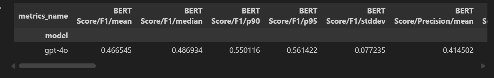

**Download Raw Results (Output Artifact)**

All detailed evaluation outputs are stored as an output artifact in your object store. To download all output files programmatically:

```python
# download the result artifacts from Object store.
import boto3

def download_all_objects(prefix, destination_folder):
    """
    Recursively download all objects from an S3 bucket starting with a specific prefix.

    :param bucket_name: Name of the S3 bucket.
    :param prefix: Prefix to filter objects in the bucket.
    :param destination_folder: Local folder to save the downloaded files.
    """
    s3_client = boto3.client(
            's3',
            aws_access_key_id=AWS_ACCESS_KEY,
            aws_secret_access_key=AWS_SECRET_ACCESS_KEY,
            region_name=AWS_REGION
            )

    # Ensure the destination folder exists
    if not os.path.exists(destination_folder):
        os.makedirs(destination_folder)

    # Paginate through objects
    paginator = s3_client.get_paginator('list_objects_v2')
    pages = paginator.paginate(Bucket=AWS_BUCKET_ID, Prefix=prefix)

    for page in pages:
        if 'Contents' in page:
            for obj in page['Contents']:
                key = obj['Key']
                local_file_path = os.path.join(destination_folder, os.path.relpath(key, prefix))

                # Ensure the local directory structure exists
                local_directory = os.path.dirname(local_file_path)
                if not os.path.exists(local_directory):
                    os.makedirs(local_directory)

                # Download the object
                print(f"Downloading {key} to {local_file_path}")
                s3_client.download_file(AWS_BUCKET_ID, key, local_file_path)


# Download the evaluation results from the object store. Look at execution status under "outputArtifacts" key to see the 'url'
# which shows the data path of where your output results are stored
EXECUTION_ID = execution_id
sqlite_db_prefix = f'{EXECUTION_ID}/tmp/'  # change the prefix based on where your output artifact is stored in the bucket.
destination_folder = 'results-new'

download_all_objects(sqlite_db_prefix, destination_folder)
```

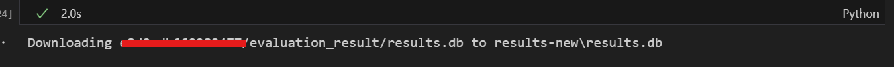

**View Detailed Results (SQLite DB)**

The evaluation stores detailed instance-level results in results.db.

Example: Reading SQLite tables:

```python
# viewing the results from sqlite db in tabular format..
import sqlite3
import pandas as pd
from IPython.display import display, HTML

# Path to your SQLite database file
db_file = 'results-new/results.db'

connection = sqlite3.connect(db_file)

# Specify the table names you want to display
table_names = ['run','configuration', 'submission', 'submission_result', 'evaluation_result'] 

# Create the CSS and HTML container
html_content = """
<style>
/* Container to hold all tables */
.fixed-container {
    max-height: 600px;  /* Total container height */
    overflow-y: auto;   /* Vertical scroll for container */
    border: 2px solid #ddd;
    padding: 10px;
}

/* Table styling */
.table-container table {
    border-collapse: collapse; /* Merge table borders */
    width: 100%; /* Full width for tables */
    margin-bottom: 20px; /* Space between tables */
}

.table-container th, .table-container td {
    border: 1px solid #ddd; /* Add gridlines */
    text-align: left;       /* Align text to the left */
    padding: 8px;           /* Cell padding */
    white-space: nowrap;    /* Prevent text wrapping */
}

.table-container th {
    font-weight: bold;         /* Bold header text */
}

/* Allow dynamic column widths */
.table-container td {
    white-space: nowrap;   /* Prevent wrapping for long text */
}

</style>
<div class="fixed-container">
"""

for table_name in table_names:
    query = f"SELECT * FROM {table_name};"
    df = pd.read_sql_query(query, connection)
    # If you want to see all the rows across all tables, remove/comment the next line
    df = df.head(5)  # Limiting the number of rows displayed
    table_html = df.to_html(classes='table-container', index=False)
    html_content += f"""
    <div class="table-container">
        <h3>Table: {table_name}</h3>
        {table_html}
    </div>
    """

html_content += "</div>"

display(HTML(html_content))

# Close the connection
connection.close()
```

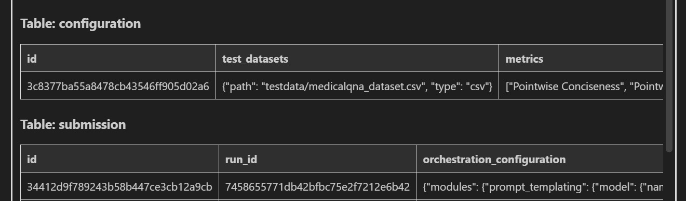

#### Process and Rank Results

This step generates a leaderboard ranking models by their Win Rate (percentage of pairwise victories), providing a robust, comparative measure of the best-performing model and prompt configuration.

```Python
import pandas as pd
import numpy as np
import sqlite3
import json
import os
from IPython.display import display, HTML

# ==========================================
# 1. CONFIGURATION (Separated Groups)
# ==========================================
METRIC_GROUPS = {
    "Categorical": {
        "type": "categorical",
        "description": "Weighted Average (1-5 scale)",
        "metrics": [
            "Pointwise Conciseness", 
            "Pointwise Instruction Following", 
            "Pointwise Correctness", 
            "Pointwise Answer Relevance"
        ]
    },
    "Boolean": {
        "type": "categorical", # Uses same weighted avg logic (0 or 1)
        "description": "Pass Rate (0-1 scale)",
        "metrics": [
            "Exact Match",
            "Content Filter on Input",
            "Content Filter on Output",
            "Language Match",
            "JSON Schema Match"
        ]
    },
    "Numerical": {
        "type": "numerical",
        "description": "Mean Value",
        "metrics": [
            "BLEU", 
            "ROUGE", 
            "BERT Score",
            "test-metric"
        ]
    }
}

# ==========================================
# 2. DATA EXTRACTION
# ==========================================
def extract_db_metadata(db_path):
    if not os.path.exists(db_path): return pd.DataFrame()
    conn = sqlite3.connect(db_path)
    df_runs = pd.read_sql_query("SELECT id, name, tags, config FROM run", conn)
    conn.close()
    
    meta_data = []
    for _, row in df_runs.iterrows():
        run_id = str(row["id"])
        run_name = str(row["name"])
        tags = {}
        config = {}
        try: tags = json.loads(row["tags"]) if isinstance(row["tags"], str) else row["tags"]
        except: pass
        try: config = json.loads(row["config"]) if isinstance(row["config"], str) else row["config"]
        except: pass

        model = "Unknown"
        try: model = config["modules"]["prompt_templating"]["model"]["name"]
        except:
            if isinstance(tags, dict): model = tags.get("evaluation.ai.sap.com/model", "Unknown")
            elif isinstance(tags, list):
                for t in tags: 
                    if t.get("key") == "evaluation.ai.sap.com/model": model = t.get("value")

        meta_data.append({"run_id": run_id, "run_name": run_name, "model": model})
    return pd.DataFrame(meta_data)

def extract_api_metrics(runs_data_resource):
    flat_data = []
    for run in runs_data_resource:
        model = "Unknown"
        for t in run.get("tags", []):
            if t.get("name") == "evaluation.ai.sap.com/model":
                model = t.get("value")
                break
        for m in run.get("metrics", []):
            clean_name = m.get("name", "").replace('"', '').strip()
            flat_data.append({
                "model": model,
                "metrics_name_clean": clean_name,
                "metric_value": m.get("value")
            })
    df = pd.DataFrame(flat_data)
    df['metric_value'] = pd.to_numeric(df['metric_value'], errors='coerce')
    return df

# ==========================================
# 3. SCORING & HELM LOGIC
# ==========================================
def calculate_weighted_avg_score(row, cols):
    """ Returns a score based on counts. 
        Categorical: 1-5 scale. 
        Boolean: 0-1 scale (Pass Rate). 
    """
    total_score = 0
    total_count = 0
    # Check counts 0-5 (covers Boolean 0/1 and Categorical 1-5)
    for rating in range(0, 6):
        col_name = next((c for c in cols if f"/{rating}/count" in c), None)
        if col_name and not pd.isna(row[col_name]):
            count = row[col_name]
            total_score += count * rating
            total_count += count
    return total_score / total_count if total_count > 0 else 0.0

def get_metric_score_series(df_metrics, metric_name, group_type):
    """ Returns a Series of SCORES (Scalar) for each model for a specific metric """
    subset = df_metrics[df_metrics['metrics_name_clean'].str.startswith(metric_name)]
    if subset.empty: return None

    # Pivot to get columns for this metric
    pivot = subset.pivot_table(index='model', columns='metrics_name_clean', values='metric_value', aggfunc='first')
    cols = pivot.columns.tolist()
    
    if group_type == "categorical":
        # Calculate Weighted Average (or Pass Rate for Boolean)
        return pivot.apply(lambda row: calculate_weighted_avg_score(row, cols), axis=1)
    else:
        # Calculate Mean (Numerical)
        c_mean = next((c for c in cols if "mean" in c), None)
        if c_mean: return pivot[c_mean]
        return None

def calculate_group_win_rate(score_table):
    """
    Calculates HELM Win Rate: % of times a model beats another model across all metrics in this group.
    """
    models = score_table.index.tolist()
    metrics = score_table.columns.tolist()
    win_rates = {}

    for model_a in models:
        wins = 0
        comparisons = 0
        
        for model_b in models:
            if model_a == model_b: continue
            
            # Compare across ALL metrics in this table
            for metric in metrics:
                score_a = score_table.at[model_a, metric]
                score_b = score_table.at[model_b, metric]
                
                # Only compare valid scores
                if pd.isna(score_a) or pd.isna(score_b): continue
                
                comparisons += 1
                if score_a > score_b:
                    wins += 1
        
        win_rates[model_a] = wins / comparisons if comparisons > 0 else 0.0
        
    return pd.Series(win_rates)

# ==========================================
# 4. EXECUTION
# ==========================================
db_file = 'results-new/results.db'

# A. Metadata
df_db_meta = extract_db_metadata(db_file)
df_db_unique = df_db_meta.drop_duplicates(subset=['model'], keep='last')

# B. CSS
html_content = """
<style>
.fixed-container {
    max-height: 600px;
    overflow-y: auto;
    border: 2px solid #ddd;
    padding: 10px;
}
.table-container table {
    border-collapse: collapse;
    width: 100%;
    margin-bottom: 20px;
}
.table-container th, .table-container td {
    border: 1px solid #ddd;
    text-align: left;
    padding: 8px;
    white-space: nowrap;
}
.table-container th {
    font-weight: bold;
}
.table-container td {
    white-space: nowrap;
}
</style>
<div class="fixed-container">
"""
if 'runs_data' in locals() and runs_data:
    df_metrics_all = extract_api_metrics(runs_data['resources'])
    
    for group_name, config in METRIC_GROUPS.items():
        
        # 1. Build Score Table
        score_table = pd.DataFrame(index=df_db_unique['model'].unique())
        score_table.index.name = 'model'
        
        valid_metrics = []
        
        # 2. Calculate Scores
        for metric in config["metrics"]:
            scores = get_metric_score_series(df_metrics_all, metric, config["type"])
            if scores is not None:
                score_table[metric] = scores
                valid_metrics.append(metric)
        
        if not valid_metrics:
            continue

        # 3. Calculate HELM Win Rate (Specific to this group)
        score_table['Win Rate'] = calculate_group_win_rate(score_table[valid_metrics])
        
        # 4. Calculate Final Rank
        score_table['Final Rank'] = score_table['Win Rate'].rank(ascending=False, method='min')
        
        # 5. Merge & Format
        df_final = pd.merge(df_db_unique, score_table, on='model', how='inner')
        df_final = df_final.sort_values('Final Rank')
        
        # Rounding
        for c in valid_metrics: df_final[c] = df_final[c].fillna(0.0).astype(float).round(4)
        df_final['Win Rate'] = df_final['Win Rate'].fillna(0.0).astype(float).round(4)
        df_final['Final Rank'] = df_final['Final Rank'].fillna(0).astype(int)
        
        # Columns
        meta_cols = ['run_id', 'run_name', 'model']
        final_cols = meta_cols + ['Win Rate', 'Final Rank'] + valid_metrics
        
        # 6. Generate HTML
        table_html = df_final[final_cols].to_html(classes='table-container', index=False)
        
        html_content += f"""
        <div class="table-container">
            <h3>{group_name} Comparison</h3>
            <p><i>Values: {config['description']}. Win Rate based on head-to-head performance.</i></p>
            {table_html}
        </div>
        """

    html_content += "</div>"
    display(HTML(html_content))
    
else:
    print("'runs_data' missing.")
```
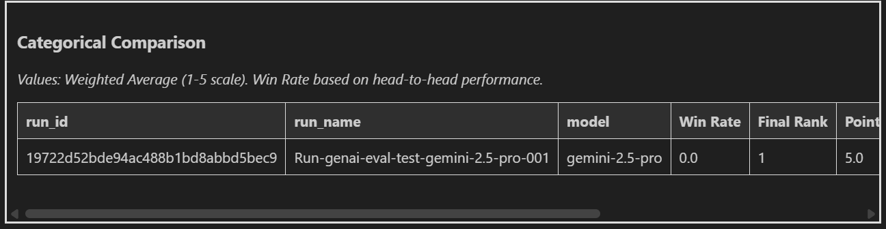

[OPTION END]

[OPTION BEGIN [Bruno]]

Retrieve Aggregate Metrics

Send a GET request:

**GET** 
```bash
{{apiurl}}/v2/lm/metrics?tagFilters=evaluation.ai.sap.com/child-of={{execution_id}}
```
**Retrieve Aggregate Metrics Using Run Name**

Send a GET request:

**GET** 
```bash
{{apiurl}}/v2/lm/metrics?tagFilters=evaluation.ai.sap.com/run-name={{run_name}}
```

This returns aggregated values for:

    - latency

    - token usage

    - metric scores

    - completion count

**Download Raw Results**

1. Open the execution details

2. Copy the output artifact URL

3. Download the folder to obtain

    - step-wise results

    - sqlite_combined/results.db

**Inspect Detailed Results**

Open the SQLite DB in any client to inspect:

    - submissions

    - completion responses

    - evaluation_results (raw metric scores)

    - aggregation_results

    - custom_logs

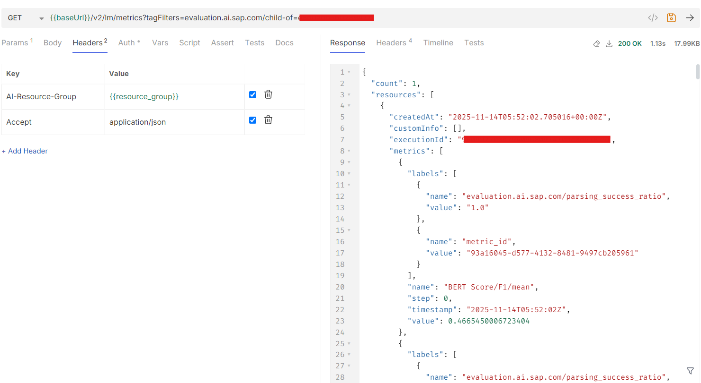

[OPTION END]

### Delete Evaluation Artifacts and Configurations 

Over time, your workspace may accumulate old configurations, executions, and metrics.
SAP AI Core allows you to safely delete these resources once they are no longer needed.

This section explains how to delete:

    - Evaluation Executions

    - Evaluation Configurations

⚠️ Important:

Deletions are permanent and cannot be undone.

[OPTION BEGIN [SAP AI Launchpad]]

**Delete Executions**

1. Go to ML Operations → Executions

2. Select the execution

3. Click Delete

4. Confirm the deletion

**Delete Evaluation Configurations**

1. Go to ML Operations → Configurations

2. Select the configuration you created

3. Click Delete

[OPTION END]

[OPTION BEGIN [Python]]

**1. Delete an Evaluation Execution**

```python
#Delete Execution Id
def delete_execution():
    headers = _get_headers()
    EXEC_ID = execution_id
    GET_EXECUTIONS_ENDPOINT = '/v2/lm/executions/'
    request_url = f"{AICORE_BASE_URL}{GET_EXECUTIONS_ENDPOINT}{EXEC_ID}"
    try:
        response = requests.delete(
                request_url, headers=headers, params={"AI-Resource-Group":AICORE_RESOURCE_GROUP}, timeout=120
            )
        print(response)
        if(response.status_code != 202):
            raise
        result = response.json()
        print(result)
    except:
        logging.error("Error occurred while attempting to delete a Configuration")
        raise
    
delete_execution()
```
**2. Delete an Evaluation Configuration**

```python
def delete_configuration(configuration_id):
    headers = _get_headers()
    endpoint = f"/v2/lm/configurations/{configuration_id}"
    url = f"{AICORE_BASE_URL}{endpoint}"

    response = requests.delete(url, headers=headers)
    print("Status:", response.status_code)
    print(response.text)

# Example:
delete_configuration(configuration_id)
```

[OPTION END]

[OPTION BEGIN [Bruno]]

**1. Delete Execution**

**DELETE Request**
```bash
{{apiurl}}/v2/lm/executions/{{execution_id}}
```
**Headers:**
```
Authorization: Bearer {{access_token}}
AI-Resource-Group: {{resource_group}}
```
**2. Delete Configuration**

```bash
DELETE {{apiurl}}/v2/lm/configurations/{{configuration_id}}
```

[OPTION END]
