# GenAI Grounding Evaluations with SAP AI Core
<!-- description -->  This guide describes how to use SAP AI Core Custom Evaluation to benchmark Large Language Models (LLMs) in a Retrieval-Augmented Generation (RAG) scenario, with a specific focus on groundedness evaluation.

In RAG-based enterprise applications, model responses must be grounded in trusted data sources such as enterprise documents, knowledge bases, or curated repositories. SAP AI Core’s evaluation capabilities allow you to systematically measure grounding quality, retrieval relevance, and alignment of generated responses with source content.

## You will learn
- How to configure a grounding evaluation workflow in SAP AI Core.
- How to upload and manage RAG-based test datasets that include retrieved context.
- How to define grounding-specific evaluation metrics for assessing LLM responses.
- How to execute grounding evaluations and analyze the grounding results.

## Prerequisites
1. **BTP Account**  
   Set up your SAP Business Technology Platform (BTP) account.  
   [Create a BTP Account](https://developers.sap.com/group.btp-setup.html)
2. **For SAP Developers or Employees**  
   Internal SAP stakeholders should refer to the following documentation: [How to create BTP Account For Internal SAP Employee](https://me.sap.com/notes/3493139), [SAP AI Core Internal Documentation](https://help.sap.com/docs/sap-ai-core)
3. **For External Developers, Customers, or Partners**  
   Follow this tutorial to set up your environment and entitlements: [External Developer Setup Tutorial](https://developers.sap.com/tutorials/btp-cockpit-entitlements.html), [SAP AI Core External Documentation](https://help.sap.com/docs/sap-ai-core?version=CLOUD)
4. **Create BTP Instance and Service Key for SAP AI Core**  
   Follow the steps to create an instance and generate a service key for SAP AI Core:  
   [Create Service Key and Instance](https://help.sap.com/docs/sap-ai-core/sap-ai-core-service-guide/create-service-key?version=CLOUD)
5. **AI Core Setup Guide**  
   Step-by-step guide to set up and get started with SAP AI Core:  
   [AI Core Setup Tutorial](https://developers.sap.com/tutorials/ai-core-setup.html)
6. An Extended SAP AI Core service plan is required, as the Generative AI Hub is not available in the Free or Standard tiers. For more details, refer to 
[SAP AI Core Service Plans](https://help.sap.com/docs/sap-ai-core/sap-ai-core-service-guide/service-plans?version=CLOUD)
7. **Orchestration Deployment**
   Ensure at least one orchestration deployment is ready to be consumed during this process. 
Refer to [this tutorial understand the basic consumption of GenAI models using orchestration.](https://developers.sap.com/tutorials/ai-core-orchestration-consumption.html)
8. **Basic Knowledge**
    Familiarity with the orchestration workflow is recommended
9. **Install Dependencies**
    Install the required Python packages using the requirements.txt file provided.
Download [requirements.txt](img/requirements.txt)

💡 Right-click the link above and choose **"Save link as..."** to download it directly.


**Below are the Steps to Run a GenAI Evaluation in SAP AI Core**

### Pre-Read

This tutorial uses a structured evaluation dataset named **emanual.csv** Placed inside the folder **DATASET_RAG**

You can access the DATASET_RAG.zip from the GitHub repository.  

- [Download Full Dataset as ZIP](https://github.com/SAP-samples/aicore-genai-samples/tree/main/genai-sample-apps/Evaluation/evaluation_with_grounding/data)  

**NOTE:** If you download the ZIP file, extract it and navigate to the **DATASET_RAG** folder. Place the entire folder in your designated location for further use.  
  
**Dataset**

It leverages the publicly available **emanual.csv**, which contains commonly asked emanual questions. Each entry includes:

    - topic (user query)
    - answer
    - context

#### How it works

- A query and its retrieved context are sent to the model.

- The model generates a grounded response.

- The grounding metrics evaluate if the output faithfully uses the provided context.

### Notebook Reference

For hands-on execution and end-to-end reference, use the accompanying [Evaluation Grounding Notebook](https://github.com/SAP-samples/aicore-genai-samples/blob/main/genai-sample-apps/Evaluation/evaluation_with_grounding/evaluation_RAG.ipynb ). It includes complete Python code examples that align with each step of this tutorial — from dataset preparation and artifact registration to configuration creation, execution, and result retrieval.

💡 Even though this tutorial provides stepwise code snippets for clarity, the notebook contains all required imports, object initializations, and helper functions to run the flow seamlessly in one place.

**To use the notebook:**
- Download and open [notebook](https://github.com/SAP-samples/aicore-genai-samples/blob/main/genai-sample-apps/Evaluation/evaluation_with_grounding/evaluation_RAG.ipynb) in your preferred environment (e.g., VS Code, JupyterLab).
- Configure your environment variables such as AICORE_BASE_URL, AICORE_AUTH_TOKEN, and object store credentials .
- Execute each cell in order to reproduce the complete Evaluation Grounding workflow demonstrated in this tutorial.

### Environment Variables Setup

[OPTION BEGIN [SAP AI Launchpad]]

- Navigate to your SAP AI Core Launchpad.

- In the Workspaces section, click on "Add" to create a new workspace.
    - A workspace in SAP AI Core is a logical container that holds your resources (like models and pipelines) and provides the isolation needed for your projects.

- When prompted, enter your AI Core credentials (such as Client ID, Client Secret, and Base URL).
    - Note: If you're unsure about where to find these credentials, refer to this [guide](https://developers.sap.com/tutorials/ai-core-generative-ai.html#1c4f36d7-f345-4822-be00-c15f133ff7d8). 

- Once the workspace is successfully created, select your desired Resource Group to begin the evaluation process.

Refer to the screenshot below for guidance:


[OPTION END]

[OPTION BEGIN [Python]]

- Open **Visual Studio Code or Jupyter Notebook**. Create a new file with the .ipynb extension (e.g., custom_evaluation.ipynb).
- Create a **.env** file in the root directory of your project.
- Add your **AI Core** and **AWS credentials** as shown below.

```env
AICORE_CLIENT_ID=""
AICORE_CLIENT_SECRET=""
AICORE_AUTH_URL=""
AICORE_BASE_URL=""
AICORE_RESOURCE_GROUP="default"

AWS_ACCESS_KEY=""
AWS_SECRET_ACCESS_KEY=""
AWS_BUCKET_ID=""
AWS_REGION=""
```

**Note:** Replace the empty strings "" with your actual credentials.

Refer to the below screenshot for clarity:


#### Install Dependencies

Install the required packages using the [requirements.txt](img/requirements.txt) file you downloaded in the Prerequisites section.
```bash
pip install -r requirements.txt
```
#### Connect to AI Core Instance

Once the environment variables are set and dependencies are installed, run the following code to connect to your instance:

```PYTHON
# Loading the credentials from the .env file
from gen_ai_hub.proxy.gen_ai_hub_proxy import GenAIHubProxyClient
from dotenv import load_dotenv
import os

# Load environment variables
load_dotenv(override=True)

# AI Core Credentials
AICORE_BASE_URL = os.getenv("AICORE_BASE_URL")
AICORE_RESOURCE_GROUP = os.getenv("AICORE_RESOURCE_GROUP")
AICORE_AUTH_URL = os.getenv("AICORE_AUTH_URL")
AICORE_CLIENT_ID = os.getenv("AICORE_CLIENT_ID")
AICORE_CLIENT_SECRET = os.getenv("AICORE_CLIENT_SECRET")

# AWS Credentials
AWS_ACCESS_KEY = os.getenv("AWS_ACCESS_KEY")
AWS_BUCKET_ID = os.getenv("AWS_BUCKET_ID")
AWS_REGION = os.getenv("AWS_REGION")
AWS_SECRET_ACCESS_KEY = os.getenv("AWS_SECRET_ACCESS_KEY")

# Initialize GenAIHub Proxy Client
client = GenAIHubProxyClient(
    base_url=AICORE_BASE_URL,
    auth_url=AICORE_AUTH_URL,
    client_id=AICORE_CLIENT_ID,
    client_secret=AICORE_CLIENT_SECRET,
    resource_group=AICORE_RESOURCE_GROUP
)
```

**NOTE:** 
- Ensure the **requirements.txt** installation completes successfully before running the code.
- If you face any issues, recheck your **.env** values and installed packages.

[OPTION END]

[OPTION BEGIN [Bruno]]

- Download the [Bruno_collections](img/AI_Core.json) file

- please follow the steps in the [Tutorial](https://developers.sap.com/tutorials/ai-core-orchestration-consumption.html) to set up your environment, refer step - **Set Up Your Environment and Configure Access** and proceed till generating the token

[OPTION END]

**Important Note:**  Please note that for using the document grounding service, your request must contain the **document grounding label** set to **true**. Therefore, existing resource groups without the label won’t work.

### Preparing Dataset Files and Reference Files

[OPTION BEGIN [SAP AI Launchpad]]

> **Note:** This step involves local setup using Python and does not require any action on the SAP AI Launchpad.

[OPTION END]

[OPTION BEGIN [Python]]

In this step, we prepare the dataset and optional reference documents required for grounding evaluation.

The evaluation notebook dynamically detects the dataset file from a predefined folder structure.
You are not required to hardcode the dataset filename.

```Python
import os
import json
def get_dataset_file_name(folder_path):
    """
    Retrieves the name of the first file in the specified folder.
    """
    if not os.path.isdir(folder_path):
        print(f"The folder path '{folder_path}' does not exist.")
        return None

    items_in_folder = os.listdir(folder_path)

    for item in items_in_folder:
        item_path = os.path.join(folder_path, item)
        if os.path.isfile(item_path):
            return item

    print(f"No files were found in the folder '{folder_path}'.")
    return None


# --- MAIN EXECUTION ---
DATASET_FOLDER = "./DATASET_RAG/testdata"

DATASET_NAME = get_dataset_file_name(DATASET_FOLDER)

if DATASET_NAME:
    print(f"Dataset name: {DATASET_NAME}")
else:
    print("Missing run or dataset file.")
    raise SystemExit("Exiting due to missing run/dataset file.")
```

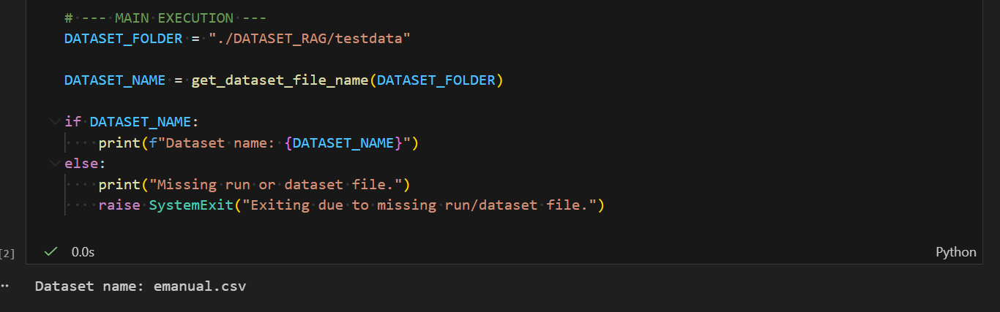

[OPTION END]

[OPTION BEGIN [Bruno]]

> **Note:** This step involves local setup using Python and does not require any action on Bruno.

[OPTION END]

### Registering an Object Store Secret in AI Core

You can upload the orchestration run files, grounding test datasets, and any optional metric definitions to SAP AI Core using the Tracking API. To upload these files, you must first register an object store secret containing your object store credentials

[OPTION BEGIN [SAP AI Launchpad]]

- Open the **SAP AI Core Launchpad** and navigate to the **Administration** tab.
- Select the **Object Store** section from the left-hand menu.
- Click on **“Add”** to register a new object store secret.
- Fill in the required bucket details as shown in the screenshot below.


In the **Secret** field, use the following structure to provide your AWS credentials:

```json
{
    "AWS_ACCESS_KEY_ID": "Enter Your value",
    "AWS_SECRET_ACCESS_KEY": "Enter Your value"
}
```

[OPTION END]

[OPTION BEGIN [Python]]
To make your evaluation files available for AI Core orchestration, you need to:

- Upload them to an object store (e.g., AWS S3).
- Register the object store secret in AI Core.

**Step 4.1: Setup Authentication and Headers**

First, define the authentication headers for AI Core REST API calls.

```PYTHON
def _get_headers():
    headers = {
        "Authorization": client.get_ai_core_token(),
        "AI-Resource-Group": AICORE_RESOURCE_GROUP,
        "Content-Type": "application/json",
    }
    return headers
```

**Step 4.2: Register Object Store Secret in AI Core**

Register your S3 bucket and credentials as a secret.

```PYTHON
# Register S3 secret with AI Core which will be used an input source 
import requests

def register_oss_secret():
    headers = _get_headers()
    
    POST_SECRETS_ENDPOINT = '/v2/admin/objectStoreSecrets'
    request_url = f"{AICORE_BASE_URL}{POST_SECRETS_ENDPOINT}"
    
    request_body = {
        "name": "genai-data",
        "data": {
            "AWS_ACCESS_KEY_ID": AWS_ACCESS_KEY,
            "AWS_SECRET_ACCESS_KEY": AWS_SECRET_ACCESS_KEY
        },
        "type": "S3",
        "bucket": AWS_BUCKET_ID,
        "endpoint": "s3-eu-central-1.amazonaws.com",
        "region": AWS_REGION,
        "pathPrefix": ""    
    }
    try:
        response = requests.post(
            request_url, headers=headers, data=json.dumps(request_body), timeout=120
        )
        result = response.json()
        print(result)
        return result
    except:
        logging.error("Error occurred while attempting to create object store secret")
        raise

register_oss_secret()
```
[OPTION END]

[OPTION BEGIN [Bruno]]

Generic secrets securely store AWS S3 credentials required for document access

•	Expand **objectStoreSecrets** under admin and select create a secret request

Use the below payload to create a secret for AWS S3 with NoAuthentication as authentication type.

```CODE
{
    "name": "genai-data",
    "data": {
        "AWS_ACCESS_KEY_ID": "<access key id>",
        "AWS_SECRET_ACCESS_KEY": "<secret access key>", 
    },
    "type": "S3",
    "bucket": "<bucket>",
    "endpoint": "<url>",
    "region": "<region>",
    "pathPrefix": ""    
    }
```
• Ensure that all values in the data dictionary are Base64-encoded as per AWS S3 credential requirements

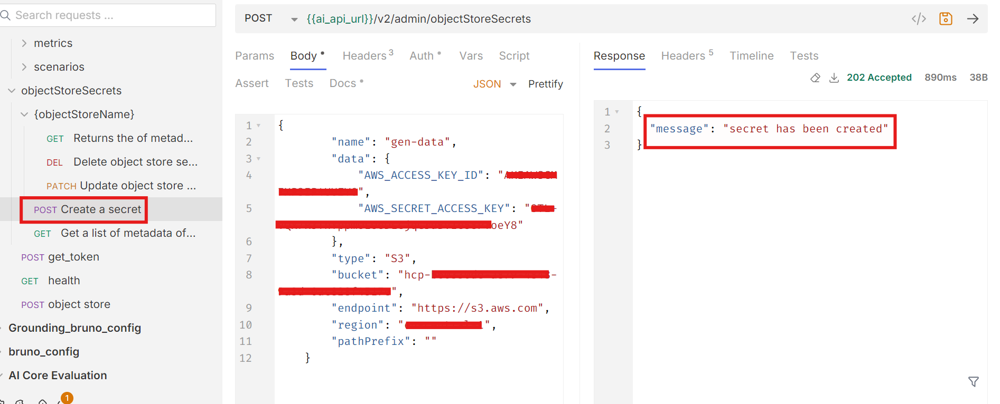

[OPTION END]

> ⚠️ **Important Note (Must Read)**
>
> - You must **create an object store secret named `default`** to store **output artifacts** from orchestration runs. This is **mandatory**.
> - For **input artifacts**, you may create additional object store secrets with different names if needed.
> - If a secret named `default` is not configured, orchestration runs will **fail** due to missing output target setup.

### Create a Generic Secret

In the next step, we create a secret that enables grounding by adding on the "labels" config. This generic secret needs to be created to provide details of the hyperscaler and bucket details so that grounding service will know how to retrieve data from it.

[OPTION BEGIN [SAP AI Launchpad]]

**Generic secret for AWS S3**

1. **Open the Workspaces app** and choose the **AI API connection**.

2. If needed, toggle between **tenant-level** and **resource-group-level** secret creation.

3. Navigate to the **SAP AI Core Administration** app and go to **Generic Secrets**.

4. Choose **Add** to create a new secret.

5. Fill out the form as follows:
   - **Resource Group**: `<your-resource-group>`
   - **Name**: `aws-credentials-1`
   - **Secret (JSON format)**:
  
```json
  {
    "access_key_id": "<YOUR_AWS_ACCESS_KEY_ID>",
    "secret_access_key": "<YOUR_AWS_SECRET_ACCESS_KEY>",
    "bucket": "<YOUR_BUCKET_NAME>",
    "host": "<YOUR_S3_HOST_URL>",
    "region": "<YOUR_AWS_REGION>",
    "url": "<FULL_S3_ENDPOINT_URL>",
    "username": "<OPTIONAL_USER_IDENTIFIER>",
    "authentication": "NoAuthentication",
    "description": "AWS S3 credentials for document grounding",
    "type": "HTTP",
    "proxyType": "Internet"
  }

```

**Labels**

Add the following key-value pairs as labels:

| Key                                             | Value |
|--------------------------------------------------|-------|
| ext.ai.sap.com/document-grounding              | true  |
| ext.ai.sap.com/documentRepositoryType          | S3    |

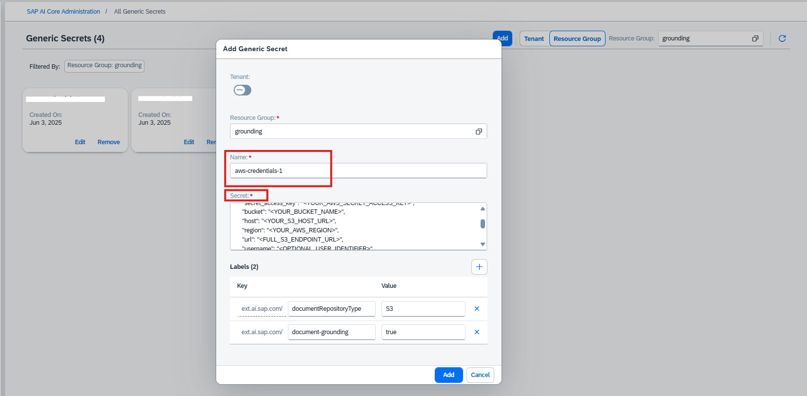

Click Add to save the secret.
  
[OPTION END]

[OPTION BEGIN [Python]]

Generic secrets securely store aws credentials required for document access

```python
import time
import base64
def encode_base64(value):
    return base64.b64encode(value.encode('utf-8')).decode('utf-8')
  
def create_generic_secret():
    payload ={
    "name": "groundingsecret",
    "data": {
      "url": encode_base64("https://s3-eu-central-1.amazonaws.com"),                                  
      "authentication": encode_base64("NoAuthentication"),
      "description": encode_base64("grounding secret"),
      "access_key_id": encode_base64(AWS_ACCESS_KEY),
      "bucket": encode_base64(AWS_BUCKET_ID),
      "host": encode_base64(AWS_HOST),
      "region": encode_base64("eu-central-1"),
      "secret_access_key": encode_base64(AWS_SECRET_ACCESS_KEY),
      "username": encode_base64(AWS_USERNAME),
    },
    "labels": [
      {
        "key": "ext.ai.sap.com/document-grounding",
        "value": "true"
      },
      {
        "key": "ext.ai.sap.com/documentRepositoryType",
        "value": "S3"
      }
    ]
}
    time.sleep(60)
    try:
      headers = _get_headers()
      api_url = f"{AICORE_BASE_URL}/v2/admin/secrets"
      response = requests.post(api_url, headers=headers, json=payload)
      if(response.status_code == 200):
          print("Generic secret created successfully")
      else:
          print(f"Failed to create generic secret: {response}")
    except Exception as e:
          print(f"Error creating secret: {e}")
create_generic_secret()
```
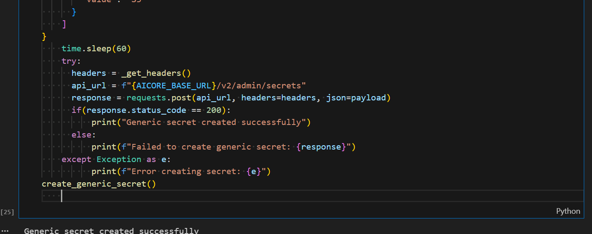

[OPTION END]

[OPTION BEGIN [Bruno]]

**Generic secret for AWS S3**

Generic secrets securely store AWS S3 credentials required for document access

**Endpoint:**
```
POST:{{ai_api_url}}/v2/admin/secrets
```

Use the below payload to create a secret for AWS S3 with NoAuthentication as authentication type.

```CODE

{
  "name": "<generic secret name>",                        // Name of the generic secret to be created
  "data": {
    "url": "<url>",                                       // Base64 encoded value of url
    "authentication": "Tm9BdXRoZW50aWNhdGlvbg=",          // Base64 encoded value for NoAuthentication
    "description": "<description of generic secret>",     // Base64 encoded description of the secret
    "access_key_id": "<access key id>",                   // Base64 encoded value of access key id
    "bucket": "<bucket>",                                 // Base64 encoded value of bucket name
    "host": "<host>",                                     // Base64 encoded value of host
    "region": "<region>",                                 // Base64 encoded value of region
    "secret_access_key": "<secret access key>",           // Base64 encoded value of secret access key
    "username": "<username>",                             // Base64 encoded value of username
    "type": "SFRUUA==",                                   // [Optional] Base64 encoded value for HTTP
    "proxyType": "SW50ZXJuZXQ=",                          // [Optional] Base64 encoded value for Internet
  },
  "labels": [
    {
      "key": "ext.ai.sap.com/document-grounding",         // Label for Document Grounding feature
      "value": "true"
    },
    {
      "key": "ext.ai.sap.com/documentRepositoryType",     // Label for Document Repository Type
      "value": "S3"
    }
  ]
}
```

•Ensure that all values in the data dictionary are Base64-encoded as per AWS S3 credential requirements.

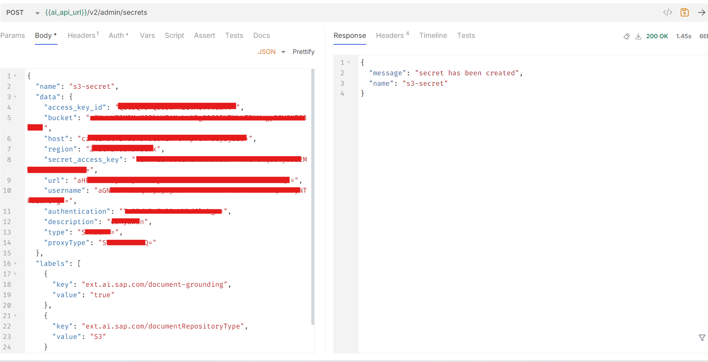

[OPTION END]

### Create a Grounding Pipeline

Before running grounding evaluations, you must create a grounding pipeline in SAP AI Core. This pipeline is responsible for reading documents from your object store, processing them, and preparing them for retrieval.

[OPTION BEGIN [SAP AI Launchpad]]

1. Navigate to Generative AI Hub from the side menu.

2. Click on Grounding Management.

3. Click Create to open the Create Data Repository wizard.

4. In the **Create Data Repository** form:
   - **Embedding Model**: Leave as default (`Text Embedding 3 Large`).
   - **Document Store Type**: Select `S3`.
   - **Document Grounding Generic Secret**: Select the AWS secret you created in **Step 5** (e.g., `aws-credentials-1`).

5. Once selected, you're ready to proceed. The required S3 bucket, region, and credentials are handled through the secret.

6. Click **Create** to finish.

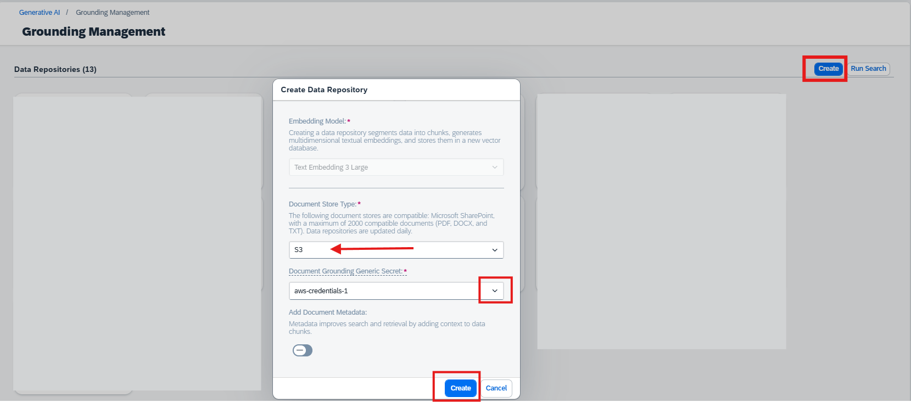

---

> ✅ After completing this step, your knowledge base (data repository) will be linked to your document source. The documents will be embedded and made available for grounding in the chat experience.

[OPTION END]

[OPTION BEGIN [Python]]

The following code creates an S3-based grounding pipeline using the generic secret you created earlier:

```python
def create_s3_grounding_pipeline():
    headers = _get_headers()
    api_url = f"{AICORE_BASE_URL}/v2/lm/document-grounding/pipelines"
    payload = {
        "type": "S3",
        "configuration": {
            "destination": "groundingsecret"
        }
    }
    time.sleep(5)  

    try:
        response = requests.post(api_url, headers=headers, json=payload)
        if response.status_code == 201:
            print("S3 document grounding pipeline created successfully")
        else:
            print(f"Failed to create pipeline. Status: {response.status_code}, Response: {response.text}")
    except Exception as e:
        print(f"Error creating S3 document grounding pipeline: {e}")
create_s3_grounding_pipeline()
```

This registers the grounding pipeline in SAP AI Core. After creation, you will upload documents and trigger pipeline runs to populate the data repository.

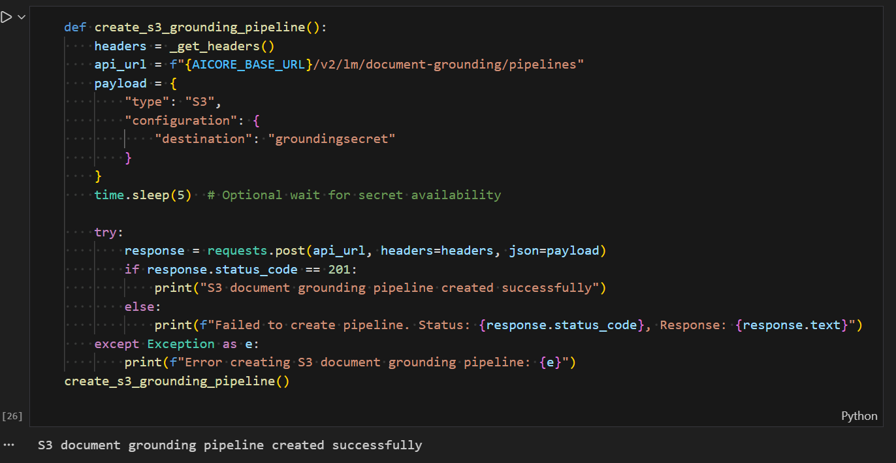

[OPTION END]

[OPTION BEGIN [Bruno]]

You can create the pipeline through an API request in Bruno like below:

**Endpoint:**
```
POST: {{ai_api_url}}/v2/lm/document-grounding/pipelines
```

**Headers:**
```bash
Content-Type: application/json
Authorization: Bearer <token>
```
**Body:**

```json
{
  "type": "S3",
  "configuration": {
    "destination": "s3-secret"
  }
}
```
This creates the S3-based grounding pipeline and links it to your previously created generic secret.

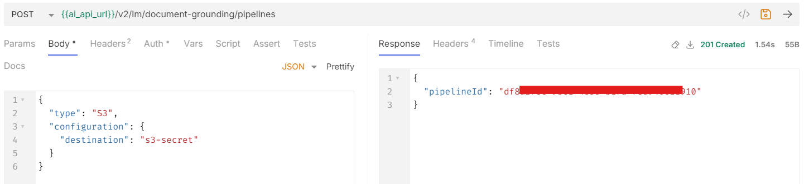

[OPTION END]

### Upload Evaluation Files to Object Store and Register Artifact in AI Core

[OPTION BEGIN [SAP AI Launchpad]]

After creating the secret, upload your evaluation files to the S3 bucket and register them as an artifact in AI Core.

#### Register Uploaded Files as Artifact in AI Core

To register your evaluation dataset with SAP AI Core, you need to upload it as an artifact. Follow the instructions below using the **SAP AI Launchpad UI**.

---

- Open the **SAP AI Core Launchpad**.
- Navigate to the **Generative AI/Optimization/Artifacts** section to create dataset artifact.


- On the **Artifacts** section, click **add**.

---

- On the **General Information** screen, enter the following:

  - **Select Scenario:** `genai-evaluations`  
  - **Name:** `genai-eval-test-data`  
  - **Description:** `Demo artifacts for evaluation flow.`
  - **Select Object Store:** `genai-data`
  - **Sub-folder path:** `genaiEvaluation/<your-user-id>`

   > 💡 Replace `<your-user-id>` with your **SAP BTP user ID** or the folder path in your object store where the evaluation files are uploaded.

- On the **Labels** screen, click **“Add Label”** and provide the following:

  - **Key:** `prompt-evaluation`  
  - **Value:** `true`  
  *(Note: The prefix `ext.ai.sap.com/` is automatically pre-filled in the UI.)*

  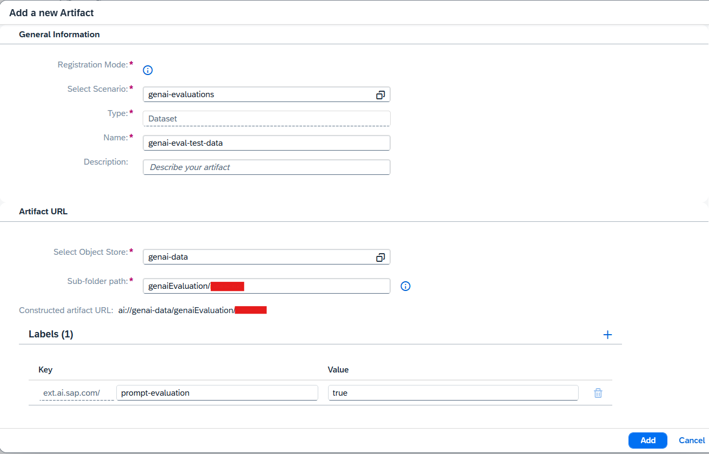

- Review all entered details carefully.
- Click **“Add”** to complete the artifact registration.

[OPTION END]

[OPTION BEGIN [Python]]

After creating the secret, upload your evaluation files to the S3 bucket and register them as an artifact in AI Core.

**Step 5.1: Upload Files to S3 Bucket**

```PYTHON
# uploading these files to Object store to register as an artifact inside ai core

import boto3
import os
import uuid

def upload_folder_to_s3(folder_path, bucket_name, s3_prefix=""):
    """
    Upload a folder to an S3 bucket recursively.

    :param folder_path: The local folder path to upload.
    :param bucket_name: The name of the S3 bucket.
    :param s3_prefix: Optional prefix to use for the S3 keys (e.g., subfolder in the bucket).
    """
    s3_client = boto3.client(
            's3',
            aws_access_key_id=AWS_ACCESS_KEY,
            aws_secret_access_key=AWS_SECRET_ACCESS_KEY,
            region_name=AWS_REGION
            )

    for root, dirs, files in os.walk(folder_path):
        for file_name in files:
            print("val of root is ", file_name)
            local_path = os.path.join(root, file_name)
            # Compute the relative path for the S3 key
            relative_path = os.path.relpath(local_path, folder_path)
            s3_key = os.path.join(s3_prefix, relative_path).replace("\\", "/")  # Ensure S3-compatible paths
            print("val of s3 key is ", s3_key)
            print(f"Uploading {local_path} to s3://{bucket_name}/{s3_key}")
            
            # Upload the file
            s3_client.upload_file(local_path, bucket_name, s3_key)

# Example usage
folder_to_upload_testdata = "./DATASET_RAG"
user_directory_prefix = "" # replace with your i-number as string here
prefix_guid = user_directory_prefix if user_directory_prefix is not None else str(uuid.uuid4().hex)
s3_testdata_prefix = f"genaiEvaluation/{prefix_guid}/testdata" # Leave empty for root of the bucket

upload_folder_to_s3(folder_to_upload_testdata, AWS_BUCKET_ID, s3_testdata_prefix)
input_artifact_path = f"ai://genai-simplified-notebook/genaiEvaluation/{prefix_guid}"
```
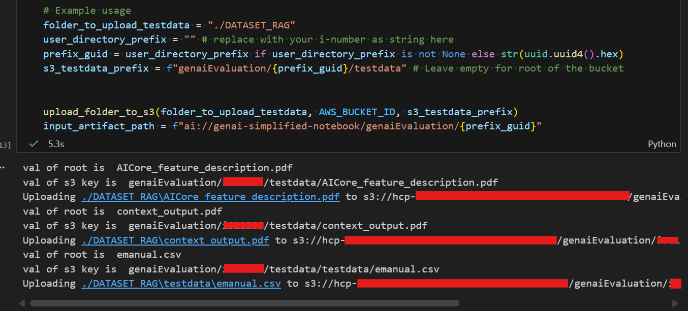

**Step 5.2: Register Uploaded Files as Artifact in AI Core**

```PYTHON
import requests

# Registering the uploaded files from AWS as artifacts to use inside configuration.

def register_artifact():
    headers = _get_headers()
    
    GET_ARTIFACTS_ENDPOINT = '/v2/lm/artifacts'
    request_url = f"{AICORE_BASE_URL}{GET_ARTIFACTS_ENDPOINT}"
    
    request_body = {
        "labels": [
            {
            "key": "ext.ai.sap.com/prompt-evaluation",
            "value": "true"
            }
        ],
        "name": "genai-eval-test-data",
        "kind": "other",
        "url": input_artifact_path, # input artifact path
        "description": "demo artifacts for evaluation flow.",
        "scenarioId": "genai-evaluations"
    }
    try:
        response = requests.post(
            request_url, headers=headers, data=json.dumps(request_body), timeout=120
        )
        result = response.json()
        print(result)
        return result['id']
    except:
        logging.error("Error occurred while attempting to create an execution")
        raise
        

artifact_id = register_artifact()
```
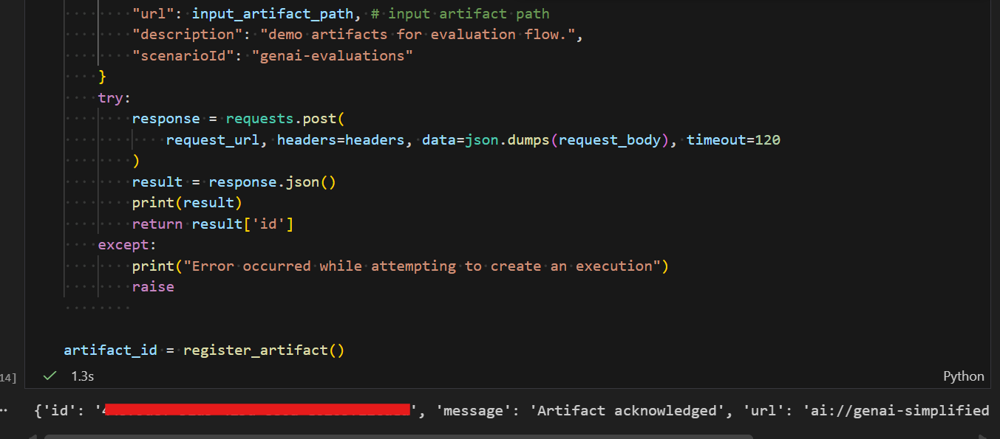

[OPTION END]

[OPTION BEGIN [Bruno]] 

Before registering a dataset artifact in Bruno, you must upload your CSV file to the SAP AI Core object store using the Dataset API.
Bruno cannot upload files directly to S3; therefore, this step is required.

**Prerequisites**

    - An object store secret must already exist in your resource group.Typically, this is the default secret named **default**.

    - The Dataset API currently supports:

        - S3 object stores only

        - CSV file uploads

**Upload Your Dataset**

Use the Dataset API – Upload File request in Bruno:

```bash
PUT:{{ai_api_url}}/v2/lm/dataset/files/{{secretName}}/{{datasetPath}}
```

**Headers**

```json
Authorization: Bearer {{token}}
AI-Resource-Group: {{resourceGroup}}
Content-Type: text/csv
```

**Body**

Upload your .csv file directly as binary in Bruno’s Body 

Example Path Values:

    - secretName: default

    - datasetPath: testdata/emanual.csv

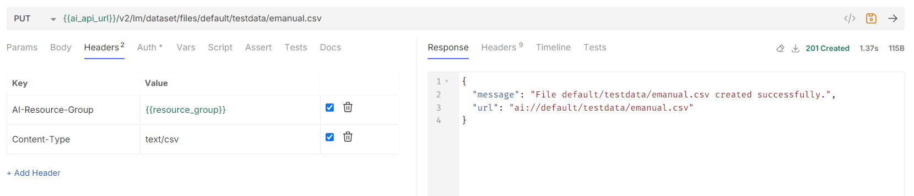

**Note:** 

Save the ai://… URL — you will use this when creating the dataset artifact.

**Register the Dataset Artifact**

- Click  on **Register artifact** under lm -> artifacts in bruno collection to register the artifact

```CODE
{
    "name": "aiconfig",
    "kind": "dataset",
    "url": "ai://default/testdata/emanual.csv",
    "scenarioId": "genai-evaluations"
}
```
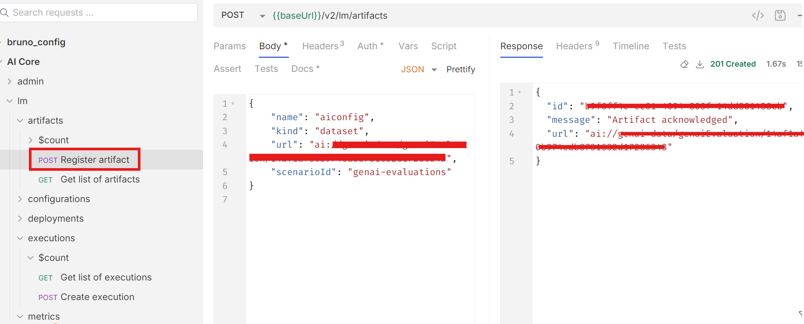

[OPTION END]

### Create an Evaluation Configuration

[OPTION BEGIN [SAP AI Launchpad]]

**Create Orchestration Registry Configuration**

The Orchestration Registry allows you to define how different modules—such as prompting, grounding, LLM execution, and safety filters—work together as a single workflow. By creating an orchestration configuration, you specify the exact steps the system will execute for each evaluation input.

- Go to Generative AI Hub → Orchestration → Orchestration Configurations

- click create

- In Grounding section pass input variables, output variable, and in Data repositories add the selected pipeline created in previous step

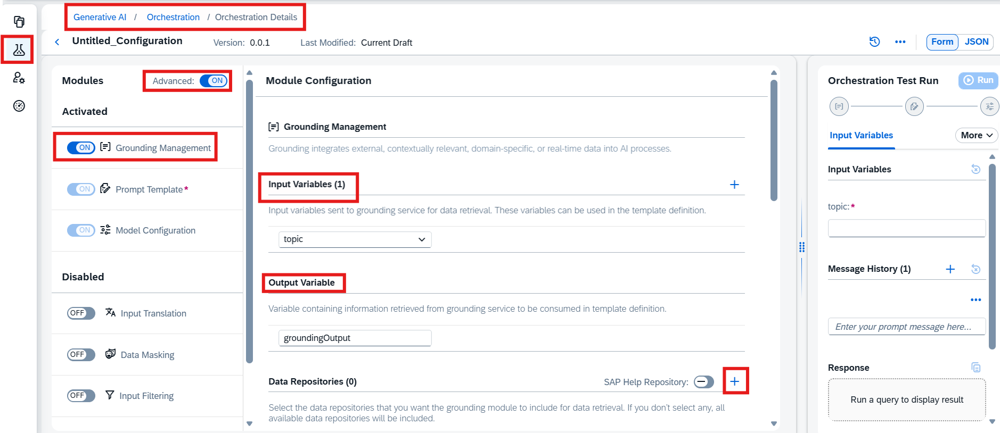

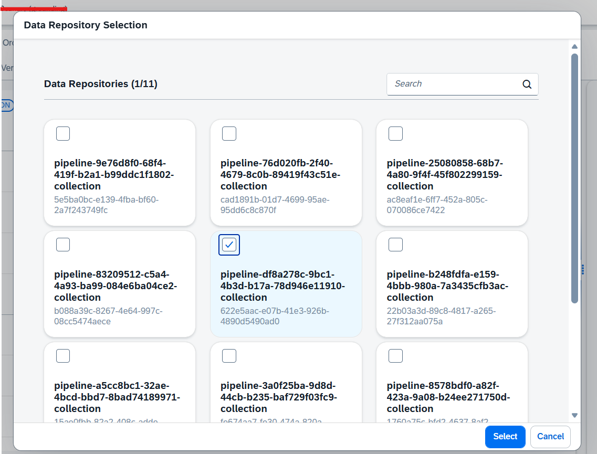

- In templating  add the user prompt

```json
You are a helpful assistant specialized in SAP-related topics. Answer the following SAP question using the provided context. If the answer is not explicitly available in the context, respond with: `The answer is not available in the provided context.`

Request: {{?topic}}.

Context: {{?groundingOutput}}
```
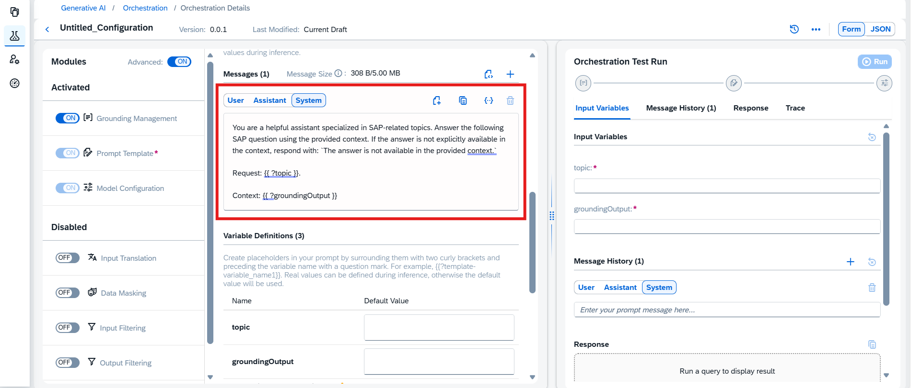

- select the model in model configuration and save

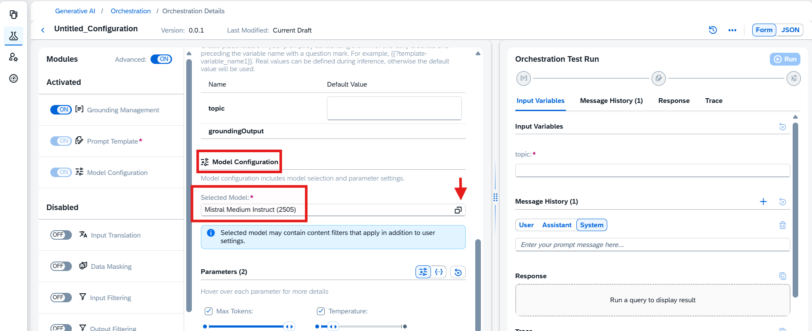

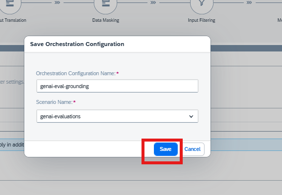


To begin evaluating your model, you need to create an Evaluation Configuration using the **genai-evaluations** scenario in SAP AI Core. This configuration defines what to evaluate, using which dataset, with which metrics, and how.

#### Steps to Create Evaluation Configuration

1. Go to Generative AI Hub → Optimization.

2. Click Create to start a new evaluation configuration.

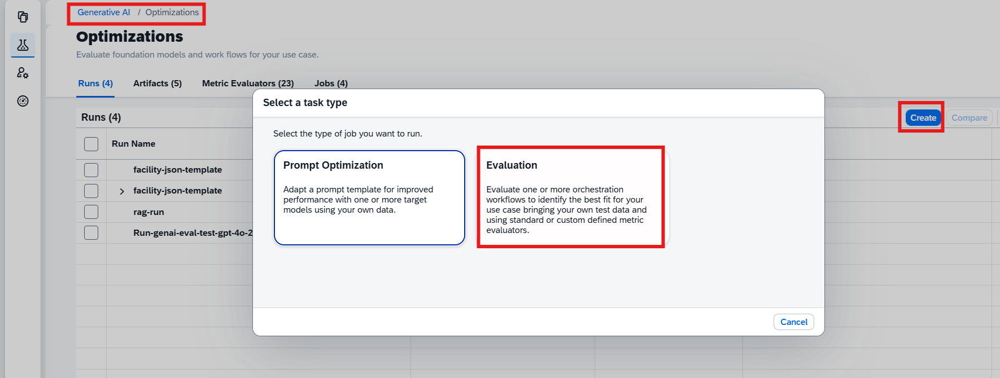

- Select Test Input / Runs -> orchestration configuration

Then:

    - Select your registered dataset artifact

    - Enter the dataset path (example):
    testdata/emanual.csv

    - Set the number of test samples (e.g., 20)

   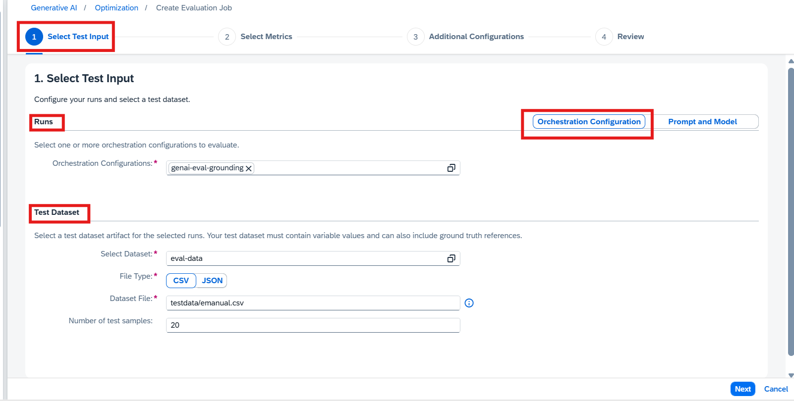

- Click **Next** to go to Metrics selection.

#### Select Evaluation Metrics

Choose the metrics you want to evaluate.

You may choose one or multiple system-defined or custom metrics—examples:

    - Pointwise RAG Groundedness

    - Pointwise RAG Context Relevance

    - Pointwise RAG Context Precision

    - Pointwise RAG Completeness

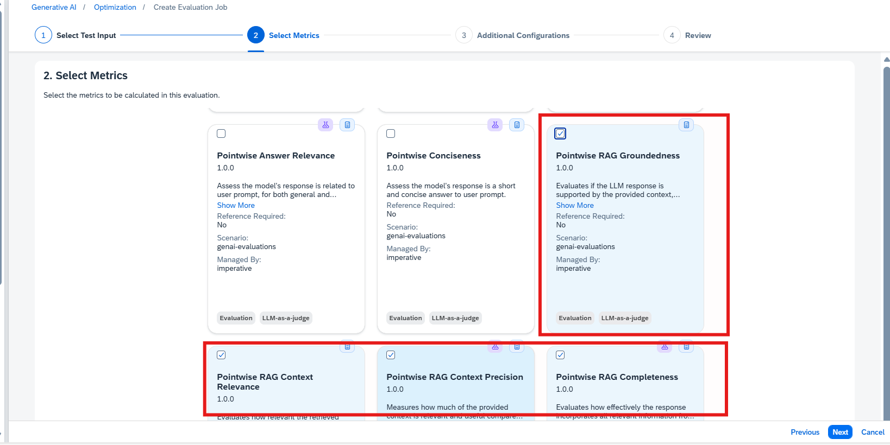

---

> 📘 **Helpful Resources**:
> 
> - [System-Defined Evaluation Metrics – SAP Documentation](https://help.sap.com/docs/sap-ai-core/generative-ai-hub/system-defined-evaluation-metrics)  
> - [Define Your Own Custom Metrics – SAP Guide](https://help.sap.com/docs/sap-ai-core/generative-ai-hub/custom-metrics)  
>   *(If your evaluation requires domain-specific or advanced scoring logic)*

> **Note: You may select additional metrics based on your use case.**

---

#### Additional Configuration

- Set **Number of Repetitions** to `1`.
- Choose an existing deployment for **Orchestration Endpoint**.
- In the **Input Variable Mapping**, enter the following mapping:

    ```json
    {
    "prompt/question": "data/topic"
    }
    ```
    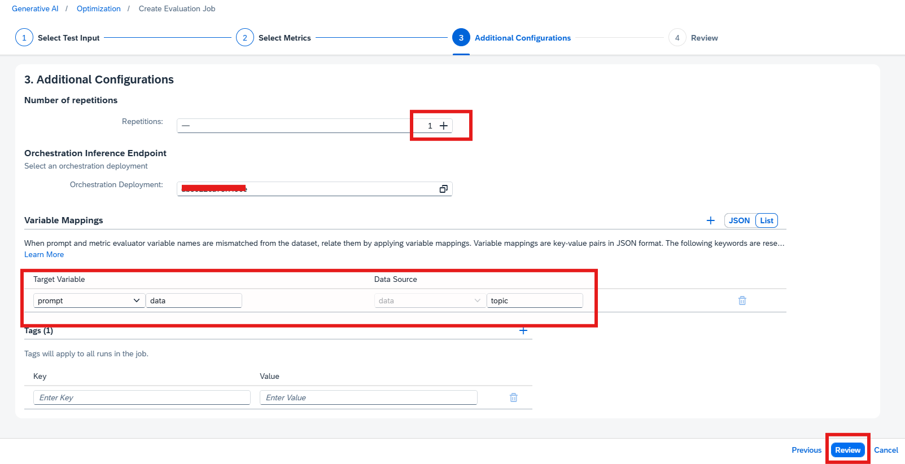
---
[Learn more about variable mapping](https://help.sap.com/docs/sap-ai-core/generative-ai-hub/variable-mapping)

#### Final Review & Start

- Review all the details on the summary page.
- Once confirmed, click **Create** to start the evaluation job.
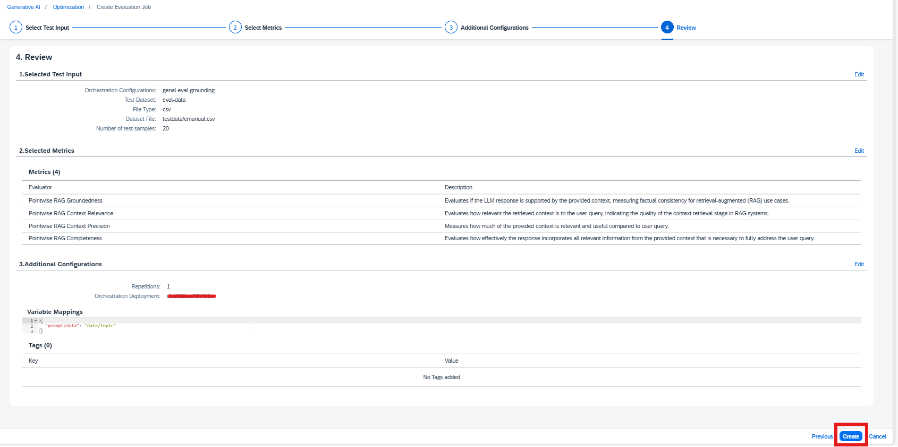

> ✅ You have now successfully configured and triggered a Generative AI Evaluation.

[OPTION END]

[OPTION BEGIN [Python]]

To begin evaluating your model programmatically, you need to create an Evaluation Configuration using the **genai-evaluations** scenario in **SAP AI Core**. This configuration defines what to evaluate, which orchestration deployment to use, which dataset and metrics to apply, and how the evaluation will be executed — all through Python.

#### Create Orchestration Deployment

Before proceeding with the evaluation configuration, you must first deploy your orchestration workflow.

An **orchestration deployment URL** is required to run the evaluation. Once the deployment is created, you should wait until its status is **running** and the deployment provides a **URL**.

**NOTE:This URL will be used in the configuration definition in the next step.**

```PYTHON
import requests
import json
import time


def create_orchestration_configuration():
    headers = _get_headers()
    request_body = {
    "name": "orchestrationDeployment",
    "executableId": "orchestration",
    "scenarioId": "orchestration",
    "parameterBindings": [
        {
            "key": "modelFilterList",
            "value": "null"
        },
        {
            "key": "modelFilterListType",
            "value": "allow"
        }
    ],
    "inputArtifactBindings": []
    }
    
    GET_CONFIGURATIONS_ENDPOINT = '/v2/lm/configurations'
    request_url = f"{AICORE_BASE_URL}{GET_CONFIGURATIONS_ENDPOINT}"
    try:
        response = requests.post(
            request_url, headers=headers, data=json.dumps(request_body), timeout=120
        )
        print(response)
        if(response.status_code != 201):
            raise
        result = response.json()
        print(result)
        return result['id']
    except:
        logging.error("Error occurred while attempting to create a Configuration")
        raise
    
def execute_orchestration_deployment(configuration_id):
    headers = _get_headers()
    GET_DEPLOYMENTS_ENDPOINT = '/v2/lm/deployments'
    request_url = f"{AICORE_BASE_URL}{GET_DEPLOYMENTS_ENDPOINT}"
    
    request_body = {
        "configurationId": configuration_id
    }
    
    try:
        response = requests.post(
            request_url, headers=headers, data=json.dumps(request_body), timeout=120
        )
        print(response)
        if(response.status_code != 202):
            print("Deployment execution failed")
        result = response.json()
        print(result)
        return result['id']
    
    except:
        logging.error("Error occurred while attempting to create an execution")
        raise

def get_deployment_status(orchestration_deployment_id):
    headers = _get_headers()
    api_url = f"{AICORE_BASE_URL}/v2/lm/deployments/{orchestration_deployment_id}?$select=status"
    timeout = 400  
    initial_interval = 30  
    pending_interval = 10
    start = time.time()

    status = None
    current_interval = initial_interval

    while time.time() - start < timeout:
        response = requests.get(api_url, headers=headers)
        if response.status_code == 200:
            status = response.json().get('status')
            print(f"Deployment {orchestration_deployment_id} status: {status}")
            # Adjust polling interval based on status
            if status == 'RUNNING':
                return True
            elif status == 'UNKNOWN':
                current_interval = initial_interval
            elif status == 'PENDING':
                current_interval = pending_interval

        else:
            print(f"Failed to fetch deployment status. HTTP {response.status_code}")
            return False

        # Waiting according to status for API call
        time.sleep(current_interval)

def get_deployment_url(orchestration_deployment_id):
    headers = _get_headers()
    response = requests.get(f"{AICORE_BASE_URL}/v2/lm/deployments/{orchestration_deployment_id}", headers=headers)
    if response.status_code != 200:
        raise Exception(f"Failed to get deployment URL: {response.status_code} - {response.text}")
    return response.json().get('deploymentUrl')

# You can skip this step if you already have a orchestration deployment running
deployment_url = DEPLOYMENT_URL
if not deployment_url:
    configuration_id = create_orchestration_configuration()
    orchestration_deployment_id = execute_orchestration_deployment(configuration_id)
    is_running = get_deployment_status(orchestration_deployment_id) 
    if is_running:
        deployment_url = get_deployment_url(orchestration_deployment_id)
        print(f"Deployment URL: {deployment_url}")
    else:
        print("Deployment is not running or failed.")
```

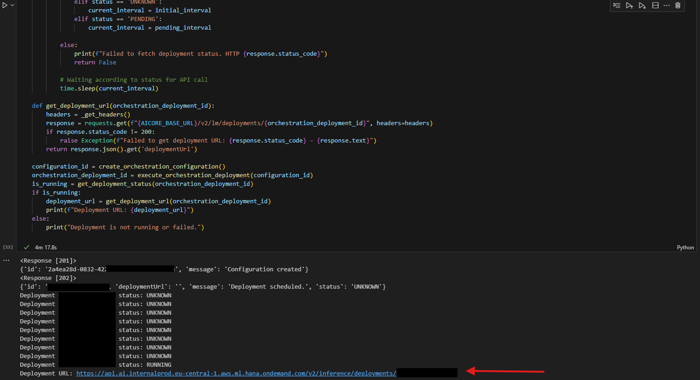

#### Select your Models

Add the LLMs you wish to use in the string selected_models_str

```PYTHON
# Manual selection of models
selected_models_str="gpt-4o:2024-05-13"
print("Selected models string:", selected_models_str)
```

#### Select system defined metrics

Add the system defined metrics you wish to use in the string selected_metrics_str.

Note: If your dataset does not have a reference column, DO NOT Select metrics where reference is required.

```PYTHON
# Manual Selection of Metrics
selected_metrics_str = "Pointwise RAG Context Precision,Pointwise RAG Completeness"
print(selected_metrics_str)
```

#### Create Orchestration Registry Configuration

The following code defines a function create_orchestration_registry_config() that creates a new Orchestration Configuration in Orchestration Registry.

Note : If you wish to use an existing orchestration config, skip executing this cell and add the orchestration config id in orchestration_registry_id string in the next cell.

```PYTHON
def create_orchestration_registry_config():
    headers = _get_headers()
    
    CREATE_ORCHESTRATION_REGISTRY = '/v2/registry/v2/orchestrationConfigs'
    request_url = f"{AICORE_BASE_URL}{CREATE_ORCHESTRATION_REGISTRY}"
    model_name,model_version=selected_models_str.split(":")
    request_body = {
      "name": "genai-eval-test-1",
      "version": "0.0.1",
      "scenario": "genai-evaluations",
      "spec": {
        "modules": {
            "prompt_templating": {
                "prompt": {
                    "template": [
                        {
                        "role": "user",
                        "content": "You are a helpful assistant specialized in e-manual topics. Answer the following e-manual questions using the provided context. If the answer is not explicitly available in the context, respond with: `The answer is not available in the provided context.` \\n\\nRequest: {{?topic}}. \\n\\nContext: {{?groundingOutput}}"
                        }
                    ],
                    "defaults": {}
                },
                "model": {"name": f"{model_name}", "version": f"{model_version}",
            },
            },
            "grounding": {
                "type": "document_grounding_service",
                "config": {
                    "filters": [
                    {
                        "id": "helpRepo",
                        "data_repositories": [
                        "*"
                        ],
                        "search_config": {
                        "max_chunk_count": 10
                        },
                        "data_repository_type": "help.sap.com"
                    }
                    ],
                    "placeholders": {
                    "input": [
                        "topic"
                    ],
                    "output": "groundingOutput"
                    }
                }
            }
        }
      }
    }
    try:
        response = requests.post(
            request_url, headers=headers, data=json.dumps(request_body), timeout=120
        )
        if(response.status_code != 200):
            print(response.json())
            raise
        result = response.json()
        print(result)
        return result['id']
    except:
        logging.error("Error occurred while attempting to create a orchestration registry id")
        raise
orchestration_registry_id = create_orchestration_registry_config()
```

#### Define Evaluation Flow Parameters

Below is an example of defining the required input parameters for the prompt evaluation flow.

```PYTHON
# Defining required input parameters for the prompt Evaluation Flow
import json
test_data_path = f"testdata/testdata/{DATASET_NAME}" # specify the test data path here. For the full folder just specifying testdata will work
test_datasets = json.dumps({'path': test_data_path, 'type': 'csv'})
print(test_datasets)
metrics_list = ",".join([selected_metrics_str])
models_list = selected_models_str
print(f"Selected metrics: {metrics_list}")
print(f"Selected models: {models_list}")
#variable_mapping = json.dumps({'prompt/question': 'data/topic'}) # to map the question prompt variable to the entry in dataset.
# orchestration_deployment_url = deployment_url # needs to specify this to use a specific deployment id
orchestration_deployment_url = deployment_url
repetitions = "1"
```

**NOTE: For custom metrics, ensure they follow the structured format: scenario/metric_name/version — for example, genai-evaluations/groundedness_formatted/0.0.1 or genai-evaluations/correctness_structured/0.0.1.**

> 📘 **Helpful Resources**:
> 
> - [System-Defined Evaluation Metrics – SAP Documentation](https://help.sap.com/docs/sap-ai-core/generative-ai-hub/system-defined-evaluation-metrics)  
>
> - **If your evaluation requires domain-specific or advanced scoring logic -** [ Define Your Own Custom Metrics – SAP Guide](https://help.sap.com/docs/sap-ai-core/generative-ai-hub/custom-metrics)
>
> - [Learn more about variable mapping](https://help.sap.com/docs/sap-ai-core/generative-ai-hub/variable-mapping)
>
Now, we will create an AI Core Configuration using the defined parameters.


```PYTHON
#  creating an AICORE Configuration.
import requests

request_body = {
    "name": "genai-eval-conf",
    "scenarioId": "genai-evaluations",
    "executableId": "genai-evaluations-simplified",
    "inputArtifactBindings": [
        {
            "key": "datasetFolder",
            "artifactId": artifact_id
        }
    ],
    "parameterBindings": [
        {
            "key": "repetitions",
            "value": repetitions
        },
        {
            "key": "orchestrationDeploymentURL",
            "value": orchestration_deployment_url
        },
        {
            "key": "metrics",
            "value": metrics_list
        },
        {
            "key": "testDataset",
            "value": test_datasets
        },
        {
            "key": "orchestrationRegistryIds",
            "value": orchestration_registry_id
        },
        {
            "key": "testRowCount",
            "value": "2"
        }
    ]
}

def create_aicore_configuration():
    headers = _get_headers()
    GET_CONFIGURATIONS_ENDPOINT = '/v2/lm/configurations'
    request_url = f"{AICORE_BASE_URL}{GET_CONFIGURATIONS_ENDPOINT}"
    try:
        response = requests.post(
            request_url, headers=headers, data=json.dumps(request_body), timeout=120
        )
        print(response)
        if(response.status_code != 201):
            raise
        result = response.json()
        print(result)
        return result['id']
    except:
        logging.error("Error occurred while attempting to create a Configuration")
        raise
        
configuration_id = create_aicore_configuration()
```
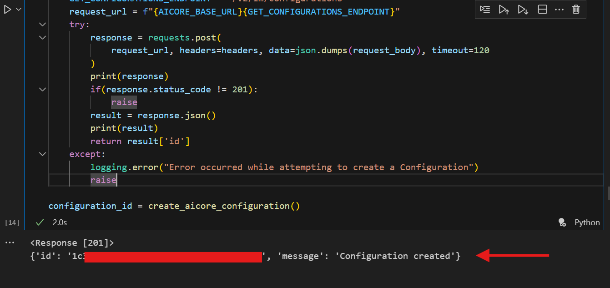

[OPTION END]

[OPTION BEGIN [Bruno]]

Before setting up your evaluation configuration in **Bruno**, you need to create and deploy the orchestration workflow that powers the evaluation process. This is a prerequisite step and must be completed before proceeding.

The **orchestration deployment URL** is a critical input required in the configuration JSON. Once the orchestration is deployed, ensure its status is set to `running` and the **deployment URL** is generated. You will reference this URL while defining the evaluation configuration.

> 📘 **Need help deploying the orchestration workflow?** Check the official guide: [Deploy an Orchestration Workflow in SAP AI Core](https://developers.sap.com/tutorials/ai-core-orchestration-consumption.html)

---

#### Sample Evaluation Configuration in Bruno

Below is a sample configuration payload that you can use in **Bruno** to trigger an evaluation. Update placeholders like `<artifactId>` and `<orchestrationDeploymentURL>` with actual values.

```json
{
    "name": "genai-eval-conf",
    "scenarioId": "genai-evaluations",
    "executableId": "genai-evaluations-simplified",
    "inputArtifactBindings": [
        {
            "key": "datasetFolder",
            "artifactId": "<ARTIFACT ID>"
        }
    ],
    "parameterBindings": [
        {
            "key": "repetitions",
            "value": "1"
        },
        {
            "key": "orchestrationDeploymentURL",
            "value": "<ORCHESTRATION URL>"
        },
        {
      "key": "metrics",
      "value": "Pointwise RAG Context Precision,Pointwise RAG Completeness"
    },
    {
      "key": "testDataset",
      "value": "{\"path\": \"testdata/emanual.csv\", \"type\": \"csv\"}"
    },
    {
      "key": "orchestrationRegistryIds",
      "value": "<ORCHESTRAION_REGISTRYID>"
    },
    {
      "key": "testRowCount",
      "value": "2"
    }
  ]
}
```

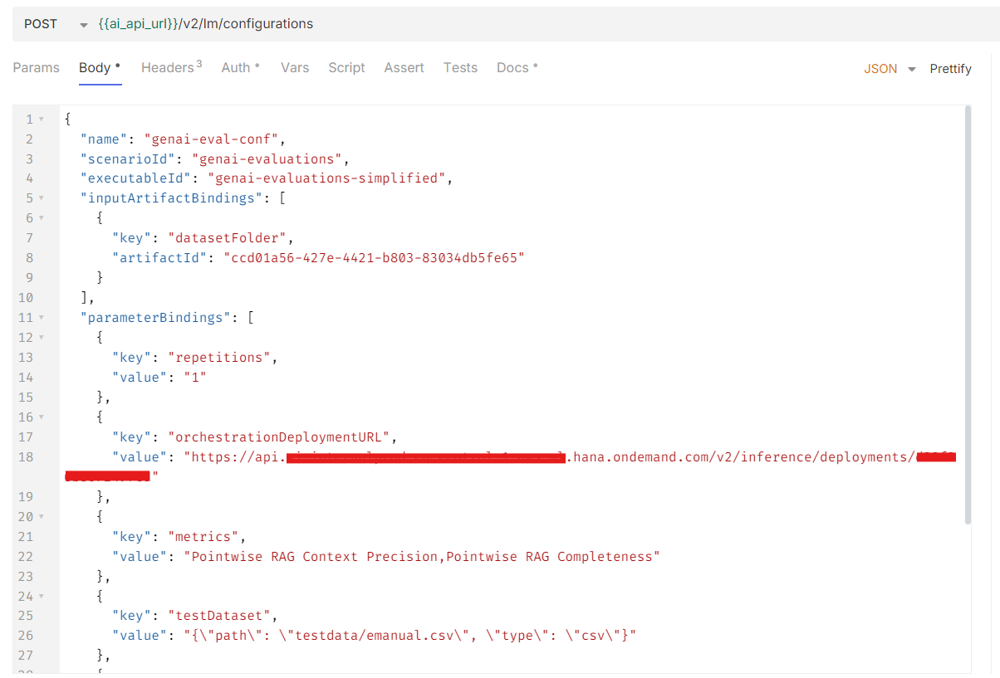

**NOTE: For custom metrics, ensure they follow the structured format: scenario/metric_name/version — for example, genai-evaluations/groundedness_formatted/0.0.1 or genai-evaluations/correctness_structured/0.0.1.**

> 📘 **Helpful Resources**:
> 
> - [System-Defined Evaluation Metrics – SAP Documentation](https://help.sap.com/docs/sap-ai-core/generative-ai-hub/system-defined-evaluation-metrics)  
>
> - **If your evaluation requires domain-specific or advanced scoring logic -** [ Define Your Own Custom Metrics – SAP Guide](https://help.sap.com/docs/sap-ai-core/generative-ai-hub/custom-metrics)
>
> - [Learn more about variable mapping](https://help.sap.com/docs/sap-ai-core/generative-ai-hub/variable-mapping)

[OPTION END]

### Evaluation Execution Creation
[OPTION BEGIN [SAP AI Launchpad]]

- Once the evaluation configuration is created, the system automatically triggers an evaluation execution.

- Follow these steps to monitor its progress and verify completion:

    - Navigate to **ML Operations** in the SAP AI Core Launchpad.

    - In the sidebar, click **Executions**.
    
    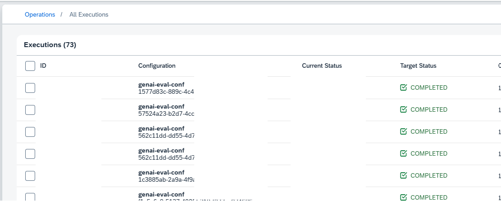

    - Locate the most recent execution triggered by your evaluation configuration. You can use the timestamp or configuration name to identify it.

    - Click on the execution entry to open its details. The Current Status will update as the process runs.

    

- Once the Target Status reaches **COMPLETED** , your evaluation has successfully finished.

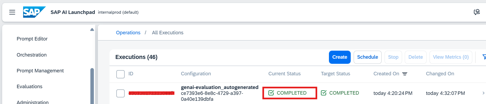

> [For More information](https://help.sap.com/docs/sap-ai-core/generative-ai-hub/create-evaluation)
> You’ve now completed an evaluation run and are ready to view and interpret the results.

[OPTION END]

[OPTION BEGIN [Python]]

After creating the configuration, the next step is to trigger the evaluation workload by creating an AI Core execution.

**Create an Execution with the Created Configuration**

- The code below will initiate the evaluation process based on your configuration.

```PYTHON
# create an execution with the created configuration.

import requests
def create_execution():
    headers = _get_headers()
    GET_EXECUTIONS_ENDPOINT = '/v2/lm/executions'
    request_url = f"{AICORE_BASE_URL}{GET_EXECUTIONS_ENDPOINT}"
    request_body = {"configurationId" : configuration_id} # replace with your created configuration id
    try:
        response = requests.post(
            request_url, headers=headers, data=json.dumps(request_body), timeout=120
        )
        print("response received is ", response)
        result = response.json()
        print(result)
        return result['id']
    except:
        logging.error("Error occurred while attempting to create an execution")
        raise
 

execution_id = create_execution()
```
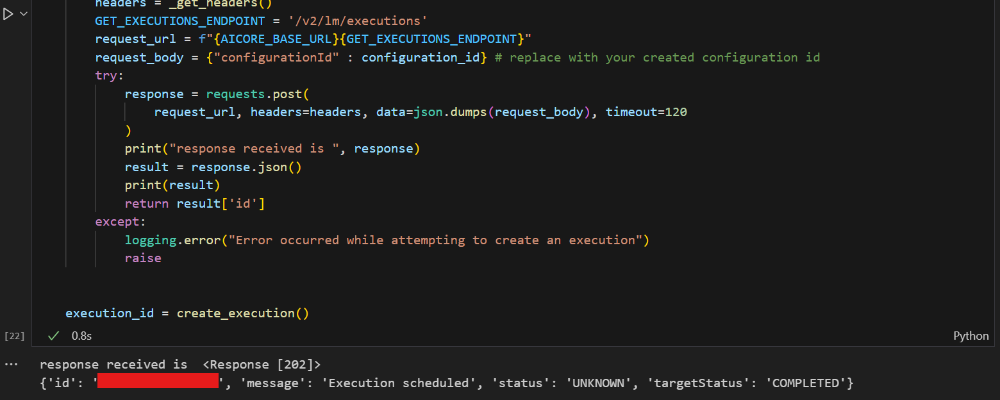

**Get Execution Status**

Check the status of the triggered execution. You’ll need to wait for the status to be **COMPLETED** before moving to the next steps.

```PYTHON
# get execution status
import requests
def get_execution_status(execution_id):
    headers = _get_headers()
    LOG_EXECUTIONS_ENDPOINT = f'/v2/lm/executions/{execution_id}'
    request_url = f"{AICORE_BASE_URL}{LOG_EXECUTIONS_ENDPOINT}"
    try:
        response = requests.get(
            request_url, headers=headers, timeout=120
        )
        print("response received is ", response)
        result = response.json()
        return result
    except:
        logging.error("Error occurred while attempting to get execution status")
        raise
 

get_execution_status(execution_id)
```

- The status field progresses through different states over time:
UNKNOWN → PENDING → RUNNING → COMPLETED.

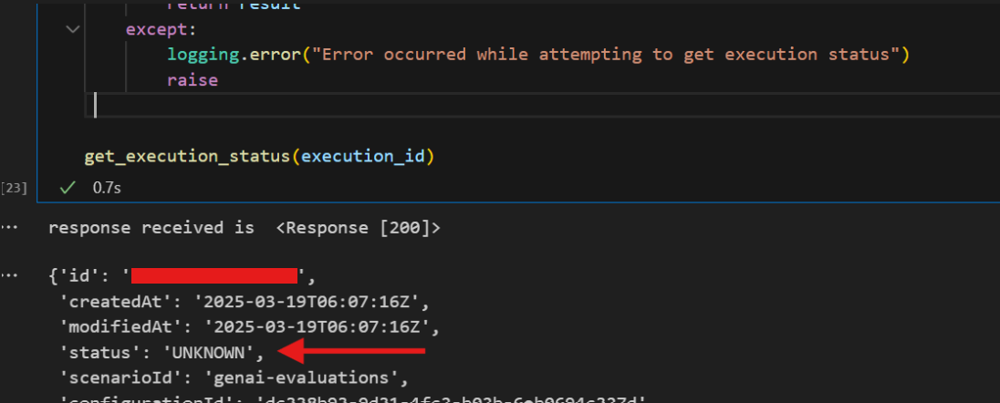

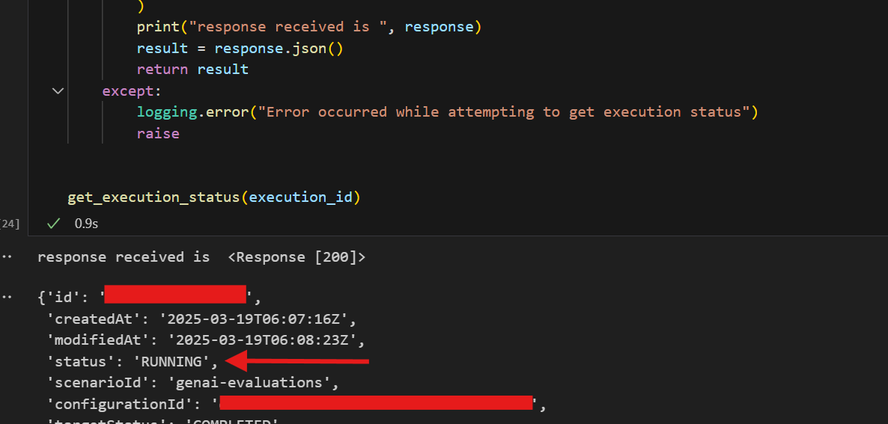

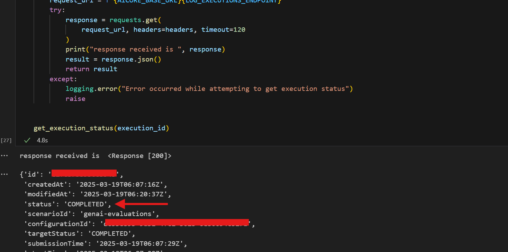

-  Ensure it reaches COMPLETED before proceeding.

> [For More information](https://help.sap.com/docs/sap-ai-core/generative-ai-hub/create-evaluation)

**NOTE:** After triggering the execution, wait a few minutes, then re-run the **get_execution_status()** function. Once the status is **COMPLETED**, proceed to the next steps.

[OPTION END]

[OPTION BEGIN [Bruno]]

After creating the configuration, the next step is to trigger the evaluation workload by creating an AI Core execution.

**Create an Execution with the Created Configuration**

- Click on create execution under executions, pass the configuration id created in previous step

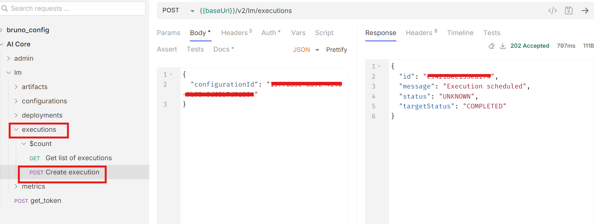

- The status field progresses through different states over time:
UNKNOWN → PENDING → RUNNING → COMPLETED.

**Get Execution Status**

check the status of created execution by passing the execution ID, The Current Status will update as the process runs. please refer the below image

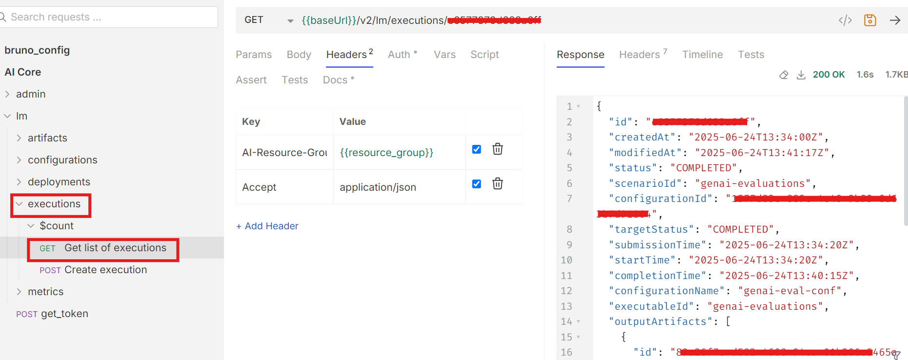

[OPTION END]

### Evaluation Results Analysis

[OPTION BEGIN [SAP AI Launchpad]]

#### Retrieve Aggregate Metrics Using Run Name

Once the evaluation workflow execution is completed, this step retrieves the aggregated evaluation metrics from the SAP AI Core service by specifying the run name.

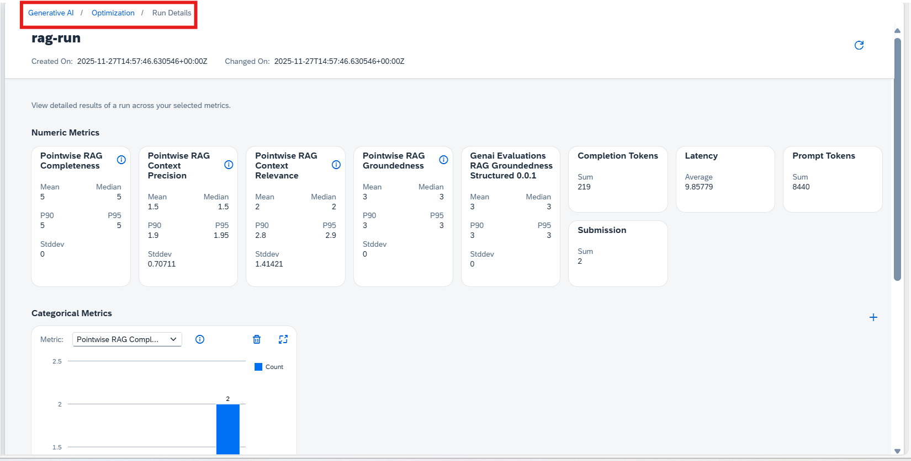

[OPTION END]

[OPTION BEGIN [Python]]
#### Retrieve Aggregate Metrics Using Execution ID

Once the evaluation workflow execution is completed, we can retrieve the aggregated evaluation metrics using the execution ID. These metrics provide a quick summary of the model's performance across all completions.

Below is the Python code that calls the AI Core Tracking API to fetch these aggregated metrics.

```PYTHON
# Get aggregate metrics using execution id
import requests
def retrieve_aggregate_metrics(execution_id):
    headers = _get_headers()
    GET_METRICS_ENDPOINT = f'/v2/lm/metrics?tagFilters=evaluation.ai.sap.com/child-of={execution_id}'
    request_url = f"{AICORE_BASE_URL}{GET_METRICS_ENDPOINT}"
    try:
        response = requests.get(request_url, headers=headers, timeout=120)
        print("response received is ", response)
        result = response.json()
        return result
    except:
        logging.error("Error occurred while attempting to retreive aggeregate metrics for the run")
        raise

runs_data = retrieve_aggregate_metrics(execution_id)
```

**Example Output**
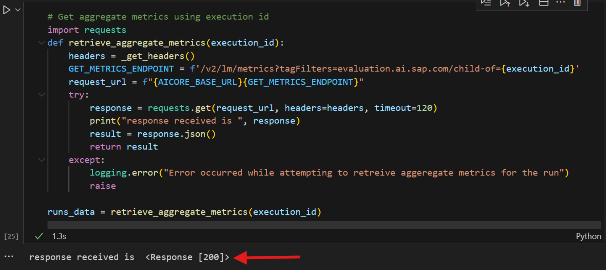
The **Response [200]** indicates that the request was successful, and the aggregated metrics have been retrieved.

#### Download the Result Artifacts from Object Store for Further Analysis

- To drill down further into the **instance-level metrics, logs, or additional result files**, you can download the **SQLite DB** and other artifacts from object storage.

```PYTHON
# download the result artifacts from Object store.
import boto3

def download_all_objects(prefix, destination_folder):
    """
    Recursively download all objects from an S3 bucket starting with a specific prefix.

    :param bucket_name: Name of the S3 bucket.
    :param prefix: Prefix to filter objects in the bucket.
    :param destination_folder: Local folder to save the downloaded files.
    """
    s3_client = boto3.client(
            's3',
            aws_access_key_id=AWS_ACCESS_KEY,
            aws_secret_access_key=AWS_SECRET_ACCESS_KEY,
            region_name=AWS_REGION
            )

    # Ensure the destination folder exists
    if not os.path.exists(destination_folder):
        os.makedirs(destination_folder)

    # Paginate through objects
    paginator = s3_client.get_paginator('list_objects_v2')
    pages = paginator.paginate(Bucket=AWS_BUCKET_ID, Prefix=prefix)

    for page in pages:
        if 'Contents' in page:
            for obj in page['Contents']:
                key = obj['Key']
                local_file_path = os.path.join(destination_folder, os.path.relpath(key, prefix))

                # Ensure the local directory structure exists
                local_directory = os.path.dirname(local_file_path)
                if not os.path.exists(local_directory):
                    os.makedirs(local_directory)

                # Download the object
                print(f"Downloading {key} to {local_file_path}")
                s3_client.download_file(AWS_BUCKET_ID, key, local_file_path)

# Example usage
EXECUTION_ID = execution_id
sqlite_db_prefix = f'{EXECUTION_ID}/evaluation_result/'  
destination_folder = 'results-new'

download_all_objects(sqlite_db_prefix, destination_folder)
```

**Sample Output**
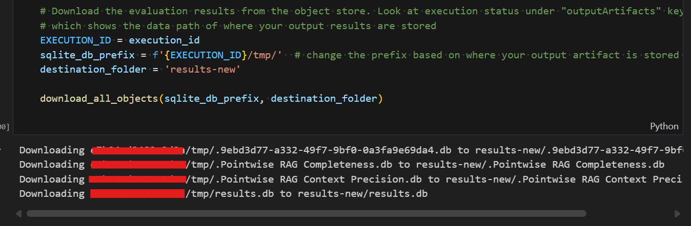

#### Viewing Results from SQLite Database in a Tabular Format

In this step, we will visualize the evaluation results stored in the SQLite database (results.db) in a clean and readable tabular format directly within the notebook. This allows for quick inspection and validation of the data across different tables such as run, configuration, submission, etc.

**Objective**

- Connect to the SQLite database.

- Query specific tables.

- Display their contents in a structured HTML format.

- Enhance readability using custom CSS styling.

```PYTHON
# viewing the results from sqlite db in tabular format..
import sqlite3
import pandas as pd
from IPython.display import display, HTML

# Path to your SQLite database file
db_file = 'results-new/results.db'

connection = sqlite3.connect(db_file)

# Specify the table names you want to display
table_names = ['run','configuration', 'submission', 'submission_result', 'evaluation_result'] 

# Create the CSS and HTML container
html_content = """
<style>
/* Container to hold all tables */
.fixed-container {
    max-height: 600px;  /* Total container height */
    overflow-y: auto;   /* Vertical scroll for container */
    border: 2px solid #ddd;
    padding: 10px;
}

/* Table styling */
.table-container table {
    border-collapse: collapse; /* Merge table borders */
    width: 100%; /* Full width for tables */
    margin-bottom: 20px; /* Space between tables */
}

.table-container th, .table-container td {
    border: 1px solid #ddd; /* Add gridlines */
    text-align: left;       /* Align text to the left */
    padding: 8px;           /* Cell padding */
    white-space: nowrap;    /* Prevent text wrapping */
}

.table-container th {
    font-weight: bold;         /* Bold header text */
}

/* Allow dynamic column widths */
.table-container td {
    white-space: nowrap;   /* Prevent wrapping for long text */
}

</style>
<div class="fixed-container">
"""

for table_name in table_names:
    query = f"SELECT * FROM {table_name};"
    df = pd.read_sql_query(query, connection)
    # If you want to see all the rows across all tables, remove/comment the next line
    df = df.head(5)  # Limiting the number of rows displayed
    table_html = df.to_html(classes='table-container', index=False)
    html_content += f"""
    <div class="table-container">
        <h3>Table: {table_name}</h3>
        {table_html}
    </div>
    """

html_content += "</div>"

display(HTML(html_content))

# Close the connection
connection.close()
```

**Output Example**

Below is an example of the output rendered in the notebook.
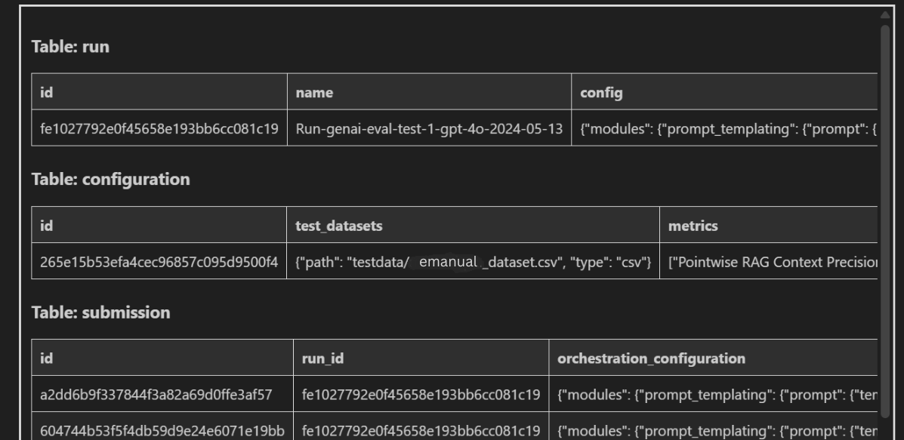

#### Delete an Execution by Execution ID (Optional)

Once you have completed the evaluation and gathered the necessary aggregated metrics, you may want to delete the execution associated with a specific run. This helps maintain a clean and organized workspace in your SAP AI Core environment by removing outdated or unnecessary executions.

**NOTE:** Deleting an execution is irreversible. Ensure you have saved all relevant results and metrics before proceeding.

**Delete Execution by ID**

```PYTHON
#Delete Execution Id
def delete_execution():
    headers = _get_headers()
    EXEC_ID = execution_id
    GET_EXECUTIONS_ENDPOINT = '/v2/lm/executions/'
    request_url = f"{AICORE_BASE_URL}{GET_EXECUTIONS_ENDPOINT}{EXEC_ID}"
    try:
        response = requests.delete(
                request_url, headers=headers, params={"AI-Resource-Group":AICORE_RESOURCE_GROUP}, timeout=120
            )
        print(response)
        if(response.status_code != 202):
            raise
        result = response.json()
        print(result)
    except:
        logging.error("Error occurred while attempting to delete a Configuration")
        raise
    
delete_execution()
```
**How It Works**

- **Execution ID:** This is the unique identifier for the execution you wish to delete. Ensure the execution_id variable is properly assigned in your script.

- **DELETE Request:** The function sends an HTTP DELETE request to SAP AI Core’s executions endpoint.

- **Response Handling:**
    - If the status code is 202 Accepted, the deletion request was successfully initiated.
  
[OPTION END]

[OPTION BEGIN [Bruno]]

**Retrieve Aggregate Metrics Using Execution ID**

Once the evaluation workflow execution is completed, we can retrieve the aggregated evaluation metrics using the execution ID. These metrics provide a quick summary of the model's performance across all completions.

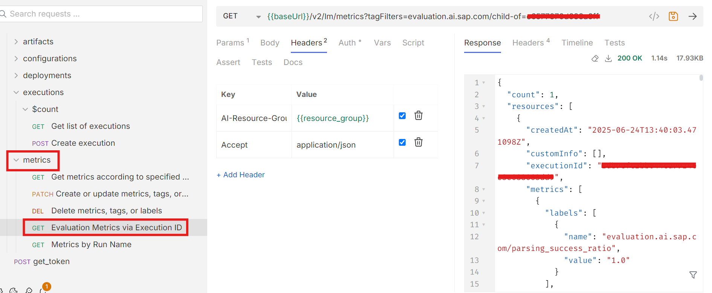

[OPTION END]

