# Using Evaluation Service available in SAP AI Core 
<!-- description -->  This tutorial demonstrates how to use SAP AI Core Custom Evaluation to benchmark Large Language Models (LLMs) using two different approaches **Prompt Registry** and **Orchestration Registry**. It guides you through dataset preparation, environment setup, configuration creation, execution, and result analysis in a unified and simplified workflow.

It extends the Quick Start tutorial and is intended for Application Developers and Data Scientists who already know the basics of GenAI workflows in SAP AI Core.

## You will learn
- How to prepare and organize datasets for evaluation.
- How to choose between **Prompt Registry** and **Orchestration Registry** approaches.
- How to configure and run evaluations in SAP AI Core.
- How to analyze and interpret aggregated evaluation results.

## Prerequisites

- Setup Environment:
Ensure your instance and AI Core credentials are properly configured according to the steps provided in the initial tutorial
- Orchestration Deployment:
Ensure at least one orchestration deployment is ready to be consumed during this process. 
Refer to [this tutorial understand the basic consumption of GenAI models using orchestration.](https://developers.sap.com/tutorials/ai-core-orchestration-consumption.html)
- Basic Knowledge: Familiarity with the orchestration workflow is recommended
- Install Dependencies: Install the required Python packages using the requirements.txt file provided.
Download [requirements.txt](img/requirements.txt)
💡 Right-click the link above and choose **"Save link as..."** to download it directly.

**Below are the Steps to Run a GenAI Evaluation in SAP AI Core**

## Pre-Read

The structure of the input data should be as follows:

```
Root
├── PUT_YOUR_PROMPT_TEMPLATE_HERE
|   ├── prompt_template.json
│    
├── PUT_YOUR_DATASET_HERE
│   ├── medicalqna_dataset.csv
|
└── PUT_YOUR_CUSTOM_METRIC_HERE
    ├── custom-llm-metric.json
    ├── custom-llm-metric.jsonl
```

**Dataset and Configuration**:
To run this evaluation, All required input files must be placed inside the folder structure provided in the repository:

You can download or clone the complete folder from the link below and place your files inside the respective folders [Download / Open Full Folder Structure](https://github.tools.sap/I321506/tutorial-aicore/tree/main/jupyter_notebook_simplified_workflow)

    1.  **Prompt Template Configuration (`PUT_YOUR_PROMPT_TEMPLATE_HERE`)**
        *   Place one or more prompt template configurations as JSON files in this folder. 
    2.  **Test Dataset (`PUT_YOUR_DATASET_HERE`)**
        *   The test dataset should be a CSV, JSON, or JSONL file containing prompt variables, ground truth references, and other data required for evaluation. 
    3.  **Custom Metrics (`PUT_YOUR_CUSTOM_METRIC_HERE`)**
        *   (Optional) You can provide custom metric definitions in a single JSON or JSONL file. For JSONL, each line should be a JSON object defining one metric. For JSON, it should be an array of metric-definition objects. 

### Environment Variables Setup

[OPTION BEGIN [SAP AI Launchpad]]

- Navigate to your SAP AI Core Launchpad.

- In the Workspaces section, click on "Add" to create a new workspace.
    - A workspace in SAP AI Core is a logical container that holds your resources (like models and pipelines) and provides the isolation needed for your projects.

- When prompted, enter your AI Core credentials (such as Client ID, Client Secret, and Base URL).
    - Note: If you're unsure about where to find these credentials, refer to this [guide](https://developers.sap.com/tutorials/ai-core-generative-ai.html#1c4f36d7-f345-4822-be00-c15f133ff7d8). 

- Once the workspace is successfully created, select your desired Resource Group to begin the evaluation process.

Refer to the screenshot below for guidance:
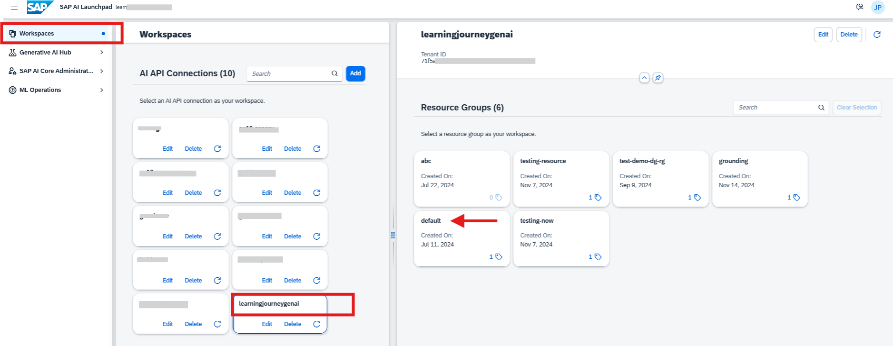

[OPTION END]

[OPTION BEGIN [Python]]

- Open **Visual Studio Code or Jupyter Notebook**. Create a new file with the .ipynb extension (e.g., custom_evaluation.ipynb).
- Create a **.env** file in the root directory of your project.
- Add your **AI Core** and **AWS credentials** as shown below.

```env
# AICORE CREDENTIALS
AICORE_CLIENT_ID=<AICORE CLIENT ID>  
AICORE_CLIENT_SECRET=<AICORE CLIENT SECRET>
AICORE_AUTH_URL=<AICORE AUTH URL>
AICORE_BASE_URL=<AICORE BASE URL>
AICORE_RESOURCE_GROUP=<AICORE RESOURCE GROUP>

# AWS CREDENTIALS
AWS_ACCESS_KEY=<AWS ACCESS KEY>
AWS_BUCKET_ID=<AWS BUCKET ID>
AWS_REGION=<AWS REGION>
AWS_SECRET_ACCESS_KEY=<AWS SECRET ACCESS KEY> 

# ORCHESTRATION DEPLOYMENT URL
DEPLOYMENT_URL=<DEPLOYMENT URL>
```

**Note:** Replace placeholders (e.g., CLIENT_ID, CLIENT_SECRET, etc) with your actual environment credentials.

Refer to the below screenshot for clarity:
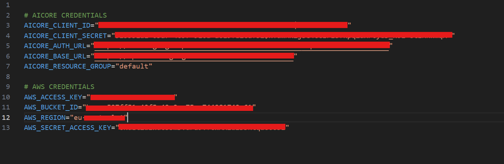

#### Install Dependencies

Install the required packages using the [requirements.txt](img/requirements.txt) file you downloaded in the Prerequisites section.
```bash
pip install -r requirements.txt
```
#### Connect to AI Core Instance

Once the environment variables are set and dependencies are installed, run the following code to connect to your instance:

```PYTHON
# Loading the credentials from the env file
from gen_ai_hub.proxy.gen_ai_hub_proxy import GenAIHubProxyClient
from dotenv import load_dotenv
import os

load_dotenv(override=True)

# Fetching environment variables
AICORE_BASE_URL = os.getenv("AICORE_BASE_URL")
AICORE_RESOURCE_GROUP = os.getenv("AICORE_RESOURCE_GROUP")
AICORE_AUTH_URL = os.getenv("AICORE_AUTH_URL")
AICORE_CLIENT_ID = os.getenv("AICORE_CLIENT_ID")
AICORE_CLIENT_SECRET = os.getenv("AICORE_CLIENT_SECRET")

AWS_ACCESS_KEY = os.getenv("AWS_ACCESS_KEY")
AWS_BUCKET_ID = os.getenv("AWS_BUCKET_ID")
AWS_REGION = os.getenv("AWS_REGION")
AWS_SECRET_ACCESS_KEY = os.getenv("AWS_SECRET_ACCESS_KEY")
DEPLOYMENT_URL = os.getenv("DEPLOYMENT_URL")

# Initializing the GenAIHubProxyClient
client = GenAIHubProxyClient(
    base_url=AICORE_BASE_URL,
    auth_url=AICORE_AUTH_URL,
    client_id=AICORE_CLIENT_ID,
    client_secret=AICORE_CLIENT_SECRET,
    resource_group=AICORE_RESOURCE_GROUP
)
```

**NOTE:** 
- Ensure the **requirements.txt** installation completes successfully before running the code.
- If you face any issues, recheck your **.env** values and installed packages.

[OPTION END]

[OPTION BEGIN [Bruno]]

- Download the [Bruno_collections](img/AI_Core.json) file

- please follow the steps in the [Tutorial](https://developers.sap.com/tutorials/ai-core-orchestration-consumption.html) to set up your environment, refer step - **Set Up Your Environment and Configure Access** and proceed till generating the token

[OPTION END]

### Registering an Object Store Secret in AI Core

[OPTION BEGIN [SAP AI Launchpad]]

- Open the **SAP AI Core Launchpad** and navigate to the **Administration** tab.
- Select the **Object Store** section from the left-hand menu.
- Click on **“Add”** to register a new object store secret.
- Fill in the required bucket details as shown in the screenshot below.

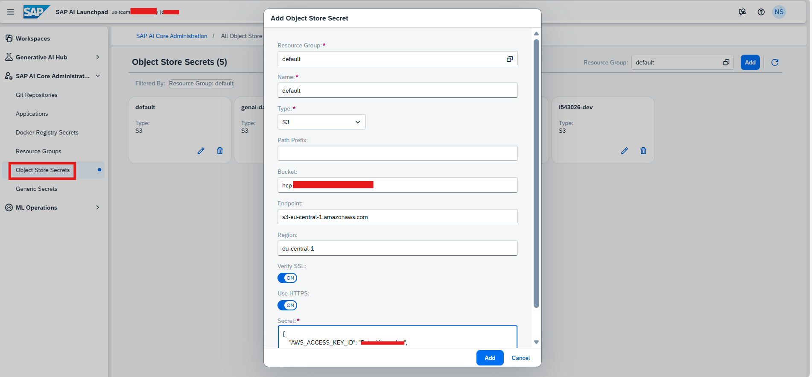

In the **Secret** field, use the following structure to provide your AWS credentials:

```json
{
    "AWS_ACCESS_KEY_ID": "Enter Your value",
    "AWS_SECRET_ACCESS_KEY": "Enter Your value"
}
```

[OPTION END]

[OPTION BEGIN [Python]]

To make your evaluation files available for AI Core orchestration, you need to:

- Upload them to an object store (e.g., AWS S3).
- Register the object store secret in AI Core.

#### **Setup Authentication and Headers**

First, define the authentication headers for AI Core REST API calls.

```PYTHON
def _get_headers():
    headers = {
        "Authorization": client.get_ai_core_token(),
        "AI-Resource-Group": AICORE_RESOURCE_GROUP,
        "Content-Type": "application/json",
    }
    return headers
```

#### **Register Object Store Secret in AI Core**

Register your S3 bucket and credentials as a secret.

```PYTHON
# Register S3 secret with AI Core which will be used an input source 
import requests

def register_oss_secret():
    headers = _get_headers()
    
    POST_SECRETS_ENDPOINT = '/v2/admin/objectStoreSecrets'
    request_url = f"{AICORE_BASE_URL}{POST_SECRETS_ENDPOINT}"
    
    request_body = {
        "name": "genai-data",
        "data": {
            "AWS_ACCESS_KEY_ID": AWS_ACCESS_KEY,
            "AWS_SECRET_ACCESS_KEY": AWS_SECRET_ACCESS_KEY
        },
        "type": "S3",
        "bucket": AWS_BUCKET_ID,
        "endpoint": "s3-eu-central-1.amazonaws.com",
        "region": AWS_REGION,
        "pathPrefix": ""    
    }
    try:
        response = requests.post(
            request_url, headers=headers, data=json.dumps(request_body), timeout=120
        )
        result = response.json()
        print(result)
        return result
    except:
        logging.error("Error occurred while attempting to create object store secret")
        raise

register_oss_secret()
```
[OPTION END]

[OPTION BEGIN [Bruno]]

Generic secrets securely store AWS S3 credentials required for document access

•	Expand **objectStoreSecrets** under admin and select create a secret request

Use the below payload to create a secret for AWS S3 with NoAuthentication as authentication type.

```CODE
{
    "name": "genai-data",
    "data": {
        "AWS_ACCESS_KEY_ID": "<access key id>",
        "AWS_SECRET_ACCESS_KEY": "<secret access key>", 
    },
    "type": "S3",
    "bucket": "<bucket>",
    "endpoint": "<url>",
    "region": "<region>",
    "pathPrefix": ""    
    }
```
• Ensure that all values in the data dictionary are Base64-encoded as per AWS S3 credential requirements

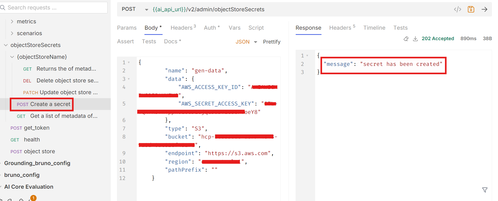

[OPTION END]

> ⚠️ **Important Note (Must Read)**
>
> - You must **create an object store secret** with a user defined name (for eg: default) to store **output artifacts** from orchestration runs. This is **mandatory**.
> - For **input artifacts**, you may create additional object store secrets with different names if needed.
> - If a user defined name (for eg: default) is not configured, orchestration runs will **fail** due to missing output target setup.


### Upload and Register Dataset

[OPTION BEGIN [SAP AI Launchpad]]

After creating the secret, upload your evaluation files to the S3 bucket and register them as an artifact in AI Core.

#### **Register Uploaded Files as Artifact in AI Core**

To register your evaluation dataset with SAP AI Core, you need to upload it as an artifact. Follow the instructions below using the **SAP AI Launchpad UI**.

---

- Open the **SAP AI Core Launchpad**.
- Navigate to the **Generative AI/Optimization/Artifacts** section to create dataset artifact.

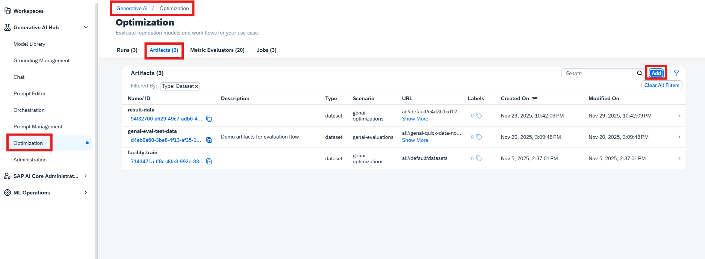

- On the **Artifacts** section, click **add**.

---

- On the **General Information** screen, enter the following:

  - **Select Scenario:** `genai-evaluations`  
  - **Name:** `genai-eval-test-data`  
  - **Description:** `Demo artifacts for evaluation flow.`
  - **Select Object Store:** `genai-data`
  - **Sub-folder path:** `genaiEvaluation/<your-user-id>`

   > 💡 Replace `<your-user-id>` with your **SAP BTP user ID** or the folder path in your object store where the evaluation files are uploaded.

- On the **Labels** screen, click **“Add Label”** and provide the following:

  - **Key:** `prompt-evaluation`  
  - **Value:** `true`  
  *(Note: The prefix `ext.ai.sap.com/` is automatically pre-filled in the UI.)*

  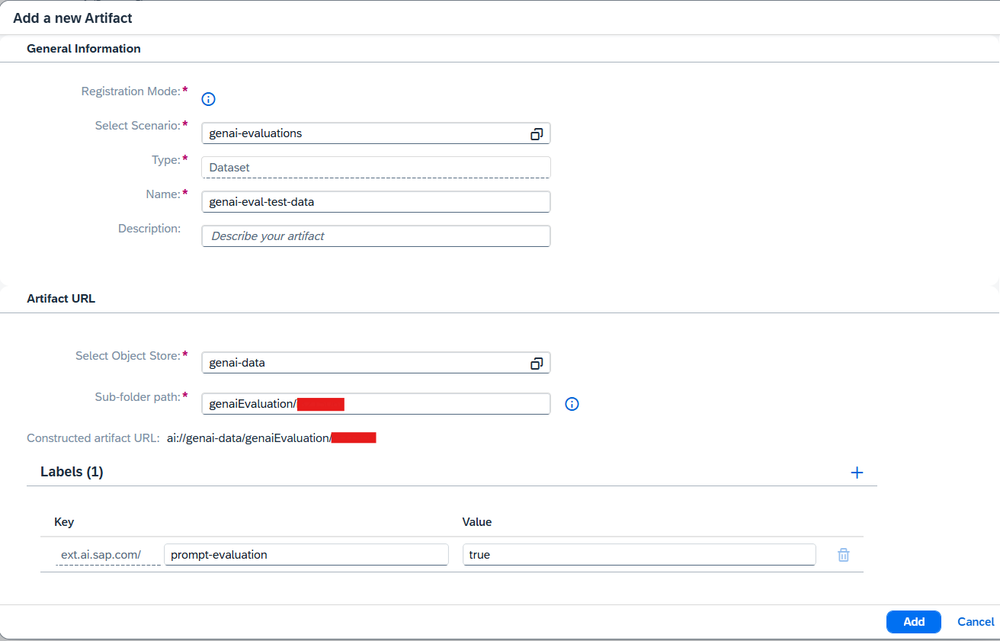

- Review all entered details carefully.
- Click **“Add”** to complete the artifact registration.

[OPTION END]

[OPTION BEGIN [Python]]

After creating the secret, organize your evaluation files into the eval/ folder testdata. Upload them to S3 and register as artifacts in AI Core.

#### **Upload Files to S3 Bucket**
```python
# Uploads the testdata folder to Object Store for simplified workflow
def upload_folder_to_s3(root_folder, bucket_name, s3_prefix=None):
    """
    Look for 'testdata' folder inside root_folder and upload it to S3 under the same s3_prefix. 
    If no s3_prefix is provided, a static prefix or a UUID will be used.

    The S3 structure will be:
        genaiEvaluation/{s3_prefix}/testdata/...

    Args:
        root_folder (str): Path containing the 'testdata' subfolder.
        bucket_name (str): Name of the S3 bucket.
        s3_prefix (str, optional): S3 prefix path. Defaults to None.
    
    Returns:
        str: The path for newly uploaded input artifacts on S3.
        
    Raises:
        FileNotFoundError: If 'testdata' subfolder is missing.
    """
    testdata_folder = os.path.join(root_folder, "testdata")
    if not os.path.isdir(testdata_folder):
        raise FileNotFoundError(f"Missing required folder: testdata in {root_folder}")

    if s3_prefix is None:
        # Generate a unique prefix using UUID or static ID
        prefix_guid = ""  # replace with UUID if needed
        s3_prefix = f"genaiEvaluation/{prefix_guid}"

    s3_client = boto3.client(
        's3',
        aws_access_key_id=AWS_ACCESS_KEY,
        aws_secret_access_key=AWS_SECRET_ACCESS_KEY,
        region_name=AWS_REGION
    )

    # Upload only the testdata folder
    full_prefix = f"{s3_prefix}/testdata"
    for root, _, files in os.walk(testdata_folder):
        for file in files:
            local_path = os.path.join(root, file)
            relative_path = os.path.relpath(local_path, testdata_folder)
            s3_key = f"{full_prefix}/{relative_path}".replace("\\", "/")
            print(f"Uploading {local_path} to s3://{bucket_name}/{s3_key}")
            s3_client.upload_file(local_path, bucket_name, s3_key)

    return f"ai://genai-data/{s3_prefix}"
```
 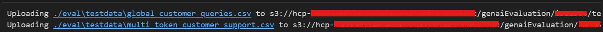

#### **Register Uploaded Files as Artifact in AI Core**

```python
# Registering the uploaded files from AWS as artifacts to use inside configuration.
def register_artifact(input_artifact_path):
    headers = _get_headers()
    
    GET_ARTIFACTS_ENDPOINT = '/v2/lm/artifacts'
    request_url = f"{AICORE_BASE_URL}{GET_ARTIFACTS_ENDPOINT}"
    
    request_body = {
        "labels": [
            {
            "key": "ext.ai.sap.com/prompt-evaluation",
            "value": "true"
            }
        ],
        "name": "genai-eval-test-data",
        "kind": "other",
        "url": input_artifact_path, 
        "description": "demo artifacts for evaluation flow.",
        "scenarioId": "genai-evaluations"
    }
    try:
        response = requests.post(
            request_url, headers=headers, data=json.dumps(request_body), timeout=120
        )
        result = response.json()
        print(result)
        return result['id']
    except:
        print("Error occurred while attempting to create an execution")
        raise
```
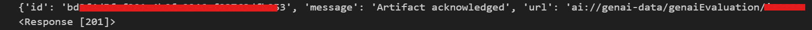

[OPTION END]

[OPTION BEGIN [Bruno]]

Before registering a dataset artifact in Bruno, you must upload your CSV file to the SAP AI Core object store using the Dataset API.
Bruno cannot upload files directly to S3; therefore, this step is required.

**Prerequisites**

    - An object store secret must already exist in your resource group.Typically, this is the default secret named **default**.

    - The Dataset API currently supports:

        - S3 object stores only

        - CSV file uploads

**Upload Your Dataset**

Use the Dataset API – Upload File request in Bruno:

```bash
PUT:{{ai_api_url}}/v2/lm/dataset/files/{{secretName}}/{{datasetPath}}
```

**Headers**

```json
Authorization: Bearer {{token}}
AI-Resource-Group: {{resourceGroup}}
Content-Type: text/csv
```

**Body**

Upload your .csv file directly as binary in Bruno’s Body 

Example Path Values:

    - secretName: default

    - datasetPath: testdata/medicalqna_dataset.csv

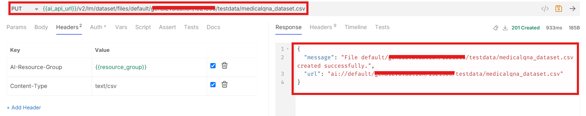

**Note:** 

Save the ai://… URL — you will use this when creating the dataset artifact.

**Register the Dataset Artifact**

- Click  on **Register artifact** under lm -> artifacts in bruno collection to register the artifact

```CODE
{
    "name": "aiconfig",
    "kind": "dataset",
    "url": "ai://default/testdata/medicalqna_dataset.csv",
    "scenarioId": "genai-evaluations"
}
```
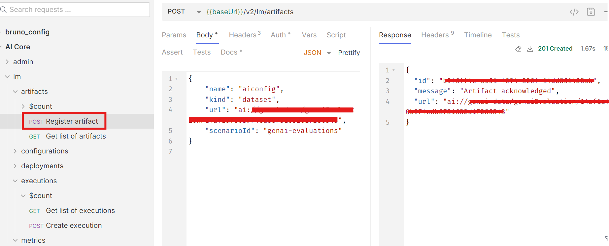

[OPTION END]

### Approach Selection – Choose How You Want to Provide Prompts(Read-up)

In this evaluation workflow, you can provide prompts in two different ways.
Choose only one option based on your requirement.

Here are your two options:

| Option       | Approach                                    | Description                                                     | When to Use                                           |
| ------------ | ------------------------------------------- | --------------------------------------------------------------- | ----------------------------------------------------- |
| **Option 1** | Prompt Template + Model Directly            | Prompt stored in Prompt Registry and model referenced directly. | When you want reusable, versioned prompts.            |
| **Option 2** | Orchestration Registry (Inline Prompt)      | Prompt provided as part of orchestration config.                | When prompt is ad-hoc or not reused.                  |

After selecting your option:

    - Follow only the steps for that option.

    - Skip the other options.

    - After completing your selected option, go directly to Create Evaluation Configuration.

### (Option 1) - Providing Prompts via Prompt Template + Model Directly

✔ Follow this step **ONLY IF** you want to use **Prompt Template**.

If not, **skip this step and go to Option 2**.

[OPTION BEGIN [SAP AI Launchpad]]

A Prompt Template defines:

    - The message roles (system, user, etc.)

    - Variables that get substituted from your dataset (e.g., questions)

    - Optional model configuration (temperature, max tokens, etc.)

We’ll create a prompt template to guide the model to answer the questions 

**create the Prompt Template**

- In SAP AI Launchpad, go to the left-hand menu and select Generative AI Hub → Prompt Management.

- click on Templates → create

- This is where you can define reusable templates with variables for evaluations.


**Define the Prompt**

In the Message Blocks section:

- Add a System role message:
```json
{
  "template": [
    {
      "role": "user",
      "content": "List the benefits and side effects of the drug in the following consumer health question: {{?question}}."
    }
  ]
}
```

**Configure Variables**

Scroll down to Variable Definitions and add entries for each variable:

- question

    - Default Value: leave empty or set to en for fallback

This ensures the placeholders are dynamically substituted during evaluation.

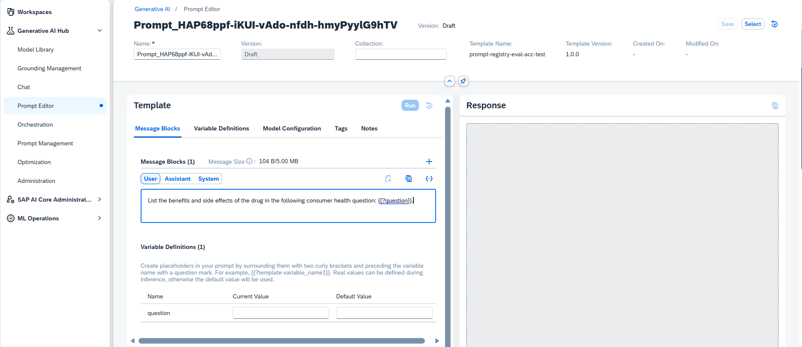

**Save the Template**

Click Save Template (top right):

- Scenario → genai-evaluations

- Name → prompt-registry-eval-acc-test

- Version → 1.0.0

Click Save to persist the template.

**Verify the Template**

Go to Generative AI Hub → Prompt Management → Templates and confirm:

- The template appears with the correct name, scenario, and version.

- Managed By → shows how the template is stored.

- Versioning is tracked automatically

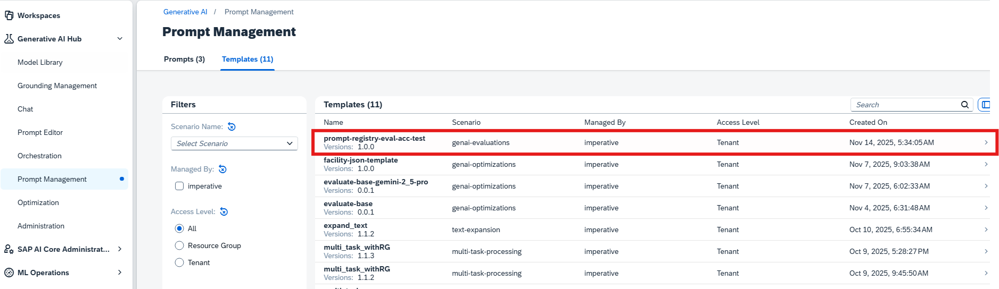

[OPTION END]

[OPTION BEGIN [Python]]

```python
import os
import json

def get_prompt_config_file(folder_path):
    """
    Retrieves a list of all JSON file names in the specified folder.
    """
    if not os.path.isdir(folder_path):
        print(f"The folder path '{folder_path}' does not exist.")
        return []

    json_files = [file for file in os.listdir(folder_path) if file.endswith(".json")]

    if not json_files:
        print(f"No JSON files were found in the folder '{folder_path}'.")
    return json_files


def get_dataset_file_name(folder_path):
    """
    Retrieves the name of the first file in the specified folder.
    """
    if not os.path.isdir(folder_path):
        print(f"The folder path '{folder_path}' does not exist.")
        return None

    items_in_folder = os.listdir(folder_path)

    for item in items_in_folder:
        item_path = os.path.join(folder_path, item)
        if os.path.isfile(item_path):
            return item

    print(f"No files were found in the folder '{folder_path}'.")
    return None


def load_prompt_template(folder_path, file_name):
    """
    Loads the contents of a JSON prompt template into a variable.
    """
    file_path = os.path.join(folder_path, file_name)
    try:
        with open(file_path, "r", encoding="utf-8") as f:
            return json.load(f)   # returns Python dict
    except Exception as e:
        print(f"Error loading prompt template: {e}")
        return None

# --- MAIN EXECUTION ---
PROMPT_FOLDER = "./PUT_YOUR_PROMPT_TEMPLATE_HERE"
DATASET_FOLDER = "./PUT_YOUR_DATASET_HERE"

PROMPT_CONFIG_FILES = get_prompt_config_file(PROMPT_FOLDER)
DATASET_NAME = get_dataset_file_name(DATASET_FOLDER)

if PROMPT_CONFIG_FILES and DATASET_NAME:
    # Load the first JSON prompt template
    PROMPT_TEMPLATE = load_prompt_template(PROMPT_FOLDER, PROMPT_CONFIG_FILES[0])
    print(f"Prompt configs: {PROMPT_CONFIG_FILES}")
    print(f"Dataset name: {DATASET_NAME}")
    print("Prompt template contents:", PROMPT_TEMPLATE)
else:
    print("Missing run or dataset file.")
    raise SystemExit("Exiting due to missing run/dataset file.")
```

```python
def create_prompt_template():
    headers = _get_headers()
    GET_PROMPT_TEMPLATES_ENDPOINT = '/v2/lm/promptTemplates'
    request_url = f"{AICORE_BASE_URL}{GET_PROMPT_TEMPLATES_ENDPOINT}"
    
    request_body = {
    "name": "prompt-registry-eval-acc-test",
    "version": "1.0.0",
    "scenario": "genai-evaluations",
    "spec": PROMPT_TEMPLATE
    }
    try:
        response = requests.post(
            request_url, headers=headers, data=json.dumps(request_body), timeout=120
        )
        if(response.status_code != 200):
            raise
        result = response.json()
        print(result)
        return result['id']
    except:
        logging.error("Error occurred while attempting to create a prompt template")
        raise

prompt_template_id = create_prompt_template()
```
**Note**

If you wish to use a prompt template that already exists in prompt registry, you can manually set prompt_template_id in the next cell and skip executing this cell

If you already have an existing template set the ID manually:

```python
prompt_template_id = "<your_template_id>"
```

[OPTION END]

[OPTION BEGIN [Bruno]]

In Bruno, you can create a prompt template by sending a POST request to the AI Core API:

**Request: Create Prompt Template**

**URL:**

```bash
POST {{api_url}}/v2/lm/promptTemplates
```

**Headers:**
```
Authorization: Bearer {{access_token}}
Content-Type: application/json
```

**Body (JSON):**
```json
{
  "name": "prompt-registry-eval-acc-test",
  "version": "1.0.0",
  "scenario": "genai-evaluations",
  "spec": {
    "template": [
      {
      "role": "user",
      "content": "List the benefits and side effects of the drug in the following consumer health question: {{?question}}."
    }
    ],
    "defaults": {},
    "additional_fields": {
      "modelParams": {
        "temperature": 0.3,
        "max_tokens": 100
      },
      "modelGroup": "chat"
    }
  }
}
```
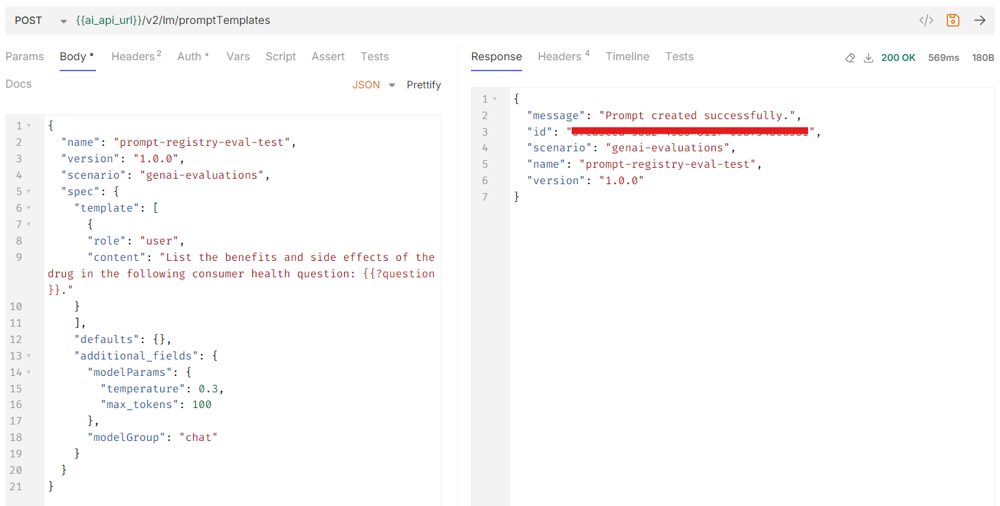

[OPTION END]

🔑 Tip: Always increment the version (e.g., 1.0.1, 1.0.2) when updating a template. This ensures reproducibility across evaluations.

### (Option 2) - Providing Prompts via Orchestration Registry (Inline Prompt)

Follow this step only if you want to **store prompt + model configuration inside Orchestration Registry**.

**Create Orchestration Registry Configuration**

[OPTION BEGIN [SAP AI Launchpad]]

Go to Generative AI Hub → Orchestration → Orchestration Configurations

- click create

- In templating  add the system prompt

```json
List the benefits and side effects of the drug in the following consumer health question: {{?question}}.
```


- select the model in model configuration and save

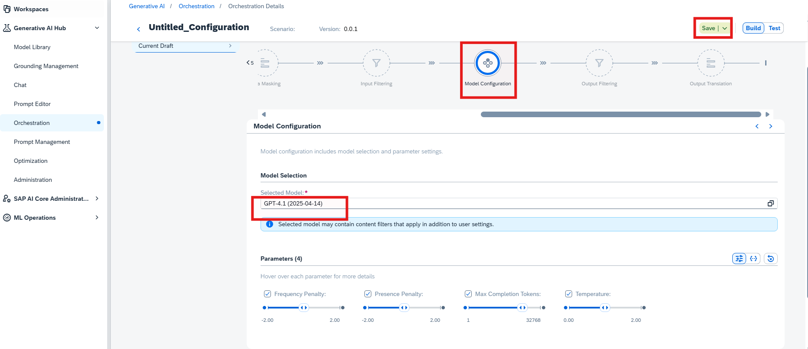

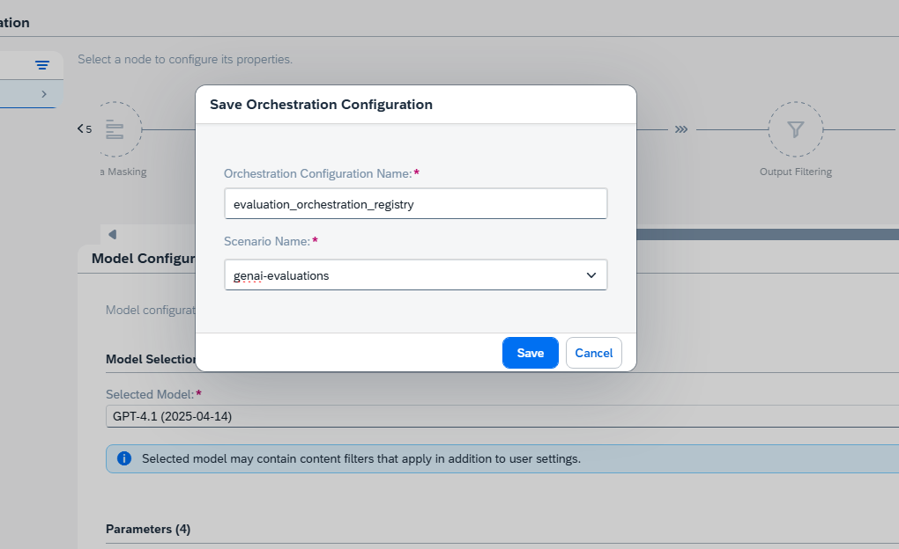

[OPTION END]

[OPTION BEGIN [Python]]

```python
def create_orchestration_registry_config():
    headers = _get_headers()
    CREATE_ORCHESTRATION_REGISTRY = '/v2/registry/v2/orchestrationConfigs'
    request_url = f"{AICORE_BASE_URL}{CREATE_ORCHESTRATION_REGISTRY}"
    model_name,model_version=selected_models_str.split(":")
    request_body = {
      "name": "genai-eval-test",
      "version": "1.0.0",
      "scenario": "genai-evaluations",
      "spec": {
        "modules": {
          "prompt_templating": {
            "model": {
              "name": model_name,
              "version": model_version
            },
            "prompt": PROMPT_TEMPLATE
          }
        }
      }
    }
    try:
        response = requests.post(
            request_url, headers=headers, data=json.dumps(request_body), timeout=120
        )
        if(response.status_code != 200):
            print(response.json())
            raise
        result = response.json()
        print(result)
        return result['id']
    except:
        logging.error("Error occurred while attempting to create a orchestration registry id")
        raise
orchestration_registry_id = create_orchestration_registry_config()
```

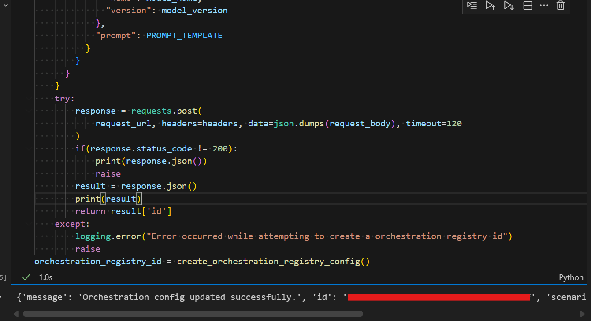

[OPTION END]

[OPTION BEGIN [Bruno]]

You can paste this directly into a Bruno .bru file or create a new request inside Bruno.

**Url:** 
```bash
POST {{AICORE_BASE_URL}}/v2/registry/v2/orchestrationConfigs
```

**headers:** 
```
{
    Authorization: Bearer {{token}}
    AI-Resource-Group: {{resource_group}}
    Content-Type: application/json
  }
```

**body:** 
```json
{
  "name": "genai-eval-test",
  "version": "1.0.0",
  "scenario": "genai-evaluations",
  "spec": {
    "modules": {
      "prompt_templating": {
        "model": {
          "name": "model_name",
          "version": "model_version" 
        },
        "prompt": {
          "template": [
            {
              "role": "user",
              "content": "List the benefits and side effects of the drug in the following consumer health question: {{?question}}."
            }
          ],
          "defaults": {}
        }
      }
    }
  }
}
```

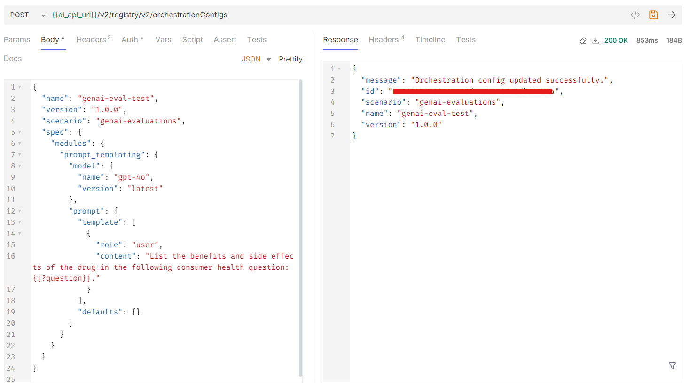

[OPTION END]

After completing Option 2:

    - Proceed directly to the “Create Evaluation Configuration” section


### Understanding Metrics (Pre-Read)

Metrics determine how your model outputs are evaluated during an evaluation run. They define the scoring logic that SAP AI Core uses to compare models, measure quality, and validate improvements over time.

In SAP AI Core, you can use:

    - System-defined metrics (ready-made, no setup needed)

    - Custom metrics (your own definitions stored in the metric registry)

**How Metrics Apply in Each Approach**

| Approach                              | How Metrics Apply                                                             |
| ------------------------------------- | ----------------------------------------------------------------------------- |
| **Option 1 – Prompt Template**        | Metrics score responses generated using the prompt template + selected model. |
| **Option 2 – Orchestration Registry** | Metrics score responses generated through orchestration configuration.        |

Metrics are provided later during **Create Evaluation Configuration**:

```json
"metrics": "BERT, answer_relevance"
```

You can specify one or multiple metrics (comma-separated).

#### Types of Metrics

**1. System-defined Metrics**

These come in two categories:

**Computed Metrics**

Score outputs using reference data or validation logic.

| Metric                | Description                                | Needs Reference? |
| --------------------- | ------------------------------------------ | ---------------- |
| **BERT Score**         | Embedding similarity to reference          | Yes              |
| **BLEU**              | N-gram overlap                             | Yes              |
| **ROUGE**             | Recall-based overlap                       | Yes              |
| **Exact Match**       | Checks if output exactly matches reference | Yes              |
| **JSON Schema Match** | Validates output against a schema          | Yes              |
| **Language Match**    | Detects language                           | No               |
| **Content Filter**    | Safety filter triggered (input/output)     | No               |

**2. LLM-as-a-Judge Metrics**

These metrics use a judge LLM to score responses based on a rubric.
They are ideal for open-ended tasks with no exact references.

| Metric                    | What It Measures                  | Needs Reference? |
| ------------------------- | --------------------------------- | ---------------- |
| **Instruction Following** | How well the prompt was followed  | No               |
| **Correctness**           | Factual accuracy                  | Yes              |
| **Answer Relevance**      | Relevance of the generated answer | No               |
| **Conciseness**           | Brevity + clarity                 | No               |
| **RAG Groundedness**      | Grounding in the provided context | No               |
| **RAG Context Relevance** | Usefulness of retrieved context   | No               |

---

#### Custom Metrics

Create them when system metrics are insufficient.

Two ways to define custom metrics:

**1. Structured metrics (recommended)**

    - Provide task, criteria, rubric, optional examples

    - AI Core constructs the judge prompt

**2. Free-form metrics**

    - You define prompts and scoring logic manually

**Custom metric registration:**

```bash
POST {{ai_api_url}}/v2/lm/evaluationMetrics
```
Once registered, use them like system metrics:

```json
"metrics": "my_custom_metric"
```

**Example — Prompt Template Approach**

```json
"metrics": "BERT Score,answer_relevance"
```

**Example — Orchestration Registry Approach**

```json
"metrics": "Pointwise Conciseness"
```

The chosen metrics determine:

    - scoring

    - dashboard visualizations

    - aggregated results

    - model ranking logic

### Providing Metrics for Evaluation

Metrics must be supplied before creating an Evaluation Configuration.

[OPTION BEGIN [SAP AI Launchpad]]

In SAP AI Launchpad, metrics are selected visually during the Evaluation Configuration creation flow.

You can choose:

    - System-defined metrics

    - Custom metrics (your own definitions stored in the metric registry — cannot be created directly in AI Launchpad; to use them, register them via API/Bruno mentioned in the same step and then select them in the Evaluation Configuration)

No manual JSON input is needed—the UI provides a selectable list of available metrics.

1. Go to Generative AI Hub → Optimization.

2. Click Create to start a new evaluation configuration.

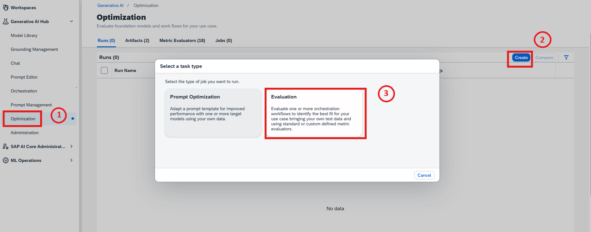

Select Test Input / Runs depending on the option you used earlier:

| Earlier Option Used                   | What to Select in AIL                                             |
| ------------------------------------- | ----------------------------------------------------------------- |
| **Option 1 – Prompt Template**        | Select your **Prompt Template** and choose one or more **Models** |
| **Option 2 – Orchestration Registry** | Select your **Orchestration Registry Config ID**                  |

Then:

    - Select your registered dataset artifact

    - Enter the dataset path (example):
    testdata/global_customer_queries.csv

    - Set the number of test samples (e.g., 20)

  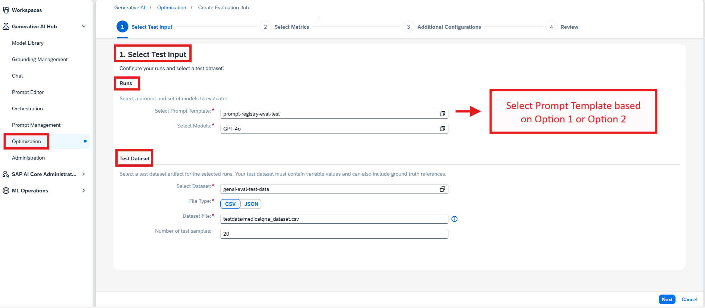

- Click **Next** to go to Metrics selection.

#### Select Evaluation Metrics

Choose the metrics you want to evaluate.

You may choose one or multiple system-defined or custom metrics—examples:

    - BERT Score

    - answer_relevance

    - instruction_following

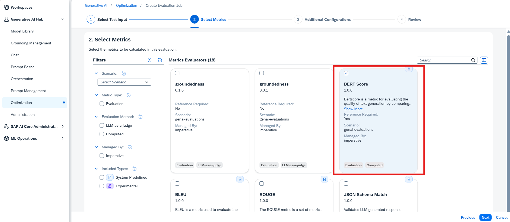

---

> 📘 **Helpful Resources**:
> 
> - [System-Defined Evaluation Metrics – SAP Documentation](https://help.sap.com/docs/sap-ai-core/generative-ai-hub/system-defined-evaluation-metrics)  
> - [Define Your Own Custom Metrics – SAP Guide](https://help.sap.com/docs/sap-ai-core/generative-ai-hub/custom-metrics)  
>   *(If your evaluation requires domain-specific or advanced scoring logic)*

> **Note: You may select additional metrics based on your use case.**

---

[OPTION END]

[OPTION BEGIN [Python]]

**Metrics Handling in Python Notebook (Automatic Detection & Creation)**

When running the evaluation through the Python notebook, metric setup is partially automated.
Before the evaluation configuration is created, the script performs the following:

    - Users can manually specify metric IDs

    - Or place custom metric JSON files in CUSTOM_METRIC_FOLDER

    - The notebook loads all custom metric definitions automatically

    - It checks if each metric already exists in AI Core

    - If not found → creates it automatically

    - Prints final list of metric IDs used for evaluation

This ensures all metrics exist before the evaluation configuration is created.

```python
import os
import json
import requests

# --- Load JSON / JSONL files ---
def load_all_metrics(folder_path):
    """
    Loads all JSON and JSONL files from a folder into a single list of dicts.
    """
    metrics = []
    files = [f for f in os.listdir(folder_path) if f.endswith((".json", ".jsonl"))]

    if not files:
        print(f"No JSON/JSONL files found in {folder_path}")
        return metrics

    for file_name in files:
        file_path = os.path.join(folder_path, file_name)
        try:
            with open(file_path, "r", encoding="utf-8") as f:
                content = f.read().strip()
                try:
                    data = json.loads(content)
                    if isinstance(data, list):
                        metrics.extend(data)
                    elif isinstance(data, dict):
                        metrics.append(data)
                except json.JSONDecodeError:
                    # Attempt to parse as JSONL line by line
                    for line in content.splitlines():
                        line = line.strip()
                        if not line:
                            continue
                        try:
                            metrics.append(json.loads(line))
                        except json.JSONDecodeError:
                            print(f"Skipping invalid JSON line in {file_name}: {line[:50]}...")
        except Exception as e:
            print(f"Error reading {file_name}: {e}")
    return metrics

# --- Fetch all metrics from SAP AI Core ---
def fetch_all_metrics():
    request_url = f"{AICORE_BASE_URL}/v2/lm/evaluationMetrics"
    resp = requests.get(request_url, headers=_get_headers())
    resp.raise_for_status()
    return resp.json().get("resources", [])

# --- Create or fetch a metric ---
def create_or_get_metric(custom_metric, user_metric_id=None):
    all_metrics = fetch_all_metrics()

    # 1️⃣ User-supplied ID lookup
    if user_metric_id:
        for m in all_metrics:
            if m.get("id") == user_metric_id:
                print(f"✅ Metric already exists by ID: {user_metric_id}")
                return user_metric_id
        print(f"⚠️ User metric ID {user_metric_id} not found, will only include if valid later")

    # 2️⃣ Check by scenario, name, version
    scenario = custom_metric.get("scenario")
    name = custom_metric.get("name")
    version = custom_metric.get("version")
    if not all([scenario, name, version]):
        raise ValueError("Metric must include 'scenario', 'name', and 'version'")

    for m in all_metrics:
        if (m.get("scenario") == scenario and
            m.get("name") == name and
            m.get("version") == version):
            metric_id = m.get("id")
            print(f"✅ Metric already exists: {scenario}/{name} v{version}, ID = {metric_id}")
            return metric_id

    # 3️⃣ Create metric if not found
    request_url = f"{AICORE_BASE_URL}/v2/lm/evaluationMetrics"
    required_fields = ["scenario", "name", "version", "evaluationMethod", "metricType"]
    for f in required_fields:
        if f not in custom_metric:
            raise ValueError(f"❌ Missing required field: {f}")

    resp = requests.post(request_url, headers=_get_headers(), json=custom_metric)
    resp.raise_for_status()
    metric_id = resp.json().get("id")
    print(f"✅ Metric created successfully: {name} v{version}, ID = {metric_id}")
    return metric_id

# --- Main pipeline ---
CUSTOM_METRIC_FOLDER = "./PUT_YOUR_CUSTOM_METRIC_HERE"
user_metric_ids = "<metric_ids>"  # set by user if needed

# 1️⃣ Load all metrics from JSON/JSONL
custom_metric_list = load_all_metrics(CUSTOM_METRIC_FOLDER)

# 2️⃣ Create/fetch metrics from SAP AI Core
metric_ids = []
for metric in custom_metric_list:
    try:
        metric_id = create_or_get_metric(metric)
        metric_ids.append(metric_id)
    except ValueError as e:
        print(f"Skipping metric due to error: {e}")

# 3️⃣ Validate user_metric_ids separately if provided
if user_metric_ids and user_metric_ids.strip():
    all_metrics = fetch_all_metrics()
    # Split comma-separated IDs and strip whitespace
    for uid in [uid.strip() for uid in user_metric_ids.split(",")]:
        if any(m.get("id") == uid for m in all_metrics):
            metric_ids.append(uid)
        else:
            print(f"⚠️ User metric ID {uid} does not exist in AI Core, skipping.")
# 4️⃣ Convert to comma-separated string
custom_metric_ids_str = ",".join(metric_ids)
print("✅ All processed metric IDs:", custom_metric_ids_str)
```
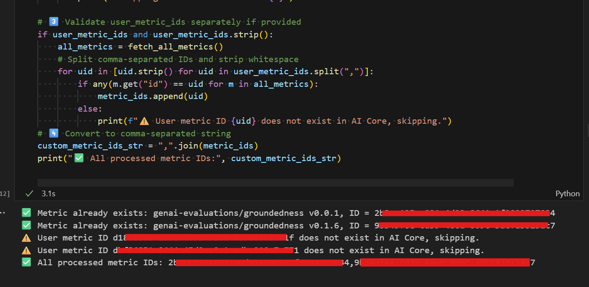

This ensures all required metrics are available before launching the evaluation.

[OPTION END]

[OPTION BEGIN [Bruno]]

Bruno supports two ways of providing metrics:

**Use System-Defined Metrics**

You can directly pass system metrics in your configuration:

Example:

```json
"metrics": "answer_relevance"
```

If you want to register custom metrics, you must call:

➡️ **Create Custom Metric**

```bash
POST {{ai_api_url}}/v2/lm/evaluationMetrics
```
**Body example:**

```json
{
  "scenario": "genai-evaluations",
  "name": "groundedness",
  "version": "0.0.1",
  "evaluationMethod": "llm-as-a-judge",
  "metricType": "evaluation",
  "promptType": "structured",
  "spec": {
    "configuration": {
      "modelConfiguration": {
        "name": "gpt-4o",
        "version": "2024-08-06",
        "parameters": [
          {
            "key": "temperature",
            "value": "0.1"
          },
          {
            "key": "max_tokens",
            "value": "110"
          }
        ]
      },
      "promptConfiguration": {
        "evaluationTask": "You will be assessing groundedness, which measures how well the AI-generated response aligns with and is supported by the provided reference.",
        "criteria": "Groundedness: The degree of factual and contextual overlap between the response and the reference.",
        "ratingRubric": [
          {
            "rating": 5,
            "rule": "Fully grounded — the response completely aligns with and is fully supported by the reference."
          },
          {
            "rating": 4,
            "rule": "Mostly grounded — the response largely aligns with the reference with only minor deviations."
          },
          {
            "rating": 3,
            "rule": "Somewhat grounded — the response partially aligns, but some details are missing or loosely connected."
          },
          {
            "rating": 2,
            "rule": "Poorly grounded — the response contains minimal overlap with the reference."
          },
          {
            "rating": 1,
            "rule": "Not grounded — the response has no meaningful overlap with the reference."
          }
        ],
        "includeProperties": ["reference","response"]
      }
    }
  }
}

```

You will receive:

```json
"id": "<metric_id>"
```

This metric ID can be directly passed into the evaluation configuration.

[OPTION END]

### Define and Create Evaluation Configurations

[OPTION BEGIN [SAP AI Launchpad]]

Once your dataset artifact is registered and you have completed Option 1 (Prompt Template) or Option 2 (Orchestration Registry), the next step is to create an Evaluation Configuration.

An Evaluation Configuration tells SAP AI Core:

    - which dataset to evaluate

    - which prompt/model or orchestration config to use

    - which metrics to compute

    - which orchestration deployment endpoint to call

    - how many repetitions to run

    - which test dataset file to load

This configuration becomes the blueprint for your evaluation execution.

**Steps to Create Evaluation Configuration**

In Additional Configuration

- Set **Number of Repetitions** to `1`.
- Choose an existing deployment for **Orchestration Endpoint**.

    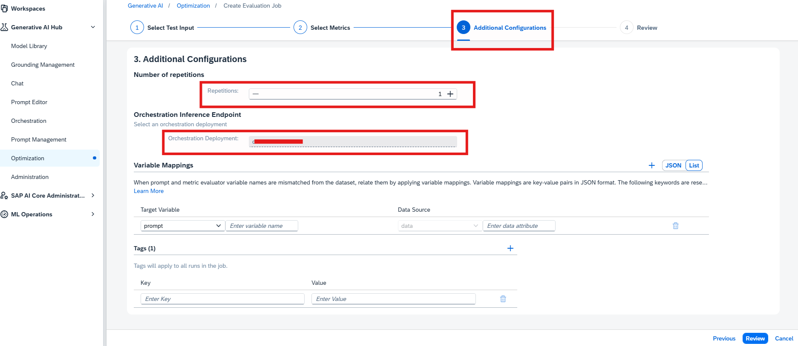
---

#### Final Review & Start

- Review all the details on the summary page.
- Once confirmed, click **Create** to start the evaluation job.

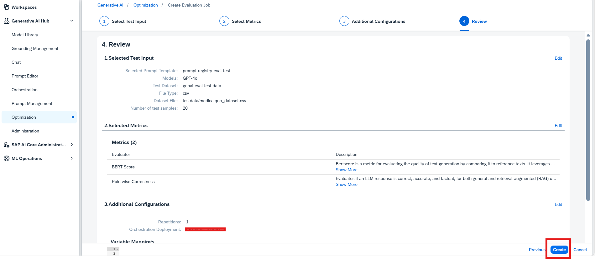

> ✅ You have now successfully configured and triggered a Generative AI Evaluation.

[OPTION END]

[OPTION BEGIN [Python]]

When using the Python notebook, the evaluation configuration is created automatically based on your selections.
Before creating the configuration, the notebook will:

    - Load the dataset artifact ID

    - Resolve metric IDs (system + custom)

    - Load prompt template or orchestration registry IDs

    - Validate all required parameters

**Choose Configuration Mode (Option 1 or Option 2)**

The notebook provides a simple UI with two checkboxes:

**Option 1 – Prompt Template + Models**

**Option 2 – Orchestration Registry**

You must select only one.

The notebook ensures mutual exclusivity and stores your selection in the variable:

```python
from ipywidgets import Checkbox, VBox, HBox, Output, Label, Layout
from IPython.display import display
import textwrap

# --- Selection state ---
approach = None
suppress_update = False  

# --- Define options ---
flag_options = [
    "prompt_registry",
    "orchestration_registry"
]

# --- Output widget to show current selection ---

output = Output(layout=Layout(border="1px solid black", height="70px", overflow="auto", width="900px"))


# --- Handler for checkbox changes ---
def on_flag_change(change):
    global approach, suppress_update
    if suppress_update:
        return

    if change["new"]:  # A checkbox was checked
        suppress_update = True
        # Uncheck all other checkboxes
        for cb in checkboxes:
            if cb.description != change["owner"].description:
                cb.value = False
        suppress_update = False
        approach = change["owner"].description
    else:
        # Only clear if the unchecked one was the currently selected
        if approach == change["owner"].description:
            approach = None

    # Update display once per action
    with output:
        output.clear_output(wait=True)
        msg = f"Selected approach: {approach or 'None'}"
        wrapped = textwrap.fill(msg, width=60)
        output.append_stdout(wrapped + "\n")

# --- Create checkboxes ---
checkboxes = [
    Checkbox(value=False, description=option, layout=Layout(width="250px"))
    for option in flag_options
]

# --- Attach event handler ---
for cb in checkboxes:
    cb.observe(on_flag_change, names="value")

# --- Display UI ---
header = Label(
    value="Please select the configuration mode:",
    layout=Layout(margin="10px 0px 10px 0px")
)
ui = VBox([header, HBox(checkboxes), output])
display(ui)
```

This value determines which fields are passed later:

    - If approach == "prompt_registry" → notebook passes promptTemplate + models

    - If approach == "orchestration_registry" → notebook passes orchestrationRegistryIds

#### Create Configuration Body

The notebook builds the configuration using the required SAP AI Core fields:

    - scenarioId

    - executableId

    - dataset artifact binding

    - selected metrics

    - test dataset details

    - repetitions

    - orchestration deployment URL

    - and Option 1 or Option 2 fields, depending on the chosen approach.

The following function dynamically creates the configuration body for AI Core. 

```python
#  creating an AICORE Configuration.
import requests

request_body = {
    "name": "genai-eval-conf",
    "scenarioId": "genai-evaluations",
    "executableId": "genai-evaluations-simplified",
    "inputArtifactBindings": [
        {
            "key": "datasetFolder",
            "artifactId": artifact_id
        }
    ],
    "parameterBindings": [
        {
            "key": "repetitions",
            "value": repetitions
        },
        {
            "key": "orchestrationDeploymentURL",
            "value": orchestration_deployment_url
        },
        {
            "key": "metrics",
            "value": metrics_list
        },
        {
            "key": "testDataset",
            "value": test_datasets
        },
        {
            "key": "promptTemplate",
            "value": prompt_template_id if approach == "prompt_registry" else ""
        },
        {
            "key": "models",
            "value": models_list if approach == "prompt_registry" else ""
        },
        {
            "key": "orchestrationRegistryIds",
            "value": orchestration_registry_id if approach == "orchestration_registry" else ""
        }
    ]
}

def create_aicore_configuration():
    headers = _get_headers()
    GET_CONFIGURATIONS_ENDPOINT = '/v2/lm/configurations'
    request_url = f"{AICORE_BASE_URL}{GET_CONFIGURATIONS_ENDPOINT}"
    try:
        response = requests.post(
            request_url, headers=headers, data=json.dumps(request_body), timeout=120
        )
        print(response)
        if(response.status_code != 201):
            raise
        result = response.json()
        print(result)
        return result['id']
    except:
        logging.error("Error occurred while attempting to create a Configuration")
        raise
        
configuration_id = create_aicore_configuration()
```

**Sample parameter setup:**

```python
import json
test_data_path = f"testdata/{DATASET_NAME}" # specify the test data path here. For the full folder just specifying testdata will work
test_datasets = json.dumps({'path': test_data_path, 'type': 'csv'})
metrics_list = ",".join([selected_metrics_str,custom_metric_ids_str])
models_list = selected_models_str
print(f"Selected metrics: {metrics_list}")
print(f"Selected models: {models_list}")
orchestration_deployment_url = "<ORCHESTRATION_DEPLOYMENT_URL>"
repetitions = "1"
```

You will receive a configuration ID, which is required for the next step (Execution).

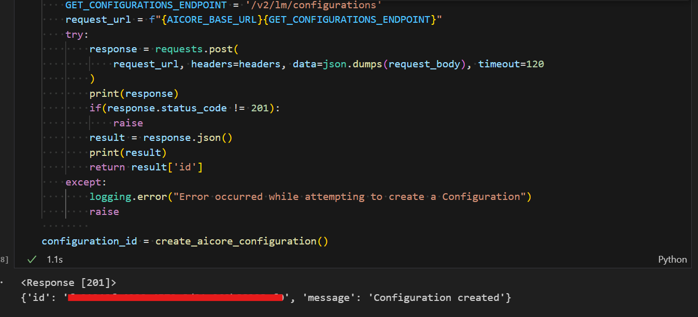

SAP AI Core returns a configuration ID, which is used to trigger the evaluation execution.

[OPTION END]

[OPTION BEGIN [Bruno]]

When creating an Evaluation Configuration through Bruno, you call:

```bash
POST {{api_url}}/v2/lm/configurations
```
Instead, you choose between:

**Option 1 — Prompt Template + Models**

**Option 2 — Orchestration Registry**

based on which fields you include in your request body.

| Option Selected                       | Fields You Must Pass       |
| ------------------------------------- | -------------------------- |
| **Option 1 – Prompt Template**        | `promptTemplate`, `models` |
| **Option 2 – Orchestration Registry** | `orchestrationRegistryIds` |

All other fields (metrics, testDataset, repetitions, orchestrationDeploymentURL) remain the same across both options.

Below are the sample request bodies for each option.

#### Option 1 — Using Prompt Template + Models

```json
{
  "name": "genai-eval-conf",
  "scenarioId": "genai-evaluations",
  "executableId": "genai-evaluations-simplified",
  "inputArtifactBindings": [
    {
      "key": "datasetFolder",
      "artifactId": "{{artifactId}}"
    }
  ],
  "parameterBindings": [
    {
      "key": "repetitions",
      "value": "1"
    },
    {
      "key": "orchestrationDeploymentURL",
      "value": "{{deployment_url}}"
    },
    {
      "key": "metrics",
      "value": "language_match"
    },
    {
      "key": "testDataset",
      "value": "{\"path\": \"testdata/{{dataset_file}}\", \"type\": \"csv\"}"
    },
    {
      "key": "promptTemplate",
      "value": "{{prompt_template_id}}"
    },
    {
      "key": "models",
      "value": "{{model_name}}:{{model_version}}"
    }
  ]
}
```
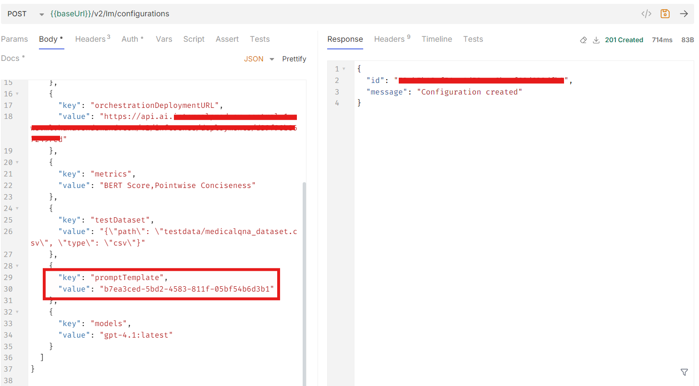

#### Option 2 — Using Orchestration Registry

```json
{
  "name": "genai-eval-conf",
  "scenarioId": "genai-evaluations",
  "executableId": "genai-evaluations-simplified",
  "inputArtifactBindings": [
    {
      "key": "datasetFolder",
      "artifactId": "{{artifactId}}"
    }
  ],
  "parameterBindings": [
    {
      "key": "repetitions",
      "value": "1"
    },
    {
      "key": "orchestrationDeploymentURL",
      "value": "{{deployment_url}}"
    },
    {
      "key": "metrics",
      "value": "language_match"
    },
    {
      "key": "testDataset",
      "value": "{\"path\": \"testdata/{{dataset_file}}\", \"type\": \"csv\"}"
    },
    {
      "key": "orchestrationRegistryIds",
      "value": "{{orchestration_registry_id}}"
    }
  ]
}
```

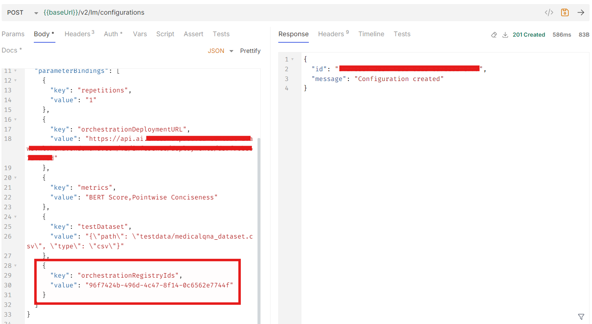

[OPTION END]

### Create and Run Evaluation Execution

After creating the Evaluation Configuration, the next step is to execute it.
Execution triggers the evaluation workflow, which:

    - Reads the test dataset

    - Generates submissions to the orchestration service

    - Collects model outputs

    - Computes all selected metrics

    - Produces aggregate and raw evaluation results

The process is identical for SAP AI Launchpad, Python, and Bruno, with only the invocation method differing.

[OPTION BEGIN [SAP AI Launchpad]]

- Once the evaluation configuration is created, the system automatically triggers an evaluation execution.

- Follow these steps to monitor its progress and verify completion:

    - Navigate to **ML Operations** in the SAP AI Core Launchpad.

    - In the sidebar, click **Executions**.
    
    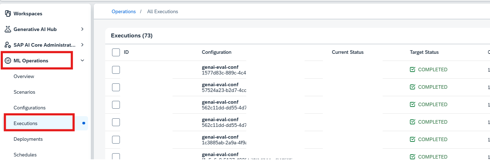

    - Locate the most recent execution triggered by your evaluation configuration. You can use the timestamp or configuration name to identify it.

    - Click on the execution entry to open its details. The Current Status will update as the process runs.

    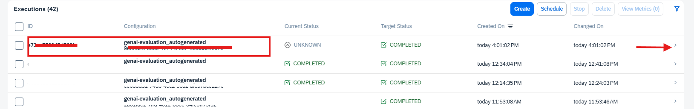

- Once the Target Status reaches **COMPLETED** , your evaluation has successfully finished.

> [For More information](https://help.sap.com/docs/sap-ai-core/generative-ai-hub/create-evaluation)

Track Execution Status

The execution page will show:

    - Unknown

    - Pending

    - Running

    - Completed

Once completed, you can navigate to:

    - Outputs → Tracking Metrics (aggregate results)

    - Output Artifacts (raw results stored in the SQLite DB)

[OPTION END]

[OPTION BEGIN [Python]]

Once the configuration is ready, the next step is to trigger an execution.
An execution is a single evaluation run based on the configuration you defined.

**Create Execution**

The following function starts the evaluation in SAP AI Core using the configuration ID:

```python
# Trigger an execution with the created configuration

import requests
def create_execution():
    headers = _get_headers()
    GET_EXECUTIONS_ENDPOINT = '/v2/lm/executions'
    request_url = f"{AICORE_BASE_URL}{GET_EXECUTIONS_ENDPOINT}"
    request_body = {"configurationId" : configuration_id} 
    try:
        response = requests.post(
            request_url, headers=headers, data=json.dumps(request_body), timeout=120
        )
        print("response received is ", response)
        result = response.json()
        print(result)
        return result['id']
    except:
        logging.error("Error occurred while attempting to create an execution")
        raise
 

execution_id = create_execution()
```
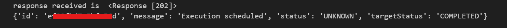

#### Monitor Execution Status

The execution progresses through states:

UNKNOWN → PENDING → RUNNING → COMPLETED

```python
# get execution status
import requests
def get_execution_status(execution_id):
    headers = _get_headers()
    LOG_EXECUTIONS_ENDPOINT = f'/v2/lm/executions/{execution_id}'
    request_url = f"{AICORE_BASE_URL}{LOG_EXECUTIONS_ENDPOINT}"
    try:
        response = requests.get(
            request_url, headers=headers, timeout=120
        )
        print("response received is ", response)
        result = response.json()
        return result
    except:
        logging.error("Error occurred while attempting to get execution status")
        raise
 
get_execution_status(execution_id)
```

#### Automatic Polling

To continuously monitor until the evaluation finishes:

```python
# Polling the execution status until it is COMPLETED or DEAD or timeout occurs
def poll_execution_status(execution_id, timeout_minutes=1800, poll_interval=30):
    start_time = time.time()
    while True:
        result = get_execution_status(execution_id)
        print(f"Execution Status: {result.get('status')}")
        if result.get("status") == "COMPLETED":
            print(f"Execution completed successfully in {time.time() - start_time} seconds, proceed to fetch results.")
            break
        if result.get("status") == "DEAD":
            print(f"Execution failed with status DEAD in {time.time() - start_time} seconds. Check the logs for more details.")
            break
        if time.time() - start_time > timeout_minutes * 60:
            raise TimeoutError(f"Execution status polling timed out after {timeout_minutes} minutes.")
        time.sleep(poll_interval)

```

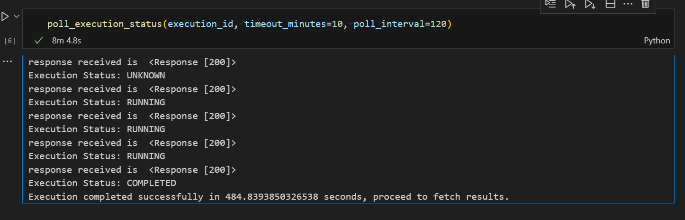

✅ Once the execution status shows COMPLETED, the evaluation results are available and can be analyzed in the next step.

[OPTION END]

[OPTION BEGIN [Bruno]]

After creating the configuration, the next step is to trigger the evaluation workload by creating an AI Core execution.

**Create an Execution with the Created Configuration**

- Click on create execution under executions, pass the configuration id created in previous step

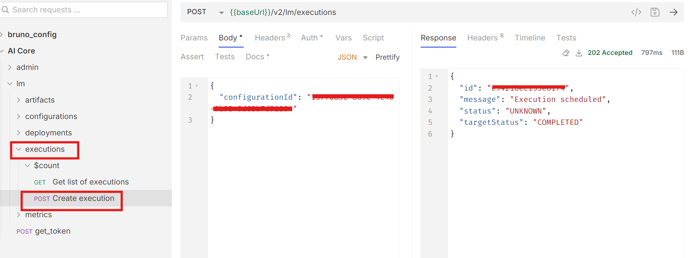

- The status field progresses through different states over time:
UNKNOWN → PENDING → RUNNING → COMPLETED.

**Get Execution Status**

check the status of created execution by passing the execution ID, The Current Status will update as the process runs. please refer the below image

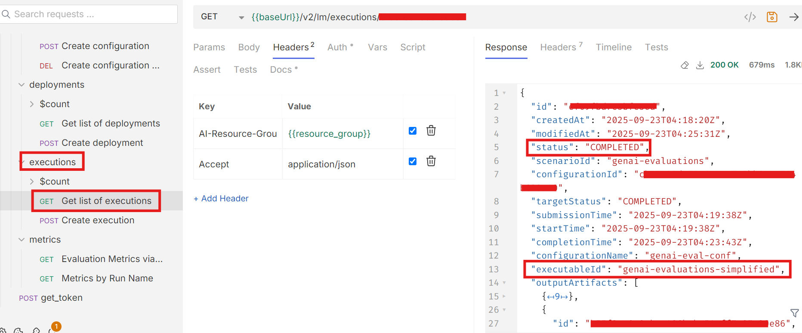

[OPTION END]

### View and Analyze Evaluation Results

Once the evaluation execution is complete, SAP AI Core generates both aggregated metrics and detailed instance-level results.
These results help compare model performance, understand quality metrics, and debug issues.

[OPTION BEGIN [SAP AI Launchpad]]

Once the evaluation workflow execution is completed, this step retrieves the aggregated evaluation metrics from the SAP AI Core service by specifying the run name.

1. Go to Evaluations → Executions

2. Select your execution

3. Open the Metrics tab to view:

    - average latency

    - token usage

    - metric scores

4. Open the Artifacts tab to download:

    - the complete result folder

    - the SQLite DB for deeper analysis

This is the easiest way to visually inspect evaluation outcomes and compare multiple model runs.

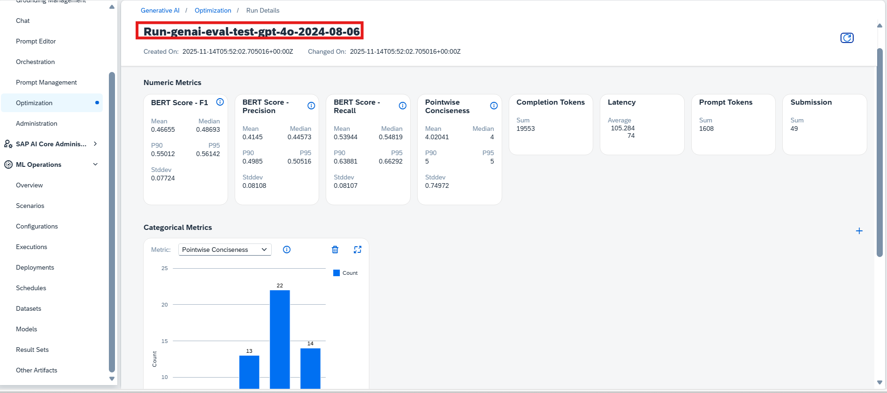

[OPTION END]

[OPTION BEGIN [Python]]

The notebook includes utility scripts to retrieve aggregated metrics, download detailed artifacts, and inspect SQLite results.This returns all metric values per evaluated run, which your notebook then:

    - Converts into a DataFrame

    - Creates a pivot table

    - Prepares for ranking and scoring

**Retrieve Aggregate Metrics (Tracking API)**

Aggregated metrics summarize performance across all test samples.
To fetch them using execution ID:

```python
# Get aggregate metrics using execution id
import pandas as pd
from IPython.display import HTML

def get_model_from_run(run):
    for tag in run.get("tags", []):
        if tag.get("name") == "evaluation.ai.sap.com/model":
            return tag.get("value")

def aggregate_metrics_by_model(runs_list):
    transformed_data = []
    for run in runs_list:
        model = get_model_from_run(run)
        for metric in run["metrics"]:
            output_json = {
                "model": model,
                "metrics_name": metric.get("name"),
                "metric_value": metric.get("value")
            }
            transformed_data.append(output_json)
    return transformed_data


def create_metrics_pivot_table(transformed_data):
    """
    Creates a pivot table where rows are models and columns are metrics.
    
    Args:
        transformed_data: List of dictionaries with 'model', 'metrics_name', 'metric_value'
    
    Returns:
        DataFrame with models as rows and metrics as columns
    """
    # Convert list of dictionaries to DataFrame
    df = pd.DataFrame(transformed_data)
    
    # Create pivot table
    pivot_table = df.pivot_table(
        index='model',
        columns='metrics_name',
        values='metric_value',
        aggfunc='first'  # Use 'first' to get the single value, or 'mean' if there are duplicates
    )
    
    return pivot_table

transformed_data = aggregate_metrics_by_model(runs_data['resources'])
metrics_pivot = create_metrics_pivot_table(transformed_data)

HTML(metrics_pivot.to_html())
```
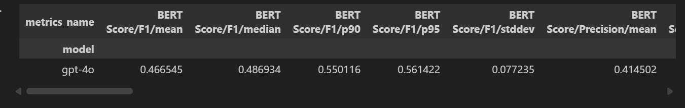

You can also retrieve using run name:

```bash
{base_url}/v2/lm/metrics?tagFilters=evaluation.ai.sap.com/run-name={run_name}
```

**Download Raw Results (Output Artifact)**

All detailed evaluation outputs are stored as an output artifact in your object store. To download all output files programmatically:

```python
# download the result artifacts from Object store.
import boto3

def download_all_objects(prefix, destination_folder):
    """
    Recursively download all objects from an S3 bucket starting with a specific prefix.

    :param bucket_name: Name of the S3 bucket.
    :param prefix: Prefix to filter objects in the bucket.
    :param destination_folder: Local folder to save the downloaded files.
    """
    s3_client = boto3.client(
            's3',
            aws_access_key_id=AWS_ACCESS_KEY,
            aws_secret_access_key=AWS_SECRET_ACCESS_KEY,
            region_name=AWS_REGION
            )

    # Ensure the destination folder exists
    if not os.path.exists(destination_folder):
        os.makedirs(destination_folder)

    # Paginate through objects
    paginator = s3_client.get_paginator('list_objects_v2')
    pages = paginator.paginate(Bucket=AWS_BUCKET_ID, Prefix=prefix)

    for page in pages:
        if 'Contents' in page:
            for obj in page['Contents']:
                key = obj['Key']
                local_file_path = os.path.join(destination_folder, os.path.relpath(key, prefix))

                # Ensure the local directory structure exists
                local_directory = os.path.dirname(local_file_path)
                if not os.path.exists(local_directory):
                    os.makedirs(local_directory)

                # Download the object
                print(f"Downloading {key} to {local_file_path}")
                s3_client.download_file(AWS_BUCKET_ID, key, local_file_path)


# Download the evaluation results from the object store. Look at execution status under "outputArtifacts" key to see the 'url'
# which shows the data path of where your output results are stored
EXECUTION_ID = execution_id
sqlite_db_prefix = f'{EXECUTION_ID}/evaluation_result/'  # change the prefix based on where your output artifact is stored in the bucket.
destination_folder = 'results-new'

download_all_objects(sqlite_db_prefix, destination_folder)
```

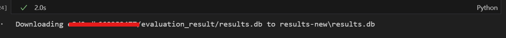

**View Detailed Results (SQLite DB)**

The evaluation stores detailed instance-level results in results.db.

Example: Reading SQLite tables:

```python
# viewing the results from sqlite db in tabular format..
import sqlite3
import pandas as pd
from IPython.display import display, HTML

# Path to your SQLite database file
db_file = 'results-new/results.db'

connection = sqlite3.connect(db_file)

# Specify the table names you want to display
table_names = ['run','configuration', 'submission', 'submission_result', 'evaluation_result'] 

# Create the CSS and HTML container
html_content = """
<style>
/* Container to hold all tables */
.fixed-container {
    max-height: 600px;  /* Total container height */
    overflow-y: auto;   /* Vertical scroll for container */
    border: 2px solid #ddd;
    padding: 10px;
}

/* Table styling */
.table-container table {
    border-collapse: collapse; /* Merge table borders */
    width: 100%; /* Full width for tables */
    margin-bottom: 20px; /* Space between tables */
}

.table-container th, .table-container td {
    border: 1px solid #ddd; /* Add gridlines */
    text-align: left;       /* Align text to the left */
    padding: 8px;           /* Cell padding */
    white-space: nowrap;    /* Prevent text wrapping */
}

.table-container th {
    font-weight: bold;         /* Bold header text */
}

/* Allow dynamic column widths */
.table-container td {
    white-space: nowrap;   /* Prevent wrapping for long text */
}

</style>
<div class="fixed-container">
"""

for table_name in table_names:
    query = f"SELECT * FROM {table_name};"
    df = pd.read_sql_query(query, connection)
    # If you want to see all the rows across all tables, remove/comment the next line
    df = df.head(10)  # Limiting the number of rows displayed
    table_html = df.to_html(classes='table-container', index=False)
    html_content += f"""
    <div class="table-container">
        <h3>Table: {table_name}</h3>
        {table_html}
    </div>
    """

html_content += "</div>"

display(HTML(html_content))

# Close the connection
connection.close()
```

**Process and Rank Models (Optional Python Helpers)**

The notebook includes post-processing utilities that:

    - normalize numeric metrics

    - process boolean and categorical metrics

    - compute weighted scores

    - generate a final ranking to identify the best model

```python
import pandas as pd
from IPython.display import HTML

# Scoring logic depends on "scoring_type"
# "weight" represents the relative weight of this metric to all SELECTED metrics
METRICS_SCORING_TYPE_MAPPING = {
    "Content Filter on Input": {
        "scoring_type": "bool-false", # False is good
        "weight": 1
    },
    "Content Filter on Output": {
        "scoring_type": "bool-false", # False is good
        "weight": 1
    },
    "Pointwise Instruction Following": {
        "scoring_type": "num_1_to_5",
        "weight": 1
    },
    "Pointwise Answer Relevance": {
        "scoring_type": "num_1_to_5",
        "weight": 1
    },
    "Pointwise Conciseness": {
        "scoring_type": "num_1_to_5",
        "weight": 1
    },
    "Pointwise Correctness": {
        "scoring_type": "num_1_to_5",
        "weight": 1
    },
    "BLEU": {
        "scoring_type": "num_0_to_1",
        "weight": 1
    },
    "ROUGE": {
        "scoring_type": "num_0_to_1",
        "weight": 1
    },
    "BERT Score": {
        "scoring_type": "F1/Precision/Recall num_0_to_1",
        "weight": 1
    }
}

def calculate_bool_metric_score(pivot_df, metric_base_name, true_is_good):
    """
    Calculate scores for boolean metrics based on False/True counts.
    
    Args:
        pivot_df: DataFrame with models as rows and metrics as columns
        metric_base_name: Base name of the metric (without /False/count or /True/count)
        true_is_good: Boolean indicating if True is considered a good outcome
    
    Returns:
        Series with boolean metric scores per model (scaled to -1 to 1)
    """
    false_col = f"{metric_base_name}/False/count"
    true_col = f"{metric_base_name}/True/count"
    
    false_values = pivot_df[false_col] if false_col in pivot_df.columns else 0
    true_values = pivot_df[true_col] if true_col in pivot_df.columns else 0
    total_values = true_values + false_values

    score = ((false_values * 1) + (true_values * -1)) / total_values

    if true_is_good:
        score = 0 - score

    return score

def calculate_numeric_metric_score(pivot_df, metric_base_name, range_min=0, range_max=1):
    """
    Calculate scores for numeric metrics with /mean
    The mean is normalized to a score between -1 and 1 using the provided range.
    
    Args:
        pivot_df: DataFrame with models as rows and metrics as columns
        metric_base_name: Base name of the metric (without suffixes)
        range_min: Minimum possible value of the metric
        range_max: Maximum possible value of the metric
    
    Returns:
        Series with numeric metric scores per model (scaled to -1 to 1)
    """
    mean_col = f"{metric_base_name}/mean"
    
    if mean_col not in pivot_df.columns:
        return pd.Series(0.0, index=pivot_df.index)
    
    mean_values = pivot_df[mean_col]
    
    # Linear normalization from [range_min, range_max] to [0, 1]
    normalized = (mean_values - range_min) / (range_max - range_min)
    
    # Scale to [-1, 1]
    score = (normalized * 2) - 1
    
    return score

def calculate_bert_score(pivot_df, metric_base_name):
    """
    Calculate BERT Score by averaging F1, Precision, and Recall scores.
    
    Args:
        pivot_df: DataFrame with models as rows and metrics as columns
        metric_base_name: Base name "BERT Score"
    
    Returns:
        Series with BERT scores per model (scaled to -1 to 1)
    """
    f1_col = f"{metric_base_name}/F1/mean"
    precision_col = f"{metric_base_name}/Precision/mean"
    recall_col = f"{metric_base_name}/Recall/mean"
    
    scores = []
    for col in [f1_col, precision_col, recall_col]:
        if col in pivot_df.columns:
            scores.append(pivot_df[col])
    
    if not scores:
        return pd.Series(0.0, index=pivot_df.index)
    
    # Average the three metrics (already in 0 to 1 range)
    avg_score = sum(scores) / len(scores)
    
    # Scale to [-1, 1]
    score = (avg_score * 2) - 1
    
    return score

def find_unique_metrics_in_pivot(pivot_df):
    """
    Identify unique metric base names present in the pivot table.
    
    Args:
        pivot_df: DataFrame with models as rows and metrics as columns
    """
    # Extract unique metric names from pivot table columns
    unique_metrics = set()
    for col in pivot_df.columns:
        # Extract base metric name by removing suffixes
        base_name = col
        for suffix in ['/False/count', '/True/count', '/F1_score/mean','/Precision_score/mean', 
                       '/Recall_score/mean','/mean','/median', '/p90', '/p95', '/stddev']:
            if suffix in base_name and "BERT Score" not in base_name:
                base_name = base_name.replace(suffix, '')
                unique_metrics.add(base_name)
                break
        if base_name.startswith("BERT Score/"):
            base_name = "BERT Score"
            unique_metrics.add(base_name)
    if not unique_metrics:
        raise ValueError("No valid metrics found in pivot table")
    return unique_metrics


def rank_models(pivot_df, unique_metrics=None):
    """
    Rank models based on metrics present in the pivot table.
    
    Args:
        pivot_df: DataFrame with models as rows (index) and metrics as columns
    
    Returns:
        DataFrame with model rankings and scores
    """    
    # Calculate total weight for metrics present in pivot table
    total_weight = sum(METRICS_SCORING_TYPE_MAPPING[m]["weight"] for m in unique_metrics)
    
    # Initialize total score
    total_scores = pd.Series(0.0, index=pivot_df.index)
    
    # Process each metric found in the pivot table
    for metric_name in unique_metrics:
        config = METRICS_SCORING_TYPE_MAPPING[metric_name]
        scoring_type = config["scoring_type"]
        weight = config["weight"] / total_weight
        
        if scoring_type == "bool-false":
            # False is good (True is bad)
            metric_score = calculate_bool_metric_score(pivot_df, metric_name, true_is_good=False)
            total_scores += metric_score * weight
            
        elif scoring_type == "bool-true":
            # True is good (False is bad)
            metric_score = calculate_bool_metric_score(pivot_df, metric_name, true_is_good=True)
            total_scores += metric_score * weight
            
        elif scoring_type == "num_1_to_5":
            metric_score = calculate_numeric_metric_score(pivot_df, metric_name, range_min=1, range_max=5)
            total_scores += metric_score * weight
            
        elif scoring_type == "num_0_to_1":
            metric_score = calculate_numeric_metric_score(pivot_df, metric_name, range_min=0, range_max=1)
            total_scores += metric_score * weight
            
        elif scoring_type == "F1/Precision/Recall num_0_to_1":
            # BERT Score
            metric_score = calculate_bert_score(pivot_df, metric_name)
            total_scores += metric_score * weight
    
    # Create results DataFrame
    results_df = pd.DataFrame({
        'model': pivot_df.index,
        'total_score': total_scores.values
    })
    
    # Rank models (higher score = better rank)
    results_df['rank'] = results_df['total_score'].rank(ascending=False, method='min').astype(int)
    results_df = results_df.sort_values('rank')
    
    return results_df

def get_detailed_scores(pivot_df, unique_metrics):
    """
    Get detailed breakdown of scores per metric for each model.
    
    Args:
        pivot_df: DataFrame with models as rows and metrics as columns
    
    Returns:
        DataFrame with detailed scores per metric
    """
    detailed_scores = pd.DataFrame(index=pivot_df.index)
    
    # Process each metric in the mapping
    for metric_name in unique_metrics:
        scoring_type = METRICS_SCORING_TYPE_MAPPING[metric_name]["scoring_type"]
        
        if scoring_type == "bool-false":
            detailed_scores[f"{metric_name}_score"] = calculate_bool_metric_score(pivot_df, metric_name, true_is_good=False)
            
        elif scoring_type == "bool-true":
            detailed_scores[f"{metric_name}_score"] = calculate_bool_metric_score(pivot_df, metric_name, true_is_good=True)
            
        elif scoring_type == "num_1_to_5":
            detailed_scores[f"{metric_name}_score"] = calculate_numeric_metric_score(pivot_df, metric_name, range_min=1, range_max=5)
            
        elif scoring_type == "num_0_to_1":
            detailed_scores[f"{metric_name}_score"] = calculate_numeric_metric_score(pivot_df, metric_name, range_min=0, range_max=1)
            
        elif scoring_type == "F1/Precision/Recall num_0_to_1":
            detailed_scores[f"{metric_name}_score"] = calculate_bert_score(pivot_df, metric_name)
    
    return detailed_scores

unique_metrics = find_unique_metrics_in_pivot(metrics_pivot)

# Get detailed scores breakdown
detailed = get_detailed_scores(metrics_pivot, unique_metrics)
display(HTML(detailed.to_html()))

# Rank models
ranking = rank_models(metrics_pivot, unique_metrics)
display(HTML(ranking.to_html()))
```
This provides a clear ranking of models based on the metrics you selected during evaluation.

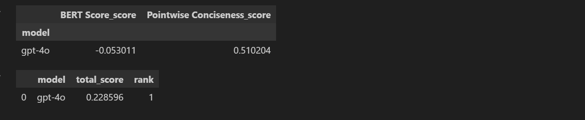

[OPTION END]

[OPTION BEGIN [Bruno]]

Retrieve Aggregate Metrics

Send a GET request:

**GET** 
```bash
{{apiurl}}/v2/lm/metrics?tagFilters=evaluation.ai.sap.com/child-of={{execution_id}}
```
or using dataset run name:

**GET** 
```bash
{{apiurl}}/v2/lm/metrics?tagFilters=evaluation.ai.sap.com/run-name={{run_name}}
```

This returns aggregated values for:

    - latency

    - token usage

    - metric scores

    - completion count

**Download Raw Results**

1. Open the execution details

2. Copy the output artifact URL

3. Download the folder to obtain

    - step-wise results

    - sqlite_combined/results.db

**Inspect Detailed Results**

Open the SQLite DB in any client to inspect:

    - submissions

    - completion responses

    - evaluation_results (raw metric scores)

    - aggregation_results

    - custom_logs

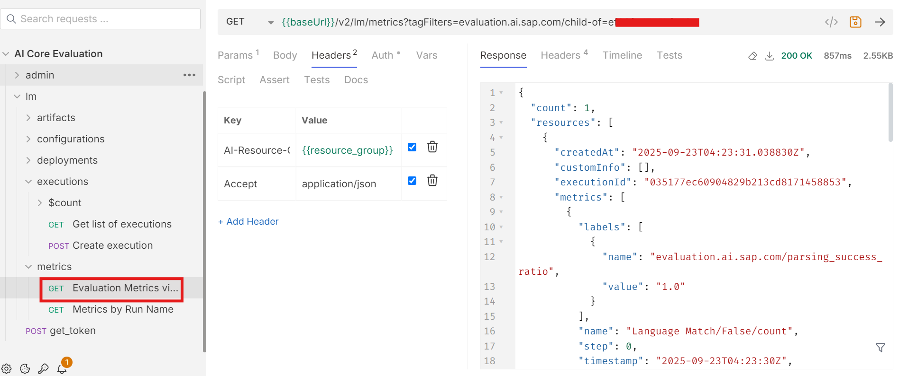

[OPTION END]

### Delete Evaluation Artifacts, Configurations & Metrics

Over time, your workspace may accumulate old configurations, executions, and metrics.
SAP AI Core allows you to safely delete these resources once they are no longer needed.

This section explains how to delete:

    - Evaluation Executions

    - Evaluation Configurations

    - Custom Metrics (if created)

⚠️ Important:

Deletions are permanent and cannot be undone.
System-defined metrics cannot be deleted — only your custom metrics.

[OPTION BEGIN [SAP AI Launchpad]]

**Delete Executions**

1. Go to Evaluations → Executions

2. Select the execution

3. Click Delete

4. Confirm the deletion

**Delete Evaluation Configurations**

1. Go to Evaluations → Configurations

2. Select the configuration you created

3. Click Delete

[OPTION END]

[OPTION BEGIN [Python]]

**1. Delete an Evaluation Execution**

```python
#Delete Execution Id
def delete_execution():
    headers = _get_headers()
    EXEC_ID = execution_id
    GET_EXECUTIONS_ENDPOINT = '/v2/lm/executions/'
    request_url = f"{AICORE_BASE_URL}{GET_EXECUTIONS_ENDPOINT}{EXEC_ID}"
    try:
        response = requests.delete(
                request_url, headers=headers, params={"AI-Resource-Group":AICORE_RESOURCE_GROUP}, timeout=120
            )
        print(response)
        if(response.status_code != 202):
            raise
        result = response.json()
        print(result)
    except:
        logging.error("Error occurred while attempting to delete a Configuration")
        raise
    
delete_execution()
```
**2. Delete an Evaluation Configuration**

```python
def delete_configuration(configuration_id):
    headers = _get_headers()
    endpoint = f"/v2/lm/configurations/{configuration_id}"
    url = f"{AICORE_BASE_URL}{endpoint}"

    response = requests.delete(url, headers=headers)
    print("Status:", response.status_code)
    print(response.text)

# Example:
delete_configuration(configuration_id)
```

**3. Delete a Custom Metric**

```python
def delete_metric(metric_id):
    headers = _get_headers()
    endpoint = f"/v2/lm/evaluationMetrics/{metric_id}"
    url = f"{AICORE_BASE_URL}{endpoint}"

    response = requests.delete(url, headers=headers)
    print("Status:", response.status_code)
    print(response.text)

# Example:
delete_metric(metric_id)
```

[OPTION END]

[OPTION BEGIN [Bruno]]

**1. Delete Execution**

**DELETE Request**
```bash
{{apiurl}}/v2/lm/executions/{{execution_id}}
```
**Headers:**
```
Authorization: Bearer {{access_token}}
AI-Resource-Group: {{resource_group}}
```
**2. Delete Configuration**

```bash
DELETE {{apiurl}}/v2/lm/configurations/{{configuration_id}}
```

**3. Delete Custom Metric**

```bash
DELETE {{apiurl}}/v2/lm/evaluationMetrics/{{metric_id}}
```

[OPTION END]
