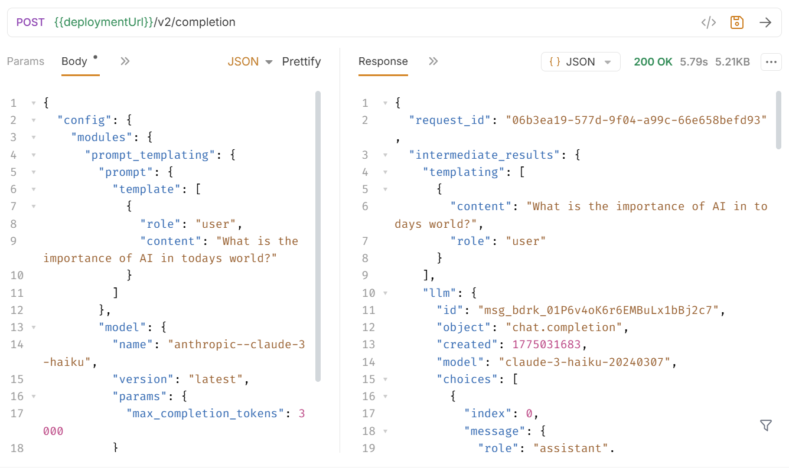
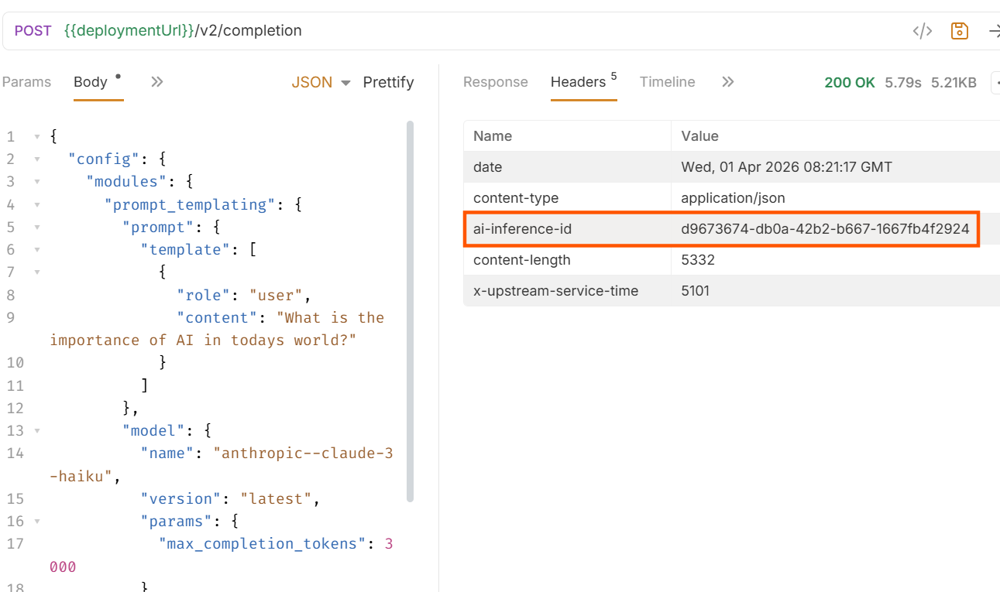
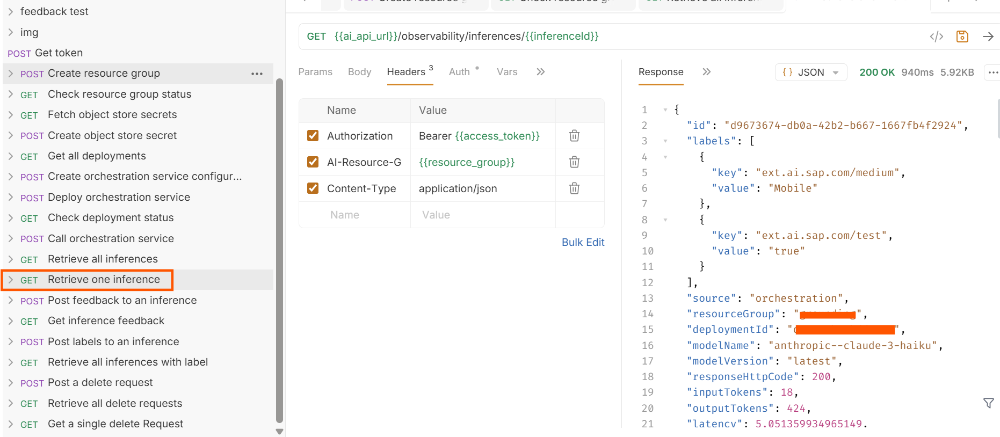
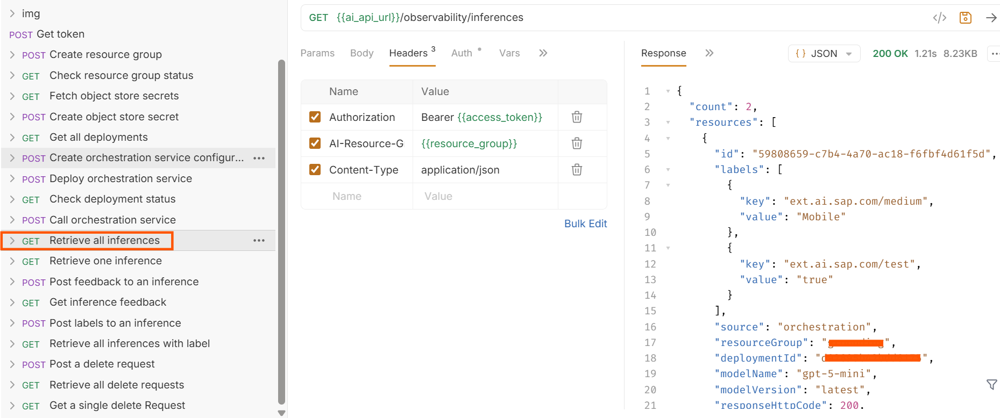
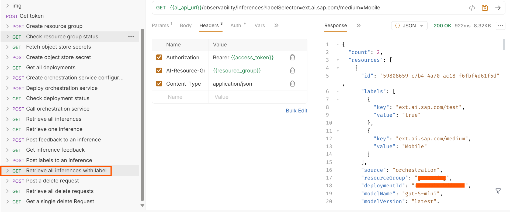
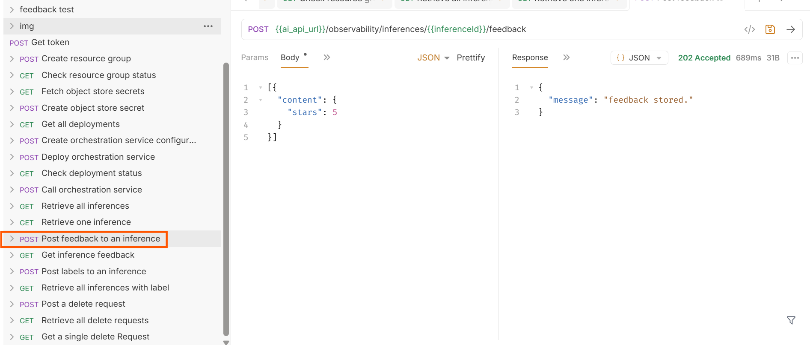
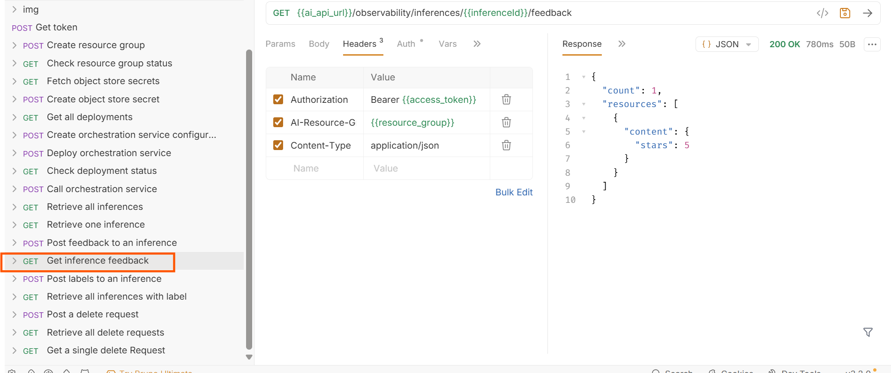
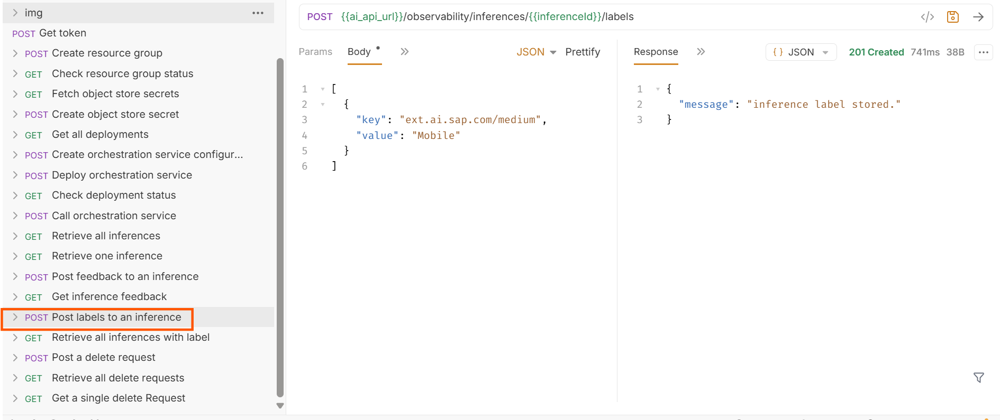

# Inference Observability & Feedback Workflow in SAP AI Core
<!-- description --> In this tutorial, you will learn how to execute AI inferences and leverage Inference Observability in SAP AI Core to track, analyze, and improve model responses using feedback and labeling mechanisms.

## You will learn

- How to execute inference using orchestration or foundation models
- How to record and retrieve inference details
- How to add feedback to improve responses
- How to use labels for filtering and analysis

## Prerequisites  
1. **BTP Account**  
   If you do not already have a commercial SAP Business Technology Platform (BTP) account, you can use **BTP Advanced Trial**.  
   [Create a BTP Account](https://developers.sap.com/group.btp-setup.html)
2. **For SAP Developers or Employees**  
   Internal SAP stakeholders should refer to the following documentation: [How to create BTP Account For Internal SAP Employee](https://me.sap.com/notes/3493139), [SAP AI Core Internal Documentation](https://help.sap.com/docs/sap-ai-core)
3. **For External Developers, Customers, or Partners**  
   Follow this tutorial to set up your environment and entitlements: [External Developer Setup Tutorial](https://developers.sap.com/tutorials/btp-cockpit-entitlements.html), [SAP AI Core External Documentation](https://help.sap.com/docs/sap-ai-core?version=CLOUD)
4. **Create BTP Instance and Service Key for SAP AI Core**  
   Follow the steps to create an instance and generate a service key for SAP AI Core. Ensure to use service plan **extended**:  
   [Create Service Key and Instance](https://help.sap.com/docs/sap-ai-core/sap-ai-core-service-guide/create-service-key?version=CLOUD)
5. **AI Core Setup Guide**  
   Step-by-step guide to set up and get started with SAP AI Core:  
   [AI Core Setup Tutorial](https://developers.sap.com/tutorials/ai-core-genaihub-provisioning.html)
6. An **Extended** SAP AI Core service plan is required, as the Generative AI Hub is not available in the Free or Standard plans. For more details, refer to 
[SAP AI Core Service Plans](https://help.sap.com/docs/sap-ai-core/sap-ai-core-service-guide/service-plans?version=CLOUD)
7. **Bruno Tool Version**
   Ensure you are using **Bruno version 3.1 or higher**.  
   Versions up to 3.0 do not support `.yml` files used in this tutorial.  
   You can download the latest version from: https://www.usebruno.com/

## Pre-Read

In real-world AI applications, executing a model is only the first step. Once deployed, it becomes essential to monitor how the model behaves with actual user inputs, identify issues, and continuously improve the system.

Inference Observability in SAP AI Core provides this capability by recording inference requests, responses, metadata, and feedback for later analysis.

This feature works with both:

    - Orchestration services
    - Foundation model deployments

By enabling observability, AI systems move from being black-box models to transparent and trackable systems.

**Note:** Inference data is recorded only when explicitly enabled using observability headers in the request. 

### Bruno Collection

To simplify execution, this tutorial provides a pre-configured Bruno collection containing all required API requests.

This collection includes:

    - Inference execution
    - Observability APIs
    - Feedback APIs
    - Label management APIs

👉 Download the Bruno collection from here: [Bruno_collections](img/FeedbackService_Test) 

**Import the Bruno Collection**

    - Open Bruno
    - Navigate to Collections
    - Click on open Collection
    - Upload the downloaded folder files

**Configure Environment Variables**

After importing the collection:

    - Select any request (e.g., Get Token)
    - Click on No Environment → Configure
    - Provide the following values from your service key:
        - ai_auth_url
        - ai_api_url
        - client_id
        - client_secret
        - resource_group
    - Save the environment
    - Select the configured environment before executing requests

**Generate Access Token**
    - Open the Get Token request
    - Click Send to generate the access token

Note: If the token expires during execution, regenerate it using the same request.

### Initial Setup Overview

Before working with inference observability, certain foundational components must be in place.

**Setup & Authentication**

You must first authenticate your API requests using an access token generated from your SAP AI Core service key. This ensures all subsequent API calls are securely authorized.

**Resource & Deployment Setup**

Inference execution requires an active deployment. You can use either:

    - An orchestration service
    - A foundation model deployment

This deployment acts as the endpoint where inference requests are sent and processed.

**Object Store (S3) Setup**

To store complete inference data (request, response, and feedback), an **Amazon S3 object store** must be configured.

    - Required when using **full persistence mode**
    - Not required if storing **metadata only**

**Important:** Only **S3 object stores** are supported by inference observability

### Execute Inference and Enable Observability

In this step, you will execute an inference request and enable observability to record the interaction.

📂 Bruno File:

Call orchestration service.yml

**Step 1: Open the Request**

Navigate to the **Call orchestration service** request in the Bruno collection.
This request is used to send prompts to the deployed orchestration or foundation model.

**Step 2: Configure Headers**

Ensure the following headers are included:

```http
Authorization: Bearer <access_token>
ai-resource-group: <resource-group>
ai-inference-observability-persistence-mode: full
ai-object-store-secret-name: <object-store-name>
```
These headers enable inference recording and specify where the data should be stored.

**Step 3: Update Request Body**

Provide the input prompt in the request body. For example:

```json
{
  "config": {
    "modules": {
      "prompt_templating": {
        "prompt": {
          "template": [
            {
              "role": "user",
              "content": "What is the importance of AI in today's world?"
            }
          ]
        },
        "model": {
          "name": "anthropic--claude-3-haiku",
          "version": "latest",
          "params": {
            "max_completion_tokens": 3000
          }
        }
      }
    }
  }
}
```
**Step 4: Execute the Request**

Click Send to execute the request.



**Step 5: Observe the Response**
    - The model generates a response
    - A response header ai-inference-id is returned

This ID uniquely identifies the inference and acts as a reference for all subsequent operations such as retrieval, feedback submission, and labeling.

**Explanation**

At this stage:

    - The inference is executed
    - Observability is enabled
    - The request and response are recorded

This forms the foundation for tracking and analysis.



**Important:** Only inferences sent to orchestration services or foundation model deployments are recorded in Inference Observability.

### Retrieve and Analyze Inference (Observability)

Once an inference is recorded, you can retrieve its details for analysis.

📂 Bruno File

Retrieve one inference.yml

**Step 1: Open the Request**

Navigate to the **Retrieve one inference** request.

**Step 2: Provide Inference ID**

Replace the placeholder with the **Inference ID** obtained from the previous step.

**Step 3: Execute the Request**

Click **Send** to fetch the inference details.



**Step 4: Analyze the Response**

The response includes:

    - Model details
    - Input and output tokens
    - Latency
    - Request and response payload (in full mode)

**Explanation**

This step allows you to:

    - Debug incorrect outputs
    - Understand model behavior
    - Analyze performance metrics

👉 This is the core of **Inference Observability**

#### Retrieve All Inferences

Once multiple inferences are recorded, you can retrieve them collectively to analyze overall usage and system behavior.

📂 Bruno File

Retrieve all inferences.yml



This request returns all recorded inferences within the resource group, enabling broader monitoring and analysis.

#### Retrieve Inferences Using Labels

You can filter inferences using labels to perform targeted analysis across specific environments or use cases.

📂 Bruno File

Retrieve all inferences with label.yml



This request retrieves inferences that match the specified label criteria.

### Add Feedback to Improve Responses

Feedback helps improve the quality of AI responses over time by capturing user evaluation of model outputs.

📂 Bruno File

Post feedback to an inference.yml

**Step 1: Open the Request**

Navigate to the feedback request in the Bruno collection.

**Step 2: Provide Inference ID**

Replace the placeholder with the required inference ID

**Step 3: Update Payload**

```json
[
  {
    "content": {
      "stars": 5
    }
  }
]
```
**Step 4: Execute the Request**

Click **Send** to submit feedback.

**Explanation**
    - Feedback is stored along with the inference
    - Multiple feedback entries can be added



> **Important:** Feedback is supported only when persistence mode is set to `full`.

### Retrieve Feedback

Once feedback is added, you can retrieve it to analyze response quality and user ratings.

📂 Bruno File

Get inference feedback.yml

This request retrieves all feedback associated with a specific inference, enabling evaluation of response quality.



### Use Labels for Filtering and Analysis

Labels allow you to categorize and organize inference data for better monitoring and targeted analysis.

📂 Bruno File

Post labels to an inference.yml

**Step 1: Open the Request**

Navigate to the label request.

**Step 2: Provide Payload**

```json
[
  {
    "key": "ext.ai.sap.com/medium",
    "value": "mobile"
  }
]
```

**Step 3: Execute the Request**

Click Send to attach labels.



**Explanation**

Labels help:
    - Categorize inferences
    - Filter results
    - Perform targeted analysis

**Note:** 
    - Label keys must use the prefix ext.ai.sap.com
    - Maximum of 16 labels per inference  
    - Keys and values must not exceed 64 characters  

### Cleanup (Optional)

Cleanup is performed using the delete inference API, where you can specify filters such as time range and labels.

> **Important:** Only metadata is deleted. Request, response, and feedback stored in the object store (S3) are not removed.

