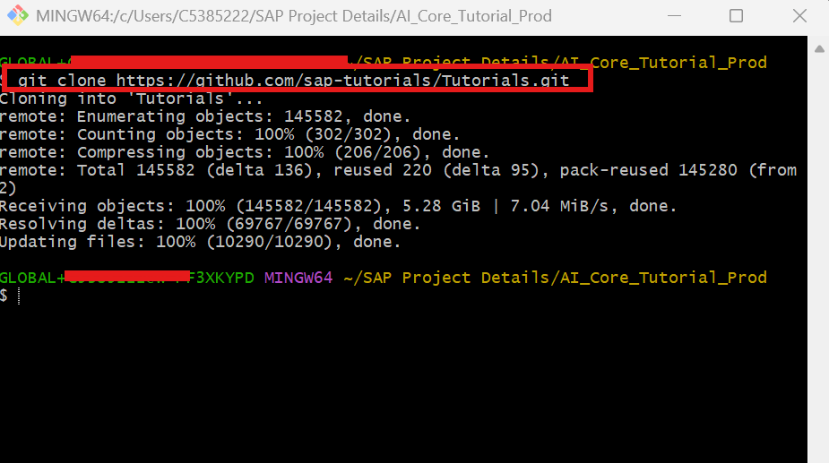
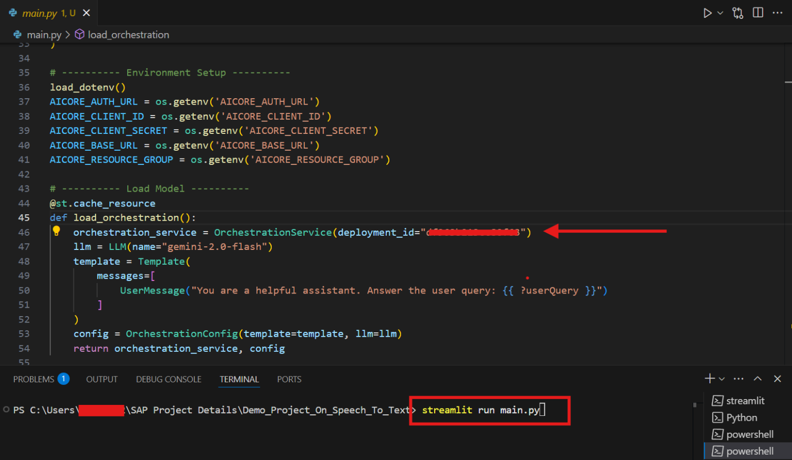
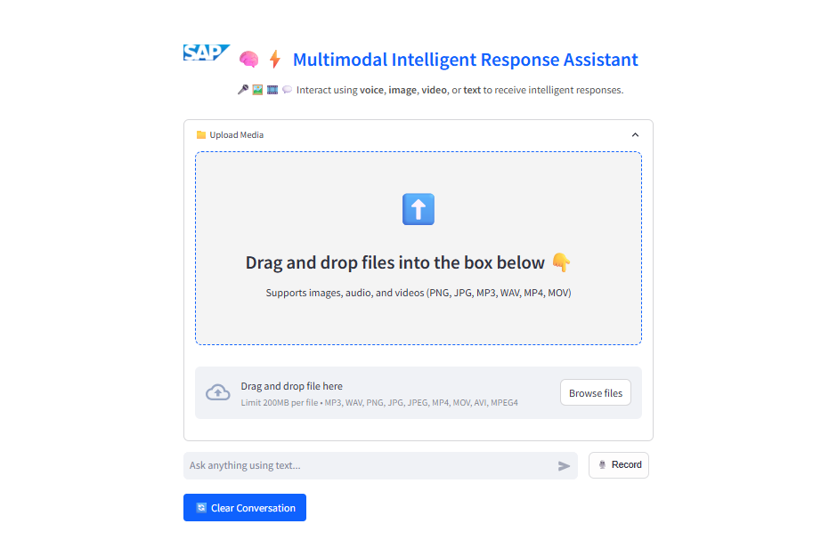
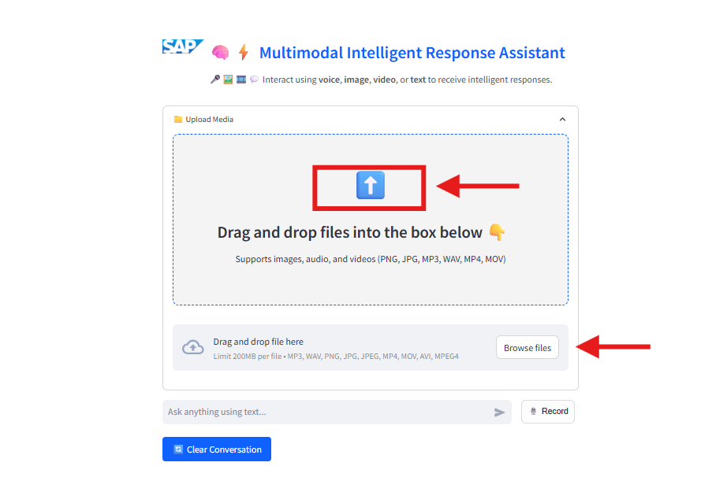
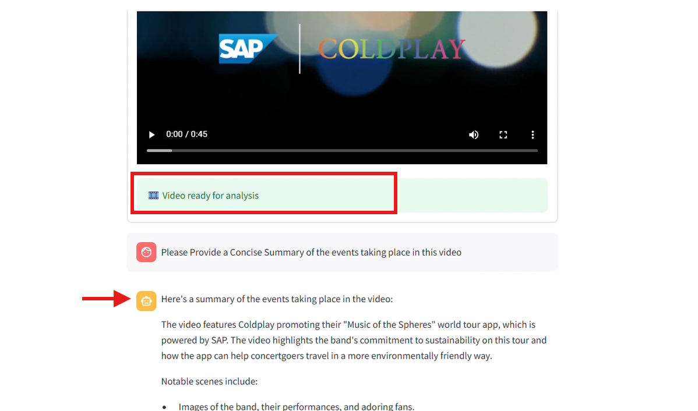
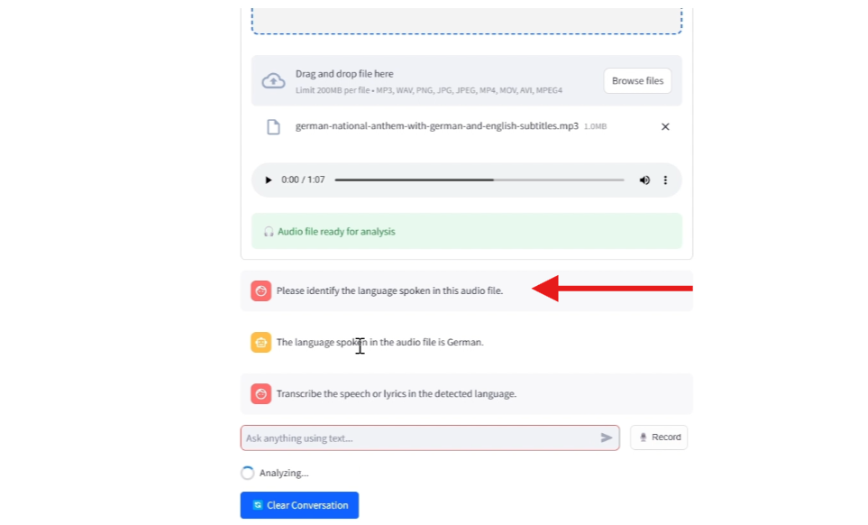
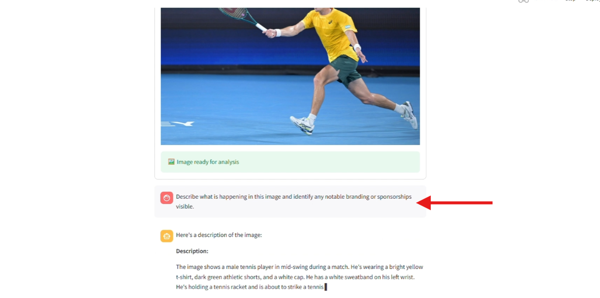

# Multimodal Response Assistant Chatbot Using SAP AI Core

## Prerequisites
1. **BTP Account**  
   Set up your SAP Business Technology Platform (BTP) account.  
   [Create a BTP Account](https://developers.sap.com/group.btp-setup.html)
2. **For SAP Developers or Employees**  
   Internal SAP stakeholders should refer to the following documentation:  
   [How to create BTP Account For Internal SAP Employee](https://me.sap.com/notes/3493139),
   [SAP AI Core Internal Documentation](https://help.sap.com/docs/sap-ai-core)
3. **For External Developers, Customers, or Partners**  
   Follow this tutorial to set up your environment and entitlements:  
   [External Developer Setup Tutorial](https://developers.sap.com/tutorials/btp-cockpit-entitlements.html), [SAP AI Core External Documentation](https://help.sap.com/docs/sap-ai-core?version=CLOUD)
4. **Create BTP Instance and Service Key for SAP AI Core**  
   Follow the steps to create an instance and generate a service key for SAP AI Core: [Create Service Key and Instance](https://help.sap.com/docs/sap-ai-core/sap-ai-core-service-guide/create-service-key?version=CLOUD)
5. **AI Core Setup Guide**  
   Step-by-step guide to set up and get started with SAP AI Core:  
   [AI Core Setup Tutorial](https://developers.sap.com/tutorials/ai-core-setup.html)
6. An Extended SAP AI Core service plan is required, as the Generative AI Hub is not available in the Free or Standard tiers. For more details, refer to [SAP AI Core Service Plans](https://help.sap.com/docs/sap-ai-core/sap-ai-core-service-guide/service-plans?version=CLOUD)


### PREREAD

#### What We’re Building
A **web-based intelligent chatbot** capable of interacting with users via **text**, **audio**, **images**, and **video**. It returns **context-aware responses** using a **multimodal AI model**.

#### Why Build This?
Multimodal assistants are the future of enterprise automation. With varied input types and conversational memory, such assistants:

- Increase productivity
- Provide rapid technical support
- Aid in education and training
- Analyze rich media content

#### What We’re Using
- **SAP Generative AI Hub** for model management
- **Gemini 2.0 Flash** for multimodal LLM capabilities
- **Streamlit** for the user interface
- **Python** backend
- **Media processing** using Pillow, base64
- **Environment handling** with `python-dotenv`

#### Demo Video
> **Watch the walkthrough:**
- You can find the demo video of the application [here](https://video.sap.com/media/t/1_4nixy23y).

---

### Clone the GitHub Repository and Install Dependencies

Clone the project from the repository:

```bash
git clone <your-repo-url>
```

> [GitHub Link](https://github.tools.sap/MLF/aicore-examples.git)



#### 📦 Install Requirements
In **VS Code**, open the cloned folder and install dependencies:

```bash
pip install -r requirements.txt
```

### Application Environment Setup 

#### Deployment Steps
To deploy **Gemini 2.0 Flash**, follow the steps from the official SAP tutorial:

- **Follow Step 3 and Step 4** from this guide: [Create Deployment for a Generative AI Model](https://help.sap.com/docs/sap-ai-core/sap-ai-core-service-guide/create-deployment-for-generative-ai-model-in-sap-ai-core)

- To get the latest **model name** and **version information**, refer to this SAP Note: [3437766 - Generative AI Hub Models](https://me.sap.com/notes/3437766)

Once deployed, note down the following:
    - **Model Name** (e.g., `gemini-2.0-flash`)
    - **Deployment ID**
- Open **main.py** and navigate to the configuration section. Replace the placeholders for model name and deployment ID with your actual values:


#### Add Your Credentials

In the project root, create a `.env` file:

```env
AICORE_AUTH_URL="your-authentication-url"
AICORE_CLIENT_ID="your-client-id"
AICORE_CLIENT_SECRET="your-client-secret"
AICORE_BASE_URL="your-base-api-url"
AICORE_RESOURCE_GROUP="your-resource-group"
```
> **Note:** Make sure to use the same SAP AI Core instance and resource group where you deployed the model. This ensures the application launches and connects successfully.

#### Launch the App

In VS Code, open the terminal and run the below command:

```bash
streamlit run main.py
```




### Video Input – Demo and Analysis

#### ➕ Upload Video
- Choose a short video file in formats: **MP4 or MOV**
- After uploading, you can ask questions such as:
  - *"Please provide a concise summary of the events taking place in this video"*
  


#### 📊 Output Observation



---

### Audio Input – Demo and Analysis

#### ➕ Upload or Record Audio
- Use an audio file in formats: WAV or MP3, or record live.
- Analyze transcription or tone
- You can ask questions like:
  - *"What was said?"*
  - *"Detect the language."*

#### 📊 Output Observation



---

### Image Input – Demo and Analysis

Upload an image in formats like JPG or PNG for analysis.

#### ➕ Upload Image
- Drag & drop or select an image file
- Ask questions like:
  - *"Describe what is happening in this image and indentify any notabl branding or sponsorships visible."*


#### Output Observation



---

### Summary & Use Cases

#### Summary
The assistant delivers accurate, context-aware responses across media types. It’s an enterprise-ready, scalable solution leveraging SAP’s AI infrastructure.

#### Real-world Use Cases
| Scenario             | Value Proposition                                                   |
|----------------------|---------------------------------------------------------------------|
| 🎓 Education          | AI tutors analyzing diagrams and lecture recordings                 |
| 🛠️ Tech Support       | Use screenshots, logs, and voice memos for intelligent resolution   |
| 📈 Business Insights  | Analyze media submissions for trends and decisions                 |
| 🎤 Voice Assistants   | Voice queries in workflows, meeting minutes, etc.                 |

---

#### Demo Video
> **Watch the walkthrough:**
- You can find the demo video of the application [here](https://video.sap.com/media/t/1_4nixy23y).

---

> Final Thoughts: This project demonstrates how multimodal AI can significantly enhance user interactions. By allowing inputs via text, audio, image, and video, and delivering intelligent, contextual responses, the assistant offers a flexible, enterprise-ready solution. It integrates seamlessly with SAP’s AI infrastructure and Google’s powerful models, enabling:
    
    > Smarter user interfaces
    
    > Scalable support systems

    > Rich media understanding
  
> Whether for education, support, or analytics, this assistant provides a practical gateway into the future of digital enterprise interaction.

