# Prompt optimization
<!-- description -->  This tutorial demonstrates how to use Prompt Optimization in SAP AI Core to automatically refine prompt templates using labeled datasets and evaluation metrics.
The process optimizes a prompt for a specific model, stores metrics in the ML Tracking Service, and saves the optimized prompt and results back to the Prompt Registry and Object Store.

## You will learn
- How to prepare datasets and object stores for prompt optimization.
- How to create and register prompt templates in the Prompt Registry.
- How to configure and run prompt optimization via AI Launchpad, Bruno, and the Python SDK.
- How to monitor executions, review metrics, and save optimized prompts for reuse.

## Prerequisites
1. **BTP Account**  
   Set up your SAP Business Technology Platform (BTP) account.  
   [Create a BTP Account](https://developers.sap.com/group.btp-setup.html)
2. **For SAP Developers or Employees**  
   Internal SAP stakeholders should refer to the following documentation: [How to create BTP Account For Internal SAP Employee](https://me.sap.com/notes/3493139), [SAP AI Core Internal Documentation](https://help.sap.com/docs/sap-ai-core)
3. **For External Developers, Customers, or Partners**  
   Follow this tutorial to set up your environment and entitlements: [External Developer Setup Tutorial](https://developers.sap.com/tutorials/btp-cockpit-entitlements.html), [SAP AI Core External Documentation](https://help.sap.com/docs/sap-ai-core?version=CLOUD)
4. **Create BTP Instance and Service Key for SAP AI Core**  
   Follow the steps to create an instance and generate a service key for SAP AI Core:  
   [Create Service Key and Instance](https://help.sap.com/docs/sap-ai-core/sap-ai-core-service-guide/create-service-key?version=CLOUD)
5. **AI Core Setup Guide**  
   Step-by-step guide to set up and get started with SAP AI Core:  
   [AI Core Setup Tutorial](https://developers.sap.com/tutorials/ai-core-setup.html)
6. An Extended SAP AI Core service plan is required, as the Generative AI Hub is not available in the Free or Standard tiers. For more details, refer to 
[SAP AI Core Service Plans](https://help.sap.com/docs/sap-ai-core/sap-ai-core-service-guide/service-plans?version=CLOUD)
7. You've prepared a prompt template and your template is available in the prompt registry. For more information, see [Save a Template](https://help.sap.com/docs/AI_LAUNCHPAD/3f71b1e9d5124e26ace1aa1edb11e450/49d4248485644184ab3ca2ddf36119a6.html?locale=en-US&state=DRAFT&version=DEV)

### Pre-Read
Before starting this tutorial, ensure that you:
- Understand the basics of Generative AI workflows in SAP AI Core.
- Are familiar with creating and managing prompt templates, artifacts, and object stores
- Have the required roles such as genai_manager or custom_evaluation.
- Have completed the Quick Start tutorial or equivalent setup for SAP AI Core and AI Launchpad access.
  
### Architecture Overview

- Prompt Optimization in SAP AI Core connects the Prompt Registry, Object Store, and ML Tracking Service to form an end-to-end optimization workflow.
- The dataset (for example, Test-Data.json) is stored in the Object Store and registered as an artifact.
- During execution, the system uses the selected prompt template, metric, and model to evaluate multiple prompt variants.
- Metrics are tracked in the ML Tracking Service, and both the optimized prompt and results are saved back to the registry and object store.
- This process runs as an execution and is model-specific, ensuring the optimized prompt aligns with the target model’s behavior.

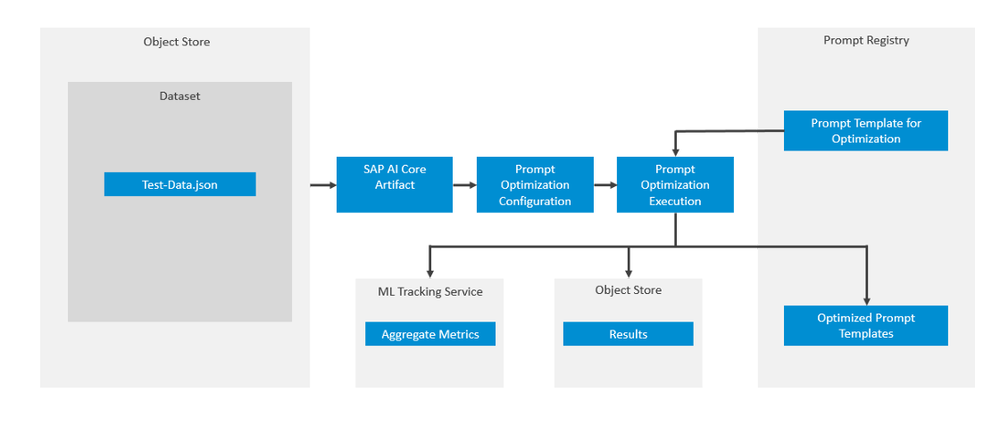

### Notebook Reference

For hands-on execution and end-to-end reference, use the accompanying [Prompt Optimization Notebook](https://github.com/SAP-samples/aicore-genai-samples/blob/main/genai-sample-apps/prompt-optimizer/prompt-optimizer.ipynb). It includes complete Python code examples that align with each step of this tutorial — from dataset preparation and artifact registration to configuration creation, execution, and result retrieval.

💡 Even though this tutorial provides stepwise code snippets for clarity, the notebook contains all required imports, object initializations, and helper functions to run the flow seamlessly in one place.

**To use the notebook:**
- Download and open [notebook](https://github.com/SAP-samples/aicore-genai-samples/blob/main/genai-sample-apps/prompt-optimizer/prompt-optimizer.ipynb) in your preferred environment (e.g., VS Code, JupyterLab).
- Configure your environment variables such as AICORE_BASE_URL, AICORE_AUTH_TOKEN, and object store credentials .
- Execute each cell in order to reproduce the complete prompt optimization workflow demonstrated in this tutorial.

### Environment Variables Setup

[OPTION BEGIN [SAP AI Launchpad]]

- Navigate to your SAP AI Core Launchpad.

- In the Workspaces section, click on "Add" to create a new workspace.
    - A workspace in SAP AI Core is a logical container that holds your resources (like models and pipelines) and provides the isolation needed for your projects.

- When prompted, enter your AI Core credentials (such as Client ID, Client Secret, and Base URL).
    - Note: If you're unsure about where to find these credentials, refer to this [guide](https://developers.sap.com/tutorials/ai-core-generative-ai.html#1c4f36d7-f345-4822-be00-c15f133ff7d8). 

- Once the workspace is successfully created, select your desired Resource Group to begin the evaluation process.

Refer to the screenshot below for guidance:


[OPTION END]

[OPTION BEGIN [Python SDK]]

- Open **Visual Studio Code or Jupyter Notebook**. Create a new file with the .ipynb extension (e.g., prompt_optimization.ipynb).
- Create a **.env** file in the root directory of your project.
- Add your **AI Core** and **AWS credentials** as shown below.

```env
# AICORE CREDENTIALS
AICORE_CLIENT_ID=<AICORE CLIENT ID>  
AICORE_CLIENT_SECRET=<AICORE CLIENT SECRET>
AICORE_AUTH_URL=<AICORE AUTH URL>
AICORE_BASE_URL=<AICORE BASE URL>
AICORE_RESOURCE_GROUP=<AICORE RESOURCE GROUP>

# AWS CREDENTIALS
AWS_ACCESS_KEY=<AWS ACCESS KEY>
AWS_BUCKET_ID=<AWS BUCKET ID>
AWS_REGION=<AWS REGION>
AWS_SECRET_ACCESS_KEY=<AWS SECRET ACCESS KEY> 

# ORCHESTRATION DEPLOYMENT URL
DEPLOYMENT_URL=<DEPLOYMENT URL>
```

**Note:** Replace placeholders (e.g., CLIENT_ID, CLIENT_SECRET, etc) with your actual environment credentials.

Refer to the below screenshot for clarity:
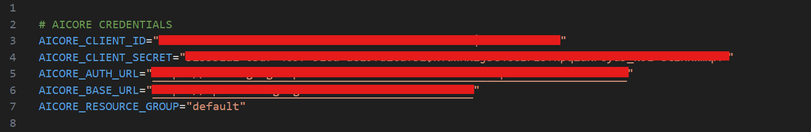

#### Connect to AI Core Instance

Once the environment variables are set and dependencies are installed, run the following code to connect to your instance:

```PYTHON
# Loading the credentials from the env file
from gen_ai_hub.proxy.gen_ai_hub_proxy import GenAIHubProxyClient
from dotenv import load_dotenv
import os

load_dotenv(override=True)

# Fetching environment variables
AICORE_BASE_URL = os.getenv("AICORE_BASE_URL")
AICORE_RESOURCE_GROUP = os.getenv("AICORE_RESOURCE_GROUP")
AICORE_AUTH_URL = os.getenv("AICORE_AUTH_URL")
AICORE_CLIENT_ID = os.getenv("AICORE_CLIENT_ID")
AICORE_CLIENT_SECRET = os.getenv("AICORE_CLIENT_SECRET")

AWS_ACCESS_KEY = os.getenv("AWS_ACCESS_KEY")
AWS_BUCKET_ID = os.getenv("AWS_BUCKET_ID")
AWS_REGION = os.getenv("AWS_REGION")
AWS_SECRET_ACCESS_KEY = os.getenv("AWS_SECRET_ACCESS_KEY")

# Initializing the GenAIHubProxyClient
client = GenAIHubProxyClient(
    base_url=AICORE_BASE_URL,
    auth_url=AICORE_AUTH_URL,
    client_id=AICORE_CLIENT_ID,
    client_secret=AICORE_CLIENT_SECRET,
    resource_group=AICORE_RESOURCE_GROUP
)
```

[OPTION END]

[OPTION BEGIN [Bruno]]

- please follow the steps in the [Tutorial](https://developers.sap.com/tutorials/ai-core-orchestration-consumption.html) to set up your environment, refer step - **Set Up Your Environment and Configure Access** and proceed till generating the token

[OPTION END]

### Register Object Store Secret in AI Core

The object store is used by Prompt Optimization to read datasets and store generated artifacts and results.
In most environments, a default object store is already registered.
If your workspace already shows an entry named default under Object Stores, you can skip this step.
Otherwise, follow the instructions below to register a new one.

[OPTION BEGIN [SAP AI Launchpad]]

- Open the **SAP AI Core Launchpad** and navigate to the **Administration** tab.
- Select the **Object Store** section from the left-hand menu.
- Click on **“Add”** to register a new object store secret.
- Fill in the required bucket details as shown in the screenshot below.


In the **Secret** field, use the following structure to provide your AWS credentials:

```json
{
    "AWS_ACCESS_KEY_ID": "Enter Your value",
    "AWS_SECRET_ACCESS_KEY": "Enter Your value"
}
```
[OPTION END]

[OPTION BEGIN [Python SDK]]

If you’re running this tutorial in a Python environment and need to create a new S3-based object store, you can register it manually:

```PYTHON
def _get_headers():
    headers = {
        "Authorization": client.get_ai_core_token(),
        "AI-Resource-Group": AICORE_RESOURCE_GROUP,
        "Content-Type": "application/json",
    }
    return headers
```

Register your S3 bucket and credentials as a secret.

```PYTHON
# Register S3 secret with AI Core which will be used an input source 
import requests

def register_oss_secret():
    headers = _get_headers()
    
    POST_SECRETS_ENDPOINT = '/v2/admin/objectStoreSecrets'
    request_url = f"{AICORE_BASE_URL}{POST_SECRETS_ENDPOINT}"
    
    request_body = {
        "name": "default",
        "data": {
            "AWS_ACCESS_KEY_ID": AWS_ACCESS_KEY,
            "AWS_SECRET_ACCESS_KEY": AWS_SECRET_ACCESS_KEY
        },
        "type": "S3",
        "bucket": AWS_BUCKET_ID,
        "endpoint": "s3-eu-central-1.amazonaws.com",
        "region": AWS_REGION,
        "pathPrefix": ""    
    }
    try:
        response = requests.post(
            request_url, headers=headers, data=json.dumps(request_body), timeout=120
        )
        result = response.json()
        print(result)
        return result
    except:
        logging.error("Error occurred while attempting to create object store secret")
        raise

register_oss_secret()
```

After registration, verify that your store is visible under Object Stores in AI Launchpad or through the SDK call:

```python
client.list_object_stores()
```
[OPTION END]

[OPTION BEGIN [Bruno]]

Generic secrets securely store AWS S3 credentials required for document access

•	Expand **objectStoreSecrets** under admin and select create a secret request

Use the below payload to create a secret for AWS S3 with NoAuthentication as authentication type.

```CODE
{
    "name": "default",
    "data": {
        "AWS_ACCESS_KEY_ID": "<access key id>",
        "AWS_SECRET_ACCESS_KEY": "<secret access key>", 
    },
    "type": "S3",
    "bucket": "<bucket>",
    "endpoint": "<url>",
    "region": "<region>",
    "pathPrefix": ""    
    }
```
• Ensure that all values in the data dictionary are Base64-encoded as per AWS S3 credential requirements

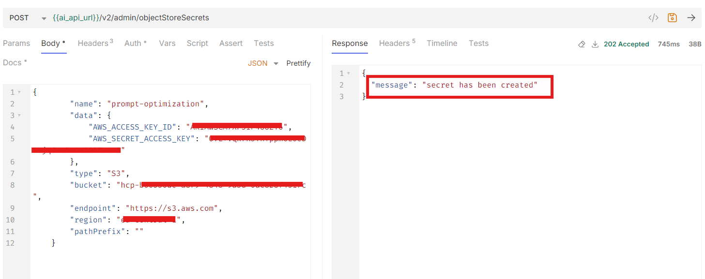

[OPTION END]

### Prepare Dataset

The dataset provides the examples used by the Prompt Optimization process to evaluate and refine your input prompt.
Each record should contain a sample input message and its corresponding expected structured JSON output, which represents the correct behavior you want the model to learn.

**Dataset structure**

Each record must include:

    - input – the user message or text prompt

    - answer – the expected model response (in valid JSON format)

Example record from facility-train.json:

```json
[
    {
        "fields": {
            "input": "Subject: Urgent Assistance Required for Specialized Cleaning Services\n\nDear ProCare 
			Facility Solutions Support Team. Could you please arrange for a specialized cleaning team to 
			visit our home at the earliest convenience? We would greatly appreciate it if this could be 
			prioritized since we want to host a large party this week.\n\nThank you for your prompt 
			attention to this matter. We look forward to your swift response and assistance.\n\nBest 
			regards,\n[Sender]"
        },
        "answer": "{\"categories\": {\"routine_maintenance_requests\": false, 
		\"customer_feedback_and_complaints\": false, \"training_and_support_requests\": false, 
		\"quality_and_safety_concerns\": false, \"sustainability_and_environmental_practices\": false, 
		\"cleaning_services_scheduling\": false, \"specialized_cleaning_services\": true, 
		\"emergency_repair_services\": false, \"facility_management_issues\": false, 
		\"general_inquiries\": false}, \"sentiment\": \"neutral\", \"urgency\": \"high\"}"
    },
  {...}
]
```

**Guidelines**

 - Verify that all answer values are valid JSON strings following the schema defined in your prompt.

- Include diverse examples that represent various urgencies, sentiments, and categories.

- Save the file as facility-train.json.

- Ensure it’s available locally for upload in the next step.

### Register Dataset Artifact

The dataset used for optimization must be registered as an artifact in SAP AI Core.
Artifacts act as the link between your files stored in the object store and the services that use them during prompt optimization runs.Each artifact is uniquely identified by its name and associated with a scenario.

In this step, you’ll create an artifact entry for your prepared dataset (facility-train.json).

[OPTION BEGIN [SAP AI Launchpad]]

1. In SAP AI Launchpad, go to the Workspaces app.

2. Select the connection to your SAP AI Core runtime, and choose the resource group used for your Generative AI Hub deployment.

3. In the side navigation, expand Generative AI Hub and choose Optimizations.

4. Select the Artifacts tab and choose Add → Create.
A wizard appears to guide you through the process of uploading an artifact for optimizations.

5. Complete the wizard fields with the following information:

    - Scenario: genai-optimizations

    - Name: facility-train

    - Description: (Optional) Dataset for facility prompt optimization

6. Choose Add.

7. Select how you want to add your artifact:

**Option 1 – Upload File:**

    - Available to users with genai_manager or custom_evaluation roles only.

    - Select Upload File.

    - Add your object store (for example, default).

    - Specify a subpath, relative to the object store, e.g. datasets/.

    - Select your dataset file (facility-train.json).

    - Use the switch if you want to replace an existing file.

**Option 2 – Use Existing URL:**

    - Available for users without upload privileges.

    - Select Existing URL.

    - Add your object store.

    - Specify the relative subpath for your file in the object store.

8. (Optional) Choose Add Labels to include key-value tags that describe your artifact.

    - Use the ➕ icon to add more labels or the ✖ icon to delete labels.

    **Example:**

    - Key: prompt-optimization

    - Value: true

9. Review all information and choose Add to complete the artifact registration.

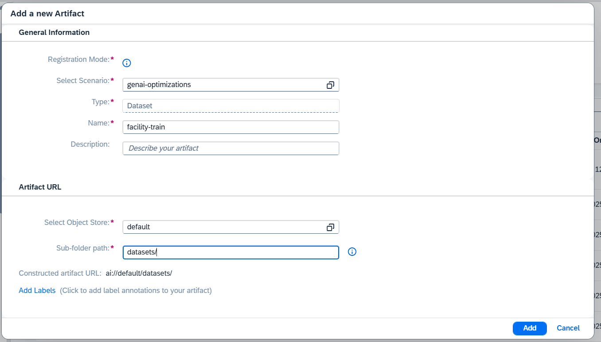

[OPTION END]

[OPTION BEGIN [Python SDK]]

You can register the dataset as an artifact programmatically using the SAP Generative AI SDK:

```python
from typing import List
import requests
import mimetypes
from urllib.parse import quote
import pathlib
import json


def validate_dataset(dataset: str | pathlib.Path | list, expected_keys: None | List[str] = None) -> bool:
    if isinstance(dataset, (str, pathlib.Path)):
        with open(dataset, "r") as f:
            try:
                dataset = json.load(f)
            except json.JSONDecodeError as e:
                raise ValueError(f"Invalid JSON in file: {e}")
    if not isinstance(dataset, list):
        raise ValueError("Dataset must be a list of dictionaries.")

def upload_dataset(secret: str,
                   local_path: str | pathlib.Path,
                   remote_path: str,
                   scenario: str,
                   description: str | None = None,
                   overwrite: bool = False,
                   expected_keys: None | List[str] = None,

                   allow_bucket_root: bool = False) -> str:
    # Validate dataset
    validate_dataset(local_path, expected_keys)
    # check if secret exists
    secrets = [r.name for r in client.ai_core_client.object_store_secrets.query().resources]
    if secret not in secrets:
        raise ValueError(f"Secret '{secret}' not found in object store secrets. Known secrets: {secrets}")

    # Check if local path exists
    remote_path = remote_path.lstrip("/")
    if "/" not in remote_path and not allow_bucket_root:
        raise ValueError(
            "Remote path must use subdirectories. Otherwise the whole bucket will be used as an input artifact. Set allow_bucket_root=True to allow this."
        )

    # URL-encode the path parameter
    path = f"{secret}/" + remote_path.lstrip("/")
    encoded_path = quote(path, safe="")
    url = f"{client.ai_core_client.base_url}/lm/dataset/files/{encoded_path}"
    params = {"overwrite": str(overwrite).lower()}

    # Prepare headers
    headers = {
        **client.request_header,
        "Content-Type": "application/octet-stream",
    }
    # Guess MIME type
    guessed_type, _ = mimetypes.guess_type(local_path)
    if guessed_type:
        headers["Content-Type"] = guessed_type

    with open(local_path, "rb") as f:
        response = requests.put(url, params=params, headers=headers, data=f)

    # Handle response
    if response.status_code == 201:
        response = response.json()
    elif response.status_code in (400, 409, 413):
        # Return error details
        raise requests.HTTPError(f"Upload failed ({response.status_code}): {response.text}")
    else:
        response.raise_for_status()
    artifact_url = "/".join(response["url"].split("/")[:-1])
    for artifact in client.ai_core_client.artifact.query().resources:
        if response["url"].startswith(artifact.url + "/"):
            return artifact, response["url"].removeprefix(artifact.url).lstrip("/")

    # Create new artifact
    path = response["url"].split("/")[-1]
    new_artifact = client.ai_core_client.artifact.create(
        name=f"{scenario}-prompt-optimization-data",
        kind=Artifact.Kind.DATASET,
        url=artifact_url,
        scenario_id=scenario,
        description="Datasets for prompt optimization" if description is None else description,
        resource_group=headers[client.ai_core_client.rest_client.resource_group_header]
    )
    return new_artifact, path

artifact, dataset_path = upload_dataset(
    secret=dataset_secret,
    local_path=dataset_local_path,
    remote_path=dataset_remote_path,
    expected_keys=base_template.placeholders,
    scenario=scenario,
    overwrite=True
)

print(f"Dataset uploaded to {artifact.url}/{dataset_path} -> Artifact ID: {artifact.id}")
```

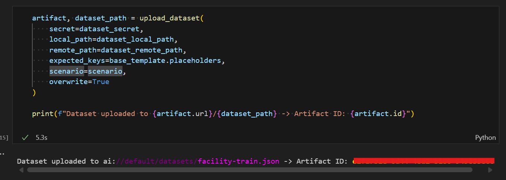

After registration, the artifact will be visible in AI Launchpad → Workspaces → Artifacts, and can be reused in future prompt optimization runs

[OPTION END]

[OPTION BEGIN [Bruno]] 

Before registering a dataset artifact in Bruno, you must upload your json file to the SAP AI Core object store using the Dataset API.
Bruno cannot upload files directly to S3; therefore, this step is required.

**Prerequisites**

    - An object store secret must already exist in your resource group.Typically, this is the default secret named **default**.

    - The Dataset API currently supports:

        - S3 object stores only

        - json file uploads

**Upload Your Dataset**

Use the Dataset API – Upload File request in Bruno:

```bash
PUT:{{ai_api_url}}/v2/lm/dataset/files/{{secretName}}/{{datasetPath}}
```

**Headers**

```json
Authorization: Bearer {{token}}
AI-Resource-Group: {{resourceGroup}}
Content-Type: text/csv
```

**Body**

Upload your .csv file directly as binary in Bruno’s Body 

Example Path Values:

    - secretName: default

    - datasetPath: dataset/facility-train.json


**Note:** 

Save the ai://… URL — you will use this when creating the dataset artifact.

**Register the Dataset Artifact**

- Click  on **Register artifact** under lm -> artifacts in bruno collection to register the artifact

```CODE
{
    "name": "facility-train",
    "kind": "dataset",
    "url": "ai://default/datasets",
    "scenarioId": "genai-optimizations"
}
```
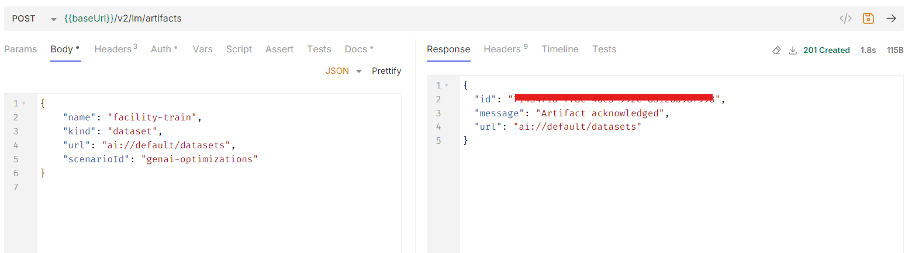

A successful response returns the artifact ID, which you’ll use later in the optimization configuration.

[OPTION END]

### Create and save the prompt template

[OPTION BEGIN [SAP AI Launchpad]]

Prompt templates define how the model interprets each dataset input.
In this step, you’ll create a structured prompt that guides the model to extract the correct fields (urgency, sentiment, and categories) from a facility-related message and return a well-formatted JSON response.
The template is registered in the Prompt Registry and later referenced by the optimization execution

#### create the Prompt Template

- In SAP AI Launchpad, go to the left-hand menu and select Generative AI Hub → Prompt Management.

- click on Templates → create


#### Define the Prompt

In the Message Blocks section:

- Add a System and user role message:
```json
system: |-
  You are a helpful assistant.

user: |-
  Giving the following message:
  ---
  {{?input}}
  ---
  Extract and return a JSON object with the following structure:
  {
    "urgency": "<one of: high, medium, low>",
    "sentiment": "<one of: positive, neutral, negative>",
    "categories": {
      "emergency_repair_services": <true/false>,
      "routine_maintenance_requests": <true/false>,
      "quality_and_safety_concerns": <true/false>,
      "specialized_cleaning_services": <true/false>,
      "general_inquiries": <true/false>,
      "sustainability_and_environmental_practices": <true/false>,
      "training_and_support_requests": <true/false>,
      "cleaning_services_scheduling": <true/false>,
      "customer_feedback_and_complaints": <true/false>,
      "facility_management_issues": <true/false>
    }
  }

  Your response must:
  - Contain only this JSON structure (no extra text).
  - Be valid JSON (parsable without errors).
  - Match the keys and value types exactly.
```

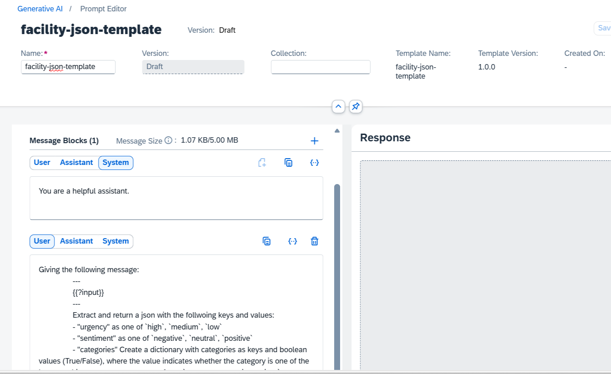

#### Save the Template

Click Save Template (top right):

- Scenario → genai-optimizations

- Name → facility-json-template

- Version → 1.0.0

Click Save to persist the template. The template will appear under your Prompt Registry and can be referenced by name in optimization jobs.

#### Verify the Template

Go to Generative AI Hub → Prompt Management → Templates and confirm:

- The template appears with the correct name, scenario, and version.

- Managed By → shows how the template is stored.

- Versioning is tracked automatically

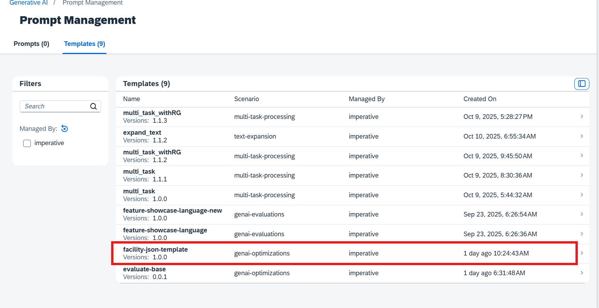

[OPTION END]

[OPTION BEGIN [Python SDK]]

In your notebook or Python environment, you can define and register the same template programmatically using the SAP Generative AI SDK.

```python
from gen_ai_hub.prompt_registry.client import PromptTemplateClient
from gen_ai_hub.prompt_registry.models.prompt_template import PromptTemplateSpec, PromptTemplate

# Initialize Prompt Registry Client
prompt_registry_client = PromptTemplateClient(proxy_client=client)

prompt_template_spec = PromptTemplateSpec(
    template=[
        PromptTemplate(
            role="system",
            content=(
                "You are a helpful assistant."
            )
        ),
        PromptTemplate(
            role="user",
            content=(
                """Giving the following message:
                ---
                {{?input}}
                ---
                Extract and return a json with the follwoing keys and values:
                - "urgency" as one of `high`, `medium`, `low`
                - "sentiment" as one of `negative`, `neutral`, `positive`
                - "categories" Create a dictionary with categories as keys and boolean values (True/False), where the value indicates whether the category is one of the best matching support category tags from: `emergency_repair_services`, `routine_maintenance_requests`, `quality_and_safety_concerns`, `specialized_cleaning_services`, `general_inquiries`, `sustainability_and_environmental_practices`, `training_and_support_requests`, `cleaning_services_scheduling`, `customer_feedback_and_complaints`, `facility_management_issues`
                Your complete message should be a valid json string that can be read directly and only contain the keys mentioned in the list above. Never enclose it in ```json...```, no newlines, no unnessacary whitespaces."""
            )
        )
    ]
)

# Create prompt template in registry
template = prompt_registry_client.create_prompt_template(
    scenario="genai-optimizations",
    name="facility-json-template",
    version="1.0.0",
    prompt_template_spec=prompt_template_spec
)

print(f"✅ Created Prompt Template with ID: {template.id}")
```
**Notes**

- The placeholder {{?input}} will automatically be replaced by each record’s input field during optimization.

- The resulting optimized prompt version will be saved back into the Prompt Registry.

- Ensure you use the same template name (facility-json-template) in the optimization configuration.

[OPTION END]

[OPTION BEGIN [Bruno]]

In Bruno, you can create a prompt template by sending a POST request to the AI Core API:

**Request: Create Prompt Template**

**URL: **

```bash
{{api_url}}/v2/lm/promptTemplates
```

**Headers:**
```
Authorization: Bearer {{access_token}}
Content-Type: application/json
```

**Body (JSON):**
```json
{
  "name": "facility-json-template",
  "version": "1.0.0",
  "scenario": "genai-optimizations",
  "spec": {
    "template": [
      {
        "role": "system",
        "content": "You are a helpful assistant."
      },
      {
        "role": "user",
        "content": "Giving the following message:\n---\n{{?input}}\n---\nExtract and return a JSON object with the following keys and values:\n- \"urgency\" as one of `high`, `medium`, or `low`\n- \"sentiment\" as one of `negative`, `neutral`, or `positive`\n- \"categories\" should be a dictionary with category names as keys and boolean values (true/false), indicating whether each category applies. The categories are: `emergency_repair_services`, `routine_maintenance_requests`, `quality_and_safety_concerns`, `specialized_cleaning_services`, `general_inquiries`, `sustainability_and_environmental_practices`, `training_and_support_requests`, `cleaning_services_scheduling`, `customer_feedback_and_complaints`, `facility_management_issues`.\nYour complete message must be a valid JSON string that can be parsed directly and should only contain the keys listed above. Never enclose it in ```json``` or include extra whitespace or newlines."
      }
    ]
  }
}
```
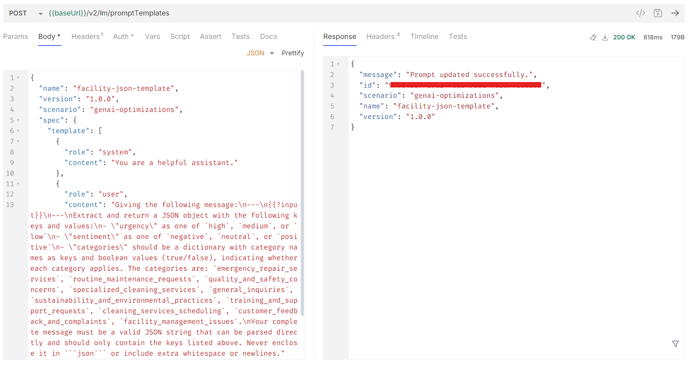

[OPTION END]

### Register an Optimization Configuration

The optimization configuration defines how prompt optimization runs — it links the dataset artifact, prompt template, model, and metric into one executable setup.
When you run the optimization, SAP AI Core uses this configuration to iteratively tune your prompt so that the chosen metric (for example, json_exact_match) is maximized.

[OPTION BEGIN [SAP AI Launchpad]]

1. In SAP AI Launchpad, open the Workspaces app.

2. Select your AI Core runtime connection and the resource group for your Generative AI Hub deployment.

3. In the side navigation, expand Generative AI Hub → Optimizations.

4. Choose Create to launch the configuration wizard

5. On the General Information screen, provide:

    - Scenario: genai-optimizations

    - Name: facility-prompt-optimization

    - Description: Configuration for facility prompt optimization

6. On the Configuration Details page:

    - Dataset: facility-train

    - Prompt Template: facility-json-template

    - Reference Model: select one of the supported base models (e.g., gpt-4o-2024-08-06).

    - Target Models: list the models to optimize for (e.g., gemini-2.5-pro--latest).

    - Metric: json_exact_match

    - Optimization Objective: maximize

7. Review your inputs and click Create.

The configuration will appear in the Optimizations → Configurations list.

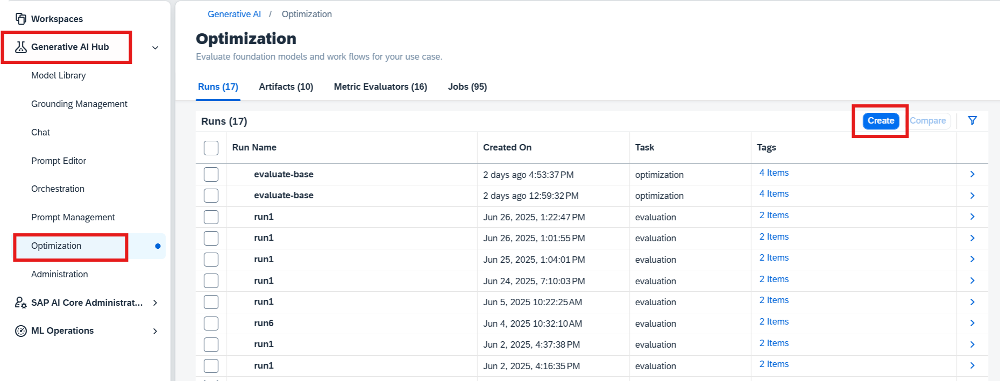

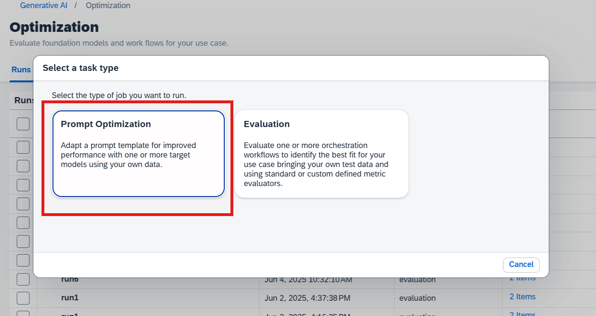

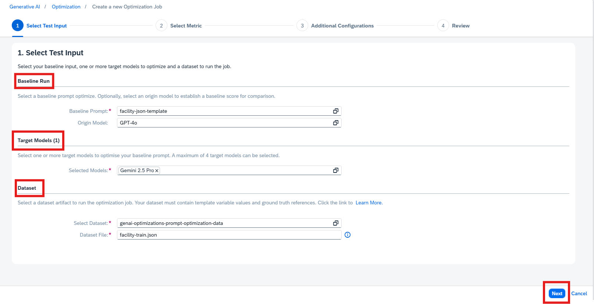

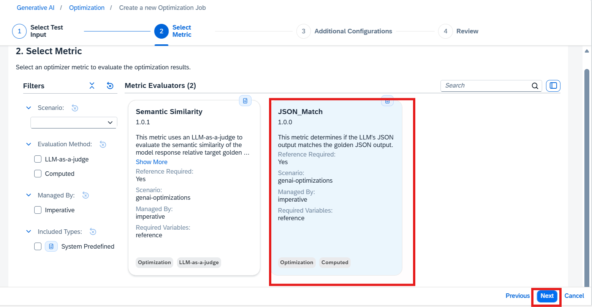

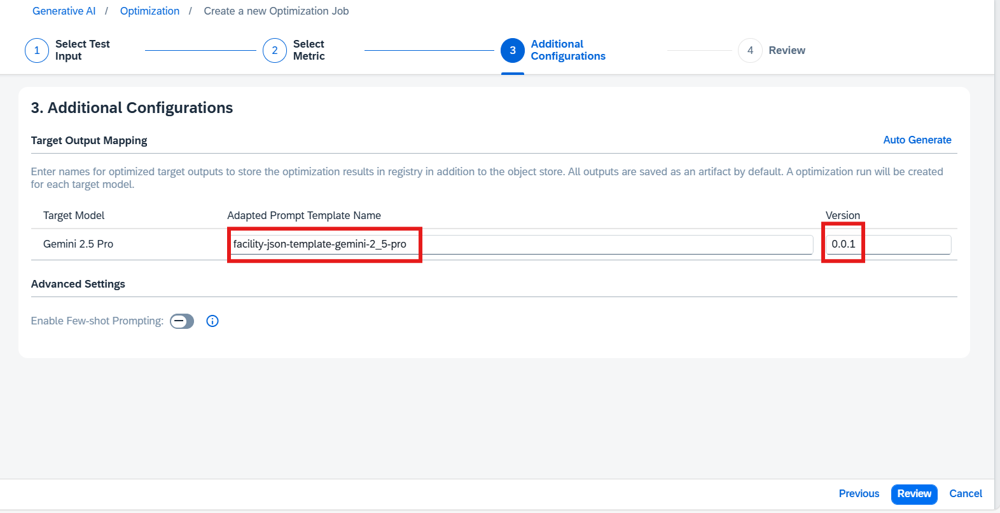

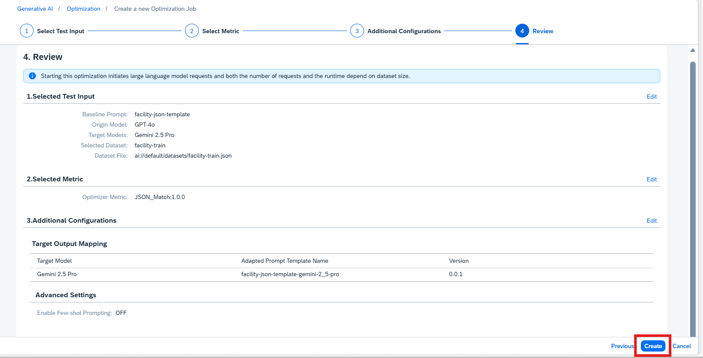

[OPTION END]

[OPTION BEGIN [Python SDK]]

You can register the same configuration programmatically in your notebook:

```Python
old_new_name_mapping = {
    "gemini-2.5-pro:001": "gemini-2.5-pro--001",
    "gpt-4o:2024-08-06": "openai/gpt-4o-2024-08-06"
}

old_new_name_mapping.update({old_new_name_mapping[k]: k for k, v in old_new_name_mapping.items()})


def create_config(metric: str,
                  reference_model: str,
                  targets: dict,
                  dataset_path: str,
                  scenario: str,
                  prompt: PromptTemplateSpec) -> str:
    assert metric in SUPPORTED_METRICS, f"Unsupported metric: {metric}. Supported metrics: {SUPPORTED_METRICS}"
    assert reference_model in SUPPORTED_MODELS, f"Unsupported reference model: {reference_model}. Supported models: {SUPPORTED_MODELS}"
    assert all(model in SUPPORTED_MODELS for model in targets.keys()), f"Unsupported target models: {targets}. Supported models: {SUPPORTED_MODELS}"
    input_parameters = [
        ParameterBinding(key="dataset", value=dataset_path),
        ParameterBinding(key="optimizationMetric", value=metric),
        ParameterBinding(key="basePrompt", value=f'{scenario}/{prompt["name"]}:{prompt["version"]}'),
        ParameterBinding(key="baseModel", value=reference_model),
        ParameterBinding(key="targetModels", value=','.join(targets.keys())),
        ParameterBinding(key="targetPromptMapping", value=",".join([f"{old_new_name_mapping[k]}={v}" for k, v in targets.items()]))
    ]
    existing_configs = client.ai_core_client.configuration.query(scenario_id='genai-optimizations', executable_ids=['genai-optimizations'])
    params = {par.key: par.value for par in input_parameters}
    for conf in existing_configs.resources:
        if {par.key: par.value for par in conf.parameter_bindings} == params:
            return conf.id

    input_artifacts = [InputArtifactBinding(key="prompt-data", artifact_id=artifact.id)]

    response = client.ai_core_client.configuration.create(
        name = "prompt-optimization-configuration", # custom name of configuration
        scenario_id = "genai-optimizations", # value from workflow
        executable_id = "genai-optimizations", # value from workflow
        resource_group = resource_group,
        parameter_bindings = input_parameters,
        input_artifact_bindings = input_artifacts
    )

    return response.id

# Create the configuration
configuration_id = create_config(
    metric=metric,
    reference_model=reference_model,
    targets=targets,
    dataset_path=dataset_path,
    scenario=scenario,
    prompt=prompt
)
print("Optimization Configuration ID:", configuration_id)
```
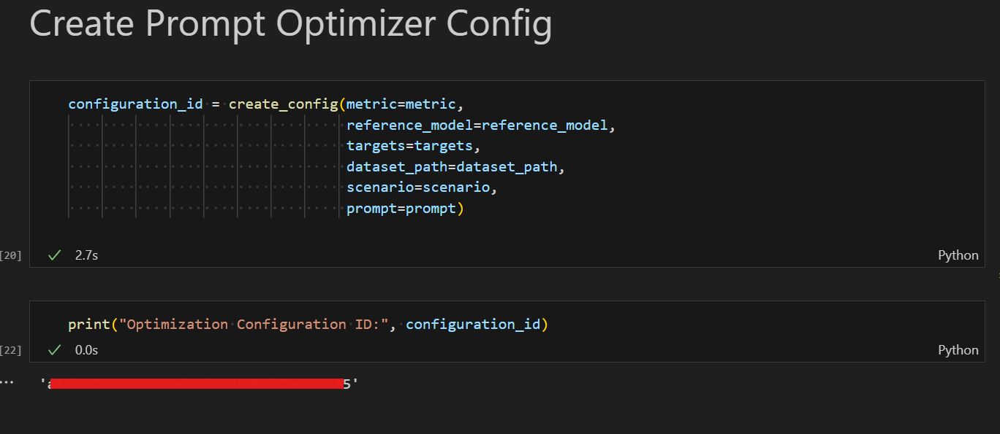

[OPTION END]

[OPTION BEGIN [Bruno]]

In Bruno, you can create a configuration by sending a POST request to the AI Core API:

**URL:**

```json
{{base_url}}/v2/lm/configurations
```
**Headers:**

```json
Authorization: Bearer {{access_token}}
Content-Type: application/json
Accept: application/json
ai-resource-group: {{resource_group}}
```

**Body (JSON):**

```json
{
  "name": "prompt-optimization-configuration",
  "scenarioId": "genai-optimizations",
  "executableId": "genai-optimizations",
  "description": "Configuration for facility prompt optimization",
  "parameterBindings": [
    { "key": "dataset", "value": "facility-train.json" },
    { "key": "optimizationMetric", "value": "JSON_Match" },
    { "key": "basePrompt", "value": "genai-optimizations/evaluate-base:0.0.1" },
    { "key": "baseModel", "value": "gpt-4o:2024-08-06" },
    { "key": "targetModels", "value": "gemini-2.5-pro:001" },
    { "key": "targetPromptMapping", "value": "gemini-2.5-pro:001=evaluate-base-gemini-2_5-pro:0.0.1" }
  ],
  "inputArtifactBindings": [
    { "key": "prompt-data", "artifactId": "<ARTIFACT_ID>" }
  ]
}
```
💡 Save the returned id — it represents your configuration and will be used in the next step to run the prompt optimization execution.

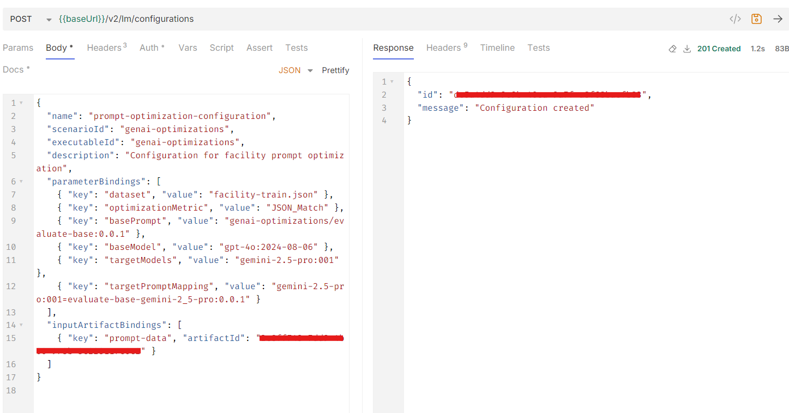

[OPTION END]

⚠️ Note: Model availability and versions (for example, gpt-4o:2024-08-06, gemini-2.5-pro:latest) may vary across SAP AI Core tenants. Always verify available models in Generative AI Hub → Models before use.
For the latest updates, refer to [SAP Note 3437766](https://me.sap.com/notes/3437766) – Model Availability and Support for Generative AI Hub
.

### Run the Prompt Optimization Execution

After registering the optimization configuration, the next step is to execute the optimization run.
This execution launches the prompt optimization workflow in SAP AI Core, which iteratively refines your prompt using the specified dataset and metric.
When the execution completes, the optimized prompt and results will be stored automatically in the prompt registry and object store.

[OPTION BEGIN [SAP AI Launchpad]]

Once you complete Review your inputs and click Create in the Register an Optimization Configuration step, the Optimization job starts automatically.

After the job reaches Completed status, you can inspect logs, review evaluation metrics, and view the optimized prompt details.

[OPTION END]

[OPTION BEGIN [Python SDK]]

In your notebook, execute the optimization programmatically using the SDK:

```Python
response = client.ai_core_client.execution.create(
    configuration_id = configuration_id, # Change this value.
    resource_group = resource_group
)

execution_id = response.id
print('Execution started with ID:', execution_id)
```
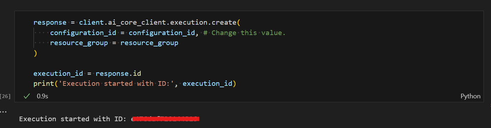

When the execution completes, the optimized prompt is stored in the Prompt Registry and the metrics are stored in the ML Tracking Service.

[OPTION END]

[OPTION BEGIN [Bruno]]

You can also trigger the optimization execution using Bruno by sending the following API request.

**URL:**

```bash
{{base_url}}/v2/lm/executions
```

**Headers:**

```
Authorization: Bearer {{access_token}}
Content-Type: application/json
Accept: application/json
ai-resource-group: {{resource_group}}
```

**Body (JSON):**

```json
{
  "configurationId": "<CONFIGURATION_ID>"
}
```

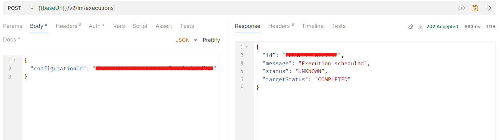

[OPTION END]

### Monitor and View Optimization Progress

After triggering the prompt optimization execution, you can monitor the progress and verify its status in real time.
Monitoring helps ensure that your run completes successfully and allows you to access intermediate and final optimization results.

[OPTION BEGIN [SAP AI Launchpad]]

- Navigate to Generative AI Hub → ML operations in your connected workspace.

- Open the Executions tab to view all recent prompt optimization runs.

- Each execution displays:

    - Execution ID – unique identifier for the run.

    - Status – shows Pending, Running, Succeeded, or Failed.

    - Start/End Time – indicates when the job started and finished.

- Select a specific execution to open the Logs tab.

    - Review live logs to check model mapping, prompt upload, and metric evaluation progress.

    - A “completed” message indicates the optimization finished successfully.

Once the execution succeeds, proceed to view the generated optimized prompt and metric results in the following step.

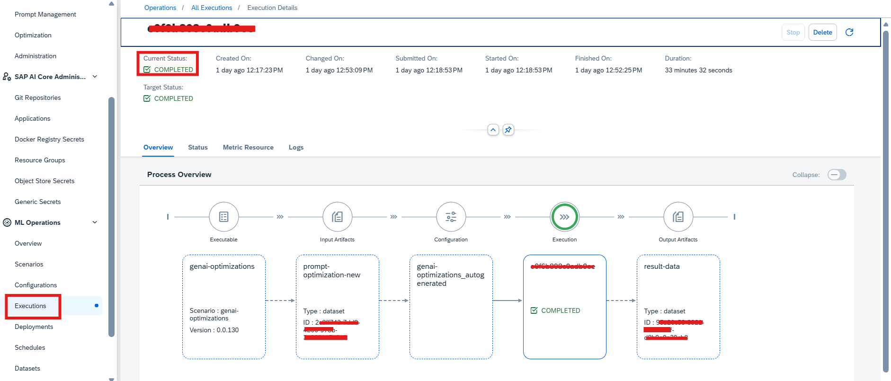

[OPTION END]

[OPTION BEGIN [Python SDK]]

Use the SDK to programmatically monitor the status of your optimization execution.

```Python
# Query latest executions
executions = client.ai_core_client.execution.query(scenario_id="genai-optimizations")

for e in executions.resources:
    print(f"Execution ID: {e.id}, Status: {e.status}, Created At: {e.created_at}")

# Get detailed information about a specific execution
execution_id = execution_id
execution_details = client.ai_core_client.execution.get(execution_id)
print(execution_details)
```
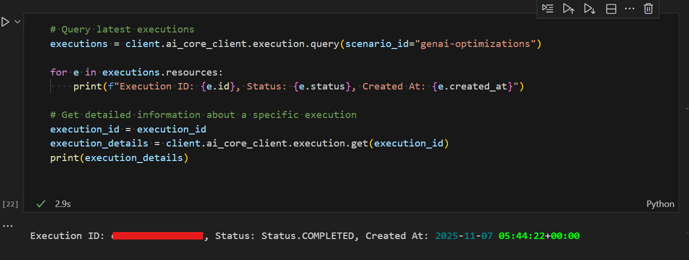

[OPTION END]

[OPTION BEGIN [Bruno]]

Use the GET executions request to fetch all executions under your resource group:

**URL**
```bash
GET {{baseurl}}/v2/lm/executions
```
**Headers:**

```json
Authorization: Bearer {{access_token}}
ai-resource-group: {{resource_group}}
```
The response will include the latest execution details such as:

```json
{
  "id": "<EXECUTION ID>",
  "status": "COMPLETED",
  "scenarioId": "genai-optimizations",
  "configurationId": "<CONFIGUARTION ID>",
  "targetStatus": "COMPLETED",
  "submissionTime": "2025-11-06T06:48:53Z",
  "startTime": "...",
  "completionTime": "...",
}
```
These messages confirm a successful optimization.

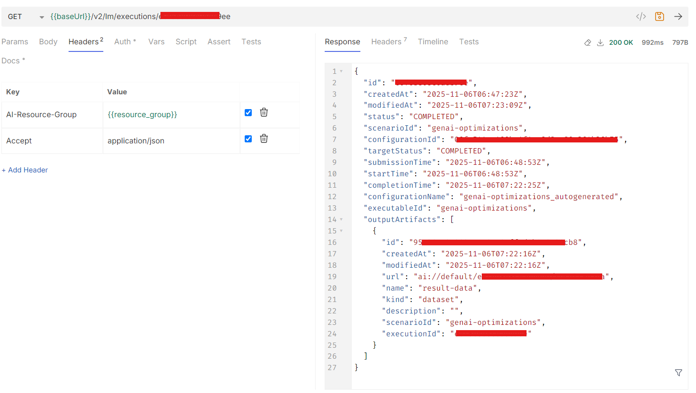

[OPTION END]

### Review Optimization Results

Once the prompt optimization execution completes successfully, the system generates an optimized version of your prompt and stores it in the Prompt Registry.
You can review the optimization results, inspect metrics, and compare the base and optimized prompts to understand how performance has improved.

[OPTION BEGIN [SAP AI Launchpad]]

- Navigate to Generative AI Hub → ML Operations → Executions.

- Select your completed execution (status: completed).

- Under the Artifacts, review the linked optimized prompt and result files stored in the Object Store.

- Next, go to Prompt Management under Generative AI Hub and search for the newly created optimized prompt.

    Example: evaluate-base-gemini-2_5-pro:0.0.1

- You can open the prompt entry to review the prompt structure, version, and metadata, including the metric used during optimization.

- To view detailed metric scores, navigate to the Optimization under Generative AI Hub → Runs, click on any Run name which was executed recently.

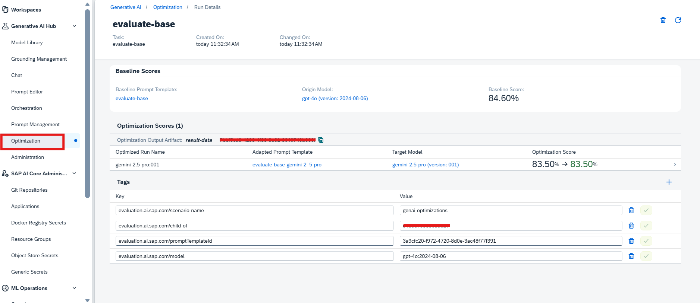

[OPTION END]

[OPTION BEGIN [Python SDK]]

Use the SDK to programmatically fetch and analyze your optimization results.

```Python
result = fetch_results(execution_id)
print_result(result)
```

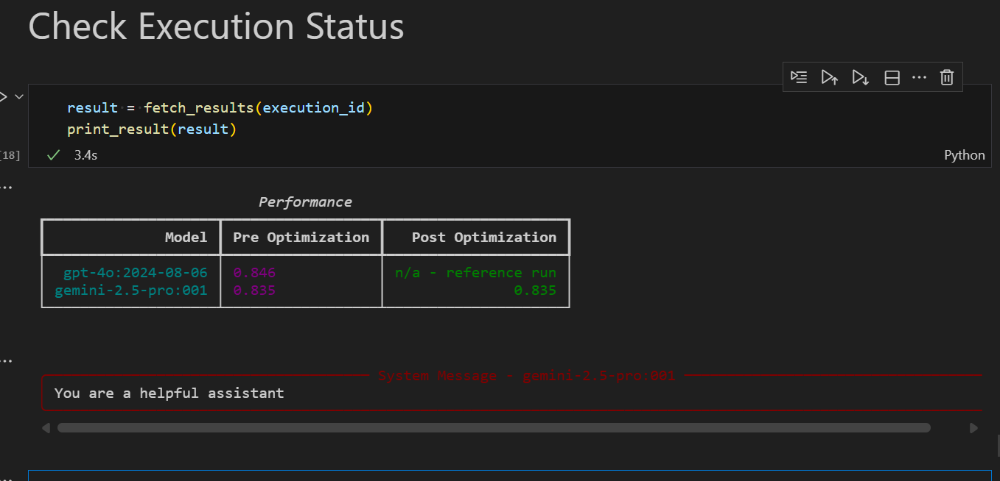

[OPTION END]

[OPTION BEGIN [Bruno]]

Use the GET executions by ID request to review the output of your specific optimization execution:

**URL**
```bash
GET {{baseUrl}}/v2/lm/metrics?tagFilters=evaluation.ai.sap.com/child-of={evaluation-id}
```
**Headers:**
```json
Authorization: Bearer {{access_token}}
ai-resource-group: {{resource_group}}
```
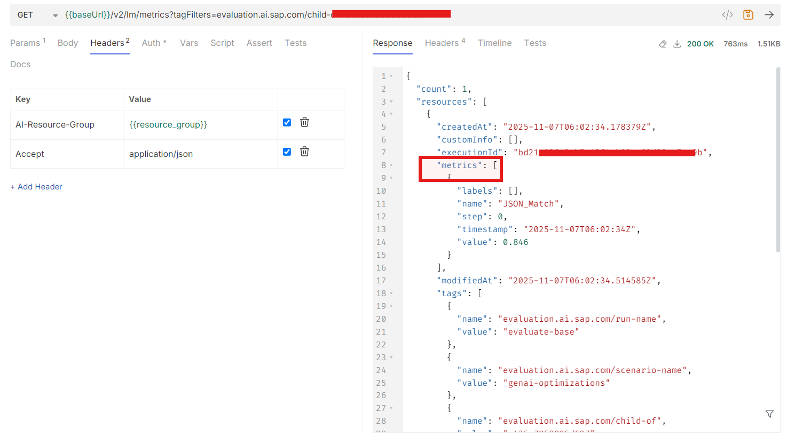

You can then retrieve the optimized prompt directly from the Prompt Templates endpoint:

**URL**
```bash
GET {{baseurl}}/v2/lm/promptTemplates
```
**Headers:**

```json
Authorization: Bearer {{access_token}}
ai-resource-group: {{resource_group}}
```

Look for the prompt name corresponding to your optimization output, for example:

```json
"name": "evaluate-base-gemini-2_5-pro",
"version": "0.0.1"
```

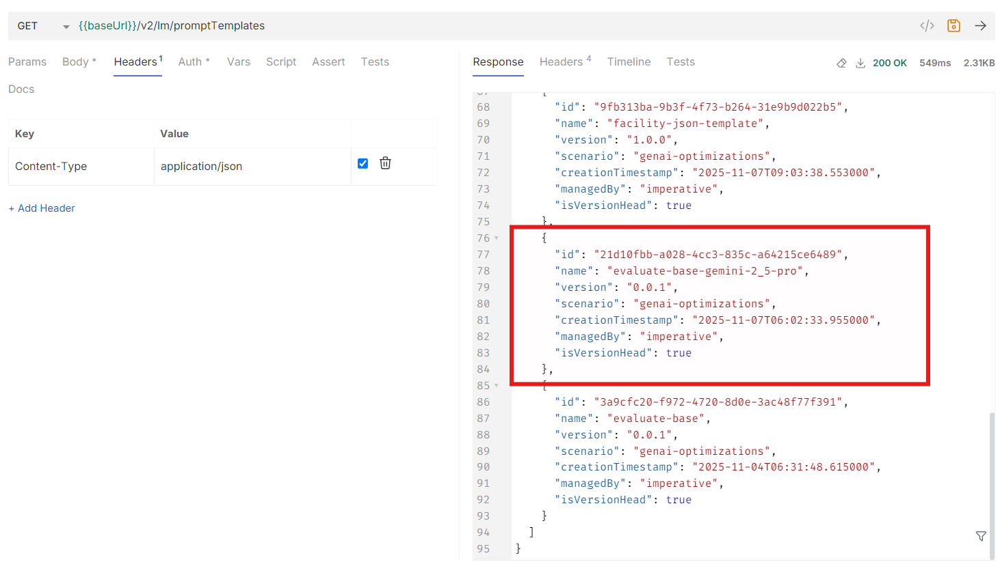

[OPTION END]

