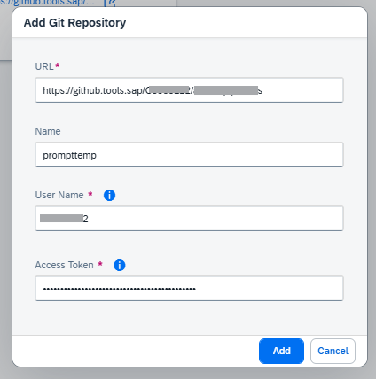
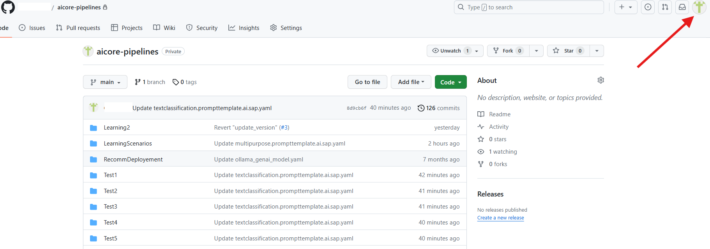
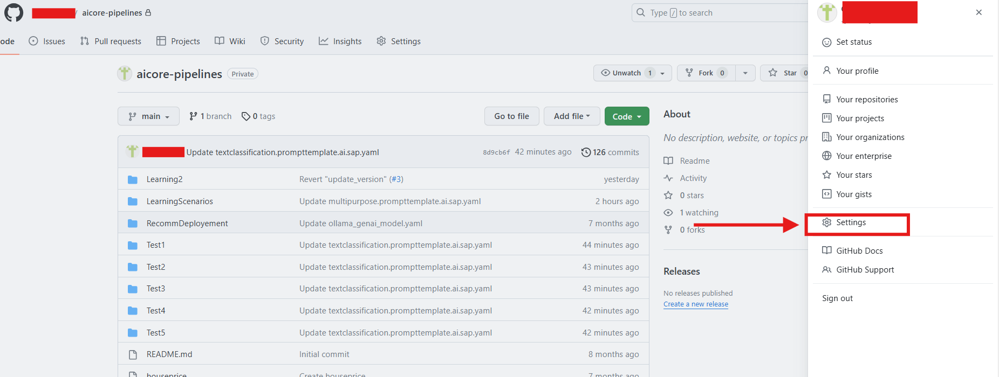
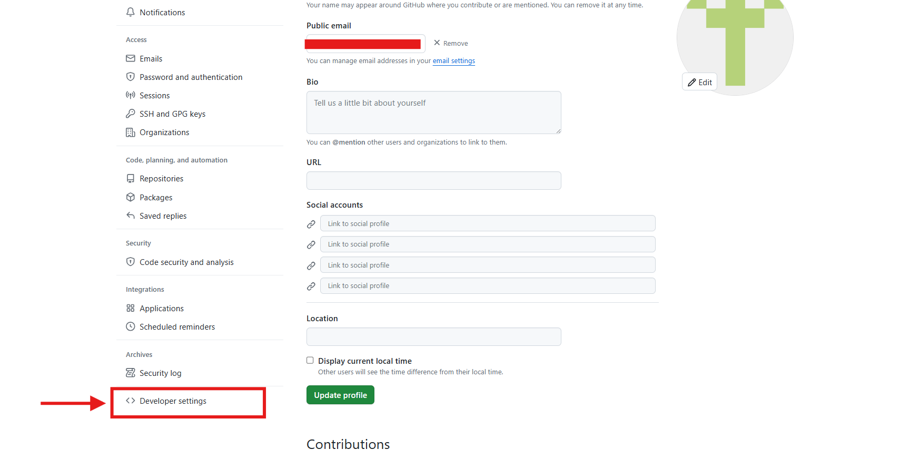
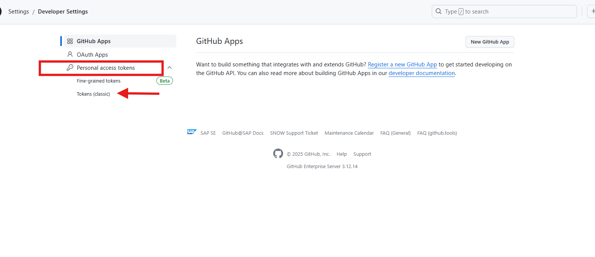
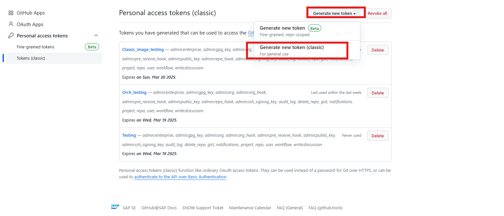
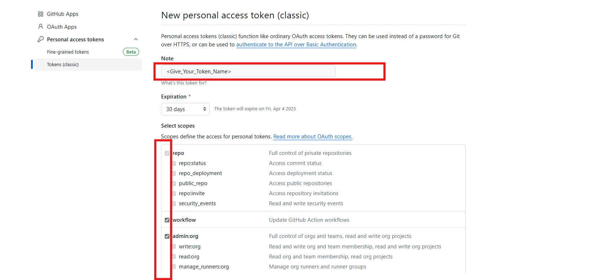
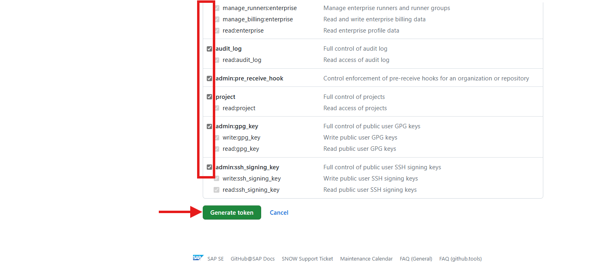
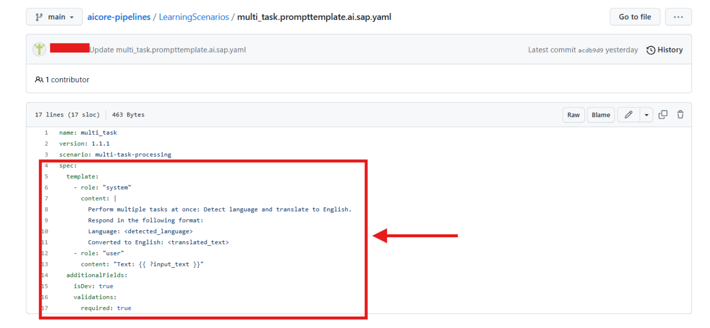

# Leveraging Prompt Registry for Seamless Orchestration
<!-- description -->  In this tutorial, we will explore the Prompt Registry feature within Generative AI Hub, focusing on how to efficiently manage and utilize prompt templates in orchestration. You will learn how to register, sync, and integrate prompt templates into the orchestration workflow, ensuring dynamic and structured interactions with AI models.

## You will learn
- How to register and sync a prompt template in Generative AI Hub.
- How to consume the registered template within an orchestration workflow.
- How to apply Grounding techniques, Data Masking, and Content Filtering to refine responses.

## Prerequisites
1. **BTP Account**  
   Set up your SAP Business Technology Platform (BTP) account.  
   [Create a BTP Account](https://developers.sap.com/group.btp-setup.html)
2. **For SAP Developers or Employees**  
   Internal SAP stakeholders should refer to the following documentation: [How to create BTP Account For Internal SAP Employee](https://me.sap.com/notes/3493139), [SAP AI Core Internal Documentation](https://help.sap.com/docs/sap-ai-core)
3. **For External Developers, Customers, or Partners**  
   Follow this tutorial to set up your environment and entitlements: [External Developer Setup Tutorial](https://developers.sap.com/tutorials/btp-cockpit-entitlements.html), [SAP AI Core External Documentation](https://help.sap.com/docs/sap-ai-core?version=CLOUD)
4. **Create BTP Instance and Service Key for SAP AI Core**  
   Follow the steps to create an instance and generate a service key for SAP AI Core:  
   [Create Service Key and Instance](https://help.sap.com/docs/sap-ai-core/sap-ai-core-service-guide/create-service-key?version=CLOUD)
5. **AI Core Setup Guide**  
   Step-by-step guide to set up and get started with SAP AI Core:  
   [AI Core Setup Tutorial](https://developers.sap.com/tutorials/ai-core-setup.html)
6. An Extended SAP AI Core service plan is required, as the Generative AI Hub is not available in the Free or Standard tiers. For more details, refer to 
[SAP AI Core Service Plans](https://help.sap.com/docs/sap-ai-core/sap-ai-core-service-guide/service-plans?version=CLOUD)
7. **Orchestration Deployment**:
    Refer to the tutorial [the basic consumption of GenAI models using orchestration](https://developers.sap.com/tutorials/ai-core-orchestration-consumption.html) and ensure at least one orchestration deployment is ready to be consumed during this process. 
8. Basic Knowledge:
    Familiarity with the orchestration workflow is recommended

### Pre-read

In this tutorial, we explore the **Prompt Registry** feature within the **Generative AI Hub**, focusing on how to efficiently manage and utilize prompt templates in orchestration pipelines.

Prompt templates allow for dynamic and structured interactions with AI models. This tutorial will guide you through the end-to-end process of integrating these templates into your orchestration workflows.
A **Prompt Registry** is a centralized system for storing, managing, and versioning prompt templates used in AI-driven applications. It allows developers and teams to reuse, modify, and track changes in prompts efficiently. This is particularly useful in large-scale AI projects where prompts need to be standardized, refined, and deployed across different models or scenarios. 

**Why Use a Prompt Registry?** 

-	**Consistency** – Ensures uniform prompts across different use cases.

-	**Version Control** – Tracks prompt iterations and allows rollback if needed.

-	**Collaboration** – Enables teams to work on prompt engineering collaboratively.

-	**Automation** – Integrates prompts seamlessly into AI workflows and CI/CD pipelines.

There are two key approaches to managing prompts in a **Prompt Registry**:

1.	**Imperative API (Direct API Control for Dynamic Prompt Management)**: The Imperative API allows you to create, update, and manage prompt templates dynamically via API calls. This approach is best suited for interactive design-time use cases, where you need to iteratively refine prompts and track their versions. Each change is explicitly made via CRUD operations, and you can manage versions manually.
2.	**Declarative API (Git-based Sync for Automated Prompt Management)**: The Declarative API, on the other hand, integrates with SAP AI Core applications and is ideal for CI/CD pipelines. Instead of managing templates through direct API interactions, you define them as YAML files in a Git repository. The system automatically syncs these templates, ensuring that updates are seamlessly reflected in the prompt registry without manual intervention.

**You will learn:**

- Declarative approach to creating a prompt template. 
- How to **register and sync** a prompt template in Generative AI Hub.
- How to **consume the registered prompt** within an orchestration workflow.
- How to apply **Grounding**, **Data Masking**, and **Content Filtering** to improve the quality, safety, and relevance of AI-generated responses.

For more information on prompt registry, refer to the official documentation:  
[Prompt Registry in SAP Generative AI Hub – Help Portal](https://help.sap.com/docs/sap-ai-core/sap-ai-core-service-guide/prompt-registry?version=CLOUD)

### Create a Prompt Template (Declarative)  

[OPTION BEGIN [AI Launchpad]]

- The declarative approach allows you to manage prompt templates using Git repositories, ensuring automatic synchronization with the Prompt Registry. Instead of making API calls to create and update templates manually, you define them in YAML files, commit them to Git, and let the system handle synchronization. 

- Create a prompt template and push it to your git repository.  The file must be named in the following format: “**your-template-name**.prompttemplate.ai.sap.yaml”. 

- YAML File Structure: Copy the below code

```YAML

name: multi_task
version: 1.1.1
scenario: multi-task-processing
spec:
  template:
    - role: "system"
      content: "{{ ?instruction }}"
    - role: "user"
      content: "Take {{ ?user_input }} from here"
  defaults:
    instruction: "default instruction"
    user_input: "default user input"
  additionalFields:
    isDev: true
    validations:
      required: true
    blockedModels:
      - name: "gpt-4"
        versions: "gpt-4-vision"
      - name: "gpt-4o"
        versions: "*"
 
```


**Note** - The defaults and additionalFields fields are optional.  The additionalFields field is unstructured and can be used to store metadata or configuration objects. Refer to the screenshot above for reference. 

- Once the YAML file is created and pushed to Git, the system automatically syncs it with the Prompt Registry. 

[OPTION END]

### Onboarding Github and Application on AI core 

[OPTION BEGIN [AI Launchpad]]

- Select on your SAP AI Core connection under Workspaces app in the SAP AI Launchpad. Under the **Git Repositories** section in **AI Core Administration app**, click **Add**. 


**Note:** If you don’t see the AI Core Administration app, check that you had selected your SAP AI Core connection from the Workspaces app. If it is still not visible then ask your SAP AI Launchpad administrator to assign roles to you so that you can access the app. 

 
**Enter your GitHub Repository Details**

Use the following information as reference:
    
-	**URL**: Paste the URL of your GitHub repository.
    - Example: **https://github.tools.sap/your-username/your-repository**

-	**Username**: Your GitHub username.
    - Example: **johndoe**

-	**Password**: Paste your GitHub Personal Access Token, Follow below steps to create the Access Token

 
 
 
 
 
 
 

**Note:** Password does not gets validated at time of Adding Github Repository its just meant to save Github Creds to AI core. Passwords gets validated at time of creating Application or when Application refreshes connection to AI core.

You will see your GitHub onboarding completed in a few seconds. As a next steps we will enable an application on AI core.

- Go to your **SAP AI Launchpad**.In the **AI Core Administration app**, click **Applications > Create**.


- Using the reference below as a guide, specify the details of your application. This form will create your application on your SAP AI Launchpad.

- Use the following information for reference:
    - 	**Application Name**: An identifier of your choice.
    - 	**Repository URL**: Your GitHub account URL and repository suffix. This helps you select the credentials to access the repository.
    - 	**Path**: The folder in your GitHub where your workflow is located. For this tutorial it is LearningScenarios.
    - 	**Revision**: The is the unique ID of your GitHub commit. Set this to **HEAD** to have it automatically refer to the latest commit.

**Click on the application you created, then select 'Sync' to synchronize your changes.**


After synchronization, navigate to **ML Operations > Scenarios** in the **SAP AI Core Launchpad** and verify your scenario by checking the name specified in your YAML file.


[OPTION END]

### Verifying and Consuming the Prompt Template

[OPTION BEGIN [AI Launchpad]]
 
Once the template is synced to the **AI Core Launchpad**, follow these steps to integrate it into your orchestration:

- Navigate to Generative AI Hub and select the Edit Workflow option. Then, disable the Grounding module.


- Click on the Template tab, click on the Select icon, and choose your synced template from the list.


- Configure Data Masking by selecting the sensitive information categories (e.g., Name, Organization) that need to be masked. sensitive information.


- Set Input Filtering thresholds for content moderation categories such as Hate, Self-Harm, Sexual, and Violence. Adjust the settings to Allow Safe and Low / Block Medium and High as needed.


- Select Model Configuration by choosing the appropriate model for orchestration.


- Set Output Filtering using the same threshold settings as input filtering to ensure consistency in moderated responses.


- Once all configurations are complete, click Test to validate your orchestration workflow.
    - Instruction: "Provide a brief explanation of SAP AI Core and its key functionalities."
    - User Input: "What are the main capabilities of SAP AI Core?"

- After entering these values, execute the test to verify the response. The system should return relevant details based on your configured prompt template and filtering settings.


[OPTION END]

### Prompt Templates for Different Use Cases and Reusability

[OPTION BEGIN [AI Launchpad]]

**In Step 4**, we experimented with a single prompt. Now, let's explore some predefined prompt templates designed for various tasks.

To proceed:
- **Go to the Git repository** and edit the YAML file.

- Keep only the following three fields **constant** in the YAML file:

    -**name**

    -**version** (Ensure you increment the version, e.g., from 1.1.1 to 1.1.2 when making updates.)

    -**scenario**

- **Copy and paste** the relevant prompt templates from below into the YAML files. Modify only the **spec** section of the **YAML** file while keeping other sections unchanged.


- **Save the file and sync** it to the application.

**NOTE:**- Please refer to Step 4 for details on modifying the YAML file in Git, syncing it with the application, and ensuring the changes are reflected correctly.

- **Test the different tasks** using these templates to see how they adapt to different use cases.

**Note:** This section provides reusable prompt templates designed for various use cases in SAP AI Launchpad. Each template follows a structured format to ensure consistent and accurate outputs. Below are the prompt templates for different NLP tasks.

#### The Prompt Template Resource

**Template for Text Expansion**

```YAML
spec:
  template:
    - role: "system"
      content: |
        Expand the following short text into a detailed explanation.
        Return output as:
        Expanded Text: {{ expanded_output }}
    - role: "user"
      content: "Text: {{ ?short_text }}"
  additionalFields:
    isDev: true
    validations:
      required: true
```
**Template for Multi-Task Processing**
```YAML
spec:
  template:
    - role: "system"
      content: |
        Perform multiple tasks at once: Detect language and translate to English.
        Respond in the following format:
        Language: <detected_language>
        Converted to English: <translated_text>
    - role: "user"
      content: "Text: {{ ?input_text }}"
  additionalFields:
    isDev: true
    validations:
      required: true
```

**Template for Spell Check and Correction**

```YAML
spec:
  template:
    - role: "system"
      content: "Correct any spelling and grammatical errors in the given text. Corrected Text: {{ corrected_output }}"
    - role: "user"
      content: "{{ ?input_text }}"
  defaults:
    input_text: "default input text"

  additionalFields:
    isDev: true
    validations:
      required: true
```

**Template for Sentiment Analysis**

```YAML
spec:
  template:
    - role: "system"
      content: |
        Classify the sentiment of the given text.
        Respond in the following format:
        Sentiment: {{ classification_output }}
    - role: "user"
      content: "Text: {{ ?input_text }}"
  additionalFields:
    isDev: true
    validations:
      required: true
```

**Template for Text Summarization**

```YAML
spec:
  template:
    - role: "system"
      content: |
        Summarize the following text.
        Respond in the following format:
        Summary: {{ summary_output }}
    - role: "user"
      content: "Text: {{ ?input_text }}"
  additionalFields:
    isDev: true
    validations:
      required: true      
```

**Template for Tone Adjustment**

```YAML
spec:
  template:
    - role: "system"
      content: |
        Translate the following input to a Corporate language.
        Respond in the following format:
        Corporate Version: {{ corporate_output }}
    - role: "user"
      content: "Text: {{ ?input_text }}"
  additionalFields:
    isDev: true
    validations:
      required: true
```

**Template for Question Answering**

```YAML
spec:
  template:
    - role: "system"
      content: |
        Answer the question based on the given context.
        Respond in the following format:
        Answer: {{ answer_output }}
    - role: "user"
      content: |
        Context: {{ ?context }}
        Question: {{ ?question }}
  additionalFields:
    isDev: true
    validations:
      required: true
```
**NOTE:** If required, you can create a new YAML file for different tasks instead of modifying the existing one. This helps maintain clarity and version control.

[OPTION END]

