# Leveraging Prompt Registry for Seamless Orchestration
<!-- description -->  In this tutorial, we will explore the Prompt Registry feature within Generative AI Hub, focusing on how to efficiently manage and utilize prompt templates in orchestration. You will learn how to register, sync, and integrate prompt templates into the orchestration workflow, ensuring dynamic and structured interactions with AI models.

## You will learn
- How to register and sync a prompt template in Generative AI Hub.
- How to consume the registered template within an orchestration workflow.
- How to apply Grounding techniques, Data Masking, and Content Filtering to refine responses.

## Prerequisites
- Setup Environment:
Ensure your instance and AI Core credentials are properly configured according to the steps provided in the initial tutorial
- Orchestration Deployment:
Ensure at least one orchestration deployment is ready to be consumed during this process. 
- Refer to [this tutorial understand the basic consumption of GenAI models using orchestration.](https://developers.sap.com/tutorials/ai-core-orchestration-consumption.html)
- Basic Knowledge:
Familiarity with the orchestration workflow is recommended

### Prompt Registry

[OPTION BEGIN [AI Launchpad]]

A **Prompt Registry** is a centralized system for storing, managing, and versioning prompt templates used in AI-driven applications. It allows developers and teams to reuse, modify, and track changes in prompts efficiently. This is particularly useful in large-scale AI projects where prompts need to be standardized, refined, and deployed across different models or scenarios. 

**Why Use a Prompt Registry?** 

•	**Consistency** – Ensures uniform prompts across different use cases.
•	**Version Control** – Tracks prompt iterations and allows rollback if needed.
•	**Collaboration** – Enables teams to work on prompt engineering collaboratively.
•	**Automation** – Integrates prompts seamlessly into AI workflows and CI/CD pipelines.

There are two key approaches to managing prompts in a **Prompt Registry**:

1.	**Imperative API (Direct API Control for Dynamic Prompt Management)**: The Imperative API allows you to create, update, and manage prompt templates dynamically via API calls. This approach is best suited for interactive design-time use cases, where you need to iteratively refine prompts and track their versions. Each change is explicitly made via CRUD operations, and you can manage versions manually.
2.	**Declarative API (Git-based Sync for Automated Prompt Management)**: The Declarative API, on the other hand, integrates with SAP AI Core applications and is ideal for CI/CD pipelines. Instead of managing templates through direct API interactions, you define them as YAML files in a Git repository. The system automatically syncs these templates, ensuring that updates are seamlessly reflected in the prompt registry without manual intervention.

Next, let's dive into the Declarative approach to creating a prompt template. 

[OPTION END]

### Create a Prompt Template (Declarative)  

[OPTION BEGIN [AI Launchpad]]

- The declarative approach allows you to manage prompt templates using Git repositories, ensuring automatic synchronization with the Prompt Registry. Instead of making API calls to create and update templates manually, you define them in YAML files, commit them to Git, and let the system handle synchronization. 

- Create a prompt template and push it to your git repository.  The file must be named in the following format: “<template-name>.prompttemplate.ai.sap.yaml”. 

- YAML File Structure: Copy the below code

```YAML

name: simple
version: 0.0.1
scenario: my-scenario
spec:
  template:
    - role: "system"
      content: "{{ ?instruction }}"
    - role: "user"
      content: "Take {{ ?user_input }} from here"
    - role: "assistant"
      content: "Output received: {{ ?grounding_output_variable }}"
  defaults:
    instruction: "default instruction"
    user_input: "default user input"
    grounding_output_variable: "default output"
  additionalFields:
    isDev: true
    validations:
      required: true
    blockedModels:
      - name: "gpt-4"
        versions: "gpt-4-vision"
      - name: "gpt-4o"
        versions: "*"
 
```
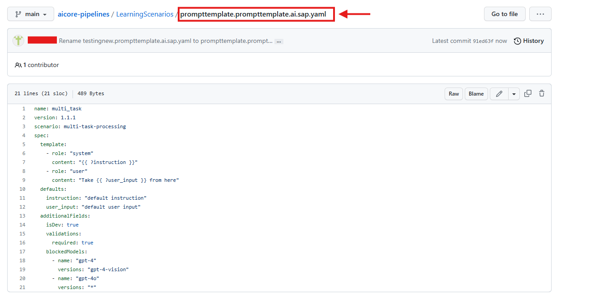
**Note** - The defaults and additionalFields fields are optional.  The additionalFields field is unstructured and can be used to store metadata or configuration objects. Refer to the screenshot above for reference. 

- Once the YAML file is created and pushed to Git, the system automatically syncs it with the Prompt Registry. 

### Onboarding Github and Application on AI core 

[OPTION BEGIN [AI Launchpad]]

- Select on your SAP AI Core connection under Workspaces app in the SAP AI Launchpad. Under the **Git Repositories** section in **AI Core Administration app**, click **Add**. 

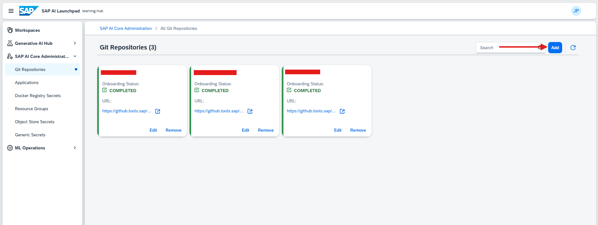

**Note:** If you don’t see the AI Core Administration app, check that you had selected your SAP AI Core connection from the Workspaces app. If it is still not visible then ask your SAP AI Launchpad administrator to assign roles to you so that you can access the app. 

- Enter your GitHub repository details (created in the previous step) in the dialog box that appears, and click **Add**.

Use the following information as reference:
    
-	**URL**: Paste the URL of your GitHub repository and add the suffix /workflows.
-	**Username**: Your GitHub username.
-	**Password**: Paste your GitHub Personal Access Token

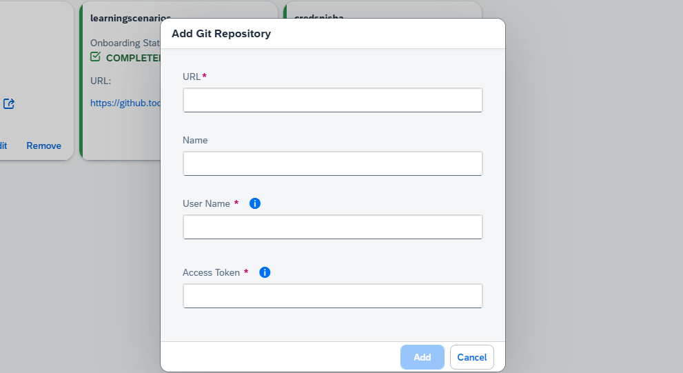

**Note:** Password does not gets validated at time of Adding Github Repository its just meant to save Github Creds to AI core. Passwords gets validated at time of creating Application or when Application refreshes connection to AI core.

You will see your GitHub onboarding completed in a few seconds. As a next steps we will enable an application on AI core.

- Go to your **SAP AI Launchpad**.In the **AI Core Administration app**, click **Applications > Create**.

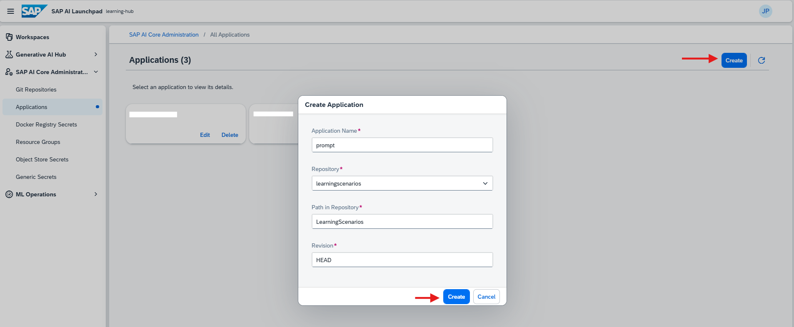

- Using the reference below as a guide, specify the details of your application. This form will create your application on your SAP AI Launchpad.

- Use the following information for reference:
    - 	**Application Name**: An identifier of your choice.
    - 	**Repository URL**: Your GitHub account URL and repository suffix. This helps you select the credentials to access the repository.
    - 	**Path**: The folder in your GitHub where your workflow is located. For this tutorial it is LearningScenarios.
    - 	**Revision**: The is the unique ID of your GitHub commit. Set this to HEAD to have it automatically refer to the latest commit.

**Click on the application you created, then select 'Sync' to synchronize your changes.**
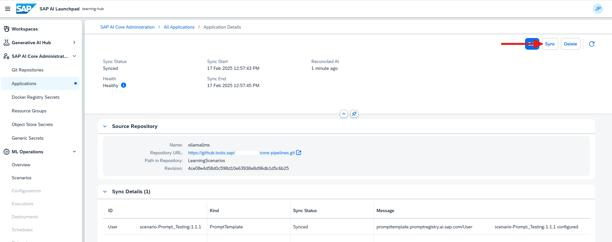

After synchronization, navigate to **ML Operations > Scenarios** in the **SAP AI Core Launchpad** and verify your scenario by checking the name specified in your YAML file.

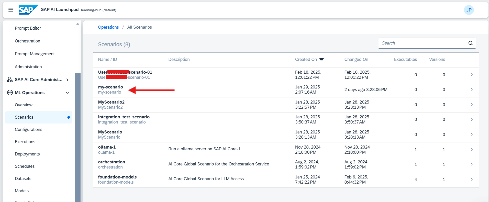

[OPTION END]

### Verifying and Consuming the Prompt Template

[OPTION BEGIN [AI Launchpad]]
 
Once the template is synced to the **AI Core Launchpad**, follow these steps to integrate it into your orchestration:

- Navigate to Generative AI Hub and select the Template tab.
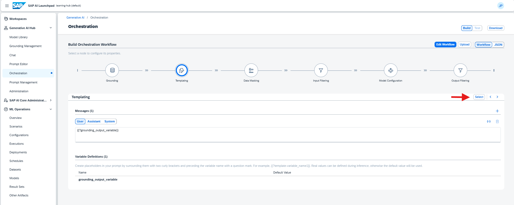

- Choose your desired template and click Select. The Templating section will update accordingly.
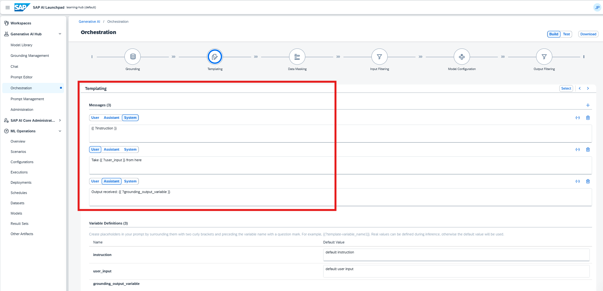

- Go to the Grounding section and set the input variable to user_input and In the Data Repositories section, click the + icon and select the required pipeline.
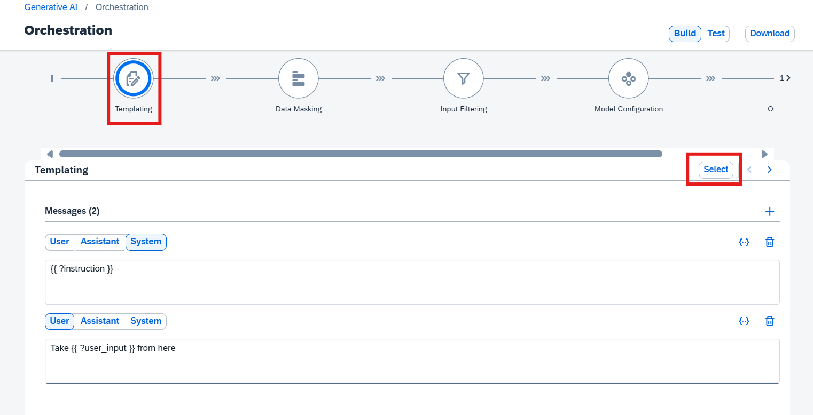

- Configure Data Masking by selecting the sensitive information categories (e.g., Name, Organization) that need to be masked. sensitive information.
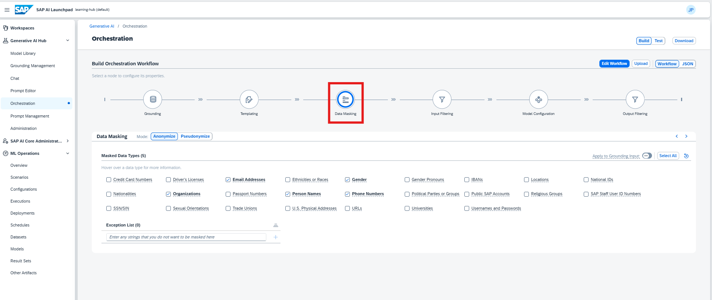

- Set Input Filtering thresholds for content moderation categories such as Hate, Self-Harm, Sexual, and Violence. Adjust the settings to Allow Safe and Low / Block Medium and High as needed.
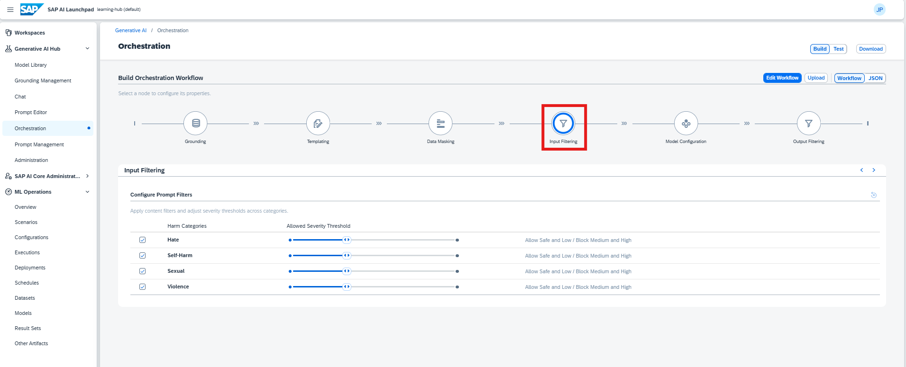

- Select Model Configuration by choosing the appropriate model for orchestration.
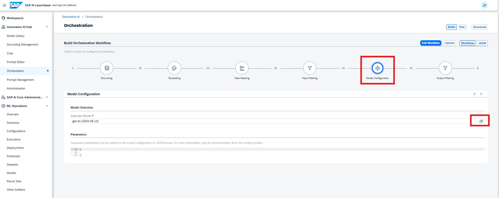

- Set Output Filtering using the same threshold settings as input filtering to ensure consistency in moderated responses.
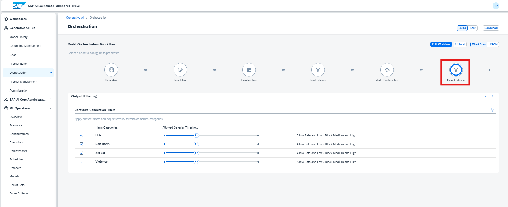

- Once all configurations are complete, click Test to validate your orchestration workflow.
  - Instruction: "Provide a brief explanation of SAP AI Core and its key functionalities."
  - User Input: "What are the main capabilities of SAP AI Core?"

- After entering these values, execute the test to verify the response. The system should return relevant details based on your configured prompt template and filtering settings.
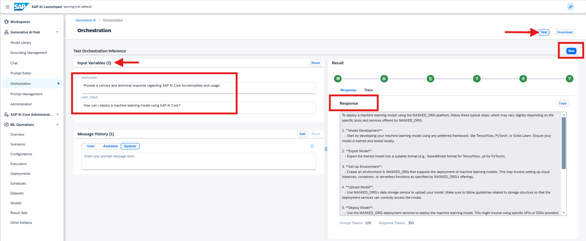

[OPTION END]

