# Strategic Prediction with SAP RPT-1: A Comprehensive Guide
<!-- description --> In this tutorial, you will learn how to use SAP RPT-1 — SAP's Relational Pretrained Transformer — to run regression and classification predictions on structured business data

## You Will Learn
- What SAP RPT-1 is, how it works, and when to use it
- How to deploy SAP RPT-1 using SAP AI Launchpad, Python SDK, and Bruno
- How to prepare your dataset and run regression and classification predictions simultaneously in a single API call
- How to run predictions programmatically using the Python SDK (`sap-ai-sdk-gen`)
- How to authenticate, build the request payload, and call the RPT-1 predict endpoint using Bruno REST API

## Prerequisites
1. **BTP Account**
   If you do not already have a commercial SAP Business Technology Platform (BTP) account, you can use **BTP Advanced Trial**.
   [Create a BTP Account](https://developers.sap.com/group.btp-setup.html)
2. **For SAP Developers or Employees**
   Internal SAP stakeholders should refer to the following documentation: [How to create BTP Account For Internal SAP Employee](https://me.sap.com/notes/3493139), [SAP AI Core Internal Documentation](https://help.sap.com/docs/sap-ai-core)
3. **For External Developers, Customers, or Partners**
   Follow this tutorial to set up your environment and entitlements: [External Developer Setup Tutorial](https://developers.sap.com/tutorials/btp-cockpit-entitlements.html), [SAP AI Core External Documentation](https://help.sap.com/docs/sap-ai-core?version=CLOUD)
4. **Create BTP Instance and Service Key for SAP AI Core**
   Follow the steps to create an instance and generate a service key for SAP AI Core. Ensure to use service plan **extended**:
   [Create Service Key and Instance](https://help.sap.com/docs/sap-ai-core/sap-ai-core-service-guide/create-service-key?version=CLOUD)
5. **AI Core Setup Guide**
   Step-by-step guide to set up and get started with SAP AI Core:
   [AI Core Setup Tutorial](https://developers.sap.com/tutorials/ai-core-genaihub-provisioning.html)
6. An **Extended** SAP AI Core service plan is required. For more details, refer to
   [SAP AI Core Service Plans](https://help.sap.com/docs/sap-ai-core/sap-ai-core-service-guide/service-plans?version=CLOUD)
7. **AI Launchpad Setup Guide**
   Step-by-step guide to set up AI Launchpad:
   [AI Launchpad Tutorial](https://developers.sap.com/tutorials/ai-launchpad-provisioning.html)
8. **Bruno API Client**
   Download Bruno from [usebruno.com/downloads](https://www.usebruno.com/downloads)
9. **SAP RPT-1 Sample Collection**
   Clone the official SAP RPT-1 Bruno collection from [https://github.com/SAP-samples/aicore-genai-samples/tree/main/genai-sample-apps](https://github.com/SAP-samples/aicore-genai-samples/tree/main/genai-sample-apps/sap-rpt-tutorials)
10. **Get Service Key**
  To obtain your service key:
    - Navigate to your BTP subaccount overview page.
    - Navigate to your BTP service instance page and Click on the SAP AI Core instance to view the service key details.
    - click the service key name to view it, then click Download to save it as **creds.json** to your local machine.

## Pre-Read

This tutorial provides a complete, practical guide to using **SAP RPT-1** — SAP's first enterprise relational foundation model — for structured business data prediction.

**SAP RPT-1 is a Relational Pretrained Transformer model that delivers accurate predictive insights from structured business data using in-context learning, allowing users to provide data records to generate instant, reliable predictions without any model training.**

The concept is straightforward: rather than training a new AI model for every business question, you send your existing data rows directly to the model. Rows with known values teach the model the pattern. Rows where you want a prediction are marked with `[PREDICT]`. The model fills them in — no pipeline, no training job, no waiting.

Unlike large language models that process text sequences, RPT-1 is designed to detect connections and dependencies across rows and columns using a table-native 2D attention scheme, with optimised processing for the unique semantics and data types found in business data.

RPT-1 supports two prediction task types — and both can be run on the same dataset in a single API call:

- **Classification** — predicts a category label and returns a confidence score (0–1) alongside each prediction. Examples: demand category, payment risk tier, sales group assignment.
- **Regression** — predicts a continuous numeric value. Examples: days late, forecast units, invoice amount.

SAP RPT-1 is available in three variants:

| Variant | Access | Best For |
|---|---|---|
| `sap-rpt-1-small` | SAP Gen AI Hub | Prototyping, high-volume, cost-sensitive workloads |
| `sap-rpt-1-large` | SAP Gen AI Hub | Production deployments requiring highest accuracy |

**Key capabilities at a glance:**

| Feature | What It Means |
|---|---|
| No model training | Send data, get predictions — no pipeline, no wait |
| Multi-target prediction | Up to 10 target columns predicted in one API call |
| `index_column` | Maps each prediction back to its source row reliably |
| Missing data resilience | Handles nulls and incomplete rows — no imputation needed |
| Semantic column awareness | Descriptive column names improve prediction accuracy |
| Ephemeral data processing | Data is never stored or used to modify model weights |

**When to use RPT-1:**

- You have structured tabular data and need predictions without a training cycle
- Your data changes frequently and retraining a traditional model is costly
- You need multiple columns predicted simultaneously
- Audit trail and confidence scores matter for your use case

**Limitations to be aware of:**

- Exclusively for tabular data — does not process text, images, or audio
- Maximum 128 prediction rows per API call
- Classification supports up to 256 classes (`sap-rpt-1-small`) or 1023 classes (`sap-rpt-1-large`)
- Does not produce natural language explanations — pair with an LLM via Orchestration if narrative output is needed

By the end of this tutorial, you will have run your first regression and classification predictions using all four access methods: **SAP AI Launchpad**, **Python SDK**, **Javascript SDK** and **Bruno (REST API)**. 

> ⚠️ **Beta notice:** The `@sap-ai-sdk/rpt` package is experimental and subject to change. Do not use in production.

Refer to the [SAP RPT-1 documentation](https://help.sap.com/docs/sap-ai-core/generative-ai/sap-rpt-1) for complete API reference information.

### The Dataset Used in This Tutorial

This tutorial uses a single local CSV file. Two prediction targets are demonstrated simultaneously in one API call.

You can access the DATASET from the GitHub repository.  

- [Download Full Dataset](https://github.com/SAP-samples/aicore-genai-samples/tree/main/genai-sample-apps/sap-rpt-tutorials)

**NOTE:** If you download the ZIP file, extract it and navigate to the **DATA** folder. Place the file in your designated location for further use.

**Payment Transaction Dataset — column reference:**

| Column | Role |
|---|---|
| `Transaction ID` | Index column — unique row identifier |
| `Customer ID`, `Customer Type`, `Industry`, `Region` | Feature columns |
| `Currency`, `Invoice Amount`, `Due Days`, `Credit Limit` | Feature columns |
| `Outstanding`, `Credit Usage`, `Relationship Years` | Feature columns |
| `Previous Delays`, `Avg Days Late`, `Payment Method` | Feature columns |
| `Economic Indicator`, `Quarter`, `Contact Attempts` | Feature columns |
| `Has Dispute`, `Dispute Amount` | Feature columns |
| **`Days Late`** | **Regression target** — numeric prediction |
| **`Risk Score`** | **Classification target** — category label + confidence |

Rows where a target column contains `[PREDICT]` are the prediction rows. All other rows with known values act as context rows that teach the model the pattern.

**Sample rows from the dataset:**

```
Transaction ID    Customer Type    Industry    Region           Currency    Invoice Amount    Days Late    Risk Score
TXN AZT67X0T      Small Business   Education   Middle East      USD         30214.02          [PREDICT]    [PREDICT]
TXN SY4HFYMZ      Individual       Healthcare  Middle East      USD         1045.84           14           Medium
TXN RWO7A9Z2      Small Business   Education   Europe           GBP         17920.85          10           Low
TXN C18O8PW7      Small Business   Education   Europe           GBP         12768.45          [PREDICT]    [PREDICT]
```

> **Note:** Rows with known `Days Late` and `Risk Score` values are context rows — the model learns from these. Rows marked `[PREDICT]` are the prediction rows the model will fill in.

### Companion Notebooks

This tutorial is accompanied by two Jupyter notebooks that provide a complete, executable version of all prediction steps covered in the Python SDK and JavaScript SDK sections. Download them from the tutorial's GitHub repository before starting the hands-on sections.

| Notebook | SDK | Runtime | Download |
|---|---|---|---|
| `rpt1_python_sdk.ipynb` | Python (`sap-ai-sdk-gen`) | Jupyter  | [Download from GitHub](#) |
| `rpt1_javascript_sdk.ipynb` | JavaScript (`@sap-ai-sdk/rpt`) | Deno Jupyter Kernel | [Download from GitHub](#) |

> **Note:** Replace the `#` placeholders above with the actual GitHub repository links once the notebooks are published. Each notebook follows the same step sequence as the corresponding section in this tutorial — credentials setup, dataset loading, context/prediction row split, model call, result parsing, and CSV export.

### Deploy SAP RPT-1

[OPTION BEGIN [AI Launchpad]]

**Step 1: Open SAP AI Launchpad.**

Log in to your SAP AI Launchpad instance. In the left navigation panel, go to **Generative AI Hub** → **Model Library**.

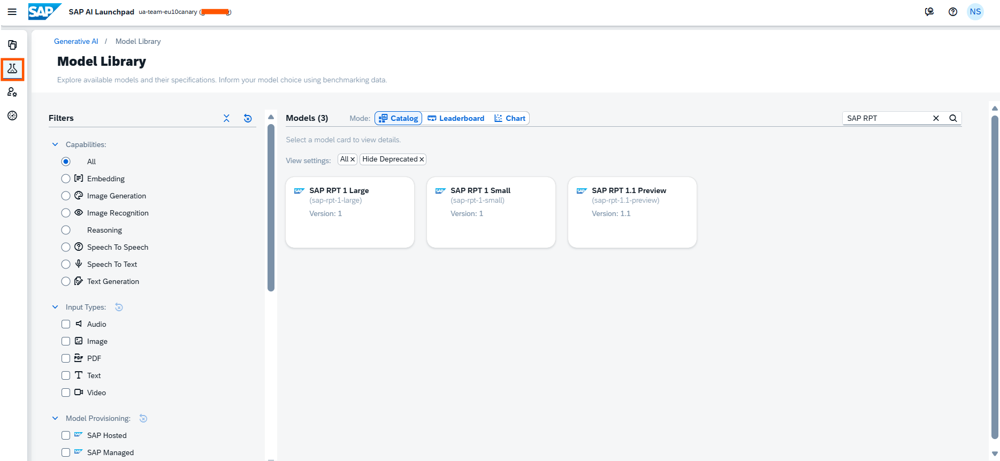

**Step 2: Find SAP RPT-1.**

Search for `sap-rpt-1` in the Model Library. You will see the commercial variants:

- `sap-rpt-1-small` — optimised for speed and high throughput
- `sap-rpt-1-large` — optimised for highest accuracy

Select the variant you want to deploy.

> **Already have a running deployment?** Skip Steps 3 and 4. Copy the existing Deployment ID from SAP AI Launchpad (Deployments tab, status must be Running) and use it directly in the Python SDK, JavaScript SDK, and Bruno sections.

**Step 3: Deploy the Model.**

Select your desired model variant and you should see a Deploy button on the model page. Click Deploy to start a model deployment. Once the deployment is created, you will see that the count increases by 1.

Monitor the **Deployment Status** page — wait until the status changes to **Running**.

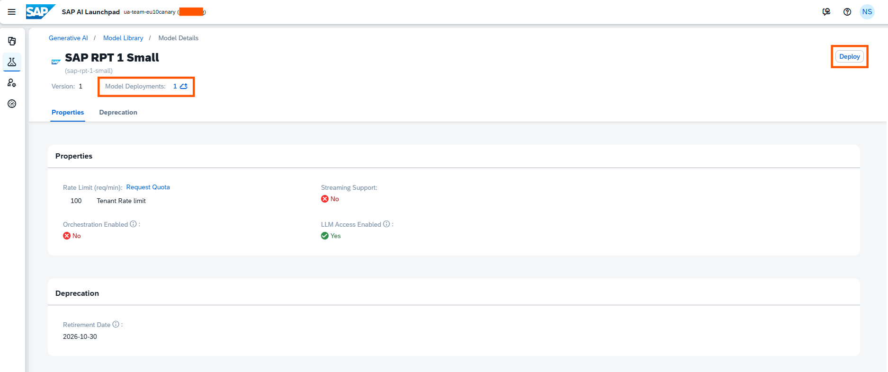

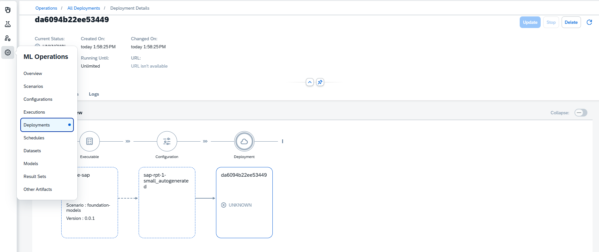

**Step 4: Copy the Deployment ID.**

Once the deployment status shows **Running**, open the deployment details and copy the **Deployment ID** (a string such as `da6094b22ee53449`). Keep this value — you will need it in the Python SDK and Bruno sections.

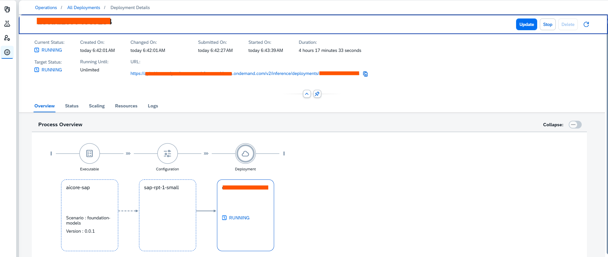

> The full predict endpoint URL follows this pattern:
> `https://<AI_API_BASE_URL>/v2/inference/deployments/<DEPLOYMENT_ID>/predict`

[OPTION END]

[OPTION BEGIN [Python SDK]]

You can also create a configuration and deployment programmatically using `ai-core-sdk`.

**Step 1: Install dependencies.**

```bash
pip install ai-core-sdk sap-ai-sdk-gen pandas tabulate
```

**Step 2: Load credentials and create the AI Core client.**

```python
import time
import json
import os
from IPython.display import clear_output
from ai_core_sdk.ai_core_v2_client import AICoreV2Client

# Load credentials from creds.json
with open('creds.json') as f:
    credCF = json.load(f)

# Set environment variables from credentials
def set_environment_vars(credCF):
    env_vars = {
        'AICORE_AUTH_URL'      : credCF['url'] + '/oauth/token',
        'AICORE_CLIENT_ID'     : credCF['clientid'],
        'AICORE_CLIENT_SECRET' : credCF['clientsecret'],
        'AICORE_BASE_URL'      : credCF['serviceurls']['AI_API_URL'] + '/v2',
        'AICORE_RESOURCE_GROUP': '<YOUR_RESOURCE_GROUP>'
    }
    for key, value in env_vars.items():
        os.environ[key] = value

# Create AI Core client instance
def create_ai_core_client(credCF):
    set_environment_vars(credCF)
    return AICoreV2Client(
        base_url      = os.environ['AICORE_BASE_URL'],
        auth_url      = os.environ['AICORE_AUTH_URL'],
        client_id     = os.environ['AICORE_CLIENT_ID'],
        client_secret = os.environ['AICORE_CLIENT_SECRET'],
        resource_group= os.environ['AICORE_RESOURCE_GROUP']
    )

ai_core_client = create_ai_core_client(credCF)
print('AI Core client created successfully')
```
> **Already have a running deployment?** Skip Steps 3 and 4. Your `creds.json` and the Deployment ID from AI Launchpad are all you need. Note the Deployment ID — you will use it in the prediction steps.

**Step 3: Create a configuration for RPT-1.**

```python
from ai_api_client_sdk.models.parameter_binding import ParameterBinding

# Define configuration parameters
scenario_id    = 'foundation-models'
executable_id  = 'aicore-sap'
config_name    = 'sap-rpt-1-small-config'  

config = ai_core_client.configuration.create(
    scenario_id   = scenario_id,
    executable_id = executable_id,
    name          = config_name,
    parameter_bindings = [
        ParameterBinding(key='modelName', value='sap-rpt-1-small')
    ]
)

print(f'Configuration created — ID: {config.id}  Name: {config_name}')
```
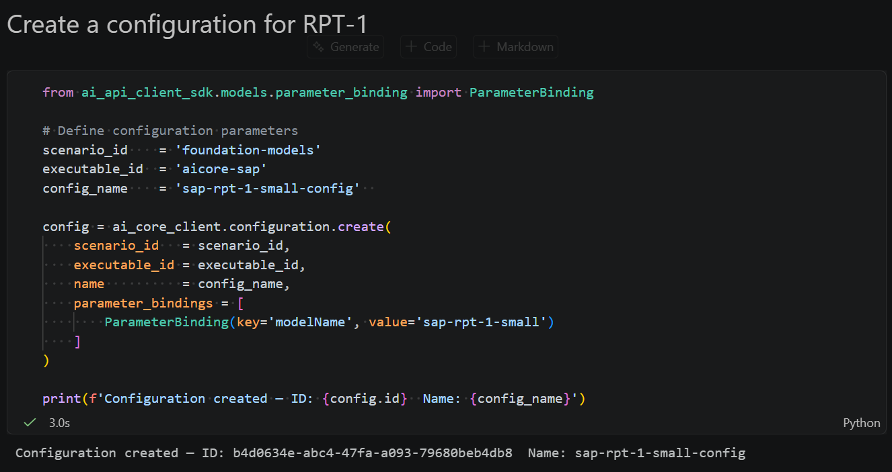

**Step 4: Create the deployment and wait until it is Running.**

```python
from ai_api_client_sdk.models.status import Status

deployment = ai_core_client.deployment.create(configuration_id=config.id)
print(f'Deployment created — ID: {deployment.id}')

# Poll until the deployment status is Running
def spinner(check_callback, timeout=300, check_every_n_seconds=10):
    start = time.time()
    while time.time() - start < timeout:
        return_value = check_callback()
        if return_value:
            return return_value
        for char in '|/-\\':
            clear_output(wait=True)
            print(f'Waiting for deployment to become ready... {char}')
            time.sleep(0.2)

def check_ready():
    updated = ai_core_client.deployment.get(deployment.id)
    return updated if updated.status == Status.RUNNING else None

ready_deployment = spinner(check_ready)
print(f'Deployment is ready — Status: {ready_deployment.status}')
print(f'Deployment ID: {ready_deployment.id}')
```
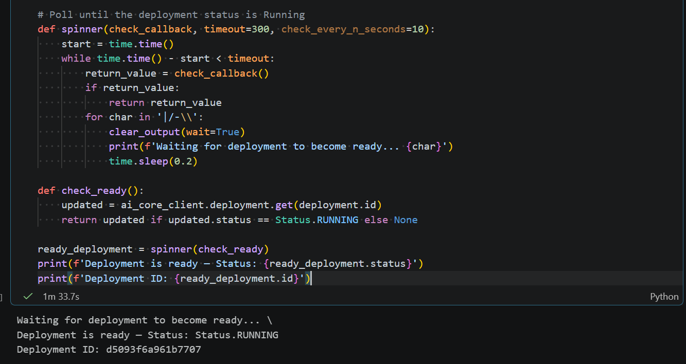

> **Note:** Copy the Deployment ID printed above — it is required in the prediction steps.

[OPTION END]

[OPTION BEGIN [JavaScript SDK]]

You can create a configuration and deployment programmatically using `@sap-ai-sdk/ai-api`.

> **Already have a running deployment?** Skip Steps 3 and 4. Add the existing Deployment ID directly into the `AICORE_SERVICE_KEY` JSON in your `.env` file as `"deploymentId": "<YOUR_DEPLOYMENT_ID>"` and proceed to the Run Predictions section.

**Step 1: Install dependencies.**

```bash
npm install @sap-ai-sdk/rpt @sap-ai-sdk/ai-api dotenv xlsx
```

**Step 2: Load credentials from the `.env` file.**

Create a `.env` file in your project folder with the full `creds.json` content as `AICORE_SERVICE_KEY`:

```
AICORE_SERVICE_KEY={"serviceurls":{"AI_API_URL":<AI_API_URL>},"clientid":<CLIENT_ID>,"clientsecret":<CLIENT_SECRET>,"url":"<AUTH_URL>","resourcegroup":<RESOURCE_GROUP>,"deploymentId":<DEPLOYMENT_ID>}
```

> **Note:** Leave `deploymentId` empty for now — it will be filled in after Step 4. Generate the single-line value in the terminal:

```typescript
import dotenv from 'npm:dotenv';
dotenv.config();

const serviceKey     = JSON.parse(process.env.AICORE_SERVICE_KEY!);
const RESOURCE_GROUP = serviceKey.resourcegroup;

console.log('Credentials loaded');
console.log('AI API URL     :', serviceKey.serviceurls.AI_API_URL);
console.log('Resource Group :', RESOURCE_GROUP);
```

> ⚠️ **Beta notice:** The `@sap-ai-sdk/rpt` package is experimental and subject to change. Do not use in production.

**Step 3: Create a configuration for RPT-1.**

```typescript
import { ConfigurationApi } from 'npm:@sap-ai-sdk/ai-api';

async function createRptConfiguration() {
  try {
    const response = await ConfigurationApi
      .configurationCreate(
        {
          name        : 'sap-rpt-1-small',
          executableId: 'aicore-sap',
          scenarioId  : 'foundation-models'
        },
        { 'AI-Resource-Group': RESOURCE_GROUP }
      ).execute();
    return response;
  } catch (error: any) {
    console.error('Configuration creation failed:', error.stack);
  }
}

const configuration = await createRptConfiguration();
console.log(configuration?.message);
console.log('Configuration ID:', configuration?.id);
```

> **Note:** `executableId: 'aicore-sap'` is the fixed value for SAP-hosted models. `scenarioId: 'foundation-models'` is the fixed scenario for foundation models on SAP AI Core. To use the large model, change the `name` to `sap-rpt-1-large`.

**Step 4: Create the deployment and wait until Running.**

```typescript
import { DeploymentApi } from 'npm:@sap-ai-sdk/ai-api';
import type { AiDeploymentCreationResponse } from 'npm:@sap-ai-sdk/ai-api';

async function createRptDeployment() {
  const configurationId = configuration!.id;
  try {
    const response = await DeploymentApi
      .deploymentCreate(
        { configurationId },
        { 'AI-Resource-Group': RESOURCE_GROUP }
      ).execute();
    return response;
  } catch (error: any) {
    console.error('Deployment creation failed:', error.stack);
  }
}

const deployment = await createRptDeployment();
console.log(deployment?.message);
console.log('Deployment ID:', deployment?.id);
```

> **Important:** A new deployment takes a few minutes to become ready. Monitor the deployment status in SAP AI Launchpad under **Deployments** and wait until the status shows **Running** before running prediction steps.
> Once Running, copy the Deployment ID and update your `.env` file — add `"deploymentId": "<COPIED_ID>"` inside the `AICORE_SERVICE_KEY` JSON value.

[OPTION END]

[OPTION BEGIN [Bruno]]

This tutorial provides a purpose-built Bruno collection scoped entirely to the payment transaction use case — with the correct endpoint, dataset, and prediction configuration pre-filled. Download it and follow the steps below.

**Step 1: Download Bruno and the tutorial collection.**

1. Download and install Bruno from [usebruno.com/downloads](https://www.usebruno.com/downloads)
2. Download the tutorial Bruno collection from github link: ([SAP RPT-1 — Payment Transactions](GITHUB REPOSITORY TO BE PROVIDED ))
3. Extract the zip file to a local folder of your choice
4. In Bruno, click **Open Collection** and navigate to the extracted `SAP RPT-1 — Payment Transactions/` folder to load the collection

The collection contains four requests at the root level, executed in this sequence:

| Seq | Request | Purpose |
|---|---|---|
| 1 | `get_token` | Fetch OAuth token — auto-saves to `bearerToken` |
| 2 | `create_configuration` | Create RPT-1 model configuration — auto-saves `configurationId` |
| 3 | `create_deployment` | Deploy the model — auto-saves `deploymentId` |
| 4 | `predict_parquet` | Send parquet file and receive predictions |

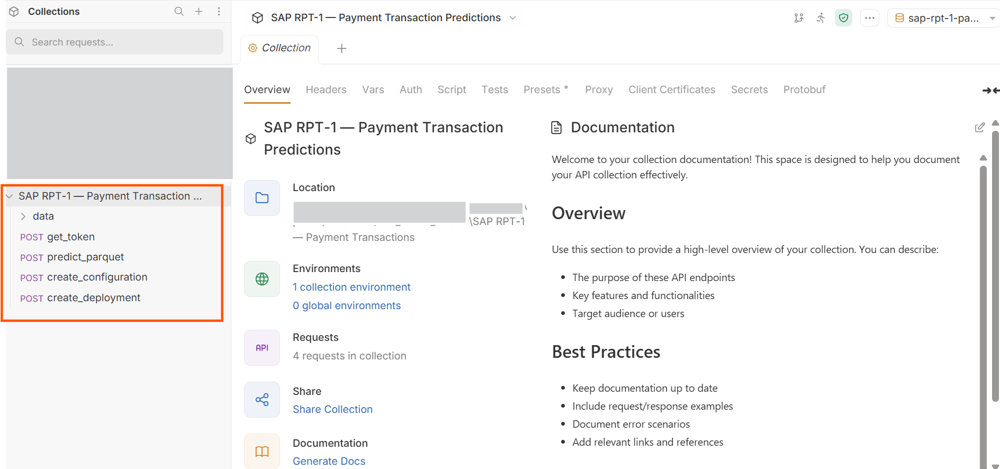

The collection contains the following structure:

```
SAP RPT-1 — Payment Transactions/
├── bruno.json                               ← Collection metadata
├── get_token.bru                            ← Step 1: Fetch OAuth token
├── create_configuration.bru                 ← Step 2: Create RPT-1 configuration
├── create_deployment.bru                    ← Step 3: Create deployment
├── predict_parquet.bru                      ← Step 4: Run predictions
├── environments/
│   └── sap-rpt-1-payment-transactions.json ← Environment variables template
└── data/
    ├── generate_parquet.py                  ← Run once to create the parquet file
    └── payment_transactions.parquet         ← Dataset (generate before first run)
```

> **Note:** All `.bru` request files are placed at the collection root level. Bruno requires request files to be either at the root or inside a folder that contains a `folder.bru` descriptor file. Placing them at the root is the simplest approach and ensures all requests are visible immediately when you open the collection.

**Step 2: Configure the environment variables.**

In Bruno, click **No Environment** in the top right and select **Configure**.

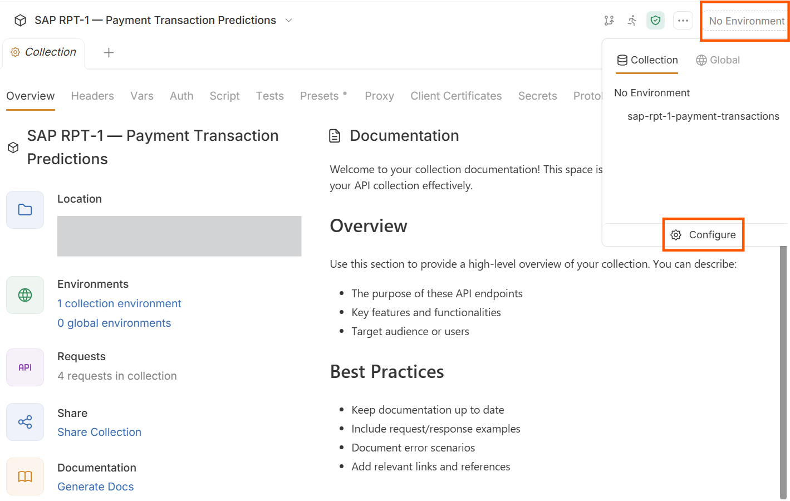

Select **sap-rpt-1-payment-transactions** from the environment list. Fill in the following values — all sourced from your `creds.json` service key file and SAP AI Launchpad:

| Variable | Source | Example value |
|---|---|---|
| `baseUrl` | `serviceurls.AI_API_URL` from `creds.json` | `https://api.ai.prod.eu-central-1.aws.ml.hana.ondemand.com` |
| `authUrl` | `url` from `creds.json` + `/oauth/token` | `https://<subdomain>.authentication.eu10.hana.ondemand.com/oauth/token` |
| `clientId` | `clientid` from `creds.json` | `sb-abc123...` |
| `clientSecret` | `clientsecret` from `creds.json` | *(paste value — stored as secret)* |
| `resourceGroup` | Your AI Core resource group | `default` |
| `configurationId` | Auto-filled after running `create_configuration` | *(auto-filled by post-response script)* |
| `deploymentId` | Auto-filled after running `create_deployment` | *(auto-filled by post-response script)* |

> **Important:** `baseUrl` and `authUrl` must be updated from their placeholder values before running any request. `baseUrl` is the raw AI API URL — do **not** append `/v2` here; the request files handle the path themselves. `authUrl` must end with `/oauth/token`.

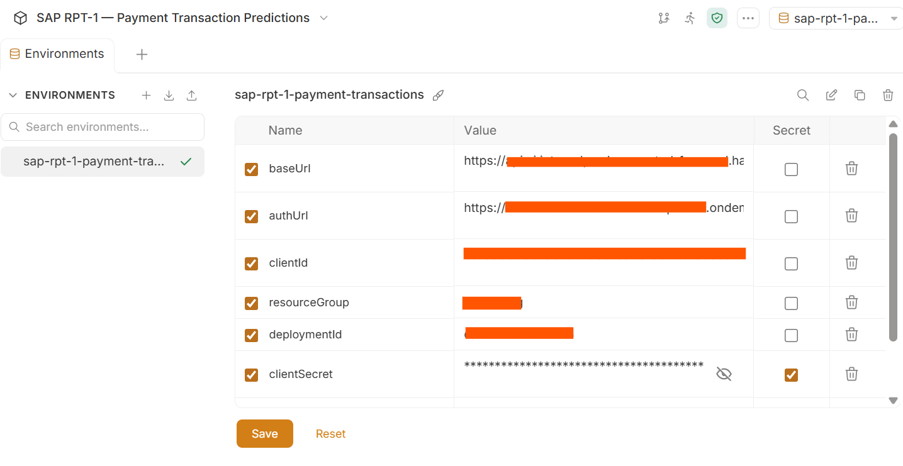

Click **Save** and select the environment from the **No Environment** dropdown.

**Step 3: Generate an OAuth token.**

Open the **get_token** request from the collection root and click **Send**.

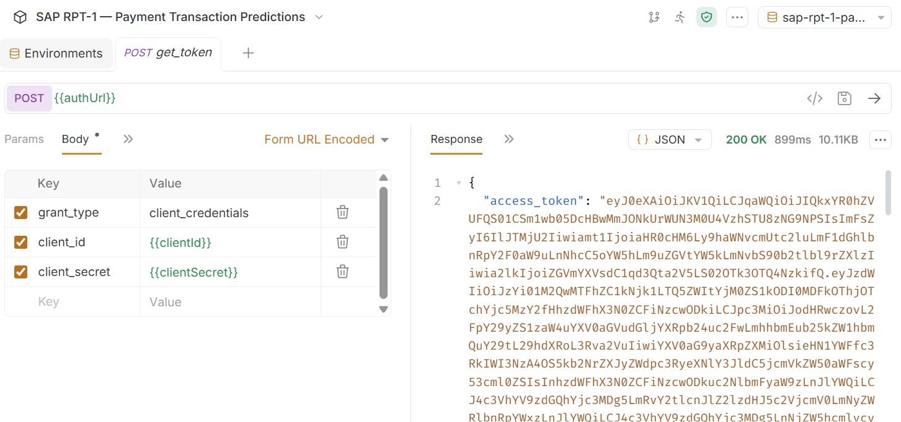

This sends a `POST` request to your `authUrl` with `grant_type=client_credentials`. A post-response script automatically writes the returned `access_token` into the `bearerToken` environment variable — no manual copy-paste required.

> **Note:** If you receive a `401 Unauthorized` error at any later step, re-run the **get_token** request to refresh the token. Tokens expire after a fixed period.

**Step 4: Create the RPT-1 configuration.**

Open the **create_configuration** request and click **Send**.

This sends a `POST` to `{{baseUrl}}/v2/lm/configurations` with the following body:

```json
{
  "name": "sap-rpt-1-small",
  "executableId": "aicore-sap",
  "scenarioId": "foundation-models",
  "versionId": "0.0.1",
  "parameterBindings": [
    { "key": "modelName",    "value": "sap-rpt-1-small" },
    { "key": "modelVersion", "value": "latest" }
  ],
  "inputArtifactBindings": []
}
```
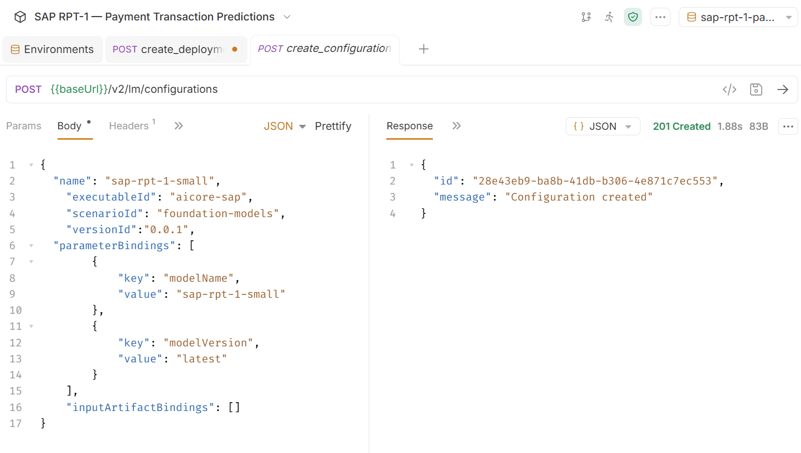

The post-response script automatically saves the returned `id` into the `configurationId`.

> **Note:** To use the large model instead, change `modelName` value to `sap-rpt-1-large` before sending. `executableId: aicore-sap` is the fixed value for SAP-hosted models — refer to SAP Note 3437766 for verification.

**Step 5: Create the deployment.**

Open the **create_deployment** request and click **Send**.

This sends a `POST` to `{{baseUrl}}/v2/lm/deployments` with the body:

```json
{
  "configurationId": "{{configurationId}}"
}
```
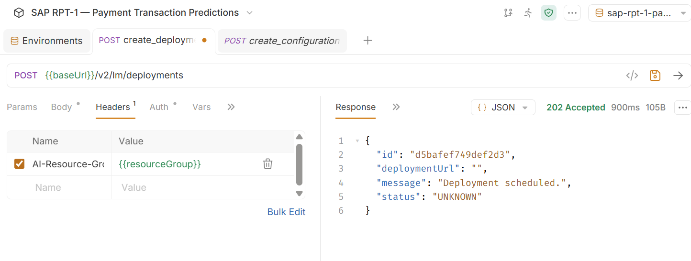

The `configurationId` from the previous step to be filled here. The post-response script saves the returned deployment `id` into the `deploymentId` environment variable.

> **Important:** A new deployment takes a few minutes to become ready. Monitor the status in SAP AI Launchpad under **Deployments** and wait until the status shows **Running** before proceeding to the predict step.

[OPTION END]
---

### Prepare the Parquet File

This step is run **once** before using any of the prediction methods. The same `payment_transactions.parquet` file is shared across Python SDK (advanced), JavaScript SDK, and Bruno — no need to create it separately for each method.

Run the following Python script from your project folder:

```python
import pandas as pd

# Read Excel
df = pd.read_excel("payment-delay-data.xlsx")

# Convert problematic columns to string
df["Days Late"] = df["Days Late"].astype(str)
df["Risk Score"] = df["Risk Score"].astype(str)

# Save as Parquet
df.to_parquet("payment_transactions.parquet", index=False)

print("Parquet file generated successfully!")
```

**Requirements:** `pip install pandas pyarrow openpyxl`

> **Why Parquet?** Parquet preserves column data types natively and is significantly more compact than CSV for large datasets. It is the required format for the `/predict_parquet` endpoint used by the JavaScript SDK and Bruno.

> **Row ordering rule:** Context rows must appear **before** `[PREDICT]` rows. The script validates this and warns if the ordering is incorrect.

---

### Run Predictions Using SAP RPT-1

With the deployment running and credentials configured, you are now ready to send prediction requests.

[OPTION BEGIN [AI Launchpad]]

SAP AI Launchpad does not currently provide a direct UI for sending RPT-1 predict payloads.

For production prediction calls, use the **Python SDK**, **Javascript SDK** or **Bruno** methods described in the tabs below.

[OPTION END]

[OPTION BEGIN [Python SDK]]

**Step 5: Load and prepare the dataset.**

```python
import pandas as pd

# Load your local CSV file — no joins or merging required
df = pd.read_excel('payment-delay-data.xlsx', dtype=str).fillna('')

# Configuration
INDEX_COLUMN  = 'Transaction ID'
TARGET_REG    = 'Days Late'    # regression target — numeric prediction
TARGET_CLS    = 'Risk Score'   # classification target — category + confidence
PREDICT_TOKEN = '[PREDICT]'
RPT_MODEL     = 'sap-rpt-1-small'  # or 'sap-rpt-1-large' for highest accuracy

print(f'Dataset shape : {df.shape}')
print(f'Columns       : {list(df.columns)}')
df.head(3)
```
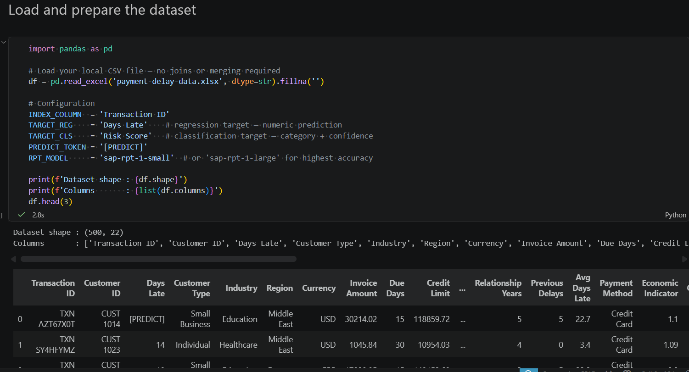

**Step 6: Separate context rows from prediction rows.**

Context rows have known values in both target columns — the model learns from these. Prediction rows contain `[PREDICT]` — the model fills these in.

```python
# Context rows — rows where both targets have known (non-PREDICT) values
context_mask = (
    (df[TARGET_REG] != PREDICT_TOKEN) & (df[TARGET_REG] != '') &
    (df[TARGET_CLS] != PREDICT_TOKEN) & (df[TARGET_CLS] != '')
)
context_df = df[context_mask].copy().reset_index(drop=True)

# Prediction rows — rows where either target contains [PREDICT]
predict_mask = (
    (df[TARGET_REG] == PREDICT_TOKEN) |
    (df[TARGET_CLS] == PREDICT_TOKEN)
)
predict_df = df[predict_mask].copy().reset_index(drop=True)

print(f'Context rows (model learns from these) : {len(context_df)}')
print(f'Prediction rows (model fills these in) : {len(predict_df)}')
```
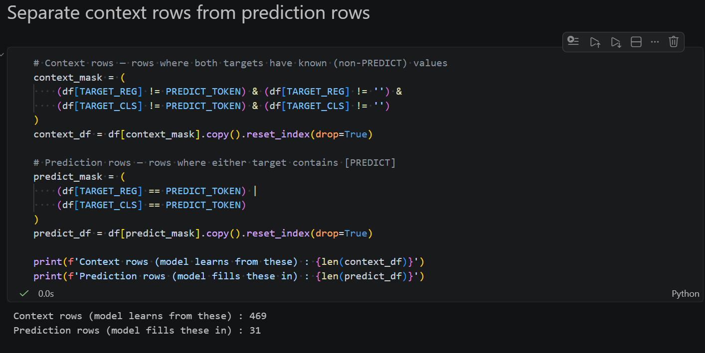

> **How many context rows do you need?** SAP's experiments show that 1,000–2,000 randomly sampled rows are sufficient to outperform narrow AI models trained on millions of rows for most enterprise use cases. For many-class classification targets, use stratified sampling to ensure all classes appear in the context rows.

**Step 5: Build and send the RPT-1 prediction request.**

Both regression and classification targets are predicted in a single API call.

```python
from gen_ai_hub.proxy.native.sap.models import RPTRequest, PredictionConfig, TargetColumn
from gen_ai_hub.proxy.native.sap.client import RPTClient

# Context rows must come first, followed by prediction rows
all_rows = context_df.to_dict(orient='records') + predict_df.to_dict(orient='records')

# Build the prediction request
body = RPTRequest(
    prediction_config=PredictionConfig(
        target_columns=[
            TargetColumn(
                name=TARGET_REG,
                task_type='regression',
                prediction_placeholder=PREDICT_TOKEN
            ),
            TargetColumn(
                name=TARGET_CLS,
                task_type='classification',
                prediction_placeholder=PREDICT_TOKEN
            )
        ]
    ),
    index_column=INDEX_COLUMN,
    rows=all_rows
)

# Call the model
client = RPTClient()
response = client.predict(body=body, model_name=RPT_MODEL)

print(f'Predictions received: {len(response.predictions)}')
```
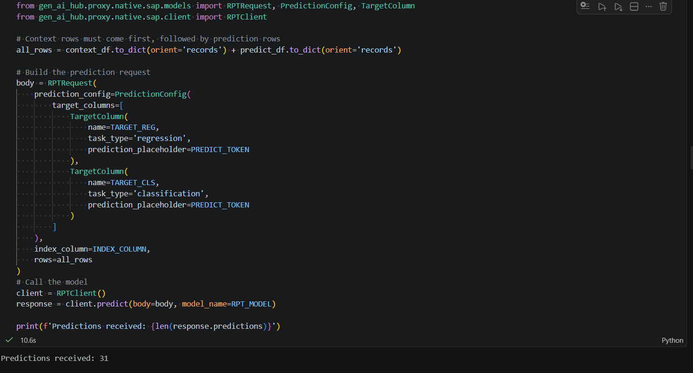

**Step 6: Parse and display the results.**

```python
from tabulate import tabulate

results = []
for pred in response.predictions:
    results.append({
        INDEX_COLUMN             : pred[INDEX_COLUMN],
        'Predicted Days Late'    : pred[TARGET_REG][0].prediction,
        'Predicted Risk Score'   : pred[TARGET_CLS][0].prediction,
        'Risk Score Confidence'  : round(pred[TARGET_CLS][0].confidence, 4)
    })

print(tabulate(results, headers='keys', tablefmt='grid'))
```
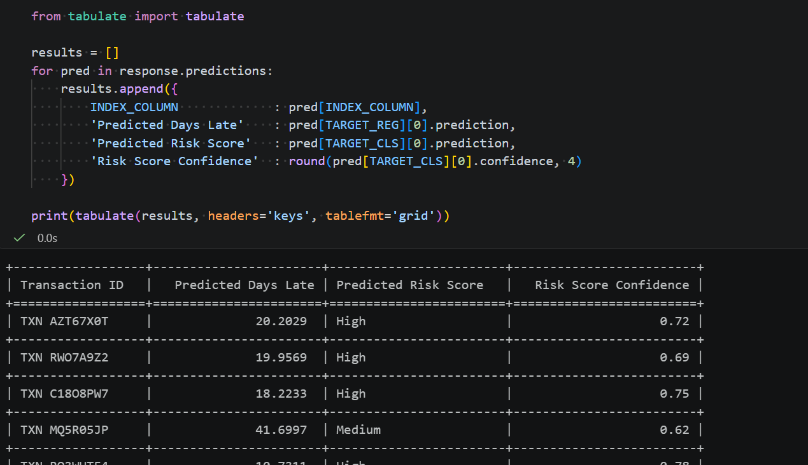

**Sample output:**

```
+------------------+-----------------------+------------------------+-------------------------+
| Transaction ID   |   Predicted Days Late | Predicted Risk Score   |   Risk Score Confidence |
+==================+=======================+========================+=========================+
| TXN AZT67X0T     |              20.2029  | High                   |                    0.72 |
+------------------+-----------------------+------------------------+-------------------------+
| TXN RWO7A9Z2     |              19.9569  | High                   |                    0.69 |
+------------------+-----------------------+------------------------+-------------------------+
| TXN C18O8PW7     |              18.2233  | High                   |                    0.75 |
+------------------+-----------------------+------------------------+-------------------------+
| TXN MQ5R05JP     |              41.6997  | Medium                 |                    0.62 |
+------------------+-----------------------+------------------------+-------------------------+
| TXN RO3WUTF4     |              10.7311  | High                   |                    0.78 |
+------------------+-----------------------+------------------------+-------------------------+

```

> **Reading the response:**
> - **Regression** — `pred[TARGET_REG][0].prediction` returns the numeric value directly. No confidence score is returned for regression targets.
> - **Classification** — `pred[TARGET_CLS][0].prediction` returns the category label. `pred[TARGET_CLS][0].confidence` returns a score between 0 and 1 — higher means more certain.

**Step 7: Export results to CSV.**

```python
results_df = pd.DataFrame(results)
results_df.to_csv('rpt1_predictions.csv', index=False)
print(f'Results exported to rpt1_predictions.csv ({len(results_df)} rows)')
```
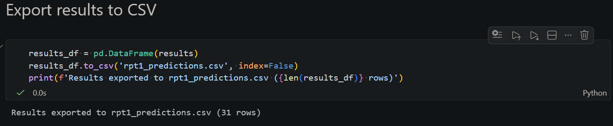

**Important Note**

Ensure your RPT-1 deployment status is **Running** in AI Launchpad before executing the prediction steps. Calls to a stopped or pending deployment will return a `404` error.

[OPTION END]

[OPTION BEGIN [JavaScript SDK]]

> ⚠️ **Beta notice:** The `@sap-ai-sdk/rpt` package is experimental and subject to change. Do not use in production environments.

**Step 1: Load credentials from the `.env` file.**

```javascript
import dotenv from 'npm:dotenv';
dotenv.config();

const serviceKey     = JSON.parse(process.env.AICORE_SERVICE_KEY!);
const RESOURCE_GROUP = serviceKey.resourcegroup;
const DEPLOYMENT_ID  = serviceKey.deploymentId;

console.log('✅ Credentials loaded');
console.log('Resource Group :', RESOURCE_GROUP);
console.log('Deployment ID  :', DEPLOYMENT_ID);
```

**Step 2: Initialise the RPT client.**

```javascript
import { RptClient } from 'npm:@sap-ai-sdk/rpt';

const client = new RptClient({
  modelName    : 'sap-rpt-1-small',
  resourceGroup: RESOURCE_GROUP
});

console.log('✅ RPT client initialised');
```

**Step 3: Load the dataset from the local Excel file.**

```javascript
import * as XLSX from 'npm:xlsx';

// Configuration — mirrors the Python notebook constants exactly
const INDEX_COLUMN  = 'Transaction ID';
const TARGET_REG    = 'Days Late';     
const TARGET_CLS    = 'Risk Score';    
const PREDICT_TOKEN = '[PREDICT]';

// Load the Excel file
const fileBuffer = await Deno.readFile('payment-delay-data.xlsx');
const workbook   = XLSX.read(fileBuffer, { type: 'buffer' });

// Read the first sheet as an array of row objects
const sheetName = workbook.SheetNames[0];
const worksheet = workbook.Sheets[sheetName];
const allRows   = XLSX.utils.sheet_to_json<Record<string, string>>(worksheet, {
  raw: false,   
  defval: ''    
});

console.log(`✅ Dataset loaded from sheet: "${sheetName}"`);
console.log(`   Total rows   : ${allRows.length}`);
console.log(`   Columns      : ${Object.keys(allRows[0]).join(', ')}`);
console.log('\nSample row (first record):');
console.log(JSON.stringify(allRows[0], null, 2));
```

**Step 4: Separate context rows from prediction rows.**

```javascript
// Context rows: both targets have known (non-PREDICT, non-empty) values
const contextRows = allRows.filter(row =>
  row[TARGET_REG] !== PREDICT_TOKEN && row[TARGET_REG] !== '' &&
  row[TARGET_CLS] !== PREDICT_TOKEN && row[TARGET_CLS] !== ''
);

// Prediction rows: either target contains [PREDICT]
const predictRows = allRows.filter(row =>
  row[TARGET_REG] === PREDICT_TOKEN ||
  row[TARGET_CLS] === PREDICT_TOKEN
);

console.log(`✅ Row split complete:`);
console.log(`   Context rows  (model learns from these) : ${contextRows.length}`);
console.log(`   Prediction rows (model fills these in)  : ${predictRows.length}`);

// Preview a prediction row
console.log('\nSample prediction row:');
console.log(JSON.stringify(predictRows[0], null, 2));

// Concatenate Context rows FIRST, prediction rows SECOND — required ordering
const rows = [...contextRows, ...predictRows];

console.log(`✅ Combined rows array built:`);
console.log(`   Total rows  : ${rows.length}`);
console.log(`   First row   : context (${rows[0][INDEX_COLUMN]})`);
console.log(`   Last row    : prediction (${rows[rows.length - 1][INDEX_COLUMN]})`);
```

**Step 5: Call RPT-1 using `predictWithoutSchema()` — core method.**

Both `Days Late` (regression) and `Risk Score` (classification) are predicted in a single API call 

```javascript
console.log(`Sending ${predictRows.length} prediction rows with ${contextRows.length} context rows...`);
console.log('Calling RPT-1 model...');

const response = await client.predictWithoutSchema({
  prediction_config: {
    target_columns: [
      {
        name: TARGET_REG,
        task_type: 'regression',
        prediction_placeholder: PREDICT_TOKEN
      },
      {
        name: TARGET_CLS,
        task_type: 'classification',
        prediction_placeholder: PREDICT_TOKEN
      }
    ]
  },
  index_column: INDEX_COLUMN,
  rows
});

console.log(`\n✅ Predictions received: ${response.predictions.length}`);
console.log('Metadata:', JSON.stringify(response.metadata, null, 2));
```

**Step 6: Parse and display the results.**

```javascript
// Parse predictions into a flat results array
const results = response.predictions.map(pred => ({
  [INDEX_COLUMN]           : pred[INDEX_COLUMN],
  'Predicted Days Late'    : pred[TARGET_REG]?.[0]?.prediction ?? null,
  'Predicted Risk Score'   : pred[TARGET_CLS]?.[0]?.prediction ?? null,
  'Risk Score Confidence'  : pred[TARGET_CLS]?.[0]?.confidence != null
    ? Number(pred[TARGET_CLS][0].confidence).toFixed(4)
    : null
}));

// Display as a table in the notebook
console.log('\n=== RPT-1 Prediction Results ===\n');
console.table(results);

// Also print a text table for easy reading
console.log('\nDetailed output:');
results.forEach(r => {
  console.log(
    `${r[INDEX_COLUMN].padEnd(20)} | ` +
    `Days Late: ${String(r['Predicted Days Late']).padEnd(10)} | ` +
    `Risk Score: ${String(r['Predicted Risk Score']).padEnd(10)} | ` +
    `Confidence: ${r['Risk Score Confidence']}`
  );
});
```

> **Reading the response:**
> - **Regression** (`Days Late`) — `.prediction` returns the numeric value directly. No confidence score for regression.
> - **Classification** (`Risk Score`) — `.prediction` returns the category label. `.confidence` is a score between 0 and 1.

**Step 7: Export results to CSV.**

```javascript
// Export results to CSV using the xlsx package's CSV utilities
const exportSheet = XLSX.utils.json_to_sheet(results);
const csvOutput   = XLSX.utils.sheet_to_csv(exportSheet);

await Deno.writeTextFile('rpt1_predictions.csv', csvOutput);

console.log(`✅ Results exported to rpt1_predictions.csv (${results.length} rows)`);
console.log('\nCSV preview (first 5 lines):');
console.log(csvOutput.split('\n').slice(0, 6).join('\n'));
```

---

**Advanced — `predictWithSchema()`: explicit column schema**

Use when column types are known. Declaring schema `as const` enables TypeScript type inference and IDE autocompletion via `PredictionData<typeof schema>`.

```javascript
import type { PredictionData } from 'npm:@sap-ai-sdk/rpt';

// Define the explicit schema for the payment transactions dataset
// Use 'as const' to enable TypeScript type inference for PredictionData<typeof schema>
const schema = [
  { name: 'Transaction ID',      dtype: 'string'  },
  { name: 'Customer ID',         dtype: 'string'  },  // identifier — keep as string
  { name: 'Customer Type',       dtype: 'string'  },
  { name: 'Industry',            dtype: 'string'  },
  { name: 'Region',              dtype: 'string'  },
  { name: 'Currency',            dtype: 'string'  },
  { name: 'Invoice Amount',      dtype: 'numeric' },
  { name: 'Due Days',            dtype: 'numeric' },
  { name: 'Credit Limit',        dtype: 'numeric' },
  { name: 'Outstanding',         dtype: 'numeric' },
  { name: 'Credit Usage',        dtype: 'numeric' },
  { name: 'Relationship Years',  dtype: 'numeric' },
  { name: 'Previous Delays',     dtype: 'numeric' },
  { name: 'Avg Days Late',       dtype: 'numeric' },
  { name: 'Payment Method',      dtype: 'string'  },
  { name: 'Economic Indicator',  dtype: 'numeric' },
  { name: 'Quarter',             dtype: 'string'  },
  { name: 'Contact Attempts',    dtype: 'numeric' },
  { name: 'Has Dispute',         dtype: 'string'  },
  { name: 'Dispute Amount',      dtype: 'numeric' },
  { name: 'Days Late',           dtype: 'string'  },  // target — string to preserve [PREDICT]
  { name: 'Risk Score',          dtype: 'string'  }   // target — string to preserve [PREDICT]
] as const;

// Typed prediction data — TypeScript infers valid column names from schema
const predictionData: PredictionData<typeof schema> = {
  prediction_config: {
    target_columns: [
      {
        name: TARGET_REG,
        task_type: 'regression',
        prediction_placeholder: PREDICT_TOKEN
      },
      {
        name: TARGET_CLS,
        task_type: 'classification',
        prediction_placeholder: PREDICT_TOKEN
      }
    ]
  },
  index_column: INDEX_COLUMN,
  rows   // same combined rows array from Step 5
};

console.log('Calling RPT-1 with explicit schema...');

const schemaResponse = await client.predictWithSchema(schema, predictionData);

console.log(`\n✅ Predictions received (with schema): ${schemaResponse.predictions.length}`);

// Parse and display results
const schemaResults = schemaResponse.predictions.map(pred => ({
  [INDEX_COLUMN]           : pred[INDEX_COLUMN],
  'Predicted Days Late'    : pred[TARGET_REG]?.[0]?.prediction ?? null,
  'Predicted Risk Score'   : pred[TARGET_CLS]?.[0]?.prediction ?? null,
  'Risk Score Confidence'  : pred[TARGET_CLS]?.[0]?.confidence != null
    ? Number(pred[TARGET_CLS][0].confidence).toFixed(4)
    : null
}));

console.log('\n=== Results (predictWithSchema) ===\n');
console.table(schemaResults);
```

---

**Advanced — `predictParquet()`: file-based prediction**

Uses the shared `payment_transactions.parquet` from the **Prepare the Parquet File** step — no re-creation needed.

```javascript
// Read payment_transactions.parquet — created once by the Python SDK notebook.
const parquetPath = 'payment_transactions.parquet';

// Verify the file exists before sending
try {
  const fileStat = await Deno.stat(parquetPath);
  console.log(`Found ${parquetPath} (${fileStat.size} bytes) — ready to send.`);
} catch {
  throw new Error(
    `${parquetPath} not found. Run the Python SDK notebook parquet export cell first.`
  );
}

const parquetBuffer = await Deno.readFile(parquetPath);
const parquetBlob   = new Blob([parquetBuffer], {
  type: 'application/vnd.apache.parquet'
});

console.log(`Sending ${parquetPath} (${parquetBuffer.byteLength} bytes) to RPT-1...`);

const parquetResponse = await client.predictParquet({
  file: parquetBlob,
  prediction_config: {
    target_columns: [
      { name: TARGET_REG, task_type: 'regression',     prediction_placeholder: PREDICT_TOKEN },
      { name: TARGET_CLS, task_type: 'classification', prediction_placeholder: PREDICT_TOKEN }
    ]
  },
  index_column: INDEX_COLUMN
  // parse_data_types defaults to true — RPT-1 infers numeric/date types from string values
});

console.log(`\n✅ Parquet predictions received: ${parquetResponse.predictions.length}`);
console.log('Metadata:', JSON.stringify(parquetResponse.metadata, null, 2));

const parquetResults = parquetResponse.predictions.map(pred => ({
  [INDEX_COLUMN]          : pred[INDEX_COLUMN],
  'Predicted Days Late'   : pred[TARGET_REG]?.[0]?.prediction ?? null,
  'Predicted Risk Score'  : pred[TARGET_CLS]?.[0]?.prediction ?? null,
  'Risk Score Confidence' : pred[TARGET_CLS]?.[0]?.confidence != null
    ? Number(pred[TARGET_CLS][0].confidence).toFixed(4)
    : null
}));

console.log('\n=== Results (predictParquet) ===\n');
console.table(parquetResults);
```

**Important Note**

Ensure your RPT-1 deployment status is **Running** in AI Launchpad before running any prediction steps.

[OPTION END]

[OPTION BEGIN [Bruno]]

The SAP RPT-1 Bruno collection supports two predict request types. This tutorial uses the **predict-parquet** approach — the recommended method for file-based datasets — which sends your data as a Parquet file via `multipart/form-data` alongside a JSON prediction configuration.

> **Why Parquet?** Parquet is a columnar file format optimised for structured data workloads. It preserves column data types natively, is significantly smaller than CSV for large datasets, and is the format expected by the `/predict-parquet` endpoint in the SAP RPT-1 Bruno collection.

---

**Step 1: Open the predict-parquet request in the Bruno collection.**

In Bruno, navigate to the **sap-rpt-1** folder inside the imported collection. Open the request named **predict parquet**.

This is a `POST` request to:

```
{{ai_api_url}}/v2/inference/deployments/{{deployment_id}}/predict-parquet
```

**Headers (pre-configured in the collection):**

| Header | Value |
|---|---|
| `Authorization` | `Bearer {{bearerToken}}` |
| `AI-Resource-Group` | `{{resource_group}}` |

> **Note:** Do **not** set `Content-Type` manually for this request. Bruno sets it automatically to `multipart/form-data` with the correct boundary when a file is attached.

---

**Step 2: Configure the multipart/form-data body.**

The `/predict-parquet` endpoint expects a `multipart/form-data` body with exactly two parts:

| Part name | Type | Value |
|---|---|---|
| `file` | File | Your `payment_transactions.parquet` file |
| `body` | Text (JSON) | The prediction configuration JSON |

In Bruno, expand the **Body** tab and select **Multipart Form**.

**Part 1 — attach the Parquet file:**
- Field name: `file`
- Type: `File`
- Click **Select File** and choose your `payment_transactions.parquet`

**Part 2 — add the prediction configuration:**
- Field name: `body`
- Type: `Text`
- Paste the following JSON:

```json
meta {
  name: predict_parquet
  type: http
  seq: 2
}

post {
  url: {{baseUrl}}/v2/inference/deployments/{{deploymentId}}/predict_parquet
  body: multipartForm
  auth: none
}

headers {
  Authorization: Bearer {{bearerToken}}
  AI-Resource-Group: {{resourceGroup}}
}

body:multipart-form {
  prediction_config: {"target_columns": [{"name": "Days Late","prediction_placeholder": "[PREDICT]","task_type": "regression"},{"name": "Risk Score","prediction_placeholder": "[PREDICT]","task_type": "classification"}]}
  index_column: Transaction ID
  parse_data_types: false
  file: @file(./data/payment_transactions.parquet)
}
```
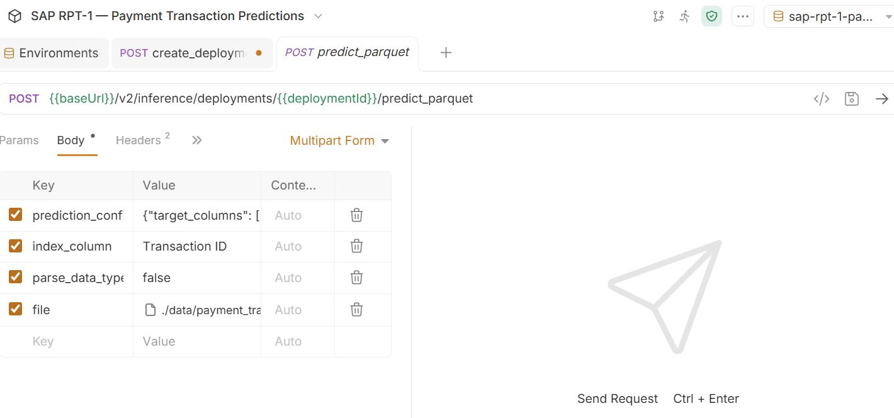

> **Payload rules:**
> - Context rows (rows with known values) must appear **before** prediction rows (rows with `[PREDICT]`) in the Parquet file — the same row ordering rule as the JSON predict endpoint
> - `task_type` accepts only `"regression"` or `"classification"`
> - The `index_column` value (`Transaction ID`) must exist as a column in your Parquet file

**Step 3: Run the request and read the response.**

Click **Send** in Bruno. A successful `200 OK` response returns predictions in this format:

```json
{
  "id": "199297b3-373f-4af7-8b8a-47b3b8f38108",
  "metadata": {
    "num_columns": 22,
    "num_predictions": 62,
    "num_query_rows": 31,
    "num_rows": 500
  },
  "predictions": [
    {
      "Days Late": [
        {
          "confidence": null,
          "confidence_interval": [
            2.04,
            39.0
          ],
          "prediction": 20.202856063842773
        }
      ],
      "Risk Score": [
        {
          "confidence": 0.72,
          "confidence_interval": null,
          "prediction": "High"
        }
      ],
      "Transaction ID": "TXN AZT67X0T"
    }
  "status": {
    "code": 0,
    "message": "ok"
  }
}
```

Follow the screenshot attached for reference.

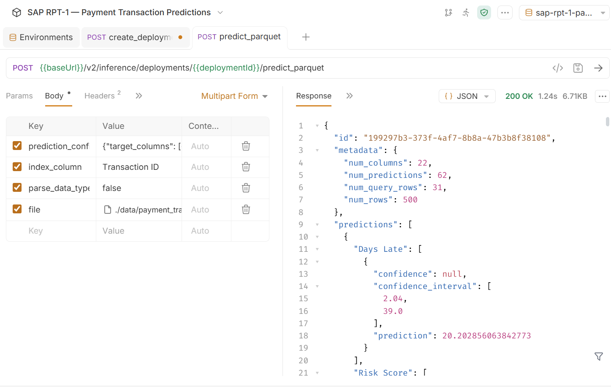

> **Reading the response:**
> - Only rows that had `[PREDICT]` in at least one target column appear in `predictions`
> - **Regression** (`Days Late`) — `predictions[i]["Days Late"][0].prediction` returns the numeric value directly. No confidence score is returned for regression targets.
> - **Classification** (`Risk Score`) — `predictions[i]["Risk Score"][0].prediction` returns the category label. `predictions[i]["Risk Score"][0].confidence` returns a score between 0 and 1 — higher means more certain.

**Important Note**

Ensure your RPT-1 deployment status is **Running** in AI Launchpad before sending the predict request. If you receive a `401 Unauthorized` error, re-run the **get_token** request to refresh your token before retrying.

[OPTION END]

### Context Row Best Practices

Regardless of which access method you use, the quality of your context rows directly affects prediction accuracy.

| Practice | Why It Matters |
|---|---|
| Use the recommended context size for your model variant | `sap-rpt-1-small` accepts up to **2048 context rows** and **100 columns** — SAP recommends **500–2,000 rows** for a balanced trade-off between prediction quality, inference speed, and cost. `sap-rpt-1-large` accepts up to **65536 context rows** and **256 columns** — SAP recommends **4,000–8,000 rows** for complex enterprise use cases requiring highest accuracy. Both variants support up to **128 simultaneous prediction rows** and **10 simultaneous target columns** per API call. For further details on model specifications, refer to [SAP Help Portal — SAP RPT-1](https://help.sap.com/docs/sap-ai-core/generative-ai/sap-rpt-1)
| Sample randomly for balanced datasets | For most cases, random sampling from your labeled data works well |
| Use stratified sampling for many-class targets | If your classification target has many distinct categories, ensure all classes appear in the context rows |
| Use recency-biased sampling for drifting data | If your data changes over time, weight sampling toward recent records |
| Use descriptive column names | The model reads column names as semantic signals — `PAYMENT_RISK_LABEL` gives more signal than `COL_7` |

---

### Troubleshooting

| Error | Likely Cause | Fix |
|---|---|---|
| `401 Unauthorized` | Token expired or wrong credentials | Re-run the OAuth token request; verify `clientId` and `clientSecret` |
| `404 Not Found` on predict endpoint | Wrong deployment ID or deployment not running | Verify deployment status is **Running** in AI Launchpad; confirm deployment ID |
| Low confidence scores (below 0.5) | Insufficient or unrepresentative context rows | Increase context rows; use stratified sampling for many-class targets |
| All rows returning the same prediction | All context rows belong to one class | Ensure context rows contain examples of all possible target categories |
| Regression predictions returning `None` | Unparseable value from model | Wrap parsing in `try/except`; check that context rows contain numeric values in the regression target column |

---

### Summary

You have now covered all four ways to work with SAP RPT-1, from the point-and-click AI Launchpad for deployment management, to the Python SDK,JavaScript SDK and Bruno REST API for full programmatic control.

| What You Did | Method |
|---|---|
| Deployed the model and obtained a Deployment ID | SAP AI Launchpad |
| Created configuration and deployment programmatically | Python SDK / JavaScript SDK / Bruno |
| Prepared shared Parquet file from Excel — used by all methods | Python (`pandas` + `pyarrow`) |
| Loaded Excel and ran regression + classification in one API call | Python SDK (`sap-ai-sdk-gen`) |
| Ran `predictWithoutSchema()`, `predictWithSchema()`, and `predictParquet()` | JavaScript SDK (`@sap-ai-sdk/rpt`, Deno) |
| Fetched an OAuth token, built the multipart payload, and called the predict endpoint | Bruno REST API |

**Useful references:**

- [SAP RPT-1 Product Page](https://www.sap.com/products/artificial-intelligence/sap-rpt.html)
- [SAP Help Portal — SAP RPT-1](https://help.sap.com/docs/sap-ai-core/generative-ai/sap-rpt-1)
- [SAP Community — Step-by-Step Getting Started Guide](https://community.sap.com/t5/artificial-intelligence-blogs-posts/sap-rpt-1-a-step-by-step-guide-on-getting-started/ba-p/14290171)
- [SAP Cloud SDK for AI — JavaScript RPT Documentation](https://sap.github.io/ai-sdk/docs/js/rpt)
- [SAP-samples/sap-rpt-samples on GitHub](https://github.com/SAP-samples/sap-rpt-samples)
- [SAP Community — Building a Hello World with AI Core](https://community.sap.com/t5/artificial-intelligence-blogs-posts/building-an-sap-rpt-1-quot-hello-world-quot-with-ai-core/ba-p/14292100)
