# Using Multimodal inputs with GPT4o for Image Recognition on SAP AI Core
<!-- description --> In this tutorial we are going to learn on how to consume GPT4o LLM on AI core deployed on SAP AI core.

## You will learn
- How to inference GPT4o with multimodal inputs on AI core

## Prerequisites
- A BTP global account
If you are an SAP Developer or SAP employee, please refer to the following links ( **for internal SAP stakeholders only** ) - 
[How to create a BTP Account (internal)](https://me.sap.com/notes/3493139)
[SAP AI Core](https://help.sap.com/docs/sap-ai-core?version=INTERNAL&locale=en-US&state=PRODUCTION)
If you are an external developer or a customer or a partner kindly refer to this [tutorial](https://developers.sap.com/tutorials/btp-cockpit-entitlements.html)
- Ai core setup and basic knowledge: [Link to documentation](https://developers.sap.com/tutorials/ai-core-setup.html)
- Ai core Instance with Standard Plan or Extended Plan

Multimodality refers to the ability of a model to process and interpret different types of inputs, such as text, images, audio, or video. In the context of GPT-4o on SAP AI Core, multimodal input allows the model to understand and generate responses that incorporate both text and visual data. This enhances the model's ability to perform complex tasks, such as scene detection, object recognition, and image analysis, by combining the strengths of both language processing and image recognition.
In this tutorial, we will demonstrate these capabilities with the help of GPT-4o, with a sample input and output, which can be replicated in future for various use cases.

### Scene Detection

In this step, we demonstrate how to use GPT-4o to describe a scene depicted in an image. By providing both text and an image URL as input, the model is able to generate a descriptive response that captures the key elements of the scene. This capability is particularly useful for applications like automated content tagging, visual storytelling, or enhancing user experience in multimedia platforms and more.

Follow the further steps to replicate scene detection using GPT-4o.

[OPTION BEGIN [curl]]

The following example shows how you can consume this generative AI model using curl. For more information about prompts, see the tutorial [Prompt LLMs in the Generative AI Hub in SAP AI Core & Launchpad Information published on SAP site](https://help.sap.com/docs/link-disclaimer?site=https%3A%2F%2Fdevelopers.sap.com%2Ftutorials%2Fai-core-generative-ai.html).

Before you use this model, please ensure that the deployment has already been created. You can create the deployment either through [generative-ai-hub-sdk or AI Launchpad](https://developers.sap.com/tutorials/ai-core-generative-ai.html#ad7ffc1e-e94e-4de4-b70f-116b038aff04).

For inferencing the model through curl,

- open Windows PowerShell (for Windows based devices)

NOTE: **do not use DOS Prompt instead of PowerShell**

- open Terminal (for macOS based devices)

Enter the following command after replacing `<deployment_url>`, `<resource-group>`, `<token>` with the values for the corresponding model.

NOTE:
 
 - for macOS based devices use  use the **bash** command

 - for windows devices, use the **PowerShell** command

 - Update the “url” to the link of the image resource you want to query the model upon and give the corresponding query in the “text” parameter.

```bash
curl -L '<deployment_url>/chat/completions?api-version=2023-05-15' \
--header 'AI-Resource-Group: <resource-group>' \
--header 'Content-Type: application/json' \
--header 'Authorization: Bearer <token>' \
--data '{
    "messages": [
      {
        "role": "user",
        "content": [
           {
              "type": "text",
              "text": "describe the scene"
           },
           {
              "type": "image_url",
              "image_url": {
                 "url": "https://raw.githubusercontent.com/SAP-samples/ai-core-samples/main/09_BusinessAIWeek/images/sceneDetection.jpg"
              }
          }
        ]
      }
    ],
    "max_tokens": 4096
}'
```

```PowerShell
curl.exe -L "<deployment_url>/chat/completions?api-version=2023-05-15" --header "AI-Resource-Group: <resource-group>" --header "Content-Type: application/json" --header "Authorization: Bearer <token>" --data '{\"messages\": [{\"role\": \"user\", \"content\": [{\"type\": \"text\",\"text\": \"describe the scene\"},{\"type\":\"image_url\",\"image_url\": {\"url\": \"https://raw.githubusercontent.com/SAP-samples/ai-core-samples/main/09_BusinessAIWeek/images/sceneDetection.jpg\"}}]}],\"max_tokens\": 4096 }'
```

After executing the above curl command, we'll get the output as follows - 

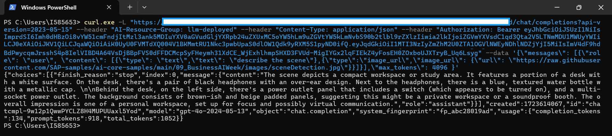

[OPTION END]

[OPTION BEGIN [Postman]]

To begin using the APIs in AI Core, we start with setting up the authentication methods.


For ease of access, we set up the region, baseUrl and deploymentUrl variables as a pre-requisite. This avoids the need of passing these values repeatedly for different scenarios. 
NOTE: the deployment URL is specific to the model we intend to use.

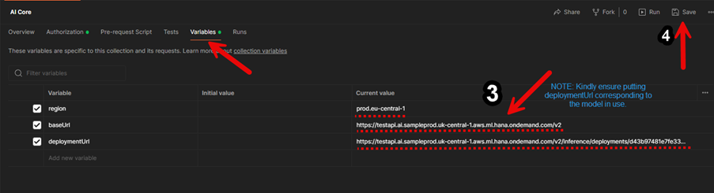
Add the name of your respective resource group. 


Next, to begin making API calls, we’ll create a new access token. Now we’re ready to use the API for various models.

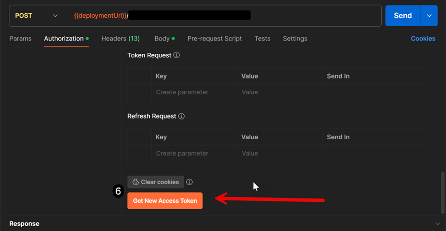

Now that we’re done with the pre-requisites, we’ll proceed to using the API for GPT4o for Scene Detection.

**NOTE:** Update the “url” to the link of the image resource you want to query the model upon and give the corresponding query in the “text” parameter.

```Body
{
    "messages": [
      {
        "role": "user",
        "content": [
           {
              "type": "text",
              "text": "describe the scene."
           },
           {
              "type": "image_url",
              "image_url": {
                 "url": "https://raw.githubusercontent.com/SAP-samples/ai-core-samples/main/09_BusinessAIWeek/images/sceneDetection.jpg"
              }
          }
        ]
      }
    ],
    "max_tokens": 4096
}
```

Add the above data in the body of the POST call, then hit ‘Send’ as follows - 


We get the following output accurately describing the scene in the image:


[OPTION END]

[OPTION BEGIN [GenAI SDK]]
To utilize the GPT-4o model, which supports both text and image inputs, use the code below. This example demonstrates how to create a prompt with an image URL and a text query, enabling the model to process and provide a response based on both visual and textual information.

Note: You can replace the image URL with any image of your choice and modify the text prompt to ask the model any question about that image based on your specific needs.

```PYTHON
from gen_ai_hub.proxy.native.openai import chat
import requests
import base64

def encode_image_from_url(image_url):
    """Download and encode image to base64 format from URL."""
    response = requests.get(image_url)
    if response.status_code == 200:
        return base64.b64encode(response.content).decode("utf-8")
    else:
        raise Exception(f"Failed to download image. Status code: {response.status_code}")

def create_image_prompt(image_url, text_prompt):
    """Create a prompt message for the model with the image data."""
    # Encode image URL to base64 format
    image_base64 = encode_image_from_url(image_url)
    
    # Create messages including both text and image input
    messages = [
        {
            "role": "user",
            "content": [
                {
                    "type": "text",
                    "text": text_prompt
                },
                {
                    "type": "image_url",
                    "image_url": {
                        "url": image_url  # Use the direct image URL
                    }
                }
            ]
        }
    ]
    return messages

def get_response_from_model(model_name, messages):
    """Send messages to the model and return the response."""
    kwargs = dict(model_name=model_name, messages=messages)
    response = chat.completions.create(**kwargs)
    return response.to_dict()["choices"][0]["message"]["content"]

# Example usage
image_url = "https://raw.githubusercontent.com/SAP-samples/ai-core-samples/main/09_BusinessAIWeek/images/sceneDetection.jpg"
text_prompt = "Describe the image in one line."  # Prompt asking for the description
model_name = "gpt-4o"  # Replace with the model that supports image input

# Create prompt with image and text
messages = create_image_prompt(image_url, text_prompt)

# Get response from model
response = get_response_from_model(model_name, messages)
print(response)
```
By following this example, you can easily integrate image-based inputs with the GPT-4o model and leverage its ability to understand and generate responses based on both visual and text content. For additional guidance, refer to the screenshot below.
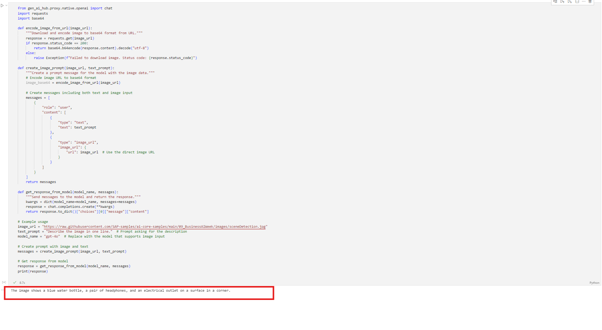
[OPTION END]

For more information on the models refer to [Hello GPT-4o](https://openai.com/index/hello-gpt-4o/)

### Object Detection

This step focuses on identifying and labeling objects within an image. The multimodal input allows GPT-4o to analyze the visual data and generate a list of objects detected in the scene. Object detection is crucial for tasks such as inventory management, autonomous driving, and augmented reality applications and such.

Follow the further steps to replicate object detection using GPT-4o.

[OPTION BEGIN [curl]]

The following example shows how you can consume this generative AI model using curl. For more information about prompts, see the tutorial [Prompt LLMs in the Generative AI Hub in SAP AI Core & Launchpad Information published on SAP site](https://help.sap.com/docs/link-disclaimer?site=https%3A%2F%2Fdevelopers.sap.com%2Ftutorials%2Fai-core-generative-ai.html).

Before you use this model, please ensure that the deployment has already been created. You can create the deployment either through [generative-ai-hub-sdk or AI Launchpad](https://developers.sap.com/tutorials/ai-core-generative-ai.html#ad7ffc1e-e94e-4de4-b70f-116b038aff04).

For inferencing the model through curl,

- open Windows PowerShell (for Windows based devices)

NOTE: **do not use DOS Prompt instead of PowerShell**

- open Terminal (for macOS based devices)

Enter the following command after replacing `<deployment_url>`, `<resource-group>`, `<token>` with the values for the corresponding model.

NOTE:
 
 - for macOS based devices use  use the **bash** command

 - for windows devices, use the **PowerShell** command

 - Update the “url” to the link of the image resource you want to query the model upon and give the corresponding query in the “text” parameter.

```bash
curl -L '<deployment-url>/chat/completions?api-version=2023-05-15' \
--header 'AI-Resource-Group: <resource-group>' \
--header 'Content-Type: application/json' \
--header 'Authorization: Bearer <token>' \
--data '{
    "messages": [
      {
        "role": "user",
        "content": [
           {
              "type": "text",
              "text": "give me the bottle color and its count"
           },
           {
              "type": "image_url",
              "image_url": {
                 "url": "https://raw.githubusercontent.com/SAP-samples/ai-core-samples/main/09_BusinessAIWeek/images/objectDetection.jpg"
              }
          }
        ]
      }
    ],
    "max_tokens": 4096
}'
```

```PowerShell
curl.exe -L "<deployment_url>/chat/completions?api-version=2023-05-15" --header "AI-Resource-Group: <resource-group>" --header "Content-Type: application/json" --header "Authorization: Bearer <token>" --data '{\"messages\": [{\"role\": \"user\", \"content\": [{\"type\": \"text\",\"text\": \"give me the bottle color and its count\"},{\"type\":\"image_url\",\"image_url\": {\"url\": \"https://raw.githubusercontent.com/SAP-samples/ai-core-samples/main/09_BusinessAIWeek/images/objectDetection.jpg\"}}]}],\"max_tokens\": 4096 }'
```

After executing the above curl command, we'll get the output as follows - 

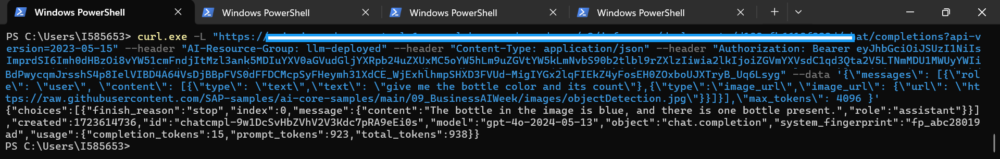

[OPTION END]

[OPTION BEGIN [Postman]]

To begin using the APIs in AI Core, we start with setting up the authentication methods.


For ease of access, we set up the region, baseUrl and deploymentUrl variables as a pre-requisite. This avoids the need of passing these values repeatedly for different scenarios. 
NOTE: the deployment URL is specific to the model we intend to use.


Add the name of your respective resource group. 


Next, to begin making API calls, we’ll create a new access token. Now we’re ready to use the API for various models.


Now that we’re done with the pre-requisites, we’ll proceed to using the API for GPT4o for Object Detection.

**NOTE:** Update the “url” to the link of the image resource you want to query the model upon and give the corresponding query in the “text” parameter.

```Body
{
    "messages": [
      {
        "role": "user",
        "content": [
           {
              "type": "text",
              "text": "give me the bottle color and its count"
           },
           {
              "type": "image_url",
              "image_url": {
                 "url": "https://raw.githubusercontent.com/SAP-samples/ai-core-samples/main/09_BusinessAIWeek/images/objectDetection.jpg"
              }
          }
        ]
      }
    ],
    "max_tokens": 4096
}
```

Add the above data in the body of the POST call, then hit ‘Send’ as follows - 


We get the following output accurately describing the scene in the image:


[OPTION END]

[OPTION BEGIN [GenAI SDK]]
To utilize the GPT-4o model, which supports both text and image inputs, use the code below. This example demonstrates how to create a prompt with an image URL and a text query, enabling the model to process and provide a response based on both visual and textual information.

Note: You can replace the image URL with any image of your choice and modify the text prompt to ask the model any question about that image based on your specific needs.

```PYTHON
from gen_ai_hub.proxy.native.openai import chat
import requests
import base64

def encode_image_from_url(image_url):
    """Download and encode image to base64 format from URL."""
    response = requests.get(image_url)
    if response.status_code == 200:
        return base64.b64encode(response.content).decode("utf-8")
    else:
        raise Exception(f"Failed to download image. Status code: {response.status_code}")

def create_image_prompt(image_url, text_prompt):
    """Create a prompt message for the model with the image data."""
    # Encode image URL to base64 format
    image_base64 = encode_image_from_url(image_url)
    
    # Create messages including both text and image input
    messages = [
        {
            "role": "user",
            "content": [
                {
                    "type": "text",
                    "text": text_prompt
                },
                {
                    "type": "image_url",
                    "image_url": {
                        "url": image_url  # Use the direct image URL
                    }
                }
            ]
        }
    ]
    return messages

def get_response_from_model(model_name, messages):
    """Send messages to the model and return the response."""
    kwargs = dict(model_name=model_name, messages=messages)
    response = chat.completions.create(**kwargs)
    return response.to_dict()["choices"][0]["message"]["content"]

# Example usage
image_url = "https://raw.githubusercontent.com/SAP-samples/ai-core-samples/main/09_BusinessAIWeek/images/objectDetection.jpg"
text_prompt = "give me the bottle color and its count."  # Prompt asking for the description
model_name = "gpt-4o"  # Replace with the model that supports image input

# Create prompt with image and text
messages = create_image_prompt(image_url, text_prompt)

# Get response from model
response = get_response_from_model(model_name, messages)
print(response)
```
By following this example, you can easily integrate image-based inputs with the GPT-4o model and leverage its ability to understand and generate responses based on both visual and text content. For additional guidance, refer to the screenshot below.
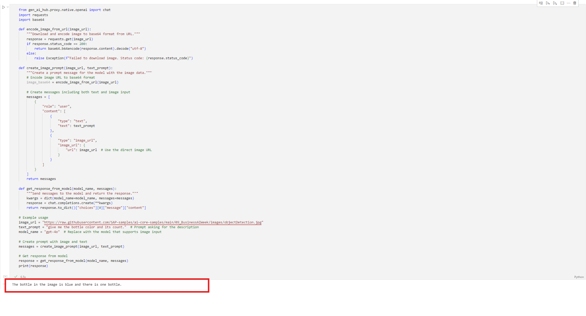
[OPTION END]

For more information on the models refer to [Hello GPT-4o](https://openai.com/index/hello-gpt-4o/)

### Graph Analysis

Here, the tutorial demonstrates how GPT-4o can be used to interpret and analyze data presented in graphical form. By combining text and image input, the model can extract meaningful insights from charts, graphs, and other visual data representations. This step is valuable for data analysis, reporting, and decision-making processes.

Follow the further steps to replicate graph analysis using GPT-4o.

[OPTION BEGIN [curl]]

The following example shows how you can consume this generative AI model using curl. For more information about prompts, see the tutorial [Prompt LLMs in the Generative AI Hub in SAP AI Core & Launchpad Information published on SAP site](https://help.sap.com/docs/link-disclaimer?site=https%3A%2F%2Fdevelopers.sap.com%2Ftutorials%2Fai-core-generative-ai.html).

Before you use this model, please ensure that the deployment has already been created. You can create the deployment either through [generative-ai-hub-sdk or AI Launchpad](https://developers.sap.com/tutorials/ai-core-generative-ai.html#ad7ffc1e-e94e-4de4-b70f-116b038aff04).

For inferencing the model through curl,

- open Windows PowerShell (for Windows based devices)

NOTE: **do not use DOS Prompt instead of PowerShell**

- open Terminal (for macOS based devices)

Enter the following command after replacing `<deployment_url>`, `<resource-group>`, `<token>` with the values for the corresponding model.

NOTE:
 
 - for macOS based devices use  use the **bash** command

 - for windows devices, use the **PowerShell** command

 - Update the “url” to the link of the image resource you want to query the model upon and give the corresponding query in the “text” parameter.

```bash
curl -L '<deployment-url>/chat/completions?api-version=2023-05-15' \
--header 'AI-Resource-Group: <resource-group>' \
--header 'Content-Type: application/json' \
--header 'Authorization: Bearer <token>' \
--data '{
    "messages": [
      {
        "role": "user",
        "content": [
           {
              "type": "text",
              "text": "what is this graph about"
           },
           {
              "type": "image_url",
              "image_url": {
                 "url": "https://raw.githubusercontent.com/SAP-samples/ai-core-samples/main/09_BusinessAIWeek/images/graph.jpg"
              }
          }
        ]
      }
    ],
    "max_tokens": 4096
}'
```

```PowerShell
curl.exe -L "<deployment_url>/chat/completions?api-version=2023-05-15" --header "AI-Resource-Group: <resource-group>" --header "Content-Type: application/json" --header "Authorization: Bearer <token>" --data '{\"messages\": [{\"role\": \"user\", \"content\": [{\"type\": \"text\",\"text\": \"what is this graph about\"},{\"type\":\"image_url\",\"image_url\": {\"url\": \"https://raw.githubusercontent.com/SAP-samples/ai-core-samples/main/09_BusinessAIWeek/images/graph.jpg\"}}]}],\"max_tokens\": 4096 }'
```

After executing the above curl command, we'll get the output as follows - 

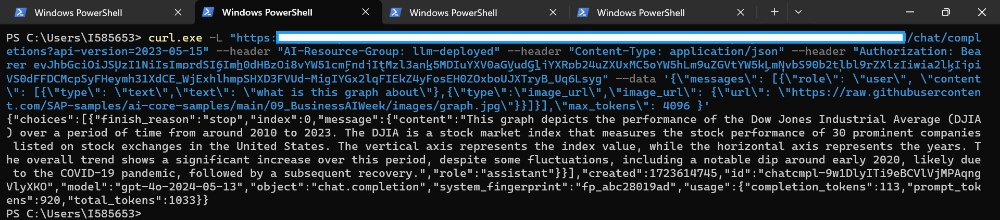

[OPTION END]

[OPTION BEGIN [Postman]]

To begin using the APIs in AI Core, we start with setting up the authentication methods.


For ease of access, we set up the region, baseUrl and deploymentUrl variables as a pre-requisite. This avoids the need of passing these values repeatedly for different scenarios. 
NOTE: the deployment URL is specific to the model we intend to use.


Add the name of your respective resource group. 


Next, to begin making API calls, we’ll create a new access token. Now we’re ready to use the API for various models.


Now that we’re done with the pre-requisites, we’ll proceed to using the API for GPT4o for Graph Analysis.

**NOTE:** Update the “url” to the link of the image resource you want to query the model upon and give the corresponding query in the “text” parameter.

```Body
{
    "messages": [
      {
        "role": "user",
        "content": [
           {
              "type": "text",
              "text": "what is this graph about"
           },
           {
              "type": "image_url",
              "image_url": {
                 "url": "https://raw.githubusercontent.com/SAP-samples/ai-core-samples/main/09_BusinessAIWeek/images/graph.jpg"
              }
          }
        ]
      }
    ],
    "max_tokens": 4096
}
```

Add the above data in the body of the POST call, then hit ‘Send’ as follows - 

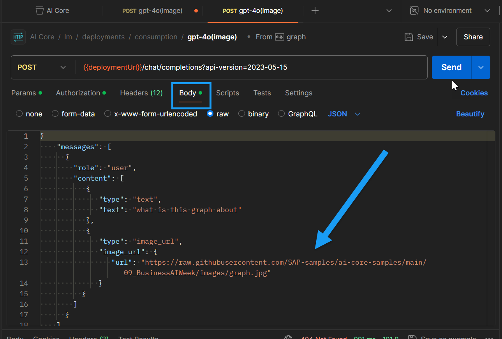

We get the following output accurately describing the scene in the image:


[OPTION END]

[OPTION BEGIN [GenAI SDK]]
To utilize the GPT-4o model, which supports both text and image inputs, use the code below. This example demonstrates how to create a prompt with an image URL and a text query, enabling the model to process and provide a response based on both visual and textual information.

Note: You can replace the image URL with any image of your choice and modify the text prompt to ask the model any question about that image based on your specific needs.

```PYTHON
from gen_ai_hub.proxy.native.openai import chat
import requests
import base64

def encode_image_from_url(image_url):
    """Download and encode image to base64 format from URL."""
    response = requests.get(image_url)
    if response.status_code == 200:
        return base64.b64encode(response.content).decode("utf-8")
    else:
        raise Exception(f"Failed to download image. Status code: {response.status_code}")

def create_image_prompt(image_url, text_prompt):
    """Create a prompt message for the model with the image data."""
    # Encode image URL to base64 format
    image_base64 = encode_image_from_url(image_url)
    
    # Create messages including both text and image input
    messages = [
        {
            "role": "user",
            "content": [
                {
                    "type": "text",
                    "text": text_prompt
                },
                {
                    "type": "image_url",
                    "image_url": {
                        "url": image_url  # Use the direct image URL
                    }
                }
            ]
        }
    ]
    return messages

def get_response_from_model(model_name, messages):
    """Send messages to the model and return the response."""
    kwargs = dict(model_name=model_name, messages=messages)
    response = chat.completions.create(**kwargs)
    return response.to_dict()["choices"][0]["message"]["content"]

# Example usage
image_url = "https://raw.githubusercontent.com/SAP-samples/ai-core-samples/main/09_BusinessAIWeek/images/graph.jpg"
text_prompt = "what is this graph about"  # Prompt asking for the description
model_name = "gpt-4o"  # Replace with the model that supports image input

# Create prompt with image and text
messages = create_image_prompt(image_url, text_prompt)

# Get response from model
response = get_response_from_model(model_name, messages)
print(response)
```
By following this example, you can easily integrate image-based inputs with the GPT-4o model and leverage its ability to understand and generate responses based on both visual and text content. For additional guidance, refer to the screenshot below.
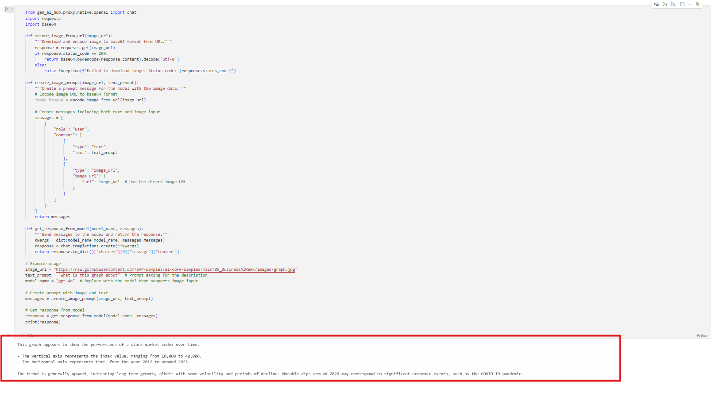
[OPTION END]

For more information on the models refer to [Hello GPT-4o](https://openai.com/index/hello-gpt-4o/)

### Math

In this step, we explore how GPT-4o handles mathematical problems that involve both textual descriptions and visual data. The model can solve equations, interpret mathematical expressions in images, and provide detailed explanations of its reasoning. This capability is useful in educational tools, scientific research, and engineering applications.

Follow the further steps to replicate mathematical operations using GPT-4o.

[OPTION BEGIN [curl]]

The following example shows how you can consume this generative AI model using curl. For more information about prompts, see the tutorial [Prompt LLMs in the Generative AI Hub in SAP AI Core & Launchpad Information published on SAP site](https://help.sap.com/docs/link-disclaimer?site=https%3A%2F%2Fdevelopers.sap.com%2Ftutorials%2Fai-core-generative-ai.html).

Before you use this model, please ensure that the deployment has already been created. You can create the deployment either through [generative-ai-hub-sdk or AI Launchpad](https://developers.sap.com/tutorials/ai-core-generative-ai.html#ad7ffc1e-e94e-4de4-b70f-116b038aff04).

For inferencing the model through curl,

- open Windows PowerShell (for Windows based devices)

NOTE: **do not use DOS Prompt instead of PowerShell**

- open Terminal (for macOS based devices)

Enter the following command after replacing `<deployment_url>`, `<resource-group>`, `<token>` with the values for the corresponding model.

NOTE:
 
 - for macOS based devices use  use the **bash** command

 - for windows devices, use the **PowerShell** command

 - Update the “url” to the link of the image resource you want to query the model upon and give the corresponding query in the “text” parameter.

```bash
curl -L '<deployment-url>/chat/completions?api-version=2023-05-15' \
--header 'AI-Resource-Group: <resource-group>' \
--header 'Content-Type: application/json' \
--header 'Authorization: Bearer <token>' \
--data '{
    "messages": [
      {
        "role": "user",
        "content": [
           {
              "type": "text",
              "text": "find x"
           },
           {
              "type": "image_url",
              "image_url": {
                 "url": "https://raw.githubusercontent.com/SAP-samples/ai-core-samples/main/09_BusinessAIWeek/images/math.jpg"
              }
          }
        ]
      }
    ],
    "max_tokens": 4096
}'
```

```PowerShell
curl.exe -L "<deployment_url>/chat/completions?api-version=2023-05-15" --header "AI-Resource-Group: <resource-group>" --header "Content-Type: application/json" --header "Authorization: Bearer <token>" --data '{\"messages\": [{\"role\": \"user\", \"content\": [{\"type\": \"text\",\"text\": \"find x\"},{\"type\":\"image_url\",\"image_url\": {\"url\": \"https://raw.githubusercontent.com/SAP-samples/ai-core-samples/main/09_BusinessAIWeek/images/math.jpg\"}}]}],\"max_tokens\": 4096 }'
```

After executing the above curl command, we'll get the output as follows - 

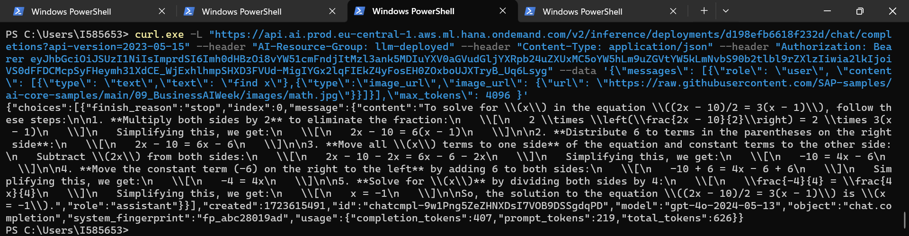

[OPTION END]

[OPTION BEGIN [Postman]]

To begin using the APIs in AI Core, we start with setting up the authentication methods.


For ease of access, we set up the region, baseUrl and deploymentUrl variables as a pre-requisite. This avoids the need of passing these values repeatedly for different scenarios. 
NOTE: the deployment URL is specific to the model we intend to use.


Add the name of your respective resource group. 


Next, to begin making API calls, we’ll create a new access token. Now we’re ready to use the API for various models.


Now that we’re done with the pre-requisites, we’ll proceed to using the API for GPT4o for Math.

**NOTE:** Update the “url” to the link of the image resource you want to query the model upon and give the corresponding query in the “text” parameter.

```Body
{
    "messages": [
      {
        "role": "user",
        "content": [
           {
              "type": "text",
              "text": "find x"
           },
           {
              "type": "image_url",
              "image_url": {
                 "url": "https://raw.githubusercontent.com/SAP-samples/ai-core-samples/main/09_BusinessAIWeek/images/math.jpg"
              }
          }
        ]
      }
    ],
    "max_tokens": 4096
}
```

Add the above data in the body of the POST call, then hit ‘Send’ as follows - 

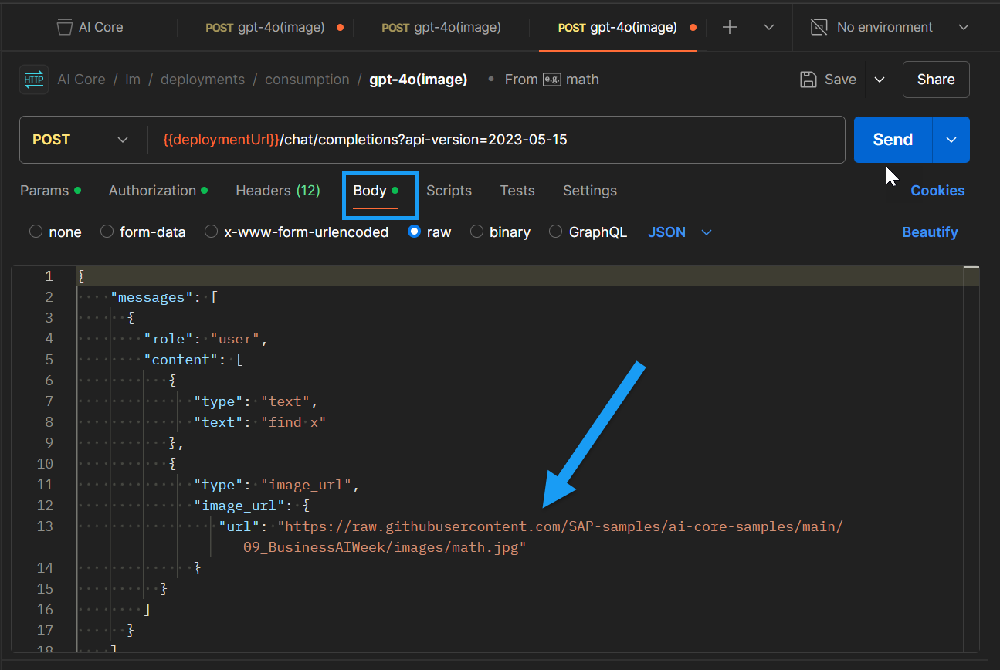

We get the following output accurately describing the scene in the image:


[OPTION END]

[OPTION BEGIN [GenAI SDK]]
To utilize the GPT-4o model, which supports both text and image inputs, use the code below. This example demonstrates how to create a prompt with an image URL and a text query, enabling the model to process and provide a response based on both visual and textual information.

Note: You can replace the image URL with any image of your choice and modify the text prompt to ask the model any question about that image based on your specific needs.

```PYTHON
from gen_ai_hub.proxy.native.openai import chat
import requests
import base64

def encode_image_from_url(image_url):
    """Download and encode image to base64 format from URL."""
    response = requests.get(image_url)
    if response.status_code == 200:
        return base64.b64encode(response.content).decode("utf-8")
    else:
        raise Exception(f"Failed to download image. Status code: {response.status_code}")

def create_image_prompt(image_url, text_prompt):
    """Create a prompt message for the model with the image data."""
    # Encode image URL to base64 format
    image_base64 = encode_image_from_url(image_url)
    
    # Create messages including both text and image input
    messages = [
        {
            "role": "user",
            "content": [
                {
                    "type": "text",
                    "text": text_prompt
                },
                {
                    "type": "image_url",
                    "image_url": {
                        "url": image_url  # Use the direct image URL
                    }
                }
            ]
        }
    ]
    return messages

def get_response_from_model(model_name, messages):
    """Send messages to the model and return the response."""
    kwargs = dict(model_name=model_name, messages=messages)
    response = chat.completions.create(**kwargs)
    return response.to_dict()["choices"][0]["message"]["content"]

# Example usage
image_url = "https://raw.githubusercontent.com/SAP-samples/ai-core-samples/main/09_BusinessAIWeek/images/math.jpg"
text_prompt = "find x"  # Prompt asking for the description
model_name = "gpt-4o"  # Replace with the model that supports image input

# Create prompt with image and text
messages = create_image_prompt(image_url, text_prompt)

# Get response from model
response = get_response_from_model(model_name, messages)
print(response)
```
By following this example, you can easily integrate image-based inputs with the GPT-4o model and leverage its ability to understand and generate responses based on both visual and text content. For additional guidance, refer to the screenshot below.
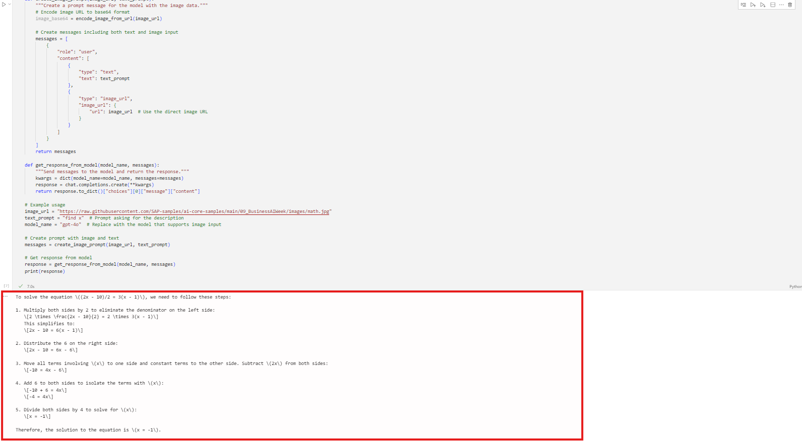
[OPTION END]

For more information on the models refer to [Hello GPT-4o](https://openai.com/index/hello-gpt-4o/)

### Image to Text

The final step focuses on converting visual information into text. By providing an image as input, GPT-4o generates a textual description or transcription of the content. This step is particularly beneficial for accessibility tools, content creation, and archiving visual data.

Follow the further steps to replicate Optical Character Recognition (OCR) using GPT-4o.

[OPTION BEGIN [curl]]

The following example shows how you can consume this generative AI model using curl. For more information about prompts, see the tutorial [Prompt LLMs in the Generative AI Hub in SAP AI Core & Launchpad Information published on SAP site](https://help.sap.com/docs/link-disclaimer?site=https%3A%2F%2Fdevelopers.sap.com%2Ftutorials%2Fai-core-generative-ai.html).

Before you use this model, please ensure that the deployment has already been created. You can create the deployment either through [generative-ai-hub-sdk or AI Launchpad](https://developers.sap.com/tutorials/ai-core-generative-ai.html#ad7ffc1e-e94e-4de4-b70f-116b038aff04).

For inferencing the model through curl,

- open Windows PowerShell (for Windows based devices)

NOTE: **do not use DOS Prompt instead of PowerShell**

- open Terminal (for macOS based devices)

Enter the following command after replacing `<deployment_url>`, `<resource-group>`, `<token>` with the values for the corresponding model.

NOTE:
 
 - for macOS based devices use  use the **bash** command

 - for windows devices, use the **PowerShell** command

 - Update the “url” to the link of the image resource you want to query the model upon and give the corresponding query in the “text” parameter.

```bash
curl -L '<deployment-url>/chat/completions?api-version=2023-05-15' \
--header 'AI-Resource-Group: <resource-group>' \
--header 'Content-Type: application/json' \
--header 'Authorization: Bearer <token>' \
--data '{
    "messages": [
      {
        "role": "user",
        "content": [
           {
              "type": "text",
              "text": "extract text"
           },
           {
              "type": "image_url",
              "image_url": {
                 "url": "https://raw.githubusercontent.com/SAP-samples/ai-core-samples/main/09_BusinessAIWeek/images/handwrittenText.png"
              }
          }
        ]
      }
    ],
    "max_tokens": 4096
}'
```

```PowerShell
curl.exe -L "<deployment_url>/chat/completions?api-version=2023-05-15" --header "AI-Resource-Group: <resource-group>" --header "Content-Type: application/json" --header "Authorization: Bearer <token>" --data '{\"messages\": [{\"role\": \"user\", \"content\": [{\"type\": \"text\",\"text\": \"extract text\"},{\"type\":\"image_url\",\"image_url\": {\"url\": \"https://raw.githubusercontent.com/SAP-samples/ai-core-samples/main/09_BusinessAIWeek/images/handwrittenText.png\"}}]}],\"max_tokens\": 4096 }'
```

After executing the above curl command, we'll get the output as follows - 

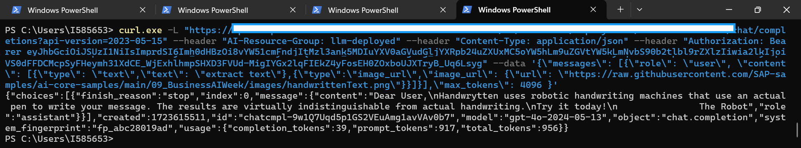

[OPTION END]

[OPTION BEGIN [Postman]]

To begin using the APIs in AI Core, we start with setting up the authentication methods.


For ease of access, we set up the region, baseUrl and deploymentUrl variables as a pre-requisite. This avoids the need of passing these values repeatedly for different scenarios. 
NOTE: the deployment URL is specific to the model we intend to use.


Add the name of your respective resource group. 


Next, to begin making API calls, we’ll create a new access token. Now we’re ready to use the API for various models.


Now that we’re done with the pre-requisites, we’ll proceed to using the API for GPT4o for text extraction.

**NOTE:** Update the “url” to the link of the image resource you want to query the model upon and give the corresponding query in the “text” parameter.

```Body
{
    "messages": [
      {
        "role": "user",
        "content": [
           {
              "type": "text",
              "text": "extract text"
           },
           {
              "type": "image_url",
              "image_url": {
                 "url": "https://raw.githubusercontent.com/SAP-samples/ai-core-samples/main/09_BusinessAIWeek/images/handwrittenText.png"
              }
          }
        ]
      }
    ],
    "max_tokens": 4096
}
```

Add the above data in the body of the POST call, then hit ‘Send’ as follows - 

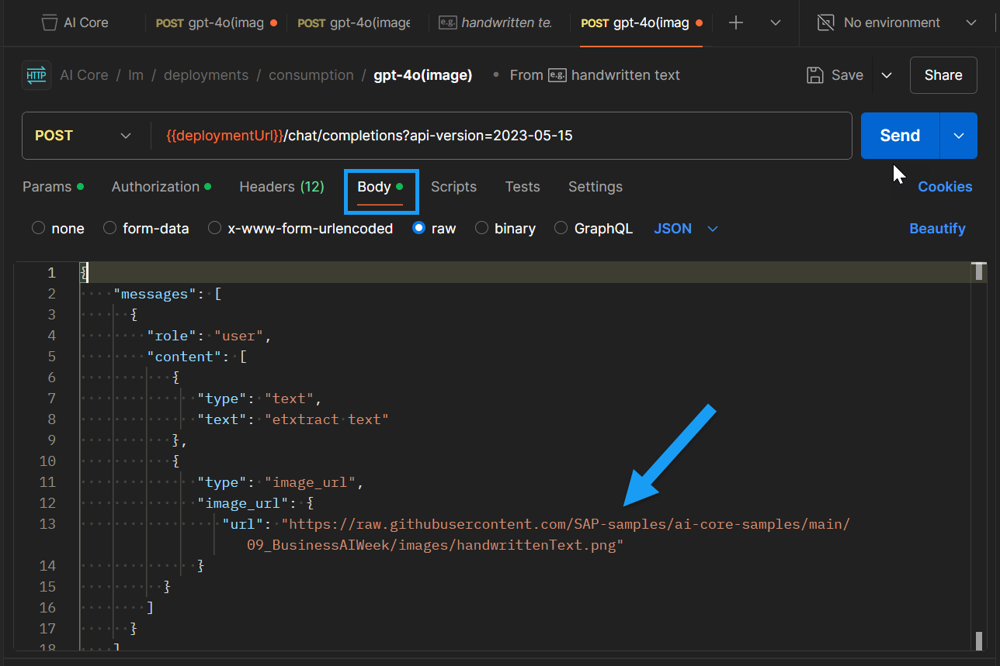

We get the following output accurately describing the scene in the image:


[OPTION END]

[OPTION BEGIN [GenAI SDK]]
To utilize the GPT-4o model, which supports both text and image inputs, use the code below. This example demonstrates how to create a prompt with an image URL and a text query, enabling the model to process and provide a response based on both visual and textual information.

Note: You can replace the image URL with any image of your choice and modify the text prompt to ask the model any question about that image based on your specific needs.

```PYTHON
from gen_ai_hub.proxy.native.openai import chat
import requests
import base64

def encode_image_from_url(image_url):
    """Download and encode image to base64 format from URL."""
    response = requests.get(image_url)
    if response.status_code == 200:
        return base64.b64encode(response.content).decode("utf-8")
    else:
        raise Exception(f"Failed to download image. Status code: {response.status_code}")

def create_image_prompt(image_url, text_prompt):
    """Create a prompt message for the model with the image data."""
    # Encode image URL to base64 format
    image_base64 = encode_image_from_url(image_url)
    
    # Create messages including both text and image input
    messages = [
        {
            "role": "user",
            "content": [
                {
                    "type": "text",
                    "text": text_prompt
                },
                {
                    "type": "image_url",
                    "image_url": {
                        "url": image_url  # Use the direct image URL
                    }
                }
            ]
        }
    ]
    return messages

def get_response_from_model(model_name, messages):
    """Send messages to the model and return the response."""
    kwargs = dict(model_name=model_name, messages=messages)
    response = chat.completions.create(**kwargs)
    return response.to_dict()["choices"][0]["message"]["content"]

# Example usage
image_url = "https://raw.githubusercontent.com/SAP-samples/ai-core-samples/main/09_BusinessAIWeek/images/handwrittenText.png"
text_prompt = "extract text"  # Prompt asking for the description
model_name = "gpt-4o"  # Replace with the model that supports image input

# Create prompt with image and text
messages = create_image_prompt(image_url, text_prompt)

# Get response from model
response = get_response_from_model(model_name, messages)
print(response)
```
By following this example, you can easily integrate image-based inputs with the GPT-4o model and leverage its ability to understand and generate responses based on both visual and text content. For additional guidance, refer to the screenshot below.
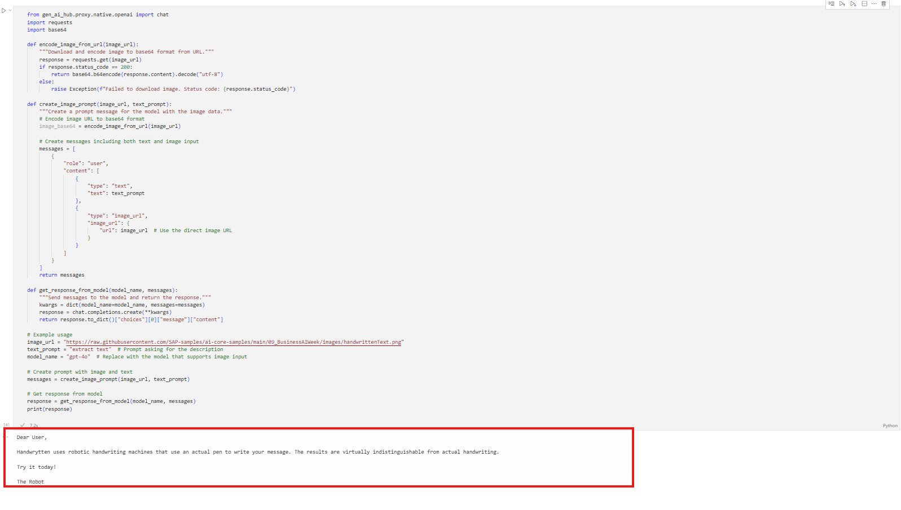
[OPTION END]

For more information on the models refer to [Hello GPT-4o](https://openai.com/index/hello-gpt-4o/)