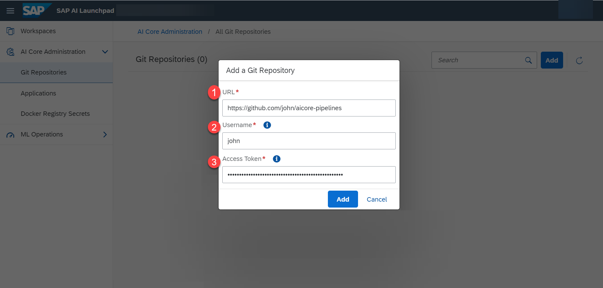
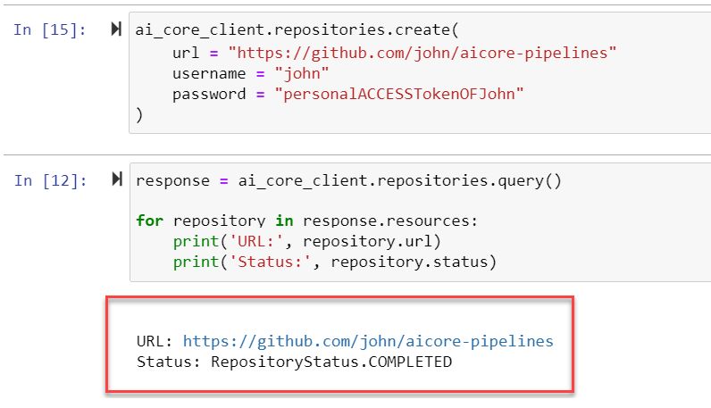
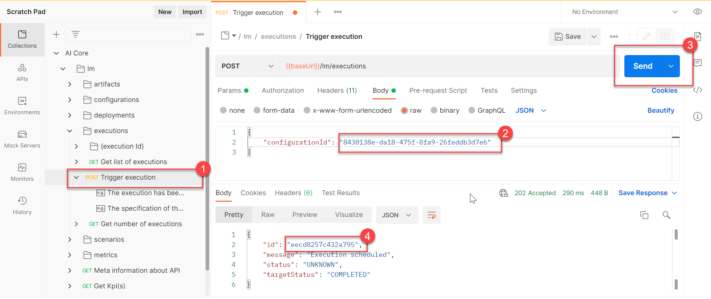
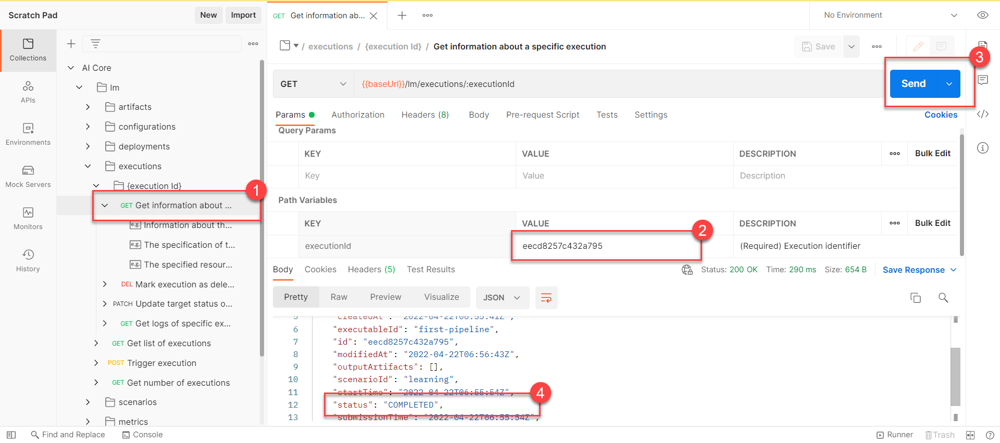
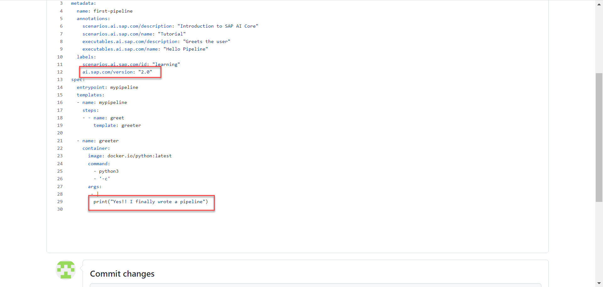
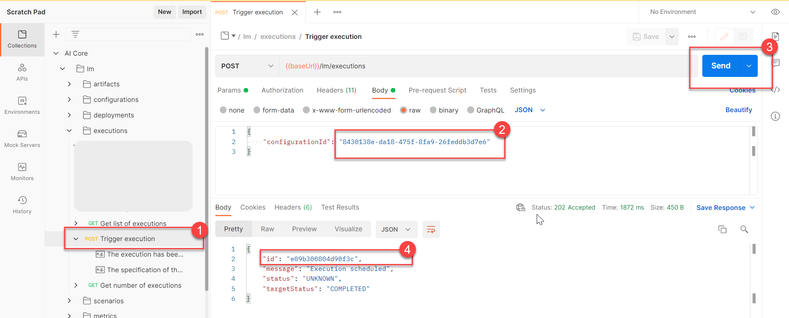
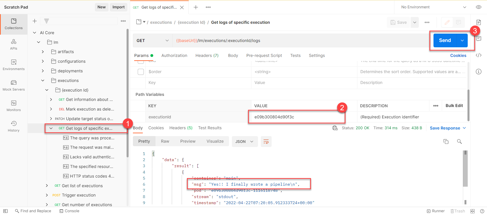

# Quick Start for Your First AI Project Using SAP AI Core
<!-- description --> Learn the fundamentals of SAP AI Core and create your Hello, World! AI scenario.

## You will learn
- How to connect GitHub to SAP AI Core
- How to create scenarios and workflows
- How to check the sync status and debug errors in your AI workflow
- How to run workflows in SAP AI Core

## Prerequisites
- Have Postman, Python (AI Libraries) or SAP AI Launchpad set up. You can set any of these up using [this tutorial](https://developers.sap.com/tutorials/ai-core-setup.html/#)

## Intro
You will create an AI workflow for your Hello, World! workflow, and connect and execute it in your SAP AI Core instance. You will see that workflows between GitHub and SAP AI Core can be auto synced, and it is possible to use this workflow after subscription, to connect to your actual AI code.

The terms "executable" and "workflow" can be used interchangeably to refer to the YAML files, introduced in this tutorial.


### Create a GitHub repository


Create account on [GitHub](https://github.com/).

> **WARNING**: If you are using a GitHub account hosted by your organization, it must be external facing (not behind a firewall).

Click **New** to create a new repository. You will use this GitHub repository to store all of your workflows for SAP AI Core. Each workflow may belong to more than one AI use case.

<!-- border -->
<nbsp>

Create a repository named `aicore-pipelines`. It is recommended have this repository's visibility set to **private**.

<!-- border -->


### Generate a GitHub personal access token


Click on your GitHub profile icon. Select **Settings**.

<!-- border -->

Click **Developer Settings** from the left navigation pane.

<!-- border -->

Click **Personal access tokens**. Click on **Generate new token**. GitHub tokens are an alternative to sharing your GitHub credentials so that you can allow applications like SAP AI Core to access you GitHub repositories, without compromising your account security.

<!-- border -->

Give the name `my_access_token` in the **Note** field and select the checkbox `Full control of private repositories` in the **Select Scopes** field.

<!-- border -->

Scroll to the bottom of page and click **Generate token**.

<!-- border -->

Store your generated access token locally.

<!-- border -->


### Onboard GitHub to SAP AI Core


[OPTION BEGIN [SAP AI Launchpad]]

Select on your SAP AI Core connection under **Workspaces** app in the SAP AI Launchpad.

<!-- border -->

Under the **Git Repositories** section in **AI Core Administration** app, click **Add**.

> **WARNING** If you don't see the **AI Core Administration** app, check that you had selected your SAP AI Core connection from the **Workspaces** app. If it is still not visible then ask your SAP AI Launchpad administrator to assign roles to you so that you can access the app.
<!-- border -->

Enter your GitHub repository details (created in the previous step) in the dialog box that appears, and click **Add**.

<!-- border -->

[OPTION END]


[OPTION BEGIN [Postman]]

<!-- border -->

[OPTION END]

[OPTION BEGIN [SAP AI Core SDK]]
On-board your repository.
```PYTHON
# on-board new GitHub repository
ai_core_client.repositories.create(
#    name = "john-aicore-pipelines",
    url = "https://github.com/john/aicore-pipelines",
    username = "john",
    password = "personalACCESSTokenOFJohn"
)
```

Check on-boarded repositories.

```PYTHON
# check on-boarding status
response = ai_core_client.repositories.query()
#
for repository in response.resources:
#    print('Name:', repository.name)
    print('URL:', repository.url)
    print('Status:', repository.status)
```

<!-- border -->

[OPTION END]

Use the following information as reference:

1. **URL**: Paste the URL of your GitHub repository and add the suffix `/aicore-pipelines`.

2. **Username**: Your GitHub username.

3. **Password**: Paste your GitHub **Personal Access Token**, generated in the previous step.

You will see your GitHub onboarding completed in a few seconds. In the next steps you will learn how to enable auto syncing of workflows from GitHub.

<!-- border -->

> **CAUTION** These onboarding steps only store credentials to access the specified SAP AI Core instance within your GitHub account. Therefore, this **Completed** status does not guarantee that your SAP AI Core is able to access a given file, in your GitHub repository. If you need to debug this, follow the steps of application creation and debugging.


### Place a workflow in GitHub


Workflows for SAP AI Core are created using **YAML** or **JSON** files that are compatible with the SAP AI Core schema. Let's start with a simple workflow which will output a log file, containing: `Hello from SAP AI Core`.

In your GitHub repository, click **Add file** > **Create new file**.

<!-- border -->

Type `LearningScenarios/hello_pipeline.yaml` into the **Name your file** field. This will automatically create the folder `LearningScenarios` and a workflow named `hello_pipeline.yaml` inside it.

<!-- border -->

> **CAUTION** Do not use the name of your workflow file (`hello_pipeline.yaml`) as any other identifier within SAP AI Core.

<!-- border -->

Now copy and paste the following snippet to the editor. The code is also available by following [this link](https://raw.githubusercontent.com/SAP-samples/ai-core-samples/main/02_ai_core/tutorials/01_create_your_first_machine_learning_project_using_sap_ai_core/01_02_quick_start_for_your_first_ai_project_using_ai_core/hello_pipeline.yaml).

```YAML
apiVersion: argoproj.io/v1alpha1
kind: WorkflowTemplate
metadata:
  name: first-pipeline # Executable ID (max length 64 lowercase-hyphen-separated), please modify this to any value if you are not the only user of your SAP AI Core instance. Example: `first-pipeline-1234`
  annotations:
    scenarios.ai.sap.com/description: "Introduction to SAP AI Core"
    scenarios.ai.sap.com/name: "Tutorial"
    executables.ai.sap.com/description: "Greets the user"
    executables.ai.sap.com/name: "Hello Pipeline"
  labels:
    scenarios.ai.sap.com/id: "learning"
    ai.sap.com/version: "1.0"
spec:
  entrypoint: mypipeline
  templates:
  - name: mypipeline
    steps:
    - - name: greet
        template: greeter

  - name: greeter
    container:
      image: docker.io/python:latest
      command:
        - python3
        - '-c'
      args:
       - |
        print("Hello from SAP AI Core")
```

> **CAUTION** The key `metadata > name` specifies your executable ID. In the example below, the value `first-pipeline` becomes your executable ID. This executable ID is a unique identifier for your workflow within SAP AI Core. The executable ID of each workflow needs to be unique from all other workflows and GitHub repositories that you sync with your SAP AI Core instance. If your SAP AI Core instance is shared with other users, edit the value to be sure that it is unique, for example, `first-pipeline-1234`.

<!-- border -->

Scroll to the bottom of page and click **Commit new file**.

<!-- border -->

The workflow contains annotations, which are identifiers for SAP AI Core. Your AI use case is termed **Scenario** (`Tutorial` in this case) and within each scenario you create **executables** (workflows), (`Hello Pipeline` in this case). These workflows are used for training, serving or batch inferencing.

<!-- border -->

> **IMPORTANT** Recall that the executable ID (`name` in this case) within your workflow (`first-pipeline` in this case) must be unique across all GitHub repositories onboard to your SAP AI Core instance. If your SAP AI Core instance is shared, update the value to `first-pipeline<some-number>`.

The executable uses a step by step flow and starts with `templates` (blocks of code). The order of steps is shown in the example by the values: `mypipeline > greet > greeter`.

<!-- border -->

The code first takes takes a public [docker image of python](https://hub.docker.com/_/python), which is run a using a python interpreter, and prints an output.

<!-- border -->

> ### What is a Docker Image?
> A Docker Image is a portable Linux environment, similar to a virtual machine. Docker images are layered environments, which means you may just have Linux OS (for example `Distrom`) as one Docker image or another Docker image which has python layered on top of that Linux.
>
> While the code in this tutorial is written directly in the workflow, in actual production you will store the code scripts within your Docker Image. The number of code files and programming language are your preferences.


### Create an application to sync workflows with SAP AI Core


[OPTION BEGIN [SAP AI Launchpad]]

Go to your **SAP AI Launchpad**.

In the **AI Core Administration** app, click  **Applications** > **Create**.

<!-- border -->

Using the reference below as a guide, specify the details of your application. This form will create your application on your SAP AI Launchpad.


<!-- border -->

[OPTION END]

[OPTION BEGIN [Postman]]

<!-- border -->

[OPTION END]


[OPTION BEGIN [SAP AI Core SDK]]

Create your application. If you are unsure of the values, use the reference guide at the bottom of the page.

```PYTHON
ai_core_client.applications.create(
    application_name = "learning-scenarios-app",
    repository_url = "https://github.com/john/aicore-pipelines",
    path = "LearningScenarios",
    revision = "HEAD"
)
```

List on-boarded applications.

```PYTHON
response = ai_core_client.applications.query()

for app in response.resources:
    print(app.__dict__)
```

<!-- border -->

[OPTION END]

Use the following information for reference:

1. **Application Name**: An identifier of your choice. `learning-scenarios-app` is used as an example of best practice in this tutorial because it is a descriptive name.

2. **Repository URL**: Your GitHub account URL and repository suffix. This helps you select the credentials to access the repository.

3. **Path**: The folder in your GitHub where your workflow is located. For this tutorial it is `LearningScenarios`.

4. **Revision**: The is the unique ID of your GitHub commit. Set this to `HEAD` to have it automatically refer to the latest commit.

> **IMPORTANT** Not all the files from your GitHub repository will be synced. Only the files present in the path mentioned in **Path in Repository** will be searched for YAML files and synced with SAP AI Core, excluding subfolders. This means that to sync different folders and subfolders of your GitHub in your production system, you are required to create multiple applications. Your path entry should have the format: `path/to/folder`.


### Check for errors


[OPTION BEGIN [SAP AI Launchpad]]

Click through **Applications** > **AI Core Administration App** > `learning-scenarios-app`.

<!-- border -->

You will directed to the details page of your application.

<!-- border -->

1. Click the **Refresh** button.

2. View the time elapsed since the last **Reconciled At**. You can use **Refresh** button to update your page and check the status of your application.

3. Click the **i tooltip** in the **Health** log to see the most recent sync log.

4. The **ID** field on the table refers to the executable ID, which is specified under the `name` annotation within your YAML file.

5. You will see information, including any error messages, relating to your executables (your specified directory and YAML files) listed in the Sync Details table.

[OPTION END]

[OPTION BEGIN [Postman]]

<!-- border -->

[OPTION END]

[OPTION BEGIN [SAP AI Core SDK]]

Get applications status.

```PYTHON
response = ai_core_client.applications.get_status(application_name='learning-scenarios-app')

print(response.message)
for workflow_sync_status in response.sync_ressources_status:
    print(workflow_sync_status.__dict__)
```

<!-- border -->

[OPTION END]

> **Note:** The application automatically actively syncs with your GitHub repository at intervals of ~3 minutes.

If there are any errors in the syntax of your executable then this application status will report `message` with the error in the code output.

Most common errors likely to occur are:

| Message | Meaning |
| --- | --- |
| Unable to resolve ... to a commit SHA | This means the value of **Revision** used while creating application is unreachable.
| repository not found | Your GitHub Repository linked with your application is not found.

Please refer the [Troubleshooting guide](https://help.sap.com/docs/AI_CORE/2d6c5984063c40a59eda62f4a9135bee/7f1e35be58fb4f909e43d44d994ab77d.html?locale=en-US) if encounter them.


### Check your scenario


[OPTION BEGIN [SAP AI Launchpad]]
Click **ML Operation** > **Scenario** to find a scenario named `Tutorial`. Scenarios are automatically created from the details specified in your executables in your GitHub.

<!-- border -->

To view the details click on the **Tutorial** row in scenarios and expand **Workflow Executable**. Check these values against your YAML file to better understand the relation between your annotations and values of executable in SAP AI Core.

<!-- border -->

[OPTION END]


[OPTION BEGIN [Postman]]

Click **Collections** > **Get list of scenarios** and **Send**.

<!-- border -->


> **CAUTION** You are required to specify the value of key `AI-Resource-Group` in the **HEADER** when using any of the endpoints or  folders containing `lm`, otherwise, you can use `default` for this tutorial. Where a header is not specified, the header `default` is assumed, however you can override ´this by adding `AI-Resource-Group` to the header value.
>
> <!-- border -->

List the executables in that scenario ID by clicking **Get list of executables**, specifying your scenario ID and pressing **Send**.

<!-- border -->

[OPTION END]

[OPTION BEGIN [SAP AI Core SDK]]

List your Scenarios.

```PYTHON
response = ai_core_client.scenario.query(resource_group='default')

for scenario in response.resources:
    print(scenario.__dict__)
```

List your executables within a given scenario.

```PYTHON
response = ai_core_client.executable.query(scenario_id = "learning", resource_group='default')

for executable in response.resources:
    print(executable.__dict__)
```

Check the values between your code output and workflow to better understand the relation between your annotations and values of executable in SAP AI Core.

<!-- border -->

[OPTION END]


### Run executable


[OPTION BEGIN [SAP AI Launchpad]]

Click **Workspaces** > `default` to select your connection. **Configuration** will now be enabled in the **ML Operations** app.

<!-- border -->

Click **configuration** > **Create**.

<!-- border -->

The **configuration name** value should be a descriptive name of your choice. All other values must be set as shown in the image below, in line with your executable identifiers.

<!-- border -->

Click **Next** through the steps until other step 4, where you click **Create**.

<!-- border -->

> **TIP**: This step is one time only. Once a configuration is created, you can use it again and again.

To execute your workflow, click **Create Execution** on the configuration details page.

<!-- border -->

This page provides details about the status of your execution under the **Logs** tab. As executables take time to run, click on the **Refresh Icon** to see the latest information. Thirty second intervals are recommended. Observe the output `Hello from SAP AI Core`.

<!-- border -->

[OPTION END]

[OPTION BEGIN [Postman]]

To create a configuration, select the workflow for execution.

<!-- border -->

 The response contains an `id` field. This is your configuration ID, you need to copy this ID.

> **CAUTION** When using the original API collection (downloaded from SAP API Business Hub) you might find that ` "value": "...schema...` is entered automatically. For example:
>
> <!-- border -->
>
> If this is the case, the value needs to be changed manually by the user. For this specific case, you should enter your `executableID` as determined in the previous step. If this occurs outside of this tutorial, or for other endpoints that you do not know the value for, you should refer to the API specification for SAP AI Core in the [SAP AI Business Hub](https://api.sap.com/api/AI_CORE_API/resource)

To start the execution, click through **executions** > **POST Trigger execution**, and paste your configuration ID into the body. Click send, and as before,  copy the `id` returned in the response. This is your execution ID.

<!-- border -->

To query the status using the execution, click **executions** > **Get information about a specific execution**. Copy the execution ID into the **Params**, and click **Send**.  As executables take time to run, click on the **Send** button again to see the latest information. Thirty second intervals are recommended, until the `status: COMPLETED` response is received.

<!-- border -->

Click **Get logs of specific execution**, copy the execution ID into the **Params** and click **Send**. Observe the output `Hello from SAP AI Core`.

<!-- border -->

[OPTION END]

[OPTION BEGIN [SAP AI Core SDK]]

Create your configuration.

```PYTHON
# Create configuration
ai_core_client.configuration.create(
    name = "hello-pipeline-conf", # custom name of configuration
    scenario_id = "learning", # value from workflow
    executable_id = "first-pipeline", # value from workflow
    resource_group = "default"
)
```

List your created configuration to find its ID.

```PYTHON
# Lists all configurations
response = ai_core_client.configuration.query(
    resource_group = "default"
)

for configuration in response.resources:
    print(configuration.__dict__)
```

Use the ID of configuration to create your execution.

```PYTHON
# Create execution using configuration
ai_core_client.execution.create(
    configuration_id = '<YOUR_CONFIGURATION_ID>', # Change this value.
    resource_group = 'default'
)
```

<!-- border -->

Query the execution status.

```PYTHON
# Get execution status from SAP AI Core
# execute this multiple times in interval of 30 seconds
response = ai_core_client.execution.get(
    execution_id = '<YOUR_EXECUTION_ID', # Change this
    resource_group = 'default'
)

response.__dict__
```

<!-- border -->

Check the logs of the execution.

```PYTHON
# Get logs of an execution
response = ai_core_client.execution.query_logs(
    execution_id = '<YOUR_EXECUTION_ID>',
    resource_group = 'default'
)

for log in response.data.result:
    print(log.__dict__)
```

If your execution is successful, you will see the log message `Hello from SAP AI Core`.

<!-- border -->

[OPTION END]

> ### Why not directly create an execution ?
> An execution is just an instance of the configuration running. The configuration is set of binding information between your workflow and datasets. In this tutorial you are just using the workflow information in the configuration.


### Update your workflow


Having set all of the automation in the previous steps, it is easy to update your workflow and execute it.

Click **Edit** (the pencil icon) on your YAML file on your GitHub repository.

<!-- border -->

Update the greeting message in the executable on your GitHub. It is also recommended to update the **version** value. The value of `api.sap.com/version` is a string identifier of your choice.

<!-- border -->

Click **Commit Changes**.

<!-- border -->


### Create new execution


[OPTION BEGIN [SAP AI Launchpad]]

Reuse the configuration created in previous steps to create a new execution.

Click on your **hello-pipeline-conf** configuration. Ensure that your configuration version is showing the value that you specified in the previous step. Syncing occurs at three minute intervals, so if your new value does not show yet, wait and then refresh you SAP AI Launchpad page.

> ### How did the version update to `2.0` the version was `1.0` when the configuration was created?
> When you create a configuration, the version is derived from the `executableId` which you specified. Hence when you updated the version to `ai.sap.com/version:2.0` in your workflow, this value was synced and updated in the configuration.

<!-- border -->

Click **Create Execution**.

<!-- border -->

You will see the new message in your logs.

<!-- border -->

[OPTION END]

[OPTION BEGIN [Postman]]

Check your executable within the scenario. You should observe the version `2.0`. If not wait for at least 3 minutes for SAP AI Core to sync it.

<!-- border -->

Start a new execution. Use the same configuration ID used before.

<!-- border -->

Query status of this new execution ID. Wait for it to complete.

Get the log of your new execution. You will observe the message that you updated in your workflow.

<!-- border -->

!![image]

[OPTION END]

[OPTION BEGIN [SAP AI Core SDK]]

Check if the executable is updated (in SAP AI Core) to `2.0`, else wait for at least 3 min to auto sync with your GitHub.

```PYTHON
response = ai_core_client.executable.query(
    scenario_id = "learning", resource_group='default'
)

for executable in response.resources:
    print(executable.__dict__)
```

<!-- border -->

You will reuse the configuration created in previous steps to create a new execution.

```PYTHON
response = ai_core_client.execution.create(
    configuration_id = '<YOUR_CONFIGURATION_ID>', # previously created.
    resource_group = 'default'
)

response.__dict__
```

Note the new execution ID, and use it to check status of the new execution.
```PYTHON
# execute this multiple times in interval of 30 seconds
response = ai_core_client.execution.get(
    execution_id = '<YOUR_EXECUTION_ID>',
    resource_group = 'default'
)

response.__dict__
```

Query the logs of this new execution.
```PYTHON
response = ai_core_client.execution.query_logs(
    execution_id = '<YOUR_EXECUTION_ID>',
    resource_group = 'default'
)

for log in response.data.result:
    print(log.__dict__)
```

<!-- border -->


[OPTION END]

>Note  Although the configuration binds using the ID, not the version of the executable, checking the version is a quick way to check if the most recent version is synced or not.


