# Use Boosters for Free Tier Use of SAP AI Core and SAP AI Launchpad
<!-- description --> Use Boosters to set up Free Tier for SAP AI Core and SAP AI Launchpad.
## Prerequisites
- A BTP global account

## You will learn
- How to access your SAP BTP global account
- How to use boosters to get started with SAP AI Core and SAP AI Launchpad

## Intro
#### About SAP AI Core and SAP AI Launchpad
SAP AI Core and SAP AI Launchpad are services which you can link to your BTP global account. SAP AI Core offers a powerful AI runtime which is natively integrated with SAP AI Launchpad. The launchpad offers an easy-to-use interface to manage AI workflow administration, processes, and tasks.
 
#### How Does Free Tier Work?
Both services are available as either free tier or standard (paid) plans. If you choose **free tier** plans, you can try out SAP AI Core and SAP AI Launchpad for free.

After testing and evaluation, you can easily upgrade free tier to paid plans without losing your data or work. Note that creating an instance using a paid plan will incur costs.

Boosters are available for both services to help you get started. Boosters are a set of guided interactive steps that enable you to select, configure, and consume services on SAP BTP. You can use boosters for both free tier and paid plans. In this tutorial, we'll use the boosters to set you up with free tier plans.

For more information, see [Free Tier (SAP AI Core)](https://help.sap.com/docs/AI_CORE/2d6c5984063c40a59eda62f4a9135bee/4533adc472074698b355c70f04b2cf49.html?version=CLOUD) and [Free Tier (SAP AI Launchpad](https://help.sap.com/docs/AI_LAUNCHPAD/92d77f26188e4582897b9106b9cb72e0/87e4fb191e3746c0850f76642da96871.html?version=CLOUD)).

#### Pre-read
To find out more about free tier service plans, visit the [SAP Discovery Center](https://discovery-center.cloud.sap/#/serviceCatalog?provider=all&regions=all&category=freetierservices) and explore [SAP AI Launchpad](https://discovery-center.cloud.sap/serviceCatalog/sap-ai-launchpad?region=all) and [SAP AI Core](https://discovery-center.cloud.sap/serviceCatalog/sap-ai-core?region=all).

> Remember, only community support is available for free tier service plans and these are not subject to Service Level Agreements. 
> Creating provisions for AI Core and Lauchpad using anything other than the Free Tier provision can incur costs.

---

### Provision SAP AI Core in your global account

Open the SAP BTP cockpit and access your global account.

<!-- border -->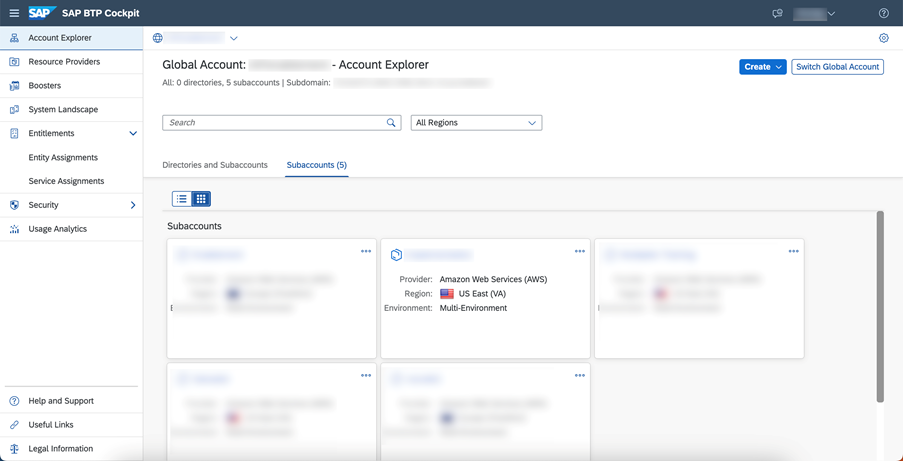

Check the entitlements for your account by clicking `Entitlements` and searching for SAP AI Core.

<!-- border -->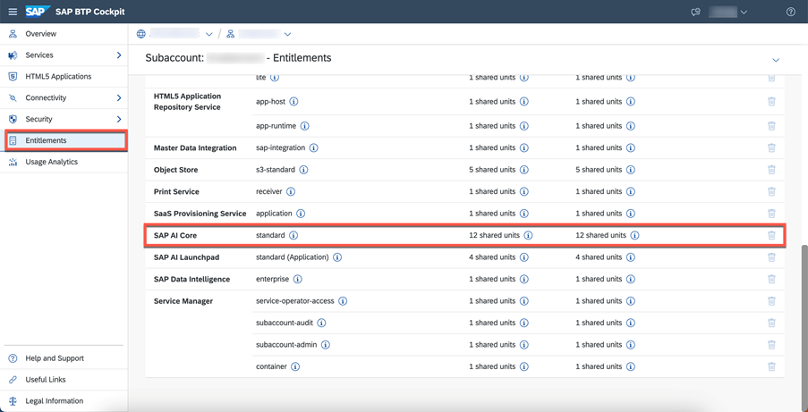

Click `Configure Entitlements` > `Add Service Plans`.

<!-- border -->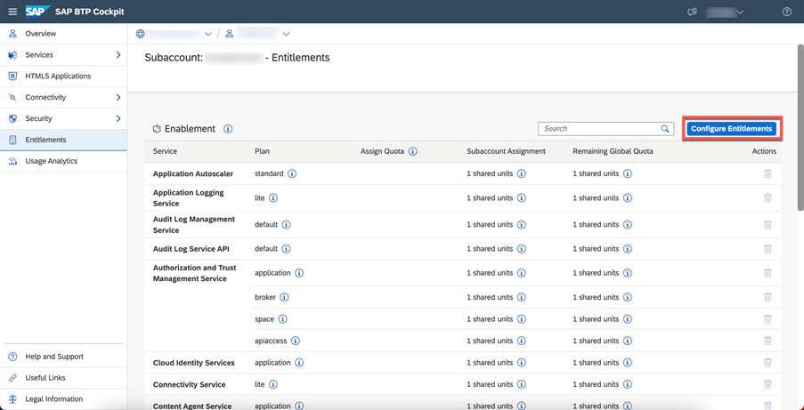
<!-- border -->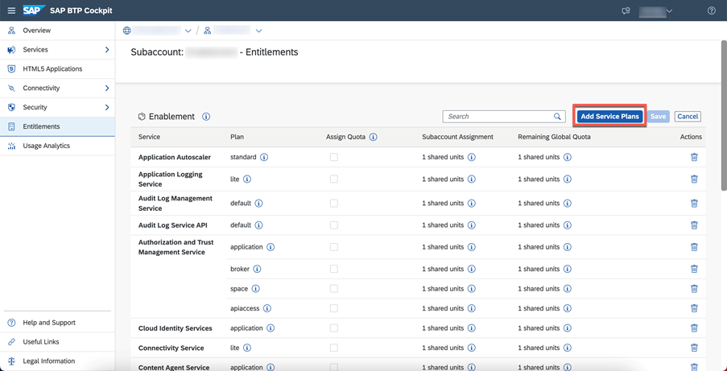

Select SAP AI Core and the `Free` service plan.

<!-- border -->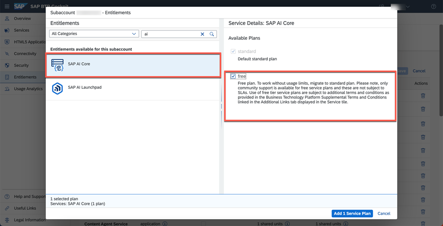

Save your new entitlement.

<!-- border -->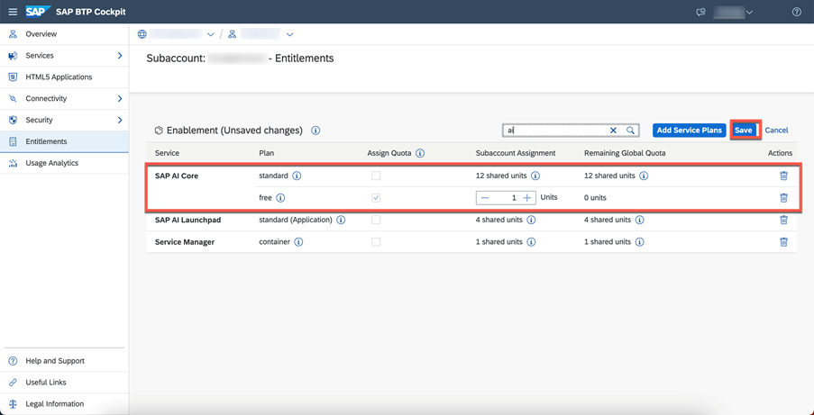

### Run the booster for SAP AI Core

Choose `Boosters` from the navigation pane. Find and choose the booster for `SAP AI Core` from the selection. 

<!-- border -->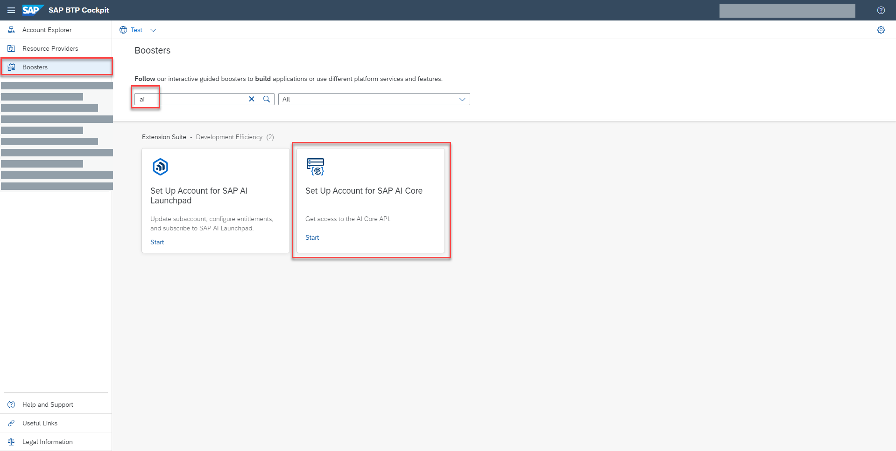

The booster tile contains information about SAP AI Core.  Click `Start` when you are ready. 

When you start a booster, a wizard opens up which guides you through the required steps.

<!-- border -->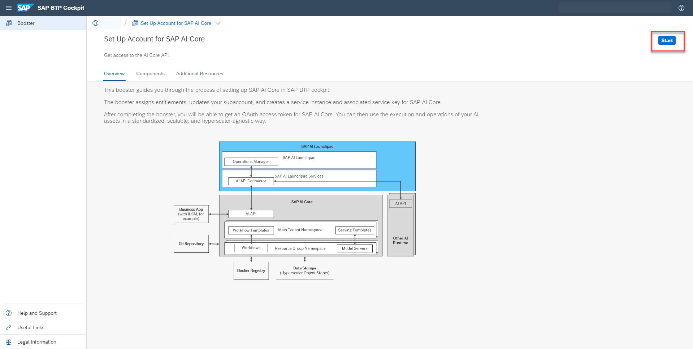
### View your instances and create your keys

In the subaccount section of SAP BTP Cockpit, choose `Services` from the left navigation menu and `Instances and subscriptions` from the page. 

<!-- border -->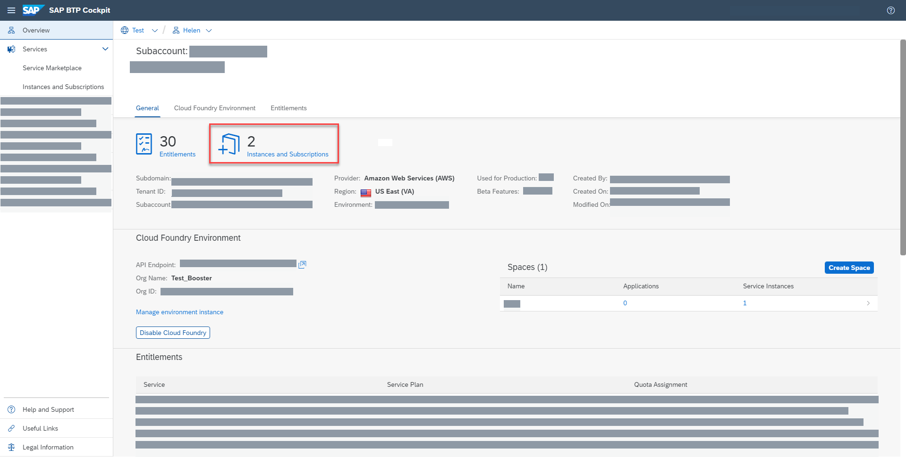

To see the details of your new instance, click the chevron on the entry.

To create the keys that you need to access your instance, click the three dots > `Create Service Key`.

<!-- border -->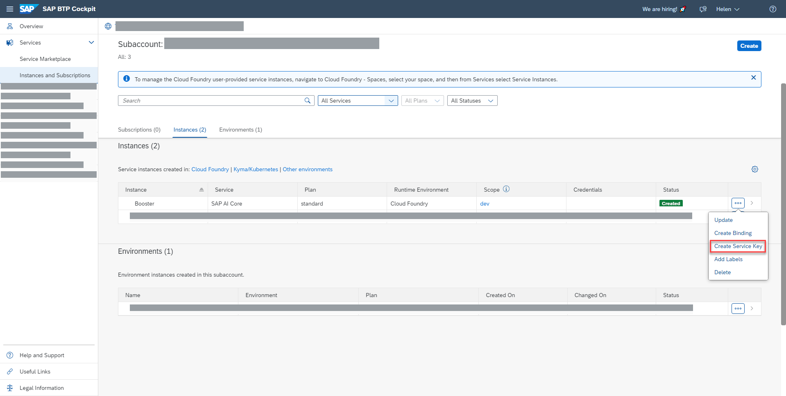

Enter a `Key Name` of your choice and click `Create`.

<!-- border -->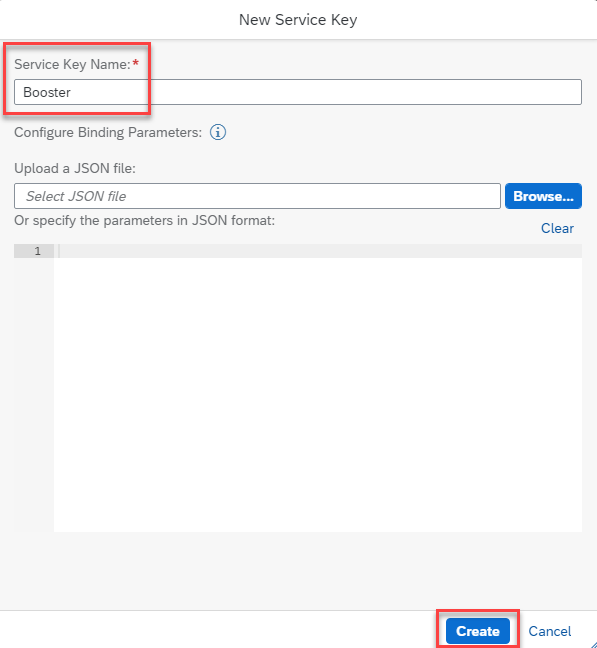
<!-- border -->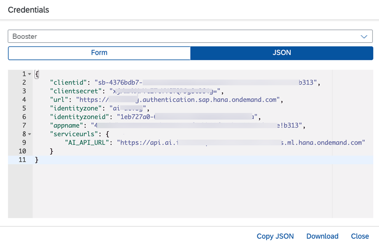

Once your keys have been created, you can view or download them at any time by locating the key and clicking the three dots and choosing from the available options.

<!-- border -->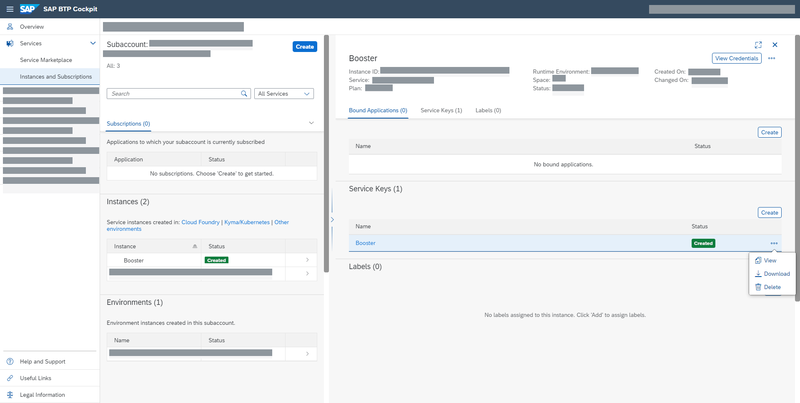

### Provision SAP AI Launchpad in your global account

> **Note:** SAP AI Launchpad is optional, but is the recommended interface for use with SAP AI Core.

Configure your entitlement as before, but select `SAP AI Launchpad`.

<!-- border -->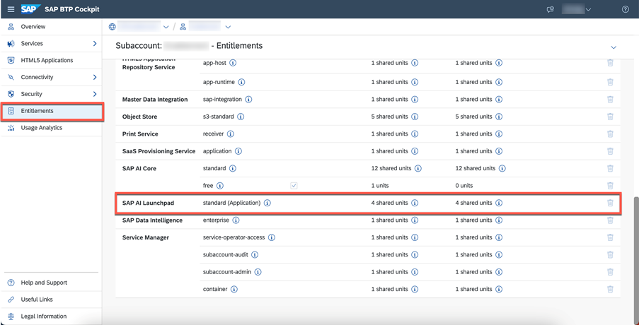
### Run the booster for SAP AI Launchpad

Choose `Boosters` from the navigation pane, and then choose the booster for `SAP AI Launchpad` from the selection. 

<!-- border -->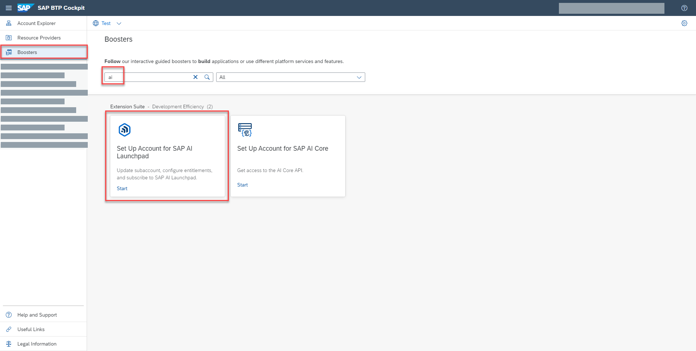

Click `Start` when you are ready.

<!-- border -->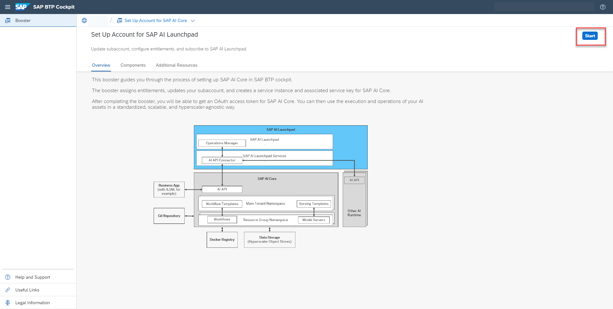
### View your instances

View your SAP AI Launchpad instance by navigating to `Instances and subscriptions, as you did to view your SAP AI Core instance. Again, to see the details of your new instance, click the chevron on the entry.

<!-- border -->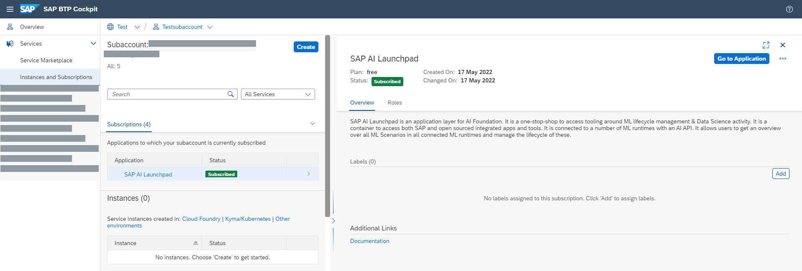
