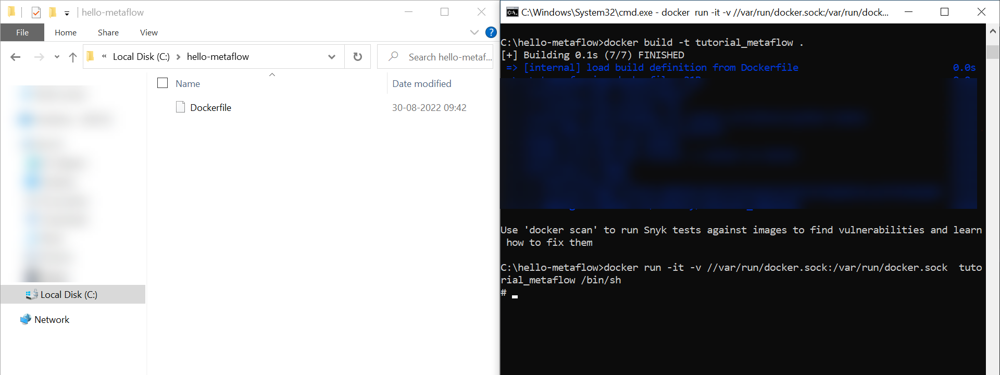
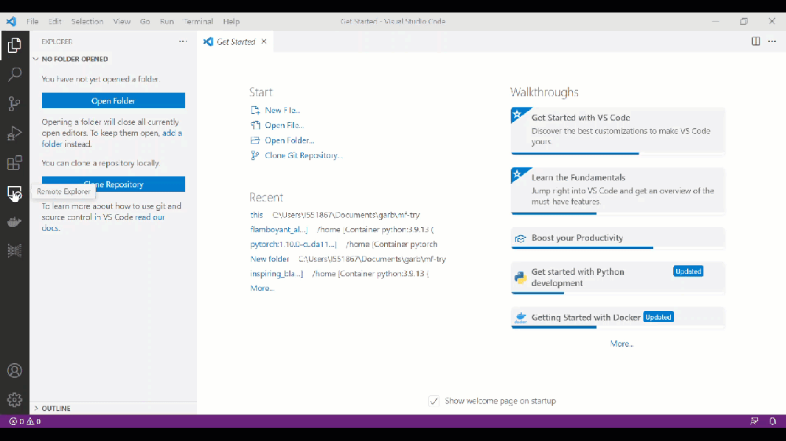
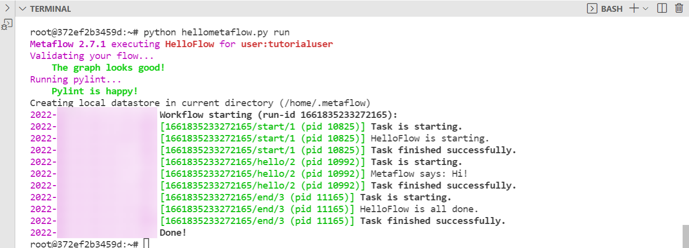

# Set Up the Metaflow Library for SAP AI Core
<!-- description --> Explore different ways of logging metrics during training. Compare generated models.

## Prerequisites
- You have Docker Desktop installed.
- You have created your first pipeline with SAP AI Core, using [this tutorial](https://developers.sap.com/tutorials/ai-core-code.html/#).

## You will learn
- How to create a sandbox Python or Docker environment.
- How to set up the Metaflow Python package for SAP AI Core
- How to run a local test of your Metaflow pipeline.

## Intro
Discover how Metaflow assists you, with diagrams and visualization from production to deployment. For more information, see the [the Metaflow documentation.](https://docs.metaflow.org/introduction/why-metaflow)

---

### Set up your system, and Python


[OPTION BEGIN [Linux & MacOS]]

> **CAUTION** **For Windows Users**: Please use an alternate option tab to set up. Otherwise the Metaflow library could cause issues in installation.

Download and install Python 3.X from [python.org](https://www.python.org/downloads/).

Create and activate a virtual Python environment using the following snippet. Note, `tutorial_metaflow` is the name of your environment. The Python virtual environment helps you install Python packages inside a sandbox-like environment. You use the environment to maintain required versions of the packages for your project.

```SHELL
python -m venv tutorial_metaflow
source tutorial_metaflow/bin/activate
```

Check which Python is used by your virtual environment. You can see the path of the Python executable in your virtual environment.

```SHELL
which python
```

[OPTION END]

[OPTION BEGIN [Docker environment (All OS)]]

Create a file named `Dockerfile` with following contents. This file stores instructions for Docker to build an image. You will run this Docker image in your local system to create a sandbox environment similar to a Virtual Machine.

```DOCKERFILE
FROM python
# FROM python:3.9.13 # (optional) specific version

RUN apt update
RUN apt install -y docker.io docker
```

Build the Docker image and run the Docker environment.  

```SHELL
docker build -t tutorial_metaflow .
docker run -it -v //var/run/docker.sock:/var/run/docker.sock  tutorial_metaflow /bin/sh
```

The command option description:

- `-v //var/run/docker.sock:/var/run/docker.sock` connects your system's Docker to the Docker contained within container of your sandbox environment.
- `-it` connects your system's terminal to the Shell terminal running inside your Docker container.

You should now use this Docker container as the sandbox environment to complete the tutorial.


<!-- border -->

> **INFORMATION** If you are developing with Visual Studio Code (VS Code), you may connect to your VS Code to this sandbox environment using following VS Code extensions: [Remote Explorer Extension by Microsoft](https://marketplace.visualstudio.com/items?itemName=ms-vscode.remote-explorer) and [Docker Extension by Microsoft](https://marketplace.visualstudio.com/items?itemName=ms-azuretools.vscode-docker)
>
> <!-- border -->


[OPTION END]

[OPTION BEGIN [Docker (Advanced computer vision)]]

> **INFORMATION** Only for users comfortable at self debugging code. If you are using Linux or MacOS then you may also try executing the lines from the Dockerfile without the `FROM` & `RUN` commands to set up in you local machine rather than in Docker's sandbox container.

Create file `Dockerfile` with following contents. The base Docker image is `pytorch v1.10` which is required for the `dectectron2` package of python.

```DOCKERFILE
FROM pytorch/pytorch:1.10.0-cuda11.3-cudnn8-runtime

RUN apt update
RUN apt install -y docker.io docker

# Libraries required for graphical processing
RUN apt install -y gcc g++
RUN apt install -y libgl1-mesa-glx libglib2.0-0

# Detectron 2 Installation
RUN pip install https://github.com/facebookresearch/detectron2/archive/refs/tags/v0.6.zip
```

Build the Docker image and run the Docker environment.

```SHELL
docker build -t tutorial_metaflow .
docker run -it -v //var/run/docker.sock:/var/run/docker.sock  tutorial_metaflow /bin/sh
```

The command option description:

- `-v //var/run/docker.sock:/var/run/docker.sock` connects your system's Docker to the Docker contained within container of your sandbox environment.
- `-it` connects your system's terminal to the Shell terminal running inside your Docker container.

You should now use this Docker container as the sandbox environment to complete the tutorial.


<!-- border -->
> **INFORMATION** If you are developing with Visual Studio Code (VS Code), you may connect to your VS Code to this sandbox environment using following VS Code extensions: [Remote Explorer Extension by Microsoft](https://marketplace.visualstudio.com/items?itemName=ms-vscode.remote-explorer) and [Docker Extension by Microsoft](https://marketplace.visualstudio.com/items?itemName=ms-azuretools.vscode-docker)
>
> <!-- border -->

[OPTION END]


### Set environment variables


Set your environment variables.

```SHELL
# set username if not set
export USERNAME=tutorialuser

# set location to find settings (configuration) for metaflow, customizable
export HOME=/root
```


### Install Metaflow package


Install the Metaflow package.

```SHELL
pip install sap-ai-core-metaflow
```


### Configure Metaflow


Create a configuration file for Metaflow. Metaflow uses settings from configurations to store snippets of pipeline in your AWS S3 storage.

```SHELL
mkdir -p $HOME/.metaflowconfig
touch $HOME/.metaflowconfig/config.json
```

Edit the following snippet and the paste in the `config.json` file, created above. Replace `<YOUR_S3_BUCKET_NAME>` with AWS S3 bucket ID that you want Metaflow to use to store files.

```JSON [2-3]
{
    "METAFLOW_DATASTORE_SYSROOT_S3": "s3://<YOUR_S3_BUCKET_NAME>/metaflow",
    "METAFLOW_DATATOOLS_SYSROOT_S3": "s3://<YOUR_S3_BUCKET_NAME>/metaflow/data",
    "METAFLOW_DEFAULT_DATASTORE": "s3"
}
```


### Configure AWS


Create a credentials file for your AWS S3 Object Store. The file is used by the Metaflow package access your AWS S3 store.

```SHELL
mkdir -p $HOME/.aws
touch $HOME/.aws/credentials
```

Edit the following snippet and paste it in your `credentials` file. Replace `<YOUR_S3_ACCESS...>` with your AWS S3 credentials, **do not** enclose your credentials within quotes(`""`).

```TEXT [2-3]
[default]
aws_access_key_id = <YOUR_S3_ACCESS_ID>
aws_secret_access_key = <YOUR_S3_ACCESS_KEY>
```

> **INFORMATION** the Metaflow library for SAP AI Core uses AWS, however you may skip the installation of AWS CLI.


### Metaflow HelloWorld


Create a file `hellometaflow.py` with following contents.

```PYTHON
# You should divide the contents of the steps of the pipeline file into different python modules.
# However the contents within each step may have snippets imported from separate python packages/modules.
from metaflow import FlowSpec, step


class HelloFlow(FlowSpec):
    """
    A flow where Metaflow prints 'Hi'.

    Run this flow to validate that Metaflow is installed correctly.

    """

    @step
    def start(self):
        """
        This is the 'start' step. All flows must have a step named 'start' that
        is the first step in the flow.

        """
        print("HelloFlow is starting.")
        self.next(self.hello)

    @step
    def hello(self):
        """
        A step for metaflow to introduce itself.

        """
        print("Metaflow says: Hi!")
        self.next(self.end)

    @step
    def end(self):
        """
        This is the 'end' step. All flows must have an 'end' step, which is the
        last step in the flow.

        """
        print("HelloFlow is all done.")


if __name__ == "__main__":
    HelloFlow()
```

> **INFORMATION** You may discover more snippets in the [official Metaflow tutorials.](https://docs.metaflow.org/getting-started/tutorials)


### Run Metaflow pipeline locally


Inspect the steps of the Metaflow pipeline `hellometaflow.py` using following snippet.

```SHELL
python hellometaflow.py show
```

Run this snippet locally.

```SHELL
python hellometaflow.py run
```

<!-- border -->


### Save set up environment


[OPTION BEGIN [Python virtual environment]]

To deactivate Python virtual environment, use the following command.

```SHELL
deactivate
```

[OPTION END]


[OPTION BEGIN [Docker environment]]

> **CAUTION**: These steps are only applicable if you used the Docker environment in the step 1.

Docker containers are ephemeral, meaning that the installation you did inside will lost upon closing. To save the changes, first locate your container ID using the following snippet on your local system (not inside the Docker container).

```SHELL
docker ps
```

Use container resulting container ID to save the changes, including files, installations and commands, in the form of Docker images:

```SHELL
docker commit <CONTAINER_ID> tutorial_metaflow:0.1
```

You may now close the Docker Container, by using the `exit` command inside your Docker container.

<!-- border -->

To pick up where you left off, use the following snippet. Ensure you are using the tag `:01` with which you saved the changes.

```SELL
docker run -it -v //var/run/docker.sock:/var/run/docker.sock tutorial_metaflow:0.1 /bin/sh
```

[OPTION END]

