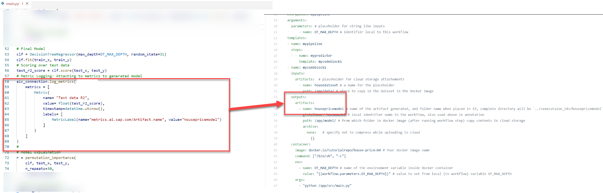
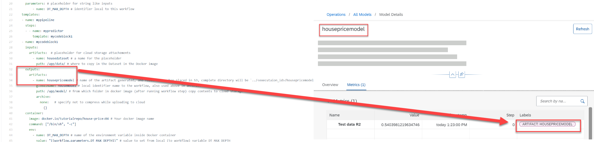

## Prerequisites
- You have the knowledge on ingesting data and generating models with SAP AI Core, from [this tutorial](https://developers.sap.com/tutorials/ai-core-data.html/#)

## Details
### You will learn
- How to log simple metrics on validation data and training data
- How to log step information along with metrics
- How to log custom metrics structure

By the end of the tutorial you will be able to use SAP AI Launchpad to compare two models that have been generated with SAP AI Core. This tutorial builds on the previous tutorials on house price prediction and ingesting data.

> Important: Comparing functionality is only available the SAP AI Launchpad interface, and not the API endpoints. However, this step is optional.

---

[ACCORDION-BEGIN [Step 1: ](Starter code)]

Create a folder named `hello-aicore-metrics`. Within it, create a file called `main.py`, and paste the following starter code to this file.

```PYTHON
import os
from sklearn.tree import DecisionTreeRegressor
from sklearn.model_selection import KFold, train_test_split
from sklearn.inspection import permutation_importance
from datetime import datetime
import pandas as pd
from ai_core_sdk.models import Metric, MetricTag, MetricCustomInfo, MetricLabel
#
# Logging Metrics: SAP AI Core connection (Step 2)
# <PASTE CODE HERE>
#
# Variables
DATA_PATH = '/app/data/train.csv'
DT_MAX_DEPTH= int(os.getenv('DT_MAX_DEPTH'))
MODEL_PATH = '/app/model/model.pkl'
#
# Load Datasets
df = pd.read_csv(DATA_PATH)
X = df.drop('target', axis=1)
y = df['target']
#
# Metric Logging: Basic (Step 3)
# <PASTE CODE HERE>
#
# Partition into Train and test dataset
train_x, test_x, train_y, test_y = train_test_split(X, y, test_size=0.3)
#
# K-fold
kf = KFold(n_splits=5, random_state=31, shuffle=True)
i = 0 # storing step count
for train_index, val_index in kf.split(train_x):
    i += 1
    # Train model on subset
    clf = DecisionTreeRegressor(max_depth=DT_MAX_DEPTH, random_state=31)
    clf.fit(train_x.iloc[train_index], train_y.iloc[train_index])
    # Score on validation data (hold-out dataset)
    val_step_r2 = clf.score(train_x.iloc[val_index], train_y.iloc[val_index])
    # Metric Logging: Step Information (Step 4)
    # <PASTE CODE HERE>
    # Delete step model
    del(clf)
#
# Final Model
clf = DecisionTreeRegressor(max_depth=DT_MAX_DEPTH, random_state=31)
clf.fit(train_x, train_y)
# Scoring over test data
test_r2_score = clf.score(test_x, test_y)
# Metric Logging: Attaching to metrics to generated model (Step 5)
# <PASTE CODE HERE>
#
# Model Explaination
r = permutation_importance(
    clf, test_x, test_y,
    n_repeats=30,
    random_state=0
)
# Feature importances
feature_importances = str('')
for i in r.importances_mean.argsort()[::-1]:
    feature_importances += f"{df.columns[i]}: {r.importances_mean[i]:.3f} +/- {r.importances_std[i]:.3f} \n"
# Metric Logging: Custom Structure (Step 6)
# <PASTE CODE HERE>
#
# Save model
import pickle
pickle.dump(clf, open(MODEL_PATH, 'wb'))
#
# Metric Logging: Tagging the execution (Step 7)
# <PASTE CODE HERE>
```

> Note that the snippet includes some place holders that say `# <PASTE CODE HERE>`. We complete these entries throughout the tutorial. For clarity, the comments in the code also include the relevant step number.

This Python script contains all of the modifications needed for logging metrics, meaning that you can leave your previous workflows as they are.

[DONE]
[ACCORDION-END]

[ACCORDION-BEGIN [Step 2: ](Add connection)]

Add the following connection snippet. The initialization value of `base_url=''` - an empty string - is mandatory, as it indicates the code should be connected to the SAP AI Core environment.

```PYTHON
from ai_core_sdk.ai_core_v2_client import AICoreV2Client
aic_connection = AICoreV2Client(base_url='') # DO NOT Change, the value is intentionally passed as empty string, When this code will run inside SAP AI Core then the values will be auto-populated
...
```

> **CAUTION**: The above code is very similar to the code used to connect the SAP AI Core SDK to your local system. However, here it is required to establish connection within the SAP AI Core execution environment.

[DONE]
[ACCORDION-END]

[ACCORDION-BEGIN [Step 3: ](Add Basic metric logging)]

Add the following snippet to log the number of observations in your dataset.

```PYTHON
aic_connection.metrics.log_metrics(
    metrics = [
        Metric(
            name= "N_observations", value= float(df.shape[0]), timestamp=datetime.utcnow()),
    ]
)
```

This reflects, after execution, as shown in SAP AI Launchpad, please zoom in to view.

!

[DONE]
[ACCORDION-END]

[ACCORDION-BEGIN [Step 4: ](Step information)]

Add the following snippet to store the metrics on step information. This snippet is also useful for tracking the metrics on epochs of the training process.

```PYTHON
aic_connection.metrics.log_metrics(
    metrics = [
        Metric(name= "(Val) Fold R2", value= float(val_step_r2), timestamp=datetime.utcnow(), step=i),
    ]
)
```

The variable `i` in is already present in your code to pass to the parameter `step=i`. This reflects as shown in SAP AI Launchpad, when executed. Please zoom in to view.

!

[DONE]
[ACCORDION-END]

[ACCORDION-BEGIN [Step 5: ](Attach metrics to generated model)]

Add the following snippet to store metrics on step information.

```PYTHON
aic_connection.metrics.log_metrics(
    metrics = [
        Metric(
            name= "Test data R2",
            value= float(test_r2_score),
            timestamp=datetime.utcnow(),
            labels= [
                MetricLabel(name="metrics.ai.sap.com/Artifact.name", value="housepricemodel")
            ]
        )
    ]
)
```

The parameter `value="housepricemodel"` refers to the artifact name, which references the model that will be stored in AWS S3. It is vital that the name of this parameter matches the name that you defined in your yaml workflow.

Your code should resemble:

!

This reflects as shown in SAP AI Launchpad, when executed:
!

[DONE]
[ACCORDION-END]

[ACCORDION-BEGIN [Step 6: ](Custom Metrics for model inspection)]

Add the following snippet to store metrics based on a customized structure.

```PYTHON
aic_connection.metrics.set_custom_info(
    custom_info= [
        MetricCustomInfo(name= "Feature Importance (verbose)", value=  str(r)),
        MetricCustomInfo(name= "Feature Importance (brief)", value= feature_importances )
    ]
)
```

The structure must be type-cast to `str` (string). Here, the structure used is [**permutation feature importance**](https://scikit-learn.org/stable/modules/permutation_importance.html#permutation-importance).

The variables `r` and `feature_importances` are already created in the starter code.

This reflects as shown in SAP AI Launchpad, when executed:

!

> ### Permutation Feature Importance
>
> Sources: [`Scikit Learn Python Package`](https://scikit-learn.org/stable/modules/permutation_importance.html#permutation-importance)
>
> What it is?
>
> - Indicates, for a given target, model, dataset and task, how much the model depends on a given feature.
> - Gives an empirical estimate of how much loss is attributed to the removal of a given feature.
>
> What it is not:
>
> - A model, dataset or task agnostic indication of the importance of a given feature. While the method is agnostic, the results are applicable only to the specific input combination.
> - A perfectly accurate indication of the importance of a given feature for a specific prediction. While this is the goal of the method, it does not account for weaknesses in the model.
>
> Advantages:
>
> - Model agnostic,
> - provides global `explainability` - meaning that it estimates each feature's importance to the prediction task.
> - contributes to model transparency.
> - The method or function used to measure "error" can be customized, with reference to `scikit` package implementation.


[DONE]
[ACCORDION-END]

[ACCORDION-BEGIN [Step 6: ](Tags for execution meta after training)]

Add the following snippet to tag you execution. The `tags` are customizable key-values.

```PYTHON
aic_connection.metrics.set_tags(
    tags= [
        MetricTag(name="Validation Method Used", value= "K-Fold"), # your custom name and value
        MetricTag(name="Metrics", value= "R2"),
    ]
)
```

This reflects as shown in SAP AI Launchpad, when executed:

!

[DONE]
[ACCORDION-END]

[ACCORDION-BEGIN [Step 7: ](Complete Files)]

Check your modified `main.py` by comparing it with the following expected `main.py`.

```PYTHON
import os
from sklearn.tree import DecisionTreeRegressor
from sklearn.model_selection import KFold, train_test_split
from sklearn.inspection import permutation_importance
from datetime import datetime
import pandas as pd
from ai_core_sdk.models import Metric, MetricTag, MetricCustomInfo, MetricLabel
#
from ai_core_sdk.ai_core_v2_client import AICoreV2Client
aic_connection = AICoreV2Client(base_url='') # DO NOT Change, the value is intentionally passed as empty string, When this code will run inside SAP AI Core then the values will be auto-populated
#
# Variables
DATA_PATH = '/app/data/train.csv'
DT_MAX_DEPTH= int(os.getenv('DT_MAX_DEPTH'))
MODEL_PATH = '/app/model/model.pkl'
#
# Load Datasets
df = pd.read_csv(DATA_PATH)
X = df.drop('target', axis=1)
y = df['target']
#
# Metric Logging: Basic
aic_connection.metrics.log_metrics(
    metrics = [
        Metric(
            name= "N_observations", value= float(df.shape[0]), timestamp=datetime.utcnow()),
    ]
)
#
# Partition into Train and test dataset
train_x, test_x, train_y, test_y = train_test_split(X, y, test_size=0.3)
#
# K-fold
kf = KFold(n_splits=5, random_state=31, shuffle=True)
i = 0 # storing step count
for train_index, val_index in kf.split(train_x):
    i += 1
    # Train model on subset
    clf = DecisionTreeRegressor(max_depth=DT_MAX_DEPTH, random_state=31)
    clf.fit(train_x.iloc[train_index], train_y.iloc[train_index])
    # Score on validation data (hold-out dataset)
    val_step_r2 = clf.score(train_x.iloc[val_index], train_y.iloc[val_index])
    # Metric Logging: Step Information
    aic_connection.metrics.log_metrics(
        metrics = [
            Metric(name= "(Val) Fold R2", value= float(val_step_r2), timestamp=datetime.utcnow(), step=i),
        ]
    )
    # Delete step model
    del(clf)
#
# Final Model
clf = DecisionTreeRegressor(max_depth=DT_MAX_DEPTH, random_state=31)
clf.fit(train_x, train_y)
# Scoring over test data
test_r2_score = clf.score(test_x, test_y)
# Metric Logging: Attaching to metrics to generated model
aic_connection.metrics.log_metrics(
    metrics = [
        Metric(
            name= "Test data R2",
            value= float(test_r2_score),
            timestamp=datetime.utcnow(),
            labels= [
                MetricLabel(name="metrics.ai.sap.com/Artifact.name", value="housepricemodel")
            ]
        )
    ]
)
#
# Model Explaination
r = permutation_importance(
    clf, test_x, test_y,
    n_repeats=30,
    random_state=0
)
# Feature importances
feature_importances = str('')
for i in r.importances_mean.argsort()[::-1]:
    feature_importances += f"{df.columns[i]}: {r.importances_mean[i]:.3f} +/- {r.importances_std[i]:.3f} \n"
# Metric Logging: Custom Structure
aic_connection.metrics.set_custom_info(
    custom_info= [
        MetricCustomInfo(name= "Feature Importance (verbose)", value=  str(r)),
        MetricCustomInfo(name= "Feature Importance (brief)", value= feature_importances )
    ]
)
#
# Save model
import pickle
pickle.dump(clf, open(MODEL_PATH, 'wb'))
#
# Metric Logging: Tagging the execution
aic_connection.metrics.set_tags(
    tags= [
        MetricTag(name="Validation Method Used", value= "K-Fold"), # your custom name and value
        MetricTag(name="Metrics", value= "R2"),
    ]
)
```

Check your modified `main.py` by comparing it with the following expected `main.py`.

```TEXT
sklearn==0.0
pandas
ai-core-sdk>=1.12.0
```

Create a file called `Dockerfile` with following snippet. This file must not have a file extension or alternative name.

```TEXT
# Specify which base layers (default dependencies) to use
# You may find more base layers at https://hub.docker.com/
FROM python:3.7
#
# Creates directory within your Docker image
RUN mkdir -p /app/src/
# Don't place anything in below folders yet, just create them
RUN mkdir -p /app/data/
RUN mkdir -p /app/model/
#
# Copies file from your Local system TO path in Docker image
COPY main.py /app/src/
COPY requirements.txt /app/src/  
#
# Installs dependencies within you Docker image
RUN pip3 install -r /app/src/requirements.txt
#
# Enable permission to execute anything inside the folder app
RUN chgrp -R 65534 /app && \
    chmod -R 777 /app
```

Build your Docker image and push the contents to the cloud, using the following commands in the terminal.

```BASH
docker build -t <YOUR_DOCKER_REGISTRY>/<YOUR_DOCKER_USERNAME>/house-price:04 .
docker push <YOUR_DOCKER_REGISTRY>/<YOUR_DOCKER_USERNAME>/house-price:04
```

Paste the following snippet to a file named `hello-metrics.yaml` in your GitHub repository. Edit it with you own Docker registry secret and username. This file is your AI workflow file.

```YAML
apiVersion: argoproj.io/v1alpha1
kind: WorkflowTemplate
metadata:
  name: house-metrics-train # executable id, must be unique across all your workflows (YAML files)
  annotations:
    scenarios.ai.sap.com/description: "Learning how to ingest data to workflows"
    scenarios.ai.sap.com/name: "House Price (Tutorial)" # Scenario name should be the use case
    executables.ai.sap.com/description: "Generate metrics"
    executables.ai.sap.com/name: "training-metrics" # Executable name should describe the workflow in the use case
    artifacts.ai.sap.com/housedataset.kind: "dataset" # Helps in suggesting the kind of artifact that can be attached.
    artifacts.ai.sap.com/housemodel.kind: "model" # Helps in suggesting the kind of artifact that can be generated.
  labels:
    scenarios.ai.sap.com/id: "learning-datalines"
    ai.sap.com/version: "2.0"
spec:
  imagePullSecrets:
    - name: credstutorialrepo # your docker registry secret
  entrypoint: mypipeline
  arguments:
    parameters: # placeholder for string like inputs
        - name: DT_MAX_DEPTH # identifier local to this workflow
  templates:
  - name: mypipeline
    steps:
    - - name: mypredictor
        template: mycodeblock1
  - name: mycodeblock1
    inputs:
      artifacts:  # placeholder for cloud storage attachements
        - name: housedataset # a name for the placeholder
          path: /app/data/ # where to copy in the Dataset in the Docker image
    outputs:
      artifacts:
        - name: housepricemodel # name of the artifact generated, and folder name when placed in S3, complete directory will be `../<executaion_id>/housepricemodel`
          globalName: housemodel # local identifier name to the workflow, also used above in annotation
          path: /app/model/ # from which folder in docker image (after running workflow step) copy contents to cloud storage
          archive:
            none:   # specify not to compress while uploading to cloud
              {}
    container:
      image: docker.io/<YOUR_DOCKER_USERNAME>/house-price:04 # Your docker image name
      command: ["/bin/sh", "-c"]
      env:
        - name: DT_MAX_DEPTH # name of the environment variable inside Docker container
          value: "{{workflow.parameters.DT_MAX_DEPTH}}" # value to set from local (to workflow) variable DT_MAX_DEPTH
      args:
        - "python /app/src/main.py"
```

[DONE]
[ACCORDION-END]


[ACCORDION-BEGIN [Step 9: ](Create configuration and execution)]

Create a configuration using the following information. The information is taken from the workflow from previous steps. For a reminder of how to create a configuration, see step 11 of [this tutorial](https://developers.sap.com/tutorials/ai-core-data.html/#).

|  | Value |
| --- | --- |
| Configuration Name | House Price (Jan) metrics |
| Scenario Name | `House Price (Tutorial)`
| Version | `2.0`
| Executable Name | `training-metrics`
| Scenario ID | `learning-datalines`
| Executable ID | `house-metrics-train`

The value for `Input Parameters` `DT_MAX_DEPTH` is your choice. Until now, we have set this using an environment variable. If no variable is specified, this parameter will continue to be defined by the environment variables.

> Information: This parameter can be defined using an integer to set a maximum depth or as `None`, which means that nodes are expanded until all leaves are single nodes, or contain all contain fewer data points than specified in the `min_samples_split samples`, if specified. For more information, see [the Scikit learn documentation](https://scikit-learn.org/stable/modules/generated/sklearn.tree.DecisionTreeClassifier.html\#)

Attach your registered artifact to `Input Artifact`, by specifying `housedataset` for this value.

Create an execution from this configuration.

[DONE]
[ACCORDION-END]

[ACCORDION-BEGIN [Step 10: ](Retrieve metrics)]


[OPTION BEGIN [SAP AI Launchpad]]

Click through `ML Operations` >  `Executions` > `Metrics Resource` tab of your execution.

!

For metrics tagged with the artifact name, you can also locate the metrics in the **Models** details page of the artifact.

!

[OPTION END]


[OPTION BEGIN [Postman]]

Click through `AI Core` > `lm` > `metrics` > `Get metrics` and double check the `executionId`.

!

[OPTION END]

[OPTION BEGIN [SAP AI Core SDK]]

Paste and edit, and execute the following snippet:

```PYTHON
response = ai_core_client.metrics.query(
    execution_ids = [
        'e1f2169db8760b5d' # list of execution IDs for which to query metrics
    ],
    select=["metrics","tags", "customInfo"], # Optional, if not supplied then all the metrics resources are retrieved.
    resource_group = 'default'
)


for execution in response.resources:
  print("Execution ID:", execution.execution_id)
  print("Metrics")
  for metric in execution.metrics:
      print(metric.__dict__)
  for tag in execution.tags:
      print(tag.__dict__)
  for custom_metric in execution.custom_info:
      print(" Name: ", custom_metric.name)
      print("  Value: ", custom_metric.value)
  print('')
```


**OUTPUT**

```
Execution ID: e1f2169db8760b5d
Metrics
{'name': '(Val) Fold R2', 'value': 0.5182814362664407, 'timestamp': datetime.datetime(2022, 4, 25, 7, 52, 59), 'step': 1, 'labels': []}
{'name': '(Val) Fold R2', 'value': 0.5038220342940908, 'timestamp': datetime.datetime(2022, 4, 25, 7, 52, 59), 'step': 2, 'labels': []}
{'name': '(Val) Fold R2', 'value': 0.5137276831150328, 'timestamp': datetime.datetime(2022, 4, 25, 7, 52, 59), 'step': 3, 'labels': []}
{'name': '(Val) Fold R2', 'value': 0.5397039116247253, 'timestamp': datetime.datetime(2022, 4, 25, 7, 53), 'step': 4, 'labels': []}
{'name': '(Val) Fold R2', 'value': 0.5325857010663992, 'timestamp': datetime.datetime(2022, 4, 25, 7, 53), 'step': 5, 'labels': []}
{'name': 'N_observations', 'value': 20640.0, 'timestamp': datetime.datetime(2022, 4, 25, 7, 52, 59), 'step': 0, 'labels': []}
{'name': 'Test data R2', 'value': 0.5403981219634746, 'timestamp': datetime.datetime(2022, 4, 25, 7, 53), 'step': 0, 'labels': [<ai_api_client_sdk.models.metric_label.MetricLabel object at 0x00000215B8EFA850>]}
{'name': 'Validation Method Used', 'value': 'K-Fold'}
{'name': 'Metrics', 'value': 'R2'}
...
 Name:  Feature Importance (brief)
  Value:  MedInc: 1.069 +/- 0.017
AveOccup: 0.126 +/- 0.005
AveRooms: 0.025 +/- 0.002
Longitude: 0.000 +/- 0.000
Latitude: 0.000 +/- 0.000
Population: 0.000 +/- 0.000
AveBedrms: 0.000 +/- 0.000
HouseAge: 0.000 +/- 0.000
Unnamed: 0: 0.000 +/- 0.000  
```

[OPTION END]

[DONE]

[ACCORDION-END]

[ACCORDION-BEGIN [Step 11: ](Compare metrics (optional))]

Create two configurations: one with `DT_MAX_DEPTH = 3` and another with `DT_MAX_DEPTH = 6`. Then create executions for both of those configurations.

!

You can then get a metric wise comparison of the executions from the two different configurations.

!

[VALIDATE_1]

[ACCORDION-END]
