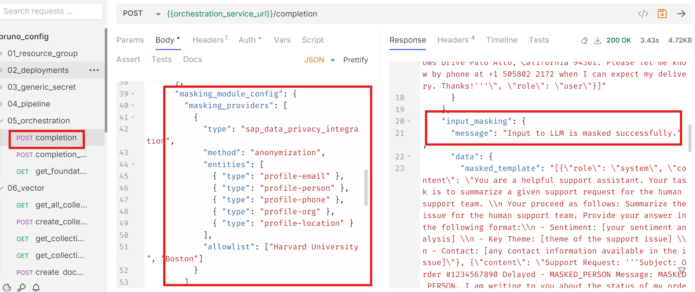
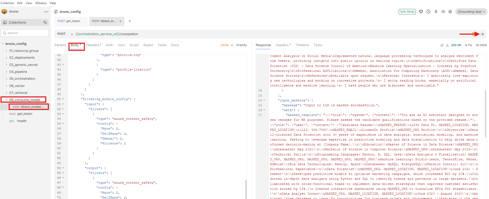

# Leveraging Orchestration Capabilities to Enhance Responses
<!-- description -->  In this tutorial, we will explore advanced orchestration capabilities available in the Gen AI Hub, including features such as Data Masking and Content Filtering.

## You will learn
- Inference of GenAI models using orchestration along with Data Masking and Content Filtering features

## Prerequisites
1. **BTP Account**  
   Set up your SAP Business Technology Platform (BTP) account.  
   [Create a BTP Account](https://developers.sap.com/group.btp-setup.html)

2. **For SAP Developers or Employees**  
   Internal SAP stakeholders should refer to the following documentation:  
   [How to create BTP Account For Internal SAP Employee](https://me.sap.com/notes/3493139)

   [SAP AI Core Internal Documentation](https://help.sap.com/docs/sap-ai-core)

3. **For External Developers, Customers, or Partners**  
   Follow this tutorial to set up your environment and entitlements:  
   [External Developer Setup Tutorial](https://developers.sap.com/tutorials/btp-cockpit-entitlements.html)

   [SAP AI Core External Documentation](https://help.sap.com/docs/sap-ai-core?version=CLOUD)

4. **Create BTP Instance and Service Key for SAP AI Core**  
   Follow the steps to create an instance and generate a service key for SAP AI Core:  
   [Create Service Key and Instance](https://help.sap.com/docs/sap-ai-core/sap-ai-core-service-guide/create-service-key?version=CLOUD)

5. **AI Core Setup Guide**  
   Step-by-step guide to set up and get started with SAP AI Core:  
   [AI Core Setup Tutorial](https://developers.sap.com/tutorials/ai-core-setup.html)

6. An Extended SAP AI Core service plan is required, as the Generative AI Hub is not available in the Free or Standard tiers. For more details, refer to [SAP AI Core Service Plans](https://help.sap.com/docs/sap-ai-core/sap-ai-core-service-guide/service-plans?version=CLOUD)

7. **Orchestration Deployment**:
    
    Refer to the tutorial [the basic consumption of GenAI models using orchestration](https://developers.sap.com/tutorials/ai-core-orchestration-consumption.html) and ensure at least one orchestration deployment is ready to be consumed during this process. 

8. Basic Knowledge:
    Familiarity with the orchestration workflow is recommended

### Pre-Read

This tutorial builds on the foundational orchestration concepts introduced in the [beginner's tutorial](https://developers.sap.com/tutorials/ai-core-orchestration-consumption.html) and focuses on enhancing GenAI responses using orchestration modules such as **data masking** and **content filtering**.

Previously in the [beginner's tutorials](https://developers.sap.com/tutorials/ai-core-orchestration-consumption.html), we used a **resume processing use case** to illustrate how to create orchestration workflow with the required modules only, consume models and easily switch different models using harmonized API. In this tutorial, we extend that use case to demonstrate how sensitive data can be protected and undesirable content filtered using optional orchestration modules such as **Data Masking**, **Content filtering**.

**Data masking** in SAP AI Core allows you to anonymize or pseudonymize personal or confidential data before sending it to the generative AI model.  
🔗 [Learn more about Data Masking in SAP AI Core](https://help.sap.com/docs/sap-ai-core/sap-ai-core-service-guide/data-masking?version=CLOUD)

**Content filtering** helps identify and block inappropriate, offensive, or non-compliant input and output content within an orchestration workflow.  
🔗 [Learn more about Content Filtering in SAP AI Core](https://help.sap.com/docs/sap-ai-core/sap-ai-core-service-guide/input-filtering?version=CLOUD)

In this tutorial, we specifically focus on **data masking** and **content filtering**. Other orchestration modules such as **translation** and **grounding** are also available in SAP AI Core and it is covered in Separate tutorials.

You will learn how to:

- Integrate data masking within the orchestration flow to safeguard personal or confidential information.
- Apply content filtering to identify and restrict inappropriate or non-compliant responses.
- Use relevant SAP AI Core features and configurations to support these capabilities.

By the end of this tutorial
  * you'll understand how to design a secure and controlled orchestration pipeline suitable for **enterprise-grade GenAI applications**.
  * Learn how to implement the solution using **SAP AI Launchpad**, **Python SDK**, **Java**, **JavaScript**, and **Bruno**.

Refer to the [orchestration documentation](https://help.sap.com/docs/sap-ai-core/sap-ai-core-service-guide/orchestration-8d022355037643cebf775cd3bf662cc5?locale=en-US&version=CLOUD) for more information.

### Accessing Orchestration Capabilities

[OPTION BEGIN [AI Launchpad]]

**In this tutorial**, we will build upon the orchestration framework introduced in [Tutorial](https://developers.sap.com/tutorials/ai-core-orchestration-consumption.html). The focus will shift from basic orchestration to leveraging optional advanced modules to enhance data privacy and refine response quality. These enhancements include: 

  -	**Data Masking**: Hiding sensitive information like phone numbers, organizational details, or personal identifiers. 
  -	**Content Filtering**: Screening for categories such as hate speech, self-harm, explicit content, and violence to ensure safe and relevant responses. 

**Access the Generative AI Hub:** 
- Navigate to the resource group where your orchestration has been deployed. 

- Go to Generative AI Hub. 

- Select Orchestration and click on Templating. 


[OPTION END]

[OPTION BEGIN [Python SDK]]

- **In this tutorial**, we will build upon the orchestration framework introduced in [Tutorial](https://developers.sap.com/tutorials/ai-core-orchestration-consumption.html). The focus will shift from basic orchestration to leveraging optional advanced modules to enhance data privacy and refine response quality. These enhancements include: 

    -	**Data Masking**: Hiding sensitive information like phone numbers, organizational details, or personal identifiers. 

    -	**Content Filtering**: Screening for categories such as hate speech, self-harm, explicit content, and violence to ensure safe and relevant responses.

- Here, we extend the use case introduced in Previous Tutorial, where orchestration was executed without incorporating data masking or content filtering. Here, we will include these advanced modules to improve data privacy, security, and response quality. 

**NOTE** : If you are continuing with the same notebook from the previous tutorial, skip steps 1 and 2. Otherwise, create a new notebook using the already deployed orchestration URL to access the Harmonized API. 


- The [cv.txt](img/cv.txt) file, containing the resume content, must be added to the working directory. Use the following code to load the file content:


```python

from gen_ai_hub.orchestration.utils import load_text_file 
# Load the CV file content 
cv_file_path = "cv.txt"  # Specify the correct path to the CV file 
cv_content = load_text_file(cv_file_path) 
# Print the content to verify it has been loaded 
print(cv_content)

```

[OPTION END]

[OPTION BEGIN [JavaScript SDK]]

- **In this tutorial**, we will build upon the orchestration framework introduced in [Tutorial](https://developers.sap.com/tutorials/ai-core-orchestration-consumption.html). The focus will shift from basic orchestration to leveraging optional advanced modules to enhance data privacy and refine response quality. These enhancements include: 

    -	**Data Masking**: Hiding sensitive information like phone numbers, organizational details, or personal identifiers. 

    -	**Content Filtering**: Screening for categories such as hate speech, self-harm, explicit content, and violence to ensure safe and relevant responses.

- Here, we extend the use case introduced in Previous Tutorial, where orchestration was executed without incorporating data masking or content filtering. Here, we will include these advanced modules to improve data privacy, security, and response quality. 

**NOTE** : If you are continuing with the same project from the previous tutorial, skip steps 1 and 2. Otherwise, create a new project using the already deployed orchestration URL to access the Harmonized API.

For more information, refer to the official [documentation](https://sap.github.io/ai-sdk/docs/js/orchestration/chat-completion) of the [`@sap-ai-sdk/orchestration`](https://github.com/SAP/ai-sdk-js/tree/main/packages/orchestration) package.

- The [cv.txt](img/cv.txt) file, containing the resume content, must be added to the working directory. Use the following code to load the file content:


```javascript

import { readFile } from 'fs/promises';

const cvContent = await readFile('path/to/cv.txt', 'utf-8');

```

[OPTION END]

[OPTION BEGIN [Java SDK]]

- **In this tutorial**, we will build upon the orchestration framework introduced in [Tutorial](https://developers.sap.com/tutorials/ai-core-orchestration-consumption.html). The focus will shift from basic orchestration to leveraging optional advanced modules to enhance data privacy and refine response quality. These enhancements include: 

    -	**Data Masking**: Hiding sensitive information like phone numbers, organizational details, or personal identifiers. 

    -	**Content Filtering**: Screening for categories such as hate speech, self-harm, explicit content, and violence to ensure safe and relevant responses.

- Here, we extend the use case introduced in Previous Tutorial, where orchestration was executed without incorporating data masking or content filtering. Here, we will include these advanced modules to improve data privacy, security, and response quality. 

**NOTE** : If you are continuing with the same project from the previous tutorial, skip steps 1 and 2. Otherwise, create a new Java Maven project using the already deployed orchestration URL to access the Harmonized API. Please find detailed information on orchestration configuration and deployment in the previous tutorial or in  our [documentation](https://sap.github.io/ai-sdk/docs/java/overview-cloud-sdk-for-ai-java). 


- The [cv.txt](img/cv.txt) file, containing the resume content, must be added to the working directory. Use the following code to load the file content:


```java
// Adapt filepath to the location you stored the file
var filePath = "path/to/cv.txt";

// Read file into string
String cvContent;
try {
 cvContent = new String(Files.readAllBytes(Paths.get(filePath)));
} catch (IOException e) {
 throw new RuntimeException(e);
}

// Print file content
System.out.println(cvContent);

```

[OPTION END]


[OPTION BEGIN [Bruno]]

- **In this tutorial**, we will build upon the orchestration framework introduced in [Tutorial](https://developers.sap.com/tutorials/ai-core-orchestration-consumption.html). The focus will shift from basic orchestration to leveraging optional advanced modules to enhance data privacy and refine response quality. These enhancements include: 

    -	**Data Masking**: Hiding sensitive information like phone numbers, organizational details, or personal identifiers. 

    -	**Content Filtering**: Screening for categories such as hate speech, self-harm, explicit content, and violence to ensure safe and relevant responses.

- Here, we extend the use case introduced in [Tutorial](https://developers.sap.com/tutorials/ai-core-orchestration-consumption.html), where orchestration was executed without incorporating data masking or content filtering. Here, we will include these advanced modules to improve data privacy, security, and response quality. 

**Bruno Setup** : If you have already completed the environment setup, configuration, and deployment as described in the [Tutorial](https://developers.sap.com/tutorials/ai-core-orchestration-consumption.html), you can directly proceed to the Data Masking Configuration. If you're new to this, please follow the steps in the [Tutorial](https://developers.sap.com/tutorials/ai-core-orchestration-consumption.html) to set up your environment, configure, and deploy the orchestration before proceeding with the advanced modules.  

[OPTION END]


### Configuring User-Specific Settings  

[OPTION BEGIN [AI Launchpad]]

- In the **Templating** section, locate the **message** icon with three tabs: **User, Assistance, and System**. 

- Click on the **User** tab. Enter the following details:  

```PROMPT

Here is a candidate's resume: {{?candidate_resume}} 
```
**Variable Definitions**: 

- The variable **“candidate_resume”** will be created. 

- Enter the default values according to your use case. For this example, use the following resume information (you can copy-paste this text): 

```TEXT
John Doe 
1234 Data St, San Francisco, CA 94101 
(123) 456-7890 
johndoe@email.com 
LinkedIn Profile 
GitHub Profile 
Objective 
Detail-oriented Data Scientist with 3+ years of experience in data analysis, statistical modeling, and machine learning. Seeking to leverage expertise in predictive modeling and data visualization to help drive data-informed decision-making at [Company Name]. 
Education 
Master of Science in Data Science 
University of California, Berkeley 
Graduated: May 2021 
Bachelor of Science in Computer Science 
University of California, Los Angeles 
Graduated: May 2019 
Technical Skills 
Programming Languages: Python, R, SQL, Java 
Data Analysis & Visualization: Pandas, NumPy, Matplotlib, Seaborn, Tableau 
Machine Learning: Scikit-learn, TensorFlow, Keras, XGBoost 
Big Data Technologies: Hadoop, Spark 
Databases: MySQL, PostgreSQL 
Version Control: Git 
Professional Experience  
Data Scientist 
DataCorp Inc., San Francisco, CA 
June 2021 – Present 
Developed predictive models to optimize marketing campaigns, which increased ROI by 20%. 
Conducted in-depth data analysis using Python and SQL to identify trends and patterns in large datasets. 
Collaborated with cross-functional teams to implement data-driven strategies that improved customer satisfaction scores by 15%. 
Created interactive dashboards using Tableau to visualize KPIs for stakeholders.  
Data Analyst Intern 
Analytics Solutions, Los Angeles, CA 
June 2020 – August 2020 
Analyzed large datasets to identify opportunities for business growth and improvement.
Assisted in the development of automated reporting tools using Python and Excel. 
Worked with data visualization tools to create insightful reports for management. 
Projects 
Customer Segmentation Analysis 
Conducted K-means clustering on customer data to segment the customer base into distinct groups, enabling targeted marketing strategies. 
Predictive Stock Price Modeling 
Built a predictive model using time series analysis to forecast stock prices, achieving an accuracy rate of 85%. 
Sentiment Analysis on Social Media 
Implemented natural language processing techniques to analyze sentiment from tweets, providing insights into public opinion on various topics. 
Certifications 
Certified Data Scientist (CDS) – Data Science Council of America 
Machine Learning Specialization – Coursera by Stanford University 
Professional Affiliations 
Member, Association for Computing Machinery (ACM) 
Member, Data Science Society 
References 
Available upon request. 
Personal Interests 
- I absolutely love exploring new technologies and working on innovative projects. 
- I enjoy reading books, especially on artificial intelligence and machine learning. 
- I hate people who are dishonest and unreliable. 
- I love traveling and experiencing new cultures. 
- I enjoy playing video games, especially competitive ones. 
- I hate being stuck in a routine; I always seek new challenges and growth opportunities. 
- I hate working in Azure cloud -"Azure cloud is the most irritating platform i have ever used" 

```


- After entering the details, click on **Add**. 

- A new message box will appear. Proceed to configure the **System** tab. 

- In the **System** tab, enter the following details: 

```PROMPT

You are a helpful AI assistant for HR. Summarize the following CV in 10 sentences, focusing on key qualifications, work experience, and achievements. Include personal contact information, organizational history, and personal interests.

```


[OPTION END]

[OPTION BEGIN [Python SDK]]

- To define how the AI should process the resume, we need a template comprising **SystemMessage** and **UserMessage** components: 

    - **SystemMessage**: Defines the assistant's role and instructions. 

    - **UserMessage**: Represents the user's input to be processed. 

Use the following code to create the template: 

```python

from gen_ai_hub.orchestration.models.message import SystemMessage, UserMessage 
from gen_ai_hub.orchestration.models.template import Template, TemplateValue 
# Define the template for resume screening 
template = Template( 
    messages=[ 
        SystemMessage("""You are a helpful AI assistant for HR. Summarize the following CV in 10 sentences,  
                      focusing on key qualifications, work experience, and achievements. Include personal contact information,  
                      organizational history, and personal interests"""), 
        UserMessage( 
            "Here is a candidate's resume: {{?candidate_resume}}" 
        ), 
    ], 
    defaults=[ 
        TemplateValue(name="candidate_resume", value="John Doe's resume content goes here..."), 
    ], 
) 

```
- Select the models to be used for this orchestration: 

```python

from gen_ai_hub.orchestration.models.llm import LLM 
# List of models to use 
models = [ 
    LLM(name="gpt-4o", version="latest", parameters={"max_tokens": 1000, "temperature": 0.6}), 
    LLM(name="mistralai--mistral-large-instruct", version="latest", parameters={"max_tokens": 1000, "temperature": 0.6}), 
    LLM(name="anthropic--claude-3-sonnet", version="latest", parameters={"max_tokens": 1000, "temperature": 0.6}), 
] 

```
[OPTION END]

[OPTION BEGIN [JavaScript SDK ]]

The next step involves creating a template that specifies how the CV content should be handled. The template will include message components with different roles:

• `system`: Defines the AI assistant's role and instructions. 

• `user`: Represents the user's input to be processed. 


```javascript

import type { TemplatingModuleConfig } from '@sap-ai-sdk/orchestration';

// Define the system and user messages 
const templating: TemplatingModuleConfig = { 
  template: [ 
    { 
      role: 'system', 
      content: 'You are a helpful AI assistant for HR. Summarize the following CV in 10 sentences, focusing on key qualifications, work experience, and achievements. Include personal contact information, organizational history, and personal interests.', 
    }, 
    { 
      role: 'user', 
      content: 'Candidate Resume:\n{{?candidate_resume}}', 
    }, 
  ], 
}; 

```

We will use multiple models for this tutorial. Since orchestration provides direct access to models without requiring separate deployments, you can use any available models. For this example, we have selected the following models:

```javascript

// List of models to iterate through 
const models = [ 
  'gpt-4o', 
  'mistralai--mistral-large-instruct', 
  'anthropic--claude-3.5-sonnet', 
];

```

[OPTION END]

[OPTION BEGIN [Java SDK]]

The next step involves creating the prompt for the LLM including both `SystemMessage` and `UserMessage` components.

• `SystemMessage`: Defines the AI assistant's role and instructions. 

• `UserMessage`: Represents the user's input (i.e., the CV content) to be processed by the LLM.

```java
// Define system and user messages for prompt
var systemMessage = Message.system(
  """
    You are a helpful AI assistant for HR. Summarize the following CV in 10 sentences,
    using on key qualifications, work experience, and achievements. Include personal contact information, 
    organizational history, and personal interests.
  """
);
var userMessage = Message.user("Candidate Resume: \n" + cvContent);

// Define the prompt for resume screening
var prompt = new OrchestrationPrompt(systemMessage, userMessage);

```


We can define model parameters and a list of models to use. Only use those models that are already deployed in your instances. For this example, we have selected the following parameters and models:

```java
// List of models with parameters to iterate through, can be adapted if desired
var models = Stream.of(
    OrchestrationAiModel.GPT_4O,
    OrchestrationAiModel.MISTRAL_LARGE_INSTRUCT,
    OrchestrationAiModel.CLAUDE_3_5_SONNET
  ).map(model -> model.withParam(MAX_TOKENS, 1000).withParam(TEMPERATURE, 0.6)).toList();

```

[OPTION END]

### Setting Up Data Masking Parameters 

[OPTION BEGIN [AI Launchpad]]

- Navigate to the **Data Masking** section (see the screenshot below). 

- **Data masking** offers two approaches: **anonymization**, which permanently removes personal identifiers for strict privacy, and **pseudonymization**, which replaces identifiers with reversible tokens for scenarios requiring re-identification. In this tutorial, we have chosen 'anonymize' for enhanced privacy. Depending on your requirements, you can opt for either approach. 

- Check the boxes for the following fields that you want to mask: 
    - Email Address 
    - Organization Name 
    - Person's Name 
    - Person's Phone Number 
    - Username & Password 

- Ensure all 5 boxes are checked (refer to the screenshot for reference)


[OPTION END]

[OPTION BEGIN [Python SDK]]

- The **Data Masking** Module ensures data privacy by anonymizing or pseudonymizing sensitive information before it is processed. 

    - **Anonymization**: Irreversibly replaces personal identifiers with placeholders (e.g., MASKED_ENTITY). 

    - **Pseudonymization**: Substitutes identifiers with reversible tokens (e.g., MASKED_ENTITY_ID).

For this tutorial, we use anonymization: 

```python

from gen_ai_hub.orchestration.models.data_masking import DataMasking 
from gen_ai_hub.orchestration.models.sap_data_privacy_integration import SAPDataPrivacyIntegration, MaskingMethod, ProfileEntity 
# Apply data masking to sensitive information in the resume 
data_masking = DataMasking( 
    providers=[ 
        SAPDataPrivacyIntegration( 
            method=MaskingMethod.ANONYMIZATION,  # or MaskingMethod.PSEUDONYMIZATION 
            entities=[ 
                ProfileEntity.EMAIL, 
                ProfileEntity.PHONE, 
                ProfileEntity.PERSON, 
                ProfileEntity.ORG, 
                ProfileEntity.LOCATION 
            ] 
        ) 
    ] 
) 

```

**NOTE** : Here, we mask email, phone, person, organization, and location data.  

[OPTION END]

[OPTION BEGIN [JavaScript SDK]]

- The **Data Masking** Module ensures data privacy by anonymizing or pseudonymizing sensitive information before it is processed. 

    - **Anonymization**: Irreversibly replaces personal identifiers with placeholders (e.g., MASKED_ENTITY). 

    - **Pseudonymization**: Substitutes identifiers with reversible tokens (e.g., MASKED_ENTITY_ID).

For this tutorial, we use anonymization: 

```javascript

import type { MaskingModuleConfig } from '@sap-ai-sdk/orchestration';

// Define the data masking configuration 
const masking: MaskingModuleConfig = { 
  masking_providers: [ 
    { 
      type: 'sap_data_privacy_integration', 
      method: 'anonymization', 
      entities: [ 
        { type: 'profile-email' }, 
        { type: 'profile-person' }, 
        { type: 'profile-phone' }, 
        { type: 'profile-org' }, 
        { type: 'profile-location' }, 
      ], 
    }, 
  ], 
}; 

```

**NOTE** : Here, we mask email, phone, person, organization, and location data.  

[OPTION END]

[OPTION BEGIN [Java SDK]]

- The **Data Masking** Module ensures data privacy by anonymizing or pseudonymizing sensitive information before it is processed. 

    - **Anonymization**: Irreversibly replaces personal identifiers with placeholders (e.g., MASKED_ENTITY). 

    - **Pseudonymization**: Substitutes identifiers with reversible tokens (e.g., MASKED_ENTITY_ID).

For this tutorial, we use anonymization: 

```java
// Define the data masking configuration
var dataMasking = DpiMasking.anonymization().withEntities(EMAIL, PERSON, PHONE, ORG, LOCATION);

System.out.println("Data Masking defined successfully.");

```

**NOTE** : Here, we mask email, phone, person, organization, and location data.  

[OPTION END]

[OPTION BEGIN [Bruno]]
- Before proceeding with the data masking configuration, ensure the following:
    - You have completed the Bruno collection and setup as per the [Tutorial](https://developers.sap.com/tutorials/ai-core-orchestration-consumption.html).
    - The deployment for the orchestration is already done and configured correctly.

**Note**: If you have already completed these setup steps, you can proceed directly to the data masking configuration. If not, please follow the steps in the [Tutorial](https://developers.sap.com/tutorials/ai-core-orchestration-consumption.html) to complete the environment setup and deployment.

- The Data Masking Module ensures data privacy by anonymizing or pseudonymizing sensitive information before it is processed.
    - Anonymization: Irreversibly replaces personal identifiers with placeholders (e.g., MASKED_ENTITY).
    - Pseudonymization: Substitutes identifiers with reversible tokens (e.g., MASKED_ENTITY_ID).

For this tutorial, we use anonymization:

- Navigate to the **'04_consume_model'** section.

- In the list of requests, select the **direct_model_usage** option to open the request designed for consuming the deployed model.

- Expand the Body section of the request. Replace the current JSON in the Body with the following updated JSON, which includes the data masking configuration

```JSON
{
  "orchestration_config": {
    "module_configurations": {
      "templating_module_config": {
        "template": [
          {
            "role": "system",
            "content": "You are an AI assistant designed to screen resumes for HR purposes. Please assess the candidate qualifications based on the provided resume."
          },
          {
            "role": "user",
            "content": "Candidate Resume:\nJohn Doe\n1234 Data St, San Francisco, CA 94101\n(123) 456-7890\njohndoe@email.com\nLinkedIn Profile\nGitHub Profile\n\nObjective\nDetail-oriented Data Scientist with 3+ years of experience in data analysis, statistical modeling, and machine learning. Seeking to leverage expertise in predictive modeling and data visualization to help drive data-informed decision-making at [Company Name].\n\nEducation\nMaster of Science in Data Science\nUniversity of California, Berkeley\nGraduated: May 2021\n\nBachelor of Science in Computer Science\nUniversity of California, Los Angeles\nGraduated: May 2019\n\nTechnical Skills\n\nProgramming Languages: Python, R, SQL, Java\nData Analysis & Visualization: Pandas, NumPy, Matplotlib, Seaborn, Tableau\nMachine Learning: Scikit-learn, TensorFlow, Keras, XGBoost\nBig Data Technologies: Hadoop, Spark\nDatabases: MySQL, PostgreSQL\nVersion Control: Git\n\nProfessional Experience\n\nData Scientist\nDataCorp Inc., San Francisco, CA\nJune 2021 – Present\n\nDeveloped predictive models to optimize marketing campaigns, which increased ROI by 20%.\nConducted in-depth data analysis using Python and SQL to identify trends and patterns in large datasets.\nCollaborated with cross-functional teams to implement data-driven strategies that improved customer satisfaction scores by 15%.\n Created interactive dashboards using Tableau to visualize KPIs for stakeholders.\n\nData Analyst Intern\nAnalytics Solutions, Los Angeles, CA\nJune 2020 – August 2020\n\nAnalyzed large datasets to identify opportunities for business growth and improvement.\nAssisted in the development of automated reporting tools using Python and Excel.\nWorked with data visualization tools to create insightful reports for management.\n\nProjects\n\nCustomer Segmentation Analysis\nConducted K-means clustering on customer data to segment the customer base into distinct groups, enabling targeted marketing strategies.\n\nPredictive Stock Price Modeling\nBuilt a predictive model using time series analysis to forecast stock prices, achieving an accuracy rate of 85%.\n\nSentiment Analysis on Social Media\nImplemented natural language processing techniques to analyze sentiment from tweets, providing insights into public opinion on various topics.\n\nCertifications\n\nCertified Data Scientist (CDS) – Data Science Council of America\nMachine Learning Specialization – Coursera by Stanford University\n\nProfessional Affiliations\n\nMember, Association for Computing Machinery (ACM)\nMember, Data Science Society\n\nReferences\nAvailable upon request.\n\nPersonal Interests\n- I absolutely love exploring new technologies and working on innovative projects.\n- I enjoy reading books, especially on artificial intelligence and machine learning.\n- I hate people who are dishonest and unreliable."
          }
        ]
      },
      "llm_module_config": {
        "model_name": "gpt-4o",
        "model_params": {
          "max_tokens": 300,
          "temperature": 0.1,
          "frequency_penalty": 0,
          "presence_penalty": 0
        }
      },
      "masking_module_config": {
        "masking_providers": [
          {
            "type": "sap_data_privacy_integration",
            "method": "anonymization",
            "entities": [
              {
                "type": "profile-email"
              },
              {
                "type": "profile-person"
              },
              {
                "type": "profile-phone"
              },
              {
                "type": "profile-org"
              },
              {
                "type": "profile-location"
              }
            ]
          }
        ]
      }
    }
  }
}

```

- After replacing the JSON, click Send to execute the request.

- Upon sending the request, the response will return the masked result, where sensitive information like email, phone numbers, and other personal identifiers are anonymized. For reference, you can check the screenshot provided showing how the masked result will appear.


[OPTION END]


### Defining Content Filtering Rules

[OPTION BEGIN [AI Launchpad]]

Navigate to the **Input Filtering** section. 

- Adjust the filtering levels based on your needs, such as: 

    - Hate 

    - Self-Harm 

    - Sexual Content 

    - Violence 

- Note that this step is optional and helps filter content for safety. 


- Navigate to the Model Configuration section. 

- Select your Deployment ID and choose the model you want to use for this orchestration. 


**NOTE** : Ensure that your orchestration deployment is in Running Status and ready to be consumed during this process.  


- Click on the **Output Filtering** section. 

- Adjust filtering levels for content safety criteria, similar to the **Input Filtering** configuration: 
 
      - Hate 

      - Self-Harm 

      - Sexual Content 

      - Violence 

- This step is also optional. 

 

[OPTION END]

[OPTION BEGIN [Python SDK]]

- The **Content Filtering** Module allows screening of both input and output content to remove inappropriate or unwanted elements. This is achieved through configurable thresholds: 

```python

input_filter= AzureContentFilter(hate=AzureThreshold.ALLOW_SAFE,
                                  violence=AzureThreshold.ALLOW_SAFE,
                                  self_harm=AzureThreshold.ALLOW_SAFE,
                                  sexual=AzureThreshold.ALLOW_SAFE)
input_filter_llama = LlamaGuard38bFilter(hate=True)
output_filter = AzureContentFilter(hate=AzureThreshold.ALLOW_SAFE,
                                   violence=AzureThreshold.ALLOW_SAFE_LOW,
                                   self_harm=AzureThreshold.ALLOW_SAFE_LOW_MEDIUM,
                                   sexual=AzureThreshold.ALLOW_ALL)
output_filter_llama = LlamaGuard38bFilter(hate=True)

```

**NOTE** : Adjust thresholds for hate, sexual, self-harm, and violence categories based on your use case.  

 
- Then Combine the template, models, and modules into orchestration configurations: 

```python

from gen_ai_hub.orchestration.models.config import OrchestrationConfig
from gen_ai_hub.orchestration.models.content_filtering import InputFiltering, OutputFiltering, ContentFiltering

# Define content filtering
content_filtering = ContentFiltering(
    input_filtering=InputFiltering(filters=[input_filter, input_filter_llama]),
    output_filtering=OutputFiltering(filters=[output_filter, output_filter_llama]),
)
# Create configurations for each model
configs = []
# Loop through models and create individual configurations
for model in models:
    config = OrchestrationConfig(
        template=Template(
            messages=[
                SystemMessage("You are a helpful AI assistant."),
                UserMessage("{{?candidate_resume}}"),
            ]
        ),
        llm=model,  
        filtering=content_filtering,  
    )
    
config.data_masking = data_masking  # Set data masking after the config is created

configs.append(config)

```

**NOTE** : Ensure that your orchestration deployment is in Running Status and ready to be consumed during this process. 

[OPTION END]

[OPTION BEGIN [JavaScript SDK]]

- The **Content Filtering** Module allows screening of both input and output content to remove inappropriate or unwanted elements. This is achieved through configurable thresholds: 

```javascript

import { buildAzureContentSafetyFilter, buildLlamaGuardFilter, OrchestrationClient } from "https://esm.sh/@sap-ai-sdk/orchestration@latest";
 
// Define Azure content filtering rules
const azureFilter = buildAzureContentSafetyFilter({
  Hate: 'ALLOW_SAFE_LOW',
  Violence: 'ALLOW_SAFE_LOW_MEDIUM',
  SelfHarm: 'ALLOW_SAFE',
  Sexual: 'ALLOW_ALL'
});
 
// Define Llama Guard filtering rules
const llamaGuardFilter = buildLlamaGuardFilter('hate', 'violent_crimes');
 
// Configure filtering with both filters applied
const filteringModuleConfig = {
  input: {
    filters: [azureFilter, llamaGuardFilter] // Multiple filters applied for input
  },
  output: {
    filters: [azureFilter, llamaGuardFilter] // Multiple filters applied for output
  }
};  

```

**NOTE** : Adjust thresholds for hate, sexual, self-harm, and violence categories based on your use case.

- Then Combine the template, models, and modules into orchestration configurations:

```javascript

// Function to create configuration for each model 
const createModelConfig = (modelName) => ({ 
    llm: { 
      model_name: modelName, 
      model_params: { 
        max_tokens: 1000, 
        temperature: 0.6, 
      }, 
    }, 
    ...templateConfig, 
    ...dataMaskingConfig, 
    filtering_module_config: filteringModuleConfig,  
  }); 
  const deploymentConfig = { 
    resourceGroup: 'llm-deployed', 
  };

```

Multiple content filters can be applied for both input and output. In this tutorial, we use Azure Content Safety Filter, but you can choose from the available providers based on your use case. For more information, refer to the official [documentation](https://sap.github.io/ai-sdk/docs/js/orchestration/chat-completion) of the [`@sap-ai-sdk/orchestration`](https://github.com/SAP/ai-sdk-js/tree/main/packages/orchestration) package.

The `filtering` configuration created in this step will be used in the next step to initialize an `OrchestrationClient` and consume the orchestration service.

[OPTION END]

[OPTION BEGIN [Java SDK]]

- The **Content Filtering** Module allows screening of both input and output content to remove inappropriate or unwanted elements. This is achieved through configurable thresholds: 

```java
// Define an input content filter, adjust thresholds for your needs
var inputFilter = new AzureContentFilter()
  .hate(ALLOW_ALL)
  .selfHarm(ALLOW_SAFE)
  .sexual(ALLOW_SAFE_LOW_MEDIUM)
  .violence(ALLOW_SAFE_LOW_MEDIUM);

// Define an output content filter, adjust thresholds for your needs
var outputFilter = new AzureContentFilter()
  .hate(ALLOW_ALL)
  .selfHarm(ALLOW_SAFE)
  .sexual(ALLOW_SAFE_LOW_MEDIUM)
  .violence(ALLOW_SAFE_LOW_MEDIUM);

System.out.println("Content Filtering defined successfully.");

```

**NOTE** : Adjust thresholds for hate, sexual, self-harm, and violence categories based on your use case.  

[OPTION END]

[OPTION BEGIN [Bruno]]

The **Content Filtering** Module allows screening of both input and output content to remove inappropriate or unwanted elements. This is achieved through configurable thresholds: 

- Navigate to the **'04_consume_model'** section.
- Select **'direct_model_usage'**, Expand the Body tab to view the current JSON configuration.
- Paste the following updated JSON configuration that includes data masking, input filtering and output filtering modules:

```JSON

{
  "orchestration_config": {
    "module_configurations": {
      "templating_module_config": {
        "template": [
          {
            "role": "system",
            "content": "You are an AI assistant designed to screen resumes for HR purposes. Please assess the candidate qualifications based on the provided resume."
          },
          {
            "role": "user",
            "content": "Candidate Resume:\nJohn Doe\n1234 Data St, San Francisco, CA 94101\n(123) 456-7890\njohndoe@email.com\nLinkedIn Profile\nGitHub Profile\n\nObjective\nDetail-oriented Data Scientist with 3+ years of experience in data analysis, statistical modeling, and machine learning. Seeking to leverage expertise in predictive modeling and data visualization to help drive data-informed decision-making at [Company Name].\n\nEducation\nMaster of Science in Data Science\nUniversity of California, Berkeley\nGraduated: May 2021\n\nBachelor of Science in Computer Science\nUniversity of California, Los Angeles\nGraduated: May 2019\n\nTechnical Skills\n\nProgramming Languages: Python, R, SQL, Java\nData Analysis & Visualization: Pandas, NumPy, Matplotlib, Seaborn, Tableau\nMachine Learning: Scikit-learn, TensorFlow, Keras, XGBoost\nBig Data Technologies: Hadoop, Spark\nDatabases: MySQL, PostgreSQL\nVersion Control: Git\n\nProfessional Experience\n\nData Scientist\nDataCorp Inc., San Francisco, CA\nJune 2021 – Present\n\nDeveloped predictive models to optimize marketing campaigns, which increased ROI by 20%.\nConducted in-depth data analysis using Python and SQL to identify trends and patterns in large datasets.\nCollaborated with cross-functional teams to implement data-driven strategies that improved customer satisfaction scores by 15%.\n Created interactive dashboards using Tableau to visualize KPIs for stakeholders.\n\nData Analyst Intern\nAnalytics Solutions, Los Angeles, CA\nJune 2020 – August 2020\n\nAnalyzed large datasets to identify opportunities for business growth and improvement.\nAssisted in the development of automated reporting tools using Python and Excel.\nWorked with data visualization tools to create insightful reports for management.\n\nProjects\n\nCustomer Segmentation Analysis\nConducted K-means clustering on customer data to segment the customer base into distinct groups, enabling targeted marketing strategies.\n\nPredictive Stock Price Modeling\nBuilt a predictive model using time series analysis to forecast stock prices, achieving an accuracy rate of 85%.\n\nSentiment Analysis on Social Media\nImplemented natural language processing techniques to analyze sentiment from tweets, providing insights into public opinion on various topics.\n\nCertifications\n\nCertified Data Scientist (CDS) – Data Science Council of America\nMachine Learning Specialization – Coursera by Stanford University\n\nProfessional Affiliations\n\nMember, Association for Computing Machinery (ACM)\nMember, Data Science Society\n\nReferences\nAvailable upon request.\n\nPersonal Interests\n- I absolutely love exploring new technologies and working on innovative projects.\n- I enjoy reading books, especially on artificial intelligence and machine learning.\n- I hate people who are dishonest and unreliable."
          }
        ]
      },
      "llm_module_config": {
        "model_name": "gpt-4o",
        "model_params": {
          "max_tokens": 300,
          "temperature": 0.1,
          "frequency_penalty": 0,
          "presence_penalty": 0
        }
      },
      "masking_module_config": {
        "masking_providers": [
          {
            "type": "sap_data_privacy_integration",
            "method": "anonymization",
            "entities": [
              {
                "type": "profile-email"
              },
              {
                "type": "profile-person"
              },
              {
                "type": "profile-phone"
              },
              {
                "type": "profile-org"
              },
              {
                "type": "profile-location"
              }
            ]
          }
        ]
      },
      "filtering_module_config": {
        "input": {
          "filters": [
            {
              "type": "azure_content_safety",
              "config": {
                "Hate": 2,
                "SelfHarm": 2,
                "Sexual": 2,
                "Violence": 2
              }
            }
          ]
        },
        "output": {
          "filters": [
            {
              "type": "azure_content_safety",
              "config": {
                "Hate": 2,
                "SelfHarm": 2,
                "Sexual": 2,
                "Violence": 2
              }
            }
          ]
        }
      }
    }
  }
}

```

**NOTE** : Adjust thresholds for hate, sexual, self-harm, and violence categories based on your use case.

[OPTION END]

### Executing the Orchestration Workflow

[OPTION BEGIN [AI Launchpad]]

- After configuring the filtering and model settings, click on the Test icon and run the orchestration. 

- Check the Result section for the response. 


**Conclusion** :  
Once the orchestration completes, you can observe that the output is now more refined, with sensitive information masked and inappropriate content filtered. This demonstrates the power of advanced modules like data masking and content filtering to enhance privacy and ensure response quality.  

While this tutorial used a resume screening use case, the same principles can be applied to other use cases. You can customize the Data Masking and Content Filtering settings based on your specific requirements to handle sensitive or categorized data effectively.  

By incorporating these optional modules, you can tailor your Response to meet organizational data security policies and ensure safe, reliable responses for diverse scenarios.  

[OPTION END]

[OPTION BEGIN [Python SDK]]

- Finally, execute the orchestration and collect the results: 

```python

from gen_ai_hub.orchestration.service import OrchestrationService 
# Initialize an empty list to store the responses 
responses = [] 
# Iterate through each config and get the response using the filtered input 
for i, config in enumerate(configs): 
    orchestration_service = OrchestrationService(api_url=YOUR_API_URL, config=config)  
    # Run orchestration with the provided input (for example, candidate resume content) 
    result = orchestration_service.run(template_values=[ 
        TemplateValue(name="candidate_resume", value=cv_content)   
    ])   
    # Extract the response content 
    response = result.orchestration_result.choices[0].message.content 
 
    # Append the response to the responses list 
    responses.append({ 
        "model": models[i].name,  # Store model name 
        "response": response      # Store the corresponding model response 
    }) 
# Store the responses in a text file 
with open("model_responses.txt", "w") as file: 
    for response_data in responses: 
        file.write(f"Response from model {response_data['model']}:\n") 
        file.write(f"{response_data['response']}\n") 
        file.write("-" * 80 + "\n")  # Add a separator between model responses  

```

- A **model_responses.txt** file will be generated, containing outputs from all the models used.

**Conclusion** :  
Once the orchestration completes, you can observe that the output is now more refined, with sensitive information masked and inappropriate content filtered. This demonstrates the power of advanced modules like data masking and content filtering to enhance privacy and ensure response quality.  

While this tutorial used a resume screening use case, the same principles can be applied to other use cases. You can customize the Data Masking and Content Filtering settings based on your specific requirements to handle sensitive or categorized data effectively.  

By incorporating these optional modules, you can tailor your Response to meet organizational data security policies and ensure safe, reliable responses for diverse scenarios.  

[OPTION END]

[OPTION BEGIN [JavaScript SDK]]

**Generate Responses with Multiple Models** 

This step outlines the process of generating responses for a set of queries using different models. The `generateResponsesWithModels()` function iterates through each model and executes queries with the created template. 

**Note**: Ensure that your orchestration deployment is in Running Status and ready to be consumed during this process.

```javascript

import { writeFile } from 'fs/promises';
import { OrchestrationClient } from '@sap-ai-sdk/orchestration'; 

const RESOURCE_GROUP = "YourResourceGroupId"; // Define the resource group, change this to your resource group name

// Generate responses from multiple models using OrchestrationClient
async function generateResponsesWithModels(cvContent: string) { 
  // Initialize OrchestrationClient asynchronously for list of models
    const responses = await Promise.all(
      models.map(async (model) => {
        const orchestrationClient = new OrchestrationClient(
          {
            llm: {
              model_name: model,
              model_params: { 
                max_tokens: 1000, 
                temperature: 0.6, 
              }, 
            },
            templating,
            masking,
            filtering
          },
          { resourceGroup: RESOURCE_GROUP } 
        );

        try { 
          // Run orchestration with the provided input (candidate resume content) 
          const response = await orchestrationClient.chatCompletion({ 
            inputParams: { candidate_resume: cvContent }, 
          }); 

          // Extract the response content and add it to list of responses
          return {
            model, 
            response: response.getContent(), 
          }; 
        } catch (error: any) { 
          console.error(`Error with model ${model}:`, error.stack);
        } 
      })
    );

    // Optionally save the responses to a file
    await writeFile( 
      'model_responses_js.txt', 
      responses 
        .map((res) => `Response from model ${res.model}:\n${res.response}\n${'-'.repeat(80)}\n`) 
        .join(''), 
      'utf-8' 
    ); 

    return responses;
} 

// Example usage
const modelResponses = await generateResponsesWithModels(cvContent); 
modelResponses.map(response => {
  console.log(`==== Response with Model: ${response.model} ====\n${response.response || 'No response available'}\n`);
});

```

- A **model_responses.txt** file will be generated, containing outputs from all the models used.

**Conclusion** :  
Once the orchestration completes, you can observe that the output is now more refined, with sensitive information masked and inappropriate content filtered. This demonstrates the power of advanced modules like data masking and content filtering to enhance privacy and ensure response quality.  

While this tutorial used a resume screening use case, the same principles can be applied to other use cases. You can customize the Data Masking and Content Filtering settings based on your specific requirements to handle sensitive or categorized data effectively.  

By incorporating these optional modules, you can tailor your Response to meet organizational data security policies and ensure safe, reliable responses for diverse scenarios.  

[OPTION END]

[OPTION BEGIN [Java SDK]]

The following function writes the responses from different models, stored in a list, to a file (same as in previous tutorial): 

```java
// Function writing responses to a file
void createFileFromResponses (ArrayList<Map> responses) {
 // Format model responses
 var formattedResponses = responses.stream().
  map(response -> "Response from model " + response.get("model") +
  ": \n\n" + response.get("response"));

 // Write model responses to provided file path
 try {
  Files.writeString(Path.of("provided/path/to/model_responses.txt"),
   String.join("\n\n" + "-".repeat(120) + "\n\n", formattedResponses.toList()));
 } catch (IOException e) {
  throw new RuntimeException(e);
 }
}
```

**Generate Responses for Multiple Models** 

This step outlines the process of generating responses for a set of queries using different models. We iterate through the list of models created earlier and query the model with the created prompt using an `OrchestrationClient`.   

**NOTE** : Ensure that your orchestration deployment is in Running Status and ready to be consumed during this process.**  
 
```java
// Define the resource group, change this to your resource group name
var RESOURCE_GROUP = "yourResourceGroup";

// Create the client used for interaction with orchestration service
var client = new OrchestrationClient(new AiCoreService()
 .getInferenceDestination(RESOURCE_GROUP).forScenario("orchestration"));

// Create orchestration module configuration with masking and filtering
var moduleConfig = new OrchestrationModuleConfig()
.withMaskingConfig(dataMasking)
.withInputFiltering(inputFilter)
.withOutputFiltering(outputFilter);

// A list to store all responses from the different models
var responses = new ArrayList<Map>();

// Iterate through the list of models
for (var model: models) {
 System.out.println("\n=== Responses for model: %s ===\n".formatted(model.getName()));

 // Prompt LLM with specific LLM config for model
 var response = client.chatCompletion(prompt, moduleConfig.withLlmConfig(model));

 // Add response to list of all model responses
 responses.add(Map.of("model", model.getName(), "response", response.getContent()));

 System.out.println(response.getContent());
}

// Write all responses to a file
createFileFromResponses(responses);

```

- A **model_responses.txt** file will be generated, containing outputs from all the models used.

**Conclusion** :  
Once the orchestration completes, you can observe that the output is now more refined, with sensitive information masked and inappropriate content filtered. This demonstrates the power of advanced modules like data masking and content filtering to enhance privacy and ensure response quality.  

While this tutorial used a resume screening use case, the same principles can be applied to other use cases. You can customize the Data Masking and Content Filtering settings based on your specific requirements to handle sensitive or categorized data effectively.  

By incorporating these optional modules, you can tailor your Response to meet organizational data security policies and ensure safe, reliable responses for diverse scenarios.  

[OPTION END]

[OPTION BEGIN [Bruno]]

- Click Send to execute the request with the updated configuration. Validate the returned response. It should contain:
    - Masked Results: Sensitive information like email, phone numbers, and names will be anonymized.
    - Filtered Content: Content deemed unsafe based on the configured thresholds will be flagged or filtered out.

By following these steps, you can successfully mask sensitive data and apply content filtering while consuming the deployed model.

**Conclusion** :  
Once the orchestration completes, you can observe that the output is now more refined, with sensitive information masked and inappropriate content filtered. This demonstrates the power of advanced modules like data masking and content filtering to enhance privacy and ensure response quality.  

While this tutorial used a resume screening use case, the same principles can be applied to other use cases. You can customize the Data Masking and Content Filterin settings based on your specific requirements to handle sensitive or categorized data effectively.  

By incorporating these optional modules, you can tailor your Response to meet organizational data security policies and ensure safe, reliable responses for diverse scenarios.  
 
[OPTION END]
