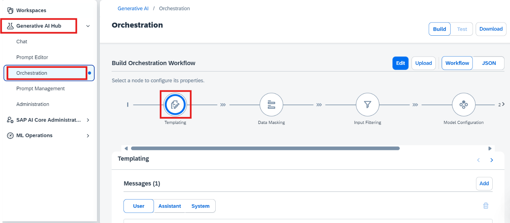
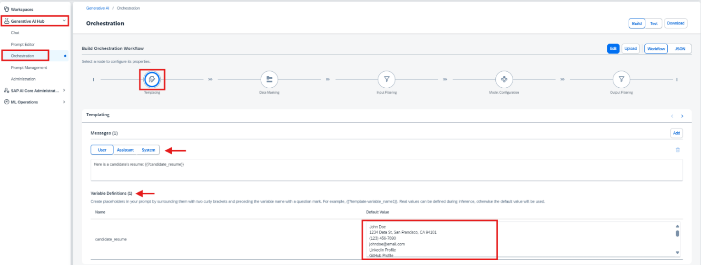
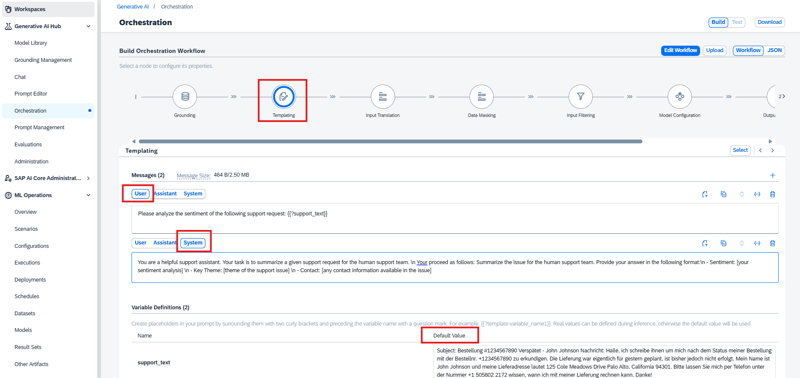
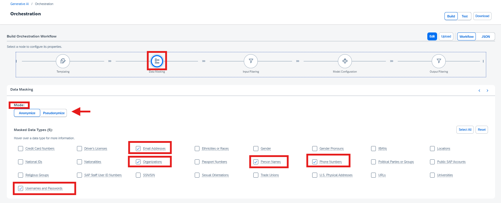
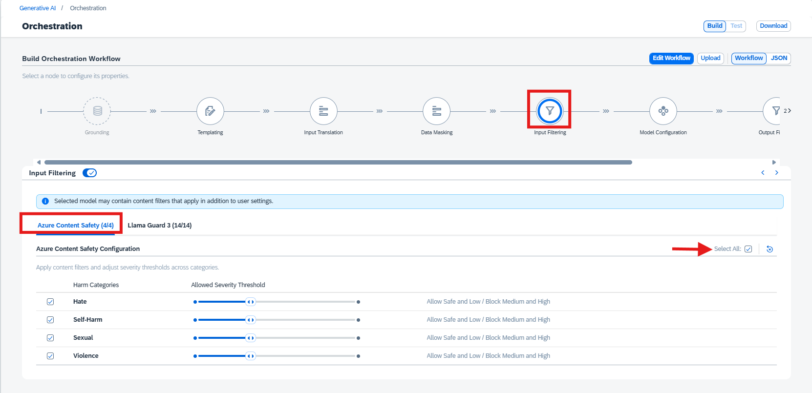
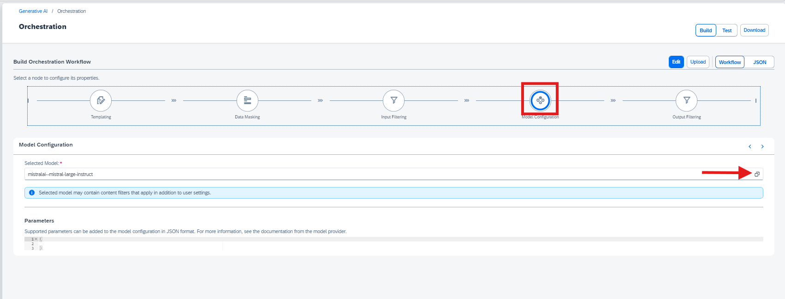
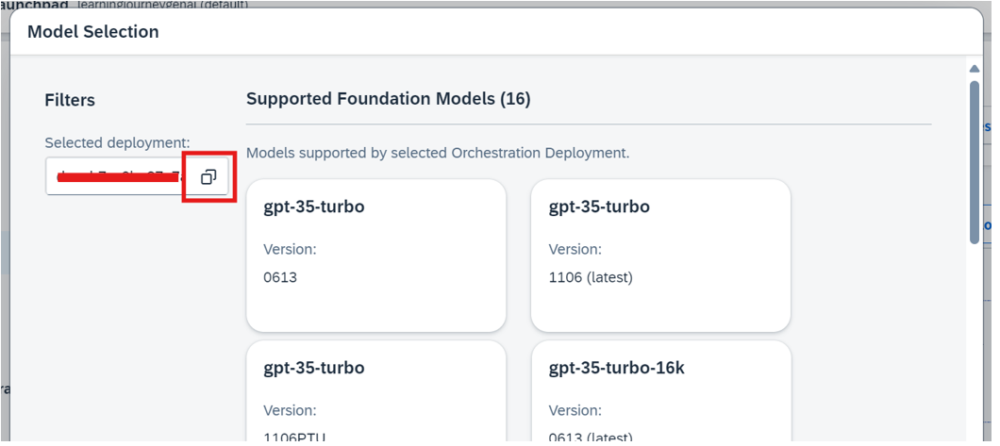
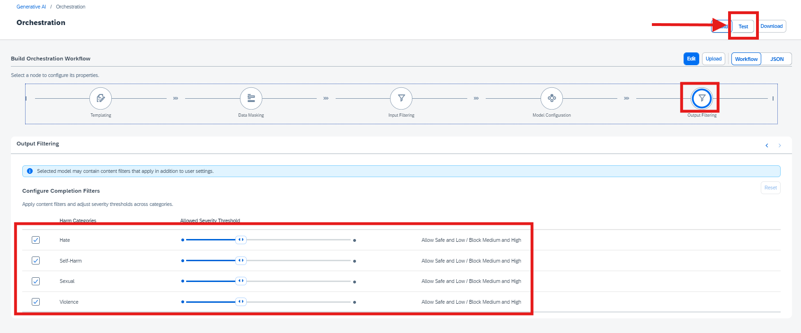

# Leveraging Orchestration Capabilities to Enhance Responses
<!-- description -->  In this tutorial, we will explore advanced orchestration capabilities available in the Gen AI Hub, including features such as Data Masking and Content Filtering.

## You will learn
- Inference of GenAI models using orchestration along with Data Masking and Content Filtering features

## Prerequisites
- Setup Environment:
Ensure your instance and AI Core credentials are properly configured according to the steps provided in the initial tutorial
- Orchestration Deployment:
Ensure at least one orchestration deployment is ready to be consumed during this process. 
- Refer to [this tutorial understand the basic consumption of GenAI models using orchestration.](https://developers.sap.com/tutorials/ai-core-orchestration-consumption.html)
- Basic Knowledge:
Familiarity with the orchestration workflow is recommended

### Accessing Orchestration Capabilities

[OPTION BEGIN [AI Launchpad]]

**In this tutorial**, we will build upon the orchestration framework introduced in [Tutorial](https://developers.sap.com/tutorials/ai-core-orchestration-consumption.html). The focus will shift from basic orchestration to leveraging optional advanced modules to enhance data privacy and refine response quality. These enhancements include: 

  -	**Data Masking**: Hiding sensitive information like phone numbers, organizational details, or personal identifiers. 
  -	**Content Filtering**: Screening for categories such as hate speech, self-harm, explicit content, and violence to ensure safe and relevant responses. 

**Access the Generative AI Hub:** 
- Navigate to the resource group where your orchestration has been deployed. 

- Go to Generative AI Hub. 

- Select Orchestration and click on Templating. 



[OPTION END]

[OPTION BEGIN [Gen AI Hub SDK]]

- **In this tutorial**, we will build upon the orchestration framework introduced in [Tutorial](https://developers.sap.com/tutorials/ai-core-orchestration-consumption.html). The focus will shift from basic orchestration to leveraging optional advanced modules to enhance data privacy and refine response quality. These enhancements include: 

    -	**Data Masking**: Hiding sensitive information like phone numbers, organizational details, or personal identifiers. 

    -	**Content Filtering**: Screening for categories such as hate speech, self-harm, explicit content, and violence to ensure safe and relevant responses.

- Here, we extend the use case introduced in Previous Tutorial, where orchestration was executed without incorporating data masking or content filtering. Here, we will include these advanced modules to improve data privacy, security, and response quality. 

**NOTE** : If you are continuing with the same notebook from the previous tutorial, skip steps 1 and 2. Otherwise, create a new notebook using the already deployed orchestration URL to access the Harmonized API. 


- The [cv.txt](img/cv.txt) file, containing the resume content, must be added to the working directory. Use the following code to load the file content:


```CODE 

from gen_ai_hub.orchestration.utils import load_text_file 
# Load the CV file content 
cv_file_path = "cv.txt"  # Specify the correct path to the CV file 
cv_content = load_text_file(cv_file_path) 
# Print the content to verify it has been loaded 
print(cv_content)

```

[OPTION END]

[OPTION BEGIN [SAP Cloud SDK]]

- **In this tutorial**, we will build upon the orchestration framework introduced in [Tutorial](https://developers.sap.com/tutorials/ai-core-orchestration-consumption.html). The focus will shift from basic orchestration to leveraging optional advanced modules to enhance data privacy and refine response quality. These enhancements include: 

    -	**Data Masking**: Hiding sensitive information like phone numbers, organizational details, or personal identifiers. 

    -	**Content Filtering**: Screening for categories such as hate speech, self-harm, explicit content, and violence to ensure safe and relevant responses.

- Here, we extend the use case introduced in Previous Tutorial, where orchestration was executed without incorporating data masking or content filtering. Here, we will include these advanced modules to improve data privacy, security, and response quality. 

**NOTE** : If you are continuing with the same notebook from the previous tutorial, skip steps 1 and 2. Otherwise, create a new notebook using the already deployed orchestration URL to access the Harmonized API.  


- The [cv.txt](img/cv.txt) file, containing the resume content, must be added to the working directory. Use the following code to load the file content:


```CODE 

// Define the file path
const filePath = './cv.txt';

let txtContent;

try {
    // Attempt to read the file content
    txtContent = await Deno.readTextFile(filePath);
    console.log(txtContent);
} catch (error) {
    // Handle errors that occur during file reading
    console.error('Error reading the file:', error);
}

// Log the file content or undefined if an error occurred
console.log(txtContent);


```

[OPTION END]

[OPTION BEGIN [Bruno]]

- **In this tutorial**, we will build upon the orchestration framework introduced in [Tutorial](https://developers.sap.com/tutorials/ai-core-orchestration-consumption.html). The focus will shift from basic orchestration to leveraging optional advanced modules to enhance data privacy and refine response quality. These enhancements include: 

    -	**Data Masking**: Hiding sensitive information like phone numbers, organizational details, or personal identifiers. 

    -	**Content Filtering**: Screening for categories such as hate speech, self-harm, explicit content, and violence to ensure safe and relevant responses.

- Here, we extend the use case introduced in [Tutorial](https://developers.sap.com/tutorials/ai-core-orchestration-consumption.html), where orchestration was executed without incorporating data masking or content filtering. Here, we will include these advanced modules to improve data privacy, security, and response quality. 

**Bruno Setup** : If you have already completed the environment setup, configuration, and deployment as described in the [Tutorial](https://developers.sap.com/tutorials/ai-core-orchestration-consumption.html), you can directly proceed to the Data Masking Configuration. If you're new to this, please follow the steps in the [Tutorial](https://developers.sap.com/tutorials/ai-core-orchestration-consumption.html) to set up your environment, configure, and deploy the orchestration before proceeding with the advanced modules.  

[OPTION END]


### Configuring User-Specific Settings  

[OPTION BEGIN [AI Launchpad]]

- In the **Templating** section, locate the **message** icon with three tabs: **User, Assistance, and System**. 

- Click on the **User** tab. Enter the following details:  

```PROMPT

Here is a candidate's resume: {{?candidate_resume}} 
```
**Variable Definitions**: 

- The variable **“candidate_resume”** will be created. 

- Enter the default values according to your use case. For this example, use the following resume information (you can copy-paste this text): 

```TEXT
John Doe 
1234 Data St, San Francisco, CA 94101 
(123) 456-7890 
johndoe@email.com 
LinkedIn Profile 
GitHub Profile 
Objective 
Detail-oriented Data Scientist with 3+ years of experience in data analysis, statistical modeling, and machine learning. Seeking to leverage expertise in predictive modeling and data visualization to help drive data-informed decision-making at [Company Name]. 
Education 
Master of Science in Data Science 
University of California, Berkeley 
Graduated: May 2021 
Bachelor of Science in Computer Science 
University of California, Los Angeles 
Graduated: May 2019 
Technical Skills 
Programming Languages: Python, R, SQL, Java 
Data Analysis & Visualization: Pandas, NumPy, Matplotlib, Seaborn, Tableau 
Machine Learning: Scikit-learn, TensorFlow, Keras, XGBoost 
Big Data Technologies: Hadoop, Spark 
Databases: MySQL, PostgreSQL 
Version Control: Git 
Professional Experience  
Data Scientist 
DataCorp Inc., San Francisco, CA 
June 2021 – Present 
Developed predictive models to optimize marketing campaigns, which increased ROI by 20%. 
Conducted in-depth data analysis using Python and SQL to identify trends and patterns in large datasets. 
Collaborated with cross-functional teams to implement data-driven strategies that improved customer satisfaction scores by 15%. 
Created interactive dashboards using Tableau to visualize KPIs for stakeholders.  
Data Analyst Intern 
Analytics Solutions, Los Angeles, CA 
June 2020 – August 2020 
Analyzed large datasets to identify opportunities for business growth and improvement.
Assisted in the development of automated reporting tools using Python and Excel. 
Worked with data visualization tools to create insightful reports for management. 
Projects 
Customer Segmentation Analysis 
Conducted K-means clustering on customer data to segment the customer base into distinct groups, enabling targeted marketing strategies. 
Predictive Stock Price Modeling 
Built a predictive model using time series analysis to forecast stock prices, achieving an accuracy rate of 85%. 
Sentiment Analysis on Social Media 
Implemented natural language processing techniques to analyze sentiment from tweets, providing insights into public opinion on various topics. 
Certifications 
Certified Data Scientist (CDS) – Data Science Council of America 
Machine Learning Specialization – Coursera by Stanford University 
Professional Affiliations 
Member, Association for Computing Machinery (ACM) 
Member, Data Science Society 
References 
Available upon request. 
Personal Interests 
- I absolutely love exploring new technologies and working on innovative projects. 
- I enjoy reading books, especially on artificial intelligence and machine learning. 
- I hate people who are dishonest and unreliable. 
- I love traveling and experiencing new cultures. 
- I enjoy playing video games, especially competitive ones. 
- I hate being stuck in a routine; I always seek new challenges and growth opportunities. 
- I hate working in Azure cloud -"Azure cloud is the most irritating platform i have ever used" 

```


- After entering the details, click on **Add**. 

- A new message box will appear. Proceed to configure the **System** tab. 

- In the **System** tab, enter the following details: 

```PROMPT

You are a helpful AI assistant for HR. Summarize the following CV in 10 sentences, focusing on key qualifications, work experience, and achievements. Include personal contact information, organizational history, and personal interests.

```


[OPTION END]

[OPTION BEGIN [Gen AI SDK]]

- To define how the AI should process the resume, we need a template comprising **SystemMessage** and **UserMessage** components: 

    - **SystemMessage**: Defines the assistant's role and instructions. 

    - **UserMessage**: Represents the user's input to be processed. 

Use the following code to create the template: 

```CODE

from gen_ai_hub.orchestration.models.message import SystemMessage, UserMessage 
from gen_ai_hub.orchestration.models.template import Template, TemplateValue 
# Define the template for resume screening 
template = Template( 
    messages=[ 
        SystemMessage("""You are a helpful AI assistant for HR. Summarize the following CV in 10 sentences,  
                      focusing on key qualifications, work experience, and achievements. Include personal contact information,  
                      organizational history, and personal interests"""), 
        UserMessage( 
            "Here is a candidate's resume: {{?candidate_resume}}" 
        ), 
    ], 
    defaults=[ 
        TemplateValue(name="candidate_resume", value="John Doe's resume content goes here..."), 
    ], 
) 

```
- Select the models to be used for this orchestration: 

```CODE

from gen_ai_hub.orchestration.models.llm import LLM 
# List of models to use 
models = [ 
    LLM(name="gpt-4o", version="latest", parameters={"max_tokens": 1000, "temperature": 0.6}), 
    LLM(name="mistralai--mistral-large-instruct", version="latest", parameters={"max_tokens": 1000, "temperature": 0.6}), 
    LLM(name="anthropic--claude-3-sonnet", version="latest", parameters={"max_tokens": 1000, "temperature": 0.6}), 
] 

```
[OPTION END]

[OPTION BEGIN [SAP Cloud SDK ]]

- To define how the AI should process the resume, we need a template comprising **SystemMessage** and **UserMessage** components: 

    - **SystemMessage**: Defines the assistant's role and instructions. 

    - **UserMessage**: Represents the user's input to be processed. 

Use the following code to create the template: 

```CODE

/ Define the template for resume screening 
const templateConfig = { 
  templating: { 
    template: [ 
      { 
        role: 'system', 
        content: 'You are an AI assistant designed to screen resumes for HR purposes. Please assess the candidate qualifications based on the provided resume.', 
      }, 
      { 
        role: 'user', 
        content: 'Candidate Resume:\n{{?candidate_resume}}', 
      }, 
    ], 
  }, 
}; 
console.log('Resume screening template configuration defined successfully.');  

```
- Select the models to be used for this orchestration: 

```CODE

// List of models to iterate through 
const models = [ 
    'gpt-4o', 
    'mistralai--mistral-large-instruct', 
    'anthropic--claude-3.5-sonnet', 
  ];

```

[OPTION END]

### Setting Up Data Masking Parameters 

[OPTION BEGIN [AI Launchpad]]

- Navigate to the **Data Masking** section (see the screenshot below). 

- **Data masking** offers two approaches: **anonymization**, which permanently removes personal identifiers for strict privacy, and **pseudonymization**, which replaces identifiers with reversible tokens for scenarios requiring re-identification. In this tutorial, we have chosen 'anonymize' for enhanced privacy. Depending on your requirements, you can opt for either approach. 

- Check the boxes for the following fields that you want to mask: 
    - Email Address 
    - Organization Name 
    - Person's Name 
    - Person's Phone Number 
    - Username & Password 

- Ensure all 5 boxes are checked (refer to the screenshot for reference)



[OPTION END]

[OPTION BEGIN [Gen AI SDK]]

- The **Data Masking** Module ensures data privacy by anonymizing or pseudonymizing sensitive information before it is processed. 

    - **Anonymization**: Irreversibly replaces personal identifiers with placeholders (e.g., MASKED_ENTITY). 

    - **Pseudonymization**: Substitutes identifiers with reversible tokens (e.g., MASKED_ENTITY_ID).

For this tutorial, we use anonymization: 

```CODE

from gen_ai_hub.orchestration.models.data_masking import DataMasking 
from gen_ai_hub.orchestration.models.sap_data_privacy_integration import SAPDataPrivacyIntegration, MaskingMethod, ProfileEntity 
# Apply data masking to sensitive information in the resume 
data_masking = DataMasking( 
    providers=[ 
        SAPDataPrivacyIntegration( 
            method=MaskingMethod.ANONYMIZATION,  # or MaskingMethod.PSEUDONYMIZATION 
            entities=[ 
                ProfileEntity.EMAIL, 
                ProfileEntity.PHONE, 
                ProfileEntity.PERSON, 
                ProfileEntity.ORG, 
                ProfileEntity.LOCATION 
            ] 
        ) 
    ] 
) 

```

**NOTE** : Here, we mask email, phone, person, organization, and location data.  

 


[OPTION END]

[OPTION BEGIN [SAP Cloud SDK ]]

- The **Data Masking** Module ensures data privacy by anonymizing or pseudonymizing sensitive information before it is processed. 

    - **Anonymization**: Irreversibly replaces personal identifiers with placeholders (e.g., MASKED_ENTITY). 

    - **Pseudonymization**: Substitutes identifiers with reversible tokens (e.g., MASKED_ENTITY_ID).

For this tutorial, we use anonymization: 

```CODE

// Define the data masking configuration 
const dataMaskingConfig = { 
  masking: { 
    masking_providers: [ 
      { 
        type: 'sap_data_privacy_integration', 
        method: 'anonymization', 
        entities: [ 
          { type: 'profile-email' }, 
          { type: 'profile-person' }, 
          { type: 'profile-phone' }, 
          { type: 'profile-org' }, 
          { type: 'profile-location' }, 
        ], 
      }, 
    ], 
  }, 
}; 
console.log('Data Masking configuration defined successfully.');

```

**NOTE** : Here, we mask email, phone, person, organization, and location data.  


[OPTION END]

[OPTION BEGIN [Bruno]]
- Before proceeding with the data masking configuration, ensure the following:
    - You have completed the Bruno collection and setup as per the [Tutorial](https://developers.sap.com/tutorials/ai-core-orchestration-consumption.html).
    - The deployment for the orchestration is already done and configured correctly.

**Note**: If you have already completed these setup steps, you can proceed directly to the data masking configuration. If not, please follow the steps in the [Tutorial](https://developers.sap.com/tutorials/ai-core-orchestration-consumption.html) to complete the environment setup and deployment.

- The Data Masking Module ensures data privacy by anonymizing or pseudonymizing sensitive information before it is processed.
    - Anonymization: Irreversibly replaces personal identifiers with placeholders (e.g., MASKED_ENTITY).
    - Pseudonymization: Substitutes identifiers with reversible tokens (e.g., MASKED_ENTITY_ID).

For this tutorial, we use anonymization:

- Navigate to the **'04_consume_model'** section.

- In the list of requests, select the **direct_model_usage** option to open the request designed for consuming the deployed model.

- Expand the Body section of the request. Replace the current JSON in the Body with the following updated JSON, which includes the data masking configuration

```JSON
{
  "orchestration_config": {
    "module_configurations": {
      "templating_module_config": {
        "template": [
          {
            "role": "system",
            "content": "You are an AI assistant designed to screen resumes for HR purposes. Please assess the candidate qualifications based on the provided resume."
          },
          {
            "role": "user",
            "content": "Candidate Resume:\nJohn Doe\n1234 Data St, San Francisco, CA 94101\n(123) 456-7890\njohndoe@email.com\nLinkedIn Profile\nGitHub Profile\n\nObjective\nDetail-oriented Data Scientist with 3+ years of experience in data analysis, statistical modeling, and machine learning. Seeking to leverage expertise in predictive modeling and data visualization to help drive data-informed decision-making at [Company Name].\n\nEducation\nMaster of Science in Data Science\nUniversity of California, Berkeley\nGraduated: May 2021\n\nBachelor of Science in Computer Science\nUniversity of California, Los Angeles\nGraduated: May 2019\n\nTechnical Skills\n\nProgramming Languages: Python, R, SQL, Java\nData Analysis & Visualization: Pandas, NumPy, Matplotlib, Seaborn, Tableau\nMachine Learning: Scikit-learn, TensorFlow, Keras, XGBoost\nBig Data Technologies: Hadoop, Spark\nDatabases: MySQL, PostgreSQL\nVersion Control: Git\n\nProfessional Experience\n\nData Scientist\nDataCorp Inc., San Francisco, CA\nJune 2021 – Present\n\nDeveloped predictive models to optimize marketing campaigns, which increased ROI by 20%.\nConducted in-depth data analysis using Python and SQL to identify trends and patterns in large datasets.\nCollaborated with cross-functional teams to implement data-driven strategies that improved customer satisfaction scores by 15%.\n Created interactive dashboards using Tableau to visualize KPIs for stakeholders.\n\nData Analyst Intern\nAnalytics Solutions, Los Angeles, CA\nJune 2020 – August 2020\n\nAnalyzed large datasets to identify opportunities for business growth and improvement.\nAssisted in the development of automated reporting tools using Python and Excel.\nWorked with data visualization tools to create insightful reports for management.\n\nProjects\n\nCustomer Segmentation Analysis\nConducted K-means clustering on customer data to segment the customer base into distinct groups, enabling targeted marketing strategies.\n\nPredictive Stock Price Modeling\nBuilt a predictive model using time series analysis to forecast stock prices, achieving an accuracy rate of 85%.\n\nSentiment Analysis on Social Media\nImplemented natural language processing techniques to analyze sentiment from tweets, providing insights into public opinion on various topics.\n\nCertifications\n\nCertified Data Scientist (CDS) – Data Science Council of America\nMachine Learning Specialization – Coursera by Stanford University\n\nProfessional Affiliations\n\nMember, Association for Computing Machinery (ACM)\nMember, Data Science Society\n\nReferences\nAvailable upon request.\n\nPersonal Interests\n- I absolutely love exploring new technologies and working on innovative projects.\n- I enjoy reading books, especially on artificial intelligence and machine learning.\n- I hate people who are dishonest and unreliable."
          }
        ]
      },
      "llm_module_config": {
        "model_name": "gpt-4o",
        "model_params": {
          "max_tokens": 300,
          "temperature": 0.1,
          "frequency_penalty": 0,
          "presence_penalty": 0
        }
      },
      "masking_module_config": {
        "masking_providers": [
          {
            "type": "sap_data_privacy_integration",
            "method": "anonymization",
            "entities": [
              {
                "type": "profile-email"
              },
              {
                "type": "profile-person"
              },
              {
                "type": "profile-phone"
              },
              {
                "type": "profile-org"
              },
              {
                "type": "profile-location"
              }
            ]
          }
        ]
      }
    }
  }
}

```

- After replacing the JSON, click Send to execute the request.

- Upon sending the request, the response will return the masked result, where sensitive information like email, phone numbers, and other personal identifiers are anonymized. For reference, you can check the screenshot provided showing how the masked result will appear.


[OPTION END]


### Defining Content Filtering Rules

[OPTION BEGIN [AI Launchpad]]

Navigate to the **Input Filtering** section. 

- Adjust the filtering levels based on your needs, such as: 

    - Hate 

    - Self-Harm 

    - Sexual Content 

    - Violence 

- Note that this step is optional and helps filter content for safety. 



- Navigate to the Model Configuration section. 

- Select your Deployment ID and choose the model you want to use for this orchestration. 


**NOTE** : Ensure that your orchestration deployment is in Running Status and ready to be consumed during this process.  






- Click on the **Output Filtering** section. 

- Adjust filtering levels for content safety criteria, similar to the **Input Filtering** configuration: 
 
      - Hate 

      - Self-Harm 

      - Sexual Content 

      - Violence 

- This step is also optional. 

 

[OPTION END]

[OPTION BEGIN [Gen AI SDK]]

- The **Content Filtering** Module allows screening of both input and output content to remove inappropriate or unwanted elements. This is achieved through configurable thresholds: 

```CODE

from gen_ai_hub.orchestration.models.azure_content_filter import AzureContentFilter 
# Configure input and output content filters 
input_filter = AzureContentFilter(hate=6, sexual=4, self_harm=0, violence=4) 
output_filter = AzureContentFilter(hate=6, sexual=4, self_harm=0, violence=4) 

```


**NOTE** : Adjust thresholds for hate, sexual, self-harm, and violence categories based on your use case.  

 


- Then Combine the template, models, and modules into orchestration configurations: 

```CODE

from gen_ai_hub.orchestration.models.config import OrchestrationConfig 
# Create configurations for each model 
configs = [] 
for model in models: 
    # Create orchestration config for each model 
    config = OrchestrationConfig( 
        template=template,   
        llm=model,   
    ) 
    # You may need to set content filtering and data masking separately, depending on the framework 
    config.data_masking = data_masking  # Set data masking after the config is created 
    config.input_filter = input_filter  # Set input filter 
    config.output_filter = output_filter  # Set output filter      
    configs.append(config) 

```


**NOTE** : Ensure that your orchestration deployment is in Running Status and ready to be consumed during this process. 


 

[OPTION END]

[OPTION BEGIN [SAP Cloud SDK ]]

- The **Content Filtering** Module allows screening of both input and output content to remove inappropriate or unwanted elements. This is achieved through configurable thresholds: 

```CODE

const filteringModuleConfig = { 
  input: { 
    filters: [ 
      { 
        type: 'azure_content_safety', 
        config: { 
          Hate: 6, 
          SelfHarm: 0, 
          Sexual: 4, 
          Violence: 4, 
        }, 
      }, 
    ], 
  }, 
  output: { 
    filters: [ 
      { 
        type: 'azure_content_safety', 
        config: { 
          Hate: 6, 
          SelfHarm: 0, 
          Sexual: 4, 
          Violence: 4, 
        }, 
      }, 
    ], 
  }, 
}; 
console.log('Content Filtering configuration defined successfully.');  

```


**NOTE** : Adjust thresholds for hate, sexual, self-harm, and violence categories based on your use case.  

 


- Then Combine the template, models, and modules into orchestration configurations: 

```CODE

// Function to create configuration for each model 
const createModelConfig = (modelName) => ({ 
  llm: { 
    model_name: modelName, 
    model_params: { 
      max_tokens: 1000, 
      temperature: 0.6, 
    }, 
  }, 
  ...templateConfig, 
  ...dataMaskingConfig, 
  filtering_module_config: filteringModuleConfig,  
}); 
const deploymentConfig = { 
  resourceGroup: 'default', 
}; 

```

**NOTE** : Ensure that your orchestration deployment is in Running Status and ready to be consumed during this process.**  

[OPTION END]

[OPTION BEGIN [Bruno]]

The **Content Filtering** Module allows screening of both input and output content to remove inappropriate or unwanted elements. This is achieved through configurable thresholds: 

- Navigate to the **'04_consume_model'** section.
- Select **'direct_model_usage'**, Expand the Body tab to view the current JSON configuration.
- Paste the following updated JSON configuration that includes data masking, input filtering and output filtering modules:

```JSON

{
  "orchestration_config": {
    "module_configurations": {
      "templating_module_config": {
        "template": [
          {
            "role": "system",
            "content": "You are an AI assistant designed to screen resumes for HR purposes. Please assess the candidate qualifications based on the provided resume."
          },
          {
            "role": "user",
            "content": "Candidate Resume:\nJohn Doe\n1234 Data St, San Francisco, CA 94101\n(123) 456-7890\njohndoe@email.com\nLinkedIn Profile\nGitHub Profile\n\nObjective\nDetail-oriented Data Scientist with 3+ years of experience in data analysis, statistical modeling, and machine learning. Seeking to leverage expertise in predictive modeling and data visualization to help drive data-informed decision-making at [Company Name].\n\nEducation\nMaster of Science in Data Science\nUniversity of California, Berkeley\nGraduated: May 2021\n\nBachelor of Science in Computer Science\nUniversity of California, Los Angeles\nGraduated: May 2019\n\nTechnical Skills\n\nProgramming Languages: Python, R, SQL, Java\nData Analysis & Visualization: Pandas, NumPy, Matplotlib, Seaborn, Tableau\nMachine Learning: Scikit-learn, TensorFlow, Keras, XGBoost\nBig Data Technologies: Hadoop, Spark\nDatabases: MySQL, PostgreSQL\nVersion Control: Git\n\nProfessional Experience\n\nData Scientist\nDataCorp Inc., San Francisco, CA\nJune 2021 – Present\n\nDeveloped predictive models to optimize marketing campaigns, which increased ROI by 20%.\nConducted in-depth data analysis using Python and SQL to identify trends and patterns in large datasets.\nCollaborated with cross-functional teams to implement data-driven strategies that improved customer satisfaction scores by 15%.\n Created interactive dashboards using Tableau to visualize KPIs for stakeholders.\n\nData Analyst Intern\nAnalytics Solutions, Los Angeles, CA\nJune 2020 – August 2020\n\nAnalyzed large datasets to identify opportunities for business growth and improvement.\nAssisted in the development of automated reporting tools using Python and Excel.\nWorked with data visualization tools to create insightful reports for management.\n\nProjects\n\nCustomer Segmentation Analysis\nConducted K-means clustering on customer data to segment the customer base into distinct groups, enabling targeted marketing strategies.\n\nPredictive Stock Price Modeling\nBuilt a predictive model using time series analysis to forecast stock prices, achieving an accuracy rate of 85%.\n\nSentiment Analysis on Social Media\nImplemented natural language processing techniques to analyze sentiment from tweets, providing insights into public opinion on various topics.\n\nCertifications\n\nCertified Data Scientist (CDS) – Data Science Council of America\nMachine Learning Specialization – Coursera by Stanford University\n\nProfessional Affiliations\n\nMember, Association for Computing Machinery (ACM)\nMember, Data Science Society\n\nReferences\nAvailable upon request.\n\nPersonal Interests\n- I absolutely love exploring new technologies and working on innovative projects.\n- I enjoy reading books, especially on artificial intelligence and machine learning.\n- I hate people who are dishonest and unreliable."
          }
        ]
      },
      "llm_module_config": {
        "model_name": "gpt-4o",
        "model_params": {
          "max_tokens": 300,
          "temperature": 0.1,
          "frequency_penalty": 0,
          "presence_penalty": 0
        }
      },
      "masking_module_config": {
        "masking_providers": [
          {
            "type": "sap_data_privacy_integration",
            "method": "anonymization",
            "entities": [
              {
                "type": "profile-email"
              },
              {
                "type": "profile-person"
              },
              {
                "type": "profile-phone"
              },
              {
                "type": "profile-org"
              },
              {
                "type": "profile-location"
              }
            ]
          }
        ]
      },
      "filtering_module_config": {
        "input": {
          "filters": [
            {
              "type": "azure_content_safety",
              "config": {
                "Hate": 2,
                "SelfHarm": 2,
                "Sexual": 2,
                "Violence": 2
              }
            }
          ]
        },
        "output": {
          "filters": [
            {
              "type": "azure_content_safety",
              "config": {
                "Hate": 2,
                "SelfHarm": 2,
                "Sexual": 2,
                "Violence": 2
              }
            }
          ]
        }
      }
    }
  }
}

```

**NOTE** : Adjust thresholds for hate, sexual, self-harm, and violence categories based on your use case.

[OPTION END]

### Executing the Orchestration Workflow

[OPTION BEGIN [AI Launchpad]]

- After configuring the filtering and model settings, click on the Test icon and run the orchestration. 

- Check the Result section for the response. 


  **Conclusion** :  
  Once the orchestration completes, you can observe that the output is now more refined, with sensitive information masked and inappropriate content filtered. This demonstrates the power of advanced modules like data masking and content filtering to enhance privacy and ensure response quality.  

  While this tutorial used a resume screening use case, the same principles can be applied to other use cases. You can customize the Data Masking and Content Filtering settings based on your specific requirements to handle sensitive or categorized data effectively.  

  By incorporating these optional modules, you can tailor your Response to meet organizational data security policies and ensure safe, reliable responses for diverse scenarios.  


[OPTION END]

[OPTION BEGIN [Gen AI SDK]]

- Finally, execute the orchestration and collect the results: 

```CODE

from gen_ai_hub.orchestration.service import OrchestrationService 
# Initialize an empty list to store the responses 
responses = [] 
# Iterate through each config and get the response using the filtered input 
for i, config in enumerate(configs): 
    orchestration_service = OrchestrationService(api_url=YOUR_API_URL, config=config)  
    # Run orchestration with the provided input (for example, candidate resume content) 
    result = orchestration_service.run(template_values=[ 
        TemplateValue(name="candidate_resume", value=cv_content)   
    ])   
    # Extract the response content 
    response = result.orchestration_result.choices[0].message.content 
 
    # Append the response to the responses list 
    responses.append({ 
        "model": models[i].name,  # Store model name 
        "response": response      # Store the corresponding model response 
    }) 
# Store the responses in a text file 
with open("model_responses.txt", "w") as file: 
    for response_data in responses: 
        file.write(f"Response from model {response_data['model']}:\n") 
        file.write(f"{response_data['response']}\n") 
        file.write("-" * 80 + "\n")  # Add a separator between model responses  

```
- A **model_responses.txt** file will be generated, containing outputs from all the models used.

  **Conclusion** :  
  Once the orchestration completes, you can observe that the output is now more refined, with sensitive information masked and inappropriate content filtered. This demonstrates the power of advanced modules like data masking and content filtering to enhance privacy and ensure response quality.  

  While this tutorial used a resume screening use case, the same principles can be applied to other use cases. You can customize the Data Masking and Content Filtering settings based on your specific requirements to handle sensitive or categorized data effectively.  

  By incorporating these optional modules, you can tailor your Response to meet organizational data security policies and ensure safe, reliable responses for diverse scenarios.  


[OPTION END]

[OPTION BEGIN [SAP Cloud SDK ]]

- Finally, execute the orchestration and collect the results: 

```CODE

import {OrchestrationClient,buildAzureContentFilter} from '@sap-ai-sdk/orchestration'; 
import { writeFileStrSync } from "https://deno.land/std@0.52.0/fs/mod.ts"; 
// Function to generate responses from multiple models 
async function generateResponsesForModels(txtContent) { 
    const responses = []; 
    for (const modelName of models) { 
      console.log(`\n=== Responses for model: ${modelName} ===\n`); 
      // Create configuration for the current model 
      const modelConfig = createModelConfig(modelName); 
      // console.log(modelConfig) 
      // Initialize OrchestrationClient with dynamic model configuration 
      const orchestrationClient = new OrchestrationClient({ 
        ...deploymentConfig, 
        ...modelConfig, 
      }); 
      try { 
        // Run orchestration with the provided input (candidate resume content) 
        const response = await orchestrationClient.chatCompletion({ 
          inputParams: { candidate_resume: txtContent }, 
        }); 
        // Extract the response content 
        const content = response.getContent(); 
        console.log(`Response from ${modelName}:\n`, content); 
        // Store the response in the list 
        responses.push({ 
          model: modelName, 
          response: content, 
        }); 
      } catch (error) { 
        console.error(`Error with model ${modelName}:`, error.response?.data || error.message); 
      } 
    } 
    // Optionally save the responses to a file (similar to Python code) 
    await writeFileStrSync( 
      'model_responses_js1.txt', 
      responses 
        .map((res) => `Response from model ${res.model}:\n${res.response}\n${'-'.repeat(80)}\n`) 
        .join(''), 
      'utf-8' 
    ); 
}    
  // Example usage with resume content 
  generateResponsesForModels(txtContent);  

```
- A **model_responses.txt** file will be generated, containing outputs from all the models used.

  **Conclusion** :  
  Once the orchestration completes, you can observe that the output is now more refined, with sensitive information masked and inappropriate content filtered. This demonstrates the power of advanced modules like data masking and content filtering to enhance privacy and ensure response quality.  

  While this tutorial used a resume screening use case, the same principles can be applied to other use cases. You can customize the Data Masking and Content Filtering settings based on your specific requirements to handle sensitive or categorized data effectively.  

  By incorporating these optional modules, you can tailor your Response to meet organizational data security policies and ensure safe, reliable responses for diverse scenarios.  


[OPTION END]

[OPTION BEGIN [Bruno]]

- Click Send to execute the request with the updated configuration. Validate the returned response. It should contain:
    - Masked Results: Sensitive information like email, phone numbers, and names will be anonymized.
    - Filtered Content: Content deemed unsafe based on the configured thresholds will be flagged or filtered out.

By following these steps, you can successfully mask sensitive data and apply content filtering while consuming the deployed model.

  **Conclusion** :  
  Once the orchestration completes, you can observe that the output is now more refined, with sensitive information masked and inappropriate content filtered. This demonstrates the power of advanced modules like data masking and content filtering to enhance privacy and ensure response quality.  

  While this tutorial used a resume screening use case, the same principles can be applied to other use cases. You can customize the Data Masking and Content Filterin settings based on your specific requirements to handle sensitive or categorized data effectively.  

  By incorporating these optional modules, you can tailor your Response to meet organizational data security policies and ensure safe, reliable responses for diverse scenarios.  
 
[OPTION END]

