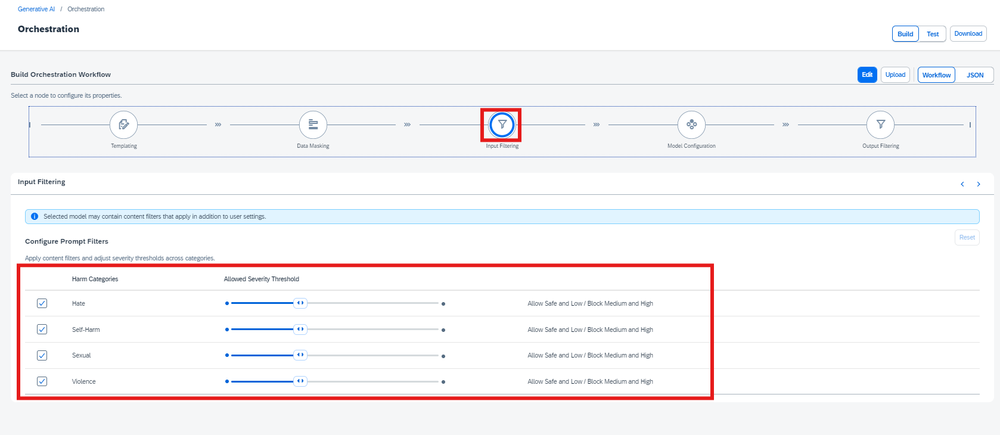
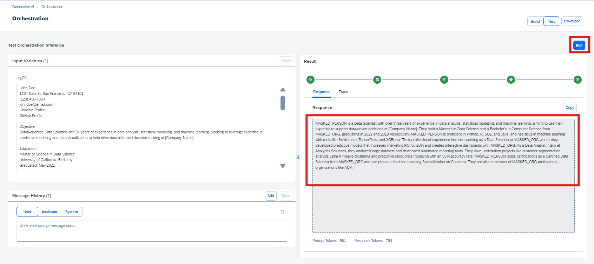

# Leveraging Orchestration Capabilities to Enhance Responses
<!-- description -->  In this tutorial, we will explore optional orchestration capabilities available in the Gen AI Hub, such as Data Masking, translation and Content Filtering.

## You will learn
- Inference of GenAI models using orchestration along with Data Masking, translation and Content Filtering features

## Prerequisites
1. **BTP Account**  
   Set up your SAP Business Technology Platform (BTP) account.  
   [Create a BTP Account](https://developers.sap.com/group.btp-setup.html)
2. **For SAP Developers or Employees**  
   Internal SAP stakeholders should refer to the following documentation: [How to create BTP Account For Internal SAP Employee](https://me.sap.com/notes/3493139), [SAP AI Core Internal Documentation](https://help.sap.com/docs/sap-ai-core)
3. **For External Developers, Customers, or Partners**  
   Follow this tutorial to set up your environment and entitlements: [External Developer Setup Tutorial](https://developers.sap.com/tutorials/btp-cockpit-entitlements.html), [SAP AI Core External Documentation](https://help.sap.com/docs/sap-ai-core?version=CLOUD)
4. **Create BTP Instance and Service Key for SAP AI Core**  
   Follow the steps to create an instance and generate a service key for SAP AI Core:  
   [Create Service Key and Instance](https://help.sap.com/docs/sap-ai-core/sap-ai-core-service-guide/create-service-key?version=CLOUD)
5. **AI Core Setup Guide**  
   Step-by-step guide to set up and get started with SAP AI Core:  
   [AI Core Setup Tutorial](https://developers.sap.com/tutorials/ai-core-setup.html)
6. An Extended SAP AI Core service plan is required, as the Generative AI Hub is not available in the Free or Standard tiers. For more details, refer to 
[SAP AI Core Service Plans](https://help.sap.com/docs/sap-ai-core/sap-ai-core-service-guide/service-plans?version=CLOUD)
7. **Orchestration Deployment**:   
    Refer to the tutorial [the basic consumption of GenAI models using orchestration](https://developers.sap.com/tutorials/ai-core-orchestration-consumption.html) and ensure at least one orchestration deployment is ready to be consumed during this process. 
8. Basic Knowledge:
    Familiarity with the orchestration workflow is recommended

### Pre-Read

This tutorial builds on the foundational orchestration concepts introduced in the [beginner's tutorial](https://developers.sap.com/tutorials/ai-core-orchestration-consumption.html) and focuses on enhancing GenAI responses using orchestration modules such as **data masking**, **translation** and **content filtering**.

Previously in the [beginner's tutorials](https://developers.sap.com/tutorials/ai-core-orchestration-consumption.html), we used a **resume processing use case** to illustrate how to create orchestration workflow to consume models and easily switch different models using harmonized API. In this tutorial, we use a sentiment analysis use case to demonstrate how optional orchestration modules such as **Data Masking**, **Translation**, and **Content Filtering** can be applied to protect sensitive information, translate multilingual support requests, and filter out undesirable or non-compliant content—thereby enhancing the quality, safety, and compliance of generative AI outputs.

**Data masking** in SAP AI Core allows you to anonymize or pseudonymize personal or confidential data before sending it to the generative AI model.  
🔗 [Learn more about Data Masking in SAP AI Core](https://help.sap.com/docs/sap-ai-core/sap-ai-core-service-guide/data-masking?version=CLOUD)

**Translation** in SAP GenAI Orchestration enables automatic language conversion of inputs and outputs during LLM processing.
🔗 [Learn more about Data Masking in SAP AI Core](https://help.sap.com/docs/sap-ai-core/sap-ai-core-service-guide/input-translation?version=CLOUD)

**Content filtering** helps identify and block inappropriate, offensive, or non-compliant input and output content within an orchestration workflow.  
🔗 [Learn more about Content Filtering in SAP AI Core](https://help.sap.com/docs/sap-ai-core/sap-ai-core-service-guide/input-filtering?version=CLOUD)

In this tutorial, we specifically focus on **data masking**, **translation** and **content filtering**. Other orchestration modules such as **grounding** are also available in SAP AI Core and it is covered in Separate tutorials.

You will learn how to:

- Integrate data masking within the orchestration flow to safeguard personal or confidential information.
- Apply content filtering to identify and restrict inappropriate or non-compliant responses.
- Use relevant SAP AI Core features and configurations to support these capabilities.

By the end of this tutorial

  * you'll understand how to design a secure and controlled orchestration pipeline suitable for **enterprise-grade GenAI applications**.
  
  * Learn how to implement the solution using **SAP AI Launchpad**, **Python SDK**, **Java**, **JavaScript**, and **Bruno**.

### Accessing Orchestration Capabilities

**In this tutorial**, we will build upon the orchestration framework introduced in [Tutorial](https://developers.sap.com/tutorials/ai-core-orchestration-consumption.html). The focus will shift from basic orchestration to leveraging optional modules to enhance data privacy and refine response quality. These enhancements include: 

    **Data Masking** : Hiding sensitive information like phone numbers, organizational details, or personal identifiers. 

    **Content Filtering** : Screening for categories such as hate speech, self-harm, explicit content, and violence to ensure safe and relevant responses.

    **Translation** : Automatically converts input and/or output text between source and target languages to support multilingual processing.

- Here, we use a **sentiment analysis** use case, where orchestration is enhanced by incorporating data masking, translation or content filtering. These additions help improve data privacy, security, and response quality.

[OPTION BEGIN [AI Launchpad]] 

**Access the Generative AI Hub:** 
- Navigate to the resource group where your orchestration has been deployed. 

- Go to Generative AI Hub. 

- Select Orchestration and click on Templating. 


[OPTION END]

[OPTION BEGIN [Python SDK]]

**NOTE** : If you are continuing with the same notebook from the previous tutorial, skip steps 1 and 2. Otherwise, create a new notebook using the already deployed orchestration URL to access the Harmonized API. 

- The [support-request.txt](img/support-request.txt) file, containing the support request content, must be added to the working directory. Use the following code to load the file content:


```python

from gen_ai_hub.orchestration.utils import load_text_file 
# Load the support request file content 
support_request_path = "support-request.txt"  # Specify the correct path to the file 
support_request = load_text_file(support_request_path) 
# Print the content to verify it has been loaded 
print(support_request)

```

[OPTION END]

[OPTION BEGIN [JavaScript SDK]]

**NOTE** : If you are continuing with the same project from the previous tutorial, skip steps 1 and 2. Otherwise, create a new project using the already deployed orchestration URL to access the Harmonized API.

For more information, refer to the official [documentation](https://sap.github.io/ai-sdk/docs/js/orchestration/chat-completion) of the [`@sap-ai-sdk/orchestration`](https://github.com/SAP/ai-sdk-js/tree/main/packages/orchestration) package.

- The [support-request.txt](img/support-request.txt) file, containing the support request content, must be added to the working directory. Use the following code to load the file content:


```javascript

import { readFile } from 'fs/promises';

const cvContent = await readFile('path/to/support-request.txt', 'utf-8');

```

[OPTION END]

[OPTION BEGIN [Java SDK]]

**NOTE** : If you are continuing with the same project from the previous tutorial, skip steps 1 and 2. Otherwise, create a new Java Maven project using the already deployed orchestration URL to access the Harmonized API. Please find detailed information on orchestration configuration and deployment in the previous tutorial or in  our [documentation](https://sap.github.io/ai-sdk/docs/java/overview-cloud-sdk-for-ai-java). 


- The [support-request.txt](img/support-request.txt) file, containing the support request content, must be added to the working directory. Use the following code to load the file content:


```java
// Adapt filepath to the location you stored the file
var filePath = "path/to/support-request.txt";

// Read file into string
String supportRequest;
try {
 supportRequest = new String(Files.readAllBytes(Paths.get(filePath)));
} catch (IOException e) {
 throw new RuntimeException(e);
}

// Print file content
System.out.println(supportRequest);

```

[OPTION END]

[OPTION BEGIN [Bruno]]

**Bruno Setup** : If you have already completed the environment setup, configuration, and deployment as described in the [Tutorial](https://developers.sap.com/tutorials/ai-core-orchestration-consumption.html), you can directly proceed to the Data Masking Configuration. If you're new to this, please follow the steps in the [Tutorial](https://developers.sap.com/tutorials/ai-core-orchestration-consumption.html) to set up your environment, configure, and deploy the orchestration before proceeding with the modules.  

[OPTION END]


### Template Configuration  

The templating module is a mandatory step in orchestration. It allows you to define dynamic inputs using placeholders, construct structured prompts, and generate a final query that will be passed to the model configuration module.

In this step, we create a template that defines how the sentiment analysis prompt will be structured using message components:

• `system`: Defines assistant behavior and task. 

• `user`: Provides the support request input.

[OPTION BEGIN [AI Launchpad]]

- In the **Templating** section, locate the **message** icon with three tabs: **User, Assistance, and System**. 

- Click on the **User** tab. Enter the following details:  

```PROMPT

Please analyze the sentiment of the following support request: {{?support_text}}
 
```
**Variable Definitions**: 

- The variable **“support_text ”** will be created. 

- Enter default values based on your use case. For this sentiment analysis example, use the following support text: 

```TEXT

"Subject: Bestellung #1234567890 Verspätet - John Johnson Nachricht: Halle, ich schreibe ihnen um mich nach dem Status meiner Bestellung mit der Bestellnr. +1234567890 zu erkundigen. Die Lieferung war eigentlich für gestern geplant, ist bisher jedoch nicht erfolgt. Mein Name ist John Johnson und meine Lieferadresse lautet 125 Cole Meadows Drive Palo Alto, California 94301. Bitte lassen Sie mich per Telefon unter der Nummer +1 505802 2172 wissen, wann ich mit meiner Lieferung rechnen kann. Danke!"

```
  

- After entering the details, click on **Add**. 

- A new message box will appear. Proceed to configure the **System** tab. 

- In the **System** tab, enter the following details: 

```PROMPT

You are a customer support assistant. Analyze the sentiment of the user request provided and return whether the sentiment is positive, neutral, or negative. Also provide a one-line justification for your classification.

```
  

[OPTION END]

[OPTION BEGIN [Python SDK]]

Use the following code to create the template: 

```python

from gen_ai_hub.orchestration.models.message import SystemMessage, UserMessage
from gen_ai_hub.orchestration.models.template import Template, TemplateValue

# Define the sentiment analysis template
template = Template(
    messages=[
        SystemMessage(
            """You are a customer support assistant. Analyze the sentiment of the user request provided and return whether the sentiment is positive, neutral, or negative. Also provide a one-line justification for your classification."""
        ),
        UserMessage(
            "Please analyze the sentiment of the following support request: {{?support_text}}"
        ),
    ],
    defaults=[
        TemplateValue(name="support_text", value="User is unhappy with the latest update and facing usability issues."),
    ],
)

```
- Select the models to be used for this orchestration: 

```python

from gen_ai_hub.orchestration.models.llm import LLM 
# List of models to use 
models = [ 
    LLM(name="gpt-4o", version="latest", parameters={"max_tokens": 1000, "temperature": 0.6}), 
    LLM(name="mistralai--mistral-large-instruct", version="latest", parameters={"max_tokens": 1000, "temperature": 0.6}), 
    LLM(name="anthropic--claude-3-sonnet", version="latest", parameters={"max_tokens": 1000, "temperature": 0.6}), 
] 

```
[OPTION END]

[OPTION BEGIN [JavaScript SDK ]]

```javascript

import type { TemplatingModuleConfig } from '@sap-ai-sdk/orchestration';

const templating: TemplatingModuleConfig = {
  template: [
    {
      role: 'system',
      content: 'You are a customer support assistant. Analyze the sentiment of the user request provided and return whether the sentiment is positive, neutral, or negative. Also provide a one-line justification for your classification.',
    },
    {
      role: 'user',
      content: 'Please analyze the sentiment of the following support request: {{?support_text}}',
    },
  ],
};


```

We will use multiple models for this tutorial. Since orchestration provides direct access to models without requiring separate deployments, you can use any available models. For this example, we have selected the following models:

```javascript

// List of models to iterate through 
const models = [ 
  'gpt-4o', 
  'mistralai--mistral-large-instruct', 
  'anthropic--claude-3.5-sonnet', 
];

```

[OPTION END]

[OPTION BEGIN [Java SDK]]

Create the sentiment analysis prompt using both SystemMessage and UserMessage components.

```java
// Define system and user messages
var systemMessage = Message.system(
  """
    You are a customer support assistant. Analyze the sentiment of the user request provided and return whether the sentiment is positive, neutral, or negative. Also provide a one-line justification for your classification.
  """
);
var userMessage = Message.user("Please analyze the sentiment of the following support request: " + supportRequestText);

// Create orchestration prompt
var prompt = new OrchestrationPrompt(systemMessage, userMessage);

```


We can define model parameters and a list of models to use. Only use those models that are already deployed in your instances. For this example, we have selected the following parameters and models:

```java
// List of models with parameters to iterate through, can be adapted if desired
var models = Stream.of(
    OrchestrationAiModel.GPT_4O,
    OrchestrationAiModel.MISTRAL_LARGE_INSTRUCT,
    OrchestrationAiModel.CLAUDE_3_5_SONNET
  ).map(model -> model.withParam(MAX_TOKENS, 1000).withParam(TEMPERATURE, 0.6)).toList();

```

[OPTION END]

### Setting Up Data Masking Parameters 

The **Data Masking** Module ensures data privacy by anonymizing or pseudonymizing sensitive information before it is processed. 

    **Anonymization** : Irreversibly replaces personal identifiers with placeholders (e.g., MASKED_ENTITY). 

    **Pseudonymization** : Substitutes identifiers with reversible tokens (e.g., MASKED_ENTITY_ID).

[OPTION BEGIN [AI Launchpad]]

- Navigate to the **Data Masking** section (see the screenshot below). 

 In this tutorial, we have chosen 'anonymize' for enhanced privacy. Depending on your requirements, you can opt for either approach. 

- Check the boxes for the following fields that you want to mask: 
    - Email Address 
    - Organization Name 
    - Person's Name 
    - Person's Phone Number 
    - Username & Password 

- Ensure all 5 boxes are checked (refer to the screenshot for reference)


[OPTION END]

[OPTION BEGIN [Python SDK]]

For this tutorial, we use anonymization: 

```python

from gen_ai_hub.orchestration.models.data_masking import DataMasking 
from gen_ai_hub.orchestration.models.sap_data_privacy_integration import SAPDataPrivacyIntegration, MaskingMethod, ProfileEntity 
# Apply data masking to sensitive information in the support message 
data_masking = DataMasking( 
    providers=[ 
        SAPDataPrivacyIntegration( 
            method=MaskingMethod.ANONYMIZATION,  # or MaskingMethod.PSEUDONYMIZATION 
            entities=[ 
                ProfileEntity.EMAIL, 
                ProfileEntity.PHONE, 
                ProfileEntity.PERSON, 
                ProfileEntity.ORG, 
                ProfileEntity.LOCATION 
            ] 
        ) 
    ] 
) 

```

**NOTE:** We are anonymizing name, phone number, address (location), and organization to protect user privacy in the support text.  

[OPTION END]

[OPTION BEGIN [JavaScript SDK]]

For this tutorial, we use anonymization: 

```javascript

import type { MaskingModuleConfig } from '@sap-ai-sdk/orchestration';

// Define the data masking configuration 
const masking: MaskingModuleConfig = { 
  masking_providers: [ 
    { 
      type: 'sap_data_privacy_integration', 
      method: 'anonymization', 
      entities: [ 
        { type: 'profile-email' }, 
        { type: 'profile-person' }, 
        { type: 'profile-phone' }, 
        { type: 'profile-org' }, 
        { type: 'profile-location' }, 
      ], 
    }, 
  ], 
}; 

```

**NOTE** : Here, we apply data masking to customer support messages in German, masking sensitive user data like name, phone, and address. 

[OPTION END]

[OPTION BEGIN [Java SDK]]

For this tutorial, we use anonymization: 

```java
// Define the data masking configuration
var dataMasking = DpiMasking.anonymization().withEntities(EMAIL, PERSON, PHONE, ORG, LOCATION);

System.out.println("Data Masking defined successfully.");

```

**NOTE** : Here, we apply data masking to customer support messages in German, masking sensitive user data like name, phone, and address.  

[OPTION END]

[OPTION BEGIN [Bruno]]

- Before proceeding with the data masking configuration, ensure the following:
    - You have completed the Bruno collection and setup as per the [Tutorial](https://developers.sap.com/tutorials/ai-core-orchestration-consumption.html).
    - The deployment for the orchestration is already done and configured correctly.

**Note**: If you have already completed these setup steps, you can proceed directly to the data masking configuration. If not, please follow the steps in the [Tutorial](https://developers.sap.com/tutorials/ai-core-orchestration-consumption.html) to complete the environment setup and deployment.

For this tutorial, we use anonymization:

- Navigate to the **'orchestration'** section.

- In the list of requests, select the **completion** option to open the request designed for consuming the deployed model.

- Expand the Body section of the request. Replace the current JSON in the Body with the following updated JSON, which includes the data masking configuration

```JSON
"masking_module_config": {
  "masking_providers": [
    {
      "type": "sap_data_privacy_integration",
      "method": "anonymization",
      "entities": [
        { "type": "profile-email" },
        { "type": "profile-person" },
        { "type": "profile-phone" },
        { "type": "profile-org" },
        { "type": "profile-location" }
      ]
    }
  ]
}

```

- After replacing the JSON, click Send to execute the request.

- Upon sending the request, the response will return the masked result, where sensitive information like email, phone numbers, and other personal identifiers are anonymized. For reference, you can check the screenshot provided showing how the masked result will appear.


**NOTE:** This will mask sensitive fields from support queries — even if written in non-English languages like German

[OPTION END]

### Translation

The Translation Module enables multilingual processing by translating content sent to and received from the generative AI model. This is especially useful when the user input or model output is not in the default language expected by the LLM.

 - The module uses SAP’s Document Translation service.

 - The target language is mandatory.

 - If source language is not specified, it will be automatically detected.

[OPTION BEGIN [AI Launchpad]]

Navigate to the Translation section in the orchestration editor.

Specify the source and target languages for both:

 - Input Translation: before sending data to the model.

 - Output Translation: after receiving the model's response.

For example:

 - Input Translation: German ➝ English

 - Output Translation: English ➝ German

Refer to the screenshots below for guidance:


[OPTION END]

[OPTION BEGIN [JavaScript SDK]]

Use the buildTranslationConfig helper to configure translation.

``` javascript

import { buildTranslationConfig } from "@sap-ai-sdk/orchestration";

// Build input translation config: German -> English
const inputTranslationConfig = buildTranslationConfig({
  sourceLanguage: 'de-DE',   
  targetLanguage: 'en-US',   
});

// Build output translation config: English -> German
const outputTranslationConfig = buildTranslationConfig({
  sourceLanguage: 'en-US',   
  targetLanguage: 'de-DE',   
});

const translationModuleConfig = {
  inputTranslation: inputTranslationConfig,
  outputTranslation: outputTranslationConfig,
};

console.log('✅ Translation configuration defined successfully (with buildTranslationConfig).');

```

[OPTION END]

[OPTION BEGIN [Java SDK]]

Use SAPDocumentTranslation and SAPDocumentTranslationConfig to set up bidirectional translation:

```java

// Build orchestration config with translation
var configWithTranslation =
    OrchestrationConfig.builder()
        .withInputTranslationConfig(
            SAPDocumentTranslation.create()
                .type("sap_document_translation")
                .config(
                    SAPDocumentTranslationConfig.create()
                        .sourceLanguage("de-DE")     
                        .targetLanguage("en-US")     
                )
        )
        .withOutputTranslationConfig(
            SAPDocumentTranslation.create()
                .type("sap_document_translation")
                .config(
                    SAPDocumentTranslationConfig.create()
                        .sourceLanguage("en-US")     
                        .targetLanguage("de-DE")     
                )
        )
        .build();

// Send request to orchestration client
var response = client.chatCompletion(prompt, configWithTranslation);
System.out.println(response.getContent());

```

[OPTION END]

[OPTION BEGIN [Bruno]]

To test translation in Bruno:

1. Open the request in the **05_orchestration** collection.

2. Add both input and output translation configurations under module_configurations.


``` JSON
"input_translation_module_config": {
    "type": "sap_document_translation",
    "config": {
      "source_language": "de-DE",
      "target_language": "en-US"
    }
  },
"output_translation_module_config": {
  "type": "sap_document_translation",
  "config": {
    "source_language": "en-US",
    "target_language": "de-DE"
  }
}

```
  3. Click Send.

  4. The response will show the model output in the target language, with the input also translated before being passed to the LLM.
[OPTION END]

### Defining Content Filtering Rules

The **Content Filtering** Module allows screening of both input and output content to remove inappropriate or unwanted elements such as hate speech or violent content. This ensures that sentiment analysis is performed on safe and relevant inputs, and the responses generated are also safe for consumption.

[OPTION BEGIN [AI Launchpad]]

Navigate to the **Input Filtering** section. 

- Adjust the filtering levels for sentiment analysis inputs, based on your requirements:

    - Hate 

    - Self-Harm 

    - Sexual Content 

    - Violence 

- This step is optional but helps sanitize user-generated content (e.g., tweets, reviews, comments) before performing sentiment analysis. 




Navigate to the Model Configuration section and:

- Select your Deployment ID

- Choose an LLM appropriate for text classification tasks (e.g., GPT-4 or Claude) 

**NOTE** : Ensure that your orchestration deployment is in Running Status and ready to be consumed during this process.  


- Click on the **Output Filtering** section. 

- Adjust filtering levels for content safety criteria, similar to the **Input Filtering** configuration: 
 
      - Hate 

      - Self-Harm 

      - Sexual Content 

      - Violence 

- This step is also optional. 

 

 

[OPTION END]

[OPTION BEGIN [Python SDK]]

```python

input_filter= AzureContentFilter(hate=AzureThreshold.ALLOW_SAFE,
                                  violence=AzureThreshold.ALLOW_SAFE,
                                  self_harm=AzureThreshold.ALLOW_SAFE,
                                  sexual=AzureThreshold.ALLOW_SAFE)
input_filter_llama = LlamaGuard38bFilter(hate=True)
output_filter = AzureContentFilter(hate=AzureThreshold.ALLOW_SAFE,
                                   violence=AzureThreshold.ALLOW_SAFE_LOW,
                                   self_harm=AzureThreshold.ALLOW_SAFE_LOW_MEDIUM,
                                   sexual=AzureThreshold.ALLOW_ALL)
output_filter_llama = LlamaGuard38bFilter(hate=True)

```

**NOTE** : Adjust thresholds for hate, sexual, self-harm, and violence categories based on your use case.  

 
- Then Combine the template, models, and modules into orchestration configurations: 

```python

# Apply filters to orchestration configuration
from gen_ai_hub.orchestration.models.config import OrchestrationConfig
from gen_ai_hub.orchestration.models.content_filtering import InputFiltering, OutputFiltering, ContentFiltering
from gen_ai_hub.orchestration.models.template import Template, SystemMessage, UserMessage

content_filtering = ContentFiltering(
    input_filtering=InputFiltering(filters=[input_filter, input_filter_llama]),
    output_filtering=OutputFiltering(filters=[output_filter, output_filter_llama])
)

configs = []
for model in models:
    config = OrchestrationConfig(
        template=Template(
            messages=[
                SystemMessage("You are an AI assistant that analyzes the sentiment of the input text."),
                UserMessage("Analyze the sentiment of this input:\n'''{{?input_text}}'''")
            ]
        ),
        llm=model,
        filtering=content_filtering
    )
    config.data_masking = data_masking
    configs.append(config)


```
**NOTE** : Ensure that your orchestration deployment is in Running Status and ready to be consumed during this process. 

[OPTION END]

[OPTION BEGIN [JavaScript SDK]]

```javascript

import { buildAzureContentSafetyFilter, buildLlamaGuardFilter, OrchestrationClient } from "https://esm.sh/@sap-ai-sdk/orchestration@latest";
 
// Define Azure content filtering rules
const azureFilter = buildAzureContentSafetyFilter({
  Hate: 'ALLOW_SAFE_LOW',
  Violence: 'ALLOW_SAFE_LOW_MEDIUM',
  SelfHarm: 'ALLOW_SAFE',
  Sexual: 'ALLOW_ALL'
});
 
// Define Llama Guard filtering rules
const llamaGuardFilter = buildLlamaGuardFilter('hate', 'violent_crimes');
 
// Configure filtering with both filters applied
const filteringModuleConfig = {
  input: {
    filters: [azureFilter, llamaGuardFilter] // Multiple filters applied for input
  },
  output: {
    filters: [azureFilter, llamaGuardFilter] // Multiple filters applied for output
  }
};  

```

**NOTE** : Adjust thresholds for hate, sexual, self-harm, and violence categories based on your use case.

- Then Combine the template, models, and modules into orchestration configurations:

```javascript

// Function to create configuration for each model 
const createModelConfig = (modelName) => ({ 
    llm: { 
      model_name: modelName, 
      model_params: { 
        max_tokens: 1000, 
        temperature: 0.6, 
      }, 
    }, 
    ...templateConfig, 
    ...dataMaskingConfig, 
    filtering_module_config: filteringModuleConfig,  
    ...translationModuleConfig
  }); 
  const deploymentConfig = { 
    resourceGroup: '<RESOURCE GROUP>', 
  };

```

Multiple content filters can be applied for both input and output. In this tutorial, we use Azure Content Safety Filter, but you can choose from the available providers based on your use case. For more information, refer to the official [documentation](https://sap.github.io/ai-sdk/docs/js/orchestration/chat-completion) of the [`@sap-ai-sdk/orchestration`](https://github.com/SAP/ai-sdk-js/tree/main/packages/orchestration) package.

The `filtering` configuration created in this step will be used in the next step to initialize an `OrchestrationClient` and consume the orchestration service.

[OPTION END]

[OPTION BEGIN [Java SDK]]

```java
// Define an input content filter, adjust thresholds for your needs
var inputFilter = new AzureContentFilter()
  .hate(ALLOW_ALL)
  .selfHarm(ALLOW_SAFE)
  .sexual(ALLOW_SAFE_LOW_MEDIUM)
  .violence(ALLOW_SAFE_LOW_MEDIUM);

// Define an output content filter, adjust thresholds for your needs
var outputFilter = new AzureContentFilter()
  .hate(ALLOW_ALL)
  .selfHarm(ALLOW_SAFE)
  .sexual(ALLOW_SAFE_LOW_MEDIUM)
  .violence(ALLOW_SAFE_LOW_MEDIUM);

System.out.println("Content Filtering defined successfully.");

```

**NOTE** : Adjust thresholds for hate, sexual, self-harm, and violence categories based on your use case.  

[OPTION END]

[OPTION BEGIN [Bruno]] 

Update your JSON body for the **05_orchestration** section:

```JSON

{
  "orchestration_config": {
    "module_configurations": {
      "templating_module_config": {
        "template": [
          {
            "role": "system",
            "content": "You are a helpful support assistant. Your task is to summarize a given support request for the human support team. \n Your proceed as follows: Summarize the issue for the human support team. Provide your answer in the following format:\n - Sentiment: [your sentiment analysis] \n - Key Theme: [theme of the support issue] \n - Contact: [any contact information available in the issue]"
          },
          {
            "role": "user",
            "content": "Support Request: '''{{?support-request}}'''"
        ]
      },
      "llm_module_config": {
        "model_name": "gpt-4o",
        "model_params": {
          "max_tokens": 500,
          "temperature": 0.1,
          "frequency_penalty": 0,
          "presence_penalty": 0
        },
        "model_version": "latest"
      },
      "filtering_module_config": {
        "input": {
          "filters": [
            {
              "type": "azure_content_safety",
              "config": {
                "Hate": 0,
                "Violence": 2,
                "Sexual": 4,
                "SelfHarm": 6
              }
            },
            {
              "type": "llama_guard_3_8b",
              "config": {
                "violent_crimes": true,
                "non_violent_crimes": true,
                "sex_crimes": true,
                "child_exploitation": false,
                "defamation": false,
                "specialized_advice": false,
                "privacy": false,
                "intellectual_property": false,
                "indiscriminate_weapons": false,
                "hate": false,
                "self_harm": false,
                "sexual_content": false,
                "elections": false,
                "code_interpreter_abuse": false
              }
            }
          ]
        },
        "output": {
          "filters": [
            {
              "type": "azure_content_safety",
              "config": {
                "Hate": 0,
                "SelfHarm": 0,
                "Sexual": 0,
                "Violence": 0
              }
            }
          ]
        }
      }
    }
  },
  "input_params": {
    "Subject: Bestellung #1234567890 Verspätet - John Johnson Nachricht: Halle, ich schreibe ihnen um mich nach dem Status meiner Bestellung mit der Bestellnr. +1234567890 zu erkundigen. Die Lieferung war eigentlich für gestern geplant, ist bisher jedoch nicht erfolgt. Mein Name ist John Johnson und meine Lieferadresse lautet 125 Cole Meadows Drive Palo Alto, California 94301. Bitte lassen Sie mich per Telefon unter der Nummer +1 505802 2172 wissen, wann ich mit meiner Lieferung rechnen kann. Danke!"
  }
}

```
**NOTE** : Adjust thresholds for hate, sexual, self-harm, and violence categories based on your use case.


[OPTION END]

### Executing the Orchestration Workflow

This step runs the orchestration pipeline for each selected LLM model using the provided input text for sentiment analysis. It captures and stores the model-generated responses, enabling comparison of output quality across different models.

[OPTION BEGIN [AI Launchpad]]

- After configuring the filtering and model settings, click on the Test icon and run the orchestration. 

- Check the Result section for the response. 



  
[OPTION END]

[OPTION BEGIN [Python SDK]]

Finally, execute the orchestration and collect the results: 

```python

from gen_ai_hub.orchestration.service import OrchestrationService 
# Initialize an empty list to store the responses 
responses = [] 
# Iterate through each config and get the response using the filtered input 
for i, config in enumerate(configs): 
    orchestration_service = OrchestrationService(api_url=YOUR_API_URL, config=config)  
    # Run orchestration with the provided input (for example, candidate resume content) 
    result = orchestration_service.run(template_values=[ 
        TemplateValue(name="support_text", value=support_request)   
    ])   
    # Extract the response content 
    response = result.orchestration_result.choices[0].message.content 
 
    # Append the response to the responses list 
    responses.append({ 
        "model": models[i].name,  # Store model name 
        "response": response      # Store the corresponding model response 
    }) 
# Store the responses in a text file 
with open("model_responses.txt", "w") as file: 
    for response_data in responses: 
        file.write(f"Response from model {response_data['model']}:\n") 
        file.write(f"{response_data['response']}\n") 
        file.write("-" * 80 + "\n")  # Add a separator between model responses  

```

- A **model_responses.txt** file will be generated, containing outputs from all the models used.
 

[OPTION END]

[OPTION BEGIN [JavaScript SDK]]

```javascript

import { OrchestrationClient } from '@sap-ai-sdk/orchestration';
import { writeFileStrSync } from "https://deno.land/std@0.52.0/fs/mod.ts";

// Function to generate responses from multiple models
async function generateResponsesForModels(support_request) {
    const responses = [];
    for (const modelName of models) {
        console.log(`\n=== Responses for model: ${modelName} ===\n`);

        const modelConfig = createModelConfig(modelName);

        const orchestrationClient = new OrchestrationClient({
            ...deploymentConfig,
            ...modelConfig,
        });

        try {
            const response = await orchestrationClient.chatCompletion({
                inputParams: { input_text: support_request },
            });

            const content = response.getContent();
            console.log(`Response from ${modelName}:\n`, content);

            responses.push({
                model: modelName,
                response: content,
            });
        } catch (error) {
            console.error(`Error with model ${modelName}:`, error.response?.data || error.message);
        }
    }

    await writeFileStrSync(
        'model_responses_js.txt',
        responses.map(res => `Response from model ${res.model}:\n${res.response}\n${'-'.repeat(80)}\n`).join(''),
        'utf-8'
    );
}

// Example usage
generateResponsesForModels(support_request);

```

- A **model_responses.txt** file will be generated, containing outputs from all the models used.  

**Note**: Ensure that your orchestration deployment is in Running Status and ready to be consumed during this process.

[OPTION END]

[OPTION BEGIN [Java SDK]]

```java
// Function writing responses to a file
void createFileFromResponses (ArrayList<Map> responses) {
 // Format model responses
 var formattedResponses = responses.stream().
  map(response -> "Response from model " + response.get("model") +
  ": \n\n" + response.get("response"));

 // Write model responses to provided file path
 try {
  Files.writeString(Path.of("provided/path/to/model_responses.txt"),
   String.join("\n\n" + "-".repeat(120) + "\n\n", formattedResponses.toList()));
 } catch (IOException e) {
  throw new RuntimeException(e);
 }
}
```   

**NOTE** : Ensure that your orchestration deployment is in Running Status and ready to be consumed during this process.**  
 
```java
// Define the resource group, change this to your resource group name
var RESOURCE_GROUP = "yourResourceGroup";

// Create the client used for interaction with orchestration service
var client = new OrchestrationClient(new AiCoreService()
 .getInferenceDestination(RESOURCE_GROUP).forScenario("orchestration"));

// Create orchestration module configuration with masking and filtering
var moduleConfig = new OrchestrationModuleConfig()
.withInputTranslationConfig(inputTranslation)
.withOutputTranslationConfig(outputTranslation)
.withMaskingConfig(dataMasking)
.withInputFiltering(inputFilter)
.withOutputFiltering(outputFilter);

// A list to store all responses from the different models
var responses = new ArrayList<Map>();

// Iterate through the list of models
for (var model: models) {
 System.out.println("\n=== Responses for model: %s ===\n".formatted(model.getName()));

 // Prompt LLM with specific LLM config for model
 var response = client.chatCompletion(supportRequest, moduleConfig.withLlmConfig(model));

 // Add response to list of all model responses
 responses.add(Map.of("model", model.getName(), "response", response.getContent()));

 System.out.println(response.getContent());
}

// Write all responses to a file
createFileFromResponses(responses);

```

- A **model_responses.txt** file will be generated, containing outputs from all the models used.  

[OPTION END]

[OPTION BEGIN [Bruno]]

- Click Send to execute the request with the updated configuration. Validate the returned response. It should contain:

    -  Masked Results: Sensitive phrases will be anonymized.

    -  Translation: Input and output translation for sentiment analysis.

    -  Filtered Content: Unsafe or biased sentiment analysis output will be flagged

By following these steps, you can successfully mask sensitive data and apply content filtering while consuming the deployed model.

```JSON

{
  "orchestration_config": {
    "module_configurations": {
      "templating_module_config": {
        "template": [
          {
            "role": "system",
            "content": "You are a helpful support assistant. Your task is to summarize a given support request for the human support team. \n Your proceed as follows: Summarize the issue for the human support team. Provide your answer in the following format:\n - Sentiment: [your sentiment analysis] \n - Key Theme: [theme of the support issue] \n - Contact: [any contact information available in the issue]"
          },
          {
            "role": "user",
            "content": "Support Request: '''{{?support-request}}'''"
          }
        ]
      },
      "llm_module_config": {
        "model_name": "gpt-4o",
        "model_params": {
          "max_tokens": 500,
          "temperature": 0.1,
          "frequency_penalty": 0,
          "presence_penalty": 0
        },
        "model_version": "latest"
      },
      "input_translation_module_config": {
        "type": "sap_document_translation",
        "config": {
          "source_language": "de-DE",
          "target_language": "en-US"
        }
      },
      "output_translation_module_config": {
        "type": "sap_document_translation",
        "config": {
          "source_language": "en-US",
          "target_language": "de-DE"
        }
      },
      "masking_module_config": {
        "masking_providers": [
          {
            "type": "sap_data_privacy_integration",
            "method": "anonymization",
            "entities": [
              { "type": "profile-email" },
              { "type": "profile-person" },
              { "type": "profile-phone" },
              { "type": "profile-org" },
              { "type": "profile-location" }
            ],
            "allowlist": []
          }
        ]
      },
      "filtering_module_config": {
        "input": {
          "filters": [
            {
              "type": "azure_content_safety",
              "config": {
                "Hate": 0,
                "Violence": 2,
                "Sexual": 4,
                "SelfHarm": 6
              }
            },
            {
              "type": "llama_guard_3_8b",
              "config": {
                "violent_crimes": true,
                "non_violent_crimes": true,
                "sex_crimes": true,
                "child_exploitation": false,
                "defamation": false,
                "specialized_advice": false,
                "privacy": false,
                "intellectual_property": false,
                "indiscriminate_weapons": false,
                "hate": false,
                "self_harm": false,
                "sexual_content": false,
                "elections": false,
                "code_interpreter_abuse": false
              }
            }
          ]
        },
        "output": {
          "filters": [
            {
              "type": "azure_content_safety",
              "config": {
                "Hate": 0,
                "SelfHarm": 0,
                "Sexual": 0,
                "Violence": 0
              }
            }
          ]
        }
      }
    }
  },
  "input_params": {
    "support-request": "Subject: Bestellung #1234567890 Verspätet - John Johnson Nachricht: Halle, ich schreibe ihnen um mich nach dem Status meiner Bestellung mit der Bestellnr. +1234567890 zu erkundigen. Die Lieferung war eigentlich für gestern geplant, ist bisher jedoch nicht erfolgt. Mein Name ist John Johnson und meine Lieferadresse lautet 125 Cole Meadows Drive Palo Alto, California 94301. Bitte lassen Sie mich per Telefon unter der Nummer +1 505802 2172 wissen, wann ich mit meiner Lieferung rechnen kann. Danke!"
  }
}

```

 
 
[OPTION END]

### Conclusion :  
Once the orchestration completes, you can observe that the output is now more refined, with sensitive information masked and inappropriate content filtered. This demonstrates the power of modules like data masking and content filtering to enhance privacy and ensure response quality.  

While this tutorial used a sentiment analysis use case, the same principles can be applied to other use cases. You can customize the Data Masking and Content Filtering settings based on your specific requirements to handle sensitive or categorized data effectively.  

By incorporating these optional modules, you can tailor your Response to meet organizational data security policies and ensure safe, reliable responses for diverse scenarios.
