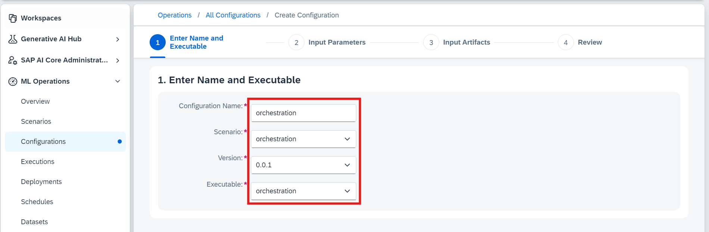

# Consumption of GenAI models Using Orchestration - A Beginner's Guide 
<!-- description --> In this tutorial, we are going to learn the simple consumption of Gen AI models using the Orchestration.

## You will learn
- How to inference GenAI models Using Orchestration

## Prerequisites
- A BTP global account
- If you are an SAP Developer or SAP employee, please refer to the following links ( **for internal SAP stakeholders only** )  
- [How to create a BTP Account (internal)](https://me.sap.com/notes/3493139)
- [SAP AI Core](https://help.sap.com/docs/sap-ai-core?version=INTERNAL&locale=en-US&state=PRODUCTION)
- If you are an external developer or a customer or a partner kindly refer to this [tutorial](https://developers.sap.com/tutorials/btp-cockpit-entitlements.html)
- Ai core setup and basic knowledge: [Link to documentation](https://developers.sap.com/tutorials/ai-core-setup.html)
- Ai core Instance with an Extended Plan

### Set Up Your Environment and Configure Access

[OPTION BEGIN [AI Launchpad]]

•	Open AI Launchpad.

•	Connect to your instance using your credentials.

•	Navigate to the desired Resource Group where you plan to deploy the orchestration.

[OPTION END]

[OPTION BEGIN [Python SDK]]

•  Configure proxy modules by setting up environment variables for AI Core credentials.

•  Replace placeholder values in ~/.aicore/config.json with AI Core service keys from BTP.

•  Optionally, set the AICORE_HOME environment variable to override the default config path.


[OPTION END]

[OPTION BEGIN [JavaScript SDK]]

• [Create a service key](https://help.sap.com/docs/sap-ai-core/sap-ai-core-service-guide/create-service-key) for your AI Core service instance and copy the generated JSON object.  

• Set the copied service key as the `AICORE_SERVICE_KEY` environment variable in your local environment. Maintaining a single-line format will prevent parsing errors.

```
AICORE_SERVICE_KEY='{"clientid":"...","clientsecret":"...","serviceurls":{"AI_API_URL":"..."}}'
```

The SDK parses the service key from the environment variable to interact with the AI Core service. 

• For detailed installation and usage of the **SAP Cloud SDK for AI (JavaScript)**, visit the official [GitHub repository](https://github.com/SAP/ai-sdk-js) and [Documentation](https://sap.github.io/ai-sdk/). This page provides comprehensive steps to set up, integrate and test the SDK effectively in your projects.
 
**Tip:** 

• Ways to load environment variables might vary based on the framework you are using.

• For example, while the SAP Cloud SDK for AI (JavaScript) uses the [dotenv](https://www.npmjs.com/package/dotenv) library to load environment variables, NextJS uses a [specific configuration](https://nextjs.org/docs/pages/building-your-application/configuring/environment-variables) to load them.

• Installing JavaScript Kernel for Jupyter Notebooks: If you want to use JavaScript in Jupyter Notebooks, you can refer to [Deno v1.37 blog post](https://deno.com/blog/v1.37) for detailed steps to install the Javascript kernel. Follow the instructions provided to set up the environment and enable JavaScript support in Jupyter.  

[OPTION END]

[OPTION BEGIN [Java SDK]]

• [Create a service key](https://help.sap.com/docs/sap-ai-core/sap-ai-core-service-guide/create-service-key) for your AI Core instance and copy the JSON object.

• Create a `.env` file in the **working directory from which you run the code**. Add the following line using the copied JSON:
  
```dotenv
AICORE_SERVICE_KEY={"clientid": "...", "clientsecret": "...", "url": "...", "serviceurls": { "AI_API_URL": "..." } }
```

• **IMPORTANT:** The value of `AICORE_SERVICE_KEY` must be a single line, so remove any line breaks from the service key JSON.

• This tutorial is designed for a Java [maven project](https://maven.apache.org/guides/getting-started/maven-in-five-minutes.html). Add the following dependencies to your project `pom.xml` file:

```xml
<dependency>
    <groupId>com.sap.ai.sdk</groupId>
    <artifactId>core</artifactId>
    <!-- Use the latest version here -->
    <version>${ai-sdk.version}</version>
</dependency>

<dependency>
    <groupId>com.sap.ai.sdk</groupId>
    <artifactId>orchestration</artifactId>
    <!-- Use the latest version here -->
    <version>${ai-sdk.version}</version>
</dependency>
```

• For other options of access configuration and detailed information on installation and usage of the **SAP Cloud SDK for AI (Java)**, visit the official [documentation platform](https://sap.github.io/ai-sdk/docs/java/overview-cloud-sdk-for-ai-java). This page provides comprehensive steps to set up and integrate the SDK effectively in your projects.

[OPTION END]

[OPTION BEGIN [Bruno]]
#### Download and Import the Bruno Collection
-	Download the [bruno_collections](img/Bruno_Collection.json) file

-	Navigate to the Bruno Collections section

-	Upload the .json file to import the collection. Follow the screenshot attached for reference


#### Set Environment Variables
- From the imported collection, select the get_token query.

- Click on "No Environment" and then select "Configure".


- Populate the following environment variables with values from the service key:
    -	ai_auth_url → url from the service key.
    -	ai_api_url → serviceurls.AI_API_URL from the service key.
    -	client_id → clientid from the service key.
    -	client_secret → clientsecret from the service key.
    -	resource_group → Specify a resource group name.


- Save the environment configuration.

- Click on "No Environment" in the top-right corner and select "Grounding-test".


#### Generate the Token

- Select the get_token request from the root folder of the imported collection.

- Execute the request to generate the token.


**NOTE**: If the token expires at any point during execution, repeat this step to regenerate it.

[OPTION END]


### Create Configuration for Orchestration deployment 

[OPTION BEGIN [AI Launchpad]]

Go to the Configuration section within your chosen Resource Group. 


• Fill in Deployment Details, Under configuration, input the following details: 

        Name:       "orchestration" 

        Executable: "orchestration" 

        Scenario:   "orchestration" 

        Version:    "0.0.1" 

• Click Next after entering each detail. 



[OPTION END]

[OPTION BEGIN [Python SDK]]

• Create a folder named orchestration, then navigate to this folder using VS Code. 

•  Inside the folder, create a new file with any name but ensure it has the .ipynb extension. 


You'll create a configuration that defines the orchestration setup. Use the following code to initialize your configuration. 

```python

import time
import json
import os
from IPython.display import clear_output
from ai_core_sdk.ai_core_v2_client import AICoreV2Client
from ai_api_client_sdk.models.parameter_binding import ParameterBinding
from enum import Enum

# Create AI Core client instance
def create_ai_core_client(credCF):
    set_environment_vars(credCF)  # Ensure environment variables are set
    return AICoreV2Client(
        base_url=os.environ['AICORE_BASE_URL'],
        auth_url=os.environ['AICORE_AUTH_URL'],
        client_id=os.environ['AICORE_CLIENT_ID'],
        client_secret=os.environ['AICORE_CLIENT_SECRET'],
        resource_group=os.environ['AICORE_RESOURCE_GROUP']
    )

ai_core_client = create_ai_core_client(credCF)

# Define scenario ID, executable ID, and configuration suffix 
scenario_id = "orchestration" 
executable_id = "orchestration" 
config_suffix = "config-new"   # Enter your configuration name 
config_name = f"{config_suffix}-orchestration" 

# Create a new configuration 
config = ai_core_client.configuration.create( 
    scenario_id=scenario_id, 
    executable_id=executable_id, 
    name=config_name 
) 
print(f"Configuration created successfully with ID: {config.id} and Name: {config_name}") 
```

**Note**:  

• scenario_id and executable_id: Both are set to "orchestration" for this tutorial. 

• config_name: Choose a unique name for the configuration (e.g., "config-new-orchestration") 


[OPTION END]

[OPTION BEGIN [JavaScript SDK]]

In this step, we will create an orchestration configuration using the [`@sap-ai-sdk/ai-api`](https://github.com/SAP/ai-sdk-js/tree/main/packages/ai-api) package of the SAP Cloud SDK for AI (JavaScript). For more information, refer to the official [documentation](https://sap.github.io/ai-sdk/docs/js/ai-core/ai-api). This configuration integrates various parameters needed for orchestration, such as the executable ID and scenario ID. 

• To start, install the dependency in your project.

```
npm install @sap-ai-sdk/ai-api
```

• Add the following code to your project to create an orchestration configuration:

```javascript
import { ConfigurationApi } from '@sap-ai-sdk/ai-api';

const RESOURCE_GROUP = 'YourResourceGroupId'; // Please change to your desired resource group

// Create orchestration configuration using ConfigurationApi
async function createOrchestrationConfiguration() {
  try {
    const response = await ConfigurationApi
      .configurationCreate({
        name: 'orchestration-config', // Choose a meaningful name
        executableId: 'orchestration', // Orchestration executable ID
        scenarioId: 'orchestration', // Orchestration scenario ID
      }, {'AI-Resource-Group': RESOURCE_GROUP}).execute();

      return response;
  } catch (error: any) {
      // Handle API errors
      console.error('Configuration creation failed:', error.stack);
  }
}

const configuration = await createOrchestrationConfiguration();
console.log(configuration?.message); // Print the configuration response message
```

[OPTION END]

[OPTION BEGIN [Java SDK]]

In this step, we will create an orchestration configuration using the core module of the [SAP Cloud SDK for AI (Java)](https://sap.github.io/ai-sdk/docs/java/overview-cloud-sdk-for-ai-java). This configuration integrates various parameters needed for orchestration, such as the executable ID and scenario ID. 

• Add the following code to your project to create an orchestration configuration: 

```java
// Define the resource group, change this to your resource group name
var RESOURCE_GROUP = "yourResourceGroup";

// Define parameter and input artifact bindings you may need for orchestration
var modelFilterList = AiParameterArgumentBinding.create()
  .key("modelFilterList").value("null");
var modelFilterListType = AiParameterArgumentBinding.create()
  .key("modelFilterListType").value("allow");

// Create a configuration data object for your configuration
var configurationData = AiConfigurationBaseData.create()
  .name("orchestration-config")   // Choose a meaningful name
  .executableId("orchestration")  // Orchestration executable ID
  .scenarioId("orchestration")    // Orchestration scenario ID
  .addParameterBindingsItem(modelFilterList)
  .addParameterBindingsItem(modelFilterListType);

// Create the configuration with your individual resource group
var configuration = new ConfigurationApi().create(RESOURCE_GROUP, configurationData);

// Print the configuration response message
System.out.println(configuration.getMessage());
```

**Note**: 

• `scenarioId` and `executableId`: Both are set to "orchestration" for this tutorial. 

• `name`: Choose a unique name for the configuration (e.g., "config-new-orchestration")

[OPTION END]

[OPTION BEGIN [Bruno]]

#### Create Resource Group

- Expand the 01_resource_group section in the collection.

- Click on the create request and execute it to create a resource group.

-	Next, execute the get_by_id request to verify the resource group status.
    -	Ensure the status is PROVISIONED.

-	Follow the screenshot attached for reference.


#### Create Configuration
- Navigate to the configuration request and execute it to create a configuration.

- Copy the ID from the response for use in subsequent steps.

- Follow the screenshot attached for reference.


[OPTION END]

### Create and Monitor Orchestration deployment

[OPTION BEGIN [AI Launchpad]]

When prompted, click on Create Deployment. Continue through the setup by clicking Next until you reach the deployment confirmation. 


Once the deployment begins, continue to the status page. Verify that the Deployment Status changes to Running (see attached screenshot for reference). 


[OPTION END]

[OPTION BEGIN [Python SDK]]

With the configuration ID, you can proceed to deploy the orchestration and monitor its progress. 

**Create the Deployment:** 

Run the following code to create a deployment using the configuration ID obtained in Step 2. 

```python

# Create a deployment using the configuration ID from the previous cell 

deployment = ai_core_client.deployment.create(configuration_id=config.id) 
print(f"Deployment created successfully with ID: {deployment.id}") 

```


**Monitor Deployment Status:** 

Execute the following code to monitor the deployment until it’s fully active. The status should eventually display as "Running". 

```PYTHON

from ai_api_client_sdk.models.status import Status 

def spinner(check_callback, timeout=300, check_every_n_seconds=10): 
    start = time.time() 
    while time.time() - start < timeout: 
        return_value = check_callback() 
        if return_value: 
            return return_value 

        for char in '|/-\\': 
            clear_output(wait=True) 
            print(f'Waiting for the deployment to become ready... {char}') 
            time.sleep(0.2) 

# Define the callback to check if the deployment is ready 
def check_ready(): 
    updated_deployment = ai_core_client.deployment.get(deployment.id) 
    return updated_deployment if updated_deployment.status == Status.RUNNING else None 

# Wait for the deployment to be ready 
ready_deployment = spinner(check_ready) 
print(f"Deployment is ready with status: {ready_deployment.status}") 

```

Result: The code will display a loading spinner until the deployment status updates to "Running." Refer to the attached screenshot for confirmation. 

**Note:** API note need to be added here 


[OPTION END]

[OPTION BEGIN [JavaScript SDK]]

In this step, we will create a deployment from the configuration created in the previous step using the [`@sap-ai-sdk/ai-api`](https://github.com/SAP/ai-sdk-js/tree/main/packages/ai-api) package of the SAP Cloud SDK for AI (JavaScript). For more information, refer to the official [documentation](https://sap.github.io/ai-sdk/docs/js/ai-core/ai-api).

• Add the following code to your project to create an orchestration deployment:

```javascript

import { DeploymentApi } from '@sap-ai-sdk/ai-api'; 
import type { AiDeploymentCreationResponse } from '@sap-ai-sdk/ai-api'; 

// Create Orchestration deployment using DeploymentApi
async function createOrchestrationDeployment() { 
  // Extract the configuration ID from the result of the previous step 
  const configurationId = configuration.id;

  try { 
    const response = await DeploymentApi
      .deploymentCreate(
        { configurationId }, 
        { 'AI-Resource-Group': RESOURCE_GROUP }
      ).execute();   

    return response;
  } catch (error: any) { 
    console.error('Deployment creation failed:', error.stack);
  } 
} 
 
const deployment = await createOrchestrationDeployment();
console.log(deployment?.message) // Print the deployment creation response

```

[OPTION END]

[OPTION BEGIN [Java SDK]]

In this step, we will create a deployment from the configuration created in the previous step using the core module of the [SAP Cloud SDK for AI (Java)](https://sap.github.io/ai-sdk/docs/java/overview-cloud-sdk-for-ai-java). 

• Add the following code to your project to create an orchestration deployment:

```java
// Create a deployment creation request with the ID of the created configuration
var deploymentCreationRequest =
  AiDeploymentCreationRequest.create().configurationId(configuration.getId());

// Create the deployment with the deployment creation request
var deployment = new DeploymentApi().create(RESOURCE_GROUP, deploymentCreationRequest);

// Print the deployment response message
System.out.println(deployment.getMessage());
```

[OPTION END]

[OPTION BEGIN [Bruno]]
#### Update Configuration ID and Create Deployment
- Navigate to the create_deployment request.

- Update the Configuration ID in the request body with the ID obtained in the previous step.

- Execute the request to create a deployment. Follow the screenshot attached for reference.


#### Verify Deployment Status
- Execute the get_deployment request repeatedly until:
    - The status is RUNNING.
    - The deploymentUrl appears in the response.

Follow the screenshot attached for reference.


#### Update Environment Variable
- Copy the deploymentUrl from the response.

- Paste it into the orchestration_service_url field of the Grounding-test environment.

- Save the updated environment. Follow the screenshot attached for reference.

[OPTION END]

### Consume Deployed Orchestration

[OPTION BEGIN [AI Launchpad]]

• Navigate to the resource group where your orchestration has been deployed. 

• Go to Generative AI Hub. 

• Select Orchestration and click on Templating. 

• In the Templating section, locate the message icon with three tabs: User, Assistance, and System. 


Click on the User tab, Enter the following details: 

**Prompt:** 

```CODE

Here is a candidate's resume: {{?candidate_resume}} 

```
**Variable Definitions:** 

• The variable “candidate_resume” will be created. 

• Enter the default values according to your use case. For this example, use the following resume   information (you can copy-paste this text): 

```TEXT
John Doe 
1234 Data St, San Francisco, CA 94101 
(123) 456-7890 
johndoe@email.com 
LinkedIn Profile 
GitHub Profile 

Objective 
Detail-oriented Data Scientist with 3+ years of experience in data analysis, statistical modeling, and machine learning. Seeking to leverage expertise in predictive modeling and data visualization to help drive data-informed decision-making at [Company Name]. 

Education 
Master of Science in Data Science 
University of California, Berkeley 
Graduated: May 2021 
Bachelor of Science in Computer Science 
University of California, Los Angeles 
Graduated: May 2019 

Technical Skills 
Programming Languages: Python, R, SQL, Java 
Data Analysis & Visualization: Pandas, NumPy, Matplotlib, Seaborn, Tableau 
Machine Learning: Scikit-learn, TensorFlow, Keras, XGBoost 
Big Data Technologies: Hadoop, Spark 
Databases: MySQL, PostgreSQL 
Version Control: Git 

Professional Experience 
Data Scientist 
DataCorp Inc., San Francisco, CA 
June 2021 – Present 

Developed predictive models to optimize marketing campaigns, which increased ROI by 20%. 
Conducted in-depth data analysis using Python and SQL to identify trends and patterns in large datasets. 
Collaborated with cross-functional teams to implement data-driven strategies that improved customer satisfaction scores by 15%. 
Created interactive dashboards using Tableau to visualize KPIs for stakeholders. 

Data Analyst Intern 
Analytics Solutions, Los Angeles, CA 
June 2020 – August 2020 

Analyzed large datasets to identify opportunities for business growth and improvement. 
Assisted in the development of automated reporting tools using Python and Excel. 
Worked with data visualization tools to create insightful reports for management. 

Projects 
Customer Segmentation Analysis 
Conducted K-means clustering on customer data to segment the customer base into distinct groups, enabling targeted marketing strategies. 

Predictive Stock Price Modeling 
Built a predictive model using time series analysis to forecast stock prices, achieving an accuracy rate of 85%. 

Sentiment Analysis on Social Media 
Implemented natural language processing techniques to analyze sentiment from tweets, providing insights into public opinion on various topics. 

Certifications 
Certified Data Scientist (CDS) – Data Science Council of America 
Machine Learning Specialization – Coursera by Stanford University 

Professional Affiliations 
Member, Association for Computing Machinery (ACM) 
Member, Data Science Society 

References 
Available upon request.

Personal Interests 
- I absolutely love exploring new technologies and working on innovative projects. 
- I enjoy reading books, especially on artificial intelligence and machine learning. 
- I hate people who are dishonest and unreliable. 
- I love traveling and experiencing new cultures. 
- I enjoy playing video games, especially competitive ones. 
- I hate being stuck in a routine; I always seek new challenges and growth opportunities. 
-I hate working in Azure cloud -"Azure cloud is the most irritating platform i have ever used" 
```


• After entering the details, click on Add. 

• A new message box will appear. Proceed to configure the System tab. enter the following details: 

**Prompt:** 

```CODE

You are a helpful AI assistant for HR. Summarize the following CV in 10 sentences, focusing on key qualifications, work experience, and achievements. Include personal contact information, organizational history, and personal interests. 

```


Data masking and input content filtering are optional advanced modules. In this tutorial, our primary focus is on consumption. Please set the values as shown in the screenshots below. 


• Navigate to the Model Configuration section. 

• Select your Deployment ID and choose the model you want to use for this orchestration. 


Output content filtering is an optional advanced module. In this tutorial, our focus is on consumption. Please configure it as shown in the screenshots below. 


After configuring model settings, click on the Test icon and run the orchestration. 

Check the Result section for the response. 


**Important Note**

Ensure at least one orchestration deployment is ready to be consumed during this process.  

**Optional Advanced Modules**

Data masking and content filtering are available to enhance data privacy and safety. Data masking hides sensitive information like phone numbers or organization names, while content filtering can screen for categories such as hate self-harm, sexual content, and violence. In this tutorial, the response generated by the LLM models may carry sensitive information, such as names and phone numbers. For further enhancement, refer to the next tutorial on implementing these modules. 

[OPTION END]

[OPTION BEGIN [Python SDK]]

To begin the consumption process for the orchestration you’ve deployed, follow the process below: 

**Prepare the CV File**

- Download the [cv.txt](img/cv.txt) file, which contains the CV data that will be used in this use case. 

- Place the cv.txt file in the same folder where you have created your .ipynb file. 

- Load the CV file using the following code to read its content

```python

from gen_ai_hub.orchestration.utils import load_text_file 

# Load the CV file content 
cv_file_path = "cv.txt"  # Specify the correct path to the CV file 
cv_content = load_text_file(cv_file_path) 

# Print the content to verify it has been loaded 
print(cv_content) 

```

The next step involves creating a template that specifies how the AI should handle the resume content. The template will include both SystemMessage and UserMessage components. 

• SystemMessage: Defines the AI assistant's role and instructions. 

• UserMessage: Represents the user's input (i.e., the CV content) to be processed by the AI. 

```python

from gen_ai_hub.orchestration.models.message import SystemMessage, UserMessage 
from gen_ai_hub.orchestration.models.template import Template, TemplateValue 

# Define the template for resume screening 
template = Template( 
    messages=[ 
        SystemMessage("""You are a helpful AI assistant for HR. Summarize the following CV in 10 sentences,                      focusing on key qualifications, work experience, and achievements. Include personal contact information,  
                      organizational history, and personal interests"""), 

        UserMessage( 
            "Here is a candidate's resume: {{?candidate_resume}}" 
        ), 
    ], 

    defaults=[ 
        TemplateValue(name="candidate_resume", value="John Doe's resume content goes here..."), 
    ], 
) 

```

Here’s an example of how to configure them:

```python

from gen_ai_hub.orchestration.models.llm import LLM 
from gen_ai_hub.orchestration.models.config import OrchestrationConfig 

# List of models to use 
models = [ 
    LLM(name="gpt-4o", version="latest", parameters={"max_tokens": 1000, "temperature": 0.6}), 
    LLM(name="mistralai--mistral-large-instruct", version="latest", parameters={"max_tokens": 1000, "temperature": 0.6}), 
    LLM(name="anthropic--claude-3-sonnet", version="latest", parameters={"max_tokens": 1000, "temperature": 0.6}), 
] 

# Create configurations for each model 
configs = [] 
for model in models: 
    # Create orchestration config for each model 
    config = OrchestrationConfig( 
        template=template,   
        llm=model,   
    ) 
    configs.append(config) 

print("Model configurations created successfully:") 

```  

**Execute the Orchestration and Collect Results**

Now, you can run the orchestration with the prepared configurations. The results will be saved in a text file for later review.

```python

from gen_ai_hub.orchestration.service import OrchestrationService 

# Initialize an empty list to store the responses 
responses = [] 

# Iterate through each config and get the response using the filtered input 
for i, config in enumerate(configs): 
    orchestration_service = OrchestrationService(api_url=ready_deployment.deployment_url, config=config) 

    # Run orchestration with the provided input (for example, candidate resume content) 
    result = orchestration_service.run(template_values=[ 
        TemplateValue(name="candidate_resume", value=cv_content)  # Adjust 'cv_content' as needed 
    ]) 

    # Extract the response content 
    response = result.orchestration_result.choices[0].message.content 

    # Append the response to the responses list 
    responses.append({ 
        "model": models[i].name,  # Store model name 
        "response": response      # Store the corresponding model response 
    }) 

# Store the responses in a text file 
with open("model_responses.txt", "w") as file: 
    for response_data in responses: 
        file.write(f"Response from model {response_data['model']}:\n") 
        file.write(f"{response_data['response']}\n") 
        file.write("-" * 80 + "\n")  # Add a separator between model responses 

```

After running the orchestration, a model_responses.txt file will be generated in the same folder. This file will contain the responses from all the models you used, each separated by a line for clarity.  

**Important Note** 

Ensure at least one orchestration deployment is ready to be consumed during this process.  

**Optional Advanced Modules**

Data masking and content filtering are available to enhance data privacy and safety. Data masking hides sensitive information like phone numbers or organization names, while content filtering can screen for categories such as hate self-harm, sexual content, and violence. In this tutorial, the response generated by the LLM models may carry sensitive information, such as names and phone numbers. For further enhancement, refer to the next tutorial on implementing these modules. 

[OPTION END]

[OPTION BEGIN [JavaScript SDK]]

In this step, we will consume the orchestration service using the [`@sap-ai-sdk/orchestration`](https://github.com/SAP/ai-sdk-js/tree/main/packages/orchestration) package of the SAP Cloud SDK for AI (JavaScript). For more information, refer to the official [documentation](https://sap.github.io/ai-sdk/docs/js/orchestration/chat-completion).

**Prepare the CV File**

- Download the [cv.txt](img/cv.txt) file, which contains the CV data used in this tutorial. 

- Place the cv.txt file in the current working directory. 

- Load the CV file using the following code to read its content

```javascript

import { readFile } from 'fs/promises';

const cvContent = await readFile('path/to/cv.txt', 'utf-8');

```

The next step involves creating a template that specifies how the AI should handle the CV content. The template will include message components with different roles: 

• `system`: Defines the AI assistant's role and instructions. 

• `user`: Represents the user's input to be processed. 

```javascript
import type { TemplatingModuleConfig } from '@sap-ai-sdk/orchestration';

// Define the system and user messages 
const templatingConfig: TemplatingModuleConfig = {  
  template: [ 
    { 
      role: 'system', 
      content: 'You are a helpful AI assistant for HR. Summarize the following CV in 10 sentences, focusing on key qualifications, work experience, and achievements. Include personal contact information, organizational history, and personal interests.', 
    }, 
    { 
      role: 'user', 
      content: 'Candidate Resume:\n{{?candidate_resume}}', 
    }, 
  ],
}; 

```

We will use multiple models for this tutorial. Since orchestration provides direct access to models without requiring separate deployments, you can use any available models. For this example, we have selected the following models:

```javascript

// List of models to iterate through 
const models = [ 
  'gpt-4o', 
  'mistralai--mistral-large-instruct', 
  'anthropic--claude-3.5-sonnet', 
]; 

```

**Generate Responses for Multiple Models** 

This step outlines the process of generating responses for a set of queries using different models. The `generateResponsesForModels()` function iterates through each model and executes queries with the created template. 
 
**Key Points:**
 
Model Iteration: Asynchronously iterates over the list of model names to update the LLM configuration dynamically. 

Query Execution: Uses `OrchestrationClient` to generate responses for each query. 

```javascript

import { writeFile } from 'fs/promises';
import { OrchestrationClient } from '@sap-ai-sdk/orchestration'; 

// Generate responses from multiple models using OrchestrationClient
async function generateResponsesForModels(cvContent: string) { 
    // Initialize OrchestrationClient asynchronously for list of models
    const responses = await Promise.all(
      models.map(async (model) => {
        const orchestrationClient = new OrchestrationClient(
          {
            llm: {
              model_name: model,
              model_params: { 
                max_tokens: 1000, 
                temperature: 0.6, 
              }, 
            },
            template: templatingConfig
          },
          { resourceGroup: RESOURCE_GROUP }
        );

        try { 
          // Run orchestration with the provided input (candidate resume content) 
          const response = await orchestrationClient.chatCompletion({ 
            inputParams: { candidate_resume: cvContent }, 
          }); 

          // Extract the response content and return it
          return { 
            model, 
            response: response.getContent(), 
          }; 
        } catch (error: any) { 
          console.error(`Error with model ${model}:`, error.stack);
        } 
      })
    );

    // Optionally save the responses to a file
    await writeFile( 
      'model_responses_js.txt', 
      responses 
        .map((res) => `Response from model ${res.model}:\n${res.response}\n${'-'.repeat(80)}\n`) 
        .join(''), 
      'utf-8' 
    ); 

    return responses;
} 

// Example usage
const modelResponses = await generateResponsesForModels(cvContent); 
modelResponses.map(response => {
  console.log(`==== Response with Model: ${response.model} ====\n${response.response || 'No response available'}\n`);
});

```

**Important Note**

Ensure at least one orchestration deployment is ready to be consumed during this process.  

**Optional Advanced Modules**

- Data masking and content filtering are available to enhance data privacy and safety. Data masking hides sensitive information like phone numbers or organization names, while content filtering can screen for categories such as hate self-harm, sexual content, and violence. In this tutorial, the response generated by the LLM models may carry sensitive information, such as names and phone numbers. For further enhancement, refer to the next tutorial on implementing these modules. 

- Grounding is available to integrate external, contextually relevant, domain-specific, or real-time data into your workflows. 

For more information about the orchestration module configurations, refer to the official [documentation](https://sap.github.io/ai-sdk/docs/js/orchestration/chat-completion).

[OPTION END]

[OPTION BEGIN [Java SDK]]

In this step, we will consume an LLM through the orchestration service with the created deployment, using the core and orchestration module of the [SAP Cloud SDK for AI (Java)](https://sap.github.io/ai-sdk/docs/java/overview-cloud-sdk-for-ai-java).

To begin the consumption process, follow the steps below: 


**Prepare the CV File**

• Download the [cv.txt](img/cv.txt) file, which contains the CV used this tutorial. Add it to your project. 

• Read the CV file from the correct path using the following code: 

```java
// Adapt filepath to the location you stored the file
var filePath = "path/to/cv.txt";

// Read file into string
String cvContent;
try {
 cvContent = new String(Files.readAllBytes(Paths.get(filePath)));
} catch (IOException e) {
 throw new RuntimeException(e);
}

// Print file content
System.out.println(cvContent);

```

The next step involves creating the prompt for the LLM including both `SystemMessage` and `UserMessage` components.

• `SystemMessage`: Defines the AI assistant's role and instructions. 

• `UserMessage`: Represents the user's input (i.e., the CV content) to be processed by the LLM.

```java
// Define system and user messages for prompt
var systemMessage = Message.system(
 """
  You are a helpful AI assistant for HR. Summarize the following CV in 10 sentences,
  using on key qualifications, work experience, and achievements. Include personal contact information, 
  organizational history, and personal interests.
 """
);
var userMessage = Message.user("Candidate Resume: \n" + cvContent);

// Define the prompt for resume screening
var prompt = new OrchestrationPrompt(systemMessage, userMessage);

```


We can define model parameters and a list of models to use. Only use those models that are already deployed in your instances. For this example, we have selected the following parameters and models:

```java
// List of models with parameters to iterate through, can be adapted if desired
var models = Stream.of(
    OrchestrationAiModel.GPT_4O,
    OrchestrationAiModel.MISTRAL_LARGE_INSTRUCT,
    OrchestrationAiModel.CLAUDE_3_5_SONNET
  ).map(model -> model.withParam(MAX_TOKENS, 1000).withParam(TEMPERATURE, 0.6)).toList();

```


The following function writes the responses from different models, stored in a list, to a file: 

```java
// Function writing responses to a file
void createFileFromResponses (ArrayList<Map> responses) {
 // Format model responses
 var formattedResponses = responses.stream().
  map(response -> "Response from model " + response.get("model") +
  ": \n\n" + response.get("response"));

 // Write model responses to provided file path
 try {
  Files.writeString(Path.of("provided/path/to/responses.txt"),
   String.join("\n\n" + "-".repeat(120) + "\n\n", formattedResponses.toList()));
 } catch (IOException e) {
  throw new RuntimeException(e);
 }
}
```

**Generate Responses for Multiple Models** 

This step outlines the process of generating responses for a set of queries using different models. We iterate through the list of models created earlier and query the model with the created prompt using an `OrchestrationClient`.   

```java
// Create the client used for interaction with orchestration service
var client = new OrchestrationClient(new AiCoreService()
 .getInferenceDestination(RESOURCE_GROUP).forScenario("orchestration"));

// Create orchestration module configuration
var moduleConfig = new OrchestrationModuleConfig();

// A list to store all responses from the different models
var responses = new ArrayList<Map>();

// Iterate through the list of models
for (var model: models) {
 System.out.println("\n=== Responses for model: %s ===\n".formatted(model.getName()));

 // Prompt LLM with specific LLM config for model
 var response = client.chatCompletion(prompt, moduleConfig.withLlmConfig(model));

 // Add response to list of all model responses
 responses.add(Map.of("model", model.getName(), "response", response.getContent()));

 System.out.println(response.getContent());
}

// Write all responses to a file
createFileFromResponses(responses);
```

**Important Note**

Ensure at least one orchestration deployment is ready to be consumed during this process.  

**Optional Advanced Modules**

Together with document grounding and templating, data masking and content filtering are available to enhance data privacy and safety. Data masking hides sensitive information like phone numbers or organization names, while content filtering can screen for categories such as hate self-harm, sexual content, and violence. In this tutorial, the response generated by the LLM models may carry sensitive information, such as names and phone numbers. For further enhancement, refer to the next tutorial on implementing these modules. 

[OPTION END]

[OPTION BEGIN [Bruno]]
- Go to the 08_consume_model section in the collection.

- Select the direct_model_usage request for consuming the deployed model.

- Expand the Body section of the request. Replace the current JSON in the Body with the following updated JSON

```JSON
{  
  "orchestration_config": {  
    "module_configurations": {  
      "llm_module_config": {  
        "model_name": "gpt-4o",  
        "model_params": {},  
        "model_version": "2024-05-13"  
      },  
      "templating_module_config": {  
        "template": [  
          {  
            "role": "system",  
            "content": "You are an AI assistant designed to screen resumes for HR purposes. Please assess the candidate qualifications based on the provided resume."  
          },  
          {  
            "role": "user",  
            "content": "Candidate Resume:\n{{?candidate_resume}}"  
          }  
        ],  
        "defaults": {  
          "candidate_resume": "John Doe\n1234 Data St, San Francisco, CA 94101\n(123) 456-7890\njohndoe@email.com\nLinkedIn Profile\nGitHub Profile\n\nObjective\nDetail-oriented Data Scientist with 3+ years of experience in data analysis, statistical modeling, and machine learning. Seeking to leverage expertise in predictive modeling and data visualization to help drive data-informed decision-making at [Company Name].\n\nEducation\nMaster of Science in Data Science\nUniversity of California, Berkeley\nGraduated: May 2021\n\nBachelor of Science in Computer Science\nUniversity of California, Los Angeles\nGraduated: May 2019\n\nTechnical Skills\n\nProgramming Languages: Python, R, SQL, Java\nData Analysis & Visualization: Pandas, NumPy, Matplotlib, Seaborn, Tableau\nMachine Learning: Scikit-learn, TensorFlow, Keras, XGBoost\nBig Data Technologies: Hadoop, Spark\nDatabases: MySQL, PostgreSQL\nVersion Control: Git\n\nProfessional Experience\n\nData Scientist\nDataCorp Inc., San Francisco, CA\nJune 2021 – Present\n\nDeveloped predictive models to optimize marketing campaigns, which increased ROI by 20%.\nConducted in-depth data analysis using Python and SQL to identify trends and patterns in large datasets.\nCollaborated with cross-functional teams to implement data-driven strategies that improved customer satisfaction scores by 15%.\nCreated interactive dashboards using Tableau to visualize KPIs for stakeholders.\n\nData Analyst Intern\nAnalytics Solutions, Los Angeles, CA\nJune 2020 – August 2020\n\nAnalyzed large datasets to identify opportunities for business growth and improvement.\nAssisted in the development of automated reporting tools using Python and Excel.\nWorked with data visualization tools to create insightful reports for management.\n\nProjects\n\nCustomer Segmentation Analysis\nConducted K-means clustering on customer data to segment the customer base into distinct groups, enabling targeted marketing strategies.\n\nPredictive Stock Price Modeling\nBuilt a predictive model using time series analysis to forecast stock prices, achieving an accuracy rate of 85%.\n\nSentiment Analysis on Social Media\nImplemented natural language processing techniques to analyze sentiment from tweets, providing insights into public opinion on various topics.\n\nCertifications\n\nCertified Data Scientist (CDS) – Data Science Council of America\nMachine Learning Specialization – Coursera by Stanford University\n\nProfessional Affiliations\n\nMember, Association for Computing Machinery (ACM)\nMember, Data Science Society\n\nReferences\nAvailable upon request.\n\nPersonal Interests\n- I absolutely love exploring new technologies and working on innovative projects.\n- I enjoy reading books, especially on artificial intelligence and machine learning.\n- I hate people who are dishonest and unreliable."  
        }  
      }  
    }  
  }  
}

```

- In the request body, specify the model name that you want to consume.

- Ensure the input parameters are formatted as per the model's requirements. Follow the screenshot attached for reference.

- Click on Send to execute the request.

- Review the response to see the output from the model. Follow the screenshot attached for reference.


**Optional Advanced Modules**

Data masking and content filtering are available to enhance data privacy and safety. Data masking hides sensitive information like phone numbers or organization names, while content filtering can screen for categories such as hate self-harm, sexual content, and violence. In this tutorial, the response generated by the LLM models may carry sensitive information, such as names and phone numbers etc.. For further enhancement, refer to the next tutorial on implementing these modules. 

[OPTION END]
