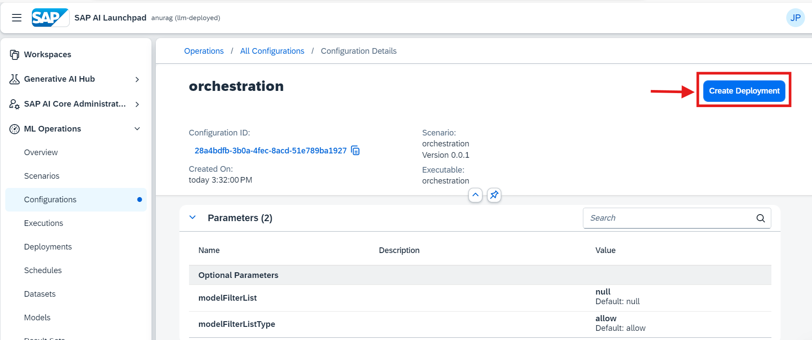

# Consumption of GenAI models Using Orchestration service V2 - A Beginner's Guide 
<!-- description --> In this tutorial, we are going to learn the simple consumption of Gen AI models using the Orchestration.

## You will learn
- How to inference GenAI models Using Orchestration Service v2

## Prerequisites
1. **BTP Account**  
   Set up your SAP Business Technology Platform (BTP) account.  
   [Create a BTP Account](https://developers.sap.com/group.btp-setup.html)
2. **For SAP Developers or Employees**  
   Internal SAP stakeholders should refer to the following documentation: [How to create BTP Account For Internal SAP Employee](https://me.sap.com/notes/3493139), [SAP AI Core Internal Documentation](https://help.sap.com/docs/sap-ai-core)
3. **For External Developers, Customers, or Partners**  
   Follow this tutorial to set up your environment and entitlements: [External Developer Setup Tutorial](https://developers.sap.com/tutorials/btp-cockpit-entitlements.html), [SAP AI Core External Documentation](https://help.sap.com/docs/sap-ai-core?version=CLOUD)
4. **Create BTP Instance and Service Key for SAP AI Core**  
   Follow the steps to create an instance and generate a service key for SAP AI Core:  
   [Create Service Key and Instance](https://help.sap.com/docs/sap-ai-core/sap-ai-core-service-guide/create-service-key?version=CLOUD)
5. **AI Core Setup Guide**  
   Step-by-step guide to set up and get started with SAP AI Core:  
   [AI Core Setup Tutorial](https://developers.sap.com/tutorials/ai-core-setup.html)
6. An Extended SAP AI Core service plan is required, as the Generative AI Hub is not available in the Free or Standard tiers. For more details, refer to 
[SAP AI Core Service Plans](https://help.sap.com/docs/sap-ai-core/sap-ai-core-service-guide/service-plans?version=CLOUD)

### Pre-Read

This tutorial provides a basic introduction to using **orchestration service V2 in SAP AI Core**.

**Orchestration service V2 in SAP AI Core is a managed service that enables unified access, control, and execution of generative AI models through standardized APIs, templating, and configurable AI workflow components.**

You will learn how to deploy and configure orchestration to enable the consumption of ** GenAI models** within a single workflow.

We will walk through a **step-by-step guide** and demonstrate the orchestration flow using a **resume processing use case**. This real-world scenario highlights how llm models can collaborate within a cohesive pipeline using orchestration.

> **Note:** In SAP AI Core, orchestration deployment is available by default in the default resource group during the onboarding. For any new or additional resource groups, you must deploy a separate orchestration setup.

While orchestration in SAP AI Core offers capabilities such as **data masking, content filtering, translation, and grounding**, this tutorial focuses on the basic consumption flow using mandatory modules like **templating** and **model configuration**. Others modules are Optional and usage of those modules are covered in a separate tutorial.

By the end of this tutorial,

   * you will have a foundational understanding of orchestration through its minimal usage, focusing on practical application of templates and how to use llm models using harmonized APIs.

   * Learn how to implement the solution using **SAP AI Launchpad**, **Python SDK**, **JavaScript**, and **Bruno**.

   Refer to the [orchestration documentation](https://help.sap.com/docs/sap-ai-core/sap-ai-core-service-guide/orchestration-8d022355037643cebf775cd3bf662cc5?locale=en-US&version=CLOUD) for more information.

### Set Up Your Environment and Configure Access

[OPTION BEGIN [AI Launchpad]]

•	Open AI Launchpad.

•	Connect to your instance using your credentials.

•	Navigate to the desired Resource Group where you plan to deploy the orchestration.

For the detailed step follow the tutorial - Setup Generative AI Hub in SAP AI Launchpad

[OPTION END]

[OPTION BEGIN [Python SDK]]

**Installing sap-ai-sdk-gen**

To install the **SAP Cloud SDK for AI (Python) - generative package** in your system, open your terminal or command prompt and run the following command.

``` python
pip install sap-ai-sdk-gen
```

Once the package is installed, you need to configure proxy modules to use the large language models. We recommend setting these values as environment variables for AI Core credentials via a configuration file. The default path for this file is ~/.aicore/config.json.

Open Notepad and replace the placeholder values in the JSON file with your AI Core service keys, which you downloaded from BTP. Save the file by pressing Command + S. When prompted, navigate to ~/.aicore/ and save the file as config.json.

The configuration file should be:


[OPTION END]

[OPTION BEGIN [JavaScript SDK]]

• [Create a service key](https://help.sap.com/docs/sap-ai-core/sap-ai-core-service-guide/create-service-key) for your AI Core service instance and copy the generated JSON object.  

• Set the copied service key as the `AICORE_SERVICE_KEY` environment variable in your local environment. Maintaining a single-line format will prevent parsing errors.

```
AICORE_SERVICE_KEY='{"clientid":"...","clientsecret":"...","serviceurls":{"AI_API_URL":"..."}}'
```

The SDK parses the service key from the environment variable to interact with the AI Core service. 


• Optionally, set the AICORE_HOME environment variable to override the default config path.

• Install the required packages:

``` 
  npm install @sap-ai-sdk/ai-api @sap-ai-sdk/orchestration dotenv
```

• For detailed setup and usage,refer to the official [GitHub repository](https://github.com/SAP/ai-sdk-js/tree/main?tab=readme-ov-file#sap-ai-sdkorchestration) of **SAP Cloud SDK for AI**.


• For detailed installation and usage of the **SAP Cloud SDK for AI (JavaScript)**, visit the official [GitHub repository](https://github.com/SAP/ai-sdk-js) and [Documentation](https://sap.github.io/ai-sdk/). This page provides comprehensive steps to set up, integrate and test the SDK effectively in your projects.
 
**Tip:** 

• Ways to load environment variables might vary based on the framework you are using.

• For example, while the SAP Cloud SDK for AI (JavaScript) uses the [dotenv](https://www.npmjs.com/package/dotenv) library to load environment variables, NextJS uses a [specific configuration](https://nextjs.org/docs/pages/building-your-application/configuring/environment-variables) to load them.

• Installing JavaScript Kernel for Jupyter Notebooks: If you want to use JavaScript in Jupyter Notebooks, you can refer to [Deno v1.37 blog post](https://deno.com/blog/v1.37) for detailed steps to install the Javascript kernel. Follow the instructions provided to set up the environment and enable JavaScript support in Jupyter.  

[OPTION END]

[OPTION BEGIN [Bruno]]
#### Download and Import the Bruno Collection
-	Download the [bruno_collections](img/Bruno_Collection.json) file

-	Navigate to the Bruno Collections section

-	Upload the .json file to import the collection. Follow the screenshot attached for reference


#### Set Environment Variables
- From the imported collection, select the get_token query.

- Click on "No Environment" and then select "Configure".


- Populate the following environment variables with values from the service key:
    -	ai_auth_url → url from the service key.
    -	ai_api_url → serviceurls.AI_API_URL from the service key.
    -	client_id → clientid from the service key.
    -	client_secret → clientsecret from the service key.
    -	resource_group → Specify a resource group name.


- Save the environment configuration.

- Click on "No Environment" in the top-right corner and select "Grounding-test".


#### Generate the Token

- Select the get_token request from the root folder of the imported collection.

- Execute the request to generate the token.


**NOTE**: If the token expires at any point during execution, repeat this step to regenerate it.

[OPTION END]


### Create Configuration for Orchestration deployment - Optional Step

> Execute this step only if orchestration deployment is not available. Other wise **skip** this step and proceed to the next step `Consume LLM's in Generative AI Hub through Orchestration`

> As part of the SAP AI Core onboarding process, an `orchestration deployment` is automatically created in the `default resource group`.

> This means you can start using orchestration in the Generative AI Hub right away—no need to create a separate deployment.

In this step you will be:

* creating the configuration required for the orchestration deployment
* Creating the Orchestration deployment

[OPTION BEGIN [AI Launchpad]]

Go to the Configuration section within your chosen Resource Group. 


• Fill in Deployment Details, Under configuration, input the following details: 

        Name:       "orchestration" 

        Executable: "orchestration" 

        Scenario:   "orchestration" 

        Version:    "0.0.1" 

• Click Next after entering each detail. 


When prompted, click on Create Deployment. Continue through the setup by clicking Next until you reach the deployment confirmation. 



Once the deployment begins, continue to the status page. Verify that the Deployment Status changes to Running (see attached screenshot for reference). 


[OPTION END]

[OPTION BEGIN [Python SDK]]

• Create a folder named orchestration, then navigate to this folder using VS Code. 

•  Inside the folder, create a new file with any name but ensure it has the .ipynb extension. 


You'll create a configuration that defines the orchestration setup. Use the following code to initialize your configuration. 

```python
import time
import json
import os
from IPython.display import clear_output
from ai_core_sdk.ai_core_v2_client import AICoreV2Client
from ai_api_client_sdk.models.parameter_binding import ParameterBinding
from enum import Enum

# Create AI Core client instance
def create_ai_core_client(credCF):
    set_environment_vars(credCF)  # Ensure environment variables are set
    return AICoreV2Client(
        base_url=os.environ['AICORE_BASE_URL'],
        auth_url=os.environ['AICORE_AUTH_URL'],
        client_id=os.environ['AICORE_CLIENT_ID'],
        client_secret=os.environ['AICORE_CLIENT_SECRET'],
        resource_group=os.environ['AICORE_RESOURCE_GROUP']
    )

ai_core_client = create_ai_core_client(credCF)

# Define scenario ID, executable ID, and configuration suffix 
scenario_id = "orchestration" 
executable_id = "orchestration" 
config_suffix = "config-new"   # Enter your configuration name 
config_name = f"{config_suffix}-orchestration" 

# Create a new configuration 
config = ai_core_client.configuration.create( 
    scenario_id=scenario_id, 
    executable_id=executable_id, 
    name=config_name 
) 
print(f"Configuration created successfully with ID: {config.id} and Name: {config_name}") 
```

**Note**:  

• scenario_id and executable_id: Both are set to "orchestration" for this tutorial. 

• config_name: Choose a unique name for the configuration (e.g., "config-new-orchestration") 


With the configuration ID, you can proceed to deploy the orchestration and monitor its progress. 

**Create the Deployment:** 

Run the following code to create a deployment using the configuration ID obtained in Step 2. 

```python
# Create a deployment using the configuration ID from the previous cell 

deployment = ai_core_client.deployment.create(configuration_id=config.id) 
print(f"Deployment created successfully with ID: {deployment.id}") 
```


**Monitor Deployment Status:** 

Execute the following code to monitor the deployment until it’s fully active. The status should eventually display as "Running". 

```PYTHON
from ai_api_client_sdk.models.status import Status 

def spinner(check_callback, timeout=300, check_every_n_seconds=10): 
    start = time.time() 
    while time.time() - start < timeout: 
        return_value = check_callback() 
        if return_value: 
            return return_value 

        for char in '|/-\\': 
            clear_output(wait=True) 
            print(f'Waiting for the deployment to become ready... {char}') 
            time.sleep(0.2) 

# Define the callback to check if the deployment is ready 
def check_ready(): 
    updated_deployment = ai_core_client.deployment.get(deployment.id) 
    return updated_deployment if updated_deployment.status == Status.RUNNING else None 

# Wait for the deployment to be ready 
ready_deployment = spinner(check_ready) 
print(f"Deployment is ready with status: {ready_deployment.status}") 
```

Result: The code will display a loading spinner until the deployment status updates to "Running." Refer to the attached screenshot for confirmation. 

**Note:** API note need to be added here 


[OPTION END]

[OPTION BEGIN [JavaScript SDK]]

In this step, we will create an orchestration configuration using the [`@sap-ai-sdk/ai-api`](https://github.com/SAP/ai-sdk-js/tree/main/packages/ai-api) package of the SAP Cloud SDK for AI (JavaScript). For more information, refer to the official [documentation](https://sap.github.io/ai-sdk/docs/js/ai-core/ai-api). This configuration integrates various parameters needed for orchestration, such as the executable ID and scenario ID. 

• To start, install the dependency in your project.

```
npm install @sap-ai-sdk/ai-api
```

• Add the following code to your project to create an orchestration configuration:

```javascript
import { ConfigurationApi } from '@sap-ai-sdk/ai-api';

const RESOURCE_GROUP = 'YourResourceGroupId'; // Please change to your desired resource group

// Create orchestration configuration using ConfigurationApi
async function createOrchestrationConfiguration() {
  try {
    const response = await ConfigurationApi
      .configurationCreate({
        name: 'orchestration-config', // Choose a meaningful name
        executableId: 'orchestration', // Orchestration executable ID
        scenarioId: 'orchestration', // Orchestration scenario ID
      }, {'AI-Resource-Group': RESOURCE_GROUP}).execute();

      return response;
  } catch (error: any) {
      // Handle API errors
      console.error('Configuration creation failed:', error.stack);
  }
}

const configuration = await createOrchestrationConfiguration();
console.log(configuration?.message); // Print the configuration response message
```

In this step, we will create a deployment from the configuration created in the previous step using the [`@sap-ai-sdk/ai-api`](https://github.com/SAP/ai-sdk-js/tree/main/packages/ai-api) package of the SAP Cloud SDK for AI (JavaScript). For more information, refer to the official [documentation](https://sap.github.io/ai-sdk/docs/js/ai-core/ai-api).

• Add the following code to your project to create an orchestration deployment:

```javascript
import { DeploymentApi } from '@sap-ai-sdk/ai-api'; 
import type { AiDeploymentCreationResponse } from '@sap-ai-sdk/ai-api'; 

// Create Orchestration deployment using DeploymentApi
async function createOrchestrationDeployment() { 
  // Extract the configuration ID from the result of the previous step 
  const configurationId = configuration.id;

  try { 
    const response = await DeploymentApi
      .deploymentCreate(
        { configurationId }, 
        { 'AI-Resource-Group': RESOURCE_GROUP }
      ).execute();   

    return response;
  } catch (error: any) { 
    console.error('Deployment creation failed:', error.stack);
  } 
} 
 
const deployment = await createOrchestrationDeployment();
console.log(deployment?.message) // Print the deployment creation response
```

[OPTION END]

[OPTION BEGIN [Bruno]]

#### Create Resource Group

- Expand the 01_resource_group section in the collection.

- Click on the create request and execute it to create a resource group.

-	Next, execute the get_by_id request to verify the resource group status.
    -	Ensure the status is PROVISIONED.

-	Follow the screenshot attached for reference.


#### Create Configuration
- Navigate to the configuration request and execute it to create a configuration.

- Copy the ID from the response for use in subsequent steps.

- Follow the screenshot attached for reference.


- Navigate to the create_deployment request.

- Update the Configuration ID in the request body with the ID obtained in the previous step.

- Execute the request to create a deployment. Follow the screenshot attached for reference.


#### Verify Deployment Status
- Execute the get_deployment request repeatedly until:
    - The status is RUNNING.
    - The deploymentUrl appears in the response.

Follow the screenshot attached for reference.


#### Update Environment Variable
- Copy the deploymentUrl from the response.

- Paste it into the orchestration_service_url field of the Grounding-test environment.

- Save the updated environment. Follow the screenshot attached for reference.


[OPTION END]

###  Consume LLM's in Generative AI Hub through Orchestration

[OPTION BEGIN [AI Launchpad]]

• Navigate to the resource group where your orchestration has been deployed. 

• Go to Generative AI Hub. 

• Select Orchestration and click on create. 


• In the Templating section, locate the message icon with three tabs: User, Assistance, and System. 


Click on the User tab, Enter the following details: 

**Prompt:** 

```CODE
Here is a candidate's resume: {{?candidate_resume}} 
```
**Variable Definitions:** 

• The variable “candidate_resume” will be created. 

• Enter the default values according to your use case. For this example, use the following resume   information (you can copy-paste this text): 

```TEXT
John Doe 
1234 Data St, San Francisco, CA 94101 
(123) 456-7890 
johndoe@email.com 
LinkedIn Profile 
GitHub Profile 

Objective 
Detail-oriented Data Scientist with 3+ years of experience in data analysis, statistical modeling, and machine learning. Seeking to leverage expertise in predictive modeling and data visualization to help drive data-informed decision-making at [Company Name]. 

Education 
Master of Science in Data Science 
University of California, Berkeley 
Graduated: May 2021 
Bachelor of Science in Computer Science 
University of California, Los Angeles 
Graduated: May 2019 

Technical Skills 
Programming Languages: Python, R, SQL, Java 
Data Analysis & Visualization: Pandas, NumPy, Matplotlib, Seaborn, Tableau 
Machine Learning: Scikit-learn, TensorFlow, Keras, XGBoost 
Big Data Technologies: Hadoop, Spark 
Databases: MySQL, PostgreSQL 
Version Control: Git 

Professional Experience 
Data Scientist 
DataCorp Inc., San Francisco, CA 
June 2021 – Present 

Developed predictive models to optimize marketing campaigns, which increased ROI by 20%. 
Conducted in-depth data analysis using Python and SQL to identify trends and patterns in large datasets. 
Collaborated with cross-functional teams to implement data-driven strategies that improved customer satisfaction scores by 15%. 
Created interactive dashboards using Tableau to visualize KPIs for stakeholders. 

Data Analyst Intern 
Analytics Solutions, Los Angeles, CA 
June 2020 – August 2020 

Analyzed large datasets to identify opportunities for business growth and improvement. 
Assisted in the development of automated reporting tools using Python and Excel. 
Worked with data visualization tools to create insightful reports for management. 

Projects 
Customer Segmentation Analysis 
Conducted K-means clustering on customer data to segment the customer base into distinct groups, enabling targeted marketing strategies. 

Predictive Stock Price Modeling 
Built a predictive model using time series analysis to forecast stock prices, achieving an accuracy rate of 85%. 

Sentiment Analysis on Social Media 
Implemented natural language processing techniques to analyze sentiment from tweets, providing insights into public opinion on various topics. 

Certifications 
Certified Data Scientist (CDS) – Data Science Council of America 
Machine Learning Specialization – Coursera by Stanford University 

Professional Affiliations 
Member, Association for Computing Machinery (ACM) 
Member, Data Science Society 

References 
Available upon request.

Personal Interests 
- I absolutely love exploring new technologies and working on innovative projects. 
- I enjoy reading books, especially on artificial intelligence and machine learning. 
- I hate people who are dishonest and unreliable. 
- I love traveling and experiencing new cultures. 
- I enjoy playing video games, especially competitive ones. 
- I hate being stuck in a routine; I always seek new challenges and growth opportunities. 
-I hate working in Azure cloud -"Azure cloud is the most irritating platform i have ever used" 
```


• After entering the details, click on Add. 

• A new message box will appear. Proceed to configure the System tab. enter the following details: 

**Prompt:** 

```CODE
You are a helpful AI assistant for HR. Summarize the following CV in 10 sentences, focusing on key qualifications, work experience, and achievements. Include personal contact information, organizational history, and personal interests. 
```


• Navigate to the Model Configuration section. 

• Select your Deployment ID and choose the model you want to use for this orchestration. 


After configuring model settings, click on the run icon and run the orchestration. 

Check the Result section for the response. 


You can save the created orchestration using the save option as shown in below image


**Important Note**

Ensure at least one orchestration deployment is ready to be consumed during this process.  

**Optional Advanced Modules**

Data masking and content filtering are available to enhance data privacy and safety. Data masking hides sensitive information like phone numbers or organization names, while content filtering can screen for categories such as hate self-harm, sexual content, and violence. In this tutorial, the response generated by the LLM models may carry sensitive information, such as names and phone numbers. For further enhancement, refer to the next tutorial on implementing these modules. 

[OPTION END]

[OPTION BEGIN [Python SDK]]

To begin the consumption process for the orchestration you’ve deployed, follow the process below: 

**Prepare the CV File**

- Download the [cv.txt](img/cv.txt) file, which contains the CV data that will be used in this use case. 

- Place the cv.txt file in the same folder where you have created your .ipynb file. 

- Load the CV file using the following code to read its content

```python
from gen_ai_hub.orchestration_v2.utils import load_text_file

# Load the CV file content 
cv_file_path = "cv.txt"  # Specify the correct path to the CV file 
cv_content = load_text_file(cv_file_path) 

# Print the content to verify it has been loaded 
print(cv_content) 
```

The next step involves creating a template that specifies how the AI should handle the resume content. The template will include both SystemMessage and UserMessage components. 

• SystemMessage: Defines the AI assistant's role and instructions. 

• UserMessage: Represents the user's input (i.e., the CV content) to be processed by the AI. 

```python
from gen_ai_hub.orchestration_v2.models.message import SystemMessage, UserMessage
from gen_ai_hub.orchestration_v2.models.template import Template

# Define the template for resume screening
template = Template(
    template=[
        SystemMessage(content="""You are a helpful AI assistant for HR. Summarize the following CV in 10 sentences, 
                      focusing on key qualifications, work experience, and achievements. Include personal contact information, 
                      organizational history, and personal interests"""),
        UserMessage(content=
            "Here is a candidate's resume: {{?candidate_resume}}"
        ),
    ],
    defaults={"candidate_resume": "John Doe's resume content goes here..."},
)
```

Here’s an example of how to configure them:

```python
from gen_ai_hub.orchestration_v2.models.template import PromptTemplatingModuleConfig
from gen_ai_hub.orchestration_v2.models.llm_model_details import LLMModelDetails

llm = LLMModelDetails(
    name="gpt-5-nano",
    params={"max_completion_tokens": 2048}
)

prompt_module = PromptTemplatingModuleConfig(
    prompt=template,
    model=llm
)
```  

**Execute the Orchestration and Collect Results**

Now, you can run the orchestration with the prepared configurations.

```python
from gen_ai_hub.orchestration_v2.models.config import ModuleConfig, OrchestrationConfig
from gen_ai_hub.orchestration_v2.service import OrchestrationService

modules = ModuleConfig(
    prompt_templating=prompt_module
)

config = OrchestrationConfig(modules=modules)

orchestration_service = OrchestrationService(config=config)

response = orchestration_service.run(
    placeholder_values={
        "candidate_resume": cv_content
    }
)

print(response.final_result.choices[0].message.content)
```


After executing the orchestration, check the response object to view the results. 

**Important Note** 

Ensure at least one orchestration deployment is ready to be consumed during this process.  

**Optional Advanced Modules**

Data masking and content filtering are available to enhance data privacy and safety. Data masking hides sensitive information like phone numbers or organization names, while content filtering can screen for categories such as hate self-harm, sexual content, and violence. In this tutorial, the response generated by the LLM models may carry sensitive information, such as names and phone numbers. For further enhancement, refer to the next tutorial on implementing these modules. 

[OPTION END]

[OPTION BEGIN [JavaScript SDK]]

In this step, we will consume the orchestration service using the [`@sap-ai-sdk/orchestration`](https://github.com/SAP/ai-sdk-js/tree/main/packages/orchestration) package of the SAP Cloud SDK for AI (JavaScript). For more information, refer to the official [documentation](https://sap.github.io/ai-sdk/docs/js/orchestration/chat-completion).

**Prepare the CV File**

- Download the [cv.txt](img/cv.txt) file, which contains the CV data used in this tutorial. 

- Place the cv.txt file in the current working directory. 

- Load the CV file using the following code to read its content

```javascript
import { readFile } from 'fs/promises';

const cvContent = await readFile('path/to/cv.txt', 'utf-8');
```

The next step involves creating a template that specifies how the AI should handle the CV content. The template will include message components with different roles: 

• `system`: Defines the AI assistant's role and instructions. 

• `user`: Represents the user's input to be processed. 

```javascript
import { OrchestrationClient } from '@sap-ai-sdk/orchestration';

const orchestrationClient = new OrchestrationClient({
  promptTemplating: {
    model: {
      name: 'gpt-4o'
    },
    prompt: {
      template: [
        {
          role: 'system',
          content:
            'You are a helpful AI assistant for HR. Summarize the following CV in 10 sentences, focusing on key qualifications, work experience, and achievements. Include personal contact information, organizational history, and personal interests.'
        },
        {
          role: 'user',
          content: 'Candidate Resume:\n{{?candidate_resume}}'
        }
      ]
    }
  }
});
```

We can use any of the llm models for this tutorial. Since orchestration provides direct access to models without requiring separate deployments, you can use any available models. For this example, we have selected the gpt-4o model.

**Generate Responses for llm Models** 

This step outlines the process of generating responses for a set of queries using llm models with the created template. 

Query Execution: Uses `OrchestrationClient` to generate responses for each query. 

```javascript
const response = await orchestrationClient.chatCompletion({
  placeholderValues: {
    candidate_resume: cvContent
  }
});
console.log(response.getContent());
```


After executing the orchestration, check the response object to view the results.


**Important Note**

Ensure at least one orchestration deployment is ready to be consumed during this process.  

**Optional Advanced Modules**

- Data masking and content filtering are available to enhance data privacy and safety. Data masking hides sensitive information like phone numbers or organization names, while content filtering can screen for categories such as hate self-harm, sexual content, and violence. In this tutorial, the response generated by the LLM models may carry sensitive information, such as names and phone numbers. For further enhancement, refer to the next tutorial on implementing these modules. 

- Grounding is available to integrate external, contextually relevant, domain-specific, or real-time data into your workflows. 

For more information about the orchestration module configurations, refer to the official [documentation](https://sap.github.io/ai-sdk/docs/js/orchestration/chat-completion).

[OPTION END]

[OPTION BEGIN [Bruno]]
- Go to the 08_consume_model section in the collection.

- Select the direct_model_usage request for consuming the deployed model.

- Expand the Body section of the request. Replace the current JSON in the Body with the following updated JSON

```JSON
{
  "config": {
    "modules": {
      "prompt_templating": {
        "prompt": {
          "template": [
            {
              "role": "system",
              "content": "You are an AI assistant designed to screen resumes for HR purposes. Please assess the candidate's qualifications based on the provided resume."
            },
            {
              "role": "user",
              "content": "Candidate Resume:\n'''{{?candidate_resume}}'''"
            }
          ]
        },
        "model": {
          "name": "gpt-4o",
          "params": {
            "max_tokens": 500,
            "temperature": 0.2,
            "frequency_penalty": 0,
            "presence_penalty": 0
          }
        }
      }
    }
  },
  "placeholder_values": {
    "candidate_resume": "John Doe\n1234 Data St, San Francisco, CA 94101\n(123) 456-7890\njohndoe@email.com\nLinkedIn Profile\nGitHub Profile\n\nObjective\nDetail-oriented Data Scientist with 3+ years of experience in data analysis, statistical modeling, and machine learning.\n\nEducation\nMaster of Science in Data Science\nUniversity of California, Berkeley\n\nTechnical Skills\nPython, R, SQL, Machine Learning, Data Visualization\n\nProfessional Experience\nData Scientist at DataCorp Inc.\n\nPersonal Interests\n- I absolutely love exploring new technologies.\n- I hate people who are dishonest and unreliable."
  }
}
```

- In the request body, specify the model name that you want to consume.

- Ensure the input parameters are formatted as per the model's requirements. Follow the screenshot attached for reference.

- Click on Send to execute the request.

- Review the response to see the output from the model. Follow the screenshot attached for reference.


**Optional Advanced Modules**

Data masking and content filtering are available to enhance data privacy and safety. Data masking hides sensitive information like phone numbers or organization names, while content filtering can screen for categories such as hate self-harm, sexual content, and violence. In this tutorial, the response generated by the LLM models may carry sensitive information, such as names and phone numbers etc.. For further enhancement, refer to the next tutorial on implementing these modules. 

[OPTION END]
