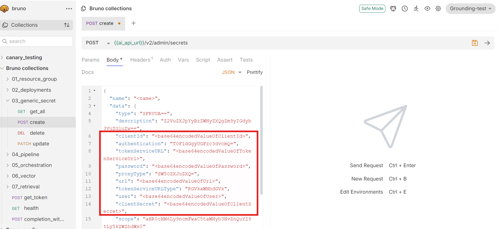
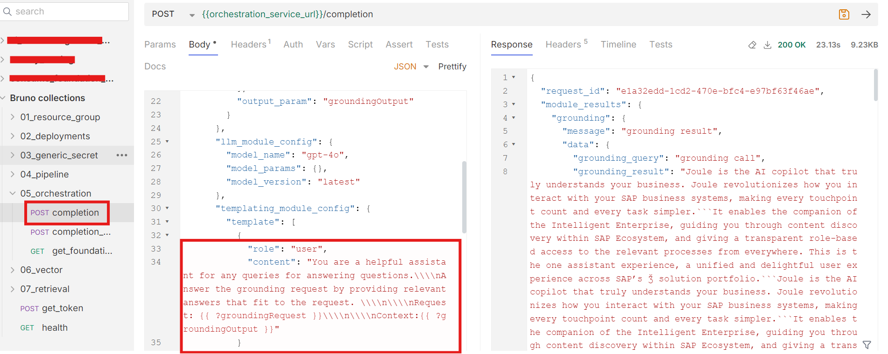

# Orchestration with Grounding Capabilities in SAP AI Core
<!-- description --> This tutorial offers a step-by-step guide on setting up document grounding capabilities, creating pipelines, and leveraging SAP AI Core for tailored use cases. In this scenario, we demonstrate generating interview questions based on job description (JD). By integrating vector-based data repositories as the grounding source, we enable precise retrieval of contextual insights from the documents. This approach ensures that the questions are both relevant and comprehensive, aligning with the role's requirements. Follow this guide to implement a seamless pipeline for generating role-specific interview questions with SAP AI Core.

## You will learn
- How to set up orchestration pipelines, enable document grounding, and perform vector retrieval using SAP AI Core's grounding capabilities

## Prerequisites  

- A BTP global account.
- If you are an SAP Developer or SAP employee, refer to the following links (**for internal SAP stakeholders only**):
  - [How to create a BTP Account (internal)](https://me.sap.com/notes/3493139)
  - [SAP AI Core Documentation](https://help.sap.com/docs/sap-ai-core?version=INTERNAL&locale=en-US&state=PRODUCTION)
- If you are an external developer, customer, or partner, refer to this [tutorial](https://developers.sap.com/tutorials/btp-cockpit-entitlements.html).
- AI Core setup and basic knowledge: [Link to documentation](https://developers.sap.com/tutorials/ai-core-setup.html).
- An AI Core instance with a Standard Plan or Extended Plan.
- Access to Microsoft SharePoint for grounding capabilities.

### 1. Setup Requirements for Document Grounding Tutorial

To set up SAP AI Core for generating interview questions from a job description, the following steps need to be completed: creating a service key, downloading and importing a Bruno collection, setting environment variables, generating a token, creating a resource group, creating a configuration, and deploying the setup. For detailed guidance on these steps, please follow the [Tutorial](https://developers.sap.com/tutorials/ai-core-orchestration-consumption.html) 

### 2. Create generic secret

[OPTION BEGIN [Bruno]]

Generic secrets securely store SharePoint credentials required for document access

•	Expand 03_generic_secret and select create request

•	Please refer to point 2 under https://help.sap.com/docs/joule/integrating-joule-with-sap/configure-access-from-sap-btp?locale=en-US for reference values of MS SharePoint credentials

•	Update clientId, tokenServiceURL, password, url, user and clientSecret according MS SharePoint credentials

•	To prepare your own SharePoint  Create SharePoint Site (optional, you can re-use an existing site if you have one) 

  1.	Create a Group and a Technical User (optional, existing can be reused)
  2.	Register an Application, Generate a Client Secret, & Expose the application using web API
  3.	Validate the SharePoint access with the Technical User

•	All values needs to be provided as base 64 encoded values

[OPTION END]

### 3. Create pipeline

[OPTION BEGIN [Bruno]]

Pipelines define the process for grounding and retrieving content from SharePoint repositories.

In this use case, we are leveraging Job description as the model information document for retrieval, which must be uploaded to the designated SharePoint folder to serve as the grounding document.

•	Expand 04_pipeline and select create_pipeline request

•	Replace value <generic_secret_name> with generic secret name created in step 2

•	Replace value <sharepoint_site_name> with site name of MS SharePoint

•	Replace value <folder_name> with the name of the folder from which the documents have to be taken.Multiple folder names can be specified.

 
[OPTION END]

### 4. Execute orchestration service for retrieval

[OPTION BEGIN [Bruno]] 

This step uses the orchestration service to query grounded documents and retrieve content based on a specified prompt and grounding query. It integrates document grounding configurations and filters to provide precise results. 

•	Expand 05_orchestration and select completion request

•	Change values <prompt> and <grounding query> according to your request

•	Now execute the request

•	Explanation of fields inside grounding_module_config 

  -	type: document_grounding_service → we only support document grounding service as a grounding data source in orchestration service

  -	config.filters[0].data_repositories: data_repositories that was created in using pipeline creation. for initial release, we are only supporting * (search across all data repositories).

  -	config.filters[0].search_config.max_chunk_count: maximum chunk count to be retrieved from document grounding service

  -	config.filters[0].search_config.max_document_count: maximum documents to be searched from document grounding service

  -	config.filters[0].data_repository_type: vector (for customer documents) or help.sap.com

Adding grounding significantly enhances the model's ability to provide accurate and context-specific responses. Without grounding, the model generates generic replies, while with grounding, it retrieves precise information from the uploaded document. Screenshots showcasing both responses are provided for comparison. 

[OPTION END]

### Responses Without grounding

### Responses With grounding

Note: Refer to the screenshots below for guidance on configuring the prompt and grounding query.

