# Orchestration(V2) with Grounding Capabilities in SAP AI Core
<!-- description --> This tutorial provides a step-by-step guide to setting up document grounding, creating pipelines, and utilizing vector APIs for facility management. In our use case, we use facility management emails uploaded to AWS S3 as grounding documents. This enables precise retrieval of relevant information, supporting efficient query resolution and service request handling. Follow this guide to streamline facility-related insights and response processes.

## You will learn
- How to set up orchestration pipelines, enable document grounding, and perform vector retrieval using SAP AI Core's grounding capabilities

## Prerequisites  
1. **BTP Account**  
   If you do not already have a commerical SAP Business Technology Platform (BTP) account, you can use **BTP Advanced Trial**.  
   [Create a BTP Account](https://developers.sap.com/group.btp-setup.html)
2. **For SAP Developers or Employees**  
   Internal SAP stakeholders should refer to the following documentation: [How to create BTP Account For Internal SAP Employee](https://me.sap.com/notes/3493139), [SAP AI Core Internal Documentation](https://help.sap.com/docs/sap-ai-core)
3. **For External Developers, Customers, or Partners**  
   Follow this tutorial to set up your environment and entitlements: [External Developer Setup Tutorial](https://developers.sap.com/tutorials/btp-cockpit-entitlements.html), [SAP AI Core External Documentation](https://help.sap.com/docs/sap-ai-core?version=CLOUD)
4. **Create BTP Instance and Service Key for SAP AI Core**  
   Follow the steps to create an instance and generate a service key for SAP AI Core. Ensure to use service plan **extended**:  
   [Create Service Key and Instance](https://help.sap.com/docs/sap-ai-core/sap-ai-core-service-guide/create-service-key?version=CLOUD)
5. **AI Core Setup Guide**  
   Step-by-step guide to set up and get started with SAP AI Core:  
   [AI Core Setup Tutorial](https://developers.sap.com/tutorials/ai-core-genaihub-provisioning.html)
6. An **Extended** SAP AI Core service plan is required, as the Generative AI Hub is not available in the Free or Standard plans. For more details, refer to 
[SAP AI Core Service Plans](https://help.sap.com/docs/sap-ai-core/sap-ai-core-service-guide/service-plans?version=CLOUD)
7. **AI Launchpad Setup Guide**
 Step-by-step guide to set up AI Launchpad:
 [AI Launchpad Tutorial](https://developers.sap.com/tutorials/ai-launchpad-provisioning.html)


## Pre-read

In this tutorial, we explore how to extend orchestration capabilities in SAP AI Core by incorporating **grounding** — the process of enriching GenAI outputs with **domain-relevant context** to ensure accurate and reliable responses. **Grounding** addresses key challenges such as hallucinations and lack of specificity by connecting the model to external knowledge sources during inference.

In this tutorial we are covering:

- How to create the Data Injestion Pipeline(pipeline API and vectore API options). You can choose either of these options based on the requirements 
- How to use **Amazon S3** or **Microsoft SharePoint** as document repository.
- How to retrieve and verify the content dynamically from uploaded documents.
- How to configure and use grounding in orchestration.  We are focusing on the **grounding** module usage, but in the consumption request you will also find optional modules such as **data masking** and **content filtering** and **templating**, **model configuration** are the mandatory modules in orchestration.
- how to use the solution using **SAP AI Launchpad**, **Python SDK**, **JavaScript**, and **API(Bruno Client)**.

> **Use Case:** In our scenario, we use **facility management emails** uploaded to **Microsoft SharePoint** or **Amazon S3** as grounding documents. The orchestration pipeline retrieves relevant content from these documents and enables **context-aware question answering** using retrieval-augmented generation (RAG).

For additional context, refer to:  
🔗 [Grounding in SAP AI Core (Help Portal)](https://help.sap.com/docs/sap-ai-core/sap-ai-core-service-guide/grounding?version=CLOUD)

**Video links:**

* [End to end usage of grounding using API(Bruno Client)](https://video.sap.com/media/t/1_zkzzd5dk)

**Overview of the tutorial steps:**

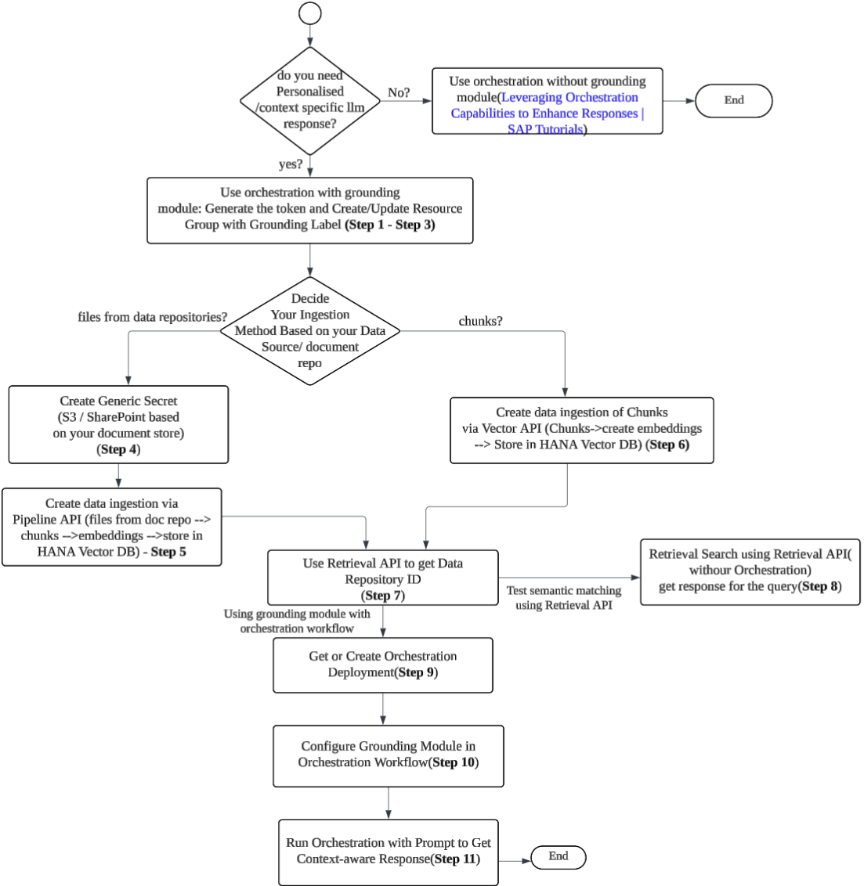


### Create service key for AI Core instance

[OPTION BEGIN [Bruno]]

This step enables the foundational setup of the AI Core instance by creating a service key, which is crucial for accessing and managing the AI Core services in the development environment.

•	Required service plan **extended**. You can follow steps in https://help.sap.com/docs/sap-ai-core/sap-ai-core-service-guide/enabling-service-in-cloud-foundry?locale=en-US to create an AI Core instance and service key in development environment. Ensure to choose service plan **extended**.

#### Download and import Bruno collection

This step prepares the workspace by importing pre-configured requests for easy interaction with AI Core services using Bruno collections.

•	Download [Bruno_config.json](img/Bruno_config.json)

•	Navigate to Bruno Collections and upload the .json file to import collections

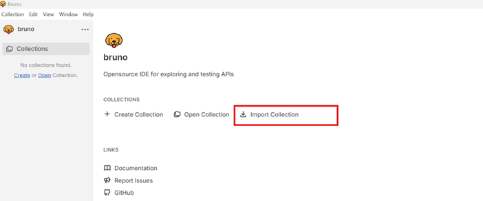

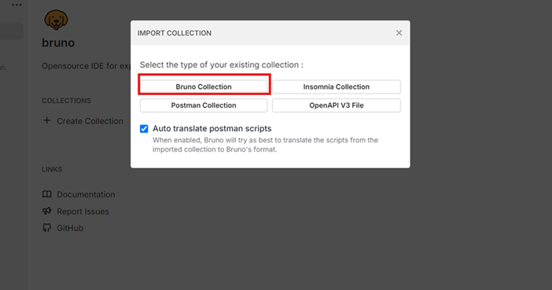

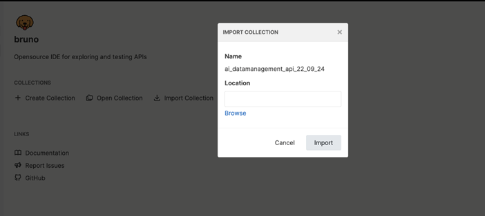

#### Set env variables

Environment variables centralize configuration settings required for seamless integration between your service key and the imported collection.

• Select the getToken query in the imported collection, click on **No Environment**, and configure the environment as canary-test.

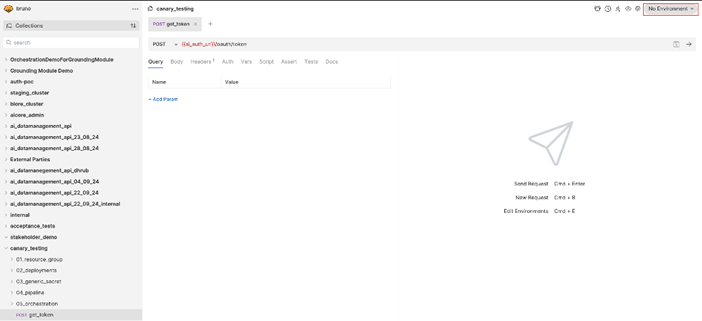

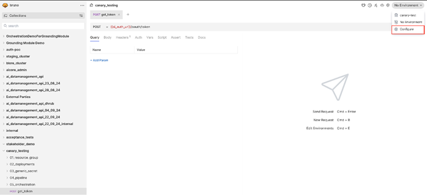

•	Set the values inside environment canary-test

-	Populate values from the service key into the following variables:
    - **ai_auth_url**
    - **ai_api_url**
    - **client_id**
    - **client_secret**

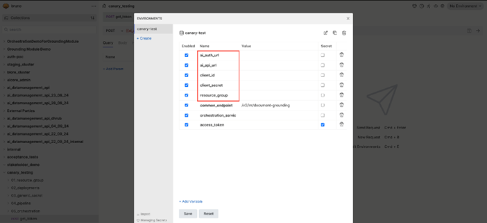

•	Add a resource group name at **resource_group**

•	Save the configuration and set the active environment to canary-test.

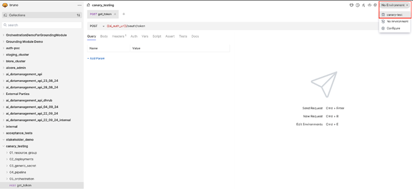

[OPTION END]

[OPTION BEGIN [JavaScript SDK]]

To interact with SAP AI Core using SAP Cloud SDK, you first need to create a service key that grants secure access to your AI Core instance. Follow the step **Set Up Your Environment and Configure Access** in the [tutorial](https://developers.sap.com/tutorials/ai-core-orchestration-consumption.html) to establish your connection.

[OPTION END]

[OPTION BEGIN [Python SDK]]

To interact with SAP AI Core using the python Gen AI SDK, you first need to create a service key that grants secure access to your AI Core instance. 

•  Configure proxy modules by setting up environment variables for AI Core credentials.

•  Replace placeholder values in ~/.aicore/config.json with AI Core service keys from BTP.

•  Optionally, set the AICORE_HOME environment variable to override the default config path.


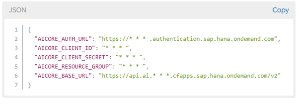

[OPTION END]

### Generate token

[OPTION BEGIN [Bruno]]

- This step generates an access token, required for authenticating API requests during the process.
    - Select the get_token request and execute it.
    - **Note**: Regenerate the token if it expires during execution.

[OPTION END]

[OPTION BEGIN [JavaScript SDK]]

As the access token is automatically initially requested and sent with every request to the server, this step is not necessary for the Javascript SDK.

[OPTION END]

[OPTION BEGIN [Python SDK]]

As the access token is automatically initially requested and sent with every request to the server, this step is not necessary for the python SDK.

[OPTION END]

### Create/Update resource group to use grounding module

Resource groups segment workloads and manage resources for specific AI Core services.

To enable document grounding in SAP AI Core, your Resource Group (RG) must include a specific **label**. If you're creating a new RG, add this label during setup. 

[OPTION BEGIN [Bruno]]

  • Expand **01_resource_group** and execute the create request to create a resource group.

```json
{
  "resourceGroupId": "{{resource_group}}",
  "labels": [
    {
      "key": "ext.ai.sap.com/document-grounding",
      "value": "true"
    }
  ]
}
```
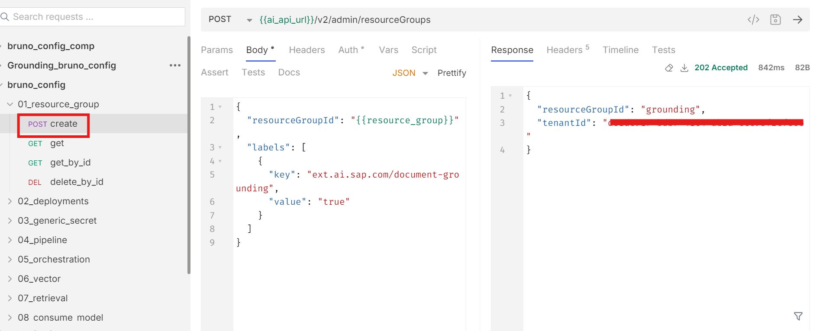

• Verify the group status using the **get_by_id** request to ensure it is **PROVISIONED**.

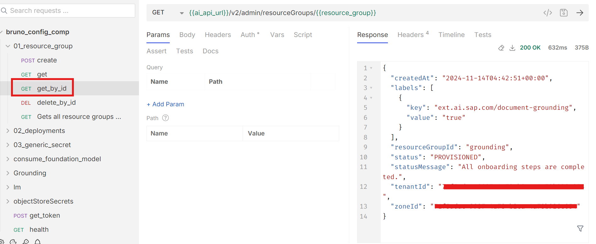

**Note:**
If you're using an existing RG, you can patch it with the label to activate grounding support.

Send a PATCH request to the endpoint :

{{apiurl}}/v2/admin/resourceGroups/{{resource_group_name}} with the body:

```json
{
  "resourceGroupId": "<ID of your resource group>",
  "labels": [
    {
      "key": "ext.ai.sap.com/document-grounding",
      "value": "true"
    }
  ]
}
```

[OPTION END]

[OPTION BEGIN [AI Launchpad]]

•  In the **Workspaces** app, choose the **AI API connection**.

•  Open the **SAP AI Core Administration** app and choose **Resource Groups**.

•  The **Resource Groups** screen appears with a tile for each existing **resource group**.

•  Choose Create  to create reference details for a new resource group.

•  Complete the fields in the Create **Resource Group** dialog box.

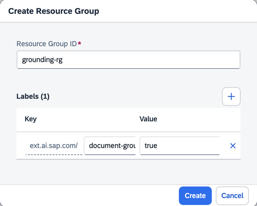

• Enter a **resource group ID**.

**Note:** Ensure that the resource group ID is unique. If the ID is not unique and is currently in use, then the new resource group and its details will overwrite the existing resource group.

• Choose the **subaccount_id** label key and enter a value.

• Choose the **zone_id** label key and enter a value.

• Choose the **instance_id** label key and enter a value.

• Enter the **document-grounding** label key and enter the value true.

• If additional labels are required, enter their keys and corresponding values.

• Choose **Create** to create the **resource group**.

• The All Resource Groups screen appears and shows the **new resource group**.

[OPTION END]

[OPTION BEGIN [JavaScript SDK]]

In this step, we will create a resource group in SAP AI Core using the [`@sap-ai-sdk/ai-api`](https://github.com/SAP/ai-sdk-js/tree/main/packages/ai-api) package of the SAP Cloud SDK for AI (JavaScript). For more information, refer to the official [documentation](https://sap.github.io/ai-sdk/docs/js/ai-core/ai-api).

**NOTE**: In order to use the document grounding service, the resource group must be created with the document grounding label set to `true`. Therefore, existing resource groups without the label will not work for document grounding.

• To start, install the dependency in your project.

```
npm install @sap-ai-sdk/ai-api
```

• Add the following code to your project to create a resource group.

```javascript
import { ResourceGroupApi } from '@sap-ai-sdk/ai-api';

const RESOURCE_GROUP  = '<RESOURCEGROUP>' // Please change to your desired ID

// Create resource group using ResourceGroupApi
async function createResourceGroup() {
    try {
      const response = await ResourceGroupApi.
        kubesubmitV4ResourcegroupsCreate({
            resourceGroupId: RESOURCE_GROUP,
            labels: [
                {
                key: 'ext.ai.sap.com/document-grounding',
                value: 'true',
                }
            ]
        }).execute();
        return response.resourceGroupId;
    } catch (error: any) {
      console.error('Error while creating Resource Group:', error.stack);
    }
}

const resourceGroupId = await createResourceGroup();
console.log("Created Resource Group with ID: ", resourceGroupId)
```

[OPTION END]

[OPTION BEGIN [Python SDK]]

Create a resource group in SAP AI Core. Please note that for using the document grounding service, your request must contain the document grounding **label** set to **true**. Therefore, existing resource groups without the label won't work. 

```Python
from ai_core_sdk.models.resource_group import Label

# Name of the resource group to create
resource_group = "<RESOURCEGROUP>" 

labels = [
    Label(
        key="ext.ai.sap.com/document-grounding",
        value="true"
    )
]

# Create Resource Group
try:
    rg = ai_core_client.resource_groups.create(
        resource_group_id = resource_group,
        labels = labels
    )
    print("Created resource group:", rg.resource_group_id)
except Exception as e:
    if "already exists" in str(e):
        print(f"Resource group '{resource_group}' already exists")
    else:
        raise
```

[OPTION END]

### Create generic secret

This step is required only if you are using external document repositories such as Amazon S3 or Microsoft SharePoint for grounding.

**Note:**

* If you do not want to use an external document repository, and instead plan to use chunks data then use Vector API and generate embeddings and store in vector database. In this scenario you can **SKIP** this step entirely.
* There are other options such as **SFTP** is also supported. But currently in the tutorial we are not covering it.

A Generic Secret securely stores credentials for your document repository in SAP AI Core. These secrets are later used while creating the knowledge base (data repository) using the Pipeline API.


**👉 Which one to create?**

Create the generic secret for SharePoint or S3 based on the document repository you plan to use for your grounding documents.

🔸 If you're using Microsoft SharePoint:

Follow the instructions to create a secret with the required base64-encoded SharePoint credentials.

🔸 If you're using Amazon S3:

Use the AWS CLI to configure your bucket and provide the base64-encoded credentials in the secret payload.

Proceed directly to creating collections using the Vector API if you're not working with S3 or SharePoint or SFTP.

[OPTION BEGIN [Bruno]]

#### **Generic secret for sharepoint (option-1)**

Generic secrets securely store SharePoint credentials required for document access

•	Expand **03_generic_secret** and select create request

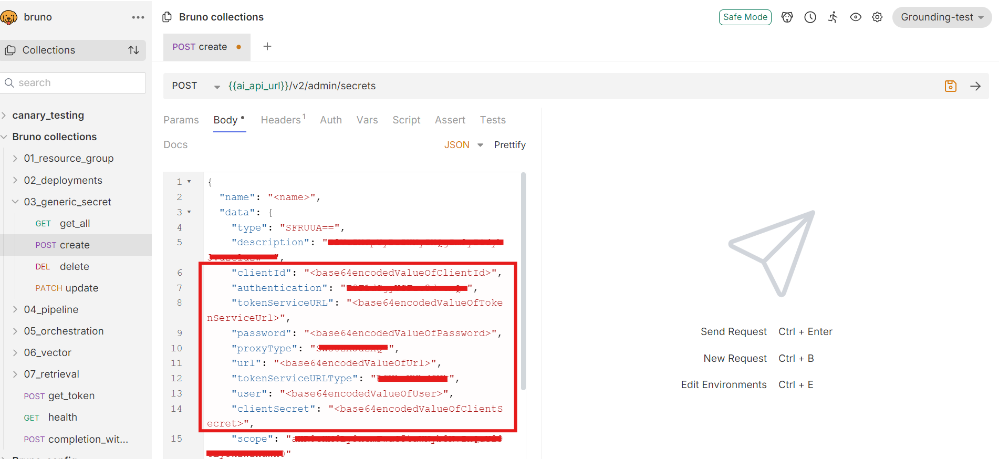

•	Please refer to point 2 under https://help.sap.com/docs/joule/integrating-joule-with-sap/configure-access-from-sap-btp?locale=en-US for reference values of MS SharePoint credentials

•	Update **clientId**, **tokenServiceURL**, **password**, **url**, **user** and **clientSecret** according MS SharePoint credentials

•	To prepare your own SharePoint  Create SharePoint Site (optional, you can re-use an existing site if you have one) 

  1.	Create a Group and a Technical User (optional, existing can be reused)
  2.	Register an Application, Generate a Client Secret, & Expose the application using web API
  3.	Validate the SharePoint access with the Technical User

•	All values needs to be provided as base 64 encoded values

#### **Generic secret for AWS S3 (option-2)**

Generic secrets securely store AWS S3 credentials required for document access

•	Expand **03_generic_secret** and select create request

Use the below payload to create a secret for AWS S3 with NoAuthentication as authentication type.

```CODE
{
  "name": "<generic secret name>",                        // Name of the generic secret to be created
  "data": {
    "url": "<url>",                                       // Base64-encoded value in the format https://s3.<region>.amazonaws.com
    "authentication": "Tm9BdXRoZW50aWNhdGlvbg=",          // Base64 encoded value for NoAuthentication
    "description": "<description of generic secret>",     // Base64 encoded description of the secret
    "access_key_id": "<access key id>",                   // Base64 encoded value of access key id
    "bucket": "<bucket>",                                 // Base64 encoded value of bucket name
    "host": "<host>",                                     // Base64 encoded value of host
    "region": "<region>",                                 // Base64 encoded value of region
    "secret_access_key": "<secret access key>",           // Base64 encoded value of secret access key
    "username": "<username>",                             // Base64 encoded value of username
    "type": "SFRUUA==",                                   // [Optional] Base64 encoded value for HTTP
    "proxyType": "SW50ZXJuZXQ=",                          // [Optional] Base64 encoded value for Internet
  },
  "labels": [
    {
      "key": "ext.ai.sap.com/document-grounding",         // Label for Document Grounding feature
      "value": "true"
    },
    {
      "key": "ext.ai.sap.com/documentRepositoryType",     // Label for Document Repository Type
      "value": "S3"
    }
  ]
}
```

• Ensure that all values in the data dictionary are Base64-encoded as per AWS S3 credential requirements.

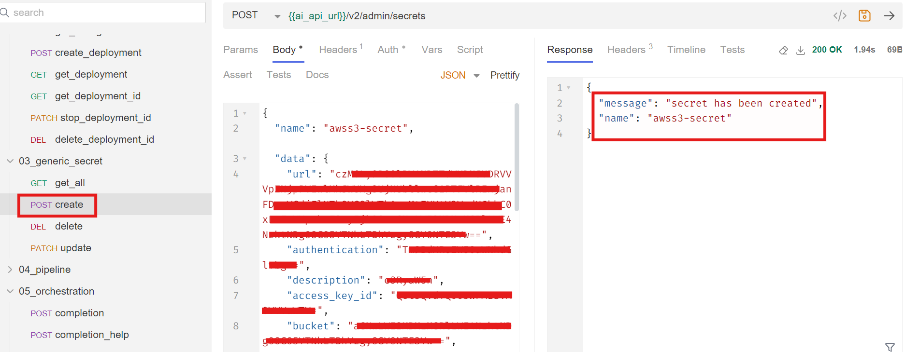

[OPTION END]

[OPTION BEGIN [AI Launchpad]]

#### **Generic secret for sharepoint (option-1)**

1. In the **Workspaces** app, choose the AI API connection.

2. If you want to add your secret at the resource group level, choose the resource group. Alternatively you can use the toggles in the header or dialog box, where you will be prompted to specify a resource group.

3. Open the **SAP AI Core Administration app** and choose **Generic Secrets**. The Generic Secrets screen appears with a tile for each existing secret.

4. Choose **Add** to enter reference details for a new secret.

5. Complete the fields in the Add Generic Secret dialog box as follows:

    - Switch between tenant-level secrets and resource-group-level secrets

    - If your secret is at the resource-group level: confirm the resource group. To change the resource group, choose  (Change Value). Enter a name for the secret. Secret names must comply with the following criteria:

        - Contain only lowercase alphanumeric characters, hyphens (-), or numbers

        - Do not start or end with a hyphen (-)

    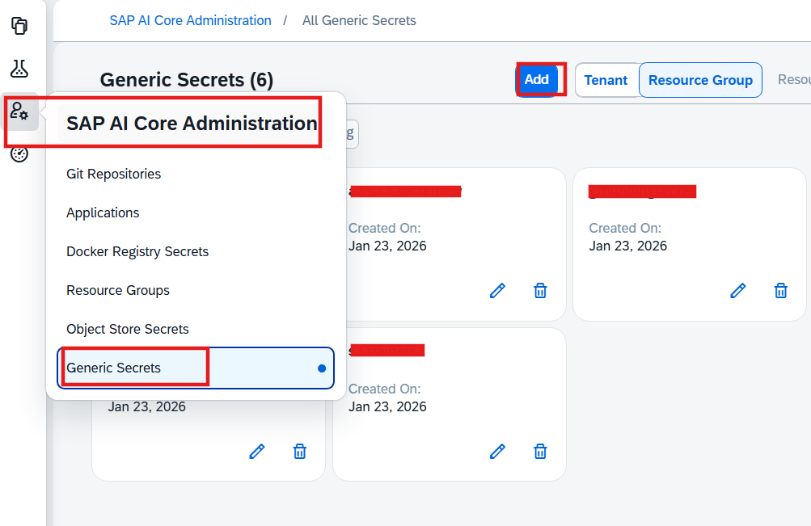

    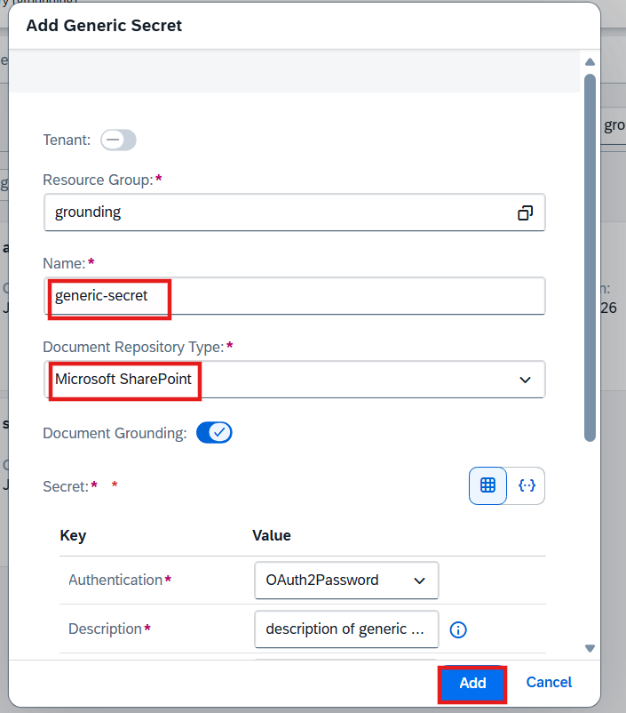

    • Enter the secret in JSON format. For example:

    ```CODE
      {

      "type": "SFRUUA==",

      "description": "<description of generic secret>",

      "clientId": "<client id>",

      "authentication": "<AUTHENTICATION>",

      "tokenServiceURL": "<token service url>",

      "password": "<password>",

      "proxyType": "<PROXY>",

      "url": "<URL>",

      "tokenServiceURLType": "<TOKENSERVICE URL>",

      "user": "<user>",

      "clientSecret": "<client secret>",

      "scope": "SCOPE",

      "labels": [

      {

      "key": "ext.ai.sap.com/document-grounding",

      "value": "true"

      }

      ]

      }
    ```

#### **Generic secret for AWS S3 (option-2)**

1. **Open the Workspaces app** and choose the **AI API connection**.

2. If needed, toggle between **tenant-level** and **resource-group-level** secret creation.

3. Navigate to the **SAP AI Core Administration** app and go to **Generic Secrets**.

4. Choose **Add** to create a new secret.

5. Fill out the form as follows:
   - **Resource Group**: `<your-resource-group>`
   - **Name**: `aws-credentials-1`
   - **Secret (JSON format)**:
  
```json
  {
    "access_key_id": "<YOUR_AWS_ACCESS_KEY_ID>",
    "secret_access_key": "<YOUR_AWS_SECRET_ACCESS_KEY>",
    "bucket": "<YOUR_BUCKET_NAME>",
    "host": "<YOUR_S3_HOST_URL>",
    "region": "<YOUR_AWS_REGION>",
    "url": "<FULL_S3_ENDPOINT_URL>",
    "username": "<OPTIONAL_USER_IDENTIFIER>",
    "authentication": "NoAuthentication",
    "description": "AWS S3 credentials for document grounding",
    "type": "HTTP",
    "proxyType": "Internet"
  }
```

**Labels**

Add the following key-value pairs as labels:
| Key                                             | Value |
|--------------------------------------------------|-------|
| ext.ai.sap.com/document-grounding              | true  |
| ext.ai.sap.com/documentRepositoryType          | S3    |


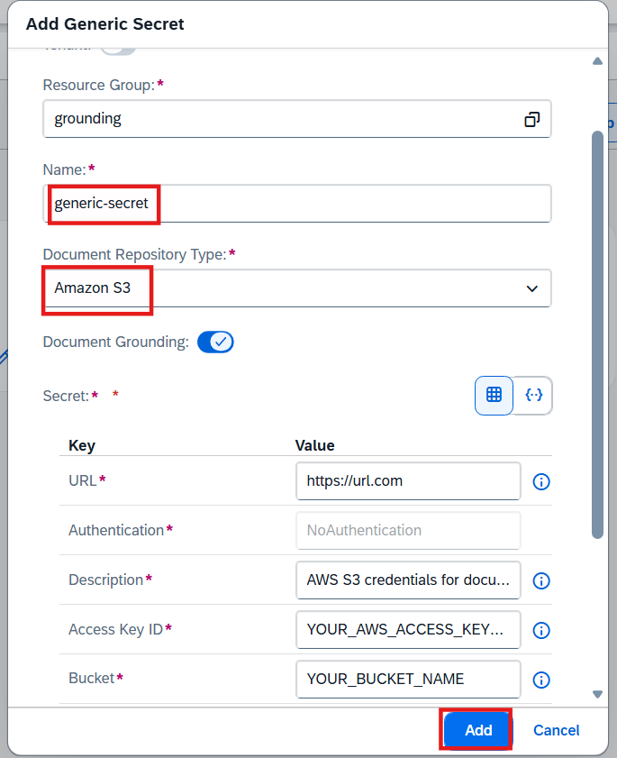


1. Click Add to save the secret.

[OPTION END]

[OPTION BEGIN [JavaScript SDK]]

In this step, we will create a generic secret in SAP AI Core using the [`@sap-ai-sdk/ai-api`](https://github.com/SAP/ai-sdk-js/tree/main/packages/ai-api) package of the SAP Cloud SDK for AI (JavaScript). For more information, refer to the official [documentation](https://sap.github.io/ai-sdk/docs/js/ai-core/ai-api).

#### **Generic secret for sharepoint (option-1)**

This step specifically creates a secret in SAP AI Core that stores Base64-encoded credentials for SharePoint access, securely enabling document grounding workflows via Microsoft Graph.

```javascript
import { SecretApi } from '@sap-ai-sdk/ai-api';

// Create Secret using SecretApi
async function createGenericSecret() {
    try {
        const response = await SecretApi.kubesubmitV4GenericSecretsCreate({
          name: 'canary-rg1-secret',
          data: {
            type: 'SFRUUA==',
            description: '<DESCRIPTION_OF_GENERIC_SECRET>',
            clientId: '<CLIENT_ID>',
            authentication: '<AUTHENTICATION>',
            tokenServiceURL: '<TOKEN_SERVICE_URL>',
            password: '<PASSWORD>',
            proxyType: '<PROXY>',
            url: '<URL>',
            tokenServiceURLType: '<TOKEN_SERVICE_URL_TYPE>',
            user: '<USER>',
            clientSecret: '<CLIENT_SECRET>',
            scope: '<SCOPE>'
          },
          labels: [
            {
              key: 'ext.ai.sap.com/document-grounding',
              value: 'true',
            },
          ],
        }).execute();
        return response;
    } catch (error: any) {
        console.error('Error while creating Resource Group:', error.stack);
    }
}

const secret = await createGenericSecret();
console.log(secret?.message)
```

#### **Generic secret for AWS S3 (option-2)**

Generic secrets securely store S3 credentials required for document access. Please change the values as per your AWS S3 credentials.

```javascript
import { SecretApi } from '@sap-ai-sdk/ai-api';

async function createS3GenericSecret() {
  try {
    const response = await SecretApi.kubesubmitV4GenericSecretsCreate(
      {
        name: 's3-grounding-secret',
        data:  {
              description: "<description of generic secret>",
              url: "<url>",
              authentication: "Tm9BdXRoZW50aWNhdGlvbg==",
              access_key_id: "<access key id>",
              secret_access_key: "<secret access key>",
              bucket: "<bucket>",
              region: "<region>",
              host: "<host>",
              username: "<username>" ,
              type: "SFRUUA==",
              proxyType: "<PROXY>" 
            },
        labels: [
          {
            key: 'ext.ai.sap.com/document-grounding',
            value: 'true'
          },
          {
            key: 'ext.ai.sap.com/documentRepositoryType',
            value: 'S3'
          }
        ]
      },
      {
        'AI-Resource-Group': '<resource_group>'
      }
    ).execute();

    console.log('✅ S3 Generic Secret created:', response.name);
    return response;
  } catch (error: any) {
    console.error(
      '❌ Error while creating S3 Generic Secret:',
      error.cause?.response?.data || error.message
    );
  }
}

await createS3GenericSecret();
```

[OPTION END]

[OPTION BEGIN [Python]]

In this step, we will create a generic secret in SAP AI Core using the SAP Cloud SDK for AI (Python). For more information, refer to the official [documentation](https://help.sap.com/docs/sap-ai-core/generative-ai/generic-secrets-for-grounding-e1a201c1fc2e4eb3a570efd81a3b3616?q=document+grounding)

#### **Generic secret for sharepoint (option-1)**

This step specifically creates a secret in SAP AI Core that stores Base64-encoded credentials for SharePoint access, securely enabling document grounding workflows via Microsoft Graph.

```Python
json_data = {
    'name': '<generic secret name>',
    'data': {
        'description': '<description of generic secret>',
        'clientId': '<client id>',
        'authentication': 'T0F1dGgyUGFzc3dvcmQ=',
        'tokenServiceURL': '<token service url>',
        'password': '<password>',
        'url': 'aHR0cHM6Ly9ncmFwaC5taWNyb3NvZnQuY29t',
        'tokenServiceURLType': 'RGVkaWNhdGVk',
        'user': '<user>',
        'clientSecret': '<client secret>',
        'scope': 'aHR0cHM6Ly9ncmFwaC5taWNyb3NvZnQuY29tLy5kZWZhdWx0',
    },
    'labels': [
        {
            'key': 'ext.ai.sap.com/document-grounding',
            'value': 'true',
        },
    ],
}

secret = requests.post(f'{AI_API_URL}/v2/admin/secrets', headers=headers, json=json_data)

secret.json()
```

#### **Generic secret for AWS S3 (option-2)**

Generic secrets securely store S3 credentials required for document access. Please change the values as per your AWS S3 credentials.

```Python
# Prepare secret payload
secret_payload = {
    "name": "<generic secret name>",
    "data": {  
        "description": "<description of generic secret>",
        "url": "<url>",
        "authentication": "Tm9BdXRoZW50aWNhdGlvbg==",
        "access_key_id": "<access key id>",
        "secret_access_key": "<secret access key>",
        "bucket": "<bucket>",
        "region": "<region>",
        "host": "<host>",
        "username": "<username>"
    },
    "labels": [
        {
            "key": "ext.ai.sap.com/document-grounding",
            "value": "true"
        },
         {
            "key": "ext.ai.sap.com/documentRepositoryType",
            "value": "S3"
        }
    ]
}

# Create secret
response = requests.post(f"{AI_API_URL}/v2/admin/secrets", headers=headers, json=secret_payload)
print("Secret creation:", response.status_code, response.text)
```

[OPTION END]

### Data Ingestion from Document Repositories via Pipeline API

Choose your data repository type and set up the integration.

In the tutorial, currently we are covering the document repositories:

* Microsoft Sharepoint
* AWS S3

This step covers, fetching documents from a supported data source(Sharepoint, S3, SFTP etc), preprocessing and creating chunks of those documents, and stores their semantic embeddings in the HANA Vector Store.

#### Create Pipeline

In this use case, we have added facility management emails as grounding documents, uploading them to the designated SharePoint folder. I’m attaching the sample email folder [sample_emails.zip] (img/sample_emails.zip) used in this scenario. For practice, you can also use these emails if needed.

[OPTION BEGIN [Bruno]]

#### If you are using MSSharePoint as a document repository [Option-1]

•	**Expand 04_pipeline** and select **create_pipeline** request

•	Replace value **generic_secret_name** with generic secret name created in step 6.

•	Replace value **sharepoint_site_name** with site name of MS SharePoint.

•	Replace value **folder_name** with the name of the folder from which the documents have to be taken.Multiple folder names can be specified.

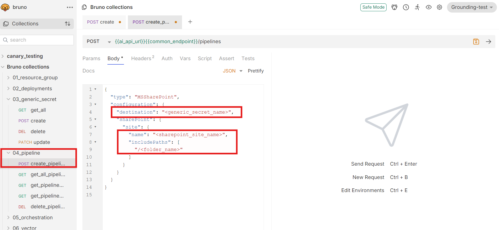


#### If you are using AWS S3 as a document repository [Option-2]

**Expand 04_pipeline** and select **create_pipeline** request

Use the below payload to create a pipeline for AWS S3.

```CODE
{
  "type": "S3",
  "configuration": {
    "destination": "<generic secret name>"  // Name of the generic secret created for S3
  },
  "metadata": {                             // [Optional]
    "destination": "<generic secret name>", // Name of the generic secret created for S3 MetaData Server
  }
}
```
•	Replace value **generic_secret_name** with generic secret name created in step 8.

**Note:**'metadata' is an optional field which takes the destination name created for the s3 metadata server.

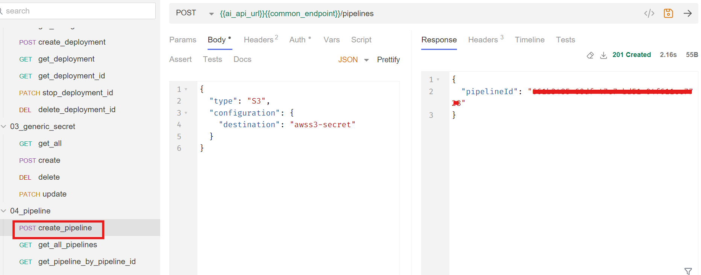


How to upload document to AWS S3 using AWS CLI?

**Note:** Download and install AWS CLI from the AWS CLI official page.

Open Command Prompt and configure AWS CLI with your credentials:

Enter your Access Key, Secret Key, Region, and Output Format when prompted.

```COPY
aws configure
```
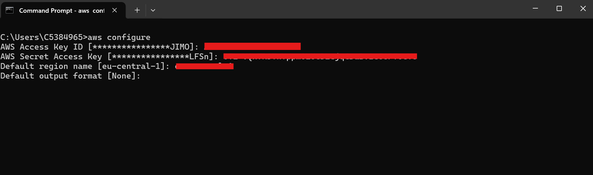

**Upload a Document to AWS S3**

To upload a grounding document to an S3 bucket, use:

```CODE
aws s3 cp <local-file-path> s3://<bucket-name>/<folder-name>/
```

**Verify File Upload**

To check if the file is uploaded successfully, list the contents of the folder:

```CODE
aws s3 ls s3://<bucket-name>/<folder-name>/
```
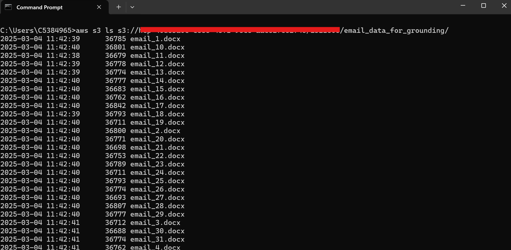

#### Get Pipeline by Pipeline ID

This request fetches details of a specific pipeline using its unique ID. It is useful for verifying the configuration and settings of a particular pipeline.

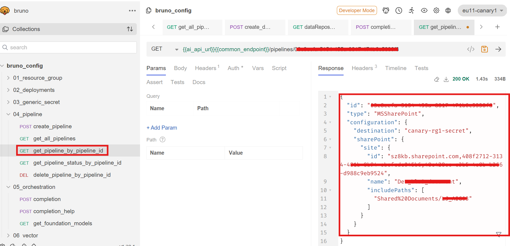

#### Get Pipeline Status by Pipeline ID

This request checks the current status of a specific pipeline, such as whether it is running, completed, or failed. It helps in tracking the execution progress.

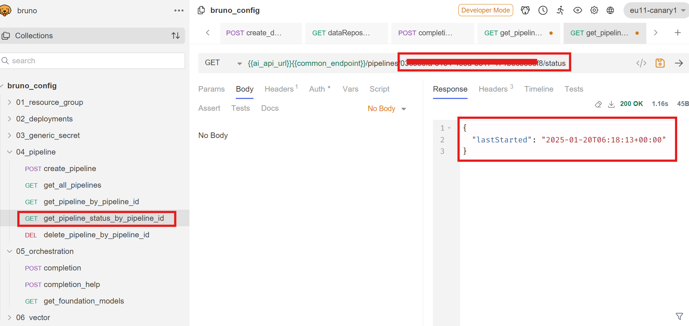
 
Once the pipeline is successfully created, documents uploaded in SharePoint are converted into vectors via APIs. The conversion process can be validated upon successful pipeline execution.

[OPTION END]

[OPTION BEGIN [AI Launchpad]]

To enable document grounding, the next step is to **create a Data Repository** in SAP Generative AI Hub using the secrets you configured earlier Step.

#### **Navigation Path**

In the **SAP AI Launchpad**:

1. Navigate to **Generative AI Hub** from the side menu.
2. Click on **Grounding Management**.
3. Click **Create** to open the *Create Data Repository* wizard.

#### 🔹 Option 1: Microsoft SharePoint Configuration

> 📸 _Refer to Screenshot: SharePoint Setup (see below)_

1. In the **Create Data Repository** form:
   - **Embedding Model**: Leave as default (`Text Embedding 3 Large`).
   - **Document Store Type**: Select `MSSharePoint`.
   - **Document Grounding Generic Secret**: Select the secret you created in **Step 5**.
   - **Document Store Name**: Provide a name for your repository. For example:  
     ```
     Dev_blr3_document
     ```
   - **Include Paths**: Enter the SharePoint folder path that contains your documents to test grounding.  
     Example:
     ```
     SharedDocuments/Sample_docs/UA_test
     ```

2. Click **Create** to finalize the setup.

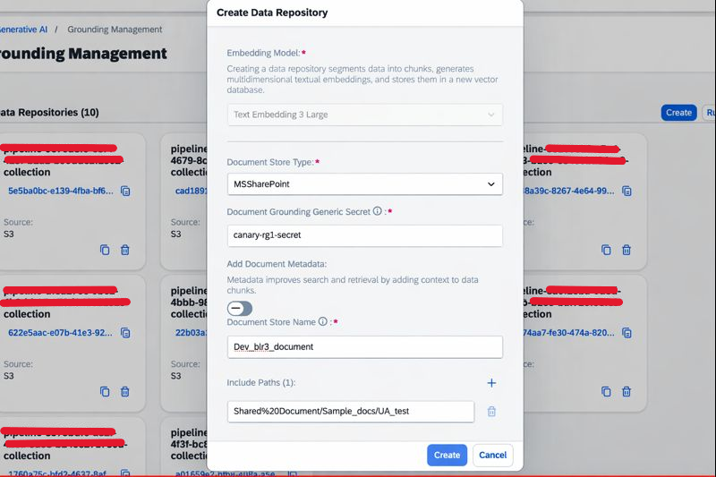

---

#### 🔹 Option 2: AWS S3 Configuration

> 📸 _Refer to Screenshot: S3 Setup (see below)_

1. In the **Create Data Repository** form:
   - **Embedding Model**: Leave as default (`Text Embedding 3 Large`).
   - **Document Store Type**: Select `S3`.
   - **Document Grounding Generic Secret**: Select the AWS secret you created in **Step 5** (e.g., `aws-credentials-1`).

2. Once selected, you're ready to proceed. The required S3 bucket, region, and credentials are handled through the secret.

3. Click **Create** to finish.

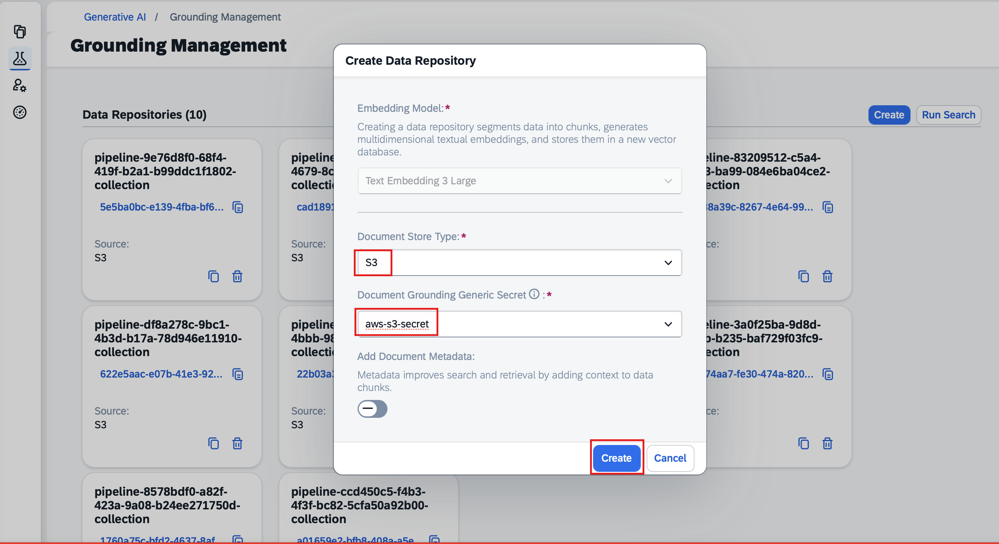

---

> ✅ After completing this step, your knowledge base (data repository) will be linked to your document source. The documents will be embedded and made available for grounding in the chat experience.

[OPTION END]

[OPTION BEGIN [JavaScript SDK]]

We are creating a document-grounding pipeline using SAP AI Core. The pipeline is configured to integrate with Microsoft SharePoint as a data source, enabling AI-driven document processing. This setup allows seamless ingestion of documents from a specified SharePoint site, ensuring efficient data retrieval and processing.

**Note:** For this step, we are using the [document grounding module](https://sap.github.io/ai-sdk/docs/js/ai-core/document-grounding) of the SDK so make sure to add the dependency to your project. 

```javascript
// Request body for pipeline creation request
const pipelineRequest: PipelinePostRequst = {
  type: 'MSSharePoint',
  configuration: {
    destination: '<generic secret name>',
    sharePoint: {
      site: {
        name: '<sharepoint site name>',
        includePaths: ['/<folder name>']
      }
    }
  }
};

// Create the pipeline
const pipeline = await PipelinesApi.createPipeline(pipelineRequest, {
  'AI-Resource-Group': RESOURCE_GROUP
}).execute();

console.log('Created Pipeline with ID: ', pipeline.pipelineId);
```

[OPTION END]

[OPTION BEGIN [Python SDK]]

we are creating a document-grounding pipeline using SAP AI Core. The pipeline is configured to integrate with AWS S3 as a data source, enabling AI-driven document processing. This setup allows seamless ingestion of documents from a specified S3 data storage, ensuring efficient data retrieval and processing.

```Python
from gen_ai_hub.proxy import get_proxy_client
from gen_ai_hub.document_grounding.client import PipelineAPIClient
from gen_ai_hub.document_grounding.models.pipeline import S3PipelineCreateRequest, CommonConfiguration

aicore_client = get_proxy_client()
pipelines_api_client = PipelineAPIClient(aicore_client)
generic_secret_s3_bucket = "<S3 GENERIC SECRET NAME>"
s3_config = S3PipelineCreateRequest(configuration=CommonConfiguration(destination=generic_secret_s3_bucket))
response = pipelines_api_client.create_pipeline(s3_config)
print(f"Reference the Vector knowledge base using the pipeline ID: {response.pipelineId}")
# check the status of the vectorization pipeline until it is completed
print(pipelines_api_client.get_pipeline_status(response.pipelineId))
```

[OPTION END]

### Data Ingestion of Chunks via Vector API

Vector API processes the chunks provided by user and stores their semantic embeddings in collections.

[OPTION BEGIN [Bruno]]

#### Create collection

• Expand 06_vector and select create_collections request.

• Replace value <collection_name> with the required collection name.

• The metadata can be an array of key-value pairs to have some additional information.

**Note:** Currently supported modelName is only text-embedding-ada-002-v2.

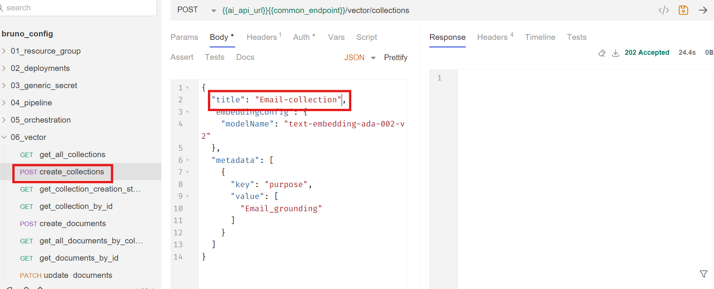

#### Create documents

• Click on the create_document request and replace the path parameter with the valid collection ID.

• Replace value <metadata_key> with the required key of metadata and put corresponding values to it.  Multiple metadata can be specified here.

• Replace values <chunk_1>, <chunk_2> with the required chunk of the documents. Add multiple chunks   based on the requirement. The metadata can also be specified for each chunk.

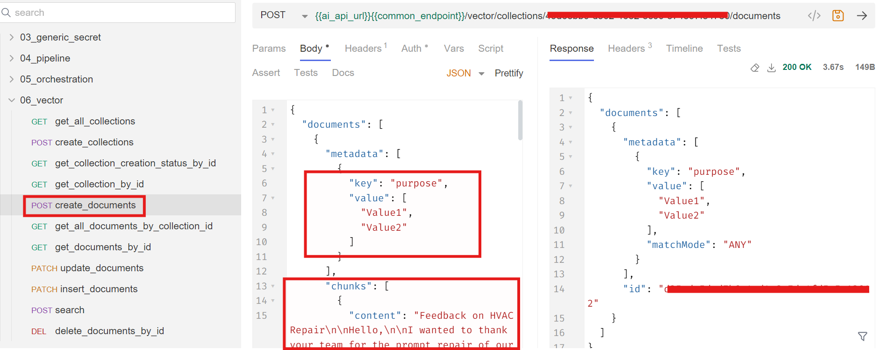

#### Verifying Vector Processing (Optional)

These steps help inspect vector collections and documents to confirm successful processing.

 • **get_collection_creation_status_by_id** – Checks whether the collection was created successfully.

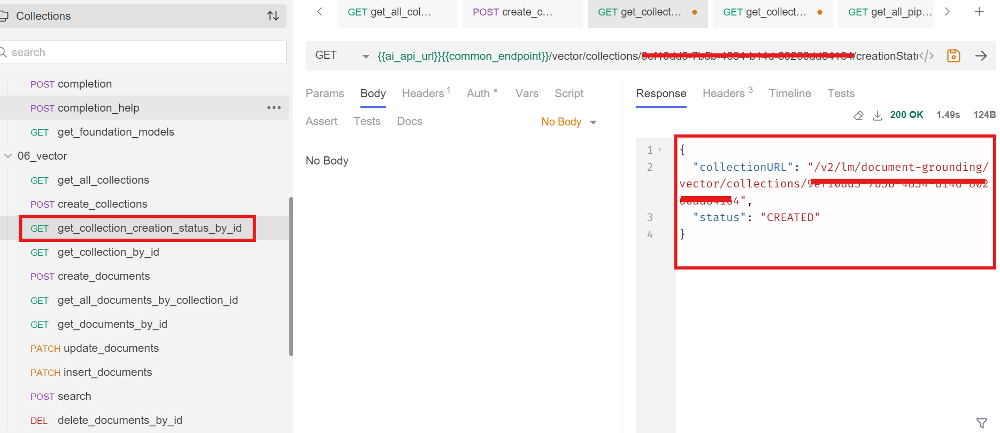

 • **get_collection_by_id** – Retrieves detailed information about a specific collection

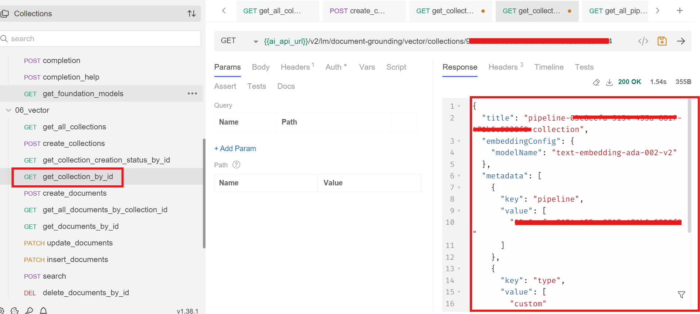

 • **get_documents_by_id** – Fetches specific documents within a collection for debugging

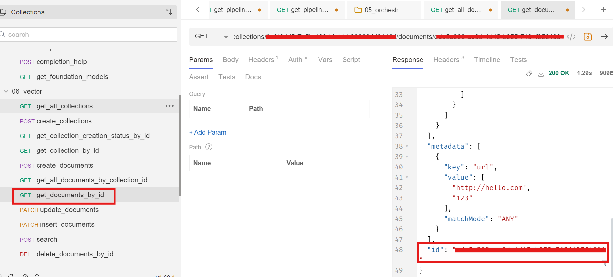

[OPTION END]

### Get Data Repository ID

[OPTION BEGIN [Bruno]]

This ID uniquely identifies the knowledge base (data repository) created using either Pipeline API or Vector API. It is required during retrieval and orchestration steps to fetch relevant grounded content.

 • **dataRepositories** - List all the collection of Data repositories 

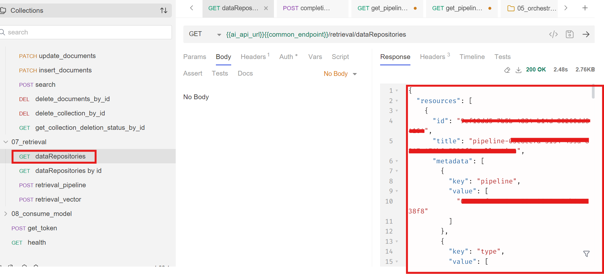

 • **dataRepositories by id** – Fetches details of a specific repository for targeted debugging.

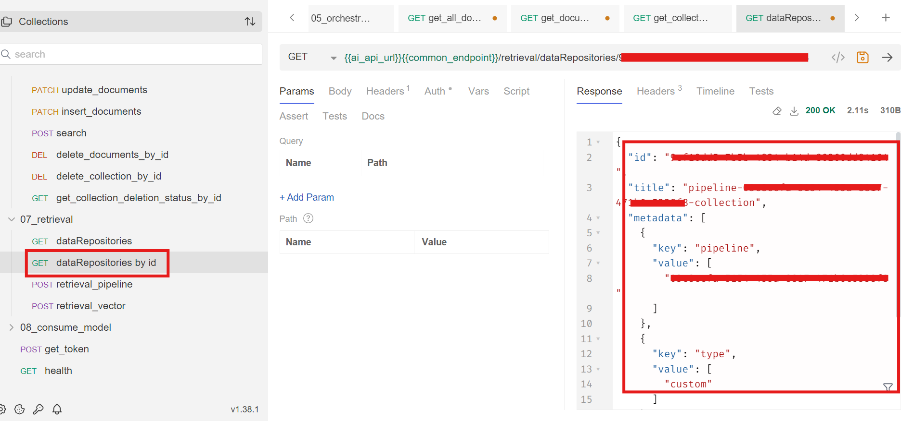

[OPTION END]

### Retrieval Search Without Orchestration - Optional Step

If you only want to test semantic matching from the data repository without involving LLM inference or orchestration, you can use this standalone retrieval search option.

**Steps:**

  • Again, navigate to **07_retrieval** in Bruno.

  • Use **retrieval_vector** to get relevant chunks.

  • Simply provide your **search query** and the **data repository ID(s)** in the request

  • **Analyze the chunks** field in the response.

This is useful for **debugging retrieval quality** before plugging into a larger pipeline.

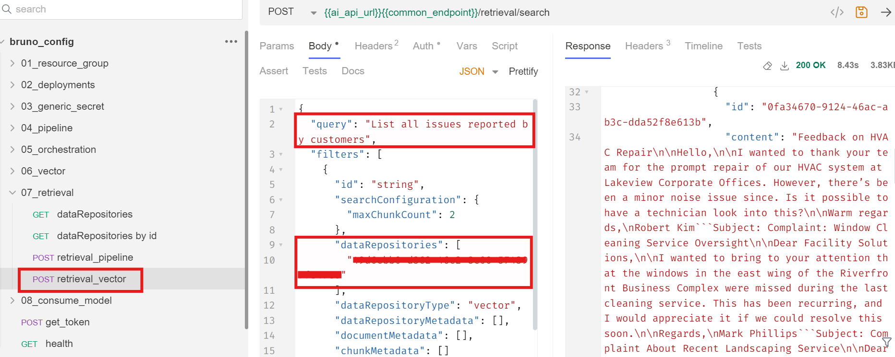

### Get or create orchestration deployment

Before beginning inference, make sure:

An orchestration deployment with scenario ID: orchestration is RUNNING.

Use the get_deployment API (under the "Deployments" section in the Bruno collection) to confirm the deployment.

Update the orchestration_service_url in your environment variables accordingly.

NOTE: If you don’t have an orchestration deployment or would like to refer GET Deployment steps, refer to "Create Configuration for Orchestration Deployment" step in this tutorial [tutorial] (https://developers.sap.com/tutorials/ai-core-orchestration-consumption.html#130d0b6a-6d86-4505-9a80-6d268f9e2e51).

### Configure Grounding Module in Orchestration Workflow

[OPTION BEGIN [Bruno]] 

Once your data repository is created (via Pipeline API or Vector API), you can configure orchestration to enable grounded responses. Regardless of the ingestion method, the orchestration module uses the Data Repository ID to retrieve relevant content and inject it into the prompt for context-aware generation.

**Steps:**

• Expand 05_orchestration in the Bruno collection.

• Use the completion request.

• provide the Data Repository ID in the "groundingRequest" section of the request body.

• The orchestration will automatically query the referenced data repository and fetch contextual information.

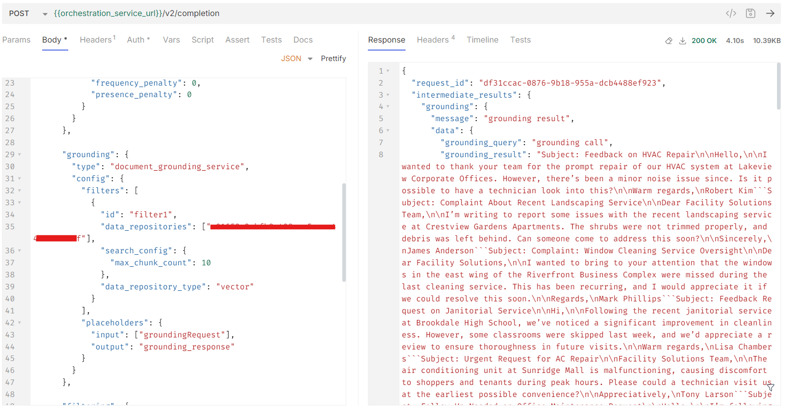

[OPTION END]

[OPTION BEGIN [AI Launchpad]]

Grounding is a crucial step in orchestration that ensures responses are enriched with relevant and accurate data from predefined sources. This section explains how grounding works in the AI Launchpad.

**Input Variables**

Input variables are parameters sent to the grounding service to facilitate data retrieval. These variables can be referenced in the template definition, allowing dynamic data incorporation based on user inputs.

**Output Variable**

The output variable holds the retrieved data from the grounding service. This data can then be utilized in the template definition to generate contextual and informed responses.

**Selected Sources**

You can specify the repositories from which the grounding module retrieves information. If no specific repositories are selected, grounding will include all available sources by default. Selecting relevant sources ensures precise and domain-specific data retrieval for improved orchestration outcomes.

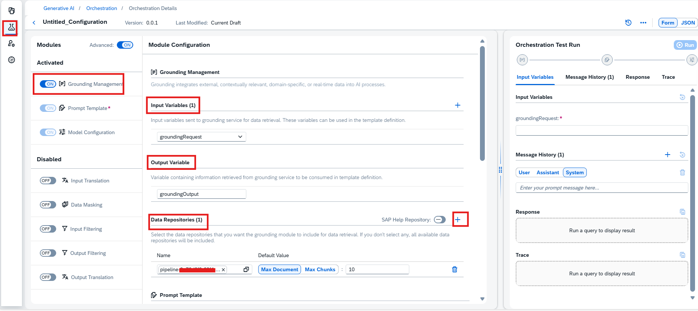

**Templating**

Templating enables you to define structured prompts and system messages for the generative AI model. Using placeholders like {{?groundingRequest}} and {{?groundingOutput}}, you can dynamically customize inputs for grounding-based data retrieval. These placeholders must follow naming rules and can have default values for testing. If no default value is set, the workflow prompts for input during execution.

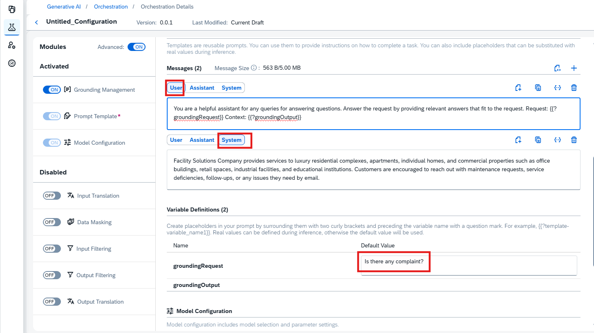

**Model configuration**

Model configuration allows you to select the AI model for your workflow. If no model is selected, the default model is used. You can specify additional parameters in JSON format, such as setting the n parameter to receive multiple responses. You can see which models are available within an orchestration deployment by selecting the deployment ID.

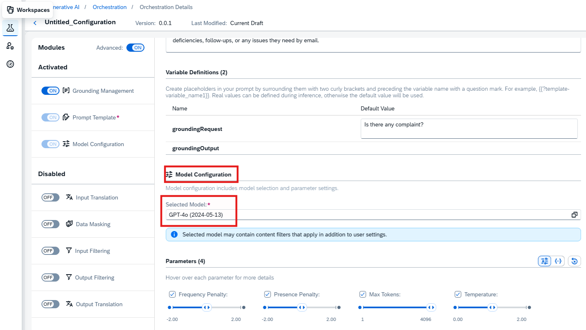

[OPTION END]

[OPTION BEGIN [Javascript SDK]]

We are configuring an AI Orchestration Pipeline using SAP AI Core. The pipeline integrates multiple AI modules to process and refine inputs efficiently. This setup enables **document grounding, LLM processing, templating, and content filtering**, ensuring accurate and safe AI-generated responses.

```javascript
import {
  OrchestrationClient,  buildDocumentGroundingConfig,  buildAzureContentSafetyFilter} 
  from '@sap-ai-sdk/orchestration';

// ---------------------------
// Initialize Orchestration Client
// ---------------------------
const orchestrationClient = new OrchestrationClient({
  promptTemplating: {
    model: {
      name: 'gpt-4o',
      params: {
        max_completion_tokens: 200,
        temperature: 0
      }
    }
  },
  grounding: buildDocumentGroundingConfig({
    placeholders: {
      input: ['groundingRequest'],
      output: 'groundingOutput' 
    },
    filters: [
      {
        id: 'filter1',
        data_repositories: ['a0165**************55f'],
        data_repository_type: 'vector',
        search_config: { max_chunk_count: 20 }
      }
    ]
  }),
  filtering: {
    input: {
      filters: [
        buildAzureContentSafetyFilter({
          Hate: 'ALLOW_SAFE_LOW',
          Violence: 'ALLOW_SAFE_LOW'
        })
      ]
    },
    output: {
      filters: [
        buildAzureContentSafetyFilter({
          Hate: 'ALLOW_SAFE_LOW',
          Violence: 'ALLOW_SAFE_LOW'
        })
      ]
    }
  }
},
{resourceGroup:resourceGroupId}

);
```
[OPTION END]

[OPTION BEGIN [ Python SDK]]

We are configuring an AI Orchestration Pipeline using SAP AI Core. The pipeline integrates multiple AI modules to process and refine inputs efficiently. This setup enables **document grounding, LLM processing, templating, and content filtering**, ensuring accurate and safe AI-generated responses.

``` python
from gen_ai_hub.proxy import get_proxy_client
from gen_ai_hub.orchestration_v2.models.message import SystemMessage, UserMessage
from gen_ai_hub.orchestration_v2.models.template import Template
from gen_ai_hub.orchestration_v2.service import OrchestrationService

# Set up Orchestration Service (V2)
proxy_client = get_proxy_client()
orchestration_service = OrchestrationService(proxy_client)

# Runtime input for the orchestration pipeline
template = Template(
    template=[
            SystemMessage(content="""Facility Solutions Company provides services to luxury residential complexes, 
                apartments, individual homes, and commercial properties such as office buildings, 
                retail spaces, industrial facilities, and educational institutions. 
                Customers are encouraged to reach out with maintenance requests, service deficiencies, 
                follow-ups, or any issues they need by email."""),
        UserMessage(content="""You are a helpful assistant for any queries for answering questions. 
                Answer the request by providing relevant answers that fit to the request.\n\n
                Request: {{ ?user_query }}\n
                Context: {{ ?grounding_response }}""")
    ]
)

from gen_ai_hub.orchestration_v2.models.llm_model_details import LLMModelDetails

llm = LLMModelDetails(name="gpt-4o", params={"max_completion_tokens": 2048})

from gen_ai_hub.orchestration_v2.models.document_grounding import (GroundingModuleConfig,GroundingType,
DocumentGroundingFilter,DataRepositoryType,DocumentGroundingConfig,DocumentGroundingPlaceholders,GroundingSearchConfig)

filters=[DocumentGroundingFilter(id="vector",
                                   data_repositories=["a0165*************10855f"],
                                   data_repository_type=DataRepositoryType.VECTOR.value,
                                   search_config= GroundingSearchConfig(max_chunk_count=20)
                                   )]


placeholders = DocumentGroundingPlaceholders(
    input=["user_query"],
    output="grounding_response"
)

# Grounding module config
grounding_config = GroundingModuleConfig(
    type=GroundingType.DOCUMENT_GROUNDING_SERVICE.value,
    config=DocumentGroundingConfig(
        filters=filters,
        placeholders=placeholders
    )
)
```

[OPTION END]

### Run Orchestration with Prompt to Get Context-aware Response

[OPTION BEGIN [Bruno]]

Once orchestration is configured with grounding, you can now send prompts via the orchestration API or SDKs. The configured grounding module will fetch enterprise context dynamically and enrich the prompt, enabling the LLM to generate accurate and context-aware responses. Use this approach in production scenarios for precise Q&A and insights based on your internal data.

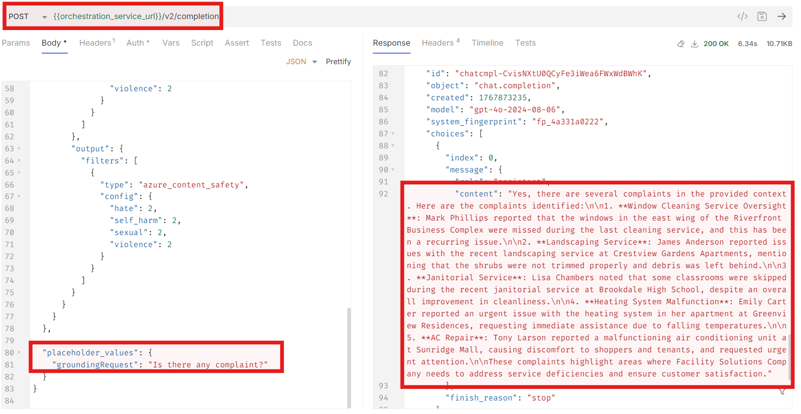

[OPTION END]

[OPTION BEGIN [AI Launchpad]]

**Orchestration Workflow**

After you have built your orchestration workflow, you can test it to generate output from your chosen model.

1. Navigate to the Orchestration Test Run section

2. click on **Run** to view the responses

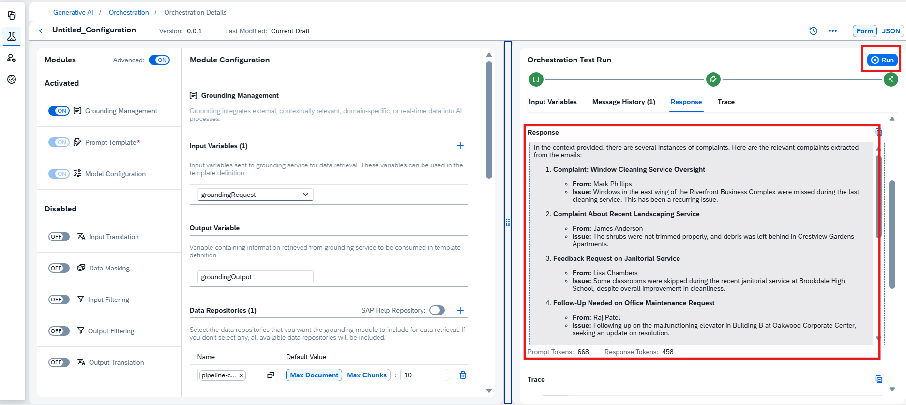

You can also save the created orchestration for future use as shown in image

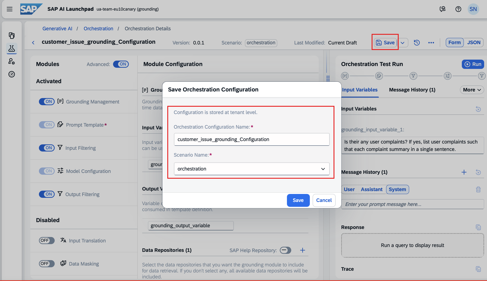

[OPTION END]

[OPTION BEGIN [JavaScript SDK]]

The configuration defines a document grounding module that retrieves relevant context from a vector-based repository, a GPT-4o model for response generation, a templating module to structure responses, and Azure Content Safety filters to ensure compliance and content moderation. This orchestration streamlines AI-driven summarization while maintaining reliability and security.

```javascript
// Send Chat Completion Request

const response = await orchestrationClient.chatCompletion({
  messages: [
    {
            role: 'system',
            content: `Facility Solutions Company provides services to luxury residential complexes, apartments,
individual homes, and commercial properties such as office buildings, retail spaces, industrial facilities, and educational institutions.
Customers are encouraged to reach out with maintenance requests, service deficiencies, follow-ups, or any issues they need by email.`
          },
          {
            role: 'user',
            content: `You are a helpful assistant for any queries.
Answer the request by providing relevant answers that fit the request.
Request: {{ ?groundingRequest }}
Context: {{ ?groundingOutput }}`
          }
  ],
  placeholderValues: {
    groundingRequest: 'Is there any complaint from customers?'
  }
},
);

// ---------------------------
// Output Response
// ---------------------------
console.log(response.getContent());
```
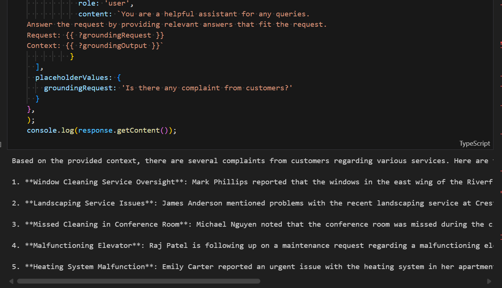

[OPTION END]

[OPTION BEGIN [ Python SDK]]

The configuration defines a document grounding module that retrieves relevant context from a vector-based repository, a GPT-4o model for response generation, a templating module to structure responses, and Azure Content Safety filters to ensure compliance and content moderation. This orchestration streamlines AI-driven summarization while maintaining reliability and security.

``` python
from gen_ai_hub.orchestration_v2.models.template import PromptTemplatingModuleConfig
from gen_ai_hub.orchestration_v2.models.config import ModuleConfig, OrchestrationConfig
from gen_ai_hub.proxy import get_proxy_client
from gen_ai_hub.orchestration_v2.service import OrchestrationService

proxy_client = get_proxy_client()

prompt_template = PromptTemplatingModuleConfig(prompt=template,
                                               model=llm)

module_config = ModuleConfig(prompt_templating=prompt_template, grounding = grounding_config)

config = OrchestrationConfig(modules=module_config)

orchestration_service = OrchestrationService(
    proxy_client=proxy_client,
    config=config
)

response = orchestration_service.run(placeholder_values={"user_query": "Is there any complaint?"})
print(response.final_result.choices[0].message.content)
```

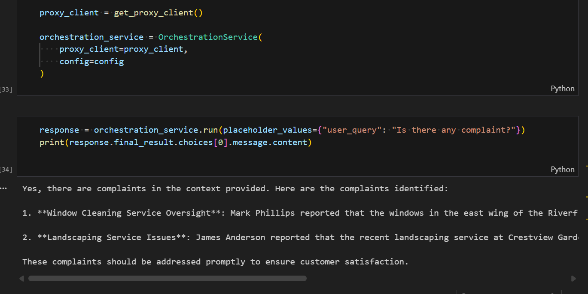

[OPTION END]

### Conclusion

Adding Grounding significantly enhances the model's ability to provide Accurate and Context-specific responses. Without Grounding, the model generates generic replies, while with grounding, it retrieves precise information from the uploaded document. Screenshots showcasing both responses are provided for comparison.
