## Prerequisites
  - You have completed an execution in SAP AI Core. [See tutorial](group.ai-core-aiapi-postman-get-started)
  - You have python3+ and pip installed on your local system.

## Details
### You will learn
  - How to store model accuracy using Postman or Python in SAP AI Core

Using **Execution** in SAP AI Core, you can train a ML model and even do batch-inferencing on data. In this tutorial you will learn to store the model performance indicators after the execution has been completed. The steps demonstrated help you store any type of indicators, accuracy, mean-squared-loss or even your own custom information about the execution.

All the steps demonstrated here, will only send request to SAP AI Core from your local system to store metrics about an execution. Hence needs to be performed after your execution has been completed.

---

[ACCORDION-BEGIN [Step 1: ](Create client)]

Install `SAP AI Core SDK` to use APIs available for using SAP AI Core functionalities.

```BASH
pip install ai-core-sdk
```

!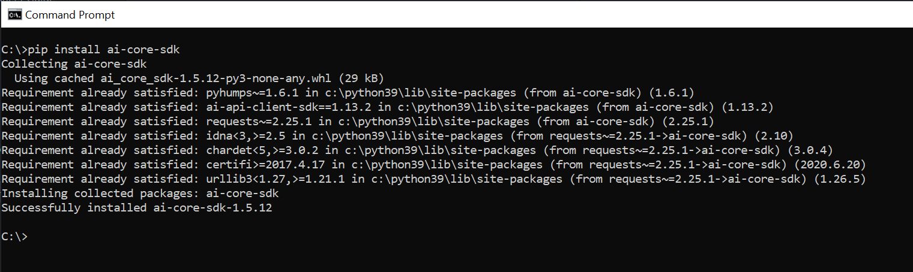

Replace with your SAP AI Core credentials and execute. This creates client to make API call to  SAP AI Core.

```PYTHON[5, 7, 9, 11]
from ai_core_sdk.ai_core_v2_client import AICoreV2Client

ai_core_client = AICoreV2Client(
    # `AI_API_URL`
    base_url = "https://api.ai.ml.hana.ondemand.com" + "/v2", # The present SAP AI Core API version is 2
    # `URL`
    auth_url=  "https://tutorial.authentication.sap.hana.ondemand.com" + "/oauth/token",
    # `clientid`
    client_id = "ab-cdefg-111-12233!h7777|aicore!1111",
    # `clientsecret`
    client_secret = "qwertyiop="
)
```

!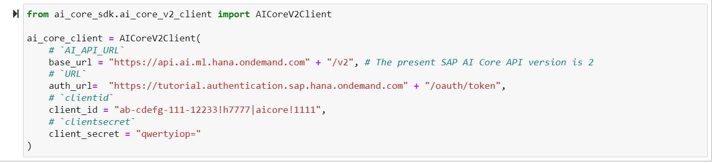


[DONE]
[ACCORDION-END]

[ACCORDION-BEGIN [Step 2: ](List executions)]

List all executions of your **resource group**.

Change the `resource_group` and execute.

```PYTHON[3]

# list executions
response = ai_core_client.execution.query(
    resource_group = "tutorial"
)

for execution in response.resources:
    print("Execution ID: ", execution.id)
    print("Executable Details: ", execution.__dict__)
    print("---")

```

!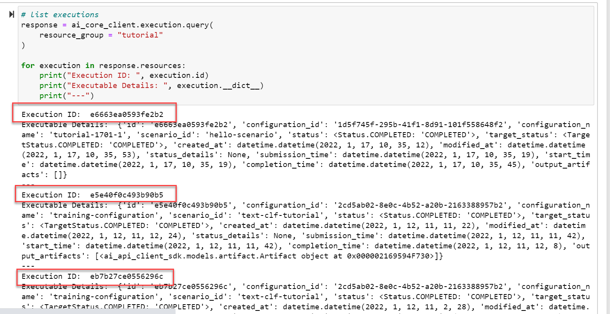

Identify the execution ID for which you want to create metrics. Use this execution ID and resource group throughout this tutorial.

[DONE]
[ACCORDION-END]

[ACCORDION-BEGIN [Step 3: ](Add tags)]

Tags are any qualitative information to attach to your execution. You can associate multiple tags having custom information to an execution.

Change the `execution_id` and execute.

```PYTHON[5, 8, 9]
from ai_core_sdk.models import MetricTag

ai_core_client.metrics.modify(
    resource_group = "tutorial",
    execution_id = "e6663ea0593fe2b2", # Change this
    tags = [
        # list
        MetricTag(name="Our Team Tag", value="Tutorial Team"),
        MetricTag(name="Stage", value="Development")
    ]    
)
```

View stored metrics.

```PYTHON[5]
response = ai_core_client.metrics.query(
    resource_group = "tutorial",
    execution_ids = [
        # list of executions
        "e6663ea0593fe2b2"  # Change this
    ],
)

for execution in response.resources:
    print("Execution ID:", execution.execution_id)
    print("Tags:")
    for tag in execution.tags:
        print(" Name: ", tag.name)
        print("  Value: ", tag.value)
        print("  ")
    print('')
```


!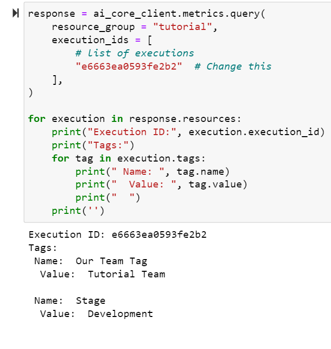

Alternatively, view over SAP AI Launchpad.

!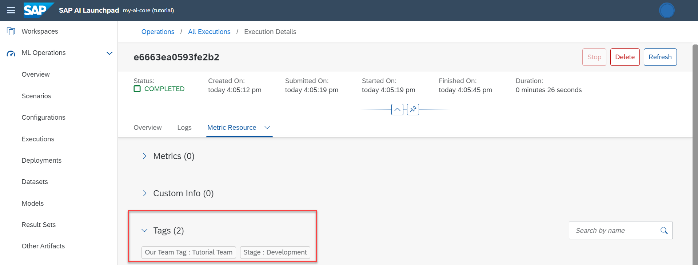

[DONE]
[ACCORDION-END]

[ACCORDION-BEGIN [Step 4: ](Add basic metric)]

A basic metric will have a **name**, **value** and **timestamp**.

Example usage of **step** and **labels** are explained in other steps.

Change the `execution_id` and execute.

```PYTHON[5, 7-16]
from ai_core_sdk.models import Metric
from datetime import datetime

ai_core_client.metrics.modify(
    resource_group = "tutorial",
    execution_id = "e6663ea0593fe2b2", # Change this
    metrics = [
        # list of Metric object
         Metric(
            name="Accuracy",
            value=float(86.99),
            timestamp= datetime.now().utcnow(), # ensure in UTC, easier for local time conversion
            step = 0,
            labels = []
        ),
    ]    
)
```

The code creates an object of class **Metric** with name of a metric as `Accuracy`. Then passes this object to `metric` parameter of metric of the `.metrics.modify` function to update metrics information in your SAP AI Core instance.

You may either supply list of multiple metrics in a single function call or in separate function calls, in all cases the update will append over existing metrics information.

View stored metrics.

```PYTHON[5]
response = ai_core_client.metrics.query(
    resource_group = "tutorial",
    execution_ids = [
        # list of executions
        "e6663ea0593fe2b2"  # Change this
    ],
)

for execution in response.resources:
    print("Execution ID:", execution.execution_id)
    print("Metrics")
    for metric in execution.metrics:
        print(" Name: ", metric.name)
        print("  Value: ", metric.value)
        print("  Timestamp: ", metric.timestamp) # UTC time
    print('')
```

!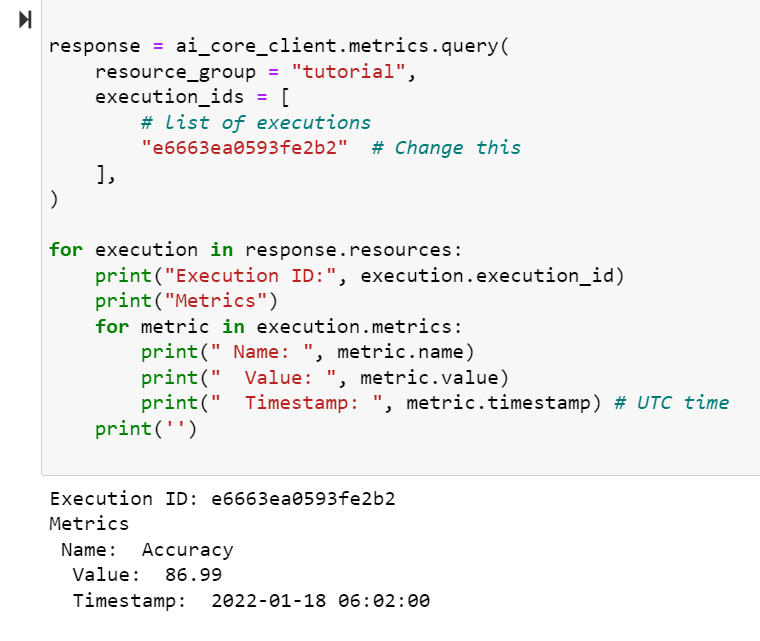

Alternatively, view over SAP AI Launchpad. The **Timestamp** is always converted to local time of the user.

!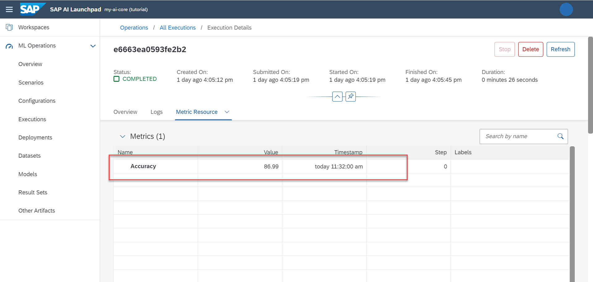

[DONE]
[ACCORDION-END]

[ACCORDION-BEGIN [Step 5: ](Specify epoch or batch)]

Use the **step** parameter, although the metric **name** will remain same.

You may call the function `ai_core_client.metrics.modify` multiple times after each training epoch, each call will be appended new metrics to previous information.

Change the `execution_id` and execute.

```PYTHON[5, 13, 20]
from ai_core_sdk.models import Metric
from datetime import datetime

ai_core_client.metrics.modify(
    resource_group = "tutorial",
    execution_id = "e6663ea0593fe2b2", # Change this
    metrics = [
        # list of Metric object
         Metric(
            name="Training Loss",
            value=float(86.99),
            timestamp= datetime.now().utcnow(),
            step = 1, # denotes epoch 1
            labels = []
        ),
        Metric(
            name="Training Loss",
            value=float(89.00),
            timestamp= datetime.now().utcnow(),
            step = 2, # denotes epoch 2
            labels = []
        ),
    ]    
)
```

View stored metrics.

```PYTHON[5]
response = ai_core_client.metrics.query(
    resource_group = "tutorial",
    execution_ids = [
        # list of executions
        "e6663ea0593fe2b2"  # Change this
    ],
)

for execution in response.resources:
    print("Execution ID:", execution.execution_id)
    print("Metrics")
    for metric in execution.metrics:
        print(" Name: ", metric.name)
        print("  Step: ", metric.step)
        print("  Value: ", metric.value)
        print("  Timestamp: ", metric.timestamp) # UTC time
    print('')

```

!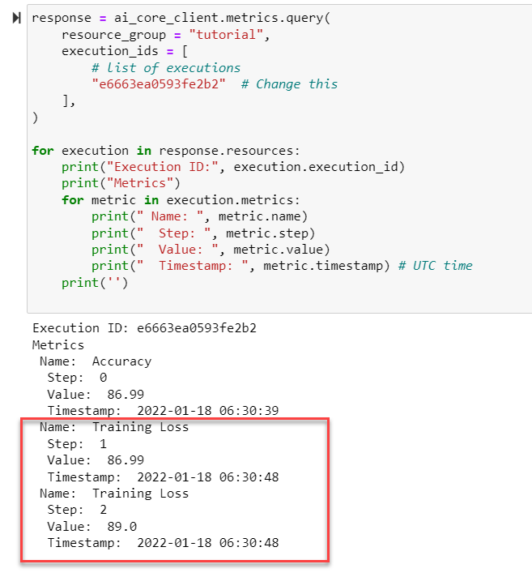

Alternatively, view over SAP AI Launchpad.

!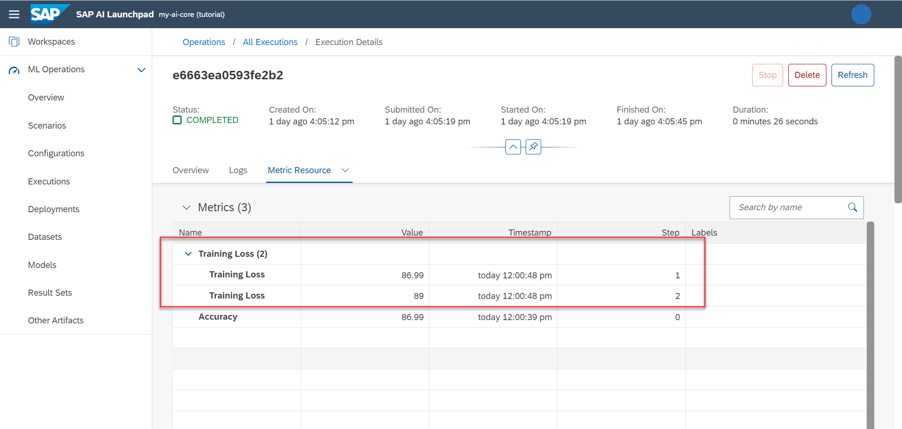

[DONE]
[ACCORDION-END]


[ACCORDION-BEGIN [Step 6: ](Add custom metrics information)]

Any Custom information structure stored as **Character Large Object (CLOB)** and hence must be converted to string `str` type while passing as argument to function call. Here you will store and retrieve a snippet of [classification report](https://scikit-learn.org/stable/modules/generated/sklearn.metrics.classification_report.html) for your model.

Change the `execution_id` and execute.

```PYTHON[5, 12-23]
from ai_core_sdk.models import MetricCustomInfo
from datetime import datetime

ai_core_client.metrics.modify(
    resource_group = "tutorial",
    execution_id = "e6663ea0593fe2b2", # Change this
    custom_info = [
        # list of Custom Information
         MetricCustomInfo(
             name = "My Classification Report",
             # you may convert anything to string and store it
             value = str('''
             {
                 "Cats": {
                     "Precision": 75,
                     "Recall": 74
                 },
                 "Dogs": {
                     "Precision": 85,
                     "Recall": 84
                 }
             }
             '''
             )
        ),
    ]    
)
```

View stored metrics.

```PYTHON[5]
response = ai_core_client.metrics.query(
    resource_group = "tutorial",
    execution_ids = [
        # list of executions
        "e6663ea0593fe2b2"  # Change this
    ],
)

for execution in response.resources:
    print("Execution ID:", execution.execution_id)
    print("Metrics")
    for custom_metric in execution.custom_info:
        print(" Name: ", custom_metric.name)
        print("  Value: ", custom_metric.value)
    print('')
```

!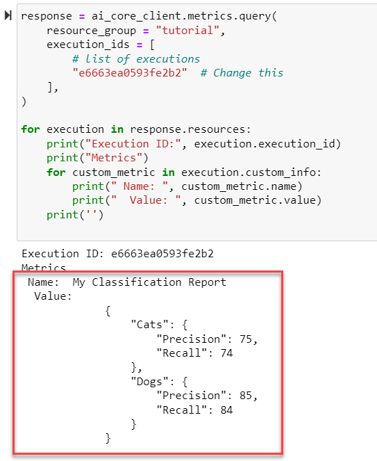

Alternatively, view over SAP AI Launchpad.

!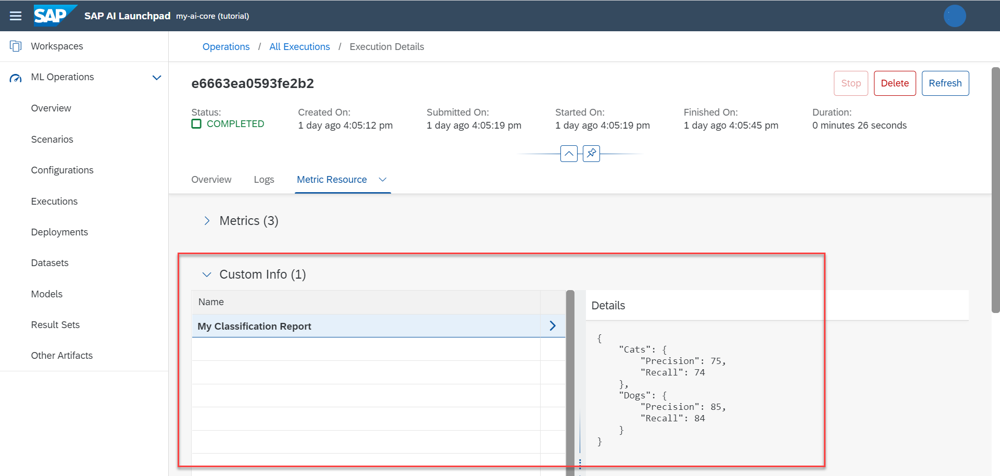

[DONE]
[ACCORDION-END]


[ACCORDION-BEGIN [Step 7: ](Store visualization)]

This step is similar to storing custom metric information. Here you will generate a demo visualization, save visualization locally in **Portable Network Graphics (PNG)** format, which you will load (as bytes) and encode to base64 then convert to string to store it SAP AI Core.

> TIP: Another approach is to store visualization locally in **Scalable Vector Graphics (SVG)** format. The default read format for SVG (in python) is string which is the required format for storing custom metrics in SAP AI Core. Advantage of SVG image is it can be scaled (zoom) without observing blur effect.

Change the `execution_id` and execute.

```PYTHON[25, 28-31]
# Create and save image
import matplotlib.pyplot as plt
y = [75, 73, 68.2, 67.2]
x = ['Q1', 'Q2', 'Q3', 'Q4']
plt.plot(x, y);
plt.xlabel('Validation 2022')
plt.ylabel("Model Accuracy")
plt.title("Scenario: Review Classification")
plt.savefig("performance_viz.png", dpi=300);


# Load the PNG image and encode to base64
import base64
with open ("performance_viz.png", "rb") as file:
    image_bytes = file.read()
    image_b64 = base64.b64encode(image_bytes)
    image_str = image_b64.decode('utf-8')

# Store metrics
from ai_core_sdk.models import MetricCustomInfo
from datetime import datetime

ai_core_client.metrics.modify(
    resource_group = "tutorial",
    execution_id = "e6663ea0593fe2b2", # Change this
    custom_info = [
        # list of Custom Information
         MetricCustomInfo(
             name = "Model Quality Visualization (PNG)",
             # you may convert anything to string and store it
             value = image_str
        ),
    ]    
)
```


View stored visualization. The process is the reverse of storing that is, decoding base64 and viewing.

```PYTHON[5]
response = ai_core_client.metrics.query(
    resource_group = "tutorial",
    execution_ids = [
        # list of executions
        "e6663ea0593fe2b2"  # Change this
    ],
)

for execution in response.resources:
    print("Execution ID:", execution.execution_id)
    print("Metrics")
    for custom_metric in execution.custom_info:
        # Only show metric who
        if "PNG" in custom_metric.name.lower():
            print(" Name: ", custom_metric.name)
            #
            #
            # download, decode base64 and save as PNG image
            base64_img_bytes = response.resources[0].custom_info[3].value.encode('utf-8')
            with open("downloaded_image.png", 'wb') as file_to_save:
                decoded_image_data = base64.decodebytes(base64_img_bytes)
                file_to_save.write(decoded_image_data)

            # Load PNG file and show
            img = plt.imread("downloaded_image.png")
            plt.figure(figsize=(15, 15))
            plt.imshow(img)
            plt.title(custom_metric.name)
            plt.axis("off")
            plt.show()
            #
    print('')
```

!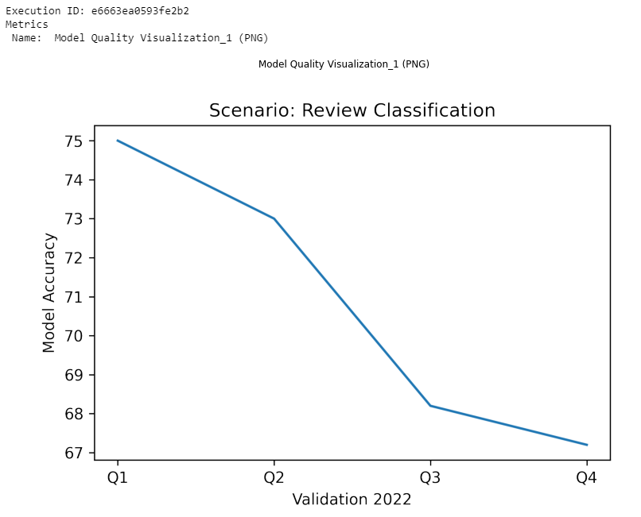

[VALIDATE_7]
[ACCORDION-END]


---
